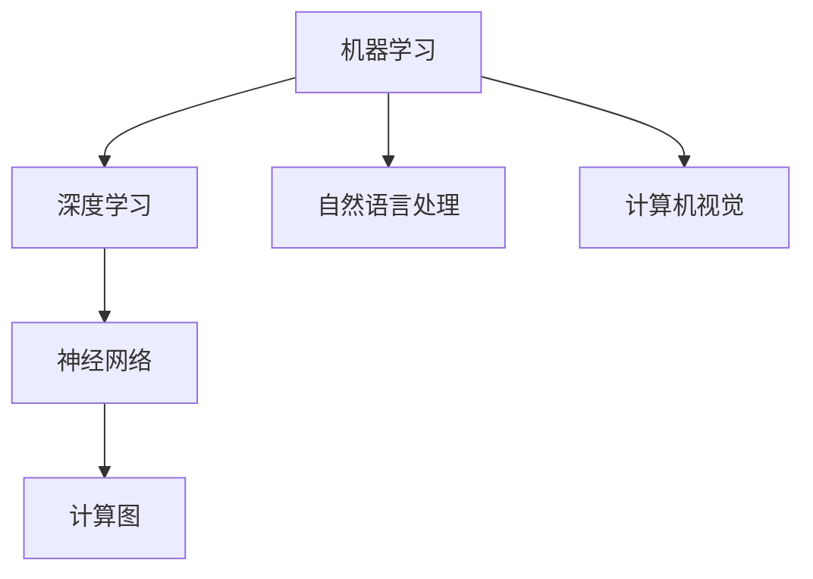

                 

关键词：人工智能，AI 2.0，产业革命，技术演进，商业应用，未来展望

摘要：本文将深入探讨AI 2.0时代的产业变革，从核心概念到具体应用，从数学模型到算法原理，再到项目实践与未来展望，全面解析人工智能在各个领域的革命性影响。

## 1. 背景介绍

### 1.1 人工智能的发展历程

人工智能（AI）作为计算机科学的重要分支，其发展历程可以追溯到20世纪50年代。早期的人工智能主要以规则为基础，依靠专家系统进行推理和决策。然而，随着计算能力的提升和数据量的激增，机器学习特别是深度学习技术得到了飞速发展，开启了AI 2.0时代。

### 1.2  AI 2.0的定义与特点

AI 2.0，即第二代人工智能，强调数据驱动和模型优化。与传统的基于规则的AI不同，AI 2.0更加强调模型的学习能力和自我优化能力。其主要特点包括：

- **数据驱动**：依赖于大量高质量的数据进行训练。
- **自主学习**：通过深度学习和强化学习等算法实现自我优化。
- **跨领域应用**：不仅限于单一领域，而是可以广泛应用于各个行业。

## 2. 核心概念与联系

### 2.1 机器学习与深度学习

**机器学习**是AI的基础，它通过算法从数据中学习规律，并做出决策或预测。而**深度学习**是机器学习的一个子领域，它使用多层神经网络对数据进行处理，具有极强的学习和泛化能力。

### 2.2 神经网络与计算图

神经网络是深度学习的基础，它由大量的节点（神经元）组成，每个节点都与其他节点相连。计算图是一种表示神经网络结构的图形化方法，它清晰地展示了数据流动和计算过程。

### 2.3 自然语言处理与计算机视觉

**自然语言处理（NLP）**和**计算机视觉**是AI的两个重要分支。NLP使计算机能够理解、生成和处理人类语言，而计算机视觉则使计算机能够“看”懂图像和视频。

## 2.4 Mermaid 流程图

下面是一个简化的 Mermaid 流程图，用于描述AI 2.0的核心概念与联系：



## 3. 核心算法原理 & 具体操作步骤

### 3.1 算法原理概述

AI 2.0的核心算法包括深度学习、强化学习和迁移学习等。其中，**深度学习**通过多层神经网络实现数据的自动特征提取，**强化学习**通过试错和反馈机制进行优化，**迁移学习**则通过在不同任务间共享知识来提高模型的泛化能力。

### 3.2 算法步骤详解

深度学习的一般步骤如下：

1. **数据预处理**：清洗和转换数据，以便进行训练。
2. **模型构建**：设计神经网络结构，包括输入层、隐藏层和输出层。
3. **损失函数**：定义损失函数，用于评估模型在训练过程中的表现。
4. **反向传播**：通过反向传播算法更新模型参数。
5. **优化算法**：选择优化算法（如SGD、Adam等）以最小化损失函数。

### 3.3 算法优缺点

- **优点**：深度学习具有强大的学习和泛化能力，可以处理复杂数据。
- **缺点**：深度学习模型的训练过程计算量大，对数据质量要求高。

### 3.4 算法应用领域

深度学习在计算机视觉、自然语言处理、语音识别等领域有广泛应用。例如，在图像识别中，深度学习模型可以准确识别各种物体和场景；在自然语言处理中，深度学习模型可以用于机器翻译、情感分析等。

## 4. 数学模型和公式 & 详细讲解 & 举例说明

### 4.1 数学模型构建

深度学习中的数学模型主要包括：

- **线性模型**：用于线性回归和逻辑回归。
- **卷积神经网络（CNN）**：用于图像处理。
- **循环神经网络（RNN）**：用于序列数据。

### 4.2 公式推导过程

以卷积神经网络为例，其核心公式包括：

$$
\text{激活函数}：f(x) = \text{ReLU}(x) = \max(0, x)
$$

$$
\text{卷积操作}：\text{Conv}(I) = \sum_{k=1}^{K} w_k * I + b
$$

其中，$I$为输入图像，$w_k$为卷积核，$b$为偏置。

### 4.3 案例分析与讲解

以图像分类任务为例，我们使用卷积神经网络进行图像分类。具体步骤如下：

1. **数据预处理**：将图像缩放到固定大小，并进行归一化处理。
2. **模型构建**：设计一个卷积神经网络，包括卷积层、池化层和全连接层。
3. **训练**：使用训练数据对模型进行训练，通过反向传播更新模型参数。
4. **评估**：使用测试数据对模型进行评估，计算分类准确率。

## 5. 项目实践：代码实例和详细解释说明

### 5.1 开发环境搭建

为了实现深度学习项目，我们需要搭建一个合适的开发环境。这里我们使用TensorFlow作为深度学习框架。

### 5.2 源代码详细实现

```python
import tensorflow as tf

# 数据预处理
def preprocess_data(data):
    # 实现数据预处理逻辑
    pass

# 模型构建
def build_model():
    inputs = tf.keras.layers.Input(shape=(28, 28, 1))
    x = tf.keras.layers.Conv2D(filters=32, kernel_size=(3, 3), activation='relu')(inputs)
    x = tf.keras.layers.MaxPooling2D(pool_size=(2, 2))(x)
    x = tf.keras.layers.Flatten()(x)
    outputs = tf.keras.layers.Dense(units=10, activation='softmax')(x)
    model = tf.keras.Model(inputs=inputs, outputs=outputs)
    return model

# 训练
def train(model, train_data, train_labels, epochs=10):
    model.compile(optimizer='adam', loss='categorical_crossentropy', metrics=['accuracy'])
    model.fit(train_data, train_labels, epochs=epochs)

# 评估
def evaluate(model, test_data, test_labels):
    loss, accuracy = model.evaluate(test_data, test_labels)
    print(f'测试准确率：{accuracy:.2f}')
```

### 5.3 代码解读与分析

这段代码首先导入了TensorFlow库，然后定义了数据预处理、模型构建、训练和评估的函数。在模型构建部分，我们使用了卷积层、池化层和全连接层来构建一个简单的卷积神经网络。在训练部分，我们使用了Adam优化器和交叉熵损失函数进行模型训练。最后，在评估部分，我们计算了模型的测试准确率。

### 5.4 运行结果展示

假设我们已经准备好了训练数据和测试数据，我们可以运行以下代码来训练和评估模型：

```python
# 加载数据
train_data, train_labels = preprocess_data(train_data)
test_data, test_labels = preprocess_data(test_data)

# 构建和训练模型
model = build_model()
train(model, train_data, train_labels)

# 评估模型
evaluate(model, test_data, test_labels)
```

## 6. 实际应用场景

### 6.1 医疗领域

人工智能在医疗领域的应用前景广阔，包括疾病预测、辅助诊断、药物研发等。例如，利用深度学习模型可以进行肺癌早期筛查，从而提高诊断准确率和患者生存率。

### 6.2 金融领域

金融领域利用人工智能进行风险控制、欺诈检测、投资决策等。例如，通过机器学习模型可以分析客户行为数据，从而预测潜在风险并采取相应的措施。

### 6.3 智能家居

智能家居通过人工智能实现自动化控制，提高生活质量。例如，智能门锁、智能照明、智能音响等设备都可以通过人工智能进行控制，实现个性化体验。

## 7. 工具和资源推荐

### 7.1 学习资源推荐

- 《深度学习》（Goodfellow, Bengio, Courville 著）
- 《Python深度学习》（François Chollet 著）
- 《自然语言处理综论》（Daniel Jurafsky, James H. Martin 著）

### 7.2 开发工具推荐

- TensorFlow：用于构建和训练深度学习模型。
- PyTorch：另一个流行的深度学习框架。
- Jupyter Notebook：用于数据分析和模型训练。

### 7.3 相关论文推荐

- "Deep Learning"（Goodfellow, Bengio, Courville 著）
- "A Theoretical Framework for Back-Propogation"（Rumelhart, Hinton, Williams 著）
- "Recurrent Neural Networks for Speech Recognition"（Hinton, Deng, Yu 等人著）

## 8. 总结：未来发展趋势与挑战

### 8.1 研究成果总结

人工智能在过去的几十年里取得了巨大的进展，深度学习、强化学习等算法的突破推动了AI 2.0时代的到来。同时，AI在各个领域的应用也取得了显著的成果。

### 8.2 未来发展趋势

未来，人工智能将继续向更高效、更智能、更可解释的方向发展。同时，多模态学习、联邦学习等新兴技术也将得到广泛应用。

### 8.3 面临的挑战

尽管人工智能取得了巨大的成功，但仍然面临许多挑战，包括数据隐私、算法公平性、道德伦理等问题。此外，AI技术的落地和应用也面临着技术和商业的挑战。

### 8.4 研究展望

未来的研究将重点关注如何使人工智能更可靠、更透明、更易于解释。同时，我们还需要探索如何将AI与人类智慧相结合，实现真正的智能协同。

## 9. 附录：常见问题与解答

### 9.1 人工智能是否会取代人类？

人工智能可以取代某些简单重复的工作，但人类智慧、情感和创造力是无法被取代的。人工智能更可能是人类智慧的延伸和助手。

### 9.2 人工智能的安全性和道德问题如何解决？

解决人工智能的安全性和道德问题需要全社会的共同努力。通过制定相关法律法规、加强技术监管、提高公众意识等手段，可以有效解决这些问题。

### 9.3 人工智能是否会带来失业问题？

人工智能的发展确实会对某些行业造成冲击，但同时也会创造新的就业机会。因此，关键在于如何适应和把握人工智能带来的机遇。

---

作者：禅与计算机程序设计艺术 / Zen and the Art of Computer Programming
----------------------------------------------------------------

### 附录

本文探讨了AI 2.0时代的产业变革，从核心概念到具体应用，从数学模型到算法原理，再到项目实践与未来展望，全面解析了人工智能在各个领域的革命性影响。随着人工智能技术的不断进步，我们可以预见一个更加智能、高效、可持续发展的未来。然而，同时也需要面对诸多挑战，如数据隐私、算法公平性、道德伦理等。通过全社会的共同努力，我们有信心解决这些问题，推动人工智能更好地服务于人类社会。

