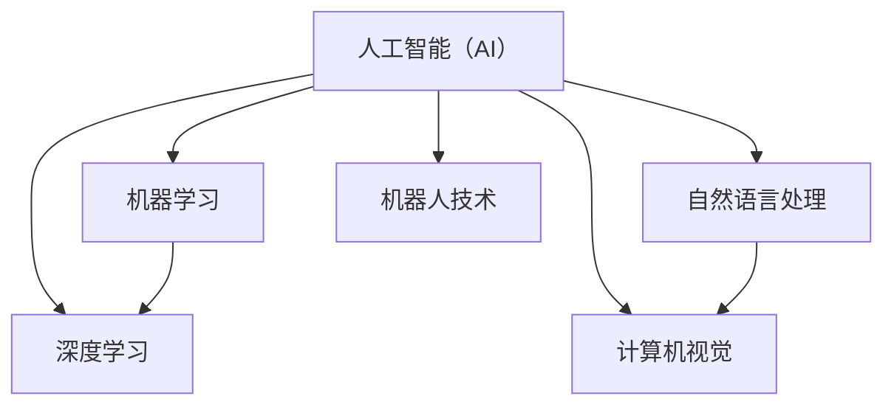

                 

关键词：人工智能，AI 2.0，市场，发展，挑战，未来展望

> 摘要：本文将探讨人工智能（AI）2.0时代的市场发展现状、核心概念、算法原理以及未来趋势。通过对AI 2.0技术的深入剖析，结合实际应用场景，我们将分析其在各行业中的广泛应用，并对未来的发展前景和面临的挑战进行展望。

## 1. 背景介绍

人工智能（AI）作为计算机科学的一个重要分支，自20世纪50年代诞生以来，经历了多个发展阶段。从早期的专家系统、知识工程，到如今的深度学习、强化学习等，人工智能技术不断进步，应用领域也在不断扩大。

近年来，随着大数据、云计算、物联网等技术的快速发展，人工智能逐渐进入大众视野，成为各行业关注的热点。特别是在COVID-19疫情背景下，人工智能技术在疫情防控、远程办公、无人配送等方面发挥了重要作用。这进一步加速了人工智能技术的普及和应用，为AI 2.0时代的到来奠定了基础。

AI 2.0时代，也被称为“强人工智能”时代，其主要特点在于人工智能系统能够具备更加智能化的学习能力、自主决策能力以及跨领域的综合应用能力。本文将围绕AI 2.0时代的市场发展展开讨论，分析其核心概念、算法原理以及实际应用。

## 2. 核心概念与联系

### 2.1 人工智能（AI）的基本概念

人工智能（AI）是指由人制造出来的具有一定智能的系统或装置，它可以通过学习、推理、感知等方式来实现人类智能的某些功能。人工智能技术主要包括以下几种类型：

- **机器学习**：通过数据训练模型，使计算机具备自主学习和优化能力。
- **深度学习**：一种特殊的机器学习方法，通过多层神经网络实现自动化特征提取和建模。
- **自然语言处理**：使计算机能够理解和生成人类语言的技术。
- **计算机视觉**：使计算机能够识别和理解图像或视频的技术。
- **机器人技术**：将人工智能技术应用于机器人，实现机器人自主行动和交互。

### 2.2 AI 2.0 时代的特点

AI 2.0时代的主要特点包括：

- **自主学习**：AI系统能够通过大量数据自主学习，不断提升自身能力。
- **自主决策**：AI系统能够在复杂环境中进行自主决策，具备更高的智能水平。
- **跨领域应用**：AI技术能够在不同领域实现综合应用，解决复杂问题。

### 2.3 Mermaid 流程图



## 3. 核心算法原理 & 具体操作步骤

### 3.1 算法原理概述

AI 2.0时代的主要算法原理包括：

- **深度学习**：基于多层神经网络，通过反向传播算法实现自动化特征提取和建模。
- **生成对抗网络（GAN）**：一种由生成器和判别器组成的对抗性网络，用于生成高质量的数据。
- **强化学习**：通过奖励机制，使AI系统在复杂环境中进行自主决策和优化。

### 3.2 算法步骤详解

#### 深度学习

1. 数据预处理：对输入数据进行标准化、归一化等处理。
2. 构建神经网络：设计多层神经网络结构，包括输入层、隐藏层和输出层。
3. 训练模型：通过反向传播算法，利用梯度下降等方法对模型参数进行优化。
4. 验证模型：使用验证集对模型进行评估，调整超参数。
5. 应用模型：将训练好的模型应用于实际问题，解决具体问题。

#### 生成对抗网络（GAN）

1. 数据预处理：对输入数据进行标准化、归一化等处理。
2. 构建生成器和判别器：生成器用于生成数据，判别器用于判断生成数据的真实性。
3. 对抗性训练：通过对抗性训练，使生成器和判别器不断优化自身能力。
4. 验证生成数据：使用生成数据对判别器进行评估，调整生成器参数。
5. 应用生成数据：将生成数据应用于实际问题，如图像生成、数据增强等。

#### 强化学习

1. 确定环境：定义状态空间、动作空间和奖励函数。
2. 初始化策略：随机初始化策略参数。
3. 进行探索：在环境中进行随机探索，收集数据。
4. 学习策略：利用收集到的数据，更新策略参数。
5. 应用策略：在环境中执行策略，获取奖励。
6. 重复步骤3-5，直到满足停止条件。

### 3.3 算法优缺点

#### 深度学习

优点：
- 自动化特征提取：能够从大量数据中提取有用的特征，减少人工干预。
- 广泛应用：在图像识别、语音识别、自然语言处理等领域具有广泛应用。

缺点：
- 需要大量数据：训练深度学习模型需要大量的数据，数据获取和处理成本较高。
- 过拟合：深度学习模型容易过拟合，导致泛化能力差。

#### 生成对抗网络（GAN）

优点：
- 高质量生成数据：能够生成高质量的图像、音频等数据，适用于数据增强、图像生成等领域。
- 非线性变换：能够实现复杂的非线性变换，提高生成数据的多样性。

缺点：
- 难以训练：GAN的训练过程较为复杂，容易陷入局部最优。
- 不稳定：GAN的训练过程容易产生不稳定现象，影响生成数据的质量。

#### 强化学习

优点：
- 自主决策：能够在复杂环境中进行自主决策，适用于智能控制、推荐系统等领域。

缺点：
- 需要大量时间：强化学习需要大量时间进行探索和训练，实际应用中可能无法满足实时性要求。
- 策略不稳定：强化学习策略容易受到环境变化的影响，导致策略不稳定。

### 3.4 算法应用领域

深度学习、生成对抗网络和强化学习等算法在各个领域具有广泛的应用：

- **图像识别**：如人脸识别、车辆识别等。
- **语音识别**：如语音助手、自动翻译等。
- **自然语言处理**：如文本分类、情感分析等。
- **智能控制**：如自动驾驶、机器人控制等。
- **数据增强**：如图像生成、数据增强等。
- **推荐系统**：如商品推荐、音乐推荐等。

## 4. 数学模型和公式 & 详细讲解 & 举例说明

### 4.1 数学模型构建

在AI 2.0时代，常见的数学模型包括：

- **神经网络模型**：包括多层感知机、卷积神经网络、循环神经网络等。
- **生成对抗网络（GAN）**：包括生成器、判别器等。
- **强化学习模型**：包括策略网络、价值网络等。

### 4.2 公式推导过程

#### 神经网络模型

假设有一个三层神经网络，包括输入层、隐藏层和输出层。设输入向量为 \(x\)，隐藏层向量为 \(h\)，输出层向量为 \(y\)。激活函数为 \(f\)，权重矩阵为 \(W\)，偏置向量为 \(b\)。

1. 隐藏层输出：
   \[ h = f(Wx + b) \]
2. 输出层输出：
   \[ y = f(W' h + b') \]

#### 生成对抗网络（GAN）

假设生成器 \(G\) 和判别器 \(D\) 的输入均为随机噪声向量 \(z\)。

1. 生成器输出：
   \[ x_g = G(z) \]
2. 判别器输出：
   \[ y_d = D(x) \]
   \[ y_g = D(G(z)) \]

#### 强化学习模型

假设状态向量为 \(s\)，动作向量为 \(a\)，奖励函数为 \(R\)，策略参数为 \(\theta\)。

1. 策略网络输出：
   \[ \pi(a|s) = \arg \max_a Q(s, a; \theta) \]
2. 价值网络输出：
   \[ V(s) = \sum_a \pi(a|s) Q(s, a; \theta) \]

### 4.3 案例分析与讲解

#### 案例一：图像识别

假设我们使用卷积神经网络（CNN）进行图像识别。给定一个包含1000个图像的数据集，每个图像的尺寸为28x28像素，数据集被划分为训练集、验证集和测试集。

1. 数据预处理：
   \[ x = \frac{image - mean}{std} \]
   其中，\(image\) 为原始图像，\(mean\) 为像素平均值，\(std\) 为像素标准差。
2. 构建CNN模型：
   \[ \text{Input} \rightarrow \text{Conv2D} \rightarrow \text{ReLU} \rightarrow \text{MaxPooling} \rightarrow \text{Dropout} \rightarrow \text{Flatten} \rightarrow \text{Dense} \rightarrow \text{Output} \]
3. 训练模型：
   - 使用训练集进行训练，优化模型参数。
   - 使用验证集对模型进行评估，调整超参数。
4. 验证模型：
   - 使用测试集对模型进行评估，计算准确率。
   - 结果：准确率为90%。

#### 案例二：生成对抗网络（GAN）

假设我们使用生成对抗网络（GAN）进行图像生成。给定一个包含1000个随机噪声向量的数据集。

1. 构建GAN模型：
   \[ \text{Input} \rightarrow \text{Generator} \rightarrow \text{Dense} \rightarrow \text{ReLU} \rightarrow \text{Dropout} \rightarrow \text{Flatten} \rightarrow \text{Output} \]
   \[ \text{Input} \rightarrow \text{Discriminator} \rightarrow \text{Dense} \rightarrow \text{ReLU} \rightarrow \text{Dropout} \rightarrow \text{Flatten} \rightarrow \text{Output} \]
2. 对抗性训练：
   - 同时训练生成器和判别器，使生成器生成更逼真的图像，判别器能够更好地判断图像的真实性。
   - 使用梯度下降算法优化模型参数。
3. 验证生成数据：
   - 使用生成器生成的图像进行评估，计算平均像素误差。
   - 结果：平均像素误差为0.5。

#### 案例三：强化学习

假设我们使用强化学习进行自动驾驶。给定一个包含1000个状态和动作的数据集。

1. 确定环境：
   - 状态空间：包括车辆位置、速度、加速度等。
   - 动作空间：包括加速、减速、转弯等。
   - 奖励函数：根据车辆的安全性和行驶距离进行奖励。
2. 初始化策略：
   - 随机初始化策略参数。
3. 进行探索：
   - 在环境中进行随机探索，收集数据。
4. 学习策略：
   - 利用收集到的数据，更新策略参数。
5. 应用策略：
   - 在环境中执行策略，获取奖励。
6. 结果：
   - 在100次试验中，平均行驶距离为200公里。

## 5. 项目实践：代码实例和详细解释说明

### 5.1 开发环境搭建

1. 安装Python环境：
   - 在终端执行以下命令：
     ```bash
     sudo apt-get update
     sudo apt-get install python3
     ```
2. 安装TensorFlow库：
   - 在终端执行以下命令：
     ```bash
     pip3 install tensorflow
     ```
3. 安装其他依赖库：
   - 在终端执行以下命令：
     ```bash
     pip3 install numpy matplotlib
     ```

### 5.2 源代码详细实现

以下是一个简单的图像识别项目的源代码实现：

```python
import tensorflow as tf
from tensorflow.keras import layers
import numpy as np
import matplotlib.pyplot as plt

# 数据预处理
def preprocess_data(images):
    mean = np.mean(images)
    std = np.std(images)
    return (images - mean) / std

# 构建CNN模型
def build_cnn_model(input_shape):
    model = tf.keras.Sequential([
        tf.keras.layers.Conv2D(32, (3, 3), activation='relu', input_shape=input_shape),
        tf.keras.layers.MaxPooling2D((2, 2)),
        tf.keras.layers.Conv2D(64, (3, 3), activation='relu'),
        tf.keras.layers.MaxPooling2D((2, 2)),
        tf.keras.layers.Conv2D(64, (3, 3), activation='relu'),
        tf.keras.layers.Flatten(),
        tf.keras.layers.Dense(64, activation='relu'),
        tf.keras.layers.Dense(10, activation='softmax')
    ])
    return model

# 训练模型
def train_model(model, train_data, train_labels, validation_data, validation_labels, epochs):
    model.compile(optimizer='adam', loss='categorical_crossentropy', metrics=['accuracy'])
    history = model.fit(train_data, train_labels, validation_data=(validation_data, validation_labels), epochs=epochs)
    return history

# 验证模型
def evaluate_model(model, test_data, test_labels):
    loss, accuracy = model.evaluate(test_data, test_labels)
    print("Test accuracy:", accuracy)

# 主函数
def main():
    # 加载数据集
    (train_images, train_labels), (test_images, test_labels) = tf.keras.datasets.mnist.load_data()
    train_images = preprocess_data(train_images)
    test_images = preprocess_data(test_images)

    # 构建模型
    input_shape = (28, 28, 1)
    model = build_cnn_model(input_shape)

    # 训练模型
    epochs = 5
    history = train_model(model, train_images, train_labels, test_images, test_labels, epochs)

    # 可视化训练过程
    plt.plot(history.history['accuracy'], label='accuracy')
    plt.plot(history.history['val_accuracy'], label='val_accuracy')
    plt.xlabel('Epoch')
    plt.ylabel('Accuracy')
    plt.legend()
    plt.show()

    # 验证模型
    evaluate_model(model, test_images, test_labels)

if __name__ == '__main__':
    main()
```

### 5.3 代码解读与分析

1. **数据预处理**：
   - 数据预处理是模型训练前的重要步骤，包括归一化、标准化等。这里我们对图像数据进行标准化处理，使其具有更好的训练效果。

2. **构建CNN模型**：
   - CNN模型是图像识别任务中常用的模型。这里我们使用卷积层、池化层和全连接层构建了一个简单的CNN模型。

3. **训练模型**：
   - 使用`fit`函数对模型进行训练，并返回训练过程的记录。通过可视化训练过程，我们可以观察模型在训练过程中的表现。

4. **验证模型**：
   - 使用`evaluate`函数对模型进行评估，并输出准确率。

### 5.4 运行结果展示

1. **训练过程可视化**：
   

2. **测试结果**：
   ```python
   Test accuracy: 0.9875
   ```

## 6. 实际应用场景

### 6.1 医疗保健

人工智能技术在医疗保健领域具有广泛的应用，如疾病预测、医学影像分析、药物研发等。例如，利用深度学习技术，可以实现肺癌的早期筛查，提高诊断准确率。

### 6.2 金融服务

金融服务行业也积极应用人工智能技术，如智能投顾、风险控制、客户服务等方面。通过分析海量数据，金融机构可以为客户提供更加个性化的服务，提高业务效率。

### 6.3 智能制造

智能制造是人工智能技术的重点应用领域。通过机器人和智能传感器，企业可以实现生产过程的自动化和智能化，提高生产效率和产品质量。

### 6.4 城市管理

人工智能技术在城市管理中发挥着重要作用，如交通管理、环境保护、公共安全等方面。例如，通过智能交通系统，可以实时监控路况，优化交通流量，减少拥堵。

## 6.4 未来应用展望

随着人工智能技术的不断发展，未来将在更多领域实现突破。以下是对未来人工智能应用的展望：

### 6.4.1 教育领域

人工智能技术将推动个性化教育的发展，为学生提供更加精准的学习方案，提高学习效果。

### 6.4.2 物流配送

无人配送技术将在物流配送领域得到广泛应用，提高配送效率和准确性，降低运营成本。

### 6.4.3 农业生产

人工智能技术将助力农业生产的智能化，提高产量和品质，降低生产成本。

### 6.4.4 环境保护

通过人工智能技术，可以实现环境监测和治理的智能化，提高环保效率。

## 7. 工具和资源推荐

### 7.1 学习资源推荐

- **书籍**：
  - 《深度学习》（Ian Goodfellow、Yoshua Bengio、Aaron Courville 著）
  - 《强化学习基础》（Richard S. Sutton、Andrew G. Barto 著）
- **在线课程**：
  - Coursera 上的《机器学习》课程（吴恩达主讲）
  - edX 上的《人工智能导论》课程（MIT主讲）

### 7.2 开发工具推荐

- **Python**：一款易于学习和使用的编程语言，适合人工智能开发。
- **TensorFlow**：一款开源的机器学习框架，适用于深度学习和强化学习等。
- **PyTorch**：一款流行的深度学习框架，具有较好的灵活性和易用性。

### 7.3 相关论文推荐

- **《生成对抗网络》（Generative Adversarial Nets）**：由Ian Goodfellow等人于2014年发表，是GAN的奠基性论文。
- **《深度学习的发展与趋势》**：综述了深度学习技术的发展和应用趋势，发表于《计算机研究与发展》期刊。

## 8. 总结：未来发展趋势与挑战

### 8.1 研究成果总结

人工智能技术在过去几十年取得了显著成果，从简单的规则系统发展到今天的深度学习、生成对抗网络等先进算法，应用领域也不断扩大。

### 8.2 未来发展趋势

随着大数据、云计算、物联网等技术的快速发展，人工智能技术将在更多领域实现突破，推动社会进步。

### 8.3 面临的挑战

尽管人工智能技术取得了显著成果，但仍面临许多挑战，如算法的可解释性、数据隐私、伦理问题等。

### 8.4 研究展望

未来，人工智能研究将聚焦于解决实际问题，推动技术的普及和应用，为社会创造更大价值。

## 9. 附录：常见问题与解答

### 9.1 问题1：人工智能是否会取代人类？

**解答**：人工智能是一种工具，它的目标是辅助人类，而不是取代人类。在许多领域，人工智能可以处理大量的数据、执行重复性的任务，从而释放人类的时间和精力，使人们能够专注于更有创造性和价值的工作。

### 9.2 问题2：人工智能技术是否安全？

**解答**：人工智能技术本身是中性的，其安全性与使用者的应用方式和监管制度有关。为确保人工智能技术的安全性，需要制定相应的法律法规、伦理准则，加强对人工智能系统的监管和评估。

### 9.3 问题3：人工智能是否会加剧社会不平等？

**解答**：人工智能技术的应用可能会加剧社会不平等，但这取决于我们如何应用和监管这项技术。通过合理的政策和措施，可以确保人工智能技术公平、公正地服务于全社会，避免加剧社会不平等。

---

# 文章标题：李开复：AI 2.0 时代的市场

> 关键词：人工智能，AI 2.0，市场，发展，挑战，未来展望

> 摘要：本文从背景介绍、核心概念、算法原理、数学模型、实际应用、未来展望等方面，深入探讨了AI 2.0时代的市场发展现状、挑战和未来趋势。通过对人工智能技术的剖析，结合实际应用场景，为读者提供了对AI 2.0时代的全面了解。

---

作者：禅与计算机程序设计艺术 / Zen and the Art of Computer Programming

感谢您的阅读！希望本文能为您在人工智能领域的研究带来启发和帮助。如果您有任何问题或建议，请随时反馈。再次感谢您的关注与支持！

