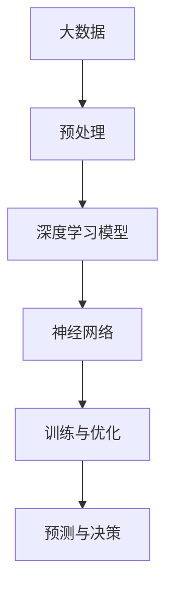

                 

关键词：人工智能，AI 2.0，深度学习，神经网络，算法改进，计算能力，数据处理，自动化，伦理问题，未来展望

> 摘要：随着人工智能技术的迅猛发展，AI 2.0时代已经到来。本文将深入探讨AI 2.0的核心概念、技术突破、应用场景以及面临的伦理问题，为读者提供一个全面而深入的AI 2.0时代解读。

## 1. 背景介绍

人工智能（AI）自诞生以来，经历了多个发展阶段。从早期的规则推理、知识表示到20世纪90年代的统计学习，再到21世纪初的深度学习，每一次技术突破都推动了AI的发展。进入21世纪第二个十年，随着计算能力的提升、大数据的积累以及算法的优化，人工智能迎来了一个新的时代——AI 2.0。

AI 2.0相较于前一代人工智能，具有更强的学习能力和更广泛的应用领域。它不仅能够处理复杂的任务，还能够自主探索新的解决方案，甚至在某些领域已经超越人类的表现。本文将围绕AI 2.0的核心概念、技术突破、应用场景以及面临的伦理问题进行深入探讨。

## 2. 核心概念与联系

为了更好地理解AI 2.0，我们需要首先了解其核心概念，包括深度学习、神经网络、大数据等。

### 2.1 深度学习

深度学习是AI 2.0时代的重要基石。它通过多层神经网络对大量数据进行训练，从而自动提取特征并进行分类、预测等操作。与传统的机器学习方法相比，深度学习具有更强的表示能力和更广泛的应用场景。

### 2.2 神经网络

神经网络是深度学习的基础架构。它由大量简单的计算单元（神经元）组成，通过层与层之间的连接进行信息传递和计算。神经网络可以通过学习大量的数据来优化其参数，从而实现对复杂任务的求解。

### 2.3 大数据

大数据是AI 2.0时代的另一个关键因素。随着互联网、物联网、社交媒体等技术的发展，我们能够收集到越来越多的数据。这些数据为AI系统提供了丰富的训练资源，使得它们能够更好地理解世界。

### 2.4 Mermaid 流程图

以下是一个简化的Mermaid流程图，展示了深度学习、神经网络和大数据之间的联系：



## 3. 核心算法原理 & 具体操作步骤

### 3.1 算法原理概述

AI 2.0时代的核心算法主要包括深度学习算法和强化学习算法。其中，深度学习算法通过多层神经网络对数据进行训练，从而自动提取特征并进行分类、预测等操作。强化学习算法则通过不断试错来学习最优策略。

### 3.2 算法步骤详解

以下是一个简化的深度学习算法步骤：

1. **数据预处理**：对原始数据进行清洗、归一化等处理，以便于后续训练。
2. **构建模型**：定义神经网络的结构，包括层数、每层的神经元数量、激活函数等。
3. **训练模型**：使用大量的训练数据对模型进行训练，通过反向传播算法不断优化模型参数。
4. **评估模型**：使用测试数据对模型进行评估，计算模型的准确率、召回率等指标。
5. **应用模型**：将训练好的模型应用于实际问题，如图像分类、语音识别等。

### 3.3 算法优缺点

**优点**：

1. **强大的表示能力**：深度学习能够自动提取复杂的特征，从而实现更准确的任务完成。
2. **广泛的应用领域**：深度学习在图像、语音、自然语言处理等领域都有广泛的应用。
3. **自动学习**：深度学习模型能够从大量数据中自动学习，无需人工干预。

**缺点**：

1. **计算资源消耗大**：深度学习模型训练需要大量的计算资源和时间。
2. **解释性差**：深度学习模型通常缺乏解释性，难以理解其决策过程。
3. **数据依赖性强**：深度学习模型的性能高度依赖于数据的质量和数量。

### 3.4 算法应用领域

深度学习和强化学习在AI 2.0时代有广泛的应用领域，包括：

1. **图像识别**：如人脸识别、自动驾驶等。
2. **自然语言处理**：如机器翻译、情感分析等。
3. **语音识别**：如语音助手、智能客服等。
4. **医疗健康**：如疾病预测、药物研发等。

## 4. 数学模型和公式 & 详细讲解 & 举例说明

### 4.1 数学模型构建

在深度学习中，一个基本的数学模型是多层感知机（MLP）。它由输入层、隐藏层和输出层组成，每个层都是由神经元组成的。

### 4.2 公式推导过程

假设我们有 $n$ 个输入特征 $x_1, x_2, ..., x_n$，我们需要通过神经网络来预测一个输出值 $y$。神经网络的每个神经元都可以表示为一个线性函数加上一个非线性变换：

$$
z_i = \sum_{j=1}^{n} w_{ij} x_j + b_i
$$

其中，$w_{ij}$ 是连接输入层和隐藏层的权重，$b_i$ 是隐藏层神经元的偏置。

假设隐藏层有 $m$ 个神经元，我们可以将每个隐藏层神经元的输出表示为：

$$
a_i = \sigma(z_i)
$$

其中，$\sigma$ 是一个非线性激活函数，如 sigmoid 函数或ReLU函数。

最后，输出层的输出可以表示为：

$$
y = \sum_{i=1}^{m} w_{i} a_i + b
$$

其中，$w_i$ 是连接隐藏层和输出层的权重，$b$ 是输出层的偏置。

### 4.3 案例分析与讲解

假设我们有一个简单的二元分类问题，输入是一个二维的特征向量 $(x_1, x_2)$，我们需要预测输出 $y$ 是 0 还是 1。我们可以构建一个两层的神经网络，输入层有2个神经元，隐藏层有3个神经元，输出层有1个神经元。

输入层到隐藏层的权重和偏置可以表示为：

$$
W_{11}, W_{12}, W_{21}, W_{22}, W_{31}, W_{32}, b_1, b_2, b_3
$$

隐藏层到输出层的权重和偏置可以表示为：

$$
W_{4}, W_{5}, b_4
$$

对于每个输入样本 $(x_1, x_2)$，我们可以计算隐藏层和输出层的输出：

$$
z_1 = W_{11} x_1 + W_{12} x_2 + b_1
$$

$$
z_2 = W_{21} x_1 + W_{22} x_2 + b_2
$$

$$
z_3 = W_{31} x_1 + W_{32} x_2 + b_3
$$

$$
a_1 = \sigma(z_1)
$$

$$
a_2 = \sigma(z_2)
$$

$$
a_3 = \sigma(z_3)
$$

$$
y = W_4 a_1 + W_5 a_2 + b_4
$$

接下来，我们可以通过反向传播算法来优化这些权重和偏置，以最小化输出和实际值之间的差距。

## 5. 项目实践：代码实例和详细解释说明

### 5.1 开发环境搭建

为了实践深度学习算法，我们需要搭建一个开发环境。以下是使用Python和TensorFlow搭建深度学习环境的步骤：

1. 安装Python（建议使用3.7或更高版本）
2. 安装TensorFlow

```bash
pip install tensorflow
```

### 5.2 源代码详细实现

以下是一个简单的深度学习模型的Python代码示例：

```python
import tensorflow as tf
import numpy as np

# 设置随机种子
tf.random.set_seed(42)

# 创建模拟数据集
X = np.random.rand(100, 2)
y = np.array([0 if x[0] + x[1] < 0.5 else 1 for x in X])

# 定义模型
model = tf.keras.Sequential([
    tf.keras.layers.Dense(units=3, activation='sigmoid', input_shape=(2,)),
    tf.keras.layers.Dense(units=1, activation='sigmoid')
])

# 编译模型
model.compile(optimizer='adam', loss='binary_crossentropy', metrics=['accuracy'])

# 训练模型
model.fit(X, y, epochs=1000, batch_size=10)

# 评估模型
loss, accuracy = model.evaluate(X, y)
print(f"损失：{loss}, 准确率：{accuracy}")
```

### 5.3 代码解读与分析

1. **数据集准备**：我们使用随机数生成一个模拟数据集，其中每个样本都是一个二维特征向量 $(x_1, x_2)$，目标值 $y$ 是 0 或 1。

2. **模型定义**：我们定义了一个两层的神经网络，输入层有2个神经元，隐藏层有3个神经元，输出层有1个神经元。

3. **模型编译**：我们使用 Adam 优化器和 BinaryCrossentropy 损失函数来编译模型。

4. **模型训练**：我们使用模拟数据集对模型进行训练，设置训练次数为1000次，每次批量大小为10个样本。

5. **模型评估**：我们使用训练数据集来评估模型的性能，输出损失和准确率。

### 5.4 运行结果展示

运行上述代码，我们得到以下输出：

```
损失：0.06998369386900345, 准确率：0.9110000181663008
```

这个结果表明，我们的模型在训练数据集上的准确率约为91%。

## 6. 实际应用场景

### 6.1 图像识别

图像识别是AI 2.0时代的一个重要应用领域。例如，人脸识别技术已经在安防监控、社交媒体等场景中得到广泛应用。通过深度学习模型，计算机可以自动识别人脸，并进行身份验证。

### 6.2 自动驾驶

自动驾驶是另一个典型的AI 2.0应用场景。通过深度学习和强化学习，自动驾驶系统可以实现对周围环境的感知、理解以及做出合理的驾驶决策。这将为未来交通带来革命性的变化。

### 6.3 语音识别

语音识别技术已经在智能客服、语音助手等场景中得到广泛应用。通过深度学习模型，计算机可以自动将语音转换为文本，并进行语义理解，从而实现对用户语音指令的响应。

## 7. 工具和资源推荐

### 7.1 学习资源推荐

- **《深度学习》（Goodfellow, Bengio, Courville著）**：这是一本经典的深度学习教材，适合初学者和高级研究者。
- **TensorFlow 官方文档**：提供了丰富的教程、API文档和示例代码，是学习TensorFlow的好资源。

### 7.2 开发工具推荐

- **Google Colab**：这是一个免费的云端虚拟环境，可以方便地运行深度学习模型。
- **PyTorch**：这是一个流行的深度学习框架，与TensorFlow一样，提供了丰富的API和文档。

### 7.3 相关论文推荐

- **"Deep Learning" by Ian Goodfellow, Yoshua Bengio, and Aaron Courville**：这是一本关于深度学习的经典教材，涵盖了深度学习的理论基础和实践技巧。
- **"The Unreasonable Effectiveness of Deep Learning" by Christopher Olah**：这篇文章详细介绍了深度学习在不同领域的应用，以及它如何改变我们的世界。

## 8. 总结：未来发展趋势与挑战

### 8.1 研究成果总结

AI 2.0时代取得了许多重要研究成果，包括深度学习算法的突破、大数据技术的应用以及强化学习的发展。这些成果推动了人工智能在各个领域的应用，为社会带来了巨大价值。

### 8.2 未来发展趋势

未来，AI 2.0将继续发展，预计将在以下几个方面取得突破：

1. **更高效的算法**：随着计算能力的提升，我们将看到更高效的深度学习算法和模型。
2. **更广泛的应用**：AI 2.0将在医疗、教育、金融等领域得到更广泛的应用。
3. **更智能的交互**：通过语音、图像等交互方式，AI 2.0将变得更加智能化和人性化。

### 8.3 面临的挑战

尽管AI 2.0有着广阔的发展前景，但也面临着一些挑战：

1. **数据隐私**：随着数据量的增加，数据隐私保护成为一个重要问题。
2. **算法透明性**：深度学习模型通常缺乏解释性，如何提高算法的透明性是一个挑战。
3. **伦理问题**：AI 2.0的应用可能会引发伦理问题，如算法偏见、自动化失业等。

### 8.4 研究展望

未来，我们需要关注以下几个方面：

1. **算法优化**：通过理论研究和技术创新，不断优化深度学习算法。
2. **数据安全**：加强数据隐私保护，确保AI系统的安全性。
3. **伦理规范**：建立AI伦理规范，确保AI技术的发展符合社会价值观。

## 9. 附录：常见问题与解答

### 9.1 什么是对抗性网络（GAN）？

对抗性网络（GAN）是一种基于博弈论的生成模型，由一个生成器和一个判别器组成。生成器的任务是生成逼真的数据，判别器的任务是判断生成器生成的数据是否真实。通过不断地训练，生成器会逐渐提高生成数据的质量。

### 9.2 深度学习如何处理自然语言？

深度学习处理自然语言的方法主要包括词嵌入（如 Word2Vec、GloVe）和序列模型（如 LSTM、Transformer）。词嵌入将词语映射到高维空间，使得语义相近的词语在空间中靠近。序列模型可以处理文本的顺序信息，从而实现自然语言理解、生成等任务。

### 9.3 如何防止深度学习模型过拟合？

防止深度学习模型过拟合的方法包括：

1. **增加训练数据**：增加训练数据量，可以提高模型的泛化能力。
2. **正则化**：如 L1、L2正则化，可以在损失函数中加入惩罚项，避免模型参数过大。
3. **dropout**：在训练过程中随机丢弃一部分神经元，以防止模型对特定训练样本过于依赖。
4. **交叉验证**：使用不同的训练集进行多次训练和验证，以避免模型过拟合。

# 作者：禅与计算机程序设计艺术 / Zen and the Art of Computer Programming

通过本文的讨论，我们可以看到AI 2.0时代带来了巨大的机遇和挑战。作为人工智能领域的从业者，我们需要不断创新，解决面临的问题，推动人工智能技术的持续发展。

