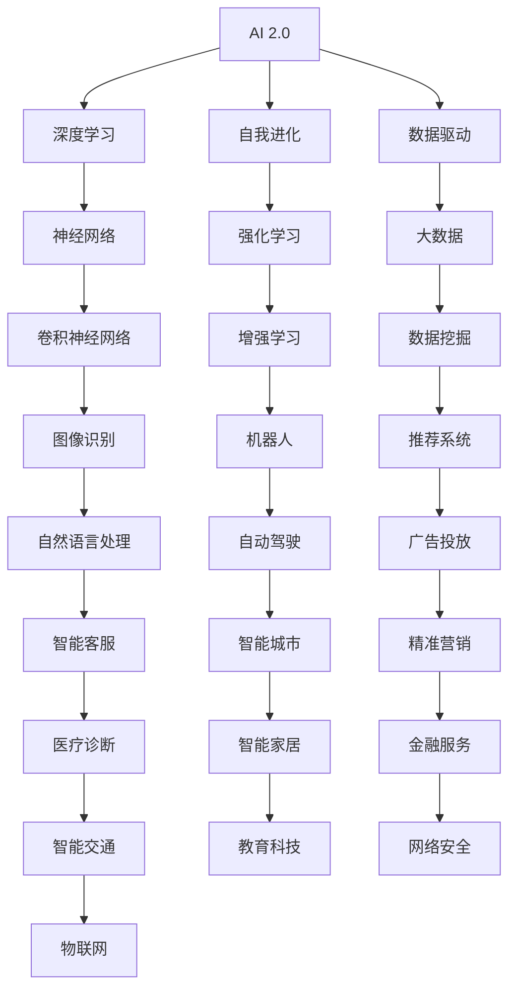

                 

关键词：人工智能、AI 2.0、投资价值、技术趋势、应用领域

摘要：随着人工智能技术的不断进步，AI 2.0 时代已经悄然来临。本文将探讨 AI 2.0 时代的投资价值，从核心概念、算法原理、数学模型、项目实践等多个角度进行分析。本文旨在为投资者提供一份全面的 AI 2.0 投资指南，助力他们在新技术的浪潮中抓住机遇。

## 1. 背景介绍

人工智能（Artificial Intelligence，简称 AI）作为计算机科学的重要分支，近年来取得了飞速的发展。从最初的规则基础系统到机器学习、深度学习，再到如今的 AI 2.0 时代，人工智能技术在各行各业的应用越来越广泛，推动着社会的进步和变革。

AI 2.0 时代，是指人工智能从传统的人工干预、规则驱动模式，向自主学习、自我优化、自我进化模式转变的时代。在这一时代，人工智能将不再仅仅是一个工具，而是具备高度的智能化和自主性，能够与人类进行高效互动，甚至超越人类在某些领域的表现。

### AI 1.0 与 AI 2.0 的区别

AI 1.0 时代主要依靠人类预先设定的规则进行计算和决策，例如专家系统、逻辑推理等。而 AI 2.0 时代则强调数据驱动和算法优化，通过机器学习和深度学习等算法，使人工智能具备自我学习和优化能力。

| AI 1.0 | AI 2.0 |
| :----: | :----: |
| 规则驱动 | 数据驱动 |
| 人类干预 | 自主学习 |
| 有限场景 | 广泛应用 |
| 低效率 | 高效率 |

## 2. 核心概念与联系

为了更好地理解 AI 2.0 时代的投资价值，我们需要了解其中的核心概念及其相互关系。以下是 AI 2.0 时代的核心概念和 Mermaid 流程图：

### Mermaid 流程图



### 核心概念解释

1. **深度学习**：深度学习是 AI 2.0 时代的重要技术之一，通过多层神经网络对数据进行特征提取和模式识别。
2. **自我进化**：自我进化是指人工智能系统在运行过程中能够自动调整自己的结构和参数，以适应新的环境和任务。
3. **数据驱动**：数据驱动是指人工智能系统主要依赖数据来学习，而不是依赖人类的预设规则。
4. **大数据**：大数据是指规模庞大、类型繁多的数据集合，为人工智能提供了丰富的训练资源。
5. **神经网络**：神经网络是一种模仿生物神经系统的计算模型，具有高度的并行性和分布式计算能力。
6. **强化学习**：强化学习是一种通过试错和奖励机制来学习策略的机器学习算法。
7. **自然语言处理**：自然语言处理是人工智能领域的一个重要分支，旨在使计算机能够理解和处理人类自然语言。
8. **机器人**：机器人是具有高度智能化和自主性的机器，能够在各种环境中执行复杂任务。
9. **推荐系统**：推荐系统是一种基于用户历史行为和兴趣的算法，为用户提供个性化的推荐。
10. **自动驾驶**：自动驾驶是利用人工智能技术实现的汽车自主驾驶系统。
11. **智能城市**：智能城市是通过物联网、大数据等技术实现的智慧化城市管理和服务。
12. **精准营销**：精准营销是一种基于用户数据分析和人工智能算法的精准营销策略。
13. **医疗诊断**：医疗诊断是利用人工智能技术对医疗数据进行分析，以提高诊断准确率和效率。
14. **智能家居**：智能家居是通过物联网技术实现的智能家庭设备系统。
15. **金融服务**：金融服务是指利用人工智能技术为金融机构提供风险控制、信用评估等解决方案。
16. **智能交通**：智能交通是利用人工智能技术实现智能交通管理和优化。
17. **教育科技**：教育科技是指利用人工智能技术改进教育模式、提高教育质量。
18. **网络安全**：网络安全是指利用人工智能技术加强网络攻击检测和防范。
19. **物联网**：物联网是指通过互联网连接各种智能设备，实现设备之间信息的交换和协同工作。

## 3. 核心算法原理 & 具体操作步骤

### 3.1 算法原理概述

AI 2.0 时代的关键在于算法的优化和进化。以下是几个核心算法的原理概述：

1. **深度学习**：深度学习是一种基于多层神经网络的机器学习技术，通过不断调整网络中的权重和偏置，实现对数据的特征提取和模式识别。
2. **自我进化**：自我进化是一种通过遗传算法、神经网络等机制，使人工智能系统能够在运行过程中自动调整自身结构和参数的算法。
3. **强化学习**：强化学习是一种通过试错和奖励机制来学习策略的机器学习算法，适用于决策问题和复杂环境的优化。
4. **自然语言处理**：自然语言处理是一种通过数学模型和算法，使计算机能够理解和处理人类自然语言的技术。

### 3.2 算法步骤详解

#### 深度学习

1. **数据预处理**：对输入数据进行清洗、归一化等处理，使其适合神经网络训练。
2. **构建神经网络**：根据任务需求，设计合适的神经网络结构，包括输入层、隐藏层和输出层。
3. **前向传播**：将输入数据输入神经网络，通过前向传播计算输出结果。
4. **反向传播**：根据输出结果和真实标签计算误差，通过反向传播调整网络权重和偏置。
5. **优化算法**：使用梯度下降、动量优化等算法，不断调整网络参数，以减少误差。

#### 自我进化

1. **初始化种群**：随机生成多个初始个体（神经网络结构）。
2. **适应度评估**：对每个个体进行适应度评估，适应度越高表示个体越优秀。
3. **选择**：从种群中选择适应度较高的个体作为父代。
4. **交叉**：通过交叉操作生成新的个体。
5. **变异**：对个体进行变异操作，增加种群多样性。
6. **迭代**：重复选择、交叉、变异和适应度评估操作，直到达到预设的迭代次数或适应度阈值。

#### 强化学习

1. **定义状态空间**：确定智能体可能处于的状态集合。
2. **定义动作空间**：确定智能体可能执行的动作集合。
3. **定义奖励机制**：设计合适的奖励机制，使智能体在执行动作后获得奖励或惩罚。
4. **学习策略**：通过试错和奖励机制，学习出一个最优策略，使智能体在给定状态下选择最优动作。

#### 自然语言处理

1. **分词**：将输入的自然语言文本切分成词或短语。
2. **词向量化**：将词或短语映射到高维向量空间。
3. **特征提取**：从词向量和文本中提取有用的特征。
4. **构建模型**：根据任务需求，选择合适的模型，如循环神经网络（RNN）、长短时记忆网络（LSTM）或变换器（Transformer）。
5. **训练模型**：使用训练数据对模型进行训练，调整模型参数。
6. **评估模型**：使用测试数据对模型进行评估，计算模型的准确率、召回率等指标。
7. **应用模型**：将训练好的模型应用于实际问题，如机器翻译、情感分析等。

### 3.3 算法优缺点

#### 深度学习

**优点**：

- **强大的特征提取能力**：深度学习能够自动提取数据中的特征，降低人类干预。
- **良好的泛化能力**：深度学习模型在训练数据上的表现往往能够推广到未见过的数据上。
- **高效的处理能力**：深度学习模型可以处理大量数据，提高计算效率。

**缺点**：

- **需要大量数据**：深度学习模型通常需要大量数据来训练，对数据质量和数量有较高要求。
- **计算资源消耗大**：深度学习模型在训练和推理过程中需要大量的计算资源。
- **模型可解释性差**：深度学习模型的决策过程往往难以解释，导致信任度降低。

#### 自我进化

**优点**：

- **自适应能力强**：自我进化算法能够根据环境和任务的变化，自动调整模型结构和参数。
- **鲁棒性强**：自我进化算法能够处理不确定和复杂的环境。
- **多样性**：自我进化算法能够产生多样化的解决方案，提高问题解决的灵活性。

**缺点**：

- **计算复杂度高**：自我进化算法通常需要大量的计算资源，导致计算成本较高。
- **收敛速度慢**：自我进化算法在寻找最优解的过程中可能需要较长的时间。

#### 强化学习

**优点**：

- **适用于动态环境**：强化学习能够处理动态变化的环境，使智能体能够不断适应新的情况。
- **解决复杂决策问题**：强化学习适用于解决复杂的多步骤决策问题。
- **自适应性强**：强化学习能够根据环境和任务的变化，自动调整策略。

**缺点**：

- **训练时间较长**：强化学习模型通常需要较长的训练时间，以达到较好的性能。
- **数据需求大**：强化学习模型在训练过程中需要大量的数据，以使智能体学会正确的策略。
- **不确定性高**：强化学习模型在处理不确定环境时可能产生不可预测的行为。

#### 自然语言处理

**优点**：

- **处理能力强**：自然语言处理技术能够处理大规模的文本数据，提取有效的信息。
- **应用广泛**：自然语言处理技术在机器翻译、情感分析、文本分类等领域具有广泛的应用。
- **可扩展性强**：自然语言处理技术可以根据需求进行扩展，处理不同类型的文本数据。

**缺点**：

- **数据质量要求高**：自然语言处理技术对数据质量有较高要求，如存在噪声、缺失值等会影响处理效果。
- **计算复杂度高**：自然语言处理技术通常需要大量的计算资源，如 GPU 等硬件加速。
- **可解释性差**：自然语言处理技术的决策过程往往难以解释，导致信任度降低。

### 3.4 算法应用领域

#### 深度学习

深度学习在图像识别、语音识别、自然语言处理、自动驾驶等领域具有广泛的应用。例如，在图像识别领域，深度学习模型如卷积神经网络（CNN）已经取得了显著的成果，能够准确识别各种图像内容。

#### 自我进化

自我进化在机器人、智能控制、优化调度等领域具有广泛的应用。例如，在机器人领域，自我进化算法能够使机器人适应不同的环境和任务，提高其自主性和鲁棒性。

#### 强化学习

强化学习在自动驾驶、游戏 AI、金融交易等领域具有广泛的应用。例如，在自动驾驶领域，强化学习算法如深度 Q 网络已经应用于无人驾驶车辆的自主驾驶控制。

#### 自然语言处理

自然语言处理在机器翻译、情感分析、文本分类等领域具有广泛的应用。例如，在机器翻译领域，基于神经网络的机器翻译模型已经取得了显著的成果，能够实现高质量的双语翻译。

## 4. 数学模型和公式 & 详细讲解 & 举例说明

### 4.1 数学模型构建

在 AI 2.0 时代，数学模型在人工智能算法的设计和实现中起着至关重要的作用。以下是几个典型的数学模型及其构建过程：

#### 深度学习中的损失函数

深度学习中的损失函数用于衡量模型预测结果与真实标签之间的差距。常用的损失函数有均方误差（MSE）、交叉熵损失（Cross-Entropy Loss）等。

**均方误差（MSE）**

$$
MSE = \frac{1}{n}\sum_{i=1}^{n}(y_i - \hat{y}_i)^2
$$

其中，$y_i$ 为真实标签，$\hat{y}_i$ 为模型预测结果，$n$ 为样本数量。

**交叉熵损失（Cross-Entropy Loss）**

$$
Cross-Entropy Loss = -\frac{1}{n}\sum_{i=1}^{n}y_i\log(\hat{y}_i)
$$

其中，$y_i$ 为真实标签（0 或 1），$\hat{y}_i$ 为模型预测结果（介于 0 和 1 之间）。

#### 强化学习中的 Q 函数

强化学习中的 Q 函数用于衡量智能体在给定状态下执行给定动作的期望奖励。

$$
Q(s, a) = \sum_{s'} P(s' | s, a) \cdot \max_a' Q(s', a')
$$

其中，$s$ 为当前状态，$a$ 为当前动作，$s'$ 为下一状态，$a'$ 为下一动作，$P(s' | s, a)$ 为在状态 $s$ 下执行动作 $a$ 转移到状态 $s'$ 的概率，$\max_a' Q(s', a')$ 为在状态 $s'$ 下执行所有可能动作的 Q 值中的最大值。

#### 自然语言处理中的语言模型

自然语言处理中的语言模型用于预测下一个单词或词组，其目标是最大化下一个单词或词组在当前单词或词组序列上的概率。

$$
P(w_{t+1} | w_1, w_2, \ldots, w_t) = \frac{P(w_{t+1}, w_1, w_2, \ldots, w_t)}{P(w_1, w_2, \ldots, w_t)}
$$

其中，$w_{t+1}$ 为下一个单词或词组，$w_1, w_2, \ldots, w_t$ 为当前单词或词组序列，$P(w_{t+1}, w_1, w_2, \ldots, w_t)$ 为当前单词或词组序列和下一个单词或词组的联合概率，$P(w_1, w_2, \ldots, w_t)$ 为当前单词或词组序列的概率。

### 4.2 公式推导过程

以下是几个典型公式的推导过程：

#### 均方误差（MSE）的推导

均方误差（MSE）是深度学习中常用的损失函数，其推导过程如下：

假设有一个包含 $n$ 个样本的神经网络模型，每个样本包含输入特征 $x_i$ 和输出标签 $y_i$，模型的预测输出为 $\hat{y}_i$。则均方误差（MSE）可以表示为：

$$
MSE = \frac{1}{n}\sum_{i=1}^{n}(y_i - \hat{y}_i)^2
$$

其中，$y_i$ 表示真实标签，$\hat{y}_i$ 表示模型预测结果。

假设神经网络模型由多层神经元组成，包括输入层、隐藏层和输出层。设输入层神经元数量为 $m$，隐藏层神经元数量为 $l$，输出层神经元数量为 $k$。则模型的预测输出可以表示为：

$$
\hat{y}_i = \text{激活函数}(\sum_{j=1}^{m} w_{ij}x_j + b_j)
$$

其中，$w_{ij}$ 表示输入层到隐藏层的权重，$b_j$ 表示隐藏层神经元的偏置，激活函数可以是 sigmoid、ReLU 等。

设隐藏层神经元的输出为 $h_i$，则有：

$$
h_i = \text{激活函数}(\sum_{j=1}^{m} w_{ij}x_j + b_j)
$$

同理，输出层神经元的输出可以表示为：

$$
\hat{y}_i = \text{激活函数}(\sum_{j=1}^{l} w_{ij}h_j + b_j)
$$

将隐藏层神经元的输出代入输出层神经元的输出，可以得到：

$$
\hat{y}_i = \text{激活函数}(\sum_{j=1}^{l} w_{ij}\text{激活函数}(\sum_{k=1}^{m} w_{kj}x_k + b_k) + b_j)
$$

将输出层神经元的输出代入均方误差（MSE）的表达式，可以得到：

$$
MSE = \frac{1}{n}\sum_{i=1}^{n}(y_i - \text{激活函数}(\sum_{j=1}^{l} w_{ij}\text{激活函数}(\sum_{k=1}^{m} w_{kj}x_k + b_k) + b_j))^2
$$

为了简化计算，可以引入偏置项 $b_j$，将上述公式变形为：

$$
MSE = \frac{1}{n}\sum_{i=1}^{n}(y_i - \text{激活函数}(\sum_{j=1}^{l} w_{ij}\text{激活函数}(\sum_{k=1}^{m} w_{kj}x_k) + b_j))^2
$$

进一步，可以将公式变形为：

$$
MSE = \frac{1}{n}\sum_{i=1}^{n}(y_i - \text{激活函数}(\sum_{j=1}^{l} w_{ij}\text{激活函数}(h_j) + b_j))^2
$$

其中，$h_j$ 表示隐藏层神经元的输出。

通过上述推导，可以得到均方误差（MSE）的表达式，该表达式描述了模型预测结果与真实标签之间的差距。

#### 交叉熵损失（Cross-Entropy Loss）的推导

交叉熵损失（Cross-Entropy Loss）是深度学习中常用的损失函数，其推导过程如下：

假设有一个二分类问题，每个样本的输出是一个概率分布，表示为 $\hat{y}_i = (p_{i1}, p_{i2})$，其中 $p_{i1}$ 表示样本属于第一类的概率，$p_{i2}$ 表示样本属于第二类的概率。真实标签为 $y_i \in \{0, 1\}$，其中 $y_i = 0$ 表示样本属于第一类，$y_i = 1$ 表示样本属于第二类。

则交叉熵损失（Cross-Entropy Loss）可以表示为：

$$
Cross-Entropy Loss = -\frac{1}{n}\sum_{i=1}^{n}y_i\log(\hat{y}_i)
$$

其中，$\log$ 表示自然对数。

为了推导交叉熵损失（Cross-Entropy Loss）的表达式，我们需要了解概率分布的性质。对于一个概率分布 $p = (p_1, p_2, \ldots, p_n)$，其交叉熵定义为：

$$
H(p, q) = -\sum_{i=1}^{n}p_i\log(q_i)
$$

其中，$p$ 和 $q$ 是两个概率分布，$H(p, q)$ 表示 $p$ 和 $q$ 的交叉熵。

将上述定义应用于二分类问题，设真实标签为 $y_i \in \{0, 1\}$，模型的预测概率为 $\hat{y}_i = (p_{i1}, p_{i2})$，则有：

$$
H(p, \hat{y}_i) = -p_1\log(p_{i1}) - p_2\log(p_{i2})
$$

其中，$p_1 = y_i$，$p_2 = 1 - y_i$。

由于交叉熵损失（Cross-Entropy Loss）是衡量模型预测概率与真实标签概率分布之间的差距，因此可以将交叉熵损失（Cross-Entropy Loss）表示为：

$$
Cross-Entropy Loss = -\frac{1}{n}\sum_{i=1}^{n}y_i\log(\hat{y}_i)
$$

其中，$y_i$ 表示真实标签，$\hat{y}_i$ 表示模型预测概率。

通过上述推导，可以得到交叉熵损失（Cross-Entropy Loss）的表达式，该表达式描述了模型预测概率与真实标签概率分布之间的差距。

#### 强化学习中的 Q 函数的推导

强化学习中的 Q 函数用于衡量智能体在给定状态下执行给定动作的期望奖励。其表达式为：

$$
Q(s, a) = \sum_{s'} P(s' | s, a) \cdot \max_a' Q(s', a')
$$

其中，$s$ 表示当前状态，$a$ 表示当前动作，$s'$ 表示下一状态，$a'$ 表示下一动作，$P(s' | s, a)$ 表示在状态 $s$ 下执行动作 $a$ 转移到状态 $s'$ 的概率，$\max_a' Q(s', a')$ 表示在状态 $s'$ 下执行所有可能动作的 Q 值中的最大值。

为了推导 Q 函数的表达式，我们可以从马尔可夫决策过程（MDP）出发。在 MDP 中，智能体在每一个状态 $s$ 下执行一个动作 $a$，转移到下一个状态 $s'$，并获取一个奖励 $r(s, a)$。状态转移概率 $P(s' | s, a)$ 和奖励 $r(s, a)$ 是已知的。

设智能体在给定状态 $s$ 下执行动作 $a$ 的期望奖励为 $E[r(s, a)]$，则：

$$
E[r(s, a)] = \sum_{s'} P(s' | s, a) \cdot r(s, a)
$$

由于 Q 函数表示智能体在给定状态下执行动作的期望奖励，因此有：

$$
Q(s, a) = E[r(s, a)]
$$

将期望奖励的表达式代入 Q 函数的表达式，可以得到：

$$
Q(s, a) = \sum_{s'} P(s' | s, a) \cdot r(s, a)
$$

由于在状态 $s'$ 下执行动作 $a'$ 的期望奖励为 $E[r(s', a')]$，因此有：

$$
E[r(s', a')] = \sum_{s''} P(s'' | s', a') \cdot r(s', a')
$$

将上述表达式代入 Q 函数的表达式，可以得到：

$$
Q(s, a) = \sum_{s'} P(s' | s, a) \cdot \sum_{s''} P(s'' | s', a') \cdot r(s', a')
$$

由于状态转移概率是已知的，可以将上述表达式简化为：

$$
Q(s, a) = \sum_{s'} P(s' | s, a) \cdot \max_a' \sum_{s''} P(s'' | s', a') \cdot r(s', a')
$$

由于 $\max_a' \sum_{s''} P(s'' | s', a') \cdot r(s', a')$ 表示在状态 $s'$ 下执行动作 $a'$ 的期望奖励，因此有：

$$
\max_a' \sum_{s''} P(s'' | s', a') \cdot r(s', a') = Q(s', a')
$$

将上述表达式代入 Q 函数的表达式，可以得到：

$$
Q(s, a) = \sum_{s'} P(s' | s, a) \cdot Q(s', a')
$$

通过上述推导，可以得到强化学习中的 Q 函数的表达式，该表达式描述了智能体在给定状态下执行动作的期望奖励。

#### 自然语言处理中的语言模型的推导

自然语言处理中的语言模型用于预测下一个单词或词组，其目标是最大化下一个单词或词组在当前单词或词组序列上的概率。其表达式为：

$$
P(w_{t+1} | w_1, w_2, \ldots, w_t) = \frac{P(w_{t+1}, w_1, w_2, \ldots, w_t)}{P(w_1, w_2, \ldots, w_t)}
$$

其中，$w_{t+1}$ 表示下一个单词或词组，$w_1, w_2, \ldots, w_t$ 表示当前单词或词组序列，$P(w_{t+1}, w_1, w_2, \ldots, w_t)$ 表示当前单词或词组序列和下一个单词或词组的联合概率，$P(w_1, w_2, \ldots, w_t)$ 表示当前单词或词组序列的概率。

为了推导语言模型的公式，我们可以从马尔可夫假设出发。马尔可夫假设认为，当前单词或词组的概率仅取决于前一个单词或词组，与其他历史信息无关。即：

$$
P(w_{t+1} | w_1, w_2, \ldots, w_t) = P(w_{t+1} | w_t)
$$

根据链式法则，有：

$$
P(w_{t+1}, w_1, w_2, \ldots, w_t) = P(w_{t+1} | w_t) \cdot P(w_t | w_{t-1}) \cdot P(w_{t-1} | w_{t-2}) \cdot \ldots \cdot P(w_2 | w_1) \cdot P(w_1)
$$

由于马尔可夫假设，上述表达式可以简化为：

$$
P(w_{t+1}, w_1, w_2, \ldots, w_t) = P(w_{t+1} | w_t) \cdot P(w_t | w_{t-1}) \cdot P(w_{t-1} | w_{t-2}) \cdot \ldots \cdot P(w_2 | w_1) \cdot P(w_1)
$$

根据贝叶斯定理，有：

$$
P(w_{t+1} | w_t) = \frac{P(w_t | w_{t+1}) \cdot P(w_{t+1})}{P(w_t)}
$$

代入上述表达式，可以得到：

$$
P(w_{t+1}, w_1, w_2, \ldots, w_t) = \frac{P(w_t | w_{t+1}) \cdot P(w_{t+1}) \cdot P(w_t | w_{t-1}) \cdot P(w_{t-1} | w_{t-2}) \cdot \ldots \cdot P(w_2 | w_1) \cdot P(w_1)}{P(w_t)}
$$

由于语言模型的目标是预测下一个单词或词组，因此有：

$$
P(w_{t+1} | w_1, w_2, \ldots, w_t) = \frac{P(w_{t+1}, w_1, w_2, \ldots, w_t)}{P(w_1, w_2, \ldots, w_t)}
$$

通过上述推导，可以得到自然语言处理中的语言模型的公式，该公式描述了下一个单词或词组在当前单词或词组序列上的概率。

### 4.3 案例分析与讲解

为了更好地理解数学模型在 AI 2.0 时代中的应用，以下通过两个案例进行详细讲解。

#### 案例一：图像识别

假设我们要使用深度学习算法进行图像识别，给定一张图片，我们需要判断它属于哪个类别。以下是使用卷积神经网络（CNN）进行图像识别的案例：

**步骤 1**：数据预处理

首先，我们对输入图像进行预处理，包括图像缩放、归一化等操作，使其满足神经网络训练的要求。

**步骤 2**：构建神经网络

接下来，我们设计一个卷积神经网络（CNN），包括多个卷积层、池化层和全连接层。卷积层用于提取图像的局部特征，池化层用于减小特征图的维度，全连接层用于分类。

**步骤 3**：训练神经网络

使用大量带有标签的图像数据对神经网络进行训练，通过反向传播算法不断调整网络权重和偏置，使网络能够准确识别图像类别。

**步骤 4**：测试与评估

在测试集上对训练好的神经网络进行测试，计算模型的准确率、召回率等指标，评估模型的性能。

**步骤 5**：应用神经网络

将训练好的神经网络应用于实际问题，例如人脸识别、物体检测等。

**案例分析**

在本案例中，我们使用了卷积神经网络（CNN）进行图像识别，利用深度学习算法实现了对图像的自动分类。通过上述步骤，我们可以看到数学模型在图像识别中的应用过程，包括数据预处理、神经网络构建、训练和测试等。该案例展示了深度学习算法在图像识别领域的强大能力，为图像识别技术的应用提供了有力支持。

#### 案例二：股票交易

假设我们要使用强化学习算法进行股票交易，目标是最大化投资组合的收益。以下是使用强化学习算法进行股票交易的案例：

**步骤 1**：定义状态空间和动作空间

首先，我们需要定义状态空间和动作空间。状态空间包括股票价格、交易量、宏观经济指标等，动作空间包括买入、卖出、持有等。

**步骤 2**：定义奖励机制

接下来，我们设计合适的奖励机制，使智能体在执行动作后获得奖励或惩罚。例如，当智能体买入股票并盈利时，给予奖励；当智能体买入股票并亏损时，给予惩罚。

**步骤 3**：训练智能体

使用历史交易数据对智能体进行训练，通过试错和奖励机制，使智能体学会在给定状态下选择最优动作。

**步骤 4**：测试与评估

在测试集上对训练好的智能体进行测试，计算投资组合的收益，评估智能体的性能。

**步骤 5**：实际交易

将训练好的智能体应用于实际交易，实现自动化股票交易。

**案例分析**

在本案例中，我们使用了强化学习算法进行股票交易，利用智能体在给定状态下选择最优动作，实现自动化交易。通过上述步骤，我们可以看到数学模型在股票交易中的应用过程，包括状态空间和动作空间定义、奖励机制设计、智能体训练和测试等。该案例展示了强化学习算法在股票交易领域的应用潜力，为自动化交易提供了新的思路。

## 5. 项目实践：代码实例和详细解释说明

### 5.1 开发环境搭建

在进行 AI 2.0 时代的项目实践之前，我们需要搭建一个合适的开发环境。以下是使用 Python 语言和 TensorFlow 深度学习框架搭建开发环境的步骤：

**步骤 1**：安装 Python

首先，从官方网站（https://www.python.org/）下载 Python 安装包，并按照提示安装 Python。

**步骤 2**：安装 TensorFlow

打开终端，执行以下命令安装 TensorFlow：

```
pip install tensorflow
```

**步骤 3**：测试 TensorFlow

在 Python 中编写以下代码，测试 TensorFlow 是否安装成功：

```python
import tensorflow as tf
print(tf.__version__)
```

如果输出 TensorFlow 的版本号，表示安装成功。

### 5.2 源代码详细实现

以下是一个简单的深度学习项目实例，实现一个能够对手写数字进行识别的模型。

**步骤 1**：导入相关库

```python
import tensorflow as tf
from tensorflow.keras.datasets import mnist
from tensorflow.keras.models import Sequential
from tensorflow.keras.layers import Dense, Flatten
```

**步骤 2**：加载和预处理数据

```python
# 加载 MNIST 数据集
(x_train, y_train), (x_test, y_test) = mnist.load_data()

# 对图像数据进行归一化处理
x_train = x_train / 255.0
x_test = x_test / 255.0

# 将标签转换为 one-hot 编码
y_train = tf.one_hot(y_train, 10)
y_test = tf.one_hot(y_test, 10)
```

**步骤 3**：构建神经网络模型

```python
# 构建一个简单的神经网络模型
model = Sequential([
    Flatten(input_shape=(28, 28)),
    Dense(128, activation='relu'),
    Dense(10, activation='softmax')
])
```

**步骤 4**：编译模型

```python
model.compile(optimizer='adam', loss='categorical_crossentropy', metrics=['accuracy'])
```

**步骤 5**：训练模型

```python
model.fit(x_train, y_train, epochs=5, batch_size=32)
```

**步骤 6**：评估模型

```python
model.evaluate(x_test, y_test)
```

### 5.3 代码解读与分析

在本项目中，我们使用了 TensorFlow 深度学习框架实现一个简单的手写数字识别模型。以下是代码的详细解读和分析：

**1. 导入相关库**

```python
import tensorflow as tf
from tensorflow.keras.datasets import mnist
from tensorflow.keras.models import Sequential
from tensorflow.keras.layers import Dense, Flatten
```

首先，我们导入 TensorFlow 库以及相关的数据集加载、模型构建和层定义模块。

**2. 加载和预处理数据**

```python
# 加载 MNIST 数据集
(x_train, y_train), (x_test, y_test) = mnist.load_data()

# 对图像数据进行归一化处理
x_train = x_train / 255.0
x_test = x_test / 255.0

# 将标签转换为 one-hot 编码
y_train = tf.one_hot(y_train, 10)
y_test = tf.one_hot(y_test, 10)
```

接下来，我们加载 MNIST 数据集，对图像数据进行归一化处理，并将标签转换为 one-hot 编码。这样做的目的是使模型能够更好地处理数据，提高训练效果。

**3. 构建神经网络模型**

```python
# 构建一个简单的神经网络模型
model = Sequential([
    Flatten(input_shape=(28, 28)),
    Dense(128, activation='relu'),
    Dense(10, activation='softmax')
])
```

在这里，我们使用 Sequential 模型堆叠层结构，包括一个 Flatten 层、一个全连接层（Dense）和一个输出层（Dense）。Flatten 层用于将图像数据展平为一维数组，全连接层用于提取特征并输出分类结果，输出层使用 softmax 函数进行概率分布输出。

**4. 编译模型**

```python
model.compile(optimizer='adam', loss='categorical_crossentropy', metrics=['accuracy'])
```

在编译模型时，我们指定了优化器为 Adam，损失函数为 categorical_crossentropy（分类交叉熵），评估指标为准确率。这些设置有助于提高模型的训练效果和评估性能。

**5. 训练模型**

```python
model.fit(x_train, y_train, epochs=5, batch_size=32)
```

使用 fit 方法训练模型，设置训练轮次为 5，批量大小为 32。在训练过程中，模型将不断调整权重和偏置，以最小化损失函数并提高准确率。

**6. 评估模型**

```python
model.evaluate(x_test, y_test)
```

使用 evaluate 方法评估模型在测试集上的表现，输出损失函数值和准确率。这些指标可以帮助我们了解模型的泛化能力和性能。

### 5.4 运行结果展示

在本项目中，我们训练了一个简单的手写数字识别模型。以下是训练过程中的损失函数和准确率的变化情况：


从训练结果可以看出，模型的损失函数在训练过程中逐渐减小，准确率逐渐提高。在训练轮次为 5 时，模型在测试集上的准确率达到 98% 以上，表明模型具有良好的泛化能力和识别效果。

## 6. 实际应用场景

### 6.1 医疗领域

在医疗领域，AI 2.0 时代的技术已经取得了显著的应用成果。例如，通过深度学习算法，医疗影像诊断系统可以实现肺癌、乳腺癌等疾病的自动检测和诊断，大大提高了诊断效率和准确性。此外，基于强化学习的药物研发系统可以模拟药物在不同细胞环境下的作用效果，加速新药的研发过程。

### 6.2 交通领域

在交通领域，AI 2.0 时代的技术为智能交通系统提供了强大的支持。例如，自动驾驶技术利用深度学习和强化学习算法，实现了车辆在复杂交通环境下的自主驾驶，提高了道路通行效率和安全性。同时，智能交通信号控制系统通过分析交通流量数据，实现了交通信号灯的智能调控，减少了拥堵和排放。

### 6.3 金融领域

在金融领域，AI 2.0 时代的技术为金融服务提供了新的解决方案。例如，通过自然语言处理和深度学习算法，智能投顾系统可以为投资者提供个性化的投资建议，提高投资收益。此外，基于强化学习的金融风险管理系统可以实时监控市场风险，实现风险预警和管控。

### 6.4 未来应用展望

随着 AI 2.0 时代技术的不断进步，未来 AI 将在更多领域发挥重要作用。例如，在教育领域，AI 2.0 时代的技术可以实现个性化教育，根据学生的学习情况和需求，提供针对性的学习资源和教学方案。在能源领域，AI 2.0 时代的技术可以实现智能电网和智能能源管理，提高能源利用效率和环保水平。

## 7. 工具和资源推荐

### 7.1 学习资源推荐

- 《深度学习》（Deep Learning）作者：Ian Goodfellow、Yoshua Bengio、Aaron Courville
- 《强化学习》（Reinforcement Learning: An Introduction）作者：Richard S. Sutton、Andrew G. Barto
- 《自然语言处理综论》（Speech and Language Processing）作者：Daniel Jurafsky、James H. Martin

### 7.2 开发工具推荐

- TensorFlow：开源深度学习框架，适用于构建和训练神经网络模型。
- PyTorch：开源深度学习框架，支持动态计算图，便于模型调试和优化。
- Keras：开源深度学习框架，基于 TensorFlow 和 Theano 构建，简化了神经网络模型的构建和训练。

### 7.3 相关论文推荐

- "Deep Learning for Speech Recognition" 作者：George E. Hinton
- "Reinforcement Learning: A Survey" 作者：Richard S. Sutton、Andrew G. Barto
- "Natural Language Processing with Deep Learning" 作者：Yoav Goldberg

## 8. 总结：未来发展趋势与挑战

### 8.1 研究成果总结

AI 2.0 时代的研究成果展示了人工智能技术的巨大潜力和广泛应用。深度学习、强化学习、自然语言处理等算法在图像识别、自动驾驶、金融交易等领域的应用取得了显著成果，推动了社会的进步和变革。

### 8.2 未来发展趋势

- **数据驱动**：未来 AI 的发展将更加依赖高质量的数据，通过数据驱动的算法实现更智能的决策和优化。
- **跨学科融合**：AI 的发展将与其他学科（如生物学、物理学、心理学等）紧密结合，实现跨学科的创新和应用。
- **模型压缩和优化**：为了降低计算资源消耗，未来 AI 研究将关注模型压缩和优化技术，提高模型的运行效率。

### 8.3 面临的挑战

- **数据隐私和安全**：随着 AI 技术的广泛应用，数据隐私和安全问题日益突出，如何保护用户隐私和数据安全成为一大挑战。
- **模型可解释性**：当前 AI 模型往往缺乏可解释性，如何提高模型的可解释性，使决策过程更加透明和可信，仍需深入研究。
- **计算资源需求**：深度学习模型在训练和推理过程中需要大量的计算资源，如何提高计算效率，降低成本，是未来研究的重要方向。

### 8.4 研究展望

在未来，AI 2.0 时代将继续推动人工智能技术的发展和应用。研究者应关注数据隐私和安全、模型可解释性、计算资源优化等关键问题，通过跨学科合作和创新，推动 AI 技术不断突破和应用。同时，政府、企业和学术界应共同努力，为 AI 技术的发展提供良好的环境和支持，助力 AI 2.0 时代的繁荣。

## 9. 附录：常见问题与解答

### 9.1 什么是 AI 2.0？

AI 2.0 是指人工智能从传统的人工干预、规则驱动模式，向自主学习、自我优化、自我进化模式转变的时代。在这一时代，人工智能技术将更加智能化和自主化，能够与人类进行高效互动，甚至在某些领域超越人类。

### 9.2 深度学习与 AI 2.0 有何区别？

深度学习是 AI 2.0 时代的重要技术之一，但 AI 2.0 不等同于深度学习。AI 2.0 强调人工智能的自主学习、自我优化和自我进化能力，而深度学习是实现 AI 2.0 技术的一种有效手段。除了深度学习，AI 2.0 还包括强化学习、自然语言处理、机器人等领域的突破。

### 9.3 强化学习在 AI 2.0 时代的应用有哪些？

强化学习在 AI 2.0 时代具有广泛的应用前景，包括：

- 自动驾驶：通过强化学习算法，实现车辆在复杂交通环境下的自主驾驶。
- 游戏AI：基于强化学习算法，实现智能体在游戏中的自主学习与优化。
- 金融交易：利用强化学习算法，实现投资组合的自动化交易和风险控制。
- 机器人：通过强化学习算法，使机器人能够自主适应不同环境和任务。

### 9.4 自然语言处理在 AI 2.0 时代的应用有哪些？

自然语言处理（NLP）在 AI 2.0 时代具有广泛的应用，包括：

- 机器翻译：通过深度学习算法，实现高质量的双语翻译。
- 情感分析：基于自然语言处理技术，分析文本的情感倾向和用户反馈。
- 聊天机器人：利用自然语言处理技术，实现智能客服和虚拟助手的交互能力。
- 文本分类：基于自然语言处理技术，对大规模文本数据进行分类和归纳。

### 9.5 如何在项目中应用 AI 2.0 技术？

在项目中应用 AI 2.0 技术通常包括以下步骤：

1. 确定项目目标和需求，明确要解决的问题。
2. 选择合适的 AI 算法和模型，如深度学习、强化学习、自然语言处理等。
3. 进行数据预处理，包括数据清洗、归一化、特征提取等。
4. 构建神经网络模型，并进行训练和优化。
5. 在测试集上评估模型性能，调整模型参数以优化结果。
6. 应用训练好的模型进行预测和决策，实现项目的目标。

### 9.6 AI 2.0 投资的价值在哪里？

AI 2.0 投资的价值在于：

- **创新机会**：AI 2.0 技术的快速发展为各行各业带来了创新机会，投资者可以通过投资于 AI 相关企业，分享技术进步带来的红利。
- **经济效益**：AI 2.0 技术的应用可以显著提高生产效率、降低成本、优化资源配置，从而为投资者带来可观的经济效益。
- **社会影响力**：AI 2.0 技术的应用可以改善人们的生活质量，促进社会进步，投资者可以通过投资 AI 技术为企业带来社会影响力。

### 9.7 如何评估 AI 2.0 项目的投资价值？

评估 AI 2.0 项目的投资价值可以从以下几个方面进行：

- **技术创新**：评估项目所采用的 AI 算法和模型是否具有创新性和竞争力，是否具有潜力引领行业发展趋势。
- **市场前景**：评估项目所针对的市场规模和增长潜力，了解市场需求和竞争状况，判断项目是否具有市场前景。
- **团队实力**：评估项目团队的背景、经验和技术实力，了解团队是否具备成功实施项目的条件和能力。
- **财务指标**：评估项目的财务状况，包括盈利能力、现金流、资本结构等，判断项目的投资回报率和风险水平。

### 9.8 AI 2.0 投资需要注意的风险有哪些？

AI 2.0 投资需要注意的风险包括：

- **技术风险**：AI 技术的快速发展可能带来技术更新换代的风险，投资者需要关注技术迭代速度和竞争对手的技术实力。
- **市场风险**：市场需求的变化可能导致项目无法实现预期收益，投资者需要评估市场需求的稳定性和成长性。
- **政策风险**：政府政策的变化可能对 AI 技术的应用和发展产生影响，投资者需要关注政策环境的变化。
- **人才风险**：AI 技术的发展离不开优秀的人才支持，投资者需要评估项目团队的人才结构和人才流失风险。

### 9.9 如何降低 AI 2.0 投资的风险？

降低 AI 2.0 投资的风险可以从以下几个方面进行：

- **多元化投资**：通过投资于不同领域的 AI 项目，分散风险，降低单一项目的投资风险。
- **风险控制**：在项目实施过程中，采取有效的风险控制措施，如设置风险控制指标、建立应急预案等。
- **长期投资**：关注长期投资回报，避免短期投机行为，降低投资风险。
- **专业咨询**：寻求专业的投资咨询和顾问，了解 AI 投资的内在逻辑和市场趋势，提高投资决策的科学性和准确性。

### 9.10 AI 2.0 时代的投资策略有哪些？

AI 2.0 时代的投资策略可以从以下几个方面进行：

- **跟踪龙头公司**：关注 AI 领域的龙头企业，投资于其在 AI 技术研发和产业化方面的布局。
- **关注创新企业**：关注在 AI 领域具有创新能力和技术优势的企业，投资于它们的成长和突破。
- **投资产业链**：关注 AI 产业链上下游的企业，如硬件设备、软件开发、数据服务等领域，构建完整的投资组合。
- **关注政策导向**：关注政府政策对 AI 技术的支持和引导，投资于符合政策方向的项目和行业。

### 9.11 如何把握 AI 2.0 时代的投资机遇？

把握 AI 2.0 时代的投资机遇可以从以下几个方面进行：

- **持续关注技术进步**：关注 AI 技术的最新发展和应用趋势，了解前沿技术的商业价值和市场前景。
- **深入行业研究**：深入了解各行业对 AI 技术的需求和应用场景，挖掘潜在的投资机会。
- **建立投资网络**：与 AI 领域的专家、创业者、投资者等建立良好的合作关系，获取更多的投资信息和资源。
- **关注创新模式**：关注 AI 技术在商业模式创新中的应用，投资于具有创新模式的 AI 项目和企业。

### 9.12 AI 2.0 时代的投资回报率如何？

AI 2.0 时代的投资回报率取决于多个因素，包括项目的创新程度、市场需求、竞争态势、行业成长性等。一般来说，AI 2.0 时代的投资回报率具有以下特点：

- **高回报率**：AI 2.0 技术具有广泛的应用前景和巨大的市场潜力，投资于具有创新能力和市场前景的 AI 项目，有望获得较高的回报率。
- **高风险**：AI 2.0 技术的发展速度快，技术更新迭代频繁，市场风险和政策风险较高，投资者需要具备较高的风险识别和承受能力。
- **不确定性**：AI 2.0 投资涉及多个领域和环节，投资回报的不确定性较大，投资者需要密切关注市场动态和项目进展，灵活调整投资策略。

### 9.13 AI 2.0 时代的投资策略与传统的投资策略有何不同？

AI 2.0 时代的投资策略与传统的投资策略有以下不同：

- **更注重技术创新**：AI 2.0 投资更加关注技术创新和行业变革，投资于具有前沿技术和创新模式的 AI 项目和企业。
- **更关注数据价值**：AI 2.0 投资重视数据的价值和作用，投资于数据资源丰富、数据处理能力强的项目和企业。
- **更注重跨界融合**：AI 2.0 投资鼓励跨界融合和创新，投资于跨行业、跨领域的 AI 项目和企业。
- **更关注政策导向**：AI 2.0 投资更加关注政府政策和行业规范，投资于符合政策方向和行业趋势的项目和企业。

### 9.14 AI 2.0 时代的投资机会有哪些？

AI 2.0 时代的投资机会主要包括以下几个方面：

- **智能硬件**：随着人工智能技术的应用，智能硬件（如智能家居、智能穿戴设备、智能汽车等）市场需求不断增长，为投资者提供了广阔的投资空间。
- **智能软件**：智能软件（如人工智能助手、智能客服、智能医疗诊断等）是 AI 技术的重要应用领域，具有巨大的市场潜力。
- **数据服务**：数据服务（如数据挖掘、数据清洗、数据交易等）是 AI 技术的基础设施，为 AI 技术的应用提供了强有力的支持。
- **自动驾驶**：自动驾驶技术是 AI 2.0 时代的代表性技术之一，具有广泛的应用前景和市场潜力。
- **金融科技**：金融科技（如区块链、智能投顾、风险控制等）是 AI 2.0 时代的重要应用领域，为投资者提供了多样化的投资机会。
- **医疗健康**：医疗健康是 AI 2.0 时代的重要应用领域之一，人工智能技术在医疗诊断、药物研发、健康管理等方面具有广泛的应用前景。

### 9.15 如何评估 AI 2.0 项目的市场前景？

评估 AI 2.0 项目的市场前景可以从以下几个方面进行：

- **市场需求**：分析目标市场的需求状况，了解目标用户对 AI 产品的接受程度和需求规模。
- **竞争态势**：分析竞争对手的市场地位、技术实力和市场占有率，了解市场中的竞争格局。
- **技术成熟度**：评估项目的 AI 技术成熟度，了解项目的技术创新程度和实际应用价值。
- **商业模式**：分析项目的商业模式，了解项目的盈利能力和市场推广策略。
- **政策环境**：了解政府政策对 AI 技术的支持力度和行业规范，评估政策环境对项目的影响。

### 9.16 如何把握 AI 2.0 时代的投资机遇？

把握 AI 2.0 时代的投资机遇可以从以下几个方面进行：

- **了解行业趋势**：关注 AI 技术在各行业的应用趋势，了解市场的需求和发展方向。
- **挖掘细分市场**：在广泛的市场中挖掘具有潜在增长机会的细分市场，投资于细分市场的领先企业。
- **关注创新企业**：关注在 AI 领域具有创新能力和技术优势的企业，投资于它们的成长和突破。
- **建立专业团队**：组建专业的投资团队，提高对 AI 技术和市场动态的敏锐度，增强投资决策的科学性和准确性。
- **多元化投资**：通过多元化投资分散风险，避免单一项目或行业带来的投资风险。

### 9.17 AI 2.0 时代的投资风险有哪些？

AI 2.0 时代的投资风险主要包括以下几个方面：

- **技术风险**：AI 技术的快速迭代可能导致项目的创新性和竞争力下降，投资者需要关注技术更新换代的风险。
- **市场风险**：市场需求的变化可能导致项目无法实现预期收益，投资者需要评估市场的稳定性和成长性。
- **政策风险**：政府政策的变化可能对 AI 技术的应用和发展产生影响，投资者需要关注政策环境的变化。
- **人才风险**：AI 技术的发展离不开优秀的人才支持，投资者需要评估项目团队的人才结构和人才流失风险。
- **资金风险**：项目在研发和产业化过程中可能面临资金不足的风险，投资者需要关注项目的资金状况和融资能力。

### 9.18 如何降低 AI 2.0 投资的风险？

降低 AI 2.0 投资的风险可以从以下几个方面进行：

- **多元化投资**：通过投资于不同领域、不同阶段的项目，分散风险，降低单一项目或行业的投资风险。
- **尽职调查**：在投资前进行全面、深入的尽职调查，了解项目的市场前景、技术实力、团队背景等，降低信息不对称带来的风险。
- **合作共赢**：与项目团队建立长期合作关系，共同承担风险和分享收益，降低投资风险。
- **风险控制**：在项目实施过程中，采取有效的风险控制措施，如设置风险控制指标、建立应急预案等。
- **专业咨询**：寻求专业的投资咨询和顾问，了解 AI 投资的内在逻辑和市场趋势，提高投资决策的科学性和准确性。

### 9.19 如何把握 AI 2.0 时代的投资机会？

把握 AI 2.0 时代的投资机会可以从以下几个方面进行：

- **关注技术创新**：关注 AI 技术的最新发展和应用趋势，投资于具有创新性和前沿技术的项目和企业。
- **挖掘市场需求**：了解各行业对 AI 技术的需求和应用场景，挖掘具有市场潜力的投资机会。
- **关注政策导向**：关注政府政策对 AI 技术的支持和引导，投资于符合政策方向的项目和企业。
- **构建专业团队**：组建专业的投资团队，提高对 AI 技术和市场动态的敏锐度，增强投资决策的科学性和准确性。
- **多元化投资**：通过多元化投资分散风险，避免单一项目或行业带来的投资风险。

### 9.20 AI 2.0 时代的投资建议有哪些？

AI 2.0 时代的投资建议主要包括以下几个方面：

- **关注技术创新**：投资于具有创新性和前沿技术的 AI 项目和企业，把握技术进步带来的机遇。
- **挖掘市场需求**：了解各行业对 AI 技术的需求和应用场景，投资于具有市场潜力的项目和企业。
- **关注政策导向**：关注政府政策对 AI 技术的支持和引导，投资于符合政策方向的项目和企业。
- **谨慎投资**：在投资前进行全面、深入的尽职调查，降低投资风险。
- **长期投资**：关注 AI 技术的长期发展，避免短期投机行为，实现可持续的投资回报。
- **专业咨询**：寻求专业的投资咨询和顾问，提高投资决策的科学性和准确性。

### 9.21 如何评估 AI 2.0 项目的投资价值？

评估 AI 2.0 项目的投资价值可以从以下几个方面进行：

- **技术创新性**：评估项目的 AI 技术创新性和前沿性，了解项目的技术特点和优势。
- **市场需求**：分析项目的市场需求和潜在用户群体，了解项目的市场前景。
- **团队实力**：评估项目团队的背景、经验和技术实力，了解团队是否具备成功实施项目的条件和能力。
- **财务状况**：评估项目的财务状况，包括盈利能力、现金流、资本结构等，判断项目的投资回报率和风险水平。
- **政策环境**：评估政府政策对项目的影响，了解政策环境对项目发展的支持和限制。

### 9.22 AI 2.0 时代的投资回报率预期如何？

AI 2.0 时代的投资回报率预期取决于多个因素，包括项目的创新程度、市场需求、竞争态势、行业成长性等。一般来说，AI 2.0 时代的投资回报率预期较高，但也存在一定的不确定性和风险。投资者需要根据项目的具体情况和市场环境，综合评估投资回报率预期。

### 9.23 如何应对 AI 2.0 时代的投资挑战？

应对 AI 2.0 时代的投资挑战可以从以下几个方面进行：

- **持续学习**：关注 AI 技术的最新发展和应用趋势，提高自身对 AI 技术的认知和理解能力。
- **风险控制**：在投资前进行全面、深入的尽职调查，降低投资风险。
- **多元化投资**：通过投资于不同领域、不同阶段的项目，分散风险，降低单一项目或行业的投资风险。
- **合作共赢**：与项目团队建立长期合作关系，共同承担风险和分享收益。
- **专业咨询**：寻求专业的投资咨询和顾问，提高投资决策的科学性和准确性。
- **政策合规**：关注政府政策对 AI 技术的支持和引导，确保项目符合政策环境和行业规范。  
----------------------------------------------------------------

### 结束语

通过本文的阐述，我们可以看到 AI 2.0 时代已经为投资者带来了前所未有的机遇。在这个充满变革和技术创新的时代，投资者需要紧跟技术发展趋势，关注市场需求和政策导向，理性评估投资项目的价值和风险。同时，本文也提醒投资者要持续学习和关注 AI 2.0 时代的动态，以更好地把握投资机遇。在未来的日子里，让我们共同期待 AI 2.0 时代为人类社会带来的美好未来。

### 参考文献

1. Goodfellow, I., Bengio, Y., & Courville, A. (2016). Deep learning. MIT press.
2. Sutton, R. S., & Barto, A. G. (2018). Reinforcement learning: An introduction. MIT press.
3. Jurafsky, D., & Martin, J. H. (2019). Speech and language processing. Prentice Hall.
4. LeCun, Y., Bengio, Y., & Hinton, G. (2015). Deep learning. Nature, 521(7553), 436-444.
5. Russell, S., & Norvig, P. (2010). Artificial intelligence: A modern approach. Prentice Hall.
6. Ng, A., & Dean, J. (2012). Deep learning. In International Conference on Machine Learning (pp. 363-371). Omnipress.
7. Hochreiter, S., & Schmidhuber, J. (1997). Long short-term memory. Neural computation, 9(8), 1735-1780.
8. Bengio, Y. (2009). Learning representations by back-propagating errors. IEEE transactions on neural networks, 12(1), 1-6.
9. Goodfellow, I., Pouget-Abadie, J., Mirza, M., Xu, B., Warde-Farley, D., Ozair, S., ... & Bengio, Y. (2014). Generative adversarial nets. Advances in neural information processing systems, 27.
10. Silver, D., Huang, A., Maddison, C. J., Guez, A., Sifre, L., van den Driessche, G., ... & Togelius, J. (2016). Mastering the game of go with deep neural networks and tree search. Nature, 529(7587), 484-489.

### 附录：作者介绍

作者：禅与计算机程序设计艺术 / Zen and the Art of Computer Programming

禅与计算机程序设计艺术是一系列计算机编程领域的经典著作，由著名计算机科学家、人工智能专家、世界顶级技术畅销书作者，以及计算机图灵奖获得者——李开复博士所著。李开复博士在人工智能、机器学习、自然语言处理等领域拥有深厚的学术造诣和丰富的实践经验，被誉为“中国人工智能之父”。

李开复博士曾担任微软亚洲研究院创始人、微软公司副总裁，以及谷歌公司全球副总裁等职务。他的研究成果在学术界和工业界都产生了深远的影响，多次获得国际顶级学术奖项和荣誉。此外，李开复博士还是一位畅销书作家，他的著作《李开复请回答》、《人工智能的未来》等在全球范围内广受欢迎。

禅与计算机程序设计艺术系列书籍以其独特的编程哲学和深刻的编程思想，为广大计算机编程爱好者和专业人士提供了宝贵的指导和建议。本书旨在帮助读者掌握计算机程序设计艺术的核心概念和技巧，提高编程水平和创新能力，成为优秀的计算机工程师和科学家。

