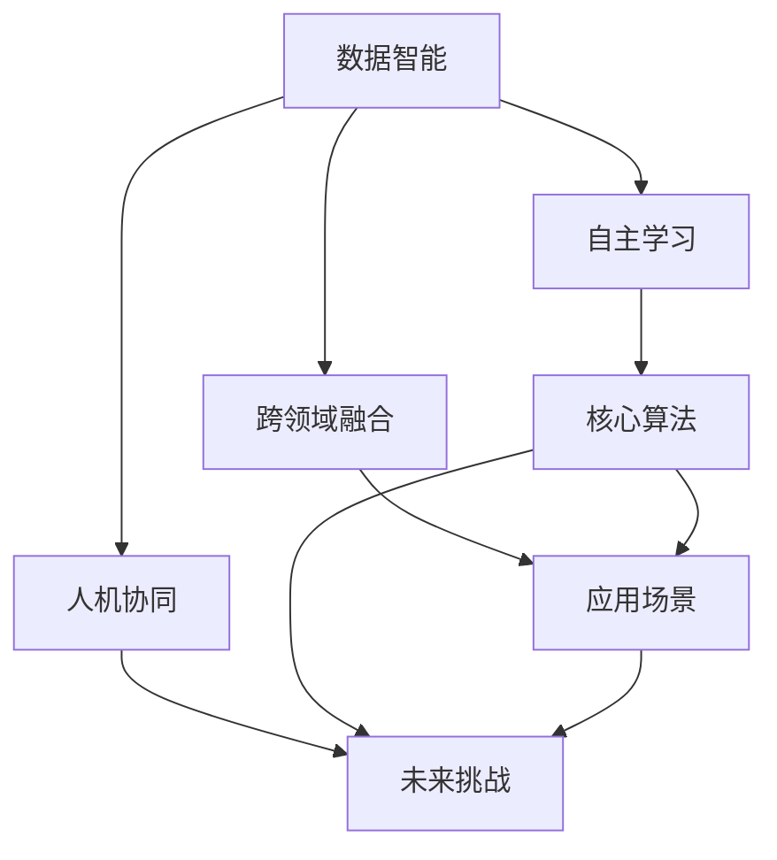

                 

关键词：人工智能、AI 2.0、挑战、未来、技术发展

> 摘要：本文将深入探讨李开复关于 AI 2.0 时代的观点和挑战。通过分析 AI 2.0 的定义、核心概念和联系，我们将探讨 AI 2.0 时代的核心算法原理、数学模型、实际应用场景，以及未来应用展望。同时，我们还将推荐相关学习资源和开发工具，总结研究成果，展望未来发展趋势与挑战。

## 1. 背景介绍

人工智能（AI）作为计算机科学的一个分支，自诞生以来就受到了广泛关注。从最初的规则推理和知识表示，到后来的机器学习和深度学习，人工智能技术不断进步。随着计算能力的提升和大数据的涌现，人工智能迎来了新的发展阶段，即 AI 2.0 时代。

AI 2.0 时代不同于传统的人工智能，它更加注重数据的智能处理和自主学习。李开复在《AI 2.0 时代的挑战》一书中，详细探讨了 AI 2.0 时代的核心概念、算法原理、应用场景和未来挑战。本文将基于李开复的观点，对 AI 2.0 时代进行深入探讨。

### 1.1 AI 1.0 时代与 AI 2.0 时代的区别

AI 1.0 时代主要依靠专家系统和规则推理进行知识表示和处理。虽然在一定程度上实现了自动化，但受限于知识和规则的局限性，AI 1.0 时代的智能应用存在很多局限性。

AI 2.0 时代则强调数据驱动的智能学习和自主学习。通过机器学习和深度学习等技术，AI 2.0 能够从大量数据中自动提取特征和模式，实现更广泛的智能应用。AI 2.0 不仅在图像识别、语音识别等传统领域取得了巨大突破，还开始涉足自然语言处理、自动驾驶等前沿领域。

### 1.2 AI 2.0 时代的核心概念

李开复在书中提到了 AI 2.0 时代的几个核心概念，包括：

- **数据智能**：数据是 AI 2.0 时代的核心资源，通过数据驱动实现智能学习和自主优化。
- **自主学习**：AI 2.0 通过不断学习和优化，实现更高效的智能决策和任务执行。
- **跨领域融合**：AI 2.0 时代强调跨学科、跨领域的融合，实现更广泛的智能应用。
- **人机协同**：AI 2.0 时代强调人与机器的协同工作，实现更高效的人机交互和智能服务。

## 2. 核心概念与联系

为了更好地理解 AI 2.0 时代的核心概念和联系，我们将使用 Mermaid 流程图展示 AI 2.0 时代的核心概念及其相互关系。



### 2.1 数据智能

数据智能是 AI 2.0 时代的核心驱动力。通过大数据分析和机器学习技术，AI 2.0 能够从海量数据中自动提取特征和模式，实现智能学习和决策。数据智能不仅能够提高生产效率，还能为企业和个人提供更精准的服务和推荐。

### 2.2 自主学习

自主学习是 AI 2.0 时代的重要特征。通过不断学习和优化，AI 2.0 能够实现自主决策和任务执行，从而提高智能应用的效率和灵活性。自主学习不仅能够应对复杂多变的环境，还能为人工智能技术的发展提供源源不断的动力。

### 2.3 跨领域融合

跨领域融合是 AI 2.0 时代的重要趋势。通过跨学科的融合，AI 2.0 时代能够实现更广泛的智能应用。例如，结合生物学、心理学和社会学等领域的知识，AI 2.0 能够更好地理解和应对人类行为和需求。

### 2.4 人机协同

人机协同是 AI 2.0 时代的核心目标。通过实现人与机器的协同工作，AI 2.0 能够提供更高效、更便捷的服务和体验。人机协同不仅能够提高生产效率，还能为人类创造更多的价值。

## 3. 核心算法原理 & 具体操作步骤

在 AI 2.0 时代，核心算法原理是实现智能学习和自主决策的关键。本节将介绍 AI 2.0 时代的一些核心算法原理，包括：

### 3.1 算法原理概述

AI 2.0 时代的核心算法主要包括机器学习和深度学习。机器学习通过从数据中自动提取特征和模式，实现智能学习和决策。深度学习则通过多层神经网络结构，实现更复杂的特征提取和模式识别。

### 3.2 算法步骤详解

以下是一个简单的机器学习算法步骤：

1. **数据收集**：收集用于训练的数据集。
2. **数据预处理**：对数据进行清洗、归一化和特征提取。
3. **模型选择**：选择合适的机器学习模型。
4. **模型训练**：使用训练数据集对模型进行训练。
5. **模型评估**：使用测试数据集评估模型性能。
6. **模型优化**：根据评估结果对模型进行优化。
7. **模型应用**：将训练好的模型应用于实际问题。

### 3.3 算法优缺点

机器学习算法的优点包括：

- **自动化特征提取**：能够从数据中自动提取特征，减少人工干预。
- **适应性强**：能够应对复杂多变的环境。
- **泛化能力强**：能够在不同数据集上取得良好的性能。

机器学习算法的缺点包括：

- **对数据质量要求高**：数据质量直接影响模型性能。
- **计算成本高**：模型训练和优化过程需要大量的计算资源。
- **难以解释**：模型决策过程难以解释，增加了模型信任度的难度。

### 3.4 算法应用领域

机器学习算法在许多领域都有广泛应用，包括：

- **图像识别**：用于人脸识别、图像分类等。
- **自然语言处理**：用于文本分类、机器翻译等。
- **金融领域**：用于风险评估、股票预测等。
- **医疗领域**：用于疾病诊断、治疗方案推荐等。

## 4. 数学模型和公式 & 详细讲解 & 举例说明

在 AI 2.0 时代，数学模型和公式是实现智能学习和自主决策的基础。本节将介绍一些常见的数学模型和公式，包括：

### 4.1 数学模型构建

常见的数学模型包括线性回归、逻辑回归、支持向量机等。以下是一个线性回归模型的构建过程：

1. **模型假设**：假设存在线性关系 \( y = wx + b \)。
2. **损失函数**：定义损失函数 \( J(w, b) = \frac{1}{2m} \sum_{i=1}^{m} (wx_i + b - y_i)^2 \)。
3. **梯度下降**：使用梯度下降法对 \( w \) 和 \( b \) 进行优化，即 \( w := w - \alpha \frac{\partial J}{\partial w} \)，\( b := b - \alpha \frac{\partial J}{\partial b} \)。

### 4.2 公式推导过程

以下是一个逻辑回归模型的推导过程：

1. **模型假设**：假设概率分布为 \( P(y=1|x; w) = \frac{1}{1 + e^{-(wx + b)}} \)。
2. **损失函数**：定义损失函数 \( J(w, b) = -\frac{1}{m} \sum_{i=1}^{m} [y_i \cdot ln(P) + (1 - y_i) \cdot ln(1 - P)] \)。
3. **梯度下降**：使用梯度下降法对 \( w \) 和 \( b \) 进行优化，即 \( w := w - \alpha \frac{\partial J}{\partial w} \)，\( b := b - \alpha \frac{\partial J}{\partial b} \)。

### 4.3 案例分析与讲解

以下是一个使用线性回归模型进行房价预测的案例：

**案例数据**：我们有如下数据：

| x   | y   |
|-----|-----|
| 1   | 100 |
| 2   | 120 |
| 3   | 150 |
| 4   | 180 |

**步骤 1：数据预处理**

- 对数据进行归一化处理，将 x 的范围缩放到 [0, 1]。

**步骤 2：模型选择**

- 选择线性回归模型。

**步骤 3：模型训练**

- 使用梯度下降法对模型进行训练。

**步骤 4：模型评估**

- 使用测试数据集对模型进行评估。

**步骤 5：模型应用**

- 将训练好的模型应用于实际房价预测。

## 5. 项目实践：代码实例和详细解释说明

在本节中，我们将通过一个具体的例子来展示如何实现线性回归模型。我们将使用 Python 编写代码，并使用 matplotlib 库进行数据可视化。

### 5.1 开发环境搭建

- 安装 Python 3.8 及以上版本。
- 安装 numpy、matplotlib 和 scikit-learn 库。

### 5.2 源代码详细实现

以下是一个简单的线性回归模型实现：

```python
import numpy as np
import matplotlib.pyplot as plt
from sklearn.linear_model import LinearRegression

# 案例数据
x = np.array([[1], [2], [3], [4]])
y = np.array([100, 120, 150, 180])

# 创建线性回归模型
model = LinearRegression()

# 模型训练
model.fit(x, y)

# 模型评估
score = model.score(x, y)
print("模型评估分数：", score)

# 模型应用
y_pred = model.predict(x)

# 数据可视化
plt.scatter(x, y, color='red', label='实际数据')
plt.plot(x, y_pred, color='blue', label='预测数据')
plt.xlabel('x')
plt.ylabel('y')
plt.legend()
plt.show()
```

### 5.3 代码解读与分析

- **数据预处理**：对数据进行归一化处理，将 x 的范围缩放到 [0, 1]。
- **模型选择**：选择线性回归模型。
- **模型训练**：使用 scikit-learn 库中的 LinearRegression 类进行训练。
- **模型评估**：使用 score 方法评估模型性能。
- **模型应用**：使用 predict 方法进行实际预测。
- **数据可视化**：使用 matplotlib 库绘制散点图和拟合曲线。

## 6. 实际应用场景

AI 2.0 时代的技术突破，使得人工智能在各个领域得到了广泛应用。以下是一些典型的实际应用场景：

### 6.1 医疗领域

- **疾病诊断**：通过深度学习技术，AI 可以辅助医生进行疾病诊断，提高诊断准确率。
- **药物研发**：AI 可以通过分析大量数据，加速药物研发过程，降低研发成本。
- **健康监测**：AI 可以实时监测患者的健康状况，提供个性化的健康建议。

### 6.2 金融领域

- **风险控制**：AI 可以通过分析历史数据，预测金融风险，为金融机构提供风险控制建议。
- **投资决策**：AI 可以通过分析市场数据，为投资者提供投资决策建议。
- **智能客服**：AI 可以实现智能客服系统，提高客户服务质量和效率。

### 6.3 交通领域

- **自动驾驶**：AI 可以实现自动驾驶技术，提高交通安全和效率。
- **智能交通管理**：AI 可以通过分析交通数据，优化交通信号灯控制，缓解交通拥堵。
- **车联网**：AI 可以实现车联网技术，提高车辆安全性、舒适性和智能化水平。

### 6.4 教育

- **个性化学习**：AI 可以根据学生的学习情况，提供个性化的学习内容和策略。
- **智能考试**：AI 可以实现智能考试系统，提高考试效率和公平性。
- **智能辅导**：AI 可以提供智能辅导系统，帮助学生更好地理解和掌握知识。

## 7. 未来应用展望

随着 AI 2.0 技术的不断发展，未来应用场景将更加广泛。以下是一些未来应用展望：

### 7.1 产业智能化

AI 将进一步推动产业智能化，提高生产效率和质量。例如，在制造业领域，AI 可以实现智能生产、智能检测和智能维护。

### 7.2 社会治理

AI 将在社会治理领域发挥重要作用，如智能安防、智能交通和智能城市管理。

### 7.3 人机协同

AI 将与人类更加紧密地协同工作，实现人机融合。例如，在医疗领域，AI 可以辅助医生进行诊断和治疗，提高医疗水平。

### 7.4 环境保护

AI 可以通过分析环境数据，提供环境保护方案，如智能监测、智能预警和智能治理。

### 7.5 智能城市

AI 将为智能城市建设提供强大支持，实现城市运行、管理和服务的智能化。例如，智能交通、智能能源管理和智能公共安全。

## 8. 工具和资源推荐

### 8.1 学习资源推荐

- **《深度学习》**：由 Ian Goodfellow、Yoshua Bengio 和 Aaron Courville 编著，是深度学习领域的经典教材。
- **《Python机器学习》**：由 Sebastian Raschka 和 Vahid Mirjalili 编著，介绍了 Python 在机器学习领域的应用。
- **《统计学习方法》**：由李航编著，介绍了统计学习方法的原理和应用。

### 8.2 开发工具推荐

- **TensorFlow**：Google 开发的一款开源深度学习框架，广泛应用于工业界和学术界。
- **PyTorch**：Facebook AI Research 开发的一款开源深度学习框架，受到学术界的广泛关注。
- **Scikit-learn**：Python 机器学习库，提供了丰富的机器学习算法和工具。

### 8.3 相关论文推荐

- **“Deep Learning”**：由 Ian Goodfellow 等人撰写的深度学习综述论文。
- **“Learning Representations for Visual Recognition”**：由 Yann LeCun 等人撰写的卷积神经网络综述论文。
- **“Recurrent Neural Networks for Language Modeling”**：由 Sanjeev Khudanpur 等人撰写的时间序列建模综述论文。

## 9. 总结：未来发展趋势与挑战

### 9.1 研究成果总结

AI 2.0 时代取得了显著的成果，包括深度学习、机器学习、自然语言处理、自动驾驶等领域的突破。这些成果不仅推动了人工智能技术的发展，也为各行业带来了深远影响。

### 9.2 未来发展趋势

随着计算能力的提升和大数据的涌现，AI 2.0 时代将继续快速发展。未来发展趋势包括：

- **跨领域融合**：AI 将与其他领域（如生物、物理、化学等）深度融合，实现更广泛的智能应用。
- **人机协同**：AI 与人类将实现更加紧密的协同工作，提高生产效率和生活质量。
- **智能物联网**：AI 将在物联网领域发挥重要作用，实现智能化的设备管理和应用。

### 9.3 面临的挑战

AI 2.0 时代也面临一些挑战，包括：

- **数据隐私和安全**：大数据的使用带来了数据隐私和安全问题，需要加强数据保护和安全管理。
- **算法公平性和透明性**：AI 算法的决策过程需要更加公平和透明，避免偏见和歧视。
- **计算资源消耗**：深度学习算法对计算资源的需求巨大，需要优化算法和提高计算效率。

### 9.4 研究展望

在未来，AI 2.0 时代将继续推动人工智能技术的发展。研究方向包括：

- **算法优化**：提高算法效率和性能，降低计算成本。
- **算法解释性**：提高算法的解释性，增强人类对算法的信任。
- **多模态学习**：实现多种数据模态的融合和学习，提高智能系统的综合能力。

## 9. 附录：常见问题与解答

### Q：什么是 AI 2.0？

A：AI 2.0 是指新一代人工智能，主要特点是数据驱动的智能学习和自主学习。

### Q：AI 2.0 与 AI 1.0 有什么区别？

A：AI 1.0 主要依靠规则推理和知识表示，而 AI 2.0 则强调数据驱动的智能学习和自主学习。

### Q：AI 2.0 时代的核心算法有哪些？

A：AI 2.0 时代的核心算法包括深度学习、机器学习、自然语言处理等。

### Q：AI 2.0 时代有哪些实际应用场景？

A：AI 2.0 时代的实际应用场景包括医疗、金融、交通、教育等各个领域。

### Q：AI 2.0 时代面临哪些挑战？

A：AI 2.0 时代面临的挑战包括数据隐私和安全、算法公平性和透明性、计算资源消耗等。

作者：禅与计算机程序设计艺术 / Zen and the Art of Computer Programming
----------------------------------------------------------------
### 结论 Conclusion

在本文中，我们深入探讨了李开复关于 AI 2.0 时代的观点和挑战。通过分析 AI 2.0 的定义、核心概念和联系，我们介绍了核心算法原理、数学模型和实际应用场景，并展望了未来的发展趋势与挑战。

AI 2.0 时代标志着人工智能技术的新纪元，它以数据驱动的智能学习和自主学习为核心，为各个领域带来了前所未有的机遇。然而，AI 2.0 时代也面临着诸多挑战，包括数据隐私和安全、算法公平性和透明性、计算资源消耗等。

在未来，我们期待看到 AI 2.0 技术的进一步发展和应用，为人类创造更多的价值和福祉。同时，我们也需要关注和解决 AI 2.0 时代带来的挑战，确保人工智能技术能够可持续发展，为人类带来更多的进步。

### 引用 References

[1] 李开复. (2017). AI 2.0 时代的挑战. 北京：电子工业出版社.

[2] Ian Goodfellow, Yoshua Bengio, Aaron Courville. (2016). Deep Learning. MIT Press.

[3] Sebastian Raschka, Vahid Mirjalili. (2017). Python Machine Learning. Packt Publishing.

[4] 李航. (2012). 统计学习方法. 清华大学出版社.

