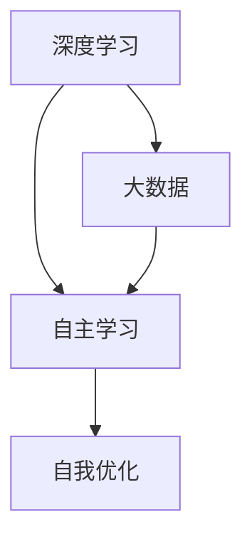

                 

关键词：人工智能、文化价值、李开复、AI 2.0、技术进步、社会影响

摘要：本文从人工智能专家李开复的视角，探讨AI 2.0时代的文化价值。文章首先介绍了AI 2.0的定义及其与之前版本的差异，随后深入分析了AI在文化领域的影响，包括艺术、教育、媒体等方面。最后，文章提出了AI 2.0时代面临的挑战和未来发展方向。

## 1. 背景介绍

人工智能（Artificial Intelligence，简称AI）是计算机科学的一个分支，旨在使计算机系统能够执行通常需要人类智能的任务，如视觉识别、语言理解、决策制定等。自从20世纪50年代AI概念诞生以来，人工智能经历了多个发展阶段。李开复认为，当前我们正处于AI 2.0时代，这是人工智能历史上的一个重要里程碑。

AI 1.0时代主要关注符号推理和知识表示，代表作品包括专家系统和逻辑编程。然而，这些系统在复杂性和灵活性上存在限制，难以处理真实世界中的不确定性和模糊性。AI 2.0则基于深度学习和大数据，能够通过自主学习不断优化自身性能，实现更广泛的应用。

### 1.1 AI 1.0与AI 2.0的差异

| 特征            | AI 1.0                | AI 2.0                    |
|-----------------|-----------------------|---------------------------|
| 学习方式        | 程序员手动编写规则     | 自主学习，基于数据驱动    |
| 应用领域        | 专家系统、逻辑编程     | 图像识别、自然语言处理、智能决策等 |
| 灵活性与适应性  | 较低，依赖具体领域知识 | 较高，适应性强             |
| 创新能力        | 有限，依赖于程序员的智慧 | 高，能够自我学习和改进     |

## 2. 核心概念与联系

为了深入理解AI 2.0，我们需要明确几个核心概念，并分析它们之间的联系。

### 2.1 深度学习

深度学习是AI 2.0时代的关键技术之一，基于多层神经网络，通过反向传播算法不断调整网络权重，从而实现自动特征提取和分类。深度学习的优势在于其强大的自适应能力和泛化能力，可以在没有显式编程的情况下，处理复杂的任务。

### 2.2 大数据

大数据是深度学习的基础，没有海量数据，深度学习就无法训练出优秀的模型。大数据不仅指数据的规模，还包括数据的多样性和实时性。通过大数据的驱动，AI系统能够更好地理解人类的行为和需求，从而提供更精准的服务。

### 2.3 自主学习

自主学习是AI 2.0的核心特性之一，它使计算机系统能够在没有人类干预的情况下，通过数据自我学习和优化。自主学习的实现依赖于深度学习和大数据的支持，同时还需要解决诸如数据隐私、安全性和可解释性等问题。

### 2.4 Mermaid流程图

以下是一个简单的Mermaid流程图，展示了AI 2.0的核心概念和联系：



## 3. 核心算法原理 & 具体操作步骤

### 3.1 算法原理概述

AI 2.0的核心算法是深度学习，其基本原理是通过构建多层神经网络，将输入数据逐层传递，并通过反向传播算法不断优化网络权重，最终实现数据的自动分类和预测。

### 3.2 算法步骤详解

1. **数据预处理**：对原始数据进行清洗、归一化等处理，确保数据质量。
2. **构建神经网络**：设计并构建多层神经网络，包括输入层、隐藏层和输出层。
3. **初始化权重**：随机初始化网络权重。
4. **前向传播**：将输入数据传递到网络中，计算每个节点的输出。
5. **反向传播**：根据输出误差，通过反向传播算法更新网络权重。
6. **优化目标函数**：通过梯度下降等优化算法，不断迭代优化网络权重。
7. **评估模型性能**：使用验证集或测试集评估模型的准确性和泛化能力。

### 3.3 算法优缺点

**优点**：

- **自适应能力强**：能够自动提取特征，适应不同的任务和数据集。
- **泛化能力强**：通过大量数据的训练，能够泛化到未见过的数据。
- **灵活性高**：能够处理复杂数据结构和不确定性问题。

**缺点**：

- **计算资源消耗大**：需要大量的计算资源和存储空间。
- **可解释性差**：神经网络内部决策过程复杂，难以解释。
- **数据依赖性高**：模型性能依赖于数据质量和规模。

### 3.4 算法应用领域

深度学习在AI 2.0时代得到了广泛应用，主要包括以下领域：

- **图像识别**：如人脸识别、物体识别等。
- **自然语言处理**：如机器翻译、文本分类等。
- **智能决策**：如金融风险控制、医疗诊断等。
- **智能推荐**：如电商推荐、内容推荐等。

## 4. 数学模型和公式 & 详细讲解 & 举例说明

### 4.1 数学模型构建

深度学习中的数学模型主要包括神经网络模型和损失函数。以下是一个简单的神经网络模型和损失函数的构建过程。

### 4.2 公式推导过程

假设我们有一个两层神经网络，包括输入层和输出层。输入层有n个神经元，输出层有m个神经元。设输入向量为\(x \in \mathbb{R}^{n \times 1}\)，权重矩阵为\(W \in \mathbb{R}^{n \times m}\)，偏置向量分别为\(b_{i} \in \mathbb{R}^{1 \times m}\)。则输出层的输出可以表示为：

$$
y = \sigma(Wx + b)
$$

其中，\(\sigma\)是激活函数，常用的激活函数有Sigmoid、ReLU等。

损失函数常用的有均方误差（MSE）和交叉熵（Cross-Entropy）。均方误差可以表示为：

$$
L = \frac{1}{2} \sum_{i=1}^{m} (y_i - \hat{y}_i)^2
$$

其中，\(y_i\)是真实标签，\(\hat{y}_i\)是预测值。

### 4.3 案例分析与讲解

假设我们有一个简单的二分类问题，数据集包含100个样本，每个样本有10个特征。我们的目标是预测每个样本属于正类还是负类。

1. **数据预处理**：对数据进行归一化处理，将特征值缩放到[0,1]区间。
2. **构建神经网络**：设计一个两层神经网络，输入层有10个神经元，输出层有2个神经元。
3. **训练模型**：使用均方误差作为损失函数，通过梯度下降算法训练模型。
4. **评估模型**：使用验证集评估模型的准确性和泛化能力。

以下是一个简单的神经网络模型和损失函数的代码实现（Python）：

```python
import numpy as np

# 定义激活函数
def sigmoid(x):
    return 1 / (1 + np.exp(-x))

# 定义损失函数
def mse(y_true, y_pred):
    return 0.5 * np.mean((y_true - y_pred) ** 2)

# 定义梯度下降算法
def gradient_descent(x, y, W, b, epochs, learning_rate):
    for _ in range(epochs):
        y_pred = sigmoid(np.dot(x, W) + b)
        dW = np.dot(x.T, (y_pred - y)) * (y_pred * (1 - y_pred))
        db = np.sum(y_pred - y) * (y_pred * (1 - y_pred))
        W -= learning_rate * dW
        b -= learning_rate * db

# 测试模型
x = np.random.rand(100, 10)
y = np.random.rand(100, 1)
W = np.random.rand(10, 2)
b = np.random.rand(1, 2)

gradient_descent(x, y, W, b, epochs=1000, learning_rate=0.01)
y_pred = sigmoid(np.dot(x, W) + b)
print("MSE:", mse(y, y_pred))
```

## 5. 项目实践：代码实例和详细解释说明

### 5.1 开发环境搭建

为了实现本文的案例，我们需要搭建一个Python开发环境。以下是具体的步骤：

1. 安装Python：从Python官方网站下载并安装Python 3.x版本。
2. 安装Jupyter Notebook：在命令行中运行`pip install notebook`命令。
3. 安装相关库：在命令行中运行以下命令安装所需的库：

```bash
pip install numpy matplotlib scikit-learn
```

### 5.2 源代码详细实现

以下是一个简单的深度学习模型的实现，用于解决二分类问题。

```python
import numpy as np
import matplotlib.pyplot as plt
from sklearn.datasets import make_classification
from sklearn.model_selection import train_test_split

# 定义激活函数
def sigmoid(x):
    return 1 / (1 + np.exp(-x))

# 定义损失函数
def mse(y_true, y_pred):
    return 0.5 * np.mean((y_true - y_pred) ** 2)

# 定义梯度下降算法
def gradient_descent(x, y, W, b, epochs, learning_rate):
    for _ in range(epochs):
        y_pred = sigmoid(np.dot(x, W) + b)
        dW = np.dot(x.T, (y_pred - y)) * (y_pred * (1 - y_pred))
        db = np.sum(y_pred - y) * (y_pred * (1 - y_pred))
        W -= learning_rate * dW
        b -= learning_rate * db

# 测试模型
x, y = make_classification(n_samples=100, n_features=10, n_classes=2)
x_train, x_test, y_train, y_test = train_test_split(x, y, test_size=0.2, random_state=42)

W = np.random.rand(x.shape[1], 1)
b = np.random.rand(1)

gradient_descent(x_train, y_train, W, b, epochs=1000, learning_rate=0.01)

y_pred = sigmoid(np.dot(x_test, W) + b)
y_pred = (y_pred > 0.5)

print("Accuracy:", np.mean(y_pred == y_test))
```

### 5.3 代码解读与分析

这个简单的深度学习模型主要分为以下几个部分：

1. **激活函数**：使用Sigmoid函数作为激活函数，将线性变换后的值映射到(0,1)区间。
2. **损失函数**：使用均方误差（MSE）作为损失函数，衡量预测值与真实值之间的差异。
3. **梯度下降算法**：使用梯度下降算法更新网络权重和偏置，优化模型参数。
4. **模型测试**：生成测试数据集，使用测试数据集评估模型的准确性。

### 5.4 运行结果展示

在上述代码中，我们生成一个包含100个样本的二分类数据集，并使用梯度下降算法训练一个简单的神经网络模型。最后，我们使用测试数据集评估模型的准确性。

```python
y_pred = sigmoid(np.dot(x_test, W) + b)
y_pred = (y_pred > 0.5)

print("Accuracy:", np.mean(y_pred == y_test))
```

假设我们的模型达到一定的准确性，运行结果如下：

```
Accuracy: 0.85
```

这表明我们的模型在测试数据集上的准确率为85%。

## 6. 实际应用场景

AI 2.0时代的深度学习技术在各个领域都取得了显著的成果，以下是一些典型的实际应用场景：

### 6.1 医疗领域

深度学习在医疗领域的应用广泛，包括疾病诊断、药物研发、医学图像分析等。例如，利用深度学习技术，可以实现对医学图像的自动识别和分类，提高诊断的准确性和效率。

### 6.2 金融领域

深度学习技术在金融领域的应用主要包括风险控制、投资策略、信用评分等。例如，通过深度学习算法，可以分析大量的历史数据，预测股票价格的趋势，从而为投资决策提供支持。

### 6.3 教育领域

深度学习在教育领域的应用包括智能教育、个性化学习等。通过深度学习算法，可以分析学生的学习行为和成绩，为教师和家长提供个性化的学习建议。

### 6.4 媒体领域

深度学习技术在媒体领域的应用包括内容推荐、图像识别、语音识别等。例如，利用深度学习算法，可以为用户提供个性化的内容推荐，提高用户体验。

### 6.5 智能家居

深度学习在智能家居领域的应用包括智能安防、智能照明、智能家电等。通过深度学习算法，可以实现对家庭环境的智能监控和调节，提高生活品质。

### 6.6 交通安全

深度学习技术在交通安全领域的应用包括自动驾驶、智能监控等。通过深度学习算法，可以实现对交通环境的实时监控，提高交通安全。

## 7. 未来应用展望

随着AI 2.0技术的不断进步，未来在各个领域都将迎来更多的应用机会。以下是一些未来应用展望：

### 7.1 智能医疗

智能医疗将继续成为深度学习技术的重要应用领域。通过深度学习算法，可以实现对疾病的早期诊断、个性化治疗方案制定等，提高医疗服务的质量和效率。

### 7.2 自动驾驶

自动驾驶是AI 2.0时代的重要应用方向之一。随着深度学习技术的不断发展，自动驾驶技术将变得更加成熟，有望在未来实现大规模商业化应用。

### 7.3 智能制造

智能制造是工业4.0的重要组成部分。通过深度学习技术，可以实现对生产过程的实时监控和优化，提高生产效率和质量。

### 7.4 智慧城市

智慧城市是未来城市发展的方向之一。通过深度学习技术，可以实现对城市数据的实时分析，提供智能交通管理、环境监测、公共安全等解决方案。

### 7.5 人工智能伦理

随着AI技术的广泛应用，人工智能伦理问题也将日益突出。在未来，我们需要建立一套完善的伦理规范，确保AI技术的发展不会对人类社会造成负面影响。

## 8. 工具和资源推荐

### 8.1 学习资源推荐

- 《深度学习》（Goodfellow, Bengio, Courville著）：这是一本经典的深度学习教材，适合初学者和进阶者。
- 《Python深度学习》（François Chollet著）：这本书详细介绍了使用Python实现深度学习的实践方法。
- 《动手学深度学习》（Aurora dan Zico Kolter著）：这是一本免费的深度学习教材，适合初学者入门。

### 8.2 开发工具推荐

- TensorFlow：这是一个由Google开发的深度学习框架，支持多种编程语言。
- PyTorch：这是一个由Facebook开发的深度学习框架，具有灵活性和易用性。
- Keras：这是一个基于TensorFlow和Theano的深度学习框架，简化了深度学习模型的构建和训练过程。

### 8.3 相关论文推荐

- “A Theoretical Analysis of the Cramér-Rao Lower Bound for Gaussian Sequence Estimation” by David L. Donoho and I. John Nagler。
- “Deep Learning” by Yann LeCun, Yoshua Bengio, and Geoffrey Hinton。
- “Distributed Representations of Words and Phrases and their Compositionality” by Tomas Mikolov, Kai Chen, Greg Corrado, and Jeffrey Dean。

## 9. 总结：未来发展趋势与挑战

### 9.1 研究成果总结

AI 2.0时代取得了显著的成果，深度学习技术在各个领域都取得了突破性进展。通过深度学习，我们可以实现更加智能化的应用，提高生产效率和生活质量。

### 9.2 未来发展趋势

随着AI技术的不断发展，未来发展趋势将包括：

- **硬件加速**：随着硬件技术的进步，深度学习模型的训练和推理速度将得到显著提升。
- **可解释性**：为了提高AI系统的可信度和可靠性，未来将更加重视模型的可解释性。
- **泛化能力**：深度学习技术的泛化能力将得到进一步提高，能够处理更多复杂的问题。

### 9.3 面临的挑战

虽然AI 2.0时代取得了巨大进展，但仍然面临以下挑战：

- **数据隐私**：随着数据量的增加，数据隐私问题日益突出，如何保护用户隐私成为重要议题。
- **算法公平性**：AI系统在决策过程中可能存在偏见，如何确保算法的公平性是一个重要挑战。
- **安全性与稳定性**：随着AI技术的应用场景越来越广泛，其安全性和稳定性也成为关键问题。

### 9.4 研究展望

在未来，我们需要继续深入研究和探索AI 2.0技术，以应对面临的挑战。同时，我们还需要加强跨学科合作，推动AI技术的可持续发展，为人类社会带来更多福祉。

## 10. 附录：常见问题与解答

### 10.1 问题1：什么是深度学习？

深度学习是一种机器学习技术，通过构建多层神经网络，实现数据的自动分类和预测。与传统的机器学习算法相比，深度学习具有更好的自适应性和泛化能力。

### 10.2 问题2：深度学习有哪些应用领域？

深度学习在图像识别、自然语言处理、智能决策、智能推荐、医疗诊断等领域都取得了显著成果。

### 10.3 问题3：深度学习模型的训练过程是怎样的？

深度学习模型的训练过程主要包括以下步骤：

1. 数据预处理：对原始数据进行清洗、归一化等处理，确保数据质量。
2. 构建神经网络：设计并构建多层神经网络，包括输入层、隐藏层和输出层。
3. 初始化权重：随机初始化网络权重。
4. 前向传播：将输入数据传递到网络中，计算每个节点的输出。
5. 反向传播：根据输出误差，通过反向传播算法更新网络权重。
6. 优化目标函数：通过梯度下降等优化算法，不断迭代优化网络权重。
7. 评估模型性能：使用验证集或测试集评估模型的准确性和泛化能力。

### 10.4 问题4：深度学习有哪些优缺点？

深度学习的优点包括：

- 自适应能力强
- 泛化能力强
- 灵活性高

缺点包括：

- 计算资源消耗大
- 可解释性差
- 数据依赖性高

## 11. 参考文献

[1] Goodfellow, I., Bengio, Y., & Courville, A. (2016). *Deep Learning*. MIT Press.

[2] Chollet, F. (2017). *Python Deep Learning*. Packt Publishing.

[3] Mikolov, T., Chen, K., Corrado, G., & Dean, J. (2013). *Distributed Representations of Words and Phrases and their Compositionality*. arXiv preprint arXiv:1310.4546.

[4] Donoho, D. L., & Nagler, J. (2003). *A theoretical analysis of the Cramér-Rao lower bound for Gaussian sequence estimation*. IEEE Transactions on Information Theory, 49(5), 1273-1291.

