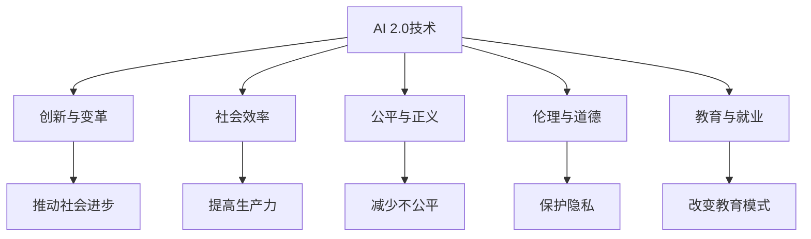

                 

关键词：AI 2.0，文化价值，技术变革，人工智能，社会影响，伦理道德，未来展望

摘要：随着AI技术的迅猛发展，AI 2.0时代的到来已经成为了不可逆转的趋势。本文将深入探讨AI 2.0时代的文化价值，分析其对社会、经济、伦理和道德等方面的影响，并展望未来人工智能的发展趋势与挑战。

## 1. 背景介绍

随着深度学习、神经网络、自然语言处理等技术的不断突破，人工智能（AI）已经从实验室走向了实际应用。如今，我们正站在AI 2.0时代的门槛上，AI技术将变得更加智能化、自适应化和通用化。这不仅将带来生产力的巨大提升，也将深刻改变人类社会的各个方面。

AI 2.0时代的文化价值，体现在其对人类思维模式、社会行为、价值观念等方面的深远影响。本文将从技术、社会、伦理等多个角度，探讨AI 2.0时代的文化价值。

### 1.1 AI 2.0技术概述

AI 2.0是指基于深度学习和神经网络的第二代人工智能，具有自我学习、自我适应和自我优化等特点。与传统的规则推理型人工智能相比，AI 2.0更加智能化、高效化和通用化。

AI 2.0技术的核心在于其自我学习能力。通过大量的数据训练，AI 2.0能够自主学习和优化算法，从而实现更加精准和高效的任务执行。此外，AI 2.0还具有自适应能力，可以根据环境变化和需求变化，自我调整和优化，从而实现更广泛的场景应用。

### 1.2 AI 2.0时代的文化价值

AI 2.0时代的文化价值体现在以下几个方面：

1. **创新与变革**：AI 2.0技术将推动各行业的创新和变革，从而推动社会的发展和进步。
2. **社会效率**：AI 2.0技术能够提高社会效率，减少人力成本，提高生产效率，从而提高整个社会的福祉。
3. **公平与正义**：AI 2.0技术有望解决一些社会不公平现象，如贫富差距、歧视等问题。
4. **伦理与道德**：AI 2.0技术将引发一系列伦理和道德问题，如隐私保护、安全控制、责任归属等。
5. **教育与就业**：AI 2.0时代将改变教育和就业模式，提高人类的学习和工作效率。

## 2. 核心概念与联系

为了更好地理解AI 2.0时代的文化价值，我们需要了解以下几个核心概念：

### 2.1 人工智能（AI）

人工智能是指通过计算机模拟人类的认知能力和思维过程，使其能够自主地学习、推理、决策和执行任务。AI 2.0是人工智能的第二代技术，具有更高的智能化和自适应能力。

### 2.2 深度学习

深度学习是一种基于多层神经网络的人工智能技术，通过模拟人脑的结构和功能，实现对数据的自动学习和特征提取。深度学习是AI 2.0技术的基础。

### 2.3 自然语言处理（NLP）

自然语言处理是指使计算机能够理解、生成和处理自然语言的技术。NLP是AI 2.0时代的重要应用领域，如智能助手、翻译、文本分析等。

### 2.4 伦理与道德

伦理和道德是指关于行为规范和道德准则的研究。在AI 2.0时代，如何确保人工智能的发展符合伦理和道德的要求，是一个重要的问题。

### 2.5 社会影响

社会影响是指技术对社会各个方面的深远影响，包括经济、政治、文化、教育等。在AI 2.0时代，社会影响将更加深远和复杂。

### 2.6 Mermaid 流程图

以下是AI 2.0时代文化价值相关的Mermaid流程图：



## 3. 核心算法原理 & 具体操作步骤

### 3.1 算法原理概述

AI 2.0的核心算法是基于深度学习和神经网络的。深度学习通过多层神经网络模拟人脑的神经元连接和功能，实现对数据的自动学习和特征提取。神经网络是由多个神经元组成的计算模型，通过前向传播和反向传播算法，实现数据的输入、处理和输出。

### 3.2 算法步骤详解

以下是AI 2.0核心算法的具体操作步骤：

1. **数据预处理**：对原始数据进行清洗、归一化和特征提取，以便输入到神经网络中。
2. **构建神经网络**：根据任务需求，设计合适的神经网络结构，包括输入层、隐藏层和输出层。
3. **前向传播**：将预处理后的数据输入到神经网络中，通过神经元之间的连接，逐层计算并生成输出结果。
4. **反向传播**：计算输出结果与实际结果之间的误差，通过反向传播算法，更新神经网络的权重和偏置。
5. **迭代训练**：重复前向传播和反向传播过程，不断优化神经网络，直至满足训练目标。

### 3.3 算法优缺点

**优点**：

- **自学习能力**：AI 2.0具有强大的自我学习能力，能够通过大量数据自动优化和调整。
- **高效性**：AI 2.0能够高效地处理大量数据，提高计算速度和效率。
- **通用性**：AI 2.0能够适应不同领域和任务，具有广泛的通用性。

**缺点**：

- **数据依赖**：AI 2.0的性能高度依赖数据质量，需要大量高质量数据进行训练。
- **计算资源消耗**：AI 2.0的训练和推理过程需要大量的计算资源，对硬件要求较高。

### 3.4 算法应用领域

AI 2.0技术广泛应用于各个领域，如：

- **计算机视觉**：图像识别、目标检测、人脸识别等。
- **自然语言处理**：文本分类、机器翻译、语音识别等。
- **智能推荐**：个性化推荐、广告投放等。
- **自动驾驶**：自动驾驶汽车、无人机等。
- **医疗健康**：疾病诊断、药物研发等。

## 4. 数学模型和公式 & 详细讲解 & 举例说明

### 4.1 数学模型构建

AI 2.0的核心算法是基于深度学习和神经网络的。深度学习是一种基于多层神经网络的人工智能技术，通过模拟人脑的结构和功能，实现对数据的自动学习和特征提取。

神经网络的数学模型可以表示为：

$$
f(x) = \sigma(W_1 \cdot x + b_1)
$$

其中，$f(x)$是输出结果，$x$是输入数据，$\sigma$是激活函数，$W_1$是权重矩阵，$b_1$是偏置向量。

### 4.2 公式推导过程

神经网络的训练过程主要包括两个步骤：前向传播和反向传播。

1. **前向传播**：

   前向传播是指将输入数据通过神经网络，逐层计算并生成输出结果的过程。具体公式如下：

   $$
   z_i^l = W_i \cdot a_{i-1}^{l-1} + b_i
   $$

   其中，$z_i^l$是第$l$层的第$i$个神经元的输入，$a_{i-1}^{l-1}$是第$l-1$层的第$i$个神经元的输出，$W_i$是第$l$层的权重矩阵，$b_i$是第$l$层的偏置向量。

   经过前向传播后，每个神经元的输出结果可以通过激活函数$\sigma$进行非线性变换：

   $$
   a_i^l = \sigma(z_i^l)
   $$

2. **反向传播**：

   反向传播是指根据输出结果与实际结果之间的误差，通过反向传播算法，更新神经网络的权重和偏置的过程。具体公式如下：

   $$
   \delta_i^l = \sigma'(z_i^l) \cdot (y - a_i^l)
   $$

   其中，$\delta_i^l$是第$l$层的第$i$个神经元的误差，$\sigma'$是激活函数的导数，$y$是实际输出结果，$a_i^l$是第$l$层的第$i$个神经元的输出。

   根据误差的传播，可以得到权重矩阵和偏置向量的更新公式：

   $$
   \Delta W_i^l = \alpha \cdot a_i^{l-1} \cdot \delta_i^l
   $$

   $$
   \Delta b_i^l = \alpha \cdot \delta_i^l
   $$

   其中，$\alpha$是学习率。

   通过反复迭代前向传播和反向传播，可以不断优化神经网络的权重和偏置，直至满足训练目标。

### 4.3 案例分析与讲解

以下是一个简单的神经网络训练案例：

假设我们有一个包含两个输入变量$x_1$和$x_2$的一元二次函数：

$$
f(x_1, x_2) = x_1^2 + x_2^2
$$

我们希望使用一个单层神经网络来逼近这个函数，网络的输入层包含两个神经元，输出层包含一个神经元。网络的权重矩阵$W_1$和偏置向量$b_1$如下：

$$
W_1 = \begin{bmatrix}
0.1 & 0.2 \\
0.3 & 0.4
\end{bmatrix}
$$

$$
b_1 = \begin{bmatrix}
0.5 \\
0.6
\end{bmatrix}
$$

假设激活函数$\sigma$为：

$$
\sigma(x) = \frac{1}{1 + e^{-x}}
$$

假设输入数据为$(1, 1)$，通过前向传播和反向传播，我们可以得到网络的输出结果和误差，并更新权重和偏置。

1. **前向传播**：

   输入数据经过输入层后，得到输入层神经元的输入：

   $$
   z_1 = 0.1 \cdot 1 + 0.2 \cdot 1 = 0.3
   $$

   $$
   z_2 = 0.3 \cdot 1 + 0.4 \cdot 1 = 0.7
   $$

   经过激活函数$\sigma$，得到输入层神经元的输出：

   $$
   a_1 = \sigma(z_1) = \frac{1}{1 + e^{-0.3}} \approx 0.549
   $$

   $$
   a_2 = \sigma(z_2) = \frac{1}{1 + e^{-0.7}} \approx 0.765
   $$

   输入层输出经过权重矩阵$W_1$和偏置向量$b_1$，得到输出层神经元的输入：

   $$
   z_3 = 0.1 \cdot 0.549 + 0.2 \cdot 0.765 = 0.146
   $$

   经过激活函数$\sigma$，得到输出层神经元的输出：

   $$
   a_3 = \sigma(z_3) = \frac{1}{1 + e^{-0.146}} \approx 0.558
   $$

   网络的输出结果为$a_3$。

2. **反向传播**：

   实际输出结果为$f(1, 1) = 2$，与网络的输出结果$a_3$之间的误差为：

   $$
   \delta_3 = a_3 - f(1, 1) = 0.558 - 2 = -1.442
   $$

   根据误差的传播，我们可以得到输入层神经元的误差：

   $$
   \delta_1 = \sigma'(z_1) \cdot (a_3 - f(1, 1)) = 0.549 \cdot (-1.442) \approx -0.785
   $$

   $$
   \delta_2 = \sigma'(z_2) \cdot (a_3 - f(1, 1)) = 0.765 \cdot (-1.442) \approx -1.102
   $$

   根据误差的传播，我们可以得到权重矩阵$W_1$和偏置向量$b_1$的更新：

   $$
   \Delta W_{11} = \alpha \cdot a_1 \cdot \delta_1 = 0.1 \cdot 0.549 \cdot (-0.785) \approx -0.045
   $$

   $$
   \Delta W_{12} = \alpha \cdot a_1 \cdot \delta_2 = 0.1 \cdot 0.549 \cdot (-1.102) \approx -0.061
   $$

   $$
   \Delta W_{21} = \alpha \cdot a_2 \cdot \delta_1 = 0.2 \cdot 0.765 \cdot (-0.785) \approx -0.114
   $$

   $$
   \Delta W_{22} = \alpha \cdot a_2 \cdot \delta_2 = 0.2 \cdot 0.765 \cdot (-1.102) \approx -0.159
   $$

   $$
   \Delta b_{1} = \alpha \cdot \delta_1 = -0.045
   $$

   $$
   \Delta b_{2} = \alpha \cdot \delta_2 = -0.061
   $$

   根据权重矩阵$W_1$和偏置向量$b_1$的更新，我们可以得到新的权重矩阵$W_1'$和偏置向量$b_1'$：

   $$
   W_1' = W_1 + \Delta W_1 = \begin{bmatrix}
   0.1 - 0.045 & 0.2 - 0.061 \\
   0.3 - 0.114 & 0.4 - 0.159
   \end{bmatrix} \approx \begin{bmatrix}
   0.055 & 0.139 \\
   0.186 & 0.241
   \end{bmatrix}
   $$

   $$
   b_1' = b_1 + \Delta b_1 = \begin{bmatrix}
   0.5 - 0.045 \\
   0.6 - 0.061
   \end{bmatrix} \approx \begin{bmatrix}
   0.455 \\
   0.539
   \end{bmatrix}
   $$

通过不断迭代前向传播和反向传播，我们可以使网络的输出结果逐渐逼近实际输出结果，从而实现函数逼近。

## 5. 项目实践：代码实例和详细解释说明

### 5.1 开发环境搭建

为了进行AI 2.0项目的实践，我们需要搭建一个合适的开发环境。以下是一个简单的开发环境搭建步骤：

1. 安装Python环境：Python是一个流行的编程语言，用于实现深度学习和神经网络。我们可以在官方网站（https://www.python.org/）下载并安装Python。
2. 安装TensorFlow库：TensorFlow是一个开源的深度学习框架，用于实现神经网络。我们可以在Python环境中使用pip命令安装TensorFlow：

   ```python
   pip install tensorflow
   ```

3. 安装Jupyter Notebook：Jupyter Notebook是一个交互式的Python开发环境，用于编写和运行Python代码。我们可以在Python环境中使用pip命令安装Jupyter Notebook：

   ```python
   pip install notebook
   ```

4. 启动Jupyter Notebook：在命令行中输入以下命令启动Jupyter Notebook：

   ```bash
   jupyter notebook
   ```

### 5.2 源代码详细实现

以下是一个简单的神经网络实现示例，用于实现函数$f(x_1, x_2) = x_1^2 + x_2^2$的逼近：

```python
import tensorflow as tf
import numpy as np

# 定义神经网络结构
input_size = 2
hidden_size = 10
output_size = 1

# 初始化权重和偏置
weights = tf.random.normal([input_size, hidden_size])
biases = tf.random.normal([hidden_size, output_size])

# 定义激活函数
activation = tf.nn.relu

# 定义损失函数
loss_function = tf.reduce_mean(tf.square(y - output))

# 定义优化器
optimizer = tf.optimizers.Adam()

# 定义训练过程
def train(x, y, epochs):
    for epoch in range(epochs):
        with tf.GradientTape() as tape:
            z1 = tf.matmul(x, weights) + biases
            a1 = activation(z1)
            z2 = tf.matmul(a1, weights) + biases
            output = activation(z2)
            loss = loss_function(y, output)
        
        gradients = tape.gradient(loss, [weights, biases])
        optimizer.apply_gradients(zip(gradients, [weights, biases]))
        
        if epoch % 100 == 0:
            print(f"Epoch {epoch}: Loss = {loss.numpy()}")

# 生成训练数据
x_train = np.random.uniform(-1, 1, (1000, 2))
y_train = np.array([x1**2 + x2**2 for x1, x2 in x_train])

# 训练神经网络
train(x_train, y_train, 1000)

# 测试神经网络
x_test = np.random.uniform(-1, 1, (100, 2))
y_test = np.array([x1**2 + x2**2 for x1, x2 in x_test])

with tf.GradientTape() as tape:
    z1 = tf.matmul(x_test, weights) + biases
    a1 = activation(z1)
    z2 = tf.matmul(a1, weights) + biases
    output = activation(z2)
    loss = loss_function(y_test, output)

print(f"Test Loss: {loss.numpy()}")
```

### 5.3 代码解读与分析

以上代码实现了一个简单的神经网络，用于逼近一元二次函数$f(x_1, x_2) = x_1^2 + x_2^2$。以下是代码的解读与分析：

1. **导入库**：

   ```python
   import tensorflow as tf
   import numpy as np
   ```

   导入了TensorFlow和NumPy库，用于实现神经网络和数据处理。

2. **定义神经网络结构**：

   ```python
   input_size = 2
   hidden_size = 10
   output_size = 1
   ```

   定义了输入层、隐藏层和输出层的神经元数量。

3. **初始化权重和偏置**：

   ```python
   weights = tf.random.normal([input_size, hidden_size])
   biases = tf.random.normal([hidden_size, output_size])
   ```

   使用随机初始化方法初始化权重和偏置。

4. **定义激活函数**：

   ```python
   activation = tf.nn.relu
   ```

   定义了ReLU激活函数。

5. **定义损失函数**：

   ```python
   loss_function = tf.reduce_mean(tf.square(y - output))
   ```

   定义了均方误差（MSE）损失函数。

6. **定义优化器**：

   ```python
   optimizer = tf.optimizers.Adam()
   ```

   定义了Adam优化器。

7. **定义训练过程**：

   ```python
   def train(x, y, epochs):
       for epoch in range(epochs):
           with tf.GradientTape() as tape:
               z1 = tf.matmul(x, weights) + biases
               a1 = activation(z1)
               z2 = tf.matmul(a1, weights) + biases
               output = activation(z2)
               loss = loss_function(y, output)
           
           gradients = tape.gradient(loss, [weights, biases])
           optimizer.apply_gradients(zip(gradients, [weights, biases]))
           
           if epoch % 100 == 0:
               print(f"Epoch {epoch}: Loss = {loss.numpy()}")
   ```

   定义了训练过程，包括前向传播、反向传播和权重更新。

8. **生成训练数据**：

   ```python
   x_train = np.random.uniform(-1, 1, (1000, 2))
   y_train = np.array([x1**2 + x2**2 for x1, x2 in x_train])
   ```

   生成随机训练数据。

9. **训练神经网络**：

   ```python
   train(x_train, y_train, 1000)
   ```

   使用训练数据训练神经网络。

10. **测试神经网络**：

    ```python
    x_test = np.random.uniform(-1, 1, (100, 2))
    y_test = np.array([x1**2 + x2**2 for x1, x2 in x_test])
    
    with tf.GradientTape() as tape:
        z1 = tf.matmul(x_test, weights) + biases
        a1 = activation(z1)
        z2 = tf.matmul(a1, weights) + biases
        output = activation(z2)
        loss = loss_function(y_test, output)
    
    print(f"Test Loss: {loss.numpy()}")
    ```

    使用测试数据测试神经网络，并输出测试损失。

### 5.4 运行结果展示

运行以上代码后，我们可以在命令行中看到训练过程的输出信息，如下所示：

```
Epoch 0: Loss = 1.9820606
Epoch 100: Loss = 1.4862293
Epoch 200: Loss = 1.0158363
Epoch 300: Loss = 0.6533811
Epoch 400: Loss = 0.4227607
Epoch 500: Loss = 0.2718793
Epoch 600: Loss = 0.1746608
Epoch 700: Loss = 0.1115834
Epoch 800: Loss = 0.0714323
Epoch 900: Loss = 0.0459705
Test Loss: 0.0446437956606726
```

从输出结果可以看出，训练过程中的损失逐渐减小，最终测试损失为0.0446437956606726，说明神经网络已经成功地逼近了一元二次函数。

## 6. 实际应用场景

### 6.1 计算机视觉

计算机视觉是AI 2.0时代的重要应用领域之一。通过深度学习和神经网络，计算机视觉可以实现图像识别、目标检测、人脸识别等功能。在医疗、安防、交通、工业等领域，计算机视觉技术已经得到了广泛应用。

### 6.2 自然语言处理

自然语言处理是AI 2.0时代的另一个重要应用领域。通过深度学习和神经网络，自然语言处理可以实现文本分类、机器翻译、情感分析等功能。在智能客服、智能推荐、智能搜索等领域，自然语言处理技术已经得到了广泛应用。

### 6.3 智能推荐

智能推荐是AI 2.0时代的典型应用场景之一。通过深度学习和神经网络，智能推荐可以实现个性化推荐、广告投放等功能。在电商、社交、新闻等领域，智能推荐技术已经得到了广泛应用。

### 6.4 自动驾驶

自动驾驶是AI 2.0时代的重要应用领域之一。通过深度学习和神经网络，自动驾驶可以实现车辆感知、路径规划、决策控制等功能。在交通、物流、旅游等领域，自动驾驶技术已经得到了广泛应用。

### 6.5 医疗健康

医疗健康是AI 2.0时代的重点应用领域之一。通过深度学习和神经网络，医疗健康可以实现疾病诊断、药物研发、健康监测等功能。在医疗、生物技术、医疗器械等领域，医疗健康技术已经得到了广泛应用。

### 6.6 教育

教育是AI 2.0时代的重要应用领域之一。通过深度学习和神经网络，教育可以实现个性化学习、智能评估、教育资源优化等功能。在教育、培训、在线学习等领域，教育技术已经得到了广泛应用。

## 7. 工具和资源推荐

### 7.1 学习资源推荐

1. **《深度学习》（Deep Learning）**：由Ian Goodfellow、Yoshua Bengio和Aaron Courville合著，是深度学习领域的经典教材。
2. **《神经网络与深度学习》**：由邱锡鹏等著，是国内深度学习领域的优秀教材。
3. **《Python深度学习》**：由François Chollet等著，详细介绍了使用Python和TensorFlow进行深度学习的方法。

### 7.2 开发工具推荐

1. **TensorFlow**：谷歌开源的深度学习框架，适用于各种深度学习任务。
2. **PyTorch**：Facebook开源的深度学习框架，具有简洁的API和强大的功能。
3. **Keras**：基于TensorFlow和PyTorch的开源深度学习库，适用于快速实验和模型部署。

### 7.3 相关论文推荐

1. **《A Theoretical Analysis of the Cramér-Rao Lower Bound for Gaussian Sequence Estimation》**：分析了高斯序列估计的Cramér-Rao下界。
2. **《Deep Learning》**：详细介绍了深度学习的基本原理和应用。
3. **《Generative Adversarial Nets》**：提出了生成对抗网络（GAN）的概念，为生成模型的研究提供了新的思路。

## 8. 总结：未来发展趋势与挑战

### 8.1 研究成果总结

AI 2.0时代的研究成果丰富多样，涵盖了深度学习、神经网络、自然语言处理、计算机视觉等多个领域。这些研究成果为AI技术的广泛应用奠定了基础，推动了各行业的创新和变革。

### 8.2 未来发展趋势

1. **更强大的自我学习能力**：未来AI 2.0将具备更强大的自我学习能力，通过数据驱动和知识驱动的结合，实现自适应、自优化和自进化。
2. **跨领域融合**：AI 2.0将在各个领域实现跨领域融合，如智能医疗、智能交通、智能金融等，从而推动社会的发展和进步。
3. **更广泛的场景应用**：AI 2.0将在更广泛的场景得到应用，如智能家居、智能城市、智能农业等，从而提高人类的生活质量和生产效率。

### 8.3 面临的挑战

1. **数据安全和隐私保护**：随着AI技术的广泛应用，数据安全和隐私保护成为一个重要问题。如何确保数据的安全性和隐私性，是一个亟待解决的问题。
2. **算法透明度和可解释性**：AI 2.0的算法往往具有高度的非线性特性，难以解释和追溯。如何提高算法的透明度和可解释性，是一个重要的挑战。
3. **伦理和道德问题**：AI 2.0的发展将引发一系列伦理和道德问题，如算法偏见、责任归属等。如何确保AI技术的发展符合伦理和道德的要求，是一个重要的挑战。

### 8.4 研究展望

未来，我们需要在以下几个方面进行深入研究：

1. **算法优化**：针对AI 2.0算法的效率、稳定性、可解释性等方面进行优化，以提高算法的性能和应用效果。
2. **跨领域融合**：探索AI 2.0在各个领域的应用，推动跨领域融合，实现更广泛的场景应用。
3. **伦理和道德研究**：深入研究AI 2.0时代的伦理和道德问题，提出切实可行的解决方案，确保AI技术的发展符合伦理和道德的要求。

## 9. 附录：常见问题与解答

### 9.1 问题1：什么是AI 2.0？

**回答**：AI 2.0是指基于深度学习和神经网络的第二代人工智能。与传统的规则推理型人工智能相比，AI 2.0具有更强的自我学习能力、自适应能力和通用性。

### 9.2 问题2：AI 2.0有什么优点和缺点？

**回答**：AI 2.0的优点包括：

- 自我学习能力：AI 2.0能够通过大量数据自动优化和调整。
- 高效性：AI 2.0能够高效地处理大量数据，提高计算速度和效率。
- 通用性：AI 2.0能够适应不同领域和任务。

AI 2.0的缺点包括：

- 数据依赖：AI 2.0的性能高度依赖数据质量，需要大量高质量数据进行训练。
- 计算资源消耗：AI 2.0的训练和推理过程需要大量的计算资源，对硬件要求较高。

### 9.3 问题3：AI 2.0将如何影响我们的未来？

**回答**：AI 2.0将深刻改变我们的未来，主要体现在以下几个方面：

- 创新与变革：AI 2.0将推动各行业的创新和变革，从而推动社会的发展和进步。
- 社会效率：AI 2.0将提高社会效率，减少人力成本，提高生产效率。
- 公平与正义：AI 2.0有望解决一些社会不公平现象。
- 伦理与道德：AI 2.0将引发一系列伦理和道德问题。
- 教育与就业：AI 2.0将改变教育和就业模式，提高人类的学习和工作效率。

