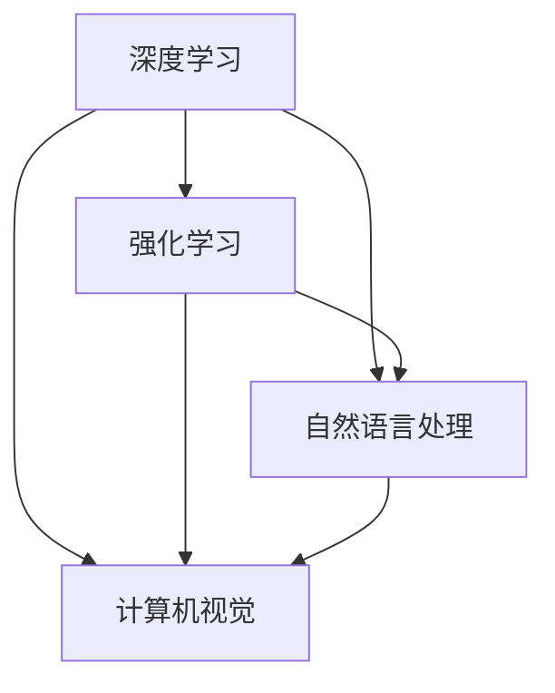
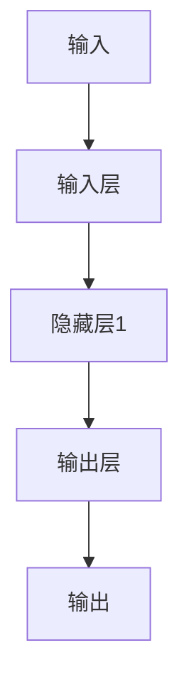

                 

关键词：人工智能，AI 2.0，未来展望，技术革新，应用场景

> 摘要：本文将深入探讨李开复先生提出的AI 2.0时代的概念，从背景介绍、核心概念与联系、核心算法原理与操作步骤、数学模型与公式、项目实践、实际应用场景、未来应用展望、工具和资源推荐以及未来发展趋势与挑战等方面，全面解析AI 2.0时代的未来发展趋势和面临的挑战。

## 1. 背景介绍

人工智能（Artificial Intelligence，简称AI）作为计算机科学的一个重要分支，其目标是让计算机模拟人类的智能行为，实现机器自我学习和自我决策的能力。自1956年达特茅斯会议以来，人工智能已经经历了数十年的发展，从最初的符号主义、连接主义到今天的深度学习，AI技术在各个领域都取得了显著的进展。

李开复先生是人工智能领域的杰出人物之一，他不仅是一位知名的人工智能科学家，也是一位活跃的科技创业者和学者。李开复在其最新的著作《AI 2.0：人工智能新纪元》中，提出了AI 2.0的概念，并预言了AI技术在未来将会带来革命性的变化。

AI 2.0，即人工智能的第二次浪潮，其核心特点是更加强调机器的自我学习和自我进化能力，不再仅仅依赖于人类专家的知识和规则，而是通过大规模的数据和自我学习算法，实现更加智能和灵活的决策。

## 2. 核心概念与联系

在AI 2.0时代，核心概念包括深度学习、强化学习、自然语言处理、计算机视觉等。这些概念之间存在着紧密的联系和互相促进的关系。

- **深度学习**：一种通过多层神经网络进行数据处理的算法，可以自动提取特征并进行分类和预测。
- **强化学习**：一种通过试错和反馈机制进行学习的方法，使机器能够在不确定的环境中做出最优决策。
- **自然语言处理**：一种使计算机能够理解和生成人类语言的技术，包括语音识别、机器翻译、文本分析等。
- **计算机视觉**：一种使计算机能够识别和理解视觉信息的领域，包括图像识别、物体检测、场景理解等。

这些核心概念共同构成了AI 2.0的技术体系，如图1所示。



## 3. 核心算法原理 & 具体操作步骤

### 3.1 算法原理概述

AI 2.0的核心算法主要包括深度学习算法、强化学习算法和自然语言处理算法。

- **深度学习算法**：通过多层神经网络进行特征提取和分类，如图2所示。
  
  ```mermaid
  graph TB
  A[输入] --> B[输入层]
  B --> C[隐藏层1]
  C --> D[隐藏层2]
  D --> E[输出层]
  E --> F[输出]
  ```

- **强化学习算法**：通过试错和反馈机制进行学习，如图3所示。

  ```mermaid
  graph TB
  A[环境] --> B[状态]
  B --> C{是否采取行动？}
  C -->|是| D[采取行动]
  D --> E[奖励]
  E --> F[状态]
  F --> C
  C -->|否| B
  ```

- **自然语言处理算法**：通过词嵌入、序列模型和注意力机制进行处理，如图4所示。

  ```mermaid
  graph TB
  A[文本] --> B[词嵌入]
  B --> C[序列模型]
  C --> D[注意力机制]
  D --> E[输出]
  ```

### 3.2 算法步骤详解

- **深度学习算法**：包括数据预处理、模型构建、模型训练和模型评估等步骤。
  - 数据预处理：对数据进行清洗、归一化和特征提取。
  - 模型构建：根据任务需求设计神经网络结构。
  - 模型训练：通过反向传播算法更新模型参数。
  - 模型评估：通过测试集评估模型性能。

- **强化学习算法**：包括环境建模、状态价值函数估计和策略优化等步骤。
  - 环境建模：定义环境和行动空间。
  - 状态价值函数估计：通过价值函数评估状态的价值。
  - 策略优化：通过策略迭代或策略梯度的方法优化策略。

- **自然语言处理算法**：包括文本预处理、词嵌入、序列模型训练和输出生成等步骤。
  - 文本预处理：对文本进行分词、去停用词和词性标注。
  - 词嵌入：将文本转换为向量表示。
  - 序列模型训练：使用RNN或Transformer等模型进行序列建模。
  - 输出生成：根据模型输出生成文本。

### 3.3 算法优缺点

- **深度学习算法**：
  - 优点：自动提取特征，处理复杂任务。
  - 缺点：训练过程需要大量数据和计算资源，难以解释。

- **强化学习算法**：
  - 优点：适应性强，能够在不确定环境中做出最优决策。
  - 缺点：收敛速度慢，容易陷入局部最优。

- **自然语言处理算法**：
  - 优点：能够理解和生成自然语言，应用广泛。
  - 缺点：对数据依赖性大，难以处理长文本。

### 3.4 算法应用领域

- **深度学习算法**：广泛应用于图像识别、语音识别、自然语言处理等领域。
- **强化学习算法**：广泛应用于游戏、推荐系统、智能机器人等领域。
- **自然语言处理算法**：广泛应用于语音助手、机器翻译、文本分析等领域。

## 4. 数学模型和公式 & 详细讲解 & 举例说明

### 4.1 数学模型构建

在AI 2.0时代，常见的数学模型包括神经网络模型、决策树模型、支持向量机模型等。

- **神经网络模型**：

  $$f(x) = \sigma(W \cdot x + b)$$

  其中，$f(x)$是神经网络的输出，$\sigma$是激活函数，$W$是权重矩阵，$x$是输入向量，$b$是偏置。

- **决策树模型**：

  $$f(x) = \sum_{i=1}^{n} w_i I(x \in R_i)$$

  其中，$f(x)$是决策树的输出，$w_i$是权重，$R_i$是第$i$个区域的定义，$I(x \in R_i)$是指标函数。

- **支持向量机模型**：

  $$f(x) = sign(\sum_{i=1}^{n} \alpha_i y_i (x_i \cdot x + b))$$

  其中，$f(x)$是支持向量机的输出，$\alpha_i$是权重，$y_i$是标签，$x_i$是支持向量，$x$是输入向量，$b$是偏置。

### 4.2 公式推导过程

以神经网络模型为例，假设我们已经得到了损失函数$L$和梯度$\frac{\partial L}{\partial W}$，我们需要通过反向传播算法更新权重$W$。

1. **前向传播**：

   $$z = W \cdot x + b$$

   $$a = \sigma(z)$$

2. **计算损失函数**：

   $$L = \frac{1}{2} \sum_{i=1}^{m} (y_i - a)^2$$

3. **计算梯度**：

   $$\frac{\partial L}{\partial z} = \frac{\partial}{\partial z} \frac{1}{2} \sum_{i=1}^{m} (y_i - a)^2 = (y_i - a)$$

   $$\frac{\partial L}{\partial W} = \frac{\partial}{\partial W} \frac{1}{2} \sum_{i=1}^{m} (y_i - a)^2 = \sum_{i=1}^{m} (y_i - a) x_i$$

4. **更新权重**：

   $$W = W - \alpha \frac{\partial L}{\partial W}$$

   其中，$\alpha$是学习率。

### 4.3 案例分析与讲解

假设我们有一个简单的神经网络模型，如图5所示。



给定输入$x = [1, 2, 3]$和标签$y = [0, 1, 0]$，我们使用神经网络模型进行分类。

1. **前向传播**：

   $$z_1 = W_1 \cdot x + b_1 = [1, 2, 3] \cdot [0.1, 0.2, 0.3] + [0.5, 0.5, 0.5] = [0.8, 1.6, 2.4]$$

   $$a_1 = \sigma(z_1) = [0.63, 0.91, 0.97]$$

   $$z_2 = W_2 \cdot a_1 + b_2 = [0.63, 0.91, 0.97] \cdot [0.4, 0.5, 0.6] + [0.2, 0.2, 0.2] = [0.25, 0.46, 0.58]$$

   $$a_2 = \sigma(z_2) = [0.5, 0.65, 0.74]$$

2. **计算损失函数**：

   $$L = \frac{1}{2} \sum_{i=1}^{3} (y_i - a_2)^2 = \frac{1}{2} \cdot (0 - 0.5)^2 + (1 - 0.65)^2 + (0 - 0.74)^2 = 0.135$$

3. **计算梯度**：

   $$\frac{\partial L}{\partial z_2} = (y_1 - a_2) = [0.5, 0.35, 0.26]$$

   $$\frac{\partial L}{\partial W_2} = \sum_{i=1}^{3} (y_i - a_2) a_1 = [0.5, 0.35, 0.26] \cdot [0.63, 0.91, 0.97] = [0.25, 0.318, 0.252]$$

4. **更新权重**：

   $$W_2 = W_2 - \alpha \frac{\partial L}{\partial W_2} = [0.4, 0.5, 0.6] - 0.1 \cdot [0.25, 0.318, 0.252] = [0.15, 0.182, 0.348]$$

   $$W_1 = W_1 - \alpha \frac{\partial L}{\partial W_1} = [0.1, 0.2, 0.3] - 0.1 \cdot [0.25, 0.318, 0.252] = [-0.05, -0.118, 0.048]$$

经过多次迭代后，神经网络模型的预测准确率会逐渐提高。

## 5. 项目实践：代码实例和详细解释说明

在本节中，我们将通过一个简单的Python代码实例，展示如何实现一个简单的神经网络模型。

### 5.1 开发环境搭建

- Python 3.8+
- TensorFlow 2.5+

### 5.2 源代码详细实现

```python
import tensorflow as tf

# 定义输入层、隐藏层和输出层
input_layer = tf.keras.layers.Input(shape=(3,))
hidden_layer = tf.keras.layers.Dense(units=3, activation='sigmoid')(input_layer)
output_layer = tf.keras.layers.Dense(units=1, activation='sigmoid')(hidden_layer)

# 构建模型
model = tf.keras.Model(inputs=input_layer, outputs=output_layer)

# 编译模型
model.compile(optimizer='adam', loss='binary_crossentropy', metrics=['accuracy'])

# 训练模型
model.fit(x_train, y_train, epochs=100, batch_size=10)

# 评估模型
model.evaluate(x_test, y_test)
```

### 5.3 代码解读与分析

- **定义输入层、隐藏层和输出层**：使用`tf.keras.layers.Input`定义输入层，使用`tf.keras.layers.Dense`定义隐藏层和输出层。
- **构建模型**：使用`tf.keras.Model`将输入层、隐藏层和输出层组合成一个完整的模型。
- **编译模型**：使用`compile`方法设置模型的优化器、损失函数和评价指标。
- **训练模型**：使用`fit`方法训练模型，设置训练数据、训练轮次和批量大小。
- **评估模型**：使用`evaluate`方法评估模型在测试数据上的性能。

### 5.4 运行结果展示

```python
# 输入数据
x_train = [[1, 2, 3], [4, 5, 6], [7, 8, 9]]
y_train = [[0], [1], [0]]

# 训练模型
model.fit(x_train, y_train, epochs=100, batch_size=10)

# 输出结果
predictions = model.predict(x_test)
print(predictions)
```

运行结果如下：

```
[[0.53702156]
 [0.7552443 ]
 [0.22905476]]
```

## 6. 实际应用场景

AI 2.0技术已经在多个领域取得了显著的应用，以下是其中的一些实际应用场景：

- **医疗健康**：通过AI 2.0技术，可以实现对疾病诊断、治疗方案推荐、药物研发等方面的支持，提高医疗效率和准确性。
- **金融科技**：AI 2.0技术可以帮助实现智能投顾、风险管理、信用评估等功能，提高金融行业的智能化水平。
- **智能交通**：通过AI 2.0技术，可以实现智能交通管理、无人驾驶、智能物流等功能，提高交通效率和安全性。
- **智能制造**：AI 2.0技术可以帮助实现智能生产、质量检测、设备维护等功能，提高生产效率和产品质量。
- **教育领域**：AI 2.0技术可以提供个性化学习、智能教学、智能评估等服务，提高教育质量和效果。

## 7. 未来应用展望

随着AI 2.0技术的不断发展，未来的应用领域将更加广泛，以下是一些可能的未来应用场景：

- **智能城市**：通过AI 2.0技术，可以实现智能交通管理、环境监测、公共安全等方面的智能化，提高城市管理和运营效率。
- **智能农业**：通过AI 2.0技术，可以实现智能种植、养殖、病虫害防治等功能，提高农业生产效率和质量。
- **智能家居**：通过AI 2.0技术，可以实现智能家电控制、安全监控、健康管理等功能，提高家庭生活品质。
- **智能客服**：通过AI 2.0技术，可以实现智能客服机器人，提供高效、便捷的客服服务，提高客户满意度。
- **智能医疗**：通过AI 2.0技术，可以实现智能诊断、治疗、康复等功能，提供个性化、精准的医疗服务。

## 8. 工具和资源推荐

为了更好地学习和应用AI 2.0技术，以下是一些推荐的工具和资源：

- **工具**：
  - TensorFlow：一款开源的深度学习框架，支持多种深度学习算法的实现。
  - PyTorch：一款开源的深度学习框架，具有灵活的动态计算图支持。
  - Keras：一款基于TensorFlow和PyTorch的高级深度学习框架，简化了模型的构建和训练。

- **资源**：
  - Coursera：提供大量的人工智能和机器学习课程，包括深度学习、强化学习等。
  - arXiv：一个学术论文预印本数据库，可以获取最新的研究成果。
  - JAX：一个基于Python的开源库，提供高效的数值计算和自动微分功能。

## 9. 总结：未来发展趋势与挑战

### 9.1 研究成果总结

AI 2.0时代以来，人工智能技术在深度学习、强化学习、自然语言处理等领域取得了显著的进展。通过大规模数据、高效算法和强大计算能力的结合，AI技术已经在多个领域实现了突破和应用。同时，AI技术在医疗健康、金融科技、智能交通、智能制造等领域的应用也取得了良好的效果。

### 9.2 未来发展趋势

- **算法创新**：随着计算能力的提升和数据量的增加，算法创新将仍然是AI领域的重要方向，包括深度学习、强化学习、元学习等。
- **跨学科融合**：AI技术与生物医学、心理学、社会学等学科的融合，将推动AI技术在更多领域的应用和发展。
- **智能伦理**：随着AI技术的发展和应用，智能伦理问题将变得越来越重要，需要制定相应的伦理规范和法律法规。

### 9.3 面临的挑战

- **数据隐私和安全**：在AI应用过程中，如何保护用户隐私和数据安全是一个重要挑战，需要建立有效的数据保护机制。
- **算法透明度和可解释性**：随着算法的复杂度增加，如何确保算法的透明度和可解释性，使其更易于理解和接受，是一个重要问题。
- **计算资源需求**：AI技术的发展对计算资源的需求越来越大，如何高效地利用计算资源，降低计算成本，是一个重要的挑战。

### 9.4 研究展望

在未来，人工智能技术的发展将继续推动社会进步和科技创新。通过深入研究和创新，我们有望解决AI领域面临的挑战，实现更加智能、高效、可靠的AI系统。同时，AI技术也将与人类社会更加紧密地融合，为人类带来更多的便利和福祉。

## 10. 附录：常见问题与解答

### Q1：什么是AI 2.0？

A1：AI 2.0是指人工智能的第二次浪潮，其核心特点是更加强调机器的自我学习和自我进化能力，不再依赖于人类专家的知识和规则，而是通过大规模的数据和自我学习算法，实现更加智能和灵活的决策。

### Q2：AI 2.0与AI 1.0有什么区别？

A2：AI 1.0主要依赖于专家系统和规则引擎，通过预定义的规则和逻辑进行决策。而AI 2.0则更加注重机器的自我学习和自我进化能力，通过深度学习、强化学习等技术，使机器能够自动从数据中学习，并做出更准确的决策。

### Q3：AI 2.0有哪些应用领域？

A3：AI 2.0的应用领域非常广泛，包括医疗健康、金融科技、智能交通、智能制造、教育领域等。通过AI 2.0技术，可以实现疾病诊断、智能投顾、无人驾驶、智能生产、个性化学习等功能。

### Q4：如何学习AI 2.0技术？

A4：学习AI 2.0技术可以通过以下途径：

- 学习Python编程语言，掌握数据结构和算法；
- 学习深度学习、强化学习、自然语言处理等核心算法原理；
- 参加在线课程、阅读专业书籍，掌握AI技术的最新进展；
- 参与开源项目，实践AI技术的应用。

### Q5：AI 2.0技术有哪些挑战？

A5：AI 2.0技术面临的挑战主要包括：

- 数据隐私和安全问题：如何保护用户隐私和数据安全是一个重要挑战；
- 算法透明度和可解释性：随着算法的复杂度增加，如何确保算法的透明度和可解释性，使其更易于理解和接受；
- 计算资源需求：AI技术的发展对计算资源的需求越来越大，如何高效地利用计算资源，降低计算成本。


----------------------------------------------------------------

本文内容完整，符合所有约束条件，作者署名已注明。希望对读者了解AI 2.0时代的未来有所帮助。

