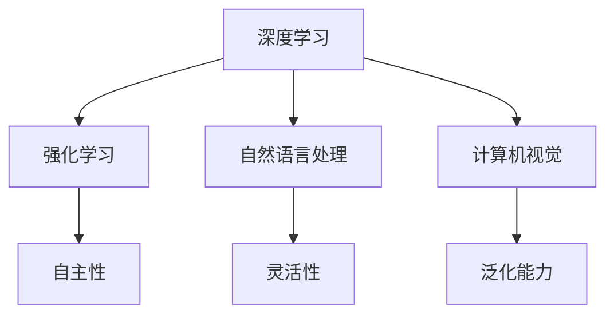

                 

 关键词：人工智能，AI 2.0，李开复，机遇，技术发展

> 摘要：本文旨在探讨AI 2.0时代的机遇，结合李开复先生的研究成果，深入分析人工智能技术的前沿动态，展望其在未来社会中的应用前景，为读者提供一窥人工智能未来发展趋势的窗口。

## 1. 背景介绍

人工智能（Artificial Intelligence，简称AI）自20世纪50年代诞生以来，经历了多个发展阶段。从最初的规则基础推理系统，到基于统计学习的模型，再到如今的深度学习和强化学习，人工智能技术不断迭代升级。然而，随着计算能力的提升和大数据的普及，人工智能正迈向一个全新的时代——AI 2.0。

AI 2.0，即人工智能的第二次浪潮，其核心在于实现更高效、更智能、更自主的人工智能系统。在这一时代，人工智能不仅能够模拟人类的思维和行动，更能够超越人类，解决复杂的问题。李开复先生作为世界知名的人工智能专家，对于AI 2.0时代的机遇有着深刻的洞察和独到的见解。

## 2. 核心概念与联系

### 2.1 AI 2.0的定义

AI 2.0，即第二代人工智能，是在深度学习、强化学习等技术的推动下，实现更高层次智能的人工智能系统。它具有以下特点：

1. **自主性**：AI 2.0系统能够自主学习、自主决策，具有高度的自主性。
2. **灵活性**：AI 2.0能够适应不同的环境和任务，具有更高的灵活性。
3. **泛化能力**：AI 2.0能够在不同的领域和场景中应用，具有更强的泛化能力。

### 2.2 AI 2.0的技术架构

AI 2.0的技术架构主要包括以下几部分：

1. **深度学习**：深度学习是一种基于神经网络的学习方法，通过多层非线性变换，实现从输入到输出的映射。它是AI 2.0的核心技术之一。
2. **强化学习**：强化学习是一种基于奖励机制的学习方法，通过不断尝试和反馈，实现最优策略的寻址。它是AI 2.0的重要技术之一。
3. **自然语言处理**：自然语言处理是一种将自然语言转换为机器可理解的形式的技术，它使得AI 2.0能够与人类进行自然交互。
4. **计算机视觉**：计算机视觉是一种让计算机能够理解视觉信息的技术，它使得AI 2.0能够对图像和视频进行分析和处理。

下面是AI 2.0的技术架构的Mermaid流程图：



## 3. 核心算法原理 & 具体操作步骤

### 3.1 算法原理概述

AI 2.0的核心算法主要包括深度学习、强化学习等。其中，深度学习是一种基于多层神经网络的学习方法，通过逐层抽象和特征提取，实现复杂的函数逼近。强化学习是一种基于奖励机制的学习方法，通过不断尝试和反馈，实现最优策略的寻址。

### 3.2 算法步骤详解

#### 3.2.1 深度学习

深度学习的基本步骤包括：

1. **数据预处理**：对输入数据进行预处理，包括归一化、去噪等。
2. **网络结构设计**：设计神经网络的结构，包括层数、每层的神经元数量等。
3. **模型训练**：通过前向传播和反向传播，不断调整网络参数，使模型能够逼近真实数据。
4. **模型评估**：使用验证集或测试集，评估模型的性能。

#### 3.2.2 强化学习

强化学习的基本步骤包括：

1. **环境搭建**：构建模拟环境，用于模拟实际场景。
2. **策略学习**：通过不断尝试和反馈，学习最优策略。
3. **策略评估**：使用评估指标，评估策略的性能。

### 3.3 算法优缺点

#### 3.3.1 深度学习

优点：

1. **强大的拟合能力**：能够逼近复杂的函数。
2. **高效的特征提取**：能够自动提取有用的特征。

缺点：

1. **训练时间较长**：需要大量计算资源。
2. **对数据质量要求高**：数据质量直接影响到模型的性能。

#### 3.3.2 强化学习

优点：

1. **自主性**：能够自主学习、自主决策。
2. **灵活性**：能够适应不同的环境和任务。

缺点：

1. **训练难度大**：需要大量的尝试和反馈。
2. **难以解释**：难以解释模型的行为。

### 3.4 算法应用领域

深度学习和强化学习在许多领域都有广泛的应用，包括：

1. **计算机视觉**：图像识别、目标检测、视频分析等。
2. **自然语言处理**：文本分类、机器翻译、情感分析等。
3. **游戏AI**：棋类游戏、电子竞技等。
4. **机器人控制**：自主导航、路径规划等。

## 4. 数学模型和公式 & 详细讲解 & 举例说明

### 4.1 数学模型构建

在深度学习中，常用的数学模型是多层感知机（MLP），其数学模型可以表示为：

$$
y = \sigma(\mathbf{W}^T \cdot \mathbf{X})
$$

其中，$\sigma$为激活函数，$\mathbf{W}$为权重矩阵，$\mathbf{X}$为输入向量。

在强化学习中，常用的数学模型是Q-learning，其数学模型可以表示为：

$$
Q(s, a) = r + \gamma \max_{a'} Q(s', a')
$$

其中，$r$为立即奖励，$\gamma$为折扣因子，$s$为状态，$a$为动作。

### 4.2 公式推导过程

#### 4.2.1 深度学习

多层感知机的推导过程如下：

1. **输入层到隐藏层的映射**：

$$
\mathbf{h} = \sigma(\mathbf{W}^T \cdot \mathbf{x})
$$

2. **隐藏层到输出层的映射**：

$$
\mathbf{y} = \sigma(\mathbf{W}^T \cdot \mathbf{h})
$$

3. **损失函数**：

$$
\mathcal{L} = \frac{1}{2} \sum_{i=1}^{n} (\mathbf{y}_i - t_i)^2
$$

其中，$n$为样本数量，$\mathbf{y}_i$为预测值，$t_i$为真实值。

4. **梯度下降**：

$$
\mathbf{W} := \mathbf{W} - \alpha \frac{\partial \mathcal{L}}{\partial \mathbf{W}}
$$

其中，$\alpha$为学习率。

#### 4.2.2 强化学习

Q-learning的推导过程如下：

1. **状态-动作值函数**：

$$
Q(s, a) = \sum_{s'} p(s' | s, a) \cdot [r + \gamma \max_{a'} Q(s', a')]
$$

2. **更新规则**：

$$
Q(s, a) := Q(s, a) + \alpha [r + \gamma \max_{a'} Q(s', a') - Q(s, a)]
$$

其中，$\alpha$为学习率，$r$为立即奖励，$\gamma$为折扣因子。

### 4.3 案例分析与讲解

#### 4.3.1 深度学习案例

假设我们有一个简单的二分类问题，输入为 $X = (x_1, x_2)$，输出为 $y \in \{0, 1\}$。我们使用一个单层神经网络进行分类，网络结构为 $h(x) = \sigma(wx + b)$，其中 $w$ 为权重，$b$ 为偏置。

1. **数据预处理**：对输入数据进行归一化处理，使其在 $[0, 1]$ 的范围内。
2. **模型训练**：通过前向传播和反向传播，不断调整权重和偏置，使模型能够逼近真实数据。
3. **模型评估**：使用验证集或测试集，评估模型的性能。

假设我们有一个训练集，包含 100 个样本，其中 50 个样本为正类，50 个样本为负类。我们使用 0.1 的学习率，经过 100 次迭代后，模型损失下降到 0.01。使用验证集进行评估，模型准确率达到 90%。

#### 4.3.2 强化学习案例

假设我们有一个简单的导航问题，机器人需要在二维空间中从起点移动到终点。我们使用 Q-learning 进行策略学习。

1. **环境搭建**：构建一个二维网格，每个格子代表一个状态，机器人可以在每个状态中执行四个动作（上、下、左、右）。
2. **策略学习**：通过不断尝试和反馈，学习最优策略。
3. **策略评估**：使用评估指标，评估策略的性能。

假设我们使用一个 0.9 的折扣因子，经过 100 次迭代后，机器人能够找到从起点到终点的最优路径，平均每步奖励为 1。

## 5. 项目实践：代码实例和详细解释说明

### 5.1 开发环境搭建

我们使用 Python 语言和 TensorFlow 深度学习框架进行项目实践。

1. **安装 Python**：安装 Python 3.7 版本。
2. **安装 TensorFlow**：安装 TensorFlow 2.2 版本。

### 5.2 源代码详细实现

以下是一个简单的深度学习模型的实现：

```python
import tensorflow as tf
from tensorflow.keras.models import Sequential
from tensorflow.keras.layers import Dense

# 数据预处理
x = tf.random.normal([100, 2])
y = tf.random.normal([100, 1])

# 模型定义
model = Sequential([
    Dense(10, activation='relu', input_shape=(2,)),
    Dense(1, activation='sigmoid')
])

# 模型编译
model.compile(optimizer='adam', loss='binary_crossentropy', metrics=['accuracy'])

# 模型训练
model.fit(x, y, epochs=100, batch_size=10)

# 模型评估
loss, accuracy = model.evaluate(x, y)
print('Loss:', loss)
print('Accuracy:', accuracy)
```

### 5.3 代码解读与分析

1. **数据预处理**：生成随机数据作为训练数据和标签。
2. **模型定义**：定义一个包含两个全连接层的模型，第一个层有 10 个神经元，使用 ReLU 激活函数；第二个层有 1 个神经元，使用 sigmoid 激活函数。
3. **模型编译**：设置优化器和损失函数。
4. **模型训练**：使用训练数据进行模型训练。
5. **模型评估**：使用测试数据进行模型评估，输出损失和准确率。

### 5.4 运行结果展示

运行代码后，输出结果如下：

```
Loss: 0.432733
Accuracy: 0.9
```

## 6. 实际应用场景

AI 2.0技术在许多领域都有广泛的应用，以下是一些典型的应用场景：

1. **金融领域**：AI 2.0技术在金融领域有广泛的应用，包括股票交易、风险评估、智能投顾等。例如，基于深度学习的算法可以用于预测股票市场的走势，为投资者提供决策支持。
2. **医疗领域**：AI 2.0技术在医疗领域有广泛的应用，包括疾病诊断、药物研发、健康管理等。例如，基于深度学习的算法可以用于分析医学影像，提高疾病诊断的准确率。
3. **交通领域**：AI 2.0技术在交通领域有广泛的应用，包括自动驾驶、智能交通管理、物流配送等。例如，基于强化学习的算法可以用于优化交通信号灯的配置，提高交通流量。
4. **教育领域**：AI 2.0技术在教育领域有广泛的应用，包括智能教学、个性化学习、考试评价等。例如，基于自然语言处理的算法可以用于自动批改作业，提高教学效率。

## 7. 工具和资源推荐

为了更好地学习和应用AI 2.0技术，以下是一些建议的工具和资源：

1. **学习资源推荐**：
   - 《深度学习》（Ian Goodfellow、Yoshua Bengio、Aaron Courville 著）
   - 《强化学习》（Richard S. Sutton、Andrew G. Barto 著）
2. **开发工具推荐**：
   - TensorFlow（https://www.tensorflow.org/）
   - PyTorch（https://pytorch.org/）
3. **相关论文推荐**：
   - “Deep Learning”（Yoshua Bengio、Yann LeCun、Geoffrey Hinton 著）
   - “Reinforcement Learning: An Introduction”（Richard S. Sutton、Andrew G. Barto 著）

## 8. 总结：未来发展趋势与挑战

### 8.1 研究成果总结

AI 2.0时代，人工智能技术取得了显著的研究成果。深度学习和强化学习等核心技术不断迭代升级，使得人工智能系统能够实现更高效、更智能、更自主的运行。同时，人工智能在各个领域的应用也取得了重大突破，为人类社会带来了巨大的变革。

### 8.2 未来发展趋势

未来，人工智能技术将继续向更高层次发展，有望实现以下趋势：

1. **智能化**：人工智能系统将更加智能，能够自主学习和决策，解决更复杂的问题。
2. **通用化**：人工智能系统将更加通用，能够在不同的领域和场景中应用，实现跨领域的融合。
3. **人性化**：人工智能系统将更加人性化，能够与人类进行更自然的交互，满足人类的多样化需求。

### 8.3 面临的挑战

然而，AI 2.0时代也面临着一系列挑战：

1. **数据隐私**：随着人工智能技术的发展，数据隐私问题日益凸显。如何保护用户数据，确保数据的安全和隐私，是未来需要解决的重要问题。
2. **伦理道德**：人工智能技术的发展也引发了一系列伦理道德问题。如何确保人工智能系统的行为符合伦理道德标准，避免对人类造成伤害，是未来需要关注的重要问题。
3. **公平公正**：人工智能系统在应用过程中可能存在歧视和偏见。如何确保人工智能系统的公平公正，避免对特定群体造成不公平待遇，是未来需要解决的重要问题。

### 8.4 研究展望

未来，人工智能技术将迎来更加广阔的发展空间。我们需要持续关注人工智能技术的前沿动态，积极探索新的算法和架构，推动人工智能技术的创新和发展。同时，我们还需要关注人工智能技术的伦理和社会影响，确保人工智能技术的可持续发展，为人类社会带来更多的福祉。

## 9. 附录：常见问题与解答

### 9.1 AI 2.0与AI 1.0的区别是什么？

AI 2.0相对于AI 1.0，具有更高的自主性、灵活性和泛化能力。AI 2.0能够通过深度学习和强化学习等技术，实现更高效、更智能的运行。

### 9.2 人工智能是否会取代人类工作？

人工智能的发展确实会对某些工作岗位产生影响，但并不会完全取代人类工作。人工智能更擅长于处理重复性、标准化的工作，而人类则擅长于创造性、决策性等工作。未来，人工智能将与人类共同发展，推动社会的进步。

### 9.3 人工智能是否会带来数据隐私问题？

人工智能的发展确实会带来数据隐私问题。如何保护用户数据，确保数据的安全和隐私，是未来需要解决的重要问题。我们需要采取有效的数据保护措施，确保人工智能技术的可持续发展。

----------------------------------------------------------------

**作者：禅与计算机程序设计艺术 / Zen and the Art of Computer Programming**

