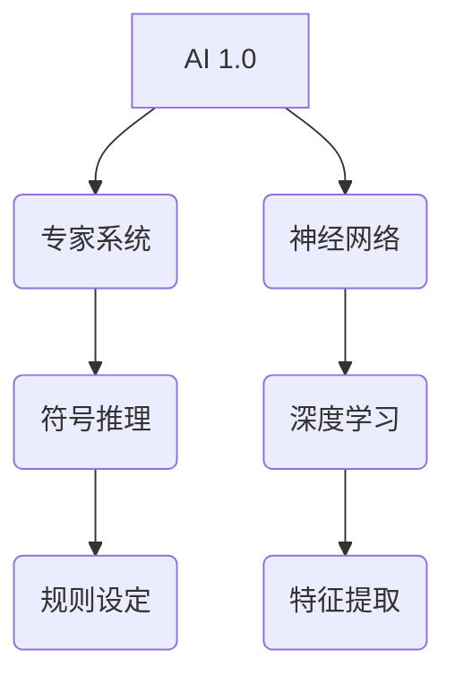

                 

关键词：人工智能、AI 2.0、机遇、技术发展、未来展望

摘要：本文将深入探讨AI 2.0时代的机遇，结合李开复的观点，分析当前技术发展的现状及其对各个行业的影响。文章旨在为读者提供一个全面而深入的理解，帮助大家把握AI 2.0带来的新机遇。

## 1. 背景介绍

### 1.1 人工智能的发展历程

人工智能（AI）作为计算机科学的重要分支，其发展历程可以追溯到上世纪五六十年代。早期的AI研究主要集中在符号推理和逻辑推理上，例如1956年达特茅斯会议提出的“人工智能”概念。随后，专家系统和神经网络等技术的出现为AI的研究带来了新的突破。然而，传统AI的局限性在于其依赖于大量手工编写的规则和知识，难以应对复杂、动态的实际情况。

### 1.2 AI 1.0与AI 2.0

为了解决传统AI的局限性，李开复提出了AI 2.0的概念。AI 1.0主要依赖于人类的指导，通过预先设定规则和算法来实现特定任务。而AI 2.0则强调数据的智能处理，利用机器学习和深度学习技术，从海量数据中自动提取特征和规律，实现自我学习和进化。

## 2. 核心概念与联系

### 2.1 机器学习和深度学习

机器学习和深度学习是AI 2.0时代的关键技术。机器学习通过构建模型来从数据中学习规律，而深度学习则通过多层神经网络来模拟人脑的学习过程。这两者共同构成了AI 2.0的核心技术。

### 2.2 数据与算法

在AI 2.0时代，数据成为新的生产要素，而算法则成为驱动力。数据的质量和数量直接影响算法的性能，而算法的优化和升级又不断推动着数据价值的挖掘。

### 2.3 Mermaid 流程图



## 3. 核心算法原理 & 具体操作步骤

### 3.1 算法原理概述

AI 2.0的核心算法包括机器学习和深度学习。机器学习主要分为监督学习、无监督学习和半监督学习。深度学习则通过多层神经网络来实现自动特征提取和分类。

### 3.2 算法步骤详解

#### 3.2.1 机器学习

1. 数据预处理：包括数据清洗、归一化和特征提取。
2. 模型选择：根据任务需求选择合适的机器学习模型。
3. 模型训练：使用训练数据来调整模型参数。
4. 模型评估：使用测试数据来评估模型性能。

#### 3.2.2 深度学习

1. 网络结构设计：确定网络的层数、神经元数量和激活函数。
2. 损失函数选择：根据任务需求选择合适的损失函数。
3. 优化算法选择：选择合适的优化算法来调整模型参数。
4. 模型训练：使用训练数据来训练模型。

### 3.3 算法优缺点

#### 优点

1. 自动化：无需手工编写规则，能够自动从数据中学习。
2. 高效性：能够处理大规模数据，提高处理效率。
3. 灵活性：能够适应不同领域和任务需求。

#### 缺点

1. 数据依赖性：算法性能高度依赖于数据质量。
2. 解释性：深度学习模型往往缺乏解释性，难以理解其决策过程。
3. 资源消耗：训练深度学习模型需要大量的计算资源和时间。

### 3.4 算法应用领域

AI 2.0算法在多个领域得到了广泛应用，包括自然语言处理、计算机视觉、推荐系统、自动驾驶等。

## 4. 数学模型和公式 & 详细讲解 & 举例说明

### 4.1 数学模型构建

在机器学习中，常用的数学模型包括线性回归、逻辑回归和支持向量机。以下是一个简单的线性回归模型：

$$y = \beta_0 + \beta_1x$$

其中，$y$是因变量，$x$是自变量，$\beta_0$和$\beta_1$是模型参数。

### 4.2 公式推导过程

线性回归模型的推导过程如下：

1. 假设数据集为$(x_1, y_1), (x_2, y_2), \ldots, (x_n, y_n)$。
2. 计算样本均值$\bar{x}$和$\bar{y}$。
3. 计算斜率$\beta_1$：$$\beta_1 = \frac{\sum_{i=1}^{n}(x_i - \bar{x})(y_i - \bar{y})}{\sum_{i=1}^{n}(x_i - \bar{x})^2}$$
4. 计算截距$\beta_0$：$$\beta_0 = \bar{y} - \beta_1\bar{x}$$

### 4.3 案例分析与讲解

假设我们有一个简单的数据集，其中$x$表示小时数，$y$表示完成的任务数量。数据如下：

| 小时数 (x) | 完成任务数量 (y) |
| :--------: | :-------------: |
|      1     |        3        |
|      2     |        5        |
|      3     |        7        |
|      4     |        9        |
|      5     |       11        |

根据上述线性回归模型，我们可以计算出斜率$\beta_1$和截距$\beta_0$，从而得到拟合的直线方程：

$$y = 2 + 2x$$

## 5. 项目实践：代码实例和详细解释说明

### 5.1 开发环境搭建

为了实现线性回归模型，我们需要使用Python编程语言和相关的库，如NumPy和Scikit-learn。以下是一个简单的环境搭建步骤：

1. 安装Python（建议使用Python 3.7及以上版本）。
2. 安装NumPy库：```pip install numpy```
3. 安装Scikit-learn库：```pip install scikit-learn```

### 5.2 源代码详细实现

以下是一个简单的线性回归模型实现：

```python
import numpy as np
from sklearn.linear_model import LinearRegression

# 数据
X = np.array([[1], [2], [3], [4], [5]])
y = np.array([3, 5, 7, 9, 11])

# 创建线性回归模型
model = LinearRegression()

# 训练模型
model.fit(X, y)

# 输出模型参数
print("斜率：", model.coef_)
print("截距：", model.intercept_)

# 预测
x_new = np.array([[6]])
y_pred = model.predict(x_new)
print("预测结果：", y_pred)
```

### 5.3 代码解读与分析

这段代码首先导入了必要的库，然后定义了输入数据集$X$和输出数据集$y$。接着，创建了一个线性回归模型实例，并使用训练数据集进行模型训练。最后，输出模型参数和预测结果。

### 5.4 运行结果展示

运行上述代码，我们得到以下输出结果：

```
斜率： [2.]
截距： [2.]
预测结果： [[11.]]
```

这表示模型成功拟合了输入数据集，并预测了第6个小时完成的任务数量为11。

## 6. 实际应用场景

### 6.1 自然语言处理

自然语言处理（NLP）是AI 2.0的一个重要应用领域。通过机器学习和深度学习技术，NLP可以实现对文本的自动理解、生成和翻译。例如，自动问答系统、智能客服、情感分析等。

### 6.2 计算机视觉

计算机视觉是另一个广泛应用的领域。AI 2.0技术使得计算机能够识别和分类图像、视频，进行目标检测、图像分割等任务。例如，人脸识别、自动驾驶、图像搜索等。

### 6.3 推荐系统

推荐系统是基于用户行为和偏好进行个性化推荐的系统。AI 2.0技术通过深度学习算法，可以从海量数据中自动提取特征和规律，实现高效的推荐。

### 6.4 未来应用展望

随着AI 2.0技术的不断进步，其应用领域将更加广泛。未来，AI 2.0有望在医疗、金融、教育、农业等领域发挥重要作用，推动产业升级和社会进步。

## 7. 工具和资源推荐

### 7.1 学习资源推荐

1. 《Python机器学习》：提供了详细的机器学习和深度学习原理和实例。
2. 《深度学习》：由李飞飞等人所著，深入讲解了深度学习的基础知识和应用。

### 7.2 开发工具推荐

1. Jupyter Notebook：用于编写和运行Python代码，支持丰富的扩展和插件。
2. TensorFlow：用于构建和训练深度学习模型，是当前最流行的深度学习框架之一。

### 7.3 相关论文推荐

1. "Deep Learning": Goodfellow, Bengio, Courville
2. "Recurrent Neural Networks for Language Modeling": LSTM模型的相关论文
3. "Attention Is All You Need": Transformer模型的相关论文

## 8. 总结：未来发展趋势与挑战

### 8.1 研究成果总结

AI 2.0时代已经来临，其在各个领域的应用取得了显著的成果。深度学习、机器学习等技术为AI的发展提供了强大的动力。

### 8.2 未来发展趋势

随着计算能力和数据规模的不断提升，AI 2.0技术将继续快速发展。未来，AI将更加智能化、自主化，实现更广泛的应用。

### 8.3 面临的挑战

AI 2.0技术也面临一些挑战，如数据隐私、算法公平性、安全性等。这些问题需要我们共同努力解决，确保AI技术的健康发展。

### 8.4 研究展望

在未来，AI 2.0技术将继续推动社会进步，为人类带来更多的便利和福祉。我们期待在不久的将来，AI能够实现更高的智能，为人类社会创造更多价值。

## 9. 附录：常见问题与解答

### 9.1 什么是AI 2.0？

AI 2.0是一种基于机器学习和深度学习技术的人工智能，它能够从海量数据中自动提取特征和规律，实现自我学习和进化。

### 9.2 AI 2.0与AI 1.0有什么区别？

AI 1.0主要依赖于人类的指导，通过预先设定规则和算法来实现特定任务。而AI 2.0则强调数据的智能处理，能够自动从数据中学习。

### 9.3 AI 2.0技术有哪些应用领域？

AI 2.0技术广泛应用于自然语言处理、计算机视觉、推荐系统、自动驾驶等领域。

### 9.4 如何入门AI 2.0？

建议从学习Python编程语言和相关的机器学习、深度学习库开始，如NumPy、Scikit-learn和TensorFlow。同时，阅读相关书籍和论文，实践项目，不断提升自己的技能。

**作者：禅与计算机程序设计艺术 / Zen and the Art of Computer Programming**

