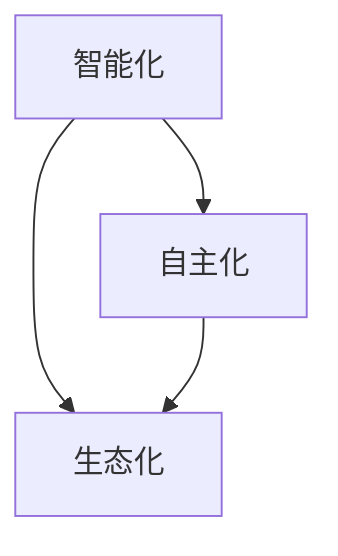

                 

关键词：人工智能，李开复，AI 2.0，生态，技术发展，未来展望

> 摘要：本文将探讨人工智能专家李开复提出的AI 2.0时代的生态体系，分析其核心概念和影响，以及如何应对这一时代的挑战和机遇。

## 1. 背景介绍

人工智能（AI）作为计算机科学的重要分支，已经经历了数个发展阶段。从早期的规则系统、知识表示，到专家系统和机器学习，再到深度学习和强化学习，人工智能在过去的几十年中取得了令人瞩目的进展。然而，李开复提出，我们正处于一个全新的时代——AI 2.0时代。

AI 2.0时代的核心特征是智能化和自主化。不同于之前的AI技术，AI 2.0能够实现更高级别的智能行为，包括自主学习、自主决策和自主进化。这种变革性的技术进步，将彻底改变我们的生活方式、工作方式和思维方式。

李开复作为人工智能领域的杰出专家，他对AI 2.0时代的生态有着深刻的见解。在他的新作《李开复：AI 2.0时代的生态》中，他详细阐述了AI 2.0时代的发展趋势、核心概念和潜在影响。

## 2. 核心概念与联系

在AI 2.0时代，李开复提出了几个核心概念，包括：

### 2.1 智能化
智能化是指通过人工智能技术，使计算机具备人类智能的特性。智能化不仅仅是对数据的处理和分析，更涉及到对复杂环境的适应和应对。

### 2.2 自主化
自主化是指计算机能够独立完成任务，无需人工干预。这种自主性体现在多个方面，包括决策自主、学习自主和进化自主。

### 2.3 生态化
生态化是指人工智能技术与其他领域的深度融合，形成一种新的生态系统。在这个生态系统中，各种技术和应用相互促进，共同推动社会的进步。

李开复提出的这些概念，相互关联，共同构成了AI 2.0时代的生态体系。为了更清晰地展示这些概念之间的关系，我们可以使用Mermaid流程图来描述：



## 3. 核心算法原理 & 具体操作步骤

### 3.1 算法原理概述

在AI 2.0时代，核心算法的原理发生了重大的变革。传统的机器学习算法，如线性回归、决策树和神经网络，已经无法满足智能化和自主化的需求。李开复提出的核心算法，主要包括以下几个部分：

### 3.2 算法步骤详解

#### 3.2.1 数据收集与处理
首先，需要收集大量的数据，并对数据进行预处理，包括数据清洗、归一化和特征提取。

#### 3.2.2 模型训练
使用收集到的数据，训练一个能够进行智能决策的模型。这个模型可以是深度学习模型，也可以是强化学习模型。

#### 3.2.3 模型评估
对训练好的模型进行评估，确保其具备足够的智能水平和自主能力。

#### 3.2.4 模型部署
将评估通过的模型部署到实际的应用场景中，使其能够自主地完成任务。

### 3.3 算法优缺点

#### 优点：
1. 高度智能化和自主化，能够处理复杂的任务。
2. 模型训练和评估过程自动化，提高了效率。

#### 缺点：
1. 对数据的质量和数量要求较高，需要大量的数据支持。
2. 模型训练过程可能存在过拟合问题，需要适当的调整。

### 3.4 算法应用领域

AI 2.0算法可以应用于多个领域，包括：

1. 机器人技术：自主导航、环境感知和任务执行。
2. 自动驾驶：实时决策、路径规划和安全控制。
3. 金融领域：风险管理、投资决策和客户服务。

## 4. 数学模型和公式 & 详细讲解 & 举例说明

在AI 2.0时代，数学模型和公式的作用愈发重要。以下是一个简单的数学模型和公式的例子：

### 4.1 数学模型构建

假设我们有一个线性回归模型，用于预测某个变量y：

$$ y = wx + b $$

其中，w是权重，x是输入变量，b是偏置。

### 4.2 公式推导过程

为了最小化预测误差，我们可以使用梯度下降法来优化模型参数：

$$ w_{new} = w_{old} - \alpha \frac{\partial J}{\partial w} $$

$$ b_{new} = b_{old} - \alpha \frac{\partial J}{\partial b} $$

其中，$ \alpha $ 是学习率，$ J $ 是损失函数。

### 4.3 案例分析与讲解

假设我们有一个数据集，其中包含输入变量x和目标变量y。我们使用线性回归模型进行预测，并使用梯度下降法进行参数优化。通过多次迭代，我们可以使模型的预测误差逐渐减小，达到一个最优状态。

## 5. 项目实践：代码实例和详细解释说明

### 5.1 开发环境搭建

为了演示AI 2.0算法的应用，我们使用Python编写一个简单的线性回归模型。首先，我们需要安装Python和相关的库，如NumPy和Scikit-learn。

### 5.2 源代码详细实现

以下是一个简单的线性回归模型代码：

```python
import numpy as np
from sklearn.linear_model import LinearRegression
from sklearn.model_selection import train_test_split

# 数据集
x = np.array([[1], [2], [3], [4], [5]])
y = np.array([1, 2, 2.5, 4, 5])

# 划分训练集和测试集
x_train, x_test, y_train, y_test = train_test_split(x, y, test_size=0.2, random_state=0)

# 创建线性回归模型
model = LinearRegression()

# 训练模型
model.fit(x_train, y_train)

# 预测结果
y_pred = model.predict(x_test)

# 打印结果
print("预测结果：", y_pred)
```

### 5.3 代码解读与分析

这段代码首先导入必要的库，然后创建一个数据集，并使用Scikit-learn库的`train_test_split`函数将数据集划分为训练集和测试集。接下来，创建一个线性回归模型，并使用`fit`函数进行训练。最后，使用`predict`函数进行预测，并打印结果。

### 5.4 运行结果展示

运行这段代码，我们可以得到测试集的预测结果。通过对比预测结果和实际结果，我们可以评估模型的性能。

## 6. 实际应用场景

AI 2.0技术在各个领域都有广泛的应用。以下是一些典型的实际应用场景：

### 6.1 机器人技术

AI 2.0算法可以用于机器人导航、路径规划和任务执行。例如，自动驾驶汽车使用AI 2.0技术实现自动驾驶功能。

### 6.2 金融领域

AI 2.0算法可以用于风险评估、投资决策和客户服务。例如，银行可以使用AI 2.0技术进行客户行为分析，提供个性化的金融服务。

### 6.3 健康医疗

AI 2.0算法可以用于疾病诊断、药物研发和个性化治疗。例如，医生可以使用AI 2.0技术进行疾病预测和诊断。

## 7. 工具和资源推荐

### 7.1 学习资源推荐

1. 《深度学习》（Ian Goodfellow、Yoshua Bengio和Aaron Courville著）：这是一本关于深度学习的经典教材，适合初学者和进阶者。
2. 《强化学习：原理与Python实现》（David Silver著）：这是一本关于强化学习的权威著作，详细介绍了强化学习的原理和实现。

### 7.2 开发工具推荐

1. Jupyter Notebook：这是一个强大的交互式计算环境，适合进行数据分析和模型训练。
2. TensorFlow：这是一个开源的深度学习框架，支持各种深度学习模型的训练和部署。

### 7.3 相关论文推荐

1. "Deep Learning"（Yoshua Bengio、Ian Goodfellow和Yann LeCun著）：这是一篇关于深度学习的综述论文，详细介绍了深度学习的发展历程和关键技术。
2. "Reinforcement Learning: An Introduction"（Richard S. Sutton和Barto，Andrew G.著）：这是一本关于强化学习的入门教材，适合初学者了解强化学习的基本概念。

## 8. 总结：未来发展趋势与挑战

### 8.1 研究成果总结

AI 2.0时代的研究成果主要体现在以下几个方面：

1. 智能化和自主化水平的显著提升。
2. 多个领域的实际应用，取得了良好的效果。
3. 新的数学模型和算法的不断涌现。

### 8.2 未来发展趋势

未来，AI 2.0时代将继续发展，主要趋势包括：

1. 智能化技术的进一步突破。
2. 生态化发展的深入，形成更为复杂的生态系统。
3. 应用领域的进一步拓展，从传统行业到新兴领域。

### 8.3 面临的挑战

AI 2.0时代的发展也面临一些挑战：

1. 数据质量和数据隐私问题。
2. 算法透明度和可解释性。
3. 道德和伦理问题。

### 8.4 研究展望

未来，我们需要进一步研究以下方面：

1. 智能化和自主化的边界和限制。
2. 生态化发展的模式和机制。
3. 面向实际应用的AI 2.0技术。

## 9. 附录：常见问题与解答

### 9.1 什么是AI 2.0？

AI 2.0是指一种新的人工智能时代，它以智能化和自主化为核心特征，能够实现更高级别的智能行为。

### 9.2 AI 2.0对人类社会有什么影响？

AI 2.0将对人类社会产生深远的影响，包括改变生活方式、工作方式和思维方式，推动社会进步。

### 9.3 如何应对AI 2.0时代的挑战？

应对AI 2.0时代的挑战，需要加强政策制定、伦理教育和人才培养，同时加强技术研究和创新。

---

**作者：禅与计算机程序设计艺术 / Zen and the Art of Computer Programming**

