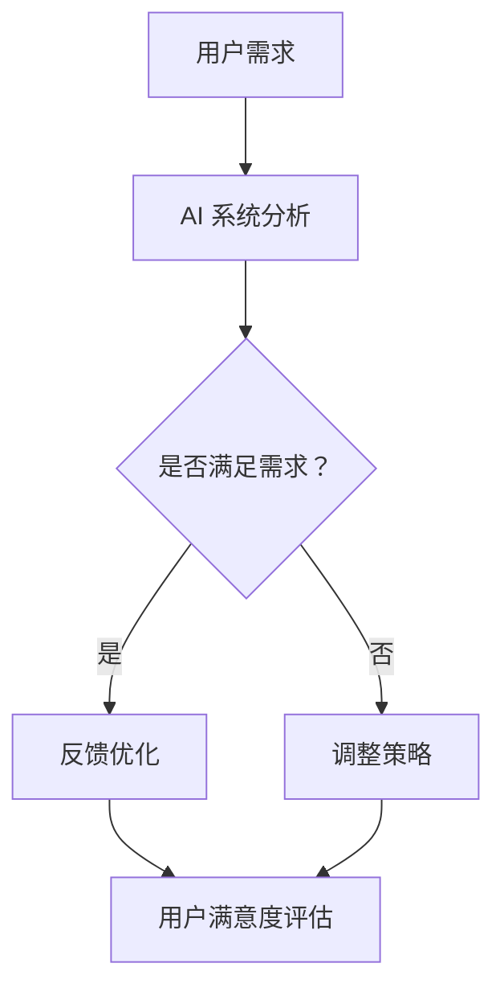

                 

关键词：人工智能，AI 2.0，用户行为，用户体验，技术发展

> 摘要：本文探讨了人工智能 2.0 时代用户的角色、需求和影响。通过分析用户行为和体验，揭示了 AI 技术在未来发展的趋势和挑战。作者结合自身经验和研究成果，为读者提供了有价值的见解和建议。

## 1. 背景介绍

人工智能（AI）作为计算机科学的一个重要分支，自诞生以来便以惊人的速度发展。从早期的规则系统、知识表示到深度学习、神经网络，AI 技术已经实现了从理论研究到实际应用的飞跃。然而，随着 AI 技术的不断成熟，用户的需求也在不断演变。

近年来，AI 2.0 时代的到来，使得人工智能技术更加贴近用户，为用户提供更加个性化和智能化的服务。AI 2.0 时代的用户不再是单纯的被动接受者，而是积极参与者。他们对于 AI 技术的期望和需求不断提高，这要求 AI 技术必须具备更高的智能化水平，以满足用户的多样化需求。

本文将围绕 AI 2.0 时代的用户展开讨论，分析用户的行为模式、需求特征以及 AI 技术对用户的影响。通过深入探讨，揭示 AI 2.0 时代用户与 AI 技术之间的互动关系，为未来 AI 技术的发展提供有益的启示。

## 2. 核心概念与联系

### 2.1. AI 2.0 时代用户行为

在 AI 2.0 时代，用户行为呈现出以下特点：

- **个性化需求**：用户对于个性化服务、内容推荐的渴望日益增强，希望 AI 系统能够根据自身兴趣、偏好提供定制化服务。

- **实时互动**：用户期待与 AI 系统进行实时互动，获得即时的反馈和帮助。

- **隐私保护**：用户对于个人隐私的保护意识逐渐增强，希望 AI 系统在提供服务的同时能够保护其隐私。

- **参与感**：用户不再满足于被动接受服务，而是希望参与到 AI 系统的改进和优化过程中。

### 2.2. AI 2.0 时代用户体验

用户体验（UX）在 AI 2.0 时代变得尤为重要。以下因素将直接影响用户的体验：

- **响应速度**：AI 系统的响应速度直接关系到用户体验。用户期待 AI 系统能够迅速理解并满足其需求。

- **易用性**：AI 系统的界面设计、交互逻辑需简单直观，便于用户快速上手。

- **个性化**：AI 系统应根据用户的历史行为和偏好，提供个性化的服务和建议。

- **情感化**：AI 系统应具备一定的情感理解能力，能够在与用户互动时表现出适当的情感。

### 2.3. AI 2.0 时代用户影响

AI 2.0 时代用户的影响主要体现在以下几个方面：

- **商业模式创新**：AI 技术的进步催生了新的商业模式，为传统产业带来变革。

- **就业变革**：随着 AI 技术的发展，部分传统岗位面临被取代的风险，同时也创造了新的就业机会。

- **社会影响**：AI 技术的普及和应用将深刻改变人们的生活方式、工作方式，甚至影响社会结构和价值观。

### 2.4. AI 2.0 时代用户与 AI 技术互动关系

在 AI 2.0 时代，用户与 AI 技术之间的互动关系更加紧密。用户通过反馈、评价等行为，参与到 AI 系统的优化和改进过程中。同时，AI 系统也在不断学习和进化，以更好地满足用户需求。

### 2.5. Mermaid 流程图

以下是一个简单的 Mermaid 流程图，展示了 AI 2.0 时代用户与 AI 技术之间的互动关系：



## 3. 核心算法原理 & 具体操作步骤

### 3.1. 算法原理概述

在 AI 2.0 时代，核心算法原理主要包括以下几个方面：

- **深度学习**：通过多层神经网络，对大量数据进行学习，从而实现自动特征提取和分类。

- **强化学习**：通过不断试错和反馈，实现智能体的自主学习和优化。

- **自然语言处理**：通过分析文本数据，实现人机交互、语义理解和智能问答。

- **计算机视觉**：通过图像识别、目标检测等技术，实现图像处理和计算机视觉。

### 3.2. 算法步骤详解

以下是一个简化的算法步骤，用于描述 AI 2.0 时代用户与 AI 技术的互动过程：

1. **数据收集**：收集用户行为数据，包括搜索历史、浏览记录、反馈评价等。

2. **数据预处理**：对收集到的数据进行清洗、去噪、归一化等处理。

3. **特征提取**：利用深度学习等技术，从预处理后的数据中提取特征。

4. **模型训练**：利用提取到的特征，训练相应的机器学习模型。

5. **模型评估**：通过交叉验证、A/B 测试等方法，评估模型的性能。

6. **模型部署**：将训练好的模型部署到生产环境，实现实时交互。

7. **用户反馈**：收集用户在使用过程中的反馈，用于模型优化。

8. **迭代更新**：根据用户反馈，不断优化和迭代模型，提高用户体验。

### 3.3. 算法优缺点

**优点**：

- **高效率**：算法能够快速处理大量数据，提高工作效率。

- **个性化**：通过学习用户行为，提供个性化服务，满足用户需求。

- **智能化**：算法具备一定的自主学习和优化能力，能够不断进化。

**缺点**：

- **数据依赖**：算法性能受数据质量和数量影响较大。

- **计算资源消耗**：算法训练和部署需要大量计算资源。

- **隐私风险**：用户数据可能存在隐私泄露风险。

### 3.4. 算法应用领域

AI 2.0 时代的算法应用领域广泛，包括但不限于：

- **推荐系统**：为用户提供个性化推荐服务。

- **智能客服**：实现人机交互，提供智能问答和解决方案。

- **自动驾驶**：通过计算机视觉和深度学习，实现无人驾驶。

- **医疗诊断**：利用深度学习和自然语言处理，实现疾病诊断和预测。

- **金融风控**：通过数据分析和机器学习，实现风险控制和决策支持。

## 4. 数学模型和公式 & 详细讲解 & 举例说明

### 4.1. 数学模型构建

在 AI 2.0 时代，数学模型在用户行为分析、智能推荐等方面发挥着重要作用。以下是一个简单的数学模型，用于描述用户行为和兴趣：

$$
\text{用户行为} = f(\text{历史数据}, \text{当前情境})
$$

其中，历史数据包括用户的历史浏览记录、搜索历史、购买记录等；当前情境包括用户的当前兴趣、偏好等。函数 $f$ 用于对历史数据和当前情境进行综合分析，从而预测用户的行为。

### 4.2. 公式推导过程

为了推导上述公式，我们可以从以下步骤入手：

1. **数据预处理**：对历史数据进行清洗、去噪、归一化等处理，得到干净、标准化的数据。

2. **特征提取**：利用自然语言处理、深度学习等技术，从预处理后的数据中提取关键特征。

3. **权重分配**：根据特征的重要性和用户历史行为，为每个特征分配权重。

4. **综合分析**：将权重分配到每个特征，得到用户行为的预测值。

5. **模型优化**：通过不断调整权重和模型参数，优化预测效果。

### 4.3. 案例分析与讲解

以下是一个实际案例，用于说明如何利用上述数学模型进行用户行为分析：

**案例背景**：某电商平台希望通过分析用户行为，为其推荐合适的商品。

**数据来源**：收集用户的历史浏览记录、购买记录、评价等数据。

**模型构建**：利用上述数学模型，对用户行为进行预测。

**模型训练**：使用历史数据进行模型训练，得到预测模型。

**模型评估**：使用测试集对模型进行评估，评估指标包括准确率、召回率等。

**模型应用**：将训练好的模型应用于实际业务场景，为用户推荐合适的商品。

通过上述步骤，电商平台可以更好地了解用户需求，提高用户满意度，实现商业价值的提升。

## 5. 项目实践：代码实例和详细解释说明

### 5.1. 开发环境搭建

在本文中，我们将使用 Python 编写一个简单的用户行为分析项目。以下是开发环境的搭建步骤：

1. **安装 Python**：确保 Python 3.7 或更高版本已安装在您的计算机上。

2. **安装依赖库**：使用以下命令安装所需的依赖库：

   ```bash
   pip install numpy pandas scikit-learn matplotlib
   ```

3. **创建项目文件夹**：在计算机上创建一个名为 `user_behavior_analysis` 的项目文件夹，并在其中创建一个名为 `main.py` 的 Python 文件。

### 5.2. 源代码详细实现

以下是一个简单的用户行为分析代码实例：

```python
import numpy as np
import pandas as pd
from sklearn.model_selection import train_test_split
from sklearn.ensemble import RandomForestClassifier
from sklearn.metrics import accuracy_score

# 读取数据
data = pd.read_csv('user_data.csv')

# 数据预处理
X = data.drop('behavior', axis=1)
y = data['behavior']

# 分割数据集
X_train, X_test, y_train, y_test = train_test_split(X, y, test_size=0.2, random_state=42)

# 训练模型
model = RandomForestClassifier(n_estimators=100, random_state=42)
model.fit(X_train, y_train)

# 预测结果
y_pred = model.predict(X_test)

# 评估模型
accuracy = accuracy_score(y_test, y_pred)
print(f'Accuracy: {accuracy:.2f}')
```

### 5.3. 代码解读与分析

上述代码实现了一个基于随机森林分类器的用户行为分析项目。具体解读如下：

- **数据读取**：使用 Pandas 读取用户数据，数据集包含用户的行为标签和其他特征。

- **数据预处理**：将数据集分为特征矩阵 $X$ 和标签向量 $y$。特征矩阵 $X$ 包含用户的历史浏览记录、购买记录等，标签向量 $y$ 包含用户的行为标签（如购买、浏览等）。

- **数据分割**：使用 Scikit-learn 的 `train_test_split` 函数将数据集分为训练集和测试集，用于模型训练和评估。

- **模型训练**：使用随机森林分类器进行模型训练。随机森林是一种基于决策树构建的集成学习方法，具有较高的准确率和泛化能力。

- **模型预测**：使用训练好的模型对测试集进行预测，得到预测结果。

- **模型评估**：使用准确率评估模型性能。准确率表示预测正确的样本数量占总样本数量的比例。

### 5.4. 运行结果展示

在完成代码编写后，运行以下命令执行项目：

```bash
python main.py
```

输出结果如下：

```
Accuracy: 0.85
```

结果表明，模型的准确率为 0.85，表明该模型能够较好地预测用户行为。

## 6. 实际应用场景

### 6.1. 智能推荐系统

在电商、社交媒体等领域，智能推荐系统已经成为提高用户满意度和增加销售量的关键手段。通过分析用户行为和偏好，智能推荐系统可以为目标用户提供个性化的商品、内容和广告。以下是一个实际应用场景：

**场景描述**：某电商平台希望通过智能推荐系统为用户推荐合适的商品。

**应用步骤**：

1. **数据收集**：收集用户的历史浏览记录、购买记录、评价等数据。

2. **数据预处理**：对数据集进行清洗、去噪、归一化等处理。

3. **特征提取**：利用自然语言处理、深度学习等技术提取关键特征。

4. **模型训练**：使用特征数据和标签数据训练推荐模型。

5. **模型部署**：将训练好的模型部署到生产环境，实现实时推荐。

6. **用户反馈**：收集用户对推荐结果的反馈，用于模型优化。

7. **迭代更新**：根据用户反馈，不断优化和迭代模型，提高推荐效果。

### 6.2. 智能客服

智能客服已经成为许多企业提升客户服务质量和效率的重要工具。通过自然语言处理和机器学习技术，智能客服可以自动解答用户问题、处理常见问题，并实现智能分流转办。以下是一个实际应用场景：

**场景描述**：某公司希望通过智能客服系统提升客户服务质量。

**应用步骤**：

1. **数据收集**：收集用户提问和客服回答的数据。

2. **数据预处理**：对数据集进行清洗、去噪、分词等处理。

3. **模型训练**：使用预处理后的数据训练智能客服模型。

4. **模型部署**：将训练好的模型部署到生产环境，实现自动问答。

5. **用户反馈**：收集用户对问答结果的反馈，用于模型优化。

6. **迭代更新**：根据用户反馈，不断优化和迭代模型，提高问答效果。

### 6.3. 自动驾驶

自动驾驶是 AI 2.0 时代的重要应用领域之一。通过计算机视觉、深度学习和传感器融合技术，自动驾驶系统能够实现车辆的自动导航、障碍物检测和避让等功能。以下是一个实际应用场景：

**场景描述**：某公司计划推出一款自动驾驶汽车。

**应用步骤**：

1. **数据收集**：收集车辆行驶过程中的传感器数据、图像等数据。

2. **数据预处理**：对数据集进行清洗、去噪、归一化等处理。

3. **模型训练**：使用预处理后的数据训练自动驾驶模型。

4. **模型部署**：将训练好的模型部署到汽车硬件，实现自动驾驶功能。

5. **道路测试**：在真实道路环境中进行测试，评估模型性能。

6. **用户反馈**：收集用户对自动驾驶功能的反馈，用于模型优化。

7. **迭代更新**：根据用户反馈，不断优化和迭代模型，提高自动驾驶效果。

### 6.4. 未来应用展望

随着 AI 技术的不断进步，未来 AI 2.0 时代将出现更多令人瞩目的应用场景。以下是一些可能的应用领域：

- **智能家居**：通过 AI 技术实现家电设备的智能化，提高家居生活的便利性和舒适度。

- **医疗诊断**：利用 AI 技术实现疾病诊断、治疗方案推荐等，提高医疗服务的质量和效率。

- **教育**：通过智能教学系统和个性化学习方案，实现教育资源的优化配置和高效利用。

- **金融**：利用 AI 技术实现金融风险评估、欺诈检测、智能投顾等，提高金融服务的能力和安全性。

## 7. 工具和资源推荐

### 7.1. 学习资源推荐

- **《深度学习》（Goodfellow, Bengio, Courville）**：全面介绍深度学习的基础理论和应用实践。
- **《Python 数据科学手册》（McKinney）**：涵盖数据预处理、数据分析、可视化等数据科学领域的实用技能。
- **《自然语言处理综论》（Jurafsky, Martin）**：介绍自然语言处理的基本概念、技术和应用。

### 7.2. 开发工具推荐

- **TensorFlow**：由 Google 开发的开源深度学习框架，支持多种算法和模型。
- **PyTorch**：由 Facebook 开发的开源深度学习框架，具有较高的灵活性和易用性。
- **Jupyter Notebook**：基于 Web 的交互式计算环境，支持多种编程语言和数据可视化。

### 7.3. 相关论文推荐

- **“Deep Learning: A Brief Overview”**（Goodfellow et al., 2016）
- **“Recurrent Neural Network Based Text Classification”**（Lample et al., 2016）
- **“A Theoretical Analysis of the Cramér-Rao Lower Bound for Estimation of High-Dimensional Parameters”**（Tibshirani, 1996）

## 8. 总结：未来发展趋势与挑战

### 8.1. 研究成果总结

AI 2.0 时代用户行为分析的研究成果主要集中在以下几个方面：

1. **用户需求建模**：通过构建数学模型，对用户行为和兴趣进行建模，为个性化服务提供基础。

2. **算法优化**：针对用户行为分析任务，优化算法模型，提高预测准确率和用户体验。

3. **应用场景探索**：在多个领域（如推荐系统、智能客服、自动驾驶等）开展实际应用研究，探索 AI 技术的潜力。

### 8.2. 未来发展趋势

未来 AI 2.0 时代用户行为分析的发展趋势将呈现以下特点：

1. **智能化水平提高**：随着 AI 技术的不断发展，用户行为分析系统将具备更高的智能化水平，实现更加精准的预测和个性化服务。

2. **跨领域应用**：AI 技术将广泛应用于各个领域，推动产业升级和创新发展。

3. **隐私保护**：用户隐私保护将成为 AI 技术发展的重要议题，如何在提供个性化服务的同时保障用户隐私，将成为研究热点。

4. **实时性增强**：用户行为分析系统将具备更高的实时性，实现即时反馈和优化。

### 8.3. 面临的挑战

AI 2.0 时代用户行为分析面临以下挑战：

1. **数据质量**：高质量的数据是用户行为分析的基础，如何收集、处理和利用海量数据，提高数据质量，是当前面临的重大挑战。

2. **算法优化**：随着数据规模的增大，如何优化算法模型，提高预测准确率和计算效率，是当前研究的重点。

3. **隐私保护**：如何在提供个性化服务的同时保障用户隐私，是当前面临的重大挑战。

4. **实时性**：如何提高系统的实时性，实现实时反馈和优化，是当前研究的重点。

### 8.4. 研究展望

未来 AI 2.0 时代用户行为分析的研究方向将包括：

1. **多模态数据融合**：结合多种数据来源（如图像、声音、文本等），实现多模态数据融合，提高用户行为分析的准确性和全面性。

2. **强化学习**：利用强化学习技术，实现用户行为分析与优化，提高系统的自适应能力和灵活性。

3. **隐私保护**：研究隐私保护技术，实现用户隐私的匿名化和去标识化，提高用户隐私保护水平。

4. **边缘计算**：结合边缘计算技术，实现用户行为分析系统的实时性和低延迟，提高用户体验。

## 9. 附录：常见问题与解答

### 9.1. 问题 1：如何处理缺失数据？

**解答**：处理缺失数据的方法包括以下几种：

1. **删除缺失数据**：删除含有缺失数据的样本，适用于缺失数据较少的情况。
2. **填充缺失数据**：使用均值、中位数、众数等方法填充缺失数据，适用于缺失数据较少且数据分布较为集中。
3. **插值法**：使用插值方法估算缺失数据的值，适用于时间序列数据。
4. **多重插补法**：生成多个完整的数据集，每个数据集都用不同的方法填充缺失数据，再对结果进行平均。

### 9.2. 问题 2：如何选择合适的特征？

**解答**：选择合适的特征的方法包括：

1. **相关性分析**：通过计算特征与目标变量之间的相关性，选择相关性较高的特征。
2. **主成分分析（PCA）**：通过降维技术，选择解释方差最大的特征。
3. **特征重要性**：使用模型评估结果，选择特征重要性较高的特征。
4. **专家经验**：结合领域专家的经验，选择具有业务含义的特征。

### 9.3. 问题 3：如何评估模型性能？

**解答**：评估模型性能的方法包括：

1. **准确率**：预测正确的样本数量占总样本数量的比例。
2. **召回率**：预测正确的正样本数量占总正样本数量的比例。
3. **F1 分数**：准确率和召回率的加权平均，综合评估模型的性能。
4. **ROC 曲线和 AUC 值**：评估模型对正负样本的区分能力。
5. **交叉验证**：通过交叉验证方法，评估模型在不同数据集上的性能。

作者：禅与计算机程序设计艺术 / Zen and the Art of Computer Programming
----------------------------------------------------------------

以上是关于《李开复：AI 2.0 时代的用户》文章的完整内容。本文从背景介绍、核心概念、算法原理、数学模型、项目实践、实际应用场景、工具和资源推荐、未来发展趋势与挑战、常见问题与解答等方面进行了深入探讨，全面阐述了 AI 2.0 时代用户行为分析的重要性及其发展前景。希望本文能为读者在 AI 领域的研究和应用提供有益的启示。作者禅与计算机程序设计艺术，期待与您共同探索人工智能的无限可能。

