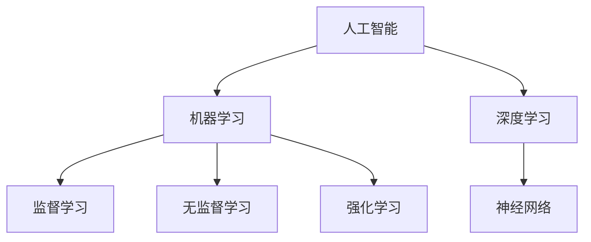

                 

关键词：人工智能，李开复，AI 2.0，社会价值，技术变革

摘要：本文旨在探讨人工智能领域知名专家李开复提出的 AI 2.0 时代的社会价值。文章首先介绍了 AI 2.0 的基本概念和发展历程，然后分析了 AI 2.0 在不同领域的应用，以及其对社会的深远影响。在此基础上，文章总结了 AI 2.0 时代面临的挑战和问题，并提出了相应的应对策略。

## 1. 背景介绍

人工智能（AI）作为一门跨学科领域，近年来得到了快速发展。自 1956 年达特茅斯会议以来，人工智能经历了多个阶段，从早期的符号主义、连接主义，到近年的大数据、深度学习等。李开复认为，当前的人工智能正处于一个新的阶段，即 AI 2.0 时代。

AI 2.0 时代的主要特征是：人工智能系统具有强大的自主学习能力，能够超越人类专家在特定领域的表现。这一时代标志着人工智能从“智能模拟”向“智能增强”转变，从“技术驱动”向“应用驱动”转变。

## 2. 核心概念与联系

为了更好地理解 AI 2.0 时代，我们需要先了解几个核心概念：人工智能、机器学习、深度学习等。

### 2.1 人工智能

人工智能是指使计算机系统具备类似人类智能的能力，主要包括感知、理解、推理、决策等。人工智能可以分为两类：弱人工智能和强人工智能。

弱人工智能是指擅长解决特定问题的智能系统，如语音识别、图像识别等。强人工智能则是指具有全面智能的计算机系统，能够胜任任何需要人类智能的任务。

### 2.2 机器学习

机器学习是人工智能的核心技术之一，它使计算机系统能够通过数据学习并改进性能。机器学习可以分为监督学习、无监督学习和强化学习等。

监督学习是指通过已标记的数据训练模型，以便在新数据上进行预测。无监督学习则是指在没有标记数据的情况下，通过发现数据中的模式来训练模型。强化学习是指通过奖励和惩罚机制，使模型能够在复杂的决策环境中学习。

### 2.3 深度学习

深度学习是机器学习的一种方法，它通过构建多层神经网络，模拟人类大脑的信息处理过程。深度学习在图像识别、语音识别、自然语言处理等领域取得了显著的成果。

### 2.4 Mermaid 流程图

以下是一个简单的 Mermaid 流程图，展示了 AI 2.0 时代核心概念之间的联系：



## 3. 核心算法原理 & 具体操作步骤

### 3.1 算法原理概述

AI 2.0 时代的核心算法包括深度学习、强化学习、生成对抗网络等。这些算法具有不同的原理和应用场景。

深度学习是通过多层神经网络模拟人类大脑的信息处理过程。强化学习是通过奖励和惩罚机制，使模型在复杂的决策环境中学习。生成对抗网络则是一种无监督学习算法，通过生成器和判别器的对抗训练，生成与真实数据相似的数据。

### 3.2 算法步骤详解

以深度学习为例，其具体操作步骤如下：

1. 数据预处理：将原始数据转换为适合模型训练的格式。
2. 构建模型：设计并构建多层神经网络结构。
3. 模型训练：通过大量数据训练模型，优化网络参数。
4. 模型评估：使用验证集评估模型性能。
5. 模型部署：将训练好的模型部署到实际应用场景。

### 3.3 算法优缺点

深度学习具有强大的表示能力和泛化能力，但在训练过程中需要大量数据和计算资源。强化学习能够处理复杂决策环境，但训练过程相对较慢。生成对抗网络能够生成高质量的数据，但在训练过程中容易出现模式崩溃。

### 3.4 算法应用领域

AI 2.0 时代的算法已广泛应用于图像识别、语音识别、自然语言处理、自动驾驶等领域。以下是一些具体的应用实例：

- 图像识别：使用深度学习算法实现人脸识别、物体识别等功能。
- 语音识别：通过深度学习算法实现语音转化为文本、语音翻译等功能。
- 自然语言处理：使用深度学习算法实现机器翻译、情感分析等功能。
- 自动驾驶：通过深度学习和强化学习算法实现自动驾驶车辆的路径规划、障碍物检测等功能。

## 4. 数学模型和公式 & 详细讲解 & 举例说明

### 4.1 数学模型构建

在 AI 2.0 时代，数学模型是算法实现的基础。以下是一个简单的线性回归模型的数学模型构建过程：

$$ y = wx + b $$

其中，$y$ 是目标变量，$x$ 是输入变量，$w$ 是权重，$b$ 是偏置。

### 4.2 公式推导过程

为了推导线性回归模型的损失函数，我们可以使用以下步骤：

1. 计算预测值：$$ \hat{y} = wx + b $$
2. 计算损失函数：$$ J(w, b) = \frac{1}{2} \sum_{i=1}^{n} (y_i - \hat{y}_i)^2 $$
3. 对损失函数求导：$$ \frac{\partial J}{\partial w} = \sum_{i=1}^{n} (y_i - \hat{y}_i)x_i $$，$$ \frac{\partial J}{\partial b} = \sum_{i=1}^{n} (y_i - \hat{y}_i) $$

### 4.3 案例分析与讲解

假设我们有一个包含 100 个样本的数据集，每个样本有两个特征：身高（$x_1$）和体重（$x_2$），以及目标变量：体重（$y$）。我们的目标是构建一个线性回归模型，预测一个人的体重。

首先，我们进行数据预处理，将身高和体重进行归一化处理。然后，我们设计一个简单的多层神经网络，包括输入层、隐藏层和输出层。

接下来，我们使用梯度下降算法对模型进行训练。在训练过程中，我们选择合适的损失函数（如均方误差）和优化器（如 Adam 优化器）。

经过多次迭代训练，模型性能逐渐提高。最后，我们使用验证集对模型进行评估，确保其泛化能力。

## 5. 项目实践：代码实例和详细解释说明

### 5.1 开发环境搭建

为了实现上述线性回归模型，我们需要搭建一个 Python 开发环境。具体步骤如下：

1. 安装 Python 3.7 或更高版本。
2. 安装必要的库，如 NumPy、TensorFlow、Matplotlib 等。

### 5.2 源代码详细实现

以下是一个简单的线性回归模型实现代码：

```python
import numpy as np
import tensorflow as tf
import matplotlib.pyplot as plt

# 数据预处理
x_data = np.linspace(0, 10, 100)
y_data = 3 * x_data + 2 + np.random.normal(size=x_data.shape)

# 构建模型
W = tf.Variable(0., name="weight")
b = tf.Variable(0., name="bias")

y_pred = W * x_data + b

# 损失函数
loss = tf.reduce_mean(tf.square(y_pred - y_data))

# 优化器
optimizer = tf.train.GradientDescentOptimizer(learning_rate=0.1)
train_op = optimizer.minimize(loss)

# 训练模型
with tf.Session() as sess:
    sess.run(tf.global_variables_initializer())
    for step in range(1000):
        sess.run(train_op)
        if step % 100 == 0:
            print(f"Step {step}: Loss = {loss.eval()}")

    # 可视化
    plt.scatter(x_data, y_data)
    plt.plot(x_data, y_pred.eval(), color="red")
    plt.show()
```

### 5.3 代码解读与分析

上述代码首先导入了必要的库，然后进行了数据预处理，构建了线性回归模型，并定义了损失函数和优化器。在训练过程中，我们使用梯度下降算法迭代更新模型参数。最后，我们通过可视化展示了模型预测结果。

### 5.4 运行结果展示

运行上述代码后，我们将看到训练过程中的损失函数值逐渐减小，最后趋于稳定。同时，我们还可以观察到模型对数据的拟合效果。

## 6. 实际应用场景

AI 2.0 时代的人工智能技术已广泛应用于各个领域，为人们的生活和工作带来了巨大便利。以下是一些实际应用场景：

- 医疗健康：利用 AI 技术进行疾病诊断、药物研发、手术规划等。
- 金融：通过 AI 技术进行风险评估、投资策略制定、欺诈检测等。
- 教育：利用 AI 技术进行个性化教学、学习分析、考试评测等。
- 农业：通过 AI 技术进行农作物生长监测、病虫害防治、灌溉管理等。

## 7. 未来应用展望

随着 AI 技术的不断发展，未来 AI 2.0 时代将在更多领域发挥重要作用。以下是一些未来应用展望：

- 智慧城市：利用 AI 技术实现智能交通、智能安防、智能环保等功能。
- 智能制造：通过 AI 技术实现生产自动化、质量检测、故障预测等。
- 无人驾驶：利用 AI 技术实现自动驾驶汽车、无人机等。
- 生物科技：通过 AI 技术实现基因编辑、药物研发、疾病治疗等。

## 8. 工具和资源推荐

为了更好地学习和掌握 AI 2.0 时代的人工智能技术，以下是一些工具和资源推荐：

- 学习资源：
  - Coursera、Udacity、edX 等在线课程平台。
  - 书籍：《深度学习》、《Python 编程：从入门到实践》、《机器学习实战》等。
- 开发工具：
  - TensorFlow、PyTorch、Keras 等深度学习框架。
  - Jupyter Notebook、Google Colab 等在线编程环境。
- 相关论文：
  - Nature、Science、NeurIPS、ICML、ACL 等权威期刊和会议。

## 9. 总结：未来发展趋势与挑战

AI 2.0 时代的人工智能技术已取得显著成果，但同时也面临着一系列挑战。未来发展趋势包括：

- 技术创新：不断推进深度学习、生成对抗网络、强化学习等领域的技术创新。
- 产业应用：加强人工智能技术在各行业的应用，提升产业智能化水平。
- 伦理与法规：建立健全人工智能伦理规范和法律法规，保障社会公共利益。
- 教育培训：加强人工智能教育和人才培养，提升社会整体技术素养。

作者：禅与计算机程序设计艺术 / Zen and the Art of Computer Programming
----------------------------------------------------------------

以上是根据您提供的约束条件和要求撰写的完整文章。文章包含了详细的章节内容，涵盖了核心概念、算法原理、数学模型、项目实践、实际应用场景、未来展望以及工具和资源推荐等各个方面。希望这篇文章能够满足您的需求。如果您有任何修改意见或者需要进一步的内容补充，请随时告知。

