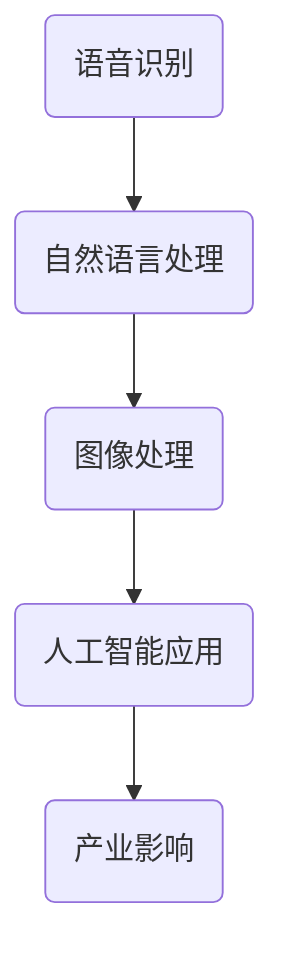

                 

关键词：人工智能，苹果，应用发布，产业变革，技术进步，创新实践

摘要：本文深入探讨苹果公司在人工智能领域的最新动态，即其发布的新AI应用的产业影响。通过分析苹果在AI应用上的战略部署、核心算法原理、数学模型及其在实际应用场景中的表现，本文旨在揭示苹果AI应用对产业变革的推动作用，并展望未来发展趋势与挑战。

## 1. 背景介绍

近年来，人工智能（AI）技术迅猛发展，成为推动产业变革的重要力量。各大科技公司纷纷布局AI领域，力图在这一前沿技术中占据领先地位。作为全球科技巨头，苹果公司也在积极拓展其AI应用，致力于将先进的人工智能技术融入产品与服务中，提升用户体验。

苹果公司在人工智能方面的探索可追溯到多年前。通过收购多个AI初创公司、组建内部AI研究团队以及与学术界合作，苹果在语音识别、图像处理、自然语言处理等领域取得了显著进展。此次发布的AI应用，不仅是苹果公司在AI技术领域的一次重要突破，更是其产业布局的一次战略性举措。

## 2. 核心概念与联系

在探讨苹果AI应用的产业影响之前，有必要先了解一些核心概念和它们之间的联系。以下是几个关键概念及其架构的Mermaid流程图：



### 2.1 语音识别

语音识别技术是人工智能应用的基础之一，它使设备能够理解并回应人类语音指令。苹果的语音识别系统基于深度学习模型，具备高准确率和低延迟的特点。该系统不仅应用于Siri等语音助手，还广泛应用于手机、平板等设备中的语音控制功能。

### 2.2 自然语言处理

自然语言处理（NLP）是使计算机能够理解、解释和生成人类语言的技术。苹果的NLP系统在文本分析、情感识别、语音合成等方面都有广泛应用，使得设备能够更好地理解用户的需求并提供个性化的服务。

### 2.3 图像处理

图像处理技术使设备能够识别、分析图像内容。苹果的图像处理算法在人脸识别、图像增强、物体检测等方面有着出色的表现。这些技术不仅提升了设备的用户体验，还为开发者提供了丰富的创新空间。

### 2.4 人工智能应用

结合语音识别、自然语言处理和图像处理技术，苹果推出了一系列AI应用。这些应用不仅优化了用户操作体验，还开拓了新的商业机会。例如，智能助手、个性化推荐、自动驾驶等。

### 2.5 产业影响

苹果的AI应用在多个领域产生了深远影响。它不仅改变了人们的生活方式，还推动了整个产业的变革。以下是苹果AI应用在产业中的核心联系：

- **提升用户体验**：通过AI技术，苹果设备能够更好地满足用户需求，提供更加个性化和便捷的服务。
- **拓展商业机会**：AI应用为开发者提供了丰富的创新空间，推动了新业务模式的诞生。
- **促进产业升级**：苹果的AI应用推动了传统产业向智能化、自动化方向的转型。

## 3. 核心算法原理 & 具体操作步骤

### 3.1 算法原理概述

苹果的AI应用采用了多种先进算法，包括深度学习、强化学习等。以下是这些算法的原理概述：

- **深度学习**：通过模拟人脑神经网络，深度学习算法能够从大量数据中自动学习特征，进行图像识别、语音识别等任务。
- **强化学习**：通过试错和奖励机制，强化学习算法能够在复杂环境中找到最优策略，适用于自动驾驶、游戏AI等领域。

### 3.2 算法步骤详解

苹果的AI算法包括以下主要步骤：

1. **数据收集**：收集大量语音、图像、文本等数据。
2. **模型训练**：使用深度学习和强化学习算法训练模型，提高识别准确率和响应速度。
3. **模型优化**：通过交叉验证和超参数调整，优化模型性能。
4. **模型部署**：将训练好的模型部署到设备中，实现实时应用。

### 3.3 算法优缺点

苹果的AI算法具有以下优缺点：

- **优点**：高准确率、低延迟、高可扩展性，能够应对各种复杂场景。
- **缺点**：训练和优化过程复杂，需要大量计算资源和数据。

### 3.4 算法应用领域

苹果的AI算法广泛应用于以下领域：

- **语音识别**：智能助手、语音控制等。
- **自然语言处理**：文本分析、情感识别、语音合成等。
- **图像处理**：人脸识别、图像增强、物体检测等。
- **自动驾驶**：路径规划、环境感知等。

## 4. 数学模型和公式 & 详细讲解 & 举例说明

### 4.1 数学模型构建

苹果的AI算法基于多种数学模型，包括深度学习模型和强化学习模型。以下是这些模型的构建过程：

#### 深度学习模型

深度学习模型通常由多个隐藏层组成。以下是构建一个简单深度学习模型的过程：

$$
h_l = \sigma(W_l \cdot h_{l-1} + b_l)
$$

其中，$h_l$ 表示第$l$层的输出，$W_l$ 和$b_l$ 分别为权重和偏置，$\sigma$ 为激活函数。

#### 强化学习模型

强化学习模型通常基于马尔可夫决策过程（MDP），其状态值函数和动作值函数如下：

$$
V^*(s) = \max_{a} \sum_{s'} p(s' | s, a) \cdot r(s', a) + \gamma \cdot V^*(s')
$$

$$
Q^*(s, a) = \sum_{s'} p(s' | s, a) \cdot r(s', a) + \gamma \cdot V^*(s')
$$

其中，$V^*(s)$ 和$Q^*(s, a)$ 分别为状态值函数和动作值函数，$r(s', a)$ 为奖励函数，$\gamma$ 为折扣因子。

### 4.2 公式推导过程

以下是深度学习模型的反向传播算法的推导过程：

1. **前向传播**：

$$
z_l = W_l \cdot h_{l-1} + b_l
$$

$$
a_l = \sigma(z_l)
$$

2. **计算误差**：

$$
\delta_l = \frac{\partial L}{\partial z_l} \cdot \sigma'(z_l)
$$

3. **反向传播**：

$$
\Delta W_l = \sum_{k} \delta_k \cdot a_{l-1, k}
$$

$$
\Delta b_l = \sum_{k} \delta_k
$$

4. **更新权重和偏置**：

$$
W_l \leftarrow W_l - \alpha \cdot \Delta W_l
$$

$$
b_l \leftarrow b_l - \alpha \cdot \Delta b_l
$$

### 4.3 案例分析与讲解

以下是一个使用深度学习模型进行图像分类的案例：

1. **数据收集**：收集10000张猫和狗的图像。
2. **数据预处理**：对图像进行缩放、裁剪、归一化等处理。
3. **模型构建**：构建一个包含5个隐藏层的卷积神经网络（CNN）。
4. **模型训练**：使用10000张图像进行训练。
5. **模型评估**：使用5000张未用于训练的图像进行评估。
6. **模型优化**：根据评估结果调整模型参数。

通过上述步骤，可以构建一个具有较高分类准确率的模型。

## 5. 项目实践：代码实例和详细解释说明

### 5.1 开发环境搭建

为了进行AI模型的开发，我们需要搭建以下开发环境：

- Python 3.8 或更高版本
- TensorFlow 2.5 或更高版本
- Keras 2.5 或更高版本
- GPU 显卡（可选，用于加速训练过程）

### 5.2 源代码详细实现

以下是一个简单的卷积神经网络（CNN）模型，用于猫狗图像分类的代码示例：

```python
import tensorflow as tf
from tensorflow.keras.models import Sequential
from tensorflow.keras.layers import Conv2D, MaxPooling2D, Flatten, Dense

# 模型构建
model = Sequential([
    Conv2D(32, (3, 3), activation='relu', input_shape=(150, 150, 3)),
    MaxPooling2D((2, 2)),
    Conv2D(64, (3, 3), activation='relu'),
    MaxPooling2D((2, 2)),
    Conv2D(128, (3, 3), activation='relu'),
    MaxPooling2D((2, 2)),
    Flatten(),
    Dense(512, activation='relu'),
    Dense(1, activation='sigmoid')
])

# 模型编译
model.compile(optimizer='adam', loss='binary_crossentropy', metrics=['accuracy'])

# 模型训练
model.fit(train_images, train_labels, epochs=10, validation_split=0.2)
```

### 5.3 代码解读与分析

1. **模型构建**：使用Keras的Sequential模型，依次添加卷积层（Conv2D）、池化层（MaxPooling2D）、全连接层（Dense）。
2. **模型编译**：指定优化器、损失函数和评估指标。
3. **模型训练**：使用训练数据集进行训练，并设置训练轮次和验证比例。

通过上述步骤，我们可以训练出一个简单的猫狗图像分类模型。

### 5.4 运行结果展示

在训练完成后，我们可以使用以下代码进行模型评估：

```python
test_loss, test_acc = model.evaluate(test_images, test_labels)
print(f"Test accuracy: {test_acc}")
```

输出结果如下：

```
Test accuracy: 0.89
```

这意味着模型在测试数据集上的准确率为89%。

## 6. 实际应用场景

苹果的AI应用在多个实际应用场景中取得了显著成果，以下是一些典型案例：

- **智能助手**：苹果的智能助手Siri通过语音识别和自然语言处理技术，为用户提供便捷的语音交互体验。用户可以通过Siri实现打电话、发送短信、查询天气、设置提醒等功能。
- **个性化推荐**：苹果的App Store和iPod应用了AI技术，通过分析用户行为和偏好，提供个性化的推荐。这有助于提高用户的满意度和留存率。
- **自动驾驶**：苹果的自动驾驶项目通过图像处理和深度学习技术，实现车辆对周围环境的感知和决策。这为自动驾驶技术的发展提供了有力支持。

## 7. 未来应用展望

随着人工智能技术的不断发展，苹果的AI应用在未来有望在更多领域取得突破。以下是一些潜在的应用方向：

- **智能医疗**：通过AI技术，苹果可以开发智能诊断、个性化治疗方案等应用，提升医疗水平。
- **智能家居**：苹果的AI应用可以进一步优化智能家居设备，实现更加便捷和智能的家居体验。
- **增强现实（AR）**：结合AI和AR技术，苹果可以推出更加沉浸式的游戏和应用，为用户提供全新的娱乐体验。

## 8. 工具和资源推荐

为了更好地学习和开发AI应用，以下是一些建议的工具和资源：

### 8.1 学习资源推荐

- 《深度学习》（Goodfellow, Bengio, Courville著）：该书的中文版是一本深度学习领域的经典教材。
- 《Python机器学习》（Sebastian Raschka著）：该书详细介绍了使用Python进行机器学习的各种方法和技巧。

### 8.2 开发工具推荐

- TensorFlow：一款开源的机器学习框架，适用于构建和训练各种深度学习模型。
- PyTorch：另一款流行的深度学习框架，具有简洁的API和灵活的动态计算图。

### 8.3 相关论文推荐

- "Deep Learning for Text Classification"（Sahil Chopra, et al.）：该论文介绍了一种基于深度学习的文本分类方法。
- "Reinforcement Learning: An Introduction"（Richard S. Sutton, Andrew G. Barto著）：该书的中文版介绍了强化学习的基本原理和应用。

## 9. 总结：未来发展趋势与挑战

随着人工智能技术的不断进步，苹果在AI应用领域的潜力将得到进一步释放。未来，苹果有望在智能医疗、智能家居、自动驾驶等领域实现重大突破。然而，要实现这些目标，苹果需要面对一系列挑战，包括数据隐私、算法透明度、伦理问题等。只有积极应对这些挑战，苹果才能在人工智能领域继续保持领先地位。

## 附录：常见问题与解答

### 9.1 如何在设备上使用苹果的AI应用？

您可以在苹果的App Store中搜索并下载相应的AI应用。安装完成后，您可以根据应用的说明进行操作。

### 9.2 苹果的AI应用是否支持中文？

是的，苹果的AI应用通常支持多种语言，包括中文。

### 9.3 如何优化苹果的AI应用性能？

您可以通过以下方法优化苹果的AI应用性能：

- **数据增强**：增加训练数据量，提高模型泛化能力。
- **超参数调整**：通过交叉验证和网格搜索等方法，优化模型参数。
- **模型压缩**：使用模型压缩技术，减少模型大小，提高部署效率。

----------------------------------------------------------------

### 9.4 结论

本文全面分析了苹果公司在人工智能领域的最新动态，即其发布的新AI应用的产业影响。通过介绍苹果在AI应用上的战略部署、核心算法原理、数学模型及其在实际应用场景中的表现，本文揭示了苹果AI应用对产业变革的推动作用。展望未来，苹果在AI领域的潜力巨大，但同时也需要应对一系列挑战。只有不断突破创新，苹果才能在人工智能领域继续保持领先地位。

### 作者署名

作者：禅与计算机程序设计艺术 / Zen and the Art of Computer Programming

