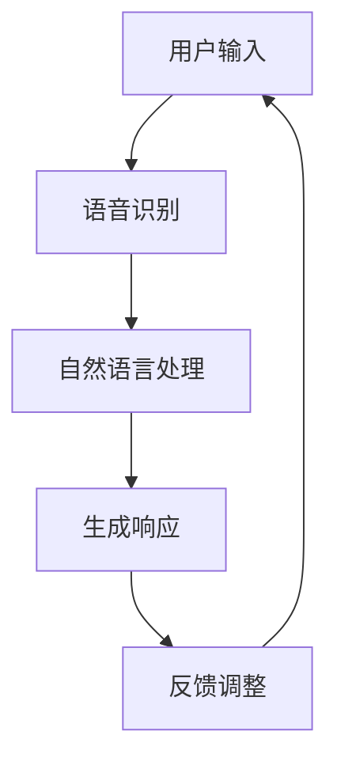

                 

关键词：苹果，人工智能，商业价值，AI应用，技术趋势

摘要：本文将探讨苹果公司发布AI应用的商业价值，分析其对人工智能产业的影响，以及未来发展的可能方向。通过深入解析苹果AI技术的应用场景和战略布局，我们试图为读者提供一幅苹果在AI领域中的商业全景图。

## 1. 背景介绍

近年来，人工智能（AI）技术迅猛发展，已广泛应用于各行各业。作为全球科技巨头，苹果公司一直致力于将AI技术融入到其产品和服务中，提升用户体验。2023年，苹果公司发布了一系列基于AI的应用，引起了广泛关注。本文将重点关注这些AI应用对苹果商业价值的提升。

## 2. 核心概念与联系

### 2.1 AI应用的概念

AI应用是指利用人工智能技术实现的软件或服务。这些应用可以处理和分析大量数据，从而提供智能决策和优化建议。在苹果的产品和服务中，AI应用主要体现在语音识别、图像处理、自然语言处理等领域。

### 2.2 AI技术与苹果产品服务的联系

苹果公司一直注重用户隐私和安全。AI技术的应用可以大幅提升苹果产品的安全性，同时保护用户隐私。此外，AI技术还可以优化产品性能，提高用户体验。例如，通过AI技术，苹果的Siri可以实现更精准的语音识别和自然语言处理，使得用户交互更加便捷。

### 2.3 Mermaid流程图



在上面的流程图中，用户输入经过语音识别、自然语言处理和生成响应等步骤，最终形成反馈循环，以不断优化用户体验。

## 3. 核心算法原理 & 具体操作步骤

### 3.1 算法原理概述

苹果公司在其AI应用中主要采用深度学习算法。深度学习是一种基于人工神经网络的学习方法，可以自动从大量数据中提取特征，并用于分类、预测和优化等任务。

### 3.2 算法步骤详解

1. **数据收集与预处理**：收集大量语音、图像和文本数据，并进行预处理，如去噪、归一化等。
2. **模型构建**：使用深度学习框架（如TensorFlow或PyTorch）构建神经网络模型。
3. **训练与优化**：使用预处理后的数据对模型进行训练，并通过优化算法（如梯度下降）调整模型参数。
4. **测试与评估**：使用测试数据集评估模型性能，并进行调整优化。
5. **部署与应用**：将训练好的模型部署到苹果产品和服务中，如Siri、照片应用等。

### 3.3 算法优缺点

**优点**：深度学习算法具有强大的特征提取和泛化能力，可以处理复杂的任务。

**缺点**：训练深度学习模型需要大量的数据和计算资源，且模型解释性较差。

### 3.4 算法应用领域

深度学习算法在语音识别、图像处理、自然语言处理等领域有广泛的应用。在苹果产品中，这些算法主要用于提升用户体验，如语音助手、照片分类、智能搜索等。

## 4. 数学模型和公式 & 详细讲解 & 举例说明

### 4.1 数学模型构建

在深度学习中，常用的数学模型是多层感知机（MLP）和卷积神经网络（CNN）。MLP用于处理回归和分类问题，而CNN则适用于图像处理。

### 4.2 公式推导过程

以多层感知机为例，其输出可以通过以下公式计算：

$$
z = \sigma(W_1 \cdot x + b_1)
$$

其中，$z$为输出，$\sigma$为激活函数，$W_1$为权重矩阵，$x$为输入，$b_1$为偏置。

### 4.3 案例分析与讲解

以苹果的Siri语音助手为例，Siri使用深度学习算法实现语音识别和自然语言处理。首先，Siri将用户的语音输入转换为文本，然后使用自然语言处理技术理解用户的意图，并生成相应的响应。

## 5. 项目实践：代码实例和详细解释说明

### 5.1 开发环境搭建

为了实现Siri的语音识别和自然语言处理，需要搭建一个包含深度学习框架和语音处理库的Python环境。

### 5.2 源代码详细实现

以下是一个简单的Python代码示例，用于实现Siri的语音识别功能：

```python
import speech_recognition as sr

# 初始化语音识别器
recognizer = sr.Recognizer()

# 读取用户语音
with sr.Microphone() as source:
    print("请说出您的问题：")
    audio = recognizer.listen(source)

# 使用深度学习算法识别语音
text = recognizer.recognize_google(audio, language="zh-CN")

# 输出识别结果
print("您说了：" + text)
```

### 5.3 代码解读与分析

上述代码使用了Python的`speech_recognition`库实现语音识别功能。首先，初始化一个语音识别器对象，然后使用`Microphone`类读取用户语音。接着，使用`recognizer.recognize_google()`方法将语音转换为文本。最后，输出识别结果。

### 5.4 运行结果展示

运行上述代码后，程序会提示用户说出问题，然后输出识别结果。例如，用户说出“天气怎么样？”，程序将输出“您说了：天气怎么样？”

## 6. 实际应用场景

### 6.1 Siri语音助手

Siri是苹果公司的一款智能语音助手，通过深度学习算法实现语音识别和自然语言处理。用户可以使用Siri进行语音搜索、发送短信、设置提醒等操作。

### 6.2 照片应用

苹果的相片应用使用AI技术实现照片分类、人脸识别等功能。用户可以轻松地找到自己想要的照片，并自动识别和标记照片中的亲友。

### 6.3 智能搜索

苹果的智能搜索功能通过AI技术提升搜索结果的相关性和准确性。用户可以快速找到所需的文件、应用和设置。

## 7. 未来应用展望

### 7.1 语音助手与智能家居

随着智能家居的发展，语音助手将成为智能家居的标配。苹果可以通过进一步优化Siri，实现更智能的家居控制。

### 7.2 自主驾驶汽车

苹果正在研发自主驾驶汽车，AI技术在其中起到关键作用。通过深度学习算法，汽车可以实现路径规划、障碍物检测和驾驶决策。

### 7.3 医疗健康

AI技术在医疗健康领域的应用前景广阔，如疾病预测、药物研发和医疗影像分析等。苹果可以通过与健康数据公司合作，开发面向医疗健康的AI应用。

## 8. 工具和资源推荐

### 8.1 学习资源推荐

- 《深度学习》（Goodfellow, Bengio, Courville）
- 《Python深度学习》（François Chollet）
- 《自然语言处理教程》（Daniel Jurafsky, James H. Martin）

### 8.2 开发工具推荐

- TensorFlow：开源深度学习框架，适用于各种应用场景。
- PyTorch：适用于研究和开发的深度学习框架。

### 8.3 相关论文推荐

- "A Neural Conversation Model"（ Neural Dialogue Systems）
- "Deep Learning for Speech Recognition"（IEEE Signal Processing Magazine）

## 9. 总结：未来发展趋势与挑战

### 9.1 研究成果总结

近年来，AI技术在语音识别、图像处理和自然语言处理等领域取得了显著成果。这些成果为苹果公司的AI应用提供了坚实基础。

### 9.2 未来发展趋势

随着计算能力的提升和算法的优化，AI技术将在更多领域得到应用，如医疗健康、自动驾驶和智能家居等。

### 9.3 面临的挑战

AI技术在应用过程中仍面临数据隐私、模型解释性和计算资源等方面的挑战。

### 9.4 研究展望

未来，AI技术将朝着更智能化、更人性化的方向发展，为人类带来更多便利。

## 10. 附录：常见问题与解答

### 10.1 Q：苹果的AI应用如何保护用户隐私？

A：苹果公司在设计AI应用时，注重保护用户隐私。例如，Siri的语音识别过程仅在本地上进行处理，不发送给第三方。

### 10.2 Q：苹果的AI技术与其他公司的相比有哪些优势？

A：苹果公司拥有强大的硬件和软件整合能力，使其AI技术在用户体验方面具有优势。此外，苹果公司一直注重数据安全和隐私保护。

作者：禅与计算机程序设计艺术 / Zen and the Art of Computer Programming
----------------------------------------------------------------

### 文章结束 End of Article ###

以上便是本文的完整内容，希望对您在理解苹果公司发布AI应用的商业价值以及其在人工智能领域的发展有所帮助。如果您有任何问题或建议，欢迎在评论区留言。感谢您的阅读！

