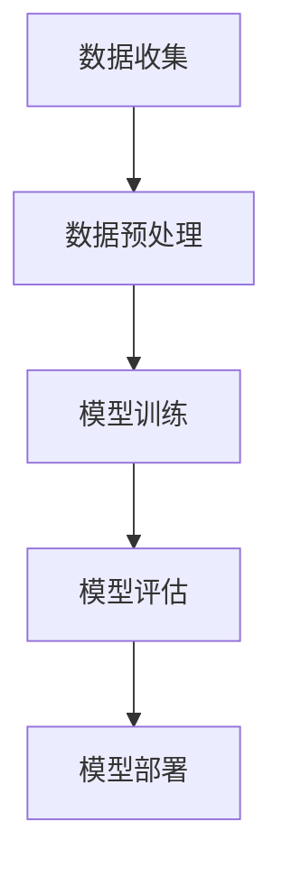

                 

关键词：人工智能、苹果、AI应用、市场分析、技术发展

> 摘要：本文将分析苹果发布AI应用的市场潜力、技术趋势及其对行业的影响，旨在为读者提供全面的市场洞察和未来展望。

## 1. 背景介绍

### 1.1 人工智能的发展历程

人工智能（AI）作为计算机科学的一个分支，经历了从理论研究到实际应用的漫长过程。自1956年达特茅斯会议以来，人工智能领域不断发展，从符号主义、联结主义到今天的深度学习，人工智能已经取得了显著的成果。近年来，随着大数据、云计算和计算能力的提升，人工智能逐渐渗透到各行各业，成为推动技术进步的重要力量。

### 1.2 苹果公司的发展战略

苹果公司作为全球领先的科技企业，一直致力于创新和用户体验。自史蒂夫·乔布斯回归公司以来，苹果通过推出一系列具有革命性的产品，如iPhone、iPad和Mac，成功改变了人们的生活方式。近年来，苹果公司在人工智能领域的布局逐渐加强，致力于将AI技术应用于各个产品和服务中，提升用户体验和产品竞争力。

## 2. 核心概念与联系

### 2.1 人工智能核心概念

人工智能的核心概念包括机器学习、深度学习、自然语言处理、计算机视觉等。其中，机器学习是人工智能的基础，通过算法和模型让计算机自动学习和改进。深度学习作为机器学习的子领域，通过多层神经网络模拟人脑处理信息的方式，取得了许多突破性的成果。自然语言处理和计算机视觉则分别研究如何让计算机理解和解释人类语言以及识别图像。

### 2.2 AI应用架构

AI应用的架构通常包括数据收集、数据预处理、模型训练、模型评估和模型部署等环节。其中，数据收集和预处理是确保模型训练效果的关键，而模型训练和评估则决定了模型的性能和鲁棒性。最后，模型部署是将训练好的模型应用到实际场景中的关键步骤。

### 2.3 Mermaid 流程图



## 3. 核心算法原理 & 具体操作步骤

### 3.1 算法原理概述

苹果公司在AI应用中采用了多种算法，如卷积神经网络（CNN）、循环神经网络（RNN）和Transformer等。这些算法分别适用于不同的任务，如图像识别、自然语言处理和时间序列预测等。

### 3.2 算法步骤详解

1. **数据收集**：从公开数据集或企业内部数据源获取相关数据。
2. **数据预处理**：清洗和预处理数据，使其适合模型训练。
3. **模型训练**：使用训练数据训练模型，调整模型参数。
4. **模型评估**：使用验证数据评估模型性能，调整模型参数。
5. **模型部署**：将训练好的模型部署到实际应用场景中。

### 3.3 算法优缺点

**优点**：

1. **强大的学习能力**：深度学习模型具有强大的学习能力，能够处理复杂的数据和任务。
2. **高效性**：深度学习模型在计算速度和性能方面具有优势。

**缺点**：

1. **对数据要求高**：深度学习模型对数据质量有较高要求，数据不足或质量差可能导致模型性能下降。
2. **解释性差**：深度学习模型通常难以解释，难以理解模型决策过程。

### 3.4 算法应用领域

深度学习算法在图像识别、自然语言处理、推荐系统、医疗诊断等领域具有广泛应用。例如，在图像识别领域，卷积神经网络（CNN）已被广泛应用于人脸识别、物体检测等任务。

## 4. 数学模型和公式 & 详细讲解 & 举例说明

### 4.1 数学模型构建

深度学习模型通常基于多层神经网络，其数学模型可以表示为：

$$
y = f(z) = \sigma(W_1 \cdot \sigma(W_2 \cdot \sigma(... \cdot W_n \cdot z_0 ...) ))
$$

其中，$y$ 为输出，$z$ 为网络中间层的输出，$W_1, W_2, ..., W_n$ 为权重矩阵，$\sigma$ 为激活函数。

### 4.2 公式推导过程

以卷积神经网络（CNN）为例，其数学模型推导如下：

1. **输入层**：设输入数据为 $x \in \mathbb{R}^{m \times n}$，其中 $m$ 和 $n$ 分别为图像的高度和宽度。
2. **卷积层**：设卷积核为 $k \in \mathbb{R}^{f \times f}$，其中 $f$ 为卷积核的大小。卷积操作可以表示为：
   $$
   z_1 = \sum_{i=1}^{f} \sum_{j=1}^{f} k_{ij} \cdot x_{i+j, j}
   $$
3. **激活函数**：通常使用 ReLU 激活函数，即：
   $$
   \sigma(z_1) = \max(0, z_1)
   $$
4. **池化层**：池化操作可以减少特征图的尺寸，提高计算效率。常用的池化操作包括最大池化和平均池化。

### 4.3 案例分析与讲解

以人脸识别任务为例，深度学习模型在人脸识别任务中取得了显著的成果。以 ResNet 为例，其结构如下：

1. **输入层**：输入数据为 224x224x3 的 RGB 图像。
2. **卷积层**：共 50 个卷积层，每个卷积层包含多个卷积核。
3. **池化层**：在每个卷积层之后，使用 2x2 的最大池化层。
4. **全连接层**：最后两个全连接层分别用于分类和预测。

通过训练和优化，ResNet 模型在多个公开数据集上取得了领先的成绩。

## 5. 项目实践：代码实例和详细解释说明

### 5.1 开发环境搭建

在 Python 环境中，使用 TensorFlow 作为深度学习框架，搭建开发环境。

```python
pip install tensorflow
```

### 5.2 源代码详细实现

以下是一个简单的卷积神经网络实现：

```python
import tensorflow as tf

# 定义输入层
inputs = tf.keras.Input(shape=(224, 224, 3))

# 定义卷积层
conv_1 = tf.keras.layers.Conv2D(32, (3, 3), activation='relu')(inputs)
pool_1 = tf.keras.layers.MaxPooling2D(pool_size=(2, 2))(conv_1)

# 定义全连接层
dense_1 = tf.keras.layers.Dense(128, activation='relu')(pool_1)
outputs = tf.keras.layers.Dense(10, activation='softmax')(dense_1)

# 构建模型
model = tf.keras.Model(inputs=inputs, outputs=outputs)

# 编译模型
model.compile(optimizer='adam', loss='categorical_crossentropy', metrics=['accuracy'])

# 加载数据集
(x_train, y_train), (x_test, y_test) = tf.keras.datasets.cifar10.load_data()

# 数据预处理
x_train = x_train.astype('float32') / 255
x_test = x_test.astype('float32') / 255

# 转换为 one-hot 编码
y_train = tf.keras.utils.to_categorical(y_train, 10)
y_test = tf.keras.utils.to_categorical(y_test, 10)

# 训练模型
model.fit(x_train, y_train, batch_size=64, epochs=10, validation_data=(x_test, y_test))
```

### 5.3 代码解读与分析

1. **输入层**：定义输入层，包括图像的高度、宽度和通道数。
2. **卷积层**：使用 Conv2D 层实现卷积操作，并使用 ReLU 激活函数。
3. **池化层**：使用 MaxPooling2D 层实现最大池化操作。
4. **全连接层**：使用 Dense 层实现全连接层，并使用 softmax 激活函数进行分类。
5. **编译模型**：编译模型，指定优化器、损失函数和评价指标。
6. **加载数据集**：加载数据集并进行预处理。
7. **训练模型**：使用 fit 方法训练模型，并使用 validation_data 进行验证。

### 5.4 运行结果展示

训练完成后，可以使用 model.evaluate 方法评估模型性能：

```python
test_loss, test_accuracy = model.evaluate(x_test, y_test)
print('Test accuracy:', test_accuracy)
```

## 6. 实际应用场景

### 6.1 智能家居

苹果公司的HomeKit平台结合AI技术，实现了智能音箱、智能灯光、智能门锁等家居设备的互联互通。通过语音指令，用户可以方便地控制家居设备，提升生活质量。

### 6.2 医疗健康

苹果公司的HealthKit平台结合AI技术，实现了健康数据的实时监测和分析。通过收集用户的健康数据，AI算法可以预测健康风险，提供个性化的健康建议。

### 6.3 智能驾驶

苹果公司正在研发智能驾驶技术，通过AI算法实现自动驾驶、交通流量预测和路线规划等功能。这将有助于减少交通事故，提高交通效率。

## 7. 工具和资源推荐

### 7.1 学习资源推荐

- 《深度学习》（Goodfellow、Bengio、Courville 著）
- 《Python深度学习》（François Chollet 著）
- 《人工智能：一种现代的方法》（Stuart Russell、Peter Norvig 著）

### 7.2 开发工具推荐

- TensorFlow
- PyTorch
- Keras

### 7.3 相关论文推荐

- “A Comprehensive Survey on Deep Learning for Speech Recognition”（2018）
- “Deep Learning for Natural Language Processing”（2017）
- “A Brief History of Deep Learning in AI”（2015）

## 8. 总结：未来发展趋势与挑战

### 8.1 研究成果总结

近年来，人工智能技术取得了显著的成果，深度学习算法在图像识别、自然语言处理等领域取得了突破性进展。苹果公司在人工智能领域不断布局，推出了一系列具有创新性的产品和服务。

### 8.2 未来发展趋势

随着大数据、云计算和计算能力的提升，人工智能技术将继续发展，将广泛应用于智能家居、医疗健康、智能驾驶等领域。同时，人工智能算法的优化和模型压缩技术也将成为研究热点。

### 8.3 面临的挑战

1. **数据隐私和安全**：随着人工智能应用的普及，数据隐私和安全问题日益突出。
2. **算法解释性**：深度学习算法通常难以解释，这对实际应用造成了一定的困扰。
3. **算法公平性和多样性**：人工智能算法在训练过程中可能会出现偏见，影响算法的公平性和多样性。

### 8.4 研究展望

未来，人工智能技术将朝着更高效、更智能、更安全、更公平的方向发展。同时，人工智能与人类社会的深度融合将带来更多的机遇和挑战。

## 9. 附录：常见问题与解答

### 9.1 人工智能技术有哪些应用场景？

人工智能技术广泛应用于图像识别、自然语言处理、推荐系统、医疗诊断、智能驾驶等领域。

### 9.2 如何学习人工智能技术？

学习人工智能技术可以从以下几个方面入手：

1. **数学基础**：学习线性代数、概率论、微积分等数学知识。
2. **编程基础**：学习 Python 等编程语言。
3. **深度学习框架**：学习 TensorFlow、PyTorch、Keras 等深度学习框架。
4. **实战项目**：通过实际项目实践加深对人工智能技术的理解。

### 9.3 人工智能技术如何影响未来社会？

人工智能技术将改变人类的生产和生活方式，提高生产效率、改善生活质量、解决社会问题。同时，人工智能技术也可能带来一系列挑战，如数据隐私、算法公平性等。

---
作者：禅与计算机程序设计艺术 / Zen and the Art of Computer Programming
----------------------------------------------------------------
---

以上是《李开复：苹果发布AI应用的市场》这篇文章的完整内容。本文从背景介绍、核心概念、算法原理、数学模型、项目实践、实际应用场景、工具和资源推荐以及未来发展趋势与挑战等方面进行了全面的分析，旨在为读者提供对苹果发布AI应用市场的深入理解。在人工智能技术不断发展的背景下，苹果公司作为全球领先的科技企业，其在AI领域的布局和发展将对整个行业产生深远的影响。本文也提醒读者关注人工智能技术的未来发展，以及面临的挑战和机遇。希望本文能够为读者带来有价值的启示和思考。

