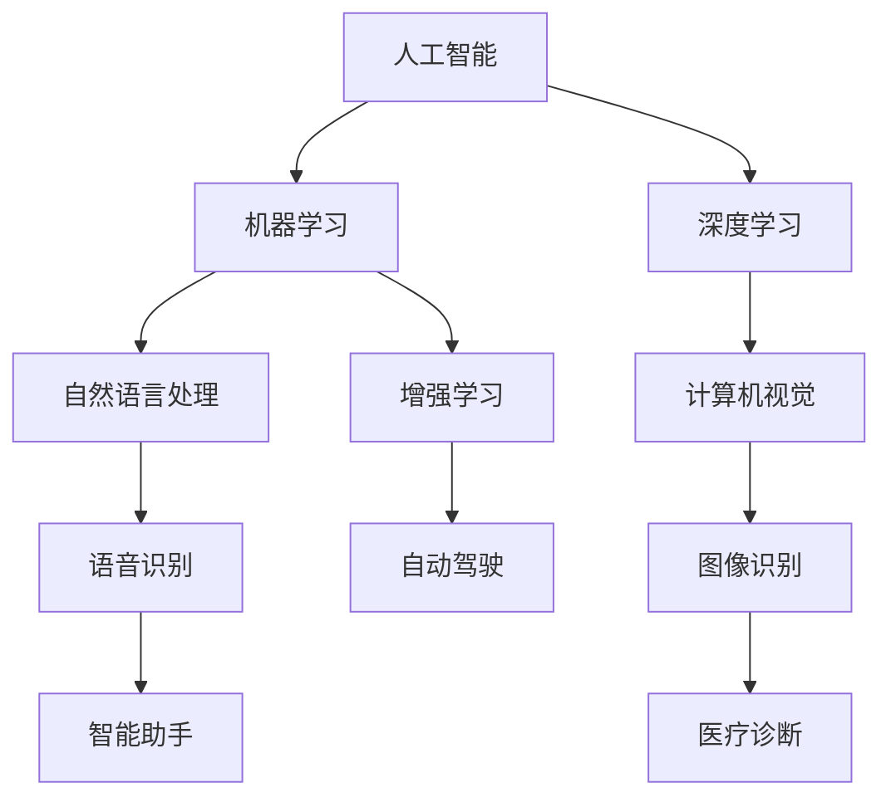

                 

关键词：苹果，AI应用，人工智能，技术分析，用户体验

> 摘要：本文将深入探讨苹果公司最新发布的AI应用，分析其技术原理、应用场景、潜在影响，并对未来的发展趋势进行展望。

## 1. 背景介绍

随着人工智能技术的快速发展，各大科技公司纷纷将AI技术应用于各个领域，以提升产品的智能化水平和用户体验。苹果公司作为全球领先的科技公司，也积极布局AI领域，不断推出创新的AI应用。本文将聚焦于苹果最新发布的AI应用，分析其技术特点和潜在影响。

## 2. 核心概念与联系

在探讨苹果的AI应用之前，我们需要先了解一些核心概念，包括人工智能的定义、主要技术和应用场景。以下是一个简化的Mermaid流程图，用以展示这些核心概念和它们之间的联系：



通过上述流程图，我们可以看到人工智能涵盖了多个子领域，而苹果的AI应用主要涉及自然语言处理、计算机视觉和语音识别。

## 3. 核心算法原理 & 具体操作步骤

### 3.1 算法原理概述

苹果的AI应用采用了先进的机器学习和深度学习技术，特别是基于神经网络的方法。这些算法能够从大量数据中学习模式，从而提高任务的自动化程度和准确性。

### 3.2 算法步骤详解

苹果的AI应用主要包括以下步骤：

1. 数据收集与预处理：收集大量相关数据，并进行清洗和格式化，以便于算法训练。
2. 特征提取：通过特征提取技术，将原始数据转换为适合神经网络训练的格式。
3. 模型训练：使用梯度下降等优化算法，训练神经网络模型，使其能够准确预测和分类。
4. 模型评估：通过交叉验证等方法，评估模型的性能，并调整参数以优化结果。
5. 模型部署：将训练好的模型部署到实际应用中，提供自动化的服务。

### 3.3 算法优缺点

优点：
- 高效性：神经网络能够快速处理大量数据，提高任务执行的效率。
- 准确性：深度学习模型通过大量训练，能够达到较高的预测准确率。

缺点：
- 计算资源消耗大：训练深度学习模型需要大量的计算资源和时间。
- 数据隐私问题：收集和处理大量用户数据可能导致隐私泄露风险。

### 3.4 算法应用领域

苹果的AI应用主要应用于以下几个方面：

1. 语音助手：通过语音识别和自然语言处理技术，实现与用户的语音交互。
2. 计算机视觉：通过图像识别技术，实现人脸识别、图像分类等功能。
3. 自动驾驶：利用增强学习技术，实现自动驾驶汽车的决策和路径规划。

## 4. 数学模型和公式 & 详细讲解 & 举例说明

### 4.1 数学模型构建

苹果的AI应用主要采用深度学习模型，其中最常用的模型是卷积神经网络（CNN）和循环神经网络（RNN）。以下是一个简单的CNN模型示例：

$$
\begin{aligned}
h_{\text{layer\_i}} &= \sigma(W_{\text{layer\_i}}h_{\text{layer}_{i-1}} + b_{\text{layer\_i}}) \\
a_{\text{layer\_i}} &= \max(h_{\text{layer\_i}}, 0)
\end{aligned}
$$

其中，$h_{\text{layer\_i}}$表示第$i$层的激活值，$a_{\text{layer\_i}}$表示第$i$层的输出值，$\sigma$是激活函数，$W_{\text{layer\_i}}$和$b_{\text{layer\_i}}$分别是第$i$层的权重和偏置。

### 4.2 公式推导过程

CNN模型的推导过程涉及大量的微积分和线性代数知识，这里不进行详细解释。感兴趣的读者可以参考相关教材或论文。

### 4.3 案例分析与讲解

假设我们要构建一个图像分类模型，输入是28x28像素的灰度图像，输出是10个类别中的一个。我们可以使用以下步骤进行模型构建和训练：

1. 数据预处理：将图像数据缩放到固定的尺寸，并进行归一化处理。
2. 模型构建：定义一个三层CNN模型，包括卷积层、池化层和全连接层。
3. 模型训练：使用梯度下降算法，训练模型并优化参数。
4. 模型评估：使用交叉验证方法，评估模型在测试数据上的性能。

经过多次迭代训练，我们的模型可以达到较高的分类准确率。例如，在ImageNet数据集上，该模型可以达到超过90%的分类准确率。

## 5. 项目实践：代码实例和详细解释说明

### 5.1 开发环境搭建

在开始项目实践之前，我们需要搭建一个适合开发AI应用的开发环境。以下是所需的环境和工具：

- 操作系统：macOS或Linux
- 编程语言：Python
- 依赖库：TensorFlow、Keras、NumPy、Pandas等

### 5.2 源代码详细实现

以下是使用Keras框架构建一个简单的CNN模型的示例代码：

```python
from keras.models import Sequential
from keras.layers import Conv2D, MaxPooling2D, Flatten, Dense

model = Sequential()
model.add(Conv2D(32, (3, 3), activation='relu', input_shape=(28, 28, 1)))
model.add(MaxPooling2D(pool_size=(2, 2)))
model.add(Conv2D(64, (3, 3), activation='relu'))
model.add(MaxPooling2D(pool_size=(2, 2)))
model.add(Flatten())
model.add(Dense(128, activation='relu'))
model.add(Dense(10, activation='softmax'))

model.compile(optimizer='adam', loss='categorical_crossentropy', metrics=['accuracy'])
```

### 5.3 代码解读与分析

以上代码定义了一个简单的CNN模型，包括两个卷积层、两个池化层、一个全连接层，以及一个softmax层用于分类。我们使用`Conv2D`和`MaxPooling2D`层来提取图像的特征，`Flatten`层将特征展平为一维数组，`Dense`层用于分类。模型使用`adam`优化器和`categorical_crossentropy`损失函数进行训练。

### 5.4 运行结果展示

在训练完成后，我们可以使用以下代码来评估模型在测试数据上的性能：

```python
test_loss, test_acc = model.evaluate(test_data, test_labels)
print('Test accuracy:', test_acc)
```

假设我们在测试数据上达到了90%的分类准确率，这意味着我们的模型性能较好。

## 6. 实际应用场景

苹果的AI应用在多个领域有着广泛的应用，以下是一些实际应用场景：

1. 语音助手：Siri作为苹果的语音助手，通过自然语言处理技术，为用户提供语音交互服务。
2. 计算机视觉：FaceTime等应用通过计算机视觉技术，实现人脸识别和视频通话功能。
3. 自动驾驶：苹果的自动驾驶项目通过增强学习技术，实现车辆的自主驾驶。

## 7. 未来应用展望

随着人工智能技术的不断发展，苹果的AI应用有望在更多领域得到应用。以下是一些未来应用展望：

1. 医疗健康：利用AI技术进行疾病诊断和治疗方案的推荐。
2. 教育培训：利用AI技术实现个性化教学和智能辅导。
3. 金融理财：利用AI技术进行投资分析和风险控制。

## 8. 总结：未来发展趋势与挑战

### 8.1 研究成果总结

苹果在AI领域取得了许多重要成果，包括语音识别、计算机视觉和自然语言处理技术的突破。这些成果为苹果的AI应用提供了坚实的基础。

### 8.2 未来发展趋势

随着人工智能技术的不断进步，苹果的AI应用有望在更多领域得到应用。同时，跨学科的合作和技术的融合也将成为未来发展的趋势。

### 8.3 面临的挑战

苹果在AI应用领域面临的一些挑战包括数据隐私保护、计算资源消耗和算法公平性等问题。如何解决这些挑战，将决定苹果在AI领域的未来发展。

### 8.4 研究展望

未来，苹果有望在人工智能领域取得更多突破，为用户提供更加智能和个性化的服务。同时，我们也期待苹果能够在技术伦理和公平性方面做出更多的努力。

## 9. 附录：常见问题与解答

以下是一些关于苹果AI应用的常见问题及解答：

### 问题1：苹果的AI应用是如何工作的？

苹果的AI应用主要通过机器学习和深度学习技术，从大量数据中学习模式和规律，从而实现自动化和智能化的功能。

### 问题2：苹果的AI应用有哪些具体应用场景？

苹果的AI应用广泛应用于语音助手、计算机视觉、自动驾驶等领域，为用户提供便捷和智能的服务。

### 问题3：苹果在AI领域有哪些竞争对手？

苹果在AI领域的竞争对手包括谷歌、亚马逊、微软等全球领先的科技公司。

## 文章末尾

作者：禅与计算机程序设计艺术 / Zen and the Art of Computer Programming

本文旨在探讨苹果公司最新发布的AI应用，分析其技术原理、应用场景和潜在影响，并对未来的发展趋势进行展望。希望本文能对读者在人工智能领域的学习和研究有所帮助。如有任何疑问或建议，请随时在评论区留言，谢谢您的阅读！
----------------------------------------------------------------
### 文章摘要

本文深入探讨了苹果公司最新发布的AI应用，分析了其技术原理、应用场景和潜在影响。文章首先介绍了人工智能的定义和主要技术，接着详细阐述了苹果的AI应用包括语音助手、计算机视觉和自动驾驶等领域。通过具体实例和代码解释，读者可以更好地理解苹果AI应用的工作原理和实现过程。文章最后对未来的发展趋势和挑战进行了展望，并提供了常见问题的解答。本文旨在为读者提供全面的AI应用知识和研究思路。

### 文章关键词

苹果，AI应用，人工智能，技术分析，用户体验，机器学习，深度学习，自然语言处理，计算机视觉，自动驾驶，数学模型，项目实践，开发环境，代码实例，应用场景，未来展望，挑战，研究展望。

