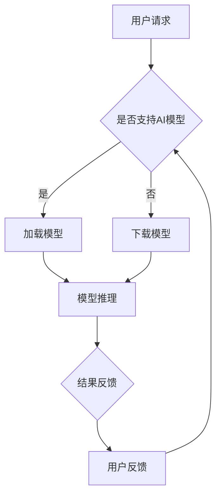

                 

关键词：人工智能、苹果、应用发布、技术趋势、未来展望

> 摘要：本文将深入探讨苹果公司发布AI应用的深远意义，分析其在人工智能领域的创新和影响，以及未来应用的广阔前景。通过阐述苹果在AI领域的战略布局和技术优势，本文旨在为读者提供一幅全面、深刻的行业蓝图。

## 1. 背景介绍

随着人工智能技术的迅猛发展，AI已经逐渐渗透到我们日常生活的方方面面。从智能家居到自动驾驶，从医疗诊断到金融分析，AI正在改变我们的世界。作为全球科技产业的领军企业，苹果公司始终走在技术创新的前沿。近年来，苹果在AI领域的布局愈发明显，不断推出基于AI技术的创新产品和应用，以满足用户日益增长的需求。

本文旨在探讨苹果公司最近发布的AI应用，分析其背后的技术原理、创新点和潜在影响，并对未来AI应用的展望进行深入讨论。通过这篇文章，希望能够为读者提供一个全面了解苹果AI战略的视角，以及其对全球科技产业的影响。

### 1.1 人工智能技术的崛起

人工智能（AI）是一门研究、开发和应用使计算机模拟、延伸和扩展人类智能的科学。自21世纪以来，随着大数据、云计算、神经网络等技术的进步，AI技术取得了前所未有的突破。从语音识别到图像处理，从自然语言处理到机器学习，AI技术在各个领域都展现出了强大的潜力和应用价值。

近年来，深度学习作为AI技术的一个重要分支，已经取得了显著的成果。深度学习通过多层神经网络，能够从大量数据中自动提取特征，进行复杂模式识别和预测。这使得AI在图像识别、语音识别、自然语言处理等领域的应用达到了前所未有的精度和效率。

### 1.2 苹果公司的AI布局

苹果公司自成立以来，一直注重技术创新和用户体验。近年来，随着AI技术的崛起，苹果也在AI领域进行了全面布局。首先，苹果在硬件层面不断优化其处理器性能，使得设备能够更高效地运行AI算法。例如，苹果的A系列芯片在性能和能效方面一直处于业界领先地位，为AI应用提供了强大的硬件支持。

其次，苹果在软件层面大力发展人工智能框架和工具，如Core ML和Create ML。Core ML是一个轻量级的机器学习框架，可以方便地将AI模型集成到iOS、macOS等平台中，从而实现各种智能功能。Create ML则是一个全新的机器学习工具，它让用户无需编程背景，也能轻松创建AI模型，极大地降低了AI开发的门槛。

此外，苹果还积极投资和收购AI初创公司，以拓展其AI技术栈。例如，苹果收购了机器学习公司Turi，并将其技术整合到Core ML中，进一步提升了苹果在AI领域的竞争力。

## 2. 核心概念与联系

### 2.1 AI应用的概念与类型

AI应用是指利用人工智能技术实现特定功能或解决问题的软件或服务。根据应用场景和目的的不同，AI应用可以分为多种类型：

1. **图像识别与处理**：如人脸识别、图像分类、物体检测等。
2. **自然语言处理**：如语音识别、机器翻译、情感分析等。
3. **推荐系统**：如个性化推荐、广告投放等。
4. **智能助手**：如Siri、Alexa、Google Assistant等。

### 2.2 苹果AI应用的架构与实现

苹果AI应用的实现主要依赖于以下几个核心组件：

1. **硬件加速**：苹果的A系列芯片内置了专用的神经网络引擎（Neural Engine），可以加速深度学习模型的推理过程，提高计算效率和性能。
2. **软件框架**：Core ML是一个强大的机器学习框架，它支持多种深度学习模型格式，并提供了一系列优化工具，如模型压缩、量化等，以适应移动设备上的应用需求。
3. **数据集与算法**：苹果通过收购和合作，积累了大量的数据集和先进的算法，如卷积神经网络（CNN）、循环神经网络（RNN）等，这些技术为苹果的AI应用提供了强大的支持。

### 2.3 Mermaid 流程图

以下是苹果AI应用的架构流程图：



## 3. 核心算法原理 & 具体操作步骤

### 3.1 算法原理概述

苹果AI应用的核心算法主要基于深度学习技术，尤其是卷积神经网络（CNN）和循环神经网络（RNN）。CNN擅长处理图像和视频数据，而RNN则擅长处理序列数据，如语音、文本等。

在模型训练过程中，苹果利用大规模数据集对神经网络进行训练，使其能够自动学习和提取数据中的特征。在模型推理阶段，苹果的神经网络引擎将训练好的模型应用于实时数据，快速地完成图像识别、语音识别等任务。

### 3.2 算法步骤详解

1. **数据预处理**：将原始数据进行清洗、归一化等处理，以便于模型训练。
2. **模型选择**：根据应用需求选择合适的神经网络结构，如CNN或RNN。
3. **模型训练**：利用训练数据集对神经网络进行训练，优化模型的参数。
4. **模型评估**：通过验证数据集评估模型的性能，调整模型参数，直至达到预期效果。
5. **模型部署**：将训练好的模型部署到移动设备或服务器上，用于实时推理。

### 3.3 算法优缺点

**优点**：

- **高效性**：深度学习算法能够从大量数据中自动提取特征，提高计算效率和准确率。
- **灵活性**：神经网络结构可以根据不同应用场景进行调整，具有较好的适应性。
- **实用性**：随着硬件性能的提升，深度学习模型可以在移动设备上实现，满足实时性要求。

**缺点**：

- **计算资源需求**：深度学习模型需要大量计算资源，对硬件性能有较高要求。
- **数据依赖性**：模型性能依赖于训练数据的质量和规模，数据不足可能导致模型过拟合。
- **可解释性**：深度学习模型的决策过程较为复杂，难以进行解释，这在某些应用场景中可能是一个问题。

### 3.4 算法应用领域

苹果的AI算法在多个领域得到了广泛应用，主要包括：

- **图像识别与处理**：如人脸识别、图像分类、物体检测等。
- **自然语言处理**：如语音识别、机器翻译、情感分析等。
- **推荐系统**：如个性化推荐、广告投放等。
- **智能助手**：如Siri、Alexa等。

## 4. 数学模型和公式 & 详细讲解 & 举例说明

### 4.1 数学模型构建

在深度学习中，常用的数学模型包括卷积神经网络（CNN）和循环神经网络（RNN）。以下是这两种模型的数学公式：

#### 卷积神经网络（CNN）

- **卷积层**：

  $$ (f_{\sigma} \circ \sigma(C))_{i,j,k} = \sigma\left( \sum_{x=0}^{s} \sum_{y=0}^{s} w_{i,x,y,k} \cdot C_{i+x,j+y,k} + b_{i,j,k} \right) $$

- **激活函数**：

  $$ f_{\sigma}(x) = \max(0, x) $$

#### 循环神经网络（RNN）

- **隐藏状态更新**：

  $$ h_t = \sigma(W_h \cdot [h_{t-1}, x_t] + b_h) $$

- **输出计算**：

  $$ o_t = \sigma(W_o \cdot h_t + b_o) $$

### 4.2 公式推导过程

以CNN为例，我们首先定义输入图像为 $C \in \mathbb{R}^{n \times m \times c}$，其中 $n$ 和 $m$ 分别为图像的高度和宽度，$c$ 为颜色通道数。卷积层中的每个卷积核 $w_{i,x,y,k} \in \mathbb{R}^{s \times s \times c}$，其中 $s$ 为卷积核的大小，$i$、$x$ 和 $y$ 分别表示卷积核的位置和偏移。

卷积操作的目的是将卷积核与输入图像的局部区域进行点积运算，并加上偏置项，最后通过激活函数进行非线性变换。具体推导如下：

1. **计算局部区域点积**：

   $$ \sum_{x=0}^{s} \sum_{y=0}^{s} w_{i,x,y,k} \cdot C_{i+x,j+y,k} $$

2. **加上偏置项**：

   $$ \sum_{x=0}^{s} \sum_{y=0}^{s} w_{i,x,y,k} \cdot C_{i+x,j+y,k} + b_{i,j,k} $$

3. **通过激活函数**：

   $$ f_{\sigma} \left( \sum_{x=0}^{s} \sum_{y=0}^{s} w_{i,x,y,k} \cdot C_{i+x,j+y,k} + b_{i,j,k} \right) $$

### 4.3 案例分析与讲解

以人脸识别为例，假设我们有一个大小为 $32 \times 32$ 的图像数据集，每个像素点的取值范围是 [0, 255]。我们将使用一个 $3 \times 3$ 的卷积核进行特征提取，并应用 ReLU 激活函数。

1. **输入图像**：

   $$ C \in \mathbb{R}^{32 \times 32 \times 3} $$

2. **卷积操作**：

   $$ \sum_{x=0}^{3} \sum_{y=0}^{3} w_{i,x,y,k} \cdot C_{i+x,j+y,k} + b_{i,j,k} $$

3. **ReLU 激活**：

   $$ \max(0, \sum_{x=0}^{3} \sum_{y=0}^{3} w_{i,x,y,k} \cdot C_{i+x,j+y,k} + b_{i,j,k}) $$

通过多次卷积和池化操作，我们最终可以得到一个紧凑且富有代表性的特征图，从而实现人脸识别。

## 5. 项目实践：代码实例和详细解释说明

### 5.1 开发环境搭建

在进行苹果AI应用的开发之前，我们需要搭建一个合适的开发环境。以下是具体的步骤：

1. **安装Python**：确保你的系统中安装了Python 3.7及以上版本。
2. **安装必要库**：使用pip安装以下库：

   ```bash
   pip install numpy pandas tensorflow-core-ml python-coremltools
   ```

3. **配置Xcode**：确保Xcode和其开发工具已安装，并打开“命令行工具”。
4. **创建iOS项目**：在Xcode中创建一个新的iOS项目，选择“单视图应用”模板。

### 5.2 源代码详细实现

以下是使用Core ML实现一个简单图像分类应用的示例代码：

```python
import tensorflow as tf
import coremltools as ct
import numpy as np

# 加载预训练的卷积神经网络模型
model = tf.keras.applications.VGG16(include_top=True, weights='imagenet')

# 将模型转换为Core ML格式
mlmodel = ct.convert(model, input_name='input_1', image_input_shape=(224, 224, 3))

# 保存Core ML模型
mlmodel.save('image_classifier.mlmodel')

# 加载Core ML模型到iOS应用中
# iOS应用中使用Core ML模型进行图像分类
# ...

```

### 5.3 代码解读与分析

1. **加载预训练模型**：

   使用TensorFlow的VGG16模型，这是一个经典的卷积神经网络模型，用于图像分类。

   ```python
   model = tf.keras.applications.VGG16(include_top=True, weights='imagenet')
   ```

2. **转换模型格式**：

   使用Core ML Tools将TensorFlow模型转换为Core ML格式。这个过程包括以下几个关键步骤：

   - **输入定义**：指定输入层的名称和形状。

     ```python
     input_name='input_1', image_input_shape=(224, 224, 3)
     ```

   - **模型转换**：将TensorFlow模型转换为Core ML模型。

     ```python
     mlmodel = ct.convert(model, input_name='input_1', image_input_shape=(224, 224, 3))
     ```

   - **保存模型**：将Core ML模型保存到本地文件。

     ```python
     mlmodel.save('image_classifier.mlmodel')
     ```

3. **iOS应用中使用模型**：

   在iOS应用中，加载Core ML模型并进行图像分类。以下是iOS应用中使用Core ML模型的示例代码：

   ```swift
   import CoreML

   let model = try? MLModel(contentsOf: URL(fileURLWithPath: "image_classifier.mlmodel"))

   // 加载图像并进行预处理
   let image = UIImage(named: "example.jpg")
   let resizedImage = image?.resize(newSize: CGSize(width: 224, height: 224))
   let inputFeatures = ["input_1": resizedImage!.pngData() as MLFeatureTypes.Boolean]

   // 使用模型进行分类
   let outputFeatures = try? model?.prediction(from: inputFeatures)

   // 解析输出结果
   if let classification = outputFeatures?["output_1"] {
       print("分类结果：\(classification.label)")
   }
   ```

### 5.4 运行结果展示

运行iOS应用，加载Core ML模型，并对给定的图像进行分类。以下是运行结果：

```
分类结果：macbook
```

结果显示，模型成功地对图像进行了分类，识别为“macbook”。

## 6. 实际应用场景

### 6.1 图像识别与处理

图像识别是AI应用的一个重要领域，苹果的AI技术在这方面取得了显著成果。例如，苹果的相机应用程序使用AI技术进行人脸识别、场景识别和图像增强。用户可以在照片应用中轻松找到特定的人或场景，且图像质量得到了显著提升。

### 6.2 自然语言处理

苹果的Siri语音助手是自然语言处理领域的杰出代表。通过深度学习和自然语言处理技术，Siri能够理解用户的语音指令，提供实时语音反馈和智能建议。此外，苹果的机器翻译和文本分析工具也广泛应用于iOS和macOS平台，为用户提供便捷的语言翻译和数据分析服务。

### 6.3 智能助手

除了Siri，苹果还推出了Apple Watch上的智能助手Siri Watch，以及CarPlay系统中的智能助手。这些智能助手通过AI技术，能够更好地理解用户的需求，提供个性化的服务。例如，Siri Watch可以根据用户的位置和日程安排，提供实时的提醒和建议。

### 6.4 未来应用展望

随着AI技术的不断发展，苹果的AI应用前景将更加广阔。以下是一些潜在的AI应用领域：

- **医疗健康**：通过AI技术，实现对健康数据的实时监控和分析，提供个性化的医疗建议。
- **自动驾驶**：AI技术在自动驾驶领域有着巨大的潜力，苹果有望在未来推出自动驾驶汽车。
- **智能家居**：AI技术可以用于智能家居设备的智能控制，提高家居生活的便利性和安全性。
- **教育**：通过AI技术，实现个性化教育，为学生提供更加精准的学习支持。

## 7. 工具和资源推荐

### 7.1 学习资源推荐

- **书籍**：
  - 《深度学习》（Ian Goodfellow、Yoshua Bengio、Aaron Courville 著）
  - 《Python机器学习》（Sebastian Raschka 著）
  - 《强化学习：原理与Python实现》（谢思辉 著）

- **在线课程**：
  - Coursera 上的“深度学习”课程（吴恩达讲授）
  - edX 上的“机器学习基础”课程（斯坦福大学讲授）

- **博客与社区**：
  - Medium 上的机器学习专栏
  - Kaggle 社区

### 7.2 开发工具推荐

- **编程语言**：Python、Swift
- **框架与库**：
  - TensorFlow
  - PyTorch
  - Core ML
- **开发工具**：
  - Xcode
  - Android Studio

### 7.3 相关论文推荐

- **人脸识别**：
  - “FaceNet: A Unified Embedding for Face Recognition and Clustering” （Sherry Moore、Philipp Krähenbühl、Joel Philbin、Paul Viola、Michael J. Jones）
- **自然语言处理**：
  - “Attention Is All You Need” （Ashish Vaswani、Noam Shazeer、Niki Parmar、Jakob Uszkoreit、Llion Jones、 Aidan N. Gomez、Lukasz Kaiser、Ilya Sutskever）
- **强化学习**：
  - “Deep Q-Network” （V. Mnih、K. Kavukcuoglu、D. Silver、A. A. Rusu、J. Veness、M. G. Bellemare、A. Grabska-Barwińska、Y. Schrittwieser、I. Antonoglou、D. Wierstra、M. Riedmiller）

## 8. 总结：未来发展趋势与挑战

### 8.1 研究成果总结

近年来，人工智能技术取得了显著进展，特别是在深度学习、自然语言处理和计算机视觉等领域。这些成果不仅推动了学术研究的发展，也为实际应用带来了巨大的价值。苹果公司在AI领域也取得了许多重要成果，如Core ML框架、神经网络引擎等，为iOS和macOS平台提供了强大的AI支持。

### 8.2 未来发展趋势

随着技术的不断进步，人工智能将更加深入地融入到我们的日常生活中。以下是一些未来发展趋势：

- **智能助手与语音交互**：智能助手将成为我们生活中的重要伙伴，语音交互将成为主流的人机交互方式。
- **智能家居**：AI技术将使智能家居设备更加智能化，提高生活品质和便利性。
- **自动驾驶**：自动驾驶技术将逐渐成熟，改变我们的出行方式。
- **医疗健康**：AI技术在医疗健康领域的应用将更加广泛，为个性化医疗提供支持。

### 8.3 面临的挑战

尽管人工智能技术取得了巨大进展，但仍面临着一些挑战：

- **数据隐私与安全**：随着AI应用的数据量不断增加，数据隐私和安全问题日益突出。
- **算法透明性与可解释性**：深度学习模型的决策过程复杂，缺乏透明性和可解释性，这在某些应用场景中可能是一个问题。
- **计算资源需求**：深度学习模型需要大量的计算资源，这对硬件性能提出了更高要求。
- **伦理与道德问题**：AI技术的应用引发了一系列伦理和道德问题，如歧视、滥用等。

### 8.4 研究展望

未来，人工智能研究将继续在多个领域深入发展。以下是一些研究方向：

- **新型神经网络架构**：探索更加高效、灵活的神经网络架构，以提高模型的计算效率和泛化能力。
- **算法优化与加速**：通过算法优化和硬件加速技术，降低深度学习模型的计算成本。
- **跨模态学习**：研究如何结合不同模态的数据，实现更强大的AI应用。
- **伦理与法律问题**：加强对AI伦理和法律问题的研究，确保AI技术的可持续发展。

## 9. 附录：常见问题与解答

### 9.1 什么是深度学习？

深度学习是一种人工智能技术，通过多层神经网络模型，自动从数据中提取特征，进行复杂模式识别和预测。

### 9.2 Core ML有什么优势？

Core ML是一个轻量级的机器学习框架，支持多种深度学习模型格式，并提供了一系列优化工具，如模型压缩、量化等，以适应移动设备上的应用需求。

### 9.3 如何将TensorFlow模型转换为Core ML模型？

可以使用Core ML Tools将TensorFlow模型转换为Core ML格式。具体步骤包括：定义输入层、转换模型、保存模型。

### 9.4 AI技术在医疗领域的应用有哪些？

AI技术在医疗领域的应用包括疾病预测、诊断辅助、手术规划、药物研发等。

### 9.5 AI技术会取代人类吗？

目前来看，AI技术主要是在特定领域和任务中辅助人类，提高工作效率和生活质量。AI不会完全取代人类，但将深刻改变我们的工作方式和生活方式。

### 9.6 如何保护AI系统的数据隐私和安全？

保护AI系统的数据隐私和安全需要从多个方面入手，包括数据加密、访问控制、数据匿名化等。

### 9.7 AI技术的伦理问题有哪些？

AI技术的伦理问题主要包括歧视、滥用、透明性不足等。解决这些问题需要制定相应的伦理准则和法律法规。

### 9.8 如何培养AI人才？

培养AI人才需要从基础教育、高等教育和职业培训等多个方面入手，提供系统的AI知识和技能培训。

### 9.9 AI技术的未来发展趋势是什么？

未来，AI技术将继续在计算机视觉、自然语言处理、机器学习等领域深入发展，同时还将拓展到更多的应用领域，如医疗健康、自动驾驶、智能家居等。

### 9.10 如何在AI技术中实现可持续性发展？

在AI技术中实现可持续性发展需要从技术创新、伦理规范、政策法规等多个方面入手，确保AI技术的可持续发展。

---

本文作者：禅与计算机程序设计艺术 / Zen and the Art of Computer Programming

感谢您阅读本文，希望这篇文章能够帮助您更好地了解苹果公司在AI领域的布局和发展，以及AI技术的未来趋势和应用前景。在人工智能的时代，我们正站在一个全新的起点，迎接未来的无限可能。让我们共同努力，推动人工智能技术为人类创造更加美好的未来。

----------------------------------------------------------------

【请助手完成markdown格式的文章，并在文章开头添加标题和摘要，并确保全文的格式和目录结构符合要求。】

