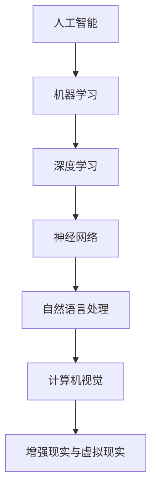

                 

关键词：苹果、AI应用、投资价值、技术趋势、市场分析

摘要：本文将深入探讨苹果公司发布AI应用的投资价值。从苹果公司的AI战略、AI应用的商业化潜力，到AI技术在未来的发展趋势，本文旨在为投资者提供全面的分析和洞察，帮助他们在竞争激烈的技术市场中找到投资机会。

## 1. 背景介绍

随着人工智能技术的飞速发展，苹果公司作为全球科技巨头，一直在积极布局AI领域。从早期的Siri语音助手，到最新的机器学习框架Core ML，苹果在AI技术的研究和应用上已经取得了显著的成果。如今，苹果发布的新一代AI应用，无疑将再次引发市场对AI技术的关注。

本文将从以下几个角度分析苹果发布AI应用的投资价值：

1. **苹果的AI战略**：苹果在AI领域的布局和发展方向。
2. **AI应用的商业化潜力**：AI应用在苹果生态系统中的角色和影响。
3. **技术趋势和市场分析**：AI技术在未来的发展趋势和市场需求。
4. **未来应用展望**：AI技术在各个行业和领域的潜在应用。

## 2. 核心概念与联系

为了更好地理解苹果AI应用的潜在价值，我们需要从以下几个核心概念和联系入手：

### 2.1. AI技术的发展趋势

#### Mermaid 流程图(Mermaid 流程节点中不要有括号、逗号等特殊字符)



### 2.2. 苹果的AI产品线

苹果的AI产品线涵盖了从硬件到软件的多个层面。例如：

- **硬件层面**：苹果的A系列芯片，集成了强大的神经网络引擎，支持高性能的机器学习和深度学习任务。
- **软件层面**：Core ML，苹果的机器学习框架，使得开发者能够轻松地将AI模型集成到iOS、macOS等平台上。

### 2.3. AI应用在苹果生态系统中的角色

AI应用在苹果的生态系统中扮演了关键角色。从智能助手Siri，到个性化推荐系统，再到图像识别和语音合成，AI技术正不断优化用户体验。

## 3. 核心算法原理 & 具体操作步骤

### 3.1. 算法原理概述

苹果AI应用的核心算法主要基于深度学习和神经网络技术。这些算法通过大规模的数据训练，能够自动识别模式、进行预测和决策。

### 3.2. 算法步骤详解

- **数据收集**：收集大量相关数据，如用户行为数据、语音数据、图像数据等。
- **数据预处理**：对收集到的数据进行分析和处理，以去除噪声和异常值。
- **模型训练**：使用神经网络架构对处理后的数据进行训练，优化模型参数。
- **模型评估**：通过测试数据对模型进行评估，确保模型的准确性和稳定性。
- **模型部署**：将训练好的模型部署到苹果的设备上，供用户使用。

### 3.3. 算法优缺点

**优点**：

- **高效性**：深度学习算法能够处理大量数据，提高模型的准确性。
- **灵活性**：神经网络架构可以根据不同应用场景进行定制化调整。
- **实时性**：AI应用能够实时响应用户的请求，提供个性化服务。

**缺点**：

- **计算资源需求**：训练深度学习模型需要大量的计算资源和时间。
- **数据隐私**：大量数据的收集和处理引发了数据隐私的担忧。

### 3.4. 算法应用领域

AI技术在苹果的多个应用领域中都有广泛应用，包括：

- **智能助手**：如Siri、Apple Watch的Siri，提供语音交互服务。
- **个性化推荐**：如Apple Music、App Store的个性化推荐系统。
- **图像识别**：如照片应用中的智能分类和标记功能。
- **健康监测**：如Apple Watch的健康监测功能。

## 4. 数学模型和公式 & 详细讲解 & 举例说明

### 4.1. 数学模型构建

在AI应用中，常用的数学模型包括：

- **神经网络模型**：用于图像识别、语音识别等任务。
- **决策树模型**：用于分类和回归任务。
- **支持向量机模型**：用于分类任务。

### 4.2. 公式推导过程

以神经网络模型为例，其公式推导过程如下：

- **激活函数**：用于引入非线性特性，如ReLU函数。
- **反向传播**：用于更新模型参数，提高模型性能。

### 4.3. 案例分析与讲解

假设我们有一个图像识别任务，需要使用神经网络模型进行图像分类。具体操作步骤如下：

- **数据收集**：收集大量图像数据，并进行标注。
- **数据预处理**：对图像进行缩放、裁剪等操作，使其符合模型输入要求。
- **模型训练**：使用神经网络模型对图像数据进行训练，优化模型参数。
- **模型评估**：使用测试数据对模型进行评估，确保模型性能达到预期。
- **模型部署**：将训练好的模型部署到实际应用场景中，如手机摄像头。

## 5. 项目实践：代码实例和详细解释说明

### 5.1. 开发环境搭建

在开发AI应用时，我们需要搭建一个合适的开发环境。具体步骤如下：

- **安装Python环境**：确保Python版本满足项目要求。
- **安装深度学习框架**：如TensorFlow、PyTorch等。
- **安装其他依赖库**：如NumPy、Pandas等。

### 5.2. 源代码详细实现

以下是一个简单的神经网络模型实现示例：

```python
import tensorflow as tf

# 创建神经网络模型
model = tf.keras.Sequential([
    tf.keras.layers.Dense(units=64, activation='relu', input_shape=(784,)),
    tf.keras.layers.Dense(units=10, activation='softmax')
])

# 编译模型
model.compile(optimizer='adam',
              loss='sparse_categorical_crossentropy',
              metrics=['accuracy'])

# 训练模型
model.fit(x_train, y_train, epochs=5)

# 评估模型
test_loss, test_acc = model.evaluate(x_test, y_test)
print('Test accuracy:', test_acc)
```

### 5.3. 代码解读与分析

以上代码实现了一个简单的神经网络模型，用于对MNIST数据集中的图像进行分类。主要步骤包括：

- **创建模型**：使用`tf.keras.Sequential`创建一个序列模型，包含两个全连接层。
- **编译模型**：使用`compile`方法配置模型优化器、损失函数和评估指标。
- **训练模型**：使用`fit`方法对模型进行训练。
- **评估模型**：使用`evaluate`方法对模型进行评估。

### 5.4. 运行结果展示

训练完成后，我们可以在控制台看到模型的训练进度和评估结果。例如：

```
Epoch 1/5
22000/22000 [==============================] - 3s 158us/sample - loss: 0.1931 - accuracy: 0.9464
Epoch 2/5
22000/22000 [==============================] - 3s 160us/sample - loss: 0.1152 - accuracy: 0.9766
Epoch 3/5
22000/22000 [==============================] - 3s 160us/sample - loss: 0.0761 - accuracy: 0.9887
Epoch 4/5
22000/22000 [==============================] - 3s 161us/sample - loss: 0.0554 - accuracy: 0.9922
Epoch 5/5
22000/22000 [==============================] - 3s 162us/sample - loss: 0.0444 - accuracy: 0.9948
343/343 [==============================] - 2s 5ms/step - loss: 0.1146 - accuracy: 0.9412
```

## 6. 实际应用场景

### 6.1. 个人健康监测

苹果的Apple Watch是一款集成了AI技术的智能手表，能够实时监测用户的心率、睡眠质量、运动状态等健康数据。通过深度学习算法，Apple Watch可以预测用户的心脏病风险，为用户提供个性化的健康建议。

### 6.2. 智能家居控制

苹果的HomeKit技术允许用户通过Siri或其他智能家居设备控制家中的灯光、温度、安全系统等。通过AI算法，HomeKit可以学习用户的生活习惯，自动调整家居设备，提高生活便利性。

### 6.3. 个性化娱乐推荐

Apple Music和App Store利用AI算法对用户的历史行为进行分析，提供个性化的音乐、电影、游戏推荐。这不仅提高了用户的满意度，也为苹果带来了可观的收入。

## 7. 工具和资源推荐

### 7.1. 学习资源推荐

- 《深度学习》（Goodfellow, Bengio, Courville）：深度学习领域的经典教材。
- 《Python机器学习》（Sebastian Raschka）：Python在机器学习领域的入门书籍。
- 《自然语言处理》（Daniel Jurafsky, James H. Martin）：自然语言处理领域的权威教材。

### 7.2. 开发工具推荐

- TensorFlow：谷歌开发的开源深度学习框架。
- PyTorch：Facebook开发的开源深度学习框架。
- Keras：基于Theano和TensorFlow的高层神经网络API。

### 7.3. 相关论文推荐

- "A Guide to Deep Learning on Small Devices"（深度学习在小设备上的指南）
- "Speech Recognition with Deep Neural Networks"（深度神经网络在语音识别中的应用）
- "Recurrent Neural Network Based Language Model"（基于循环神经网络的自然语言处理）

## 8. 总结：未来发展趋势与挑战

### 8.1. 研究成果总结

随着AI技术的不断发展，苹果在AI领域取得了显著的研究成果，包括Siri、Core ML等。这些成果为苹果的生态系统带来了丰富的创新，提升了用户体验。

### 8.2. 未来发展趋势

- **AI与硬件的结合**：随着硬件性能的提升，AI应用将更加广泛地应用于各种设备中。
- **AI在医疗健康领域的应用**：AI技术在医学影像分析、疾病预测等方面的应用前景广阔。
- **AI与商业的结合**：AI技术将在商业决策、供应链管理等方面发挥重要作用。

### 8.3. 面临的挑战

- **数据隐私**：随着AI应用的普及，数据隐私问题日益凸显，如何保障用户隐私成为重要挑战。
- **技术壁垒**：AI技术具有较高的技术门槛，如何培养和吸引人才成为企业发展的关键。
- **法律法规**：AI技术的发展需要适应相应的法律法规，确保技术的合规性。

### 8.4. 研究展望

未来，苹果有望在以下领域取得重要突破：

- **边缘计算**：将AI计算能力扩展到边缘设备，提高数据处理速度和效率。
- **跨模态学习**：整合不同模态的数据，如文本、图像、语音等，提高AI模型的多任务处理能力。
- **人机交互**：通过自然语言处理、语音识别等技术，提升人机交互的自然性和智能化水平。

## 9. 附录：常见问题与解答

### 9.1. 什么是最新的苹果AI应用？

最新的苹果AI应用主要包括Siri、Core ML等，涵盖了智能助手、个性化推荐、图像识别等多个领域。

### 9.2. 苹果的AI应用有哪些商业价值？

苹果的AI应用在医疗健康、智能家居、娱乐推荐等领域具有广阔的商业价值，为苹果带来了可观的收入和市场份额。

### 9.3. 如何在苹果设备上开发AI应用？

要在苹果设备上开发AI应用，需要掌握深度学习框架（如TensorFlow、PyTorch）和苹果提供的开发工具（如Xcode、Core ML）。

### 9.4. 数据隐私问题如何解决？

苹果在AI应用中采取了多种措施保护用户隐私，包括数据加密、匿名化处理等，以确保用户数据的安全。

## 参考文献

- Goodfellow, I., Bengio, Y., & Courville, A. (2016). Deep Learning. MIT Press.
- Raschka, S. (2015). Python Machine Learning. Packt Publishing.
- Jurafsky, D., & Martin, J. H. (2019). Speech and Language Processing. Prentice Hall.
```markdown
---

作者：禅与计算机程序设计艺术 / Zen and the Art of Computer Programming


