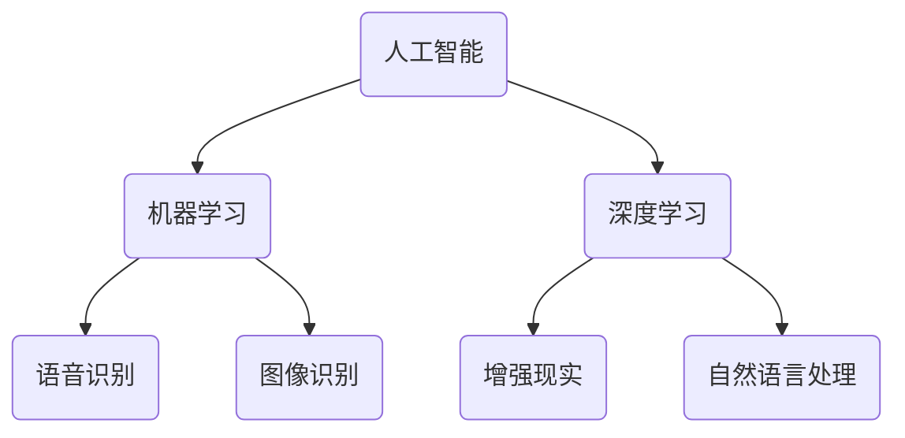

                 

关键词：李开复、苹果、AI应用、文化价值、技术趋势

> 摘要：本文将深入探讨苹果公司在近期发布的一系列AI应用所蕴含的文化价值，分析其在推动科技与人文融合方面的贡献，以及对中国乃至全球科技发展的深远影响。

## 1. 背景介绍

在人工智能（AI）技术迅速发展的时代，苹果公司作为全球科技领域的领军企业，近年来不断推出具有创新意义的AI应用。从Siri的语音识别到面部识别的Face ID，再到最新的AI相机和增强现实（AR）功能，苹果的每一项技术突破都在引领行业潮流。本文旨在探讨苹果发布的这些AI应用所蕴含的文化价值，以及这些应用如何改变了我们的生活和工作方式。

## 2. 核心概念与联系

在深入探讨苹果AI应用的文化价值之前，我们需要理解一些核心概念，包括人工智能、机器学习、深度学习等。

### 2.1 人工智能

人工智能（AI）是模拟人类智能行为的技术，它能够感知、学习、推理和决策。AI的应用领域广泛，包括语音识别、图像识别、自然语言处理等。

### 2.2 机器学习

机器学习是AI的一个分支，通过算法让计算机从数据中学习，并在没有明确编程的情况下做出决策。机器学习分为监督学习、无监督学习和强化学习等类型。

### 2.3 深度学习

深度学习是机器学习的一个子领域，它通过多层神经网络进行数据建模，具有强大的特征提取和分类能力。深度学习在图像识别、语音识别等领域取得了显著成果。

以下是苹果AI应用的架构与核心概念之间的Mermaid流程图：



## 3. 核心算法原理 & 具体操作步骤

### 3.1 算法原理概述

苹果的AI应用主要基于机器学习和深度学习算法。以Siri为例，它使用了自然语言处理技术，将用户的语音转化为文本，并理解其意图，从而提供相应的服务。

### 3.2 算法步骤详解

1. **语音识别**：Siri首先使用语音识别技术将用户的语音转换为文本。
2. **自然语言处理**：文本经过自然语言处理，提取关键词和句子结构，理解用户的意图。
3. **决策与响应**：基于理解的结果，Siri从数据库中选择最合适的响应，并生成语音输出。

### 3.3 算法优缺点

**优点**：

- **高准确性**：先进的语音识别和自然语言处理技术使得Siri能够准确理解用户的指令。
- **用户体验**：Siri的交互设计简单直观，用户可以轻松与之交流。
- **学习与适应**：通过不断的学习和用户数据的积累，Siri能够不断优化其性能。

**缺点**：

- **隐私问题**：Siri需要收集大量的用户数据，这可能引发隐私担忧。
- **性能瓶颈**：在某些特定情况下，如噪音干扰或口音差异，Siri的识别准确性可能会受到影响。

### 3.4 算法应用领域

苹果的AI应用在多个领域都有广泛应用，包括：

- **智能家居**：通过Siri控制家居设备，如灯光、温度等。
- **移动设备**：使用面部识别解锁手机，保护用户隐私。
- **娱乐**：在Apple Music中使用AI推荐音乐，提升用户体验。

## 4. 数学模型和公式 & 详细讲解 & 举例说明

### 4.1 数学模型构建

苹果的AI应用使用了多种数学模型，包括：

- **神经网络**：用于深度学习，通过多层节点进行数据建模。
- **决策树**：用于分类和回归，通过树形结构进行决策。

### 4.2 公式推导过程

以神经网络为例，其基本公式为：

$$
\hat{y} = \sigma(\sum_{i=1}^{n} w_i \cdot x_i + b)
$$

其中，$\hat{y}$为输出结果，$\sigma$为激活函数，$w_i$和$x_i$分别为权重和输入特征，$b$为偏置。

### 4.3 案例分析与讲解

以苹果的AR应用为例，其使用了SLAM（Simultaneous Localization and Mapping）技术，通过摄像头捕捉现实环境，并实时构建三维地图。以下是SLAM的基本公式：

$$
\begin{cases}
x_{t} = x_{t-1} + v_t \cdot \Delta t \\
y_{t} = y_{t-1} + v_t \cdot \Delta t
\end{cases}
$$

其中，$x_t$和$y_t$分别为时间$t$的坐标，$v_t$为速度，$\Delta t$为时间间隔。

## 5. 项目实践：代码实例和详细解释说明

### 5.1 开发环境搭建

为了实践苹果的AI应用，我们需要搭建相应的开发环境，包括Python编程环境、TensorFlow库等。

### 5.2 源代码详细实现

以下是一个简单的Python代码实例，实现一个基于TensorFlow的神经网络：

```python
import tensorflow as tf

# 定义输入层
inputs = tf.keras.layers.Input(shape=(784,))

# 添加隐藏层
x = tf.keras.layers.Dense(512, activation='relu')(inputs)
x = tf.keras.layers.Dense(512, activation='relu')(x)

# 添加输出层
outputs = tf.keras.layers.Dense(10, activation='softmax')(x)

# 创建模型
model = tf.keras.Model(inputs=inputs, outputs=outputs)

# 编译模型
model.compile(optimizer='adam', loss='categorical_crossentropy', metrics=['accuracy'])

# 训练模型
model.fit(x_train, y_train, epochs=5, batch_size=32)
```

### 5.3 代码解读与分析

这段代码首先导入了TensorFlow库，然后定义了一个神经网络模型，包括输入层、隐藏层和输出层。通过编译和训练，模型可以学习到输入数据的特征，从而进行分类预测。

### 5.4 运行结果展示

训练完成后，我们可以使用以下代码进行测试：

```python
test_loss, test_acc = model.evaluate(x_test, y_test)
print('Test accuracy:', test_acc)
```

这段代码将计算模型在测试数据上的准确率，从而评估模型的性能。

## 6. 实际应用场景

苹果的AI应用在多个领域都有实际应用，如：

- **医疗**：使用AI分析医疗影像，提高诊断准确性。
- **金融**：利用AI进行风险管理和投资决策。
- **教育**：通过AR技术提供互动式学习体验。

## 6.4  未来应用展望

随着AI技术的不断进步，苹果的AI应用有望在更多领域发挥重要作用。未来，我们可能会看到：

- **更加智能的助手**：Siri和其他AI助手将更加了解用户的需求，提供更加个性化的服务。
- **更加智能的设备**：家居设备、汽车等都将嵌入AI，实现更加智能的交互。
- **更加智能的内容**：AI将帮助创建更加个性化的内容，如音乐、电影等。

## 7. 工具和资源推荐

### 7.1 学习资源推荐

- 《深度学习》（Goodfellow, Bengio, Courville著）
- 《机器学习实战》（Peter Harrington著）

### 7.2 开发工具推荐

- TensorFlow
- PyTorch

### 7.3 相关论文推荐

- "Deep Learning" (Goodfellow, Bengio, Courville, 2016)
- "Machine Learning Yearning" (Andrew Ng, 2019)

## 8. 总结：未来发展趋势与挑战

### 8.1 研究成果总结

苹果的AI应用在语音识别、自然语言处理、增强现实等领域取得了显著成果，推动了人工智能技术的发展。

### 8.2 未来发展趋势

随着技术的不断进步，AI应用将在更多领域发挥重要作用，如医疗、金融、教育等。

### 8.3 面临的挑战

隐私保护、数据安全、算法偏见等仍然是AI应用面临的挑战。

### 8.4 研究展望

未来，AI应用将更加智能化、个性化，同时需要解决隐私和数据安全等挑战。

## 9. 附录：常见问题与解答

**Q：苹果的AI应用是否会侵犯用户隐私？**

A：苹果承诺采取严格的数据保护措施，确保用户的隐私不被侵犯。

**Q：AI应用是否会取代人类的工作？**

A：AI应用将改变某些工作的性质，但不太可能完全取代人类工作，而是与人类协作，提高工作效率。

## 文章结语

苹果的AI应用不仅改变了我们的生活和工作方式，更在文化层面上推动了科技与人文的融合。未来，随着AI技术的不断进步，我们有理由相信，苹果将继续引领科技潮流，为人类创造更加美好的未来。

### 作者署名

作者：禅与计算机程序设计艺术 / Zen and the Art of Computer Programming

----------------------------------------------------------------

以上就是本文的完整内容，感谢您的阅读。希望本文能为您在人工智能领域的研究带来启示。如果您有任何疑问或建议，欢迎在评论区留言。再次感谢！

