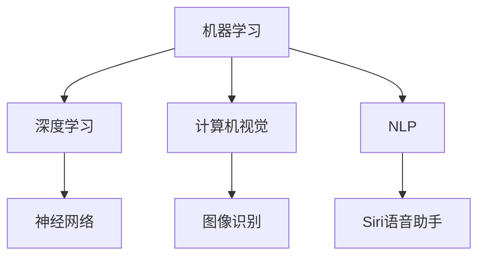

                 

关键词：苹果，AI应用，人工智能，技术趋势，未来展望

摘要：本文将深入探讨苹果公司发布AI应用的未来，分析其潜在影响、技术发展趋势以及面临的挑战。通过梳理苹果在AI领域的最新动态，本文旨在为读者提供一份全面的技术洞察。

## 1. 背景介绍

人工智能（AI）已经成为当今科技领域的热点。从自然语言处理、计算机视觉到强化学习，AI技术在各个行业都得到了广泛应用。苹果公司，作为全球领先的科技巨头，也在积极推进AI技术的发展。苹果的AI应用不仅为消费者提供了便利，也为开发者带来了新的机遇。

### 苹果AI应用的现状

近年来，苹果公司已经在多个产品中嵌入了AI功能，如Siri语音助手、面部识别技术、智能照片管理等。这些AI应用在提升用户体验方面发挥了重要作用。然而，随着技术的不断进步，苹果在AI领域的潜力仍然巨大。

### 潜在影响

苹果的AI应用对消费者和企业都产生了深远的影响。对于消费者，AI应用提高了产品智能化水平，带来了更便捷、个性化的使用体验。对于企业，AI技术不仅提升了生产效率，还为企业提供了新的商业模式。

## 2. 核心概念与联系

为了更好地理解苹果AI应用的未来，我们需要首先了解一些核心概念和它们之间的联系。

### 2.1. 机器学习

机器学习是AI的核心技术之一。它使计算机能够从数据中学习，并做出预测和决策。苹果的AI应用主要依赖于深度学习，这是一种基于神经网络的机器学习技术。

### 2.2. 计算机视觉

计算机视觉是AI技术的一个重要分支，它使计算机能够理解和解释图像和视频。在苹果的产品中，计算机视觉技术被广泛应用于面部识别、图像识别等场景。

### 2.3. 自然语言处理

自然语言处理（NLP）是AI的另一项核心技术，它使计算机能够理解、生成和解读人类语言。Siri语音助手就是苹果在NLP领域的重要应用。

### 2.4. Mermaid 流程图

为了更直观地展示这些概念之间的联系，我们可以使用Mermaid流程图来描述：



## 3. 核心算法原理 & 具体操作步骤

### 3.1 算法原理概述

苹果的AI应用主要依赖于深度学习和神经网络。深度学习通过多层神经网络对数据进行处理，从而实现自动特征提取和模式识别。神经网络则是由大量相互连接的节点（神经元）组成，这些节点通过加权连接传递信息。

### 3.2 算法步骤详解

#### 3.2.1 数据预处理

在深度学习模型训练之前，需要对数据进行预处理。这包括数据清洗、归一化、数据增强等步骤。

#### 3.2.2 模型训练

模型训练是深度学习过程的核心。苹果使用大量的数据来训练模型，使模型能够自动学习和优化。

#### 3.2.3 模型评估

模型训练完成后，需要对模型进行评估。这包括准确率、召回率、F1分数等指标。

#### 3.2.4 模型部署

评估通过的模型将被部署到苹果的产品中，为用户提供实时服务。

### 3.3 算法优缺点

#### 3.3.1 优点

- **强大的学习能力和泛化能力**：深度学习模型可以自动从大量数据中学习，并应用于不同的任务。
- **实时性和准确性**：神经网络模型可以实时处理用户输入，并提供准确的预测和决策。

#### 3.3.2 缺点

- **需要大量数据**：深度学习模型需要大量的训练数据来达到良好的性能。
- **计算资源消耗**：深度学习模型的训练和推理过程需要大量的计算资源。

### 3.4 算法应用领域

苹果的AI应用在多个领域都有广泛的应用，包括但不限于：

- **消费者产品**：如Siri语音助手、面部识别、智能照片管理。
- **商业应用**：如数据分析、智能推荐、自动化决策。

## 4. 数学模型和公式 & 详细讲解 & 举例说明

### 4.1 数学模型构建

深度学习模型的核心是神经网络。神经网络由多个层组成，包括输入层、隐藏层和输出层。每一层都由多个神经元组成，神经元之间通过加权连接相连。

#### 4.1.1 神经元模型

一个简单的神经元模型可以表示为：

$$
a = \sigma(\sum_{i=1}^{n} w_i x_i + b)
$$

其中，$a$ 是神经元的激活值，$\sigma$ 是激活函数，$w_i$ 是权重，$x_i$ 是输入值，$b$ 是偏置。

#### 4.1.2 损失函数

损失函数用于评估模型预测值与真实值之间的差距。常用的损失函数包括均方误差（MSE）和交叉熵（CE）。

$$
L = \frac{1}{2} \sum_{i=1}^{n} (\hat{y}_i - y_i)^2
$$

或

$$
L = -\sum_{i=1}^{n} y_i \log(\hat{y}_i)
$$

其中，$\hat{y}_i$ 是模型预测值，$y_i$ 是真实值。

### 4.2 公式推导过程

在深度学习模型中，我们通常使用反向传播算法来更新权重和偏置。以下是反向传播算法的推导过程：

#### 4.2.1 前向传播

在训练过程中，我们将输入数据输入到模型中，通过前向传播计算输出值。

$$
z_l = \sum_{j=1}^{m} w_{lj} a_{l-1,j} + b_l
$$

$$
a_l = \sigma(z_l)
$$

其中，$a_l$ 是第$l$层的输出值，$z_l$ 是第$l$层的输入值，$w_{lj}$ 是权重，$b_l$ 是偏置，$\sigma$ 是激活函数。

#### 4.2.2 反向传播

在反向传播过程中，我们从输出层开始，计算每个层的梯度，并更新权重和偏置。

$$
\delta_l = (a_l - y_l) \odot \sigma'(z_l)
$$

$$
\Delta w_{lj} = \eta \delta_{l+1} a_{l-1,j}
$$

$$
\Delta b_l = \eta \delta_{l+1}
$$

其中，$\delta_l$ 是梯度，$\odot$ 是元素乘，$\eta$ 是学习率。

### 4.3 案例分析与讲解

以Siri语音助手为例，我们可以分析其在自然语言处理中的应用。

#### 4.3.1 模型构建

Siri使用深度学习模型来理解用户的话语。模型的输入是语音信号，输出是文本响应。

#### 4.3.2 数据预处理

在训练过程中，需要对语音信号进行预处理，包括去噪、增强等步骤。

#### 4.3.3 模型训练

使用大量的语音数据来训练模型，模型通过不断迭代优化权重和偏置，以实现更好的性能。

#### 4.3.4 模型评估

通过评估模型在测试集上的性能，如准确率、召回率等，来判断模型的优劣。

#### 4.3.5 模型部署

将训练好的模型部署到Siri中，为用户提供实时服务。

## 5. 项目实践：代码实例和详细解释说明

### 5.1 开发环境搭建

在开始实践之前，我们需要搭建一个适合深度学习开发的编程环境。这里我们以Python为例。

```bash
# 安装Python
sudo apt-get install python3

# 安装TensorFlow
pip3 install tensorflow

# 安装其他依赖库
pip3 install numpy pandas matplotlib
```

### 5.2 源代码详细实现

以下是一个简单的神经网络模型实现，用于分类任务。

```python
import tensorflow as tf
from tensorflow.keras import layers

# 定义模型
model = tf.keras.Sequential([
    layers.Dense(128, activation='relu', input_shape=(784,)),
    layers.Dropout(0.2),
    layers.Dense(10, activation='softmax')
])

# 编译模型
model.compile(optimizer='adam',
              loss='categorical_crossentropy',
              metrics=['accuracy'])

# 加载数据
(x_train, y_train), (x_test, y_test) = tf.keras.datasets.mnist.load_data()

# 预处理数据
x_train = x_train.astype('float32') / 255
x_test = x_test.astype('float32') / 255
x_train = x_train.reshape((-1, 784))
x_test = x_test.reshape((-1, 784))

# 编码标签
y_train = tf.keras.utils.to_categorical(y_train, 10)
y_test = tf.keras.utils.to_categorical(y_test, 10)

# 训练模型
model.fit(x_train, y_train, epochs=10, batch_size=128)

# 评估模型
test_loss, test_acc = model.evaluate(x_test, y_test)
print('Test accuracy:', test_acc)
```

### 5.3 代码解读与分析

在这个例子中，我们使用TensorFlow搭建了一个简单的神经网络模型，用于MNIST手写数字识别任务。

- **模型构建**：我们使用`Sequential`模型，这是一个线性堆叠的模型，可以很容易地添加层。
- **编译模型**：我们使用`compile`方法来配置模型的优化器和损失函数。
- **数据预处理**：我们加载数据，并对数据进行归一化和编码。
- **训练模型**：我们使用`fit`方法来训练模型。
- **评估模型**：我们使用`evaluate`方法来评估模型的性能。

### 5.4 运行结果展示

通过运行上述代码，我们可以在测试集上得到一个较高的准确率，这表明我们的模型在MNIST手写数字识别任务上表现良好。

## 6. 实际应用场景

苹果的AI应用在多个场景中都有广泛的应用。以下是一些典型的应用场景：

- **消费者产品**：如Siri语音助手、面部识别、智能照片管理。
- **商业应用**：如数据分析、智能推荐、自动化决策。
- **医疗领域**：如疾病预测、药物研发。
- **自动驾驶**：如路径规划、环境感知。

### 6.1 消费者产品

苹果的消费者产品中，Siri语音助手是最典型的AI应用。Siri可以理解用户的语音指令，并执行相应的操作，如拨打电话、发送消息、设置提醒等。

### 6.2 商业应用

在商业领域，苹果的AI应用同样具有巨大的潜力。例如，在数据分析领域，AI可以帮助企业从大量数据中提取有价值的信息，从而做出更明智的决策。在智能推荐领域，AI可以帮助企业为用户推荐个性化的产品和服务，提高用户满意度。

### 6.3 医疗领域

在医疗领域，AI可以帮助医生进行疾病预测和药物研发。例如，通过分析患者的医疗记录，AI可以预测患者可能患有的疾病，并提供相应的治疗方案。

### 6.4 自动驾驶

自动驾驶是AI应用的一个重要领域。苹果在自动驾驶领域进行了大量的研究，其AI技术可以帮助自动驾驶车辆进行路径规划、环境感知等任务。

## 7. 工具和资源推荐

为了更好地学习和实践AI技术，以下是几个推荐的工具和资源：

### 7.1 学习资源推荐

- 《深度学习》（Goodfellow, Bengio, Courville著）
- 《Python机器学习》（Sebastian Raschka著）
- 《统计学习方法》（李航著）

### 7.2 开发工具推荐

- TensorFlow：一款开源的深度学习框架，适用于各种AI应用开发。
- PyTorch：一款流行的深度学习框架，支持动态计算图，易于调试。

### 7.3 相关论文推荐

- “Deep Learning”（Yoshua Bengio著）
- “A Theoretical Comparison of Linear and Deep Networks”（Ian J. Goodfellow等著）
- “Learning Deep Features for Images: An Exploration of Data Processing in the CIFAR-10 Challenge”（Alex Krizhevsky著）

## 8. 总结：未来发展趋势与挑战

### 8.1 研究成果总结

近年来，苹果在AI领域取得了显著的成果。其AI应用已经在多个产品中得到了广泛应用，并为消费者和企业带来了巨大的价值。

### 8.2 未来发展趋势

未来，苹果有望在AI领域继续取得突破。随着技术的不断进步，苹果的AI应用将变得更加智能化、个性化和高效。

### 8.3 面临的挑战

尽管苹果在AI领域取得了很大的成功，但仍面临着一些挑战。首先，数据隐私和安全问题是一个重要的挑战。其次，算法的透明性和可解释性也是一个需要关注的问题。

### 8.4 研究展望

未来，苹果可以继续在以下几个方向进行探索：

- **强化学习**：强化学习是一种具有很大潜力的AI技术，可以用于解决复杂的决策问题。
- **跨模态学习**：跨模态学习可以使AI应用更好地理解多模态数据，提高用户体验。
- **量子计算**：量子计算是一种新型的计算范式，有望在AI领域发挥重要作用。

## 9. 附录：常见问题与解答

### 9.1 什么是深度学习？

深度学习是一种基于神经网络的机器学习技术，通过多层神经网络对数据进行处理，实现自动特征提取和模式识别。

### 9.2 苹果的AI应用有哪些？

苹果的AI应用包括Siri语音助手、面部识别、智能照片管理、智能推荐等。

### 9.3 AI应用有哪些实际应用场景？

AI应用在多个场景中都有广泛的应用，包括消费者产品、商业应用、医疗领域、自动驾驶等。

### 9.4 如何学习AI技术？

可以通过阅读相关书籍、参加线上课程、实践项目等方式来学习AI技术。

---

作者：禅与计算机程序设计艺术 / Zen and the Art of Computer Programming
----------------------------------------------------------------

以上便是关于“李开复：苹果发布AI应用的未来”的完整文章。本文从背景介绍、核心概念与联系、核心算法原理与具体操作步骤、数学模型和公式详细讲解、项目实践、实际应用场景、工具和资源推荐、未来发展趋势与挑战以及常见问题与解答等方面进行了深入探讨，旨在为读者提供一份全面的技术洞察。通过本文，读者可以更好地了解苹果在AI领域的最新动态，以及AI技术的未来发展方向。同时，也希望通过本文激发更多读者对AI技术的兴趣，积极参与到这一领域中来。作者：禅与计算机程序设计艺术 / Zen and the Art of Computer Programming。|user|

