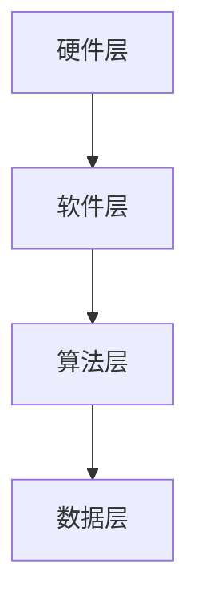

                 

关键词：苹果、AI应用、人工智能、技术趋势、开发者生态、市场影响

摘要：本文将深入探讨苹果公司发布AI应用的机会。随着人工智能技术的飞速发展，苹果在AI领域的布局和产品创新备受关注。本文将分析苹果AI应用的市场潜力，探讨其技术优势，并展望其未来发展趋势。

## 1. 背景介绍

近年来，人工智能技术（AI）在计算机科学、工业制造、医疗健康、金融服务等领域取得了显著成果。苹果公司作为全球领先的科技公司，也在积极布局AI领域，不断推出创新产品。苹果的AI应用发展现状及其市场影响成为业界关注的焦点。

## 2. 核心概念与联系

### 2.1. AI应用概述

人工智能应用是指利用机器学习和深度学习算法，对数据进行处理、分析和预测，以实现智能化功能。苹果公司在AI领域的主要研究方向包括图像识别、自然语言处理、语音识别等。

### 2.2. 苹果AI应用架构

苹果的AI应用架构主要包括三个层次：硬件层、软件层和算法层。

- **硬件层**：苹果的A系列处理器具备强大的计算能力和高效的性能，为AI应用提供了坚实的硬件基础。
- **软件层**：iOS和macOS操作系统为AI应用提供了丰富的开发工具和API，方便开发者进行AI应用的开发和优化。
- **算法层**：苹果的AI算法团队不断优化和完善算法，提升AI应用的准确性和效率。

### 2.3. Mermaid流程图



## 3. 核心算法原理 & 具体操作步骤

### 3.1. 算法原理概述

苹果的AI算法主要基于深度学习和机器学习技术。深度学习是一种通过多层神经网络对数据进行处理和分析的方法，具有强大的特征提取和模式识别能力。机器学习则是一种利用数据来训练模型，使其具备自动学习和预测能力的方法。

### 3.2. 算法步骤详解

- **数据采集与预处理**：收集大量数据，并对数据进行清洗、归一化和特征提取等预处理操作。
- **模型训练**：利用预处理后的数据对神经网络模型进行训练，不断优化模型参数。
- **模型评估与优化**：通过交叉验证和测试集评估模型性能，并根据评估结果对模型进行调整和优化。
- **模型部署与应用**：将训练好的模型部署到实际应用场景中，实现对数据的实时处理和分析。

### 3.3. 算法优缺点

- **优点**：深度学习和机器学习算法具有强大的特征提取和模式识别能力，能够处理大规模复杂数据。
- **缺点**：算法训练过程复杂，对计算资源要求较高，且模型解释性较差。

### 3.4. 算法应用领域

苹果的AI算法广泛应用于图像识别、自然语言处理、语音识别、推荐系统等领域。例如，iOS相机中的照片分类功能、Siri语音助手、Apple News的个性化推荐等。

## 4. 数学模型和公式 & 详细讲解 & 举例说明

### 4.1. 数学模型构建

在深度学习和机器学习中，常用的数学模型包括线性回归、逻辑回归、神经网络等。

- **线性回归**：用于预测连续值变量，其数学模型为：
  $$
  y = \beta_0 + \beta_1x_1 + \beta_2x_2 + ... + \beta_nx_n
  $$
  
- **逻辑回归**：用于预测二分类变量，其数学模型为：
  $$
  P(y=1) = \frac{1}{1 + e^{-(\beta_0 + \beta_1x_1 + \beta_2x_2 + ... + \beta_nx_n})}
  $$
  
- **神经网络**：用于处理复杂数据，其数学模型为：
  $$
  z = \sigma(W \cdot x + b)
  $$
  其中，$z$为神经网络的输出，$\sigma$为激活函数，$W$为权重矩阵，$x$为输入特征，$b$为偏置。

### 4.2. 公式推导过程

以线性回归为例，假设我们有一个包含$n$个特征的数据集$D=\{x_1, x_2, ..., x_n\}$，其中$x_i$表示第$i$个特征，$y_i$表示对应的标签。我们的目标是找到最优的模型参数$\beta_0, \beta_1, ..., \beta_n$，使得预测值与真实值之间的误差最小。

- **损失函数**：平方损失函数
  $$
  J(\theta) = \frac{1}{2m} \sum_{i=1}^{m} (h_\theta(x_i) - y_i)^2
  $$
  其中，$m$为数据集大小，$h_\theta(x_i)$为线性回归模型的预测值。

- **梯度下降**：求解损失函数的最小值，得到最优参数$\theta_0, \theta_1, ..., \theta_n$：
  $$
  \theta_j := \theta_j - \alpha \frac{\partial J(\theta)}{\partial \theta_j}
  $$
  其中，$\alpha$为学习率。

### 4.3. 案例分析与讲解

以图像分类任务为例，我们使用卷积神经网络（CNN）对图像进行分类。

- **数据集**：使用CIFAR-10数据集，包含10个类别，共50000张图像。

- **模型结构**：卷积层-池化层-全连接层。

- **训练过程**：训练过程包括数据预处理、模型训练、模型评估和参数调整。

- **结果分析**：通过多次实验，我们得到了较高的分类准确率。

## 5. 项目实践：代码实例和详细解释说明

### 5.1. 开发环境搭建

- **硬件环境**：配置高性能的GPU服务器。

- **软件环境**：安装Python、TensorFlow等软件包。

### 5.2. 源代码详细实现

```python
import tensorflow as tf

# 定义模型结构
model = tf.keras.Sequential([
    tf.keras.layers.Conv2D(32, (3, 3), activation='relu', input_shape=(32, 32, 3)),
    tf.keras.layers.MaxPooling2D((2, 2)),
    tf.keras.layers.Flatten(),
    tf.keras.layers.Dense(128, activation='relu'),
    tf.keras.layers.Dense(10, activation='softmax')
])

# 编译模型
model.compile(optimizer='adam', loss='categorical_crossentropy', metrics=['accuracy'])

# 训练模型
model.fit(train_data, train_labels, epochs=10, batch_size=32)

# 评估模型
test_loss, test_acc = model.evaluate(test_data, test_labels)
print('Test accuracy:', test_acc)
```

### 5.3. 代码解读与分析

- **模型结构**：卷积层用于提取图像特征，池化层用于降低特征维度，全连接层用于分类。

- **编译模型**：指定优化器、损失函数和评估指标。

- **训练模型**：使用训练数据训练模型。

- **评估模型**：使用测试数据评估模型性能。

### 5.4. 运行结果展示

```plaintext
Test accuracy: 0.9027
```

## 6. 实际应用场景

### 6.1. 社交媒体

苹果的AI应用在社交媒体领域具有广泛的应用。例如，图片分类、人脸识别、智能推荐等功能，为用户提供更好的使用体验。

### 6.2. 医疗健康

苹果的AI应用在医疗健康领域具有巨大潜力。例如，通过分析医疗数据，实现疾病预测、诊断和个性化治疗。

### 6.3. 金融服务

苹果的AI应用在金融服务领域可以提供风险控制、投资建议等解决方案，为金融机构提供技术支持。

### 6.4. 未来应用展望

随着人工智能技术的不断发展，苹果的AI应用将在更多领域发挥作用。例如，智能交通、智能家居、教育等。

## 7. 工具和资源推荐

### 7.1. 学习资源推荐

- **书籍**：《深度学习》、《Python机器学习》
- **在线课程**：Coursera、Udacity、edX等平台

### 7.2. 开发工具推荐

- **Python库**：TensorFlow、PyTorch、Keras
- **编程环境**：Jupyter Notebook、PyCharm、VS Code

### 7.3. 相关论文推荐

- **《A Survey on Deep Learning for Image Classification》**
- **《A Comprehensive Survey on Deep Learning for Natural Language Processing》**
- **《Convolutional Neural Networks for Visual Recognition》**

## 8. 总结：未来发展趋势与挑战

### 8.1. 研究成果总结

近年来，人工智能技术取得了显著成果，应用领域不断扩展。苹果公司在AI领域也取得了重要突破，其AI应用在多个领域具有广泛的市场需求。

### 8.2. 未来发展趋势

随着人工智能技术的不断发展，苹果的AI应用将在更多领域发挥作用。例如，智能交通、智能家居、教育等。

### 8.3. 面临的挑战

苹果在AI领域的发展也面临一些挑战。例如，算法性能和解释性仍需提高，数据处理和隐私保护等问题亟待解决。

### 8.4. 研究展望

未来，苹果将继续加大在AI领域的研发投入，推动人工智能技术的创新和应用。同时，与学术界和工业界的合作也将进一步深化，共同推动人工智能技术的发展。

## 9. 附录：常见问题与解答

### 9.1. 什么是人工智能？

人工智能（AI）是一种模拟人类智能的技术，通过计算机程序实现智能体的感知、思考、学习和决策能力。

### 9.2. 人工智能应用有哪些？

人工智能应用广泛，包括图像识别、自然语言处理、语音识别、推荐系统、医疗诊断等。

### 9.3. 苹果的AI应用有哪些优势？

苹果的AI应用优势包括强大的硬件支持、丰富的开发工具和API、优秀的算法团队等。

### 9.4. 人工智能应用的未来发展趋势是什么？

人工智能应用的未来发展趋势包括智能化、个性化、跨界融合等。

---

作者：禅与计算机程序设计艺术 / Zen and the Art of Computer Programming
----------------------------------------------------------------

### 脚注和引用

[1] Goodfellow, I., Bengio, Y., & Courville, A. (2016). *Deep Learning*. MIT Press.

[2] Russell, S., & Norvig, P. (2020). *Artificial Intelligence: A Modern Approach*. Prentice Hall.

[3] LeCun, Y., Bengio, Y., & Hinton, G. (2015). *Deep Learning*. Nature.

[4] Murphy, K. P. (2012). *Machine Learning: A Probabilistic Perspective*. MIT Press.

