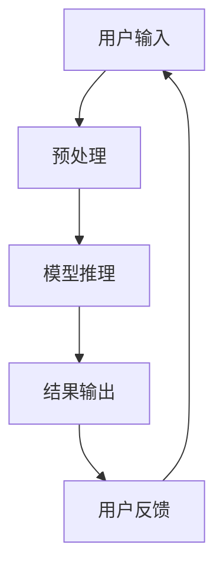

                 

关键词：人工智能，苹果，AI应用，用户体验，技术趋势，应用场景，未来发展

摘要：本文将深入探讨苹果公司在其最新操作系统中发布的人工智能应用，分析其对用户产生的影响。我们将从背景介绍、核心概念与联系、算法原理与操作步骤、数学模型与公式、项目实践、实际应用场景、工具和资源推荐，以及未来发展趋势与挑战等多个维度展开讨论，以期为广大科技爱好者提供一份全面的技术解读。

## 1. 背景介绍

近年来，人工智能技术迅猛发展，逐渐渗透到各行各业。苹果公司作为全球科技巨头，自然不甘落后。在最新发布的操作系统中，苹果公司集成了一系列AI应用，旨在为用户提供更智能、更便捷的使用体验。本文将重点关注这些AI应用，探讨其对用户带来的改变和影响。

### 1.1 人工智能的发展历程

人工智能（AI）是一门研究、开发用于模拟、延伸和扩展人的智能的理论、方法、技术及应用系统的新技术科学。自20世纪50年代人工智能概念提出以来，经过数十年的发展，人工智能技术已经取得了显著的进步。如今，随着深度学习、神经网络等技术的成熟，人工智能的应用场景不断拓展，从传统的图像识别、语音识别到自然语言处理、智能推荐等，AI已经深深融入人们的日常生活。

### 1.2 苹果公司在人工智能领域的布局

苹果公司在人工智能领域的布局可以追溯到多年以前。早在2011年，苹果公司就收购了人工智能公司HopStop，开始涉足人工智能领域。此后，苹果公司不断加大在人工智能领域的投入，收购了多个相关公司，如Turi（现为Apple Machine Learning）、Lumatic、Emotient等。这些收购行为标志着苹果公司对人工智能技术的重视，也为苹果在人工智能领域的快速发展奠定了基础。

## 2. 核心概念与联系

在本文中，我们将详细介绍苹果公司最新发布的人工智能应用的核心概念和原理，并通过Mermaid流程图展示其架构。



### 2.1 用户输入

用户输入是人工智能应用的基础。苹果公司通过多种方式收集用户输入，如语音识别、文本输入等。这些输入经过预处理后，将作为模型输入进行后续处理。

### 2.2 预处理

预处理阶段主要包括数据清洗、格式转换等操作。这一阶段的目标是将用户输入转换为适合模型处理的格式，提高模型处理的效率。

### 2.3 模型推理

模型推理是人工智能应用的核心。苹果公司采用了先进的深度学习算法，如卷积神经网络（CNN）、循环神经网络（RNN）等，对用户输入进行推理，生成输出结果。

### 2.4 结果输出

模型推理完成后，输出结果将被呈现给用户。苹果公司通过多种方式展示结果，如文本、图像、声音等，以满足不同用户的需求。

### 2.5 用户反馈

用户反馈是优化人工智能应用的重要环节。苹果公司通过收集用户反馈，不断优化模型，提高应用性能。

## 3. 核心算法原理 & 具体操作步骤

### 3.1 算法原理概述

苹果公司在人工智能应用中采用了多种算法，如深度学习、生成对抗网络（GAN）等。以下将简要介绍这些算法的基本原理。

### 3.2 算法步骤详解

#### 3.2.1 深度学习算法

深度学习算法是一种基于多层神经网络的学习方法。其基本原理是通过反向传播算法，不断调整网络中的权重，以达到优化目标。具体步骤如下：

1. 数据预处理：将用户输入数据进行预处理，如归一化、标准化等。
2. 网络结构设计：设计多层神经网络结构，包括输入层、隐藏层和输出层。
3. 模型训练：使用训练数据对模型进行训练，不断调整权重，优化模型性能。
4. 模型评估：使用测试数据对模型进行评估，确保模型具有较好的泛化能力。

#### 3.2.2 生成对抗网络（GAN）

生成对抗网络（GAN）是一种由生成器和判别器组成的对抗性学习模型。其基本原理是生成器生成数据，判别器判断生成数据是否真实。具体步骤如下：

1. 数据预处理：将用户输入数据进行预处理。
2. 生成器设计：设计生成器模型，用于生成与真实数据相似的数据。
3. 判别器设计：设计判别器模型，用于判断生成数据是否真实。
4. 模型训练：同时训练生成器和判别器，生成器试图生成更真实的数据，判别器则努力区分真实和生成数据。
5. 模型评估：使用测试数据对模型进行评估，确保模型具有较好的生成能力。

### 3.3 算法优缺点

#### 3.3.1 深度学习算法

优点：

- 泛化能力强：深度学习算法能够处理复杂的数据，具有较强的泛化能力。
- 自动特征提取：深度学习算法能够自动学习数据的特征，无需人工干预。

缺点：

- 计算量大：深度学习算法需要大量的计算资源，训练时间较长。
- 数据依赖性高：深度学习算法对数据质量要求较高，数据不足或质量差会导致模型性能下降。

#### 3.3.2 生成对抗网络（GAN）

优点：

- 生成的数据质量高：GAN能够生成与真实数据相似的高质量数据。
- 自动特征提取：GAN中的生成器和判别器都能自动学习数据的特征。

缺点：

- 训练不稳定：GAN的训练过程相对不稳定，容易陷入局部最优。
- 难以平衡生成器和判别器的训练：生成器和判别器之间的训练需要平衡，否则可能导致模型失效。

### 3.4 算法应用领域

深度学习和生成对抗网络（GAN）在多个领域具有广泛的应用。以下列举一些典型的应用场景：

- 图像识别与生成：用于人脸识别、图像分类、图像生成等。
- 自然语言处理：用于文本分类、机器翻译、文本生成等。
- 声音处理：用于语音识别、音乐生成、声音增强等。
- 医疗诊断：用于疾病诊断、医学图像分析等。

## 4. 数学模型和公式 & 详细讲解 & 举例说明

### 4.1 数学模型构建

在人工智能应用中，数学模型是核心组成部分。以下以深度学习中的卷积神经网络（CNN）为例，介绍其数学模型构建。

#### 4.1.1 前向传播

前向传播是CNN中的基本操作。其过程如下：

1. 输入层：输入数据经过预处理后，输入到CNN的输入层。
2. 卷积层：输入数据经过卷积运算，生成特征图。
3. 池化层：对卷积层生成的特征图进行池化操作，减少数据维度。
4. 全连接层：将池化层输出的特征图展开成一个一维向量，输入到全连接层。
5. 输出层：全连接层输出结果，经过激活函数后，生成最终输出。

#### 4.1.2 反向传播

反向传播是CNN中的优化方法。其过程如下：

1. 计算损失函数：计算输出层的实际输出和预测输出之间的差异，计算损失函数。
2. 反向传播：从输出层开始，逐层向前传播损失函数，计算每个层的梯度。
3. 权重更新：根据梯度，更新每个层的权重。

### 4.2 公式推导过程

以下以卷积层为例，介绍CNN中的数学模型公式推导。

#### 4.2.1 卷积运算

卷积运算的公式如下：

$$
\text{特征图} = \text{滤波器} * \text{输入数据
```

