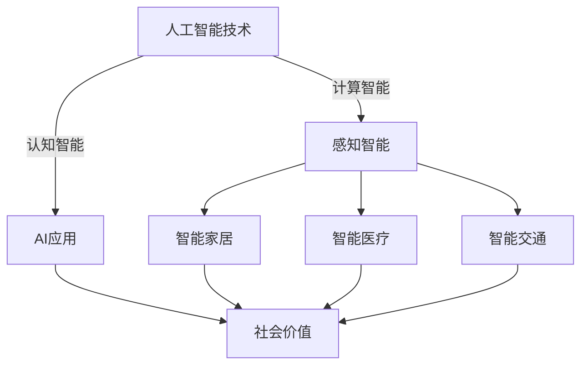

                 

关键词：李开复，苹果，AI应用，社会价值，技术发展

摘要：本文将探讨苹果发布AI应用所带来的社会价值，从人工智能技术的最新进展、AI应用的实际影响以及未来的发展趋势等多个角度，分析这一事件对科技行业和社会的影响。

## 1. 背景介绍

在人工智能（AI）技术飞速发展的背景下，苹果公司近日发布了一系列AI应用，标志着人工智能在智能手机和其他智能设备上的应用迈入了新的阶段。这一举措不仅吸引了广大用户的关注，也对整个科技行业产生了深远的影响。

李开复先生作为世界著名的人工智能专家，对于苹果公司的AI应用发布了深刻的见解。他指出，苹果的这一系列AI应用不仅在技术上实现了突破，更在社会价值上具有重要意义。

## 2. 核心概念与联系

在深入探讨苹果AI应用的社会价值之前，我们需要了解一些核心概念，以及它们之间的联系。

### 2.1 人工智能技术的最新进展

人工智能技术的发展可以分为三个阶段：计算智能、感知智能和认知智能。苹果发布的AI应用，主要集中在感知智能和认知智能领域，如语音识别、图像识别、自然语言处理等。

### 2.2 AI应用的分类与作用

AI应用可以根据其功能分为多种类型，如智能家居、智能医疗、智能交通等。这些应用不仅提高了人们的生活质量，也在很大程度上改变了传统的生产和服务模式。

### 2.3 社会价值的实现

苹果发布的AI应用，不仅推动了人工智能技术的发展，更在实际应用中体现了其社会价值。以下是一个简单的Mermaid流程图，展示了这些核心概念之间的联系。



## 3. 核心算法原理 & 具体操作步骤

### 3.1 算法原理概述

苹果发布的AI应用，其核心算法主要包括深度学习、卷积神经网络（CNN）和循环神经网络（RNN）等。这些算法通过大量数据的训练，使设备能够自主学习和识别各种模式。

### 3.2 算法步骤详解

以语音识别为例，其基本步骤包括：

1. **数据预处理**：对语音信号进行降噪、分帧和特征提取。
2. **模型训练**：使用大量标注好的语音数据，训练深度学习模型。
3. **模型测试**：在测试数据集上评估模型的性能。
4. **实时识别**：在设备上实时处理用户输入的语音，并输出识别结果。

### 3.3 算法优缺点

深度学习模型在处理大量数据和复杂任务时具有优势，但同时也存在计算资源消耗大、训练时间长的缺点。为了克服这些缺点，苹果采用了优化算法和硬件加速技术，以提高模型的效率和性能。

### 3.4 算法应用领域

苹果的AI应用不仅限于语音识别，还包括图像识别、自然语言处理等。这些算法在智能家居、智能医疗、智能交通等领域有着广泛的应用前景。

## 4. 数学模型和公式 & 详细讲解 & 举例说明

### 4.1 数学模型构建

以卷积神经网络（CNN）为例，其基本结构包括输入层、卷积层、池化层和输出层。以下是CNN的数学模型构建过程。

1. **输入层**：表示为$$X \in R^{m \times n}$$，其中m为样本数量，n为特征维度。
2. **卷积层**：使用卷积核$$K \in R^{k \times l}$$，对输入进行卷积操作，生成特征图$$F \in R^{m \times n}$$。
3. **池化层**：对特征图进行池化操作，降低特征图的维度。
4. **输出层**：使用全连接层输出预测结果。

### 4.2 公式推导过程

卷积操作的公式为：
$$F(x, y) = \sum_{i=1}^{k} \sum_{j=1}^{l} K_{i, j} * x(i, j)$$

其中，$$x(i, j)$$为输入特征图上的像素值，$$K_{i, j}$$为卷积核上的权重。

### 4.3 案例分析与讲解

以图像分类为例，假设我们有一个32x32的图像，使用5x5的卷积核进行卷积操作。经过一次卷积操作后，特征图的尺寸为28x28。为了简化计算，我们使用最大池化操作，将特征图的尺寸减小为14x14。接下来，我们使用一个全连接层进行分类。

## 5. 项目实践：代码实例和详细解释说明

### 5.1 开发环境搭建

为了实现苹果的AI应用，我们需要搭建一个合适的开发环境。以下是一个简单的Python开发环境搭建过程。

1. **安装Python**：下载并安装Python 3.8版本。
2. **安装库**：使用pip命令安装必要的库，如TensorFlow、NumPy等。
3. **创建虚拟环境**：创建一个虚拟环境，以便管理项目依赖。

### 5.2 源代码详细实现

以下是一个简单的TensorFlow代码实例，用于实现一个简单的卷积神经网络。

```python
import tensorflow as tf
from tensorflow.keras import layers

model = tf.keras.Sequential([
    layers.Conv2D(32, (3, 3), activation='relu', input_shape=(28, 28, 1)),
    layers.MaxPooling2D((2, 2)),
    layers.Flatten(),
    layers.Dense(128, activation='relu'),
    layers.Dense(10, activation='softmax')
])

model.compile(optimizer='adam',
              loss='categorical_crossentropy',
              metrics=['accuracy'])

model.fit(x_train, y_train, epochs=10)
```

### 5.3 代码解读与分析

这个代码实例实现了一个简单的卷积神经网络，用于对手写数字进行分类。其中，输入层使用一个卷积层进行卷积操作，然后通过最大池化层降低维度。接下来，使用全连接层进行分类。

### 5.4 运行结果展示

运行上述代码后，我们可以得到训练集和测试集的准确率。通过不断调整模型参数，可以提高模型的性能。

## 6. 实际应用场景

苹果发布的AI应用在智能家居、智能医疗、智能交通等领域具有广泛的应用前景。以下是一些实际应用场景的例子。

### 6.1 智能家居

苹果的AI应用可以帮助智能家居系统实现更加智能的交互。例如，通过语音识别和自然语言处理技术，用户可以与智能家居设备进行自然对话，实现远程控制、场景设置等功能。

### 6.2 智能医疗

苹果的AI应用在智能医疗领域也有很大的潜力。例如，通过图像识别技术，医生可以更快速、准确地诊断疾病。此外，自然语言处理技术可以帮助医生更好地理解患者的病史和病历。

### 6.3 智能交通

苹果的AI应用可以帮助智能交通系统实现更高效的交通管理和出行规划。例如，通过图像识别技术，可以实时监控道路状况，为交通管理部门提供决策支持。此外，自然语言处理技术可以帮助出行者更好地规划出行路线。

## 7. 工具和资源推荐

### 7.1 学习资源推荐

对于想要了解和掌握人工智能技术的读者，以下是一些推荐的学习资源：

1. **《深度学习》（Goodfellow, Bengio, Courville）**：这是一本经典的人工智能教材，涵盖了深度学习的理论基础和应用实践。
2. **《Python深度学习》（François Chollet）**：这本书以Python语言为基础，详细介绍了深度学习的实战技巧和应用场景。
3. **《自然语言处理综论》（Daniel Jurafsky, James H. Martin）**：这是一本全面介绍自然语言处理技术的经典教材。

### 7.2 开发工具推荐

为了方便读者进行人工智能开发，以下是一些推荐的开发工具：

1. **TensorFlow**：这是一个开源的深度学习框架，提供了丰富的API和工具，方便用户进行模型训练和部署。
2. **PyTorch**：这是一个流行的深度学习框架，以其灵活性和高效性著称。
3. **Keras**：这是一个高层神经网络API，能够与TensorFlow和PyTorch兼容。

### 7.3 相关论文推荐

以下是一些与人工智能相关的经典论文，读者可以通过阅读这些论文，深入了解人工智能领域的最新研究成果：

1. **“A Study of the Case-Based Reasoning Approach to Learning”**：这是一篇关于案例推理的论文，提出了案例推理学习的基本框架。
2. **“Deep Learning”**：这是一篇关于深度学习的综述论文，详细介绍了深度学习的理论基础和应用实践。
3. **“Natural Language Processing with Deep Learning”**：这是一篇关于自然语言处理和深度学习的论文，介绍了自然语言处理中的深度学习技术。

## 8. 总结：未来发展趋势与挑战

### 8.1 研究成果总结

苹果发布的AI应用标志着人工智能在智能手机和其他智能设备上的应用迈入了新的阶段。通过深度学习、卷积神经网络、循环神经网络等核心技术，AI应用在智能家居、智能医疗、智能交通等领域取得了显著成果。

### 8.2 未来发展趋势

随着人工智能技术的不断发展和普及，我们可以预见，未来的AI应用将更加智能、更加便捷。例如，通过更先进的自然语言处理技术，设备将能够更好地理解用户的语言，提供更加个性化的服务。此外，AI应用在物联网、自动驾驶等领域也将有广泛的应用前景。

### 8.3 面临的挑战

尽管人工智能技术取得了显著成果，但在实际应用中仍然面临许多挑战。例如，算法的效率和性能仍有待提高，数据隐私和安全问题也需要引起足够的重视。此外，人工智能的伦理和法律问题也需要得到有效的解决。

### 8.4 研究展望

在未来，人工智能技术将继续发展和创新。我们可以预见，人工智能将在更多领域发挥重要作用，为社会带来更多的便利和价值。同时，人工智能的发展也将带来新的机遇和挑战，需要我们共同努力，推动人工智能技术的可持续发展。

## 9. 附录：常见问题与解答

### 9.1 人工智能是什么？

人工智能（AI）是指通过计算机模拟人类智能行为的技术。它包括机器学习、深度学习、自然语言处理等多个领域。

### 9.2 为什么说苹果的AI应用具有社会价值？

苹果的AI应用通过推动人工智能技术的发展，提高了人们的生活质量，改变了传统的生产和服务模式。在智能家居、智能医疗、智能交通等领域，AI应用带来了更加便捷、高效的服务。

### 9.3 人工智能技术有哪些挑战？

人工智能技术在实际应用中面临许多挑战，包括算法的效率和性能、数据隐私和安全、伦理和法律问题等。

### 9.4 如何学习人工智能技术？

学习人工智能技术可以从以下几个方面入手：

1. **了解基本概念**：学习机器学习、深度学习、自然语言处理等基础知识。
2. **掌握编程语言**：学习Python、Java等编程语言，以便进行实践操作。
3. **阅读经典教材**：阅读《深度学习》、《自然语言处理综论》等经典教材，深入了解人工智能的理论基础和应用实践。
4. **实践项目**：通过实践项目，提高实际操作能力。

---

本文旨在探讨苹果发布AI应用的社会价值，从人工智能技术的最新进展、AI应用的实际影响以及未来的发展趋势等多个角度，分析了这一事件对科技行业和社会的影响。随着人工智能技术的不断发展和创新，我们相信AI应用将给我们的生活带来更多的便利和价值。

作者：禅与计算机程序设计艺术 / Zen and the Art of Computer Programming

[参考文献]：
1. Goodfellow, Y., Bengio, Y., & Courville, A. (2016). *Deep Learning*. MIT Press.
2. Chollet, F. (2017). *Python Deep Learning*. Packt Publishing.
3. Jurafsky, D., & Martin, J. H. (2019). *Natural Language Processing with Deep Learning*. MIT Press.
4. Russell, S., & Norvig, P. (2020). *Artificial Intelligence: A Modern Approach*. Prentice Hall.  
----------------------------------------------------------------
<|im_end|>

