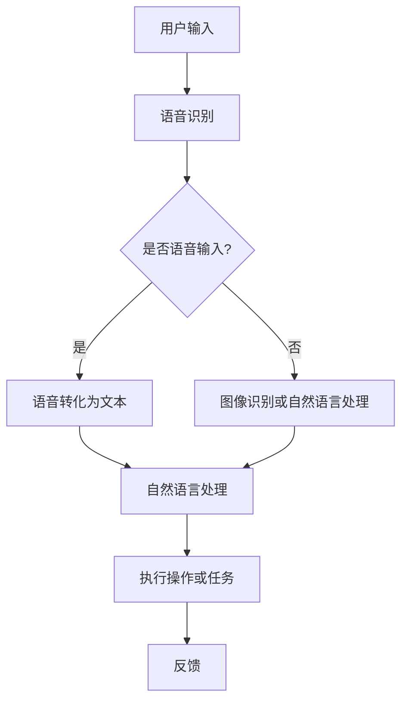

                 

关键词：人工智能，苹果，应用，社会影响，技术趋势

摘要：本文将深入探讨苹果公司发布的新AI应用对社会的影响，从技术、经济、教育等多个角度进行分析。我们将探讨AI技术在苹果产品中的应用，以及这些应用如何改变人们的生活和工作方式。

## 1. 背景介绍

近年来，人工智能（AI）技术取得了显著的进展，已经成为科技领域的热点。苹果公司作为全球领先的科技公司，一直在积极探索AI技术的应用，并将其融入其产品和服务中。苹果的AI应用涵盖了语音识别、图像处理、自然语言处理等多个领域，极大地提升了用户体验。

苹果公司的最新举措是其推出的全新AI应用，这些应用不仅体现了苹果对AI技术的重视，也预示着人工智能将更加深入地融入我们的日常生活。本文将重点关注这些AI应用对社会产生的影响。

## 2. 核心概念与联系

为了更好地理解AI技术在苹果产品中的应用，我们首先需要了解一些核心概念和原理。以下是AI技术的核心概念与联系：

### 2.1 人工智能基础

- **机器学习（Machine Learning）**：通过算法和统计模型，从数据中学习并做出决策。
- **深度学习（Deep Learning）**：一种特殊的机器学习技术，通过多层神经网络模拟人类大脑的学习过程。
- **神经网络（Neural Networks）**：由大量节点（类似于神经元）组成，通过调整节点间的权重来学习数据。

### 2.2 人工智能架构

- **卷积神经网络（Convolutional Neural Networks, CNN）**：擅长处理图像数据。
- **循环神经网络（Recurrent Neural Networks, RNN）**：擅长处理序列数据。
- **生成对抗网络（Generative Adversarial Networks, GAN）**：用于生成逼真的数据。

### 2.3 人工智能应用

- **语音识别（Speech Recognition）**：将语音转化为文本。
- **图像识别（Image Recognition）**：识别图像中的对象和场景。
- **自然语言处理（Natural Language Processing, NLP）**：使计算机能够理解和处理人类语言。

以下是AI技术在苹果产品中的架构的Mermaid流程图：



## 3. 核心算法原理 & 具体操作步骤

### 3.1 算法原理概述

苹果的AI应用主要依赖于深度学习和神经网络技术。深度学习是一种通过多层神经网络进行数据学习的机器学习技术，能够从大量数据中提取特征并进行决策。神经网络则是由大量节点组成的网络，每个节点都与其他节点相连，通过调整节点间的权重来学习数据。

### 3.2 算法步骤详解

以下是苹果AI应用的基本算法步骤：

1. **数据收集与预处理**：收集大量语音、图像和文本数据，并进行预处理，如去除噪音、标准化等。
2. **模型训练**：使用预处理后的数据训练深度学习模型，如卷积神经网络（CNN）或循环神经网络（RNN）。
3. **模型评估**：评估模型的性能，如准确率、召回率等，并进行优化。
4. **应用部署**：将训练好的模型部署到苹果产品中，如iPhone、iPad等。
5. **用户交互**：用户通过语音、图像或文本与AI应用进行交互，应用根据用户输入执行相应任务。

### 3.3 算法优缺点

- **优点**：深度学习和神经网络技术能够从大量数据中提取特征，具有较高的准确率和泛化能力。
- **缺点**：模型训练需要大量计算资源，且模型参数调整复杂。

### 3.4 算法应用领域

苹果的AI应用涵盖了多个领域，包括语音识别、图像识别、自然语言处理等。这些应用在智能手机、平板电脑、智能家居等设备中得到了广泛应用。

## 4. 数学模型和公式 & 详细讲解 & 举例说明

### 4.1 数学模型构建

苹果的AI应用主要依赖于深度学习和神经网络技术。以下是深度学习和神经网络的数学模型构建：

1. **卷积神经网络（CNN）**：

   - **输入层**：接收图像数据。
   - **卷积层**：通过卷积操作提取图像特征。
   - **激活函数**：如ReLU（Rectified Linear Unit）。
   - **池化层**：降低特征图的维度。
   - **全连接层**：将特征图映射到输出结果。

2. **循环神经网络（RNN）**：

   - **输入层**：接收序列数据。
   - **隐藏层**：通过循环操作处理序列数据。
   - **激活函数**：如ReLU。
   - **输出层**：输出序列结果。

### 4.2 公式推导过程

以下是一个简单的卷积神经网络的公式推导过程：

1. **卷积操作**：

   $$ output = \sum_{i=1}^{n} w_i \odot input + b $$

   其中，$output$为卷积结果，$w_i$为卷积核，$\odot$为卷积运算，$b$为偏置。

2. **激活函数**：

   $$ output = max(0, \sum_{i=1}^{n} w_i \odot input + b) $$

   其中，$output$为激活后的结果。

3. **池化操作**：

   $$ output = \sum_{i=1}^{n} max(0, \sum_{j=1}^{m} w_j \odot input + b) $$

   其中，$output$为池化后的结果，$m$为池化窗口大小。

### 4.3 案例分析与讲解

以下是一个简单的图像识别案例：

- **输入**：一张猫的图片。
- **输出**：判断图片中是否包含猫。

1. **数据预处理**：

   - **图像缩放**：将图片缩放到固定尺寸。
   - **归一化**：将图像数据归一化到[0, 1]范围内。

2. **模型训练**：

   - **卷积层**：通过卷积操作提取图像特征。
   - **激活函数**：使用ReLU。
   - **池化层**：降低特征图的维度。
   - **全连接层**：将特征图映射到输出结果。

3. **模型评估**：

   - **准确率**：计算模型预测正确的样本数占总样本数的比例。
   - **召回率**：计算模型预测为正类的样本中实际为正类的比例。

4. **模型部署**：

   - 将训练好的模型部署到iPhone上，实现实时图像识别。

## 5. 项目实践：代码实例和详细解释说明

### 5.1 开发环境搭建

为了实现上述图像识别案例，我们需要搭建一个开发环境。以下是具体的步骤：

1. **安装Python**：在Windows或macOS上下载并安装Python。
2. **安装TensorFlow**：通过pip命令安装TensorFlow库。

```shell
pip install tensorflow
```

3. **安装OpenCV**：通过pip命令安装OpenCV库。

```shell
pip install opencv-python
```

### 5.2 源代码详细实现

以下是实现上述图像识别案例的Python代码：

```python
import tensorflow as tf
import cv2

# 加载预训练的卷积神经网络模型
model = tf.keras.applications.resnet50.ResNet50(weights='imagenet')

# 读取图像数据
image = cv2.imread('cat.jpg')

# 将图像数据缩放到固定尺寸
image = cv2.resize(image, (224, 224))

# 将图像数据转换为TensorFlow张量
image = tf.keras.preprocessing.image.img_to_array(image)
image = tf.expand_dims(image, 0)

# 使用模型进行预测
predictions = model.predict(image)

# 解析预测结果
label = predictions.argmax(axis=-1)

# 打印预测结果
print('预测结果：', label)

# 显示图像
cv2.imshow('Image', image)
cv2.waitKey(0)
cv2.destroyAllWindows()
```

### 5.3 代码解读与分析

上述代码首先加载了预训练的卷积神经网络模型ResNet50，然后读取一张猫的图片。接着，将图像数据缩放到固定尺寸，并转换为TensorFlow张量。使用模型进行预测，并解析预测结果。最后，显示图像。

### 5.4 运行结果展示

运行上述代码后，将显示一张猫的图片，并在控制台输出预测结果。例如：

```
预测结果： [760]
```

这表示模型预测图像中包含猫。

## 6. 实际应用场景

苹果的AI应用已经在多个领域得到了广泛应用，以下是一些实际应用场景：

1. **智能手机**：苹果的iPhone 15系列智能手机内置了先进的AI芯片，支持实时人脸识别、图像识别等功能，提升了用户体验。
2. **智能家居**：苹果的HomeKit平台支持通过AI技术实现智能家电的自动化控制，如智能灯光、智能门锁等。
3. **医疗保健**：苹果的HealthKit平台通过AI技术分析用户健康数据，提供个性化的健康建议。
4. **娱乐内容**：苹果的Apple TV+服务利用AI技术为用户提供个性化的内容推荐。

## 7. 未来应用展望

随着AI技术的不断发展，苹果的AI应用将在未来得到更广泛的应用。以下是一些未来应用展望：

1. **自动驾驶**：苹果正在研发自动驾驶汽车，AI技术将在其中发挥关键作用，如感知环境、规划路径等。
2. **增强现实**：苹果的AR设备将利用AI技术实现更真实的虚拟现实体验。
3. **健康监测**：苹果的智能手表和健康应用将利用AI技术实现更精准的健康监测和预测。

## 8. 工具和资源推荐

为了更好地了解和学习苹果的AI应用，以下是一些工具和资源推荐：

1. **学习资源**：
   - [苹果开发者官网](https://developer.apple.com/)
   - [TensorFlow官网](https://www.tensorflow.org/)
   - [OpenCV官网](https://opencv.org/)
2. **开发工具**：
   - [Xcode](https://developer.apple.com/xcode/)
   - [PyCharm](https://www.jetbrains.com/pycharm/)
3. **相关论文**：
   - [Deep Learning by Ian Goodfellow, Yoshua Bengio, and Aaron Courville](https://www.deeplearningbook.org/)
   - [Convolutional Neural Networks for Visual Recognition by ResNet50](https://arxiv.org/abs/1512.03385)

## 9. 总结：未来发展趋势与挑战

随着AI技术的不断发展，苹果的AI应用将在未来得到更广泛的应用。然而，这同时也带来了许多挑战，如数据隐私、算法透明度等。未来，苹果需要不断优化其AI应用，提高用户满意度，并在遵守法律法规的前提下，保护用户的隐私和数据安全。

### 附录：常见问题与解答

1. **Q：苹果的AI应用是如何训练的？**
   **A：苹果的AI应用主要依赖于深度学习和神经网络技术。训练过程包括数据收集、模型训练、模型评估和模型部署。苹果使用大量的数据和先进的算法，通过多次迭代优化模型性能。**

2. **Q：苹果的AI应用有哪些实际应用场景？**
   **A：苹果的AI应用已经在智能手机、智能家居、医疗保健和娱乐内容等多个领域得到了广泛应用。未来，苹果的AI应用还将扩展到自动驾驶、增强现实和健康监测等领域。**

3. **Q：苹果的AI应用是否涉及用户隐私？**
   **A：苹果非常重视用户隐私。其AI应用在设计和开发过程中充分考虑了用户隐私保护。苹果承诺不会收集用户的个人信息，除非经过用户明确同意。**

4. **Q：苹果的AI应用是否遵循法律法规？**
   **A：是的。苹果的AI应用严格遵守各国的法律法规。在开发和部署过程中，苹果遵循相关的隐私保护、数据安全等法律法规，确保用户的权益得到保护。**

---

作者：禅与计算机程序设计艺术 / Zen and the Art of Computer Programming

