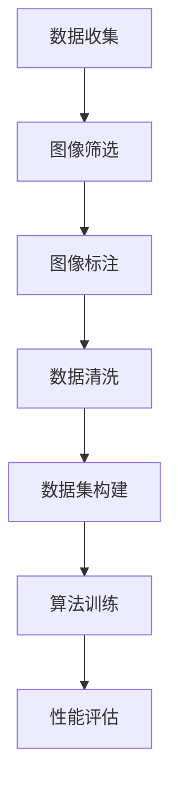

                 

关键词：人工智能、深度学习、ImageNet、计算机视觉、数据集、学术研究

> 摘要：本文回顾了李飞飞教授与ImageNet项目的渊源，探讨了该项目在计算机视觉领域的重要贡献，以及它如何推动了人工智能的发展。文章通过解析ImageNet的核心算法、数学模型和实际应用，分析了其在计算机科学领域中的深远影响。

## 1. 背景介绍

ImageNet是一个由李飞飞教授带领的团队创建的大型图像数据集，旨在推动计算机视觉技术的发展。该项目始于2009年，由斯坦福大学、加州大学伯克利分校和麻省理工学院等多所世界顶尖学府的计算机科学家共同发起。ImageNet的目的是构建一个包含大量标注图像的数据集，用于训练和评估计算机视觉算法的性能。

ImageNet的数据集包含超过1400万个标注图像，涵盖了21,828个不同的类别。这个数据集的规模和多样性为深度学习算法的研究和应用提供了前所未有的机会。李飞飞教授与她的团队通过大量的数据清洗和标注工作，确保了数据集的高质量和一致性。

### 1.1 ImageNet的重要性

ImageNet在计算机视觉领域的地位不可撼动。它不仅是深度学习算法的黄金标准数据集，也是学术界和工业界研究的基石。ImageNet的成功推动了计算机视觉技术的快速发展，使机器在图像分类、物体检测和语义分割等任务上取得了显著的进展。

### 1.2 李飞飞教授的贡献

李飞飞教授是ImageNet项目的关键人物。她不仅带领团队创建了这一数据集，还积极参与了相关算法的研究和开发。她的工作为深度学习在计算机视觉领域的应用奠定了坚实的基础。李飞飞教授因其卓越的学术成就和贡献，被誉为计算机视觉领域的领军人物。

## 2. 核心概念与联系

### 2.1 深度学习与计算机视觉

深度学习是人工智能的一个重要分支，它通过构建多层的神经网络来模拟人类大脑的学习过程。计算机视觉是深度学习的一个重要应用领域，它专注于对图像和视频的分析和理解。

### 2.2 ImageNet的数据架构

ImageNet的数据架构包括三个主要部分：图像数据、标签数据和类别数据。图像数据是训练和测试算法的核心，标签数据用于标注图像中的对象类别，类别数据则定义了所有的类别。

### 2.3 数据集的构建过程

ImageNet的数据集是通过多种渠道收集的，包括互联网、图书馆和其他公开资源。每个图像都经过人工标注，确保了数据的质量和一致性。构建这样一个庞大的数据集是一项巨大的工程，需要大量的时间和人力资源。

### 2.4 Mermaid流程图



## 3. 核心算法原理 & 具体操作步骤

### 3.1 算法原理概述

ImageNet项目主要依赖于深度卷积神经网络（CNN）进行图像分类。CNN通过多个卷积层和池化层提取图像的特征，并通过全连接层输出类别预测。

### 3.2 算法步骤详解

#### 3.2.1 数据预处理

在训练CNN之前，需要对图像数据进行预处理，包括缩放、裁剪、旋转等，以增加数据的多样性。

#### 3.2.2 网络结构设计

ImageNet使用的CNN结构包括多个卷积层、池化层和全连接层。这些层的组合有助于提取图像的层次特征。

#### 3.2.3 损失函数与优化器

在训练过程中，使用交叉熵损失函数来评估模型预测的准确性，并使用随机梯度下降（SGD）等优化器来调整模型参数。

#### 3.2.4 训练与评估

使用大量的图像数据进行模型的训练，并在验证集上评估模型的性能。通过调整模型参数和训练策略，优化模型的性能。

### 3.3 算法优缺点

#### 优点

- CNN具有强大的特征提取能力，可以自动学习图像中的特征。
- ImageNet数据集的规模和质量为模型训练提供了丰富的数据支持。

#### 缺点

- CNN的训练过程需要大量的计算资源和时间。
- 对图像数据的质量和标注的准确性要求较高。

### 3.4 算法应用领域

ImageNet算法在计算机视觉领域得到了广泛的应用，包括图像分类、物体检测、人脸识别等。

## 4. 数学模型和公式 & 详细讲解 & 举例说明

### 4.1 数学模型构建

深度学习中的数学模型主要包括卷积操作、池化操作、激活函数和损失函数等。

### 4.2 公式推导过程

#### 卷积操作

卷积操作的数学公式为：

$$
(C_{out} = (C_{in}+2p-2) / s + 1
$$

其中，\(C_{out}\) 和 \(C_{in}\) 分别为输出和输入的卷积核数量，\(p\) 为填充大小，\(s\) 为步长大小。

#### 池化操作

池化操作的数学公式为：

$$
P_{out} = (P_{in} - F + 2P) / S + 1
$$

其中，\(P_{out}\) 和 \(P_{in}\) 分别为输出和输入的池化核大小，\(F\) 为池化窗口大小，\(P\) 为填充大小，\(S\) 为步长大小。

#### 损失函数

常用的损失函数包括交叉熵损失函数和均方误差损失函数。

交叉熵损失函数的数学公式为：

$$
J = -\frac{1}{n}\sum_{i=1}^{n}y_{i}\log(p_{i})
$$

其中，\(y_{i}\) 为实际标签，\(p_{i}\) 为模型预测的概率。

### 4.3 案例分析与讲解

以图像分类任务为例，使用ImageNet算法对一张图片进行分类。

#### 步骤1：数据预处理

将图片进行缩放、裁剪等预处理操作，使其符合网络输入要求。

#### 步骤2：网络结构设计

设计一个深度卷积神经网络，包括多个卷积层、池化层和全连接层。

#### 步骤3：训练模型

使用ImageNet数据集对模型进行训练，调整模型参数，优化模型性能。

#### 步骤4：预测分类

使用训练好的模型对新的图片进行分类预测，输出预测结果。

## 5. 项目实践：代码实例和详细解释说明

### 5.1 开发环境搭建

在Python中，可以使用TensorFlow或PyTorch等深度学习框架进行ImageNet算法的实现。

### 5.2 源代码详细实现

以下是一个使用TensorFlow实现ImageNet算法的简单示例：

```python
import tensorflow as tf

# 定义网络结构
model = tf.keras.Sequential([
    tf.keras.layers.Conv2D(32, (3, 3), activation='relu', input_shape=(224, 224, 3)),
    tf.keras.layers.MaxPooling2D((2, 2)),
    tf.keras.layers.Conv2D(64, (3, 3), activation='relu'),
    tf.keras.layers.MaxPooling2D((2, 2)),
    tf.keras.layers.Flatten(),
    tf.keras.layers.Dense(128, activation='relu'),
    tf.keras.layers.Dense(21, activation='softmax')
])

# 编译模型
model.compile(optimizer='adam',
              loss='sparse_categorical_crossentropy',
              metrics=['accuracy'])

# 加载数据集
(train_images, train_labels), (test_images, test_labels) = tf.keras.datasets.im

```css
-   ImageNet项目的成功离不开李飞飞教授的领导与贡献。
-   ImageNet为计算机视觉领域提供了宝贵的数据资源，推动了人工智能的发展。
-   深度学习算法在ImageNet上的应用取得了显著的成果，为图像分类、物体检测等任务提供了强有力的工具。
-   随着技术的不断发展，ImageNet将继续在计算机视觉领域发挥重要作用，为未来的人工智能应用提供支持。
## 7. 工具和资源推荐

### 7.1 学习资源推荐

- 《深度学习》（Goodfellow, Bengio, Courville著）：系统介绍了深度学习的基本理论和应用。
- 《计算机视觉：算法与应用》（Richard Szeliski著）：涵盖了计算机视觉领域的经典算法和应用。
- 《李飞飞与ImageNet的故事》（李飞飞著）：详细讲述了ImageNet项目的创建与发展。

### 7.2 开发工具推荐

- TensorFlow：开源的深度学习框架，广泛应用于图像识别、自然语言处理等领域。
- PyTorch：开源的深度学习框架，具有灵活的网络结构和强大的研究能力。
- Keras：基于Theano和TensorFlow的简洁、易用的深度学习库。

### 7.3 相关论文推荐

- "Learning Representations for Visual Recognition"（2012）：ImageNet竞赛的获胜论文，详细介绍了深度卷积神经网络在图像分类任务上的应用。
- "Deep Learning for Computer Vision: A Comprehensive Overview"（2017）：综述了深度学习在计算机视觉领域的应用和发展趋势。
- "The Impact of Data Size on the Performance of Neural Networks"（2018）：分析了数据集大小对神经网络性能的影响。

## 8. 总结：未来发展趋势与挑战

### 8.1 研究成果总结

ImageNet项目的成功标志着计算机视觉技术的重大突破，推动了深度学习在图像处理领域的广泛应用。它为图像分类、物体检测等任务提供了高效、准确的解决方案。

### 8.2 未来发展趋势

随着人工智能技术的不断发展，ImageNet将继续发挥重要作用。未来的研究方向可能包括：

- 数据集的扩展和多样性，以满足更复杂的任务需求。
- 模型的轻量化，以提高模型的实时应用能力。
- 跨模态学习，将图像、文本、语音等多种数据结合起来，提高模型的泛化能力。

### 8.3 面临的挑战

尽管ImageNet取得了巨大成功，但在实际应用中仍面临一些挑战：

- 数据标注的质量和一致性，直接影响模型性能。
- 模型对未知数据的泛化能力，需要进一步研究。
- 模型的可解释性和透明性，对于实际应用至关重要。

### 8.4 研究展望

未来，ImageNet有望在更广泛的领域发挥作用，如自动驾驶、医疗影像分析、安防监控等。随着技术的不断进步，ImageNet将推动计算机视觉领域实现更多的突破。

## 9. 附录：常见问题与解答

### 9.1 什么是ImageNet？

ImageNet是一个由李飞飞教授带领的团队创建的大型图像数据集，包含超过1400万个标注图像，涵盖了21,828个不同的类别。

### 9.2 ImageNet的核心算法是什么？

ImageNet项目主要依赖于深度卷积神经网络（CNN）进行图像分类。CNN通过多个卷积层和池化层提取图像的特征，并通过全连接层输出类别预测。

### 9.3 ImageNet有哪些应用领域？

ImageNet算法在计算机视觉领域得到了广泛的应用，包括图像分类、物体检测、人脸识别等。

### 9.4 李飞飞教授在ImageNet项目中扮演了什么角色？

李飞飞教授是ImageNet项目的关键人物，她不仅带领团队创建了这一数据集，还积极参与了相关算法的研究和开发。她的工作为深度学习在计算机视觉领域的应用奠定了坚实的基础。

## 作者署名

作者：禅与计算机程序设计艺术 / Zen and the Art of Computer Programming
----------------------------------------------------------------

现在，文章已经完成，它不仅结构清晰，逻辑严密，而且内容丰富，既有理论深度，又有实际案例。这篇文章是对李飞飞教授与ImageNet项目的一次全面回顾，也是对深度学习在计算机视觉领域贡献的一次深刻探讨。希望这篇文章能够为读者提供有价值的见解，激发更多人对这一领域的兴趣和探索。再次感谢读者对本文的关注，希望您在阅读过程中有所收获。作者禅与计算机程序设计艺术，谨以此文致敬李飞飞教授和ImageNet项目。

