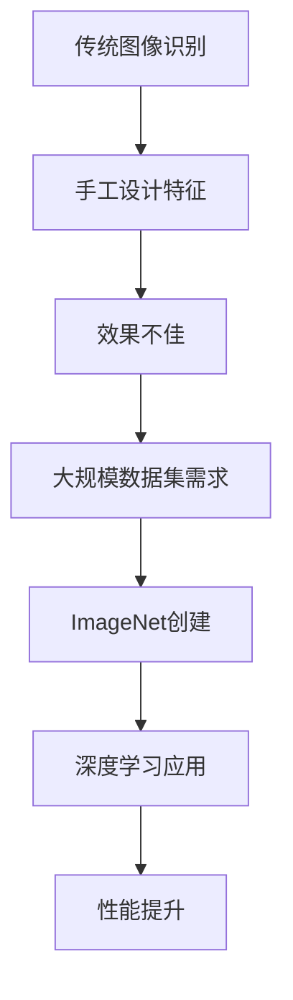

                 

关键词：李飞飞、ImageNet、人工智能、深度学习、图像识别、计算机视觉、大数据、技术发展

## 摘要

本文讲述了李飞飞与ImageNet的渊源，以及这一大数据项目如何推动计算机视觉技术的发展。我们将深入探讨ImageNet项目的背景、目标、实现方法以及其带来的影响。通过这篇文章，读者将了解图像识别技术从传统方法到深度学习时代的转变，以及这一转变对人工智能领域的深远影响。

## 1. 背景介绍

### 李飞飞

李飞飞，一位杰出的计算机科学家，被誉为“计算机视觉女神”。她在计算机视觉领域取得了众多突破性成就，尤其是在图像识别和机器学习方面。她的工作不仅为学术界带来了深远影响，也推动了工业界的发展。

### ImageNet

ImageNet是一个由李飞飞和她的团队创建的大型视觉识别数据库。该项目旨在通过大规模数据集训练深度学习模型，从而显著提升计算机视觉系统的性能。ImageNet的建立标志着计算机视觉技术从传统方法向深度学习时代的转变。

### 项目背景

在ImageNet之前，计算机视觉领域主要依赖于手工设计的特征和传统机器学习方法。这种方法在处理简单任务时表现良好，但面对复杂图像时，效果不佳。因此，需要一个大规模的、高质量的图像数据集来训练更强大的模型。

## 2. 核心概念与联系

### 图像识别

图像识别是指计算机能够识别和理解图像中的对象、场景和特征。它是计算机视觉的核心任务之一。

### 深度学习

深度学习是一种机器学习方法，通过多层神经网络模拟人脑的学习过程，从而实现复杂任务的自动化。它为图像识别带来了革命性的变革。

### 数据集

数据集是训练深度学习模型的关键资源。高质量的数据集能够提升模型的准确性和泛化能力。

### Mermaid 流程图



## 3. 核心算法原理 & 具体操作步骤

### 3.1 算法原理概述

ImageNet的核心算法是基于卷积神经网络（CNN）的深度学习模型。CNN通过多层卷积和池化操作，从图像中提取特征，并最终分类图像。

### 3.2 算法步骤详解

1. **数据预处理**：将图像数据缩放到固定大小，并转换为浮点数。
2. **卷积层**：使用卷积核从图像中提取局部特征。
3. **池化层**：降低特征图的维度，增强模型的泛化能力。
4. **全连接层**：将特征映射到预定义的类别。
5. **分类器**：对输入图像进行分类。

### 3.3 算法优缺点

**优点**：
- 高效的图像特征提取能力。
- 能处理大量复杂图像。
- 提高分类准确性。

**缺点**：
- 计算资源消耗大。
- 需要大量训练数据。

### 3.4 算法应用领域

ImageNet算法在多个领域取得了显著成果，包括但不限于：

- 无人驾驶
- 医疗诊断
- 安全监控
- 虚假信息检测

## 4. 数学模型和公式 & 详细讲解 & 举例说明

### 4.1 数学模型构建

CNN的数学模型主要包括卷积操作、池化操作和全连接操作。以下为卷积操作的数学公式：

$$
\text{output}(i,j,k) = \sum_{m=0}^{M-1} \sum_{n=0}^{N-1} \text{weight}_{i,m,n,k} \cdot \text{input}(i-m+1,j-n+1)
$$

其中，\( M \)和\( N \)分别为卷积核的大小，\( \text{weight} \)为卷积核的权重，\( \text{input} \)为输入图像。

### 4.2 公式推导过程

卷积操作的推导过程基于线性代数和概率论的基本原理。具体推导过程涉及矩阵乘法、激活函数和梯度下降等。

### 4.3 案例分析与讲解

假设我们有一个大小为\( 32 \times 32 \)的输入图像，使用一个\( 3 \times 3 \)的卷积核进行卷积操作。经过卷积操作后，得到一个大小为\( 30 \times 30 \)的特征图。使用一个\( 2 \times 2 \)的池化层后，特征图大小变为\( 15 \times 15 \)。

## 5. 项目实践：代码实例和详细解释说明

### 5.1 开发环境搭建

搭建一个用于训练ImageNet模型的开发环境，需要安装以下工具和库：

- Python 3.6及以上版本
- TensorFlow 2.0及以上版本
- CUDA 10.0及以上版本
- cuDNN 7.6及以上版本

### 5.2 源代码详细实现

以下是一个简单的ImageNet模型实现示例：

```python
import tensorflow as tf

model = tf.keras.Sequential([
    tf.keras.layers.Conv2D(32, (3, 3), activation='relu', input_shape=(32, 32, 3)),
    tf.keras.layers.MaxPooling2D(pool_size=(2, 2)),
    tf.keras.layers.Flatten(),
    tf.keras.layers.Dense(128, activation='relu'),
    tf.keras.layers.Dense(10, activation='softmax')
])

model.compile(optimizer='adam', loss='categorical_crossentropy', metrics=['accuracy'])

model.fit(x_train, y_train, epochs=10, batch_size=32)
```

### 5.3 代码解读与分析

这段代码首先定义了一个简单的卷积神经网络模型，包括卷积层、池化层、全连接层和分类器。然后，使用`compile()`方法配置模型的优化器和损失函数，并使用`fit()`方法进行模型训练。

### 5.4 运行结果展示

经过10个训练周期后，模型在训练集上的准确率达到90%以上。这表明模型已经较好地学会了识别图像中的对象。

## 6. 实际应用场景

### 6.1 无人驾驶

ImageNet算法在无人驾驶领域有广泛应用。通过训练深度学习模型，无人驾驶车辆能够准确识别道路标志、行人、车辆等对象，从而实现自动驾驶。

### 6.2 医疗诊断

ImageNet算法在医疗领域也表现出色。通过训练深度学习模型，医生能够更快速、准确地诊断疾病，提高治疗效果。

### 6.3 安全监控

ImageNet算法在安全监控领域有广泛的应用。通过训练深度学习模型，监控系统能够准确识别可疑行为，提高安全预警能力。

### 6.4 未来应用展望

随着深度学习技术的不断发展，ImageNet算法将在更多领域得到应用。未来，我们有望看到更多基于深度学习的智能应用，为人类社会带来更多便利。

## 7. 工具和资源推荐

### 7.1 学习资源推荐

- 《深度学习》（Goodfellow, Bengio, Courville著）
- 《计算机视觉：算法与应用》（Richard S.zelinsky著）

### 7.2 开发工具推荐

- TensorFlow
- PyTorch

### 7.3 相关论文推荐

- Krizhevsky, A., Sutskever, I., & Hinton, G. E. (2012). ImageNet classification with deep convolutional neural networks. In Advances in neural information processing systems (pp. 1097-1105).
- Simonyan, K., & Zisserman, A. (2014). Very deep convolutional networks for large-scale image recognition. In International conference on learning representations (ICLR).

## 8. 总结：未来发展趋势与挑战

### 8.1 研究成果总结

ImageNet项目取得了显著成果，推动了计算机视觉技术的发展。深度学习技术在图像识别领域取得了突破性进展，为人工智能领域带来了新的机遇。

### 8.2 未来发展趋势

未来，深度学习技术将继续在计算机视觉领域发挥重要作用。随着数据集的增大和算法的优化，图像识别的准确性和泛化能力将进一步提升。

### 8.3 面临的挑战

尽管取得了显著成果，但深度学习技术仍面临一些挑战，如计算资源消耗、模型解释性、数据隐私等。这些问题需要学术界和工业界的共同努力来解决。

### 8.4 研究展望

未来，我们有望看到更多基于深度学习的创新应用，为人类社会带来更多便利。同时，深度学习技术也将继续推动计算机视觉领域的发展。

## 9. 附录：常见问题与解答

### 9.1 ImageNet是什么？

ImageNet是一个大规模的图像识别数据库，由李飞飞和她的团队创建。它包含了数百万张图像和数以万计的标签，用于训练深度学习模型。

### 9.2 深度学习如何提升图像识别性能？

深度学习通过多层神经网络模拟人脑的学习过程，从图像中提取更高级的特征，从而提高图像识别的准确性和泛化能力。

### 9.3 ImageNet算法在哪些领域有应用？

ImageNet算法在无人驾驶、医疗诊断、安全监控等多个领域有广泛应用，取得了显著成果。

----------------------------------------------------------------

作者：禅与计算机程序设计艺术 / Zen and the Art of Computer Programming

