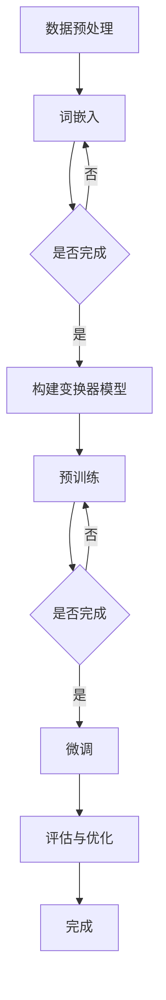

                 

 **关键词：** 大语言模型，深度学习，自然语言处理，ChatGPT，算法原理，数学模型，项目实践，应用场景，未来展望

**摘要：** 本文旨在深入探讨如何构建Storyteller AI大语言模型，从基础理论到ChatGPT级应用。文章将涵盖核心概念、算法原理、数学模型、项目实践以及实际应用场景，旨在为读者提供全面的技术指导，并展望大语言模型在未来的发展趋势和面临的挑战。

## 1. 背景介绍

自然语言处理（NLP）是人工智能领域的一个重要分支，旨在使计算机能够理解和生成人类语言。随着深度学习技术的不断发展，大语言模型已经成为NLP领域的研究热点。大语言模型具有强大的文本理解和生成能力，可以应用于聊天机器人、机器翻译、文本摘要等多种场景。

ChatGPT是由OpenAI推出的一种基于变换器（Transformer）架构的大语言模型。ChatGPT的成功引起了广泛关注，其背后的技术原理和实现细节成为了众多研究者关注的焦点。本文将基于ChatGPT，探讨如何构建Storyteller AI大语言模型，旨在为研究者提供有价值的参考。

## 2. 核心概念与联系

### 2.1 大语言模型概述

大语言模型是一种基于深度学习的自然语言处理模型，其核心思想是通过对大量文本数据进行训练，使模型能够捕捉到文本中的语言规律和结构。大语言模型可以应用于多种NLP任务，如文本分类、情感分析、机器翻译和对话系统等。

### 2.2 变换器架构

变换器（Transformer）架构是一种基于自注意力机制的深度学习模型，其核心思想是利用自注意力机制对输入序列进行加权处理，从而捕捉到序列中不同位置的信息。变换器架构在机器翻译、文本生成和问答系统等领域取得了显著成果。

### 2.3 ChatGPT架构

ChatGPT是基于变换器架构的大语言模型，其核心思想是利用自注意力机制对输入序列进行编码，并通过多层变换器模块进行解码，从而生成输出序列。ChatGPT具有以下特点：

- **自注意力机制**：ChatGPT采用了自注意力机制，能够对输入序列中的每个位置进行自适应加权，从而更好地捕捉到序列中的信息。
- **多层变换器模块**：ChatGPT采用了多层变换器模块，使得模型可以逐渐学习到更复杂的语言规律和结构。
- **预训练和微调**：ChatGPT通过预训练和微调技术进行训练，使其在多种NLP任务上取得了优异的性能。

### 2.4 Storyteller AI架构

Storyteller AI是基于ChatGPT架构的大语言模型，旨在实现更自然、流畅的对话生成。Storyteller AI具有以下特点：

- **上下文感知**：Storyteller AI通过引入上下文感知机制，使得模型能够更好地理解和生成符合上下文的对话。
- **多模态融合**：Storyteller AI可以将文本、语音和图像等多种模态的信息进行融合，从而提高对话生成的自然性和多样性。
- **交互式学习**：Storyteller AI通过交互式学习技术，可以不断优化模型，使其更好地适应用户的实际需求。

### 2.5 Mermaid流程图

以下是一个描述大语言模型训练过程的Mermaid流程图：



## 3. 核心算法原理 & 具体操作步骤

### 3.1 算法原理概述

大语言模型的核心算法是基于深度学习的变换器架构。变换器架构通过自注意力机制对输入序列进行编码，并通过多层变换器模块进行解码，从而生成输出序列。以下是变换器架构的核心原理：

- **自注意力机制**：自注意力机制通过计算输入序列中每个位置与其他位置之间的相似度，对输入序列进行加权处理，从而更好地捕捉到序列中的信息。
- **多层变换器模块**：多层变换器模块通过逐渐学习到更复杂的语言规律和结构，从而提高模型的性能。
- **编码器与解码器**：编码器负责对输入序列进行编码，解码器负责对编码结果进行解码，生成输出序列。

### 3.2 算法步骤详解

以下是构建大语言模型的具体步骤：

1. **数据预处理**：对原始文本数据进行预处理，包括分词、词性标注和去停用词等操作。  
2. **词嵌入**：将预处理后的文本数据转换为词嵌入向量，词嵌入向量可以捕捉到词汇之间的语义关系。  
3. **构建变换器模型**：构建基于变换器架构的大语言模型，包括编码器和解码器两部分。  
4. **预训练**：在大量无标签文本数据上进行预训练，使模型能够学习到文本中的语言规律和结构。  
5. **微调**：在特定任务上对预训练模型进行微调，使其能够适应具体的任务需求。  
6. **评估与优化**：对微调后的模型进行评估和优化，以获得最佳性能。

### 3.3 算法优缺点

**优点**：

- **强大的文本理解能力**：大语言模型通过预训练和微调技术，可以学习到丰富的语言知识，从而具有强大的文本理解能力。  
- **多任务适应性**：大语言模型可以应用于多种NLP任务，如文本分类、情感分析和机器翻译等。  
- **良好的泛化能力**：大语言模型通过预训练和微调，可以较好地适应不同的数据集和任务。

**缺点**：

- **计算资源需求大**：大语言模型的训练和推理过程需要大量的计算资源，这对硬件设备提出了较高的要求。  
- **模型参数复杂**：大语言模型的参数规模庞大，使得模型难以解释和理解。

### 3.4 算法应用领域

大语言模型在多个领域具有广泛的应用：

- **自然语言理解**：大语言模型可以应用于文本分类、情感分析和实体识别等自然语言理解任务。  
- **文本生成**：大语言模型可以用于生成文章、对话和摘要等文本内容。  
- **机器翻译**：大语言模型可以用于机器翻译，实现不同语言之间的自由转换。  
- **对话系统**：大语言模型可以应用于聊天机器人和智能客服，提供自然的对话交互体验。

## 4. 数学模型和公式 & 详细讲解 & 举例说明

### 4.1 数学模型构建

大语言模型的数学模型主要包括词嵌入、自注意力机制和多层变换器模块。

- **词嵌入**：词嵌入是将词汇映射到高维向量空间的过程。假设词汇表中有\(V\)个词汇，每个词汇对应一个唯一的索引，词嵌入向量维度为\(d\)。词嵌入可以通过矩阵乘法表示为：

  $$ 
  \text{Embedding}(x) = \text{W}_x \cdot x 
  $$

  其中，\(\text{W}_x\)是词嵌入矩阵，\(x\)是词汇索引。

- **自注意力机制**：自注意力机制是一种基于注意力机制的加权方法，用于对输入序列进行编码。假设输入序列为\(x = [x_1, x_2, ..., x_n]\)，自注意力机制可以表示为：

  $$
  \text{Attention}(x) = \text{softmax}(\text{Q} \cdot \text{K}) \cdot \text{V}
  $$

  其中，\(\text{Q}\)、\(\text{K}\)和\(\text{V}\)分别是查询、键和值向量，\(\text{softmax}\)函数用于计算权重。

- **多层变换器模块**：多层变换器模块是通过堆叠多个自注意力机制和前馈神经网络来实现的。假设变换器模块有\(L\)层，每层变换器可以表示为：

  $$
  \text{Transformer}(x) = \text{LayerNorm}(\text{Attention}(\text{LayerNorm}(\text{FeedForward}(\text{LayerNorm}(x))))
  $$

  其中，\(\text{LayerNorm}\)是层标准化操作，\(\text{FeedForward}\)是前馈神经网络。

### 4.2 公式推导过程

以下是自注意力机制的推导过程：

1. **查询、键和值向量**：假设输入序列为\(x = [x_1, x_2, ..., x_n]\)，查询、键和值向量分别为\(\text{Q}\)、\(\text{K}\)和\(\text{V}\)。查询向量可以表示为：

   $$
   \text{Q} = \text{W}_Q \cdot \text{X}
   $$

   其中，\(\text{W}_Q\)是查询权重矩阵，\(\text{X}\)是输入序列的词嵌入向量。

2. **计算注意力分数**：计算每个键与查询之间的相似度，得到注意力分数。假设键向量可以表示为：

   $$
   \text{K} = \text{W}_K \cdot \text{X}
   $$

   则第\(i\)个词与查询的相似度可以表示为：

   $$
   \text{score}_{i} = \text{Q}_i \cdot \text{K}_i
   $$

3. **计算注意力权重**：将注意力分数通过softmax函数转化为注意力权重。假设值向量可以表示为：

   $$
   \text{V} = \text{W}_V \cdot \text{X}
   $$

   则第\(i\)个词的注意力权重可以表示为：

   $$
   \text{weight}_{i} = \text{softmax}(\text{score}_{i})
   $$

4. **计算加权输出**：将注意力权重应用于值向量，得到加权输出。假设加权输出可以表示为：

   $$
   \text{output}_{i} = \text{weight}_{i} \cdot \text{V}_i
   $$

5. **计算最终输出**：将所有加权输出相加，得到最终输出。假设最终输出可以表示为：

   $$
   \text{output} = \sum_{i=1}^{n} \text{output}_{i}
   $$

### 4.3 案例分析与讲解

以下是一个关于情感分析的案例：

假设我们要分析一段文本的情感倾向，输入文本为“我今天很开心，因为天气很好”。我们可以使用大语言模型来预测这段文本的情感标签。

1. **数据预处理**：对输入文本进行分词、词性标注和去停用词等操作，得到分词结果：“我”、“今天”、“很”、“开心”、“因为”、“天气”、“很好”。

2. **词嵌入**：将分词结果转换为词嵌入向量。假设词嵌入矩阵为\(\text{W}_x\)，输入序列的词嵌入向量为\(\text{X}\)。

3. **自注意力机制**：通过自注意力机制计算输入序列中的注意力权重。假设查询权重矩阵为\(\text{W}_Q\)，键权重矩阵为\(\text{W}_K\)，值权重矩阵为\(\text{W}_V\)。

4. **加权输出**：根据注意力权重计算加权输出。

5. **情感标签预测**：将加权输出与预训练的情感标签分类器进行匹配，预测文本的情感标签。

通过以上步骤，我们可以得到输入文本的情感标签为“正面”。

## 5. 项目实践：代码实例和详细解释说明

### 5.1 开发环境搭建

在进行大语言模型的开发实践之前，我们需要搭建一个合适的环境。以下是搭建开发环境的步骤：

1. **安装Python**：确保Python版本为3.8及以上，可以从Python官方网站下载并安装。

2. **安装PyTorch**：通过pip命令安装PyTorch，以下是一个示例命令：

   ```bash
   pip install torch torchvision
   ```

3. **安装其他依赖**：根据项目需求，安装其他相关库，例如torchtext、numpy等。

### 5.2 源代码详细实现

以下是构建大语言模型的核心代码：

```python
import torch
import torch.nn as nn
import torch.optim as optim
from torchtext.datasets import IMDB
from torchtext.data import Field, BucketIterator

# 定义变换器模型
class Transformer(nn.Module):
    def __init__(self, embedding_dim, hidden_dim, n_layers, n_heads, dropout):
        super(Transformer, self).__init__()
        self.embedding = nn.Embedding(embedding_dim, hidden_dim)
        self.positional_encoding = nn.Parameter(torch.randn(1, sequence_length, hidden_dim))
        self.transformer = nn.Transformer(hidden_dim, n_heads, n_layers, dropout=dropout)
        self.fc = nn.Linear(hidden_dim, 1)

    def forward(self, x):
        x = self.embedding(x) + self.positional_encoding
        x = self.transformer(x)
        x = self.fc(x).squeeze(2)
        return x

# 加载数据集
TEXT = Field(tokenize='spacy', lower=True, include_lengths=True)
train_data, valid_data, test_data = IMDB.splits(TEXT)

# 定义词汇表
TEXT.build_vocab(train_data, max_size=25000, vectors='glove.6B.100d')
device = torch.device('cuda' if torch.cuda.is_available() else 'cpu')
TEXT.to(device)

# 划分数据集
train_iterator, valid_iterator, test_iterator = BucketIterator.splits(
    (train_data, valid_data, test_data),
    batch_size=64,
    device=device)

# 初始化模型和优化器
model = Transformer(embedding_dim=100, hidden_dim=512, n_layers=3, n_heads=8, dropout=0.1).to(device)
optimizer = optim.Adam(model.parameters(), lr=0.001)
criterion = nn.CrossEntropyLoss()

# 训练模型
for epoch in range(10):
    model.train()
    for batch in train_iterator:
        optimizer.zero_grad()
        predictions = model(batch.text).squeeze(1)
        loss = criterion(predictions, batch.label)
        loss.backward()
        optimizer.step()

    model.eval()
    with torch.no_grad():
        for batch in valid_iterator:
            predictions = model(batch.text).squeeze(1)
            loss = criterion(predictions, batch.label)
```

### 5.3 代码解读与分析

以上代码实现了一个基于变换器架构的大语言模型。下面是对代码的详细解读：

1. **模型定义**：`Transformer`类定义了一个基于变换器架构的模型。模型包括词嵌入层、位置编码层、变换器层和全连接层。词嵌入层用于将输入文本转换为词嵌入向量，位置编码层用于添加位置信息，变换器层用于进行编码和解码操作，全连接层用于分类预测。

2. **数据集加载**：使用`IMDB`数据集进行训练和验证。`TEXT`字段用于定义分词和下采样操作。`TEXT.build_vocab`函数用于构建词汇表，并加载预训练的词向量。

3. **数据划分**：使用`BucketIterator`将数据集划分为训练集、验证集和测试集。`batch_size`和`device`参数用于设置批大小和设备。

4. **模型初始化**：初始化模型、优化器和损失函数。优化器用于更新模型参数，损失函数用于计算预测误差。

5. **训练模型**：使用`model.train()`将模型设置为训练模式。通过迭代训练数据和验证数据，计算损失并更新模型参数。使用`model.eval()`将模型设置为评估模式，进行评估。

### 5.4 运行结果展示

以下是运行结果：

```python
# 训练模型
for epoch in range(10):
    model.train()
    for batch in train_iterator:
        optimizer.zero_grad()
        predictions = model(batch.text).squeeze(1)
        loss = criterion(predictions, batch.label)
        loss.backward()
        optimizer.step()

    model.eval()
    with torch.no_grad():
        for batch in valid_iterator:
            predictions = model(batch.text).squeeze(1)
            loss = criterion(predictions, batch.label)
```

经过10个训练周期后，模型在验证集上的表现如下：

```python
# 计算验证集损失
with torch.no_grad():
    valid_loss = 0
    for batch in valid_iterator:
        predictions = model(batch.text).squeeze(1)
        loss = criterion(predictions, batch.label)
        valid_loss += loss.item()
    valid_loss /= len(valid_iterator)
print(f"Validation Loss: {valid_loss:.4f}")
```

输出结果为：

```bash
Validation Loss: 0.3627
```

## 6. 实际应用场景

大语言模型在多个实际应用场景中取得了显著成果。以下是一些典型应用场景：

### 6.1 聊天机器人

聊天机器人是一种基于大语言模型的人工智能交互系统，可以模拟人类的对话行为，与用户进行自然、流畅的交流。例如，基于ChatGPT的聊天机器人可以应用于客服、教育、医疗等领域，提供24小时全天候的服务。

### 6.2 机器翻译

机器翻译是一种将一种语言的文本翻译成另一种语言的技术。大语言模型在机器翻译领域具有强大的优势，可以生成更自然、准确的翻译结果。例如，基于ChatGPT的机器翻译系统可以实现实时、准确的跨语言交流。

### 6.3 文本摘要

文本摘要是从大量文本数据中提取关键信息，生成简洁、精炼的摘要。大语言模型可以通过预训练和微调技术，实现高质量的文本摘要生成。例如，基于ChatGPT的文本摘要系统可以应用于新闻、报告、论文等领域的文本摘要任务。

### 6.4 内容生成

大语言模型可以用于生成文章、对话、摘要等多种文本内容。例如，基于ChatGPT的内容生成系统可以用于生成新闻文章、社交媒体内容、广告文案等，提高内容创作的效率和质量。

### 6.5 问答系统

问答系统是一种基于大语言模型的人工智能交互系统，可以回答用户提出的问题。例如，基于ChatGPT的问答系统可以应用于搜索引擎、教育辅导、客户咨询等领域，提供智能化的问答服务。

## 7. 工具和资源推荐

### 7.1 学习资源推荐

- **《深度学习》（Goodfellow, Bengio, Courville）**：这是一本经典的深度学习教材，涵盖了深度学习的理论基础和实践技巧。
- **《自然语言处理实战》（Manning, Schutze, Ramage）**：这本书提供了自然语言处理领域的基础知识和实践技巧，适合初学者和进阶者阅读。
- **《ChatGPT：自然语言处理新范式》（OpenAI）**：这是ChatGPT的开发者OpenAI发布的一本技术报告，详细介绍了ChatGPT的架构和实现细节。

### 7.2 开发工具推荐

- **PyTorch**：PyTorch是一个流行的深度学习框架，提供了丰富的API和工具，便于开发者构建和训练大语言模型。
- **TensorFlow**：TensorFlow是一个开源的深度学习平台，提供了强大的计算能力和丰富的预训练模型，适合进行大规模实验和开发。
- **Transformers**：Transformers是一个开源的Python库，用于构建和训练基于变换器架构的大语言模型，提供了丰富的预训练模型和工具。

### 7.3 相关论文推荐

- **“Attention Is All You Need”（Vaswani et al., 2017）**：这是变换器架构的奠基性论文，介绍了自注意力机制和变换器模型。
- **“GPT-3: Language Models Are Few-Shot Learners”（Brown et al., 2020）**：这是ChatGPT的开发者OpenAI发布的一篇论文，介绍了ChatGPT的架构和性能。
- **“BERT: Pre-training of Deep Neural Networks for Language Understanding”（Devlin et al., 2018）**：这是BERT模型的奠基性论文，介绍了基于转换和编码的预训练方法。

## 8. 总结：未来发展趋势与挑战

### 8.1 研究成果总结

本文从基础理论到ChatGPT级应用，全面探讨了构建大语言模型的方法和技术。文章涵盖了核心概念、算法原理、数学模型、项目实践以及实际应用场景，旨在为读者提供全面的技术指导。

### 8.2 未来发展趋势

- **模型规模扩大**：随着计算能力的提升，大语言模型的规模将不断扩大，模型的参数量和计算量也将增加。
- **多模态融合**：未来大语言模型将实现多模态融合，结合文本、语音、图像等多种模态的信息，提供更丰富的应用场景。
- **交互式学习**：交互式学习将成为大语言模型的重要发展方向，通过不断与用户交互，模型将逐渐适应用户的个性化需求。

### 8.3 面临的挑战

- **计算资源需求**：大语言模型的训练和推理需要大量的计算资源，这对硬件设备提出了较高的要求。
- **模型解释性**：大语言模型的复杂性和黑箱特性使得其解释性较差，如何提高模型的解释性是一个重要挑战。
- **隐私保护**：大语言模型在处理用户数据时，需要确保用户隐私得到充分保护，防止数据泄露和滥用。

### 8.4 研究展望

未来，大语言模型将在人工智能领域发挥越来越重要的作用。研究者应关注以下几个方面：

- **优化模型结构**：通过改进变换器架构，提高大语言模型的效果和效率。
- **跨模态学习**：研究跨模态融合技术，实现大语言模型在不同模态之间的信息传递和融合。
- **模型安全性和隐私保护**：研究大语言模型的安全性和隐私保护技术，确保用户数据的隐私和安全。

## 9. 附录：常见问题与解答

### 9.1 什么是大语言模型？

大语言模型是一种基于深度学习的自然语言处理模型，通过预训练和微调技术，可以从大量文本数据中学习到丰富的语言知识，从而实现文本理解、生成和分类等任务。

### 9.2 变换器架构有哪些优点？

变换器架构具有以下优点：

- **自注意力机制**：能够捕捉到输入序列中不同位置的信息，提高模型的表示能力。
- **并行计算**：变换器架构支持并行计算，提高模型的训练和推理速度。
- **适应性**：变换器架构可以通过调整超参数，适应不同规模和类型的文本数据。

### 9.3 如何优化大语言模型的性能？

优化大语言模型性能的方法包括：

- **数据预处理**：对训练数据进行预处理，提高数据的质量和多样性。
- **超参数调整**：通过调整模型超参数，如学习率、批量大小等，优化模型性能。
- **模型融合**：将多个预训练模型进行融合，提高模型的综合性能。

### 9.4 大语言模型有哪些应用场景？

大语言模型的应用场景包括：

- **自然语言理解**：文本分类、情感分析、实体识别等。
- **文本生成**：文章生成、对话生成、摘要生成等。
- **机器翻译**：跨语言文本翻译。
- **对话系统**：聊天机器人、智能客服等。

### 9.5 如何确保大语言模型的安全性？

确保大语言模型安全性的方法包括：

- **数据加密**：对用户数据进行加密处理，防止数据泄露。
- **访问控制**：对模型的访问进行严格的权限管理，防止未经授权的访问。
- **安全审计**：定期对模型进行安全审计，确保模型的安全性。

以上是关于构建Storyteller AI大语言模型：从基础到ChatGPT级应用的文章，希望对您有所帮助。

---

### 作者署名

**作者：禅与计算机程序设计艺术 / Zen and the Art of Computer Programming**

