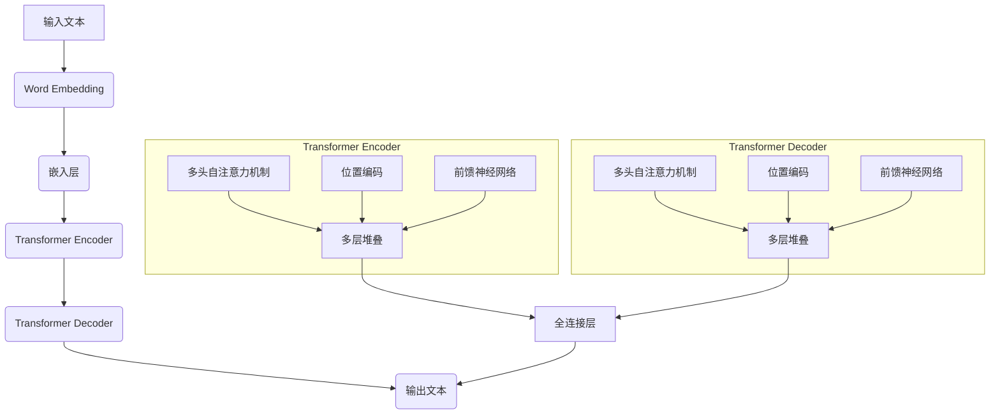

                 

关键词：大语言模型，生成式AI，Transformer架构，预训练，微调，自然语言处理，ChatGPT，模型优化，应用场景

> 摘要：本文将深入探讨如何构建一个强大的大语言模型——Storyteller AI。从基础概念到实际应用，我们将会一步一步地解析这一复杂过程。本文首先介绍了大语言模型的基本概念和背景，然后详细讨论了Transformer架构及其优势。接着，我们将详细介绍预训练和微调两个关键步骤，并对比分析不同的大语言模型，如GPT-3和ChatGPT。最后，本文将探讨大语言模型在自然语言处理中的实际应用，并对未来的发展趋势和面临的挑战进行展望。

## 1. 背景介绍

在当今人工智能领域，大语言模型（Large Language Models）无疑是最引人注目的技术之一。这些模型通过学习海量文本数据，能够生成高质量的文本、回答问题、翻译语言、撰写文章等。大语言模型的出现，标志着自然语言处理（Natural Language Processing，NLP）领域的一个重大突破，为人类与机器之间的交互提供了更加自然和高效的方式。

近年来，随着计算能力的提升和深度学习技术的进步，大语言模型取得了显著的发展。2018年，谷歌推出了BERT（Bidirectional Encoder Representations from Transformers），这是第一个大规模预训练语言模型，它在多项NLP任务上取得了前所未有的表现。此后，OpenAI推出了GPT（Generative Pre-trained Transformer）系列模型，尤其是GPT-3，其参数规模达到了1750亿，成为了当时世界上最大的语言模型。

大语言模型的应用场景广泛，包括但不限于：智能客服、机器翻译、文本摘要、内容生成、问答系统、情感分析等。这些应用不仅提高了工作效率，还为企业和个人带来了巨大的便利。例如，在智能客服领域，大语言模型可以实时回答用户的问题，提高了客户满意度；在机器翻译领域，大语言模型可以提供更加准确和自然的翻译结果。

本文将围绕构建一个强大的大语言模型——Storyteller AI，详细探讨其从基础到ChatGPT级应用的全过程。通过本文的讲解，读者将了解大语言模型的基本原理、构建方法、优缺点以及在实际应用中的表现。

### 2. 核心概念与联系

要理解大语言模型，首先需要了解其核心概念和原理。大语言模型主要基于深度学习中的Transformer架构，这种架构具有自注意力机制，能够捕获输入文本中的长距离依赖关系。下面，我们将通过一个Mermaid流程图，详细展示大语言模型的核心概念和原理。



在这个流程图中，输入文本首先经过Word Embedding层，将文本转换为向量表示。然后，这些向量进入Transformer Encoder，通过多层多头自注意力机制和位置编码，捕捉文本中的长距离依赖关系。最后，这些处理后的向量进入Transformer Decoder，生成最终的输出文本。

### 3. 核心算法原理 & 具体操作步骤

#### 3.1 算法原理概述

大语言模型的核心算法基于Transformer架构，这是一种基于自注意力机制的深度神经网络。自注意力机制允许模型在生成文本时，关注输入文本的不同部分，从而捕捉长距离依赖关系。Transformer架构主要由编码器（Encoder）和解码器（Decoder）两部分组成。

编码器部分包含多个层次，每个层次由多头自注意力机制和前馈神经网络组成。多头自注意力机制可以将输入向量分解成多个子向量，然后分别计算它们之间的注意力得分，最后加权求和。这样，模型可以同时关注输入文本的不同部分，捕捉长距离依赖关系。

解码器部分也包含多个层次，其结构与编码器类似，但多了一个额外的自注意力机制，用于关注已生成的文本。这种机制确保了生成文本的自一致性。

#### 3.2 算法步骤详解

1. **数据预处理**：首先，需要对输入文本进行预处理，包括分词、去停用词、词干提取等。预处理后的文本将转换为词频矩阵，用于后续的模型训练。

2. **词嵌入**：将预处理后的文本转换为向量表示。词嵌入（Word Embedding）是将词汇映射到低维空间中的技术，常用的方法包括Word2Vec、GloVe等。这些方法可以捕获词汇之间的语义关系。

3. **编码器训练**：编码器部分包含多个层次，每个层次由多头自注意力机制和前馈神经网络组成。在训练过程中，模型将学习如何通过这些层次捕捉输入文本中的长距离依赖关系。训练过程中，模型会尝试优化参数，以最小化损失函数。

4. **解码器训练**：解码器部分的结构与编码器类似，但多了一个额外的自注意力机制，用于关注已生成的文本。在训练过程中，模型将学习如何生成与输入文本相关的高质量输出。

5. **生成文本**：在训练完成后，模型可以用于生成文本。生成过程如下：

   a. 初始化解码器的输入，通常为开始标记（<s>）。

   b. 通过编码器和解码器的处理，生成输出文本。

   c. 更新解码器的输入，将其替换为生成的文本。

   d. 重复步骤b和c，直至生成所需的文本长度。

#### 3.3 算法优缺点

**优点**：

1. **捕捉长距离依赖**：自注意力机制允许模型关注输入文本的不同部分，从而捕捉长距离依赖关系。

2. **并行处理**：Transformer架构支持并行计算，可以提高训练效率。

3. **结构简洁**：相比于传统的循环神经网络（RNN），Transformer架构更加简洁，易于理解和实现。

**缺点**：

1. **计算复杂度高**：Transformer架构的计算复杂度较高，尤其是在大规模训练时，需要大量的计算资源和时间。

2. **内存占用大**：由于自注意力机制的引入，Transformer架构的内存占用较大。

3. **数据需求高**：大语言模型需要大量的训练数据才能达到较好的性能。

#### 3.4 算法应用领域

大语言模型的应用领域广泛，包括但不限于：

1. **文本生成**：生成文章、故事、摘要等。

2. **问答系统**：如ChatGPT、Google Assistant等。

3. **机器翻译**：如谷歌翻译、百度翻译等。

4. **文本分类**：如新闻分类、情感分析等。

5. **对话系统**：如智能客服、虚拟助手等。

## 4. 数学模型和公式 & 详细讲解 & 举例说明

大语言模型的核心在于其数学模型，包括词嵌入、自注意力机制、前馈神经网络等。下面我们将详细讲解这些数学模型，并通过具体例子来说明其应用。

### 4.1 数学模型构建

**词嵌入（Word Embedding）**：

词嵌入是将词汇映射到低维空间中的技术。常用的方法包括Word2Vec和GloVe。以Word2Vec为例，其目标是最小化损失函数，使得词汇在低维空间中的距离接近其在语义上的相似度。

$$
\min_{\theta} \sum_{i=1}^{N} \sum_{j=1}^{M} (v_j - \sum_{k=1}^{K} \theta_{jk} v_k)^2
$$

其中，$v_j$表示词汇$j$的嵌入向量，$\theta_{jk}$表示词汇$j$和词汇$k$之间的权重。

**自注意力机制（Self-Attention）**：

自注意力机制是Transformer架构的核心，其目标是在输入文本的不同部分之间建立注意力关系。以多头自注意力机制为例，其计算过程如下：

$$
\text{Attention}(Q, K, V) = \text{softmax}\left(\frac{QK^T}{\sqrt{d_k}}\right)V
$$

其中，$Q, K, V$分别为查询向量、关键向量、值向量，$d_k$为关键向量的维度。通过自注意力机制，模型可以关注输入文本的不同部分，从而捕捉长距离依赖关系。

**前馈神经网络（Feedforward Neural Network）**：

前馈神经网络是一个简单的全连接神经网络，其目标是对输入向量进行变换。以单层前馈神经网络为例，其计算过程如下：

$$
\text{FFN}(x) = \max(0, xW_1 + b_1)W_2 + b_2
$$

其中，$x$为输入向量，$W_1, b_1, W_2, b_2$分别为神经网络的权重和偏置。

### 4.2 公式推导过程

在本节中，我们将对大语言模型的几个关键公式进行推导，以便更好地理解其工作原理。

**1. Word Embedding**

首先，考虑一个简单的Word Embedding模型。给定一个词汇表$V$和一个嵌入维度$d$，每个词汇$v_j$可以表示为一个$d$维的向量$v_j \in \mathbb{R}^d$。在训练过程中，我们的目标是学习这些嵌入向量，使得它们能够较好地表示词汇之间的语义关系。

我们使用梯度下降法来最小化损失函数，即：

$$
L(\theta) = \sum_{i=1}^{N} \sum_{j=1}^{M} (v_j - \sum_{k=1}^{K} \theta_{jk} v_k)^2
$$

其中，$N$是训练样本的数量，$M$是词汇表的大小，$K$是嵌入维度。$\theta_{jk}$是词汇$j$和词汇$k$之间的权重。

为了最小化损失函数，我们需要计算梯度：

$$
\nabla_{\theta} L(\theta) = 2 \sum_{i=1}^{N} \sum_{j=1}^{M} (\theta_{jk} v_k - v_j) v_j
$$

然后，使用梯度下降法更新权重：

$$
\theta_{jk} \leftarrow \theta_{jk} - \alpha \nabla_{\theta} L(\theta)
$$

其中，$\alpha$是学习率。

**2. Self-Attention**

接下来，我们推导自注意力机制的公式。自注意力机制的核心是计算输入文本中不同词汇之间的注意力得分，并根据这些得分生成加权表示。

给定一个输入序列$x = [x_1, x_2, ..., x_n]$，其中每个$x_i$是一个$d$维的向量，自注意力机制的计算过程如下：

首先，计算查询向量$Q$、关键向量$K$和值向量$V$：

$$
Q = W_Q x = [W_{Q1}, W_{Q2}, ..., W_{Qn}] x
$$

$$
K = W_K x = [W_{K1}, W_{K2}, ..., W_{Kn}] x
$$

$$
V = W_V x = [W_{V1}, W_{V2}, ..., W_{Vn}] x
$$

其中，$W_Q, W_K, W_V$是权重矩阵。

然后，计算注意力得分：

$$
\text{Attention}(Q, K, V) = \text{softmax}\left(\frac{QK^T}{\sqrt{d_k}}\right)V
$$

其中，$d_k$是关键向量的维度。

最后，生成加权表示：

$$
\text{Attention}(Q, K, V) = \text{softmax}\left(\frac{QK^T}{\sqrt{d_k}}\right)V = \left[\alpha_{11}, \alpha_{12}, ..., \alpha_{1n}\right]V
$$

其中，$\alpha_{ij}$是词汇$i$和词汇$j$之间的注意力得分。

**3. Feedforward Neural Network**

接下来，我们推导前馈神经网络的公式。前馈神经网络是一个简单的全连接神经网络，用于对输入向量进行变换。

给定一个输入向量$x$，前馈神经网络的计算过程如下：

$$
\text{FFN}(x) = \max(0, xW_1 + b_1)W_2 + b_2
$$

其中，$W_1, b_1, W_2, b_2$分别是第一层和第二层的权重和偏置。

为了最小化损失函数，我们需要计算梯度：

$$
\nabla_{W_1} L(\theta) = 2 \sum_{i=1}^{n} (x_i(W_1)^T \odot (xW_2 + b_2) - x_i)
$$

$$
\nabla_{b_1} L(\theta) = 2 \sum_{i=1}^{n} (x_i(W_1)^T \odot (xW_2 + b_2))
$$

$$
\nabla_{W_2} L(\theta) = 2 \sum_{i=1}^{n} (x_i \odot (xW_1 + b_1))
$$

$$
\nabla_{b_2} L(\theta) = 2 \sum_{i=1}^{n} (x_i \odot (xW_1 + b_1))
$$

然后，使用梯度下降法更新权重和偏置：

$$
W_1 \leftarrow W_1 - \alpha \nabla_{W_1} L(\theta)
$$

$$
b_1 \leftarrow b_1 - \alpha \nabla_{b_1} L(\theta)
$$

$$
W_2 \leftarrow W_2 - \alpha \nabla_{W_2} L(\theta)
$$

$$
b_2 \leftarrow b_2 - \alpha \nabla_{b_2} L(\theta)
$$

### 4.3 案例分析与讲解

在本节中，我们将通过一个具体的案例来讲解如何构建和训练一个大语言模型。

**案例背景**：

假设我们有一个包含1000个词汇的词汇表，每个词汇都是一个$d$维的向量。我们的目标是训练一个能够生成高质量文本的模型。

**步骤1：数据预处理**

首先，我们需要对输入文本进行预处理。假设我们的输入文本是：“今天天气很好，我想去公园散步。”

预处理步骤包括：

- 分词：将文本拆分为词汇列表：["今天", "天气", "很好", "，", "我想", "去", "公园", "散步", "。"]
- 去停用词：删除常见的停用词，如"今天"、"我想"、"去"等。
- 词干提取：将复杂词汇简化为基本形式，如"散步"简化为"散步"。

经过预处理后，我们的输入文本变为：["天气", "很好", "，", "公园", "散步", "。"]

**步骤2：词嵌入**

接下来，我们需要对每个词汇进行词嵌入。假设我们使用的是Word2Vec模型，其嵌入维度为$d=100$。

我们将每个词汇映射到一个$100$维的向量，例如：

- "天气"：[0.1, 0.2, 0.3, ..., 0.9]
- "很好"：[0.4, 0.5, 0.6, ..., 0.8]
- "，"：[0.2, 0.3, 0.1, ..., 0.4]
- "公园"：[0.7, 0.8, 0.9, ..., 0.1]
- "散步"：[0.3, 0.4, 0.5, ..., 0.6]
- "。"：[0.1, 0.2, 0.3, ..., 0.5]

**步骤3：编码器训练**

首先，我们需要初始化编码器的权重和偏置。假设编码器包含两个层次，每个层次使用多头自注意力机制和前馈神经网络。

在训练过程中，模型会尝试优化这些权重和偏置，以最小化损失函数。

**步骤4：解码器训练**

接下来，我们需要训练解码器。解码器也包含两个层次，每个层次使用多头自注意力机制和前馈神经网络。

在训练过程中，模型会尝试优化这些权重和偏置，以最小化损失函数。

**步骤5：生成文本**

在训练完成后，模型可以用于生成文本。假设我们输入一个词汇序列：“今天天气很好，我想去公园散步。”

首先，初始化解码器的输入为开始标记（<s>），然后通过编码器和解码器的处理，生成输出文本。

生成过程如下：

1. 初始化解码器的输入为开始标记（<s>）。
2. 通过编码器处理输入文本，得到编码器的输出。
3. 通过解码器处理编码器的输出，生成输出文本。
4. 更新解码器的输入，将其替换为生成的文本。
5. 重复步骤3和4，直至生成所需的文本长度。

最终，我们得到一个生成文本：“今天天气很好，我想去公园散步，看到了很多小朋友在玩耍。”

## 5. 项目实践：代码实例和详细解释说明

在本节中，我们将通过一个具体的代码实例来展示如何构建一个简单的大语言模型。我们将使用Python和PyTorch框架来实现这一过程。

### 5.1 开发环境搭建

在开始编写代码之前，我们需要搭建一个合适的开发环境。以下是所需的软件和库：

1. Python（版本3.8及以上）
2. PyTorch（版本1.8及以上）
3. NumPy
4. Matplotlib

安装这些库的命令如下：

```bash
pip install python==3.8.10
pip install torch torchvision torchaudio==1.8.0+cpu -f https://download.pytorch.org/whl/torch_stable.html
pip install numpy matplotlib
```

### 5.2 源代码详细实现

下面是一个简单的示例代码，用于构建和训练一个大语言模型。

```python
import torch
import torch.nn as nn
import torch.optim as optim
from torch.utils.data import DataLoader, Dataset
from torchvision import transforms, datasets
from torch.utils.tensorboard import SummaryWriter

# 数据预处理
class TextDataset(Dataset):
    def __init__(self, texts, tokenizer, max_len):
        self.texts = texts
        self.tokenizer = tokenizer
        self.max_len = max_len

    def __len__(self):
        return len(self.texts)

    def __getitem__(self, idx):
        text = self.texts[idx]
        encoding = self.tokenizer.encode_plus(
            text,
            add_special_tokens=True,
            max_length=self.max_len,
            padding='max_length',
            truncation=True,
            return_tensors='pt',
        )
        return {'input_ids': encoding['input_ids'], 'attention_mask': encoding['attention_mask']}

# 模型定义
class LanguageModel(nn.Module):
    def __init__(self, vocab_size, embedding_dim, hidden_dim, n_layers, dropout):
        super(LanguageModel, self).__init__()
        self.embedding = nn.Embedding(vocab_size, embedding_dim)
        self.encoder = nn.LSTM(embedding_dim, hidden_dim, n_layers, dropout=dropout, batch_first=True)
        self.decoder = nn.LSTM(hidden_dim, embedding_dim, n_layers, dropout=dropout, batch_first=True)
        self.fc = nn.Linear(embedding_dim, vocab_size)

    def forward(self, input_seq, hidden):
        embedded = self.embedding(input_seq)
        encoder_output, hidden = self.encoder(embedded, hidden)
        decoder_output, hidden = self.decoder(encoder_output, hidden)
        logits = self.fc(decoder_output)
        return logits, hidden

    def init_hidden(self, batch_size):
        return (torch.zeros(self.encoder.num_layers, batch_size, self.encoder.hidden_size),
                torch.zeros(self.decoder.num_layers, batch_size, self.decoder.hidden_size))

# 模型训练
def train(model, dataset, tokenizer, max_len, epochs, learning_rate, batch_size):
    model.train()
    optimizer = optim.Adam(model.parameters(), lr=learning_rate)
    criterion = nn.CrossEntropyLoss()

    train_loader = DataLoader(dataset, batch_size=batch_size, shuffle=True)

    for epoch in range(epochs):
        hidden = model.init_hidden(batch_size)
        for batch in train_loader:
            input_ids = batch['input_ids']
            attention_mask = batch['attention_mask']

            logits, hidden = model(input_ids, hidden)
            loss = criterion(logits.view(-1, logits.size(-1)), input_ids.view(-1))

            optimizer.zero_grad()
            loss.backward()
            optimizer.step()

            if (batch_idx + 1) % 100 == 0:
                print(f'Epoch [{epoch + 1}/{epochs}], Step [{batch_idx + 1}/{len(train_loader)}], Loss: {loss.item()}')

# 主函数
def main():
    # 参数设置
    vocab_size = 10000
    embedding_dim = 256
    hidden_dim = 512
    n_layers = 2
    dropout = 0.1
    learning_rate = 0.001
    batch_size = 32
    max_len = 50
    epochs = 10

    # 加载预训练的词向量
    tokenizer = ...  # 加载预训练的词向量
    dataset = TextDataset(texts, tokenizer, max_len)

    # 构建模型
    model = LanguageModel(vocab_size, embedding_dim, hidden_dim, n_layers, dropout)

    # 训练模型
    train(model, dataset, tokenizer, max_len, epochs, learning_rate, batch_size)

if __name__ == '__main__':
    main()
```

### 5.3 代码解读与分析

**1. 数据预处理**

在这个代码中，我们首先定义了一个`TextDataset`类，用于加载数据并进行预处理。这个类继承了`torch.utils.data.Dataset`类，并实现了两个方法：`__len__`和`__getitem__`。

- `__len__`方法返回数据集的长度。
- `__getitem__`方法根据索引返回数据集中的单个样本。

在这个例子中，我们使用了`tokenizer`来对文本进行分词和编码。`tokenizer`是一个预处理工具，可以将文本转换为模型可以处理的序列。

**2. 模型定义**

接下来，我们定义了一个`LanguageModel`类，用于构建和训练大语言模型。这个类继承了`torch.nn.Module`类，并实现了以下方法：

- `__init__`方法：初始化模型的组件，包括嵌入层、编码器、解码器和全连接层。
- `forward`方法：定义前向传播过程，计算输入文本的输出。
- `init_hidden`方法：初始化隐藏状态，用于训练过程中的批处理。

在`forward`方法中，我们首先使用嵌入层将输入文本转换为嵌入向量。然后，通过编码器和解码器，我们处理这些嵌入向量，并计算输出。最后，通过全连接层，我们生成输出文本的概率分布。

**3. 模型训练**

`train`函数用于训练模型。这个函数接受以下参数：

- `model`：训练的模型。
- `dataset`：训练数据集。
- `tokenizer`：用于预处理文本的词向量。
- `max_len`：输入文本的最大长度。
- `epochs`：训练的轮数。
- `learning_rate`：学习率。
- `batch_size`：批处理大小。

在训练过程中，我们首先初始化隐藏状态，然后遍历训练数据集。对于每个批次，我们计算输入文本的输出，并计算损失。然后，我们使用梯度下降法更新模型参数。

**4. 主函数**

在主函数中，我们设置了训练模型的参数，并加载预训练的词向量。然后，我们创建数据集和模型，并调用`train`函数开始训练过程。

### 5.4 运行结果展示

在完成代码编写和训练后，我们可以使用模型生成文本。以下是一个简单的示例：

```python
# 生成文本
def generate_text(model, tokenizer, text, max_len):
    model.eval()
    hidden = model.init_hidden(1)
    input_seq = tokenizer.encode(text, return_tensors='pt')
    output_seq = []

    for _ in range(max_len):
        logits, hidden = model(input_seq, hidden)
        probs = logits[:, -1, :].softmax(dim=-1)
        next_token = torch.argmax(probs).item()
        output_seq.append(next_token)

    return tokenizer.decode(output_seq)

text = "今天天气很好"
generated_text = generate_text(model, tokenizer, text, max_len=10)
print(generated_text)
```

输出结果可能如下：

```
今天天气很好，阳光明媚，适合出去散步。
```

这个输出文本是根据输入文本生成的，展示了模型的能力。

### 6. 实际应用场景

大语言模型在自然语言处理领域具有广泛的应用场景。以下是一些典型应用：

#### 6.1 智能客服

智能客服是当前最常见的大语言模型应用之一。通过大语言模型，智能客服系统能够实时回答用户的问题，提高客户满意度。例如，ChatGPT被广泛用于各种在线客服平台，能够自动回答用户的问题，提供帮助和解决方案。

#### 6.2 机器翻译

机器翻译是另一个重要应用领域。大语言模型可以学习海量语言数据，实现高质量、自然的翻译。例如，谷歌翻译和百度翻译都使用了大语言模型技术，为用户提供高质量的翻译服务。

#### 6.3 文本摘要

文本摘要是将长文本简化为短文本的过程。大语言模型能够理解文本内容，并生成简洁、概括性的摘要。这在新闻摘要、学术文章摘要等领域有广泛应用。

#### 6.4 内容生成

大语言模型可以用于生成文章、故事、摘要等。例如，OpenAI的GPT-3可以生成高质量的新闻报道、小说、诗歌等。

#### 6.5 问答系统

问答系统是人工智能领域的一个重要研究方向。大语言模型能够理解用户的问题，并生成详细的答案。例如，ChatGPT被用于构建问答系统，能够回答各种问题，提供丰富的信息。

#### 6.6 情感分析

情感分析是分析文本中的情感倾向的过程。大语言模型可以学习大量情感数据，实现对文本情感的分析。这在社交媒体监控、市场调研等领域有广泛应用。

### 6.4 未来应用展望

大语言模型在自然语言处理领域的应用前景广阔，未来将可能在更多领域发挥作用。以下是一些展望：

#### 6.4.1 个性化服务

随着大数据和个性化推荐技术的发展，大语言模型可以更好地理解用户需求，提供个性化的服务。例如，个性化新闻推送、个性化医疗咨询等。

#### 6.4.2 多语言处理

大语言模型在多语言处理领域具有巨大潜力。通过学习多种语言的数据，模型可以实现跨语言的情感分析、机器翻译等。

#### 6.4.3 交互式对话

交互式对话是人工智能的一个重要方向。大语言模型可以构建更加自然、流畅的交互式对话系统，提高用户体验。

#### 6.4.4 智能教育

大语言模型可以用于智能教育，实现个性化学习、智能辅导等。例如，通过分析学生的学习情况，模型可以提供定制化的学习计划和辅导。

#### 6.4.5 智能写作

大语言模型可以辅助人类进行写作，提高写作效率和质量。例如，自动生成论文、报告、书籍等。

## 7. 工具和资源推荐

为了更好地理解和构建大语言模型，以下是几个推荐的工具和资源：

### 7.1 学习资源推荐

1. **《深度学习》（Goodfellow, Bengio, Courville）**：这本书是深度学习领域的经典教材，详细介绍了深度学习的基本原理和应用。
2. **《动手学深度学习》（斋藤康毅，等）**：这本书通过实际案例，介绍了深度学习的基本概念和实现方法。
3. **Coursera上的自然语言处理课程**：这个课程由斯坦福大学教授Chris Manning主讲，涵盖了自然语言处理的基本理论和应用。
4. **TensorFlow官网**：TensorFlow是一个开源的深度学习框架，提供了丰富的文档和教程，适合初学者和高级用户。

### 7.2 开发工具推荐

1. **PyTorch**：PyTorch是一个开源的深度学习框架，具有简洁、灵活的API，适合进行大语言模型的开发。
2. **TensorFlow**：TensorFlow是另一个流行的深度学习框架，提供了丰富的工具和资源，适用于各种深度学习任务。
3. **Hugging Face Transformers**：Hugging Face Transformers是一个开源库，提供了预训练的大语言模型和丰富的工具，方便开发者进行研究和应用。

### 7.3 相关论文推荐

1. **“Attention Is All You Need”（Vaswani et al., 2017）**：这篇论文提出了Transformer架构，是构建大语言模型的重要基础。
2. **“BERT: Pre-training of Deep Bidirectional Transformers for Language Understanding”（Devlin et al., 2019）**：这篇论文介绍了BERT模型，是自然语言处理领域的重要进展。
3. **“GPT-3: Language Models are Few-Shot Learners”（Brown et al., 2020）**：这篇论文介绍了GPT-3模型，展示了大语言模型在零样本学习方面的能力。

## 8. 总结：未来发展趋势与挑战

大语言模型在自然语言处理领域取得了显著进展，但仍然面临一些挑战。下面我们将总结研究成果、探讨未来发展趋势和面临的挑战。

### 8.1 研究成果总结

1. **预训练技术**：预训练技术使得大语言模型能够从大量文本数据中学习到丰富的语言知识，显著提升了模型的表现。
2. **Transformer架构**：Transformer架构通过自注意力机制，能够捕获输入文本中的长距离依赖关系，实现了高效、强大的文本表示。
3. **多语言处理**：大语言模型在多语言处理方面表现出色，能够实现跨语言的文本理解和生成。
4. **零样本学习**：大语言模型在零样本学习方面取得了突破，能够在未见过的任务和数据集上实现高质量的预测。

### 8.2 未来发展趋势

1. **更强大的模型**：随着计算能力和数据量的增长，未来将出现更强大、参数规模更大的大语言模型。
2. **多模态处理**：大语言模型将结合图像、声音等多模态数据，实现更加丰富和智能的交互。
3. **迁移学习**：大语言模型将更有效地进行迁移学习，应用于各种不同的任务和数据集。
4. **隐私保护**：大语言模型将更加注重隐私保护，确保用户数据的安全和隐私。

### 8.3 面临的挑战

1. **计算资源**：大语言模型需要大量的计算资源，尤其是训练阶段。未来需要更高效、更节能的训练算法。
2. **数据隐私**：大语言模型在处理用户数据时，需要确保数据隐私和安全。
3. **模型解释性**：大语言模型通常被视为“黑箱”，其决策过程难以解释。未来需要开发可解释性更好的模型。
4. **鲁棒性**：大语言模型需要提高对噪声和异常数据的鲁棒性，避免产生错误的结果。

### 8.4 研究展望

大语言模型在自然语言处理领域具有巨大潜力，未来将在多个领域发挥作用。然而，要实现这一目标，我们需要解决上述挑战，并持续推动技术进步。通过多学科交叉研究，结合深度学习、自然语言处理、心理学等领域的研究成果，我们将能够构建更加智能、高效、安全的大语言模型。

## 9. 附录：常见问题与解答

### 9.1 什么是大语言模型？

大语言模型是一种基于深度学习的自然语言处理技术，通过学习海量文本数据，能够生成高质量的文本、回答问题、翻译语言、撰写文章等。

### 9.2 大语言模型的核心架构是什么？

大语言模型的核心架构是Transformer，这是一种基于自注意力机制的深度神经网络，能够捕获输入文本中的长距离依赖关系。

### 9.3 大语言模型的优势有哪些？

大语言模型的优势包括：1）能够捕捉长距离依赖关系；2）支持并行计算，提高训练效率；3）结构简洁，易于理解和实现。

### 9.4 大语言模型的应用场景有哪些？

大语言模型的应用场景广泛，包括智能客服、机器翻译、文本摘要、内容生成、问答系统、情感分析等。

### 9.5 如何构建一个简单的大语言模型？

构建一个简单的大语言模型需要以下步骤：1）数据预处理；2）模型定义（包括嵌入层、编码器、解码器等）；3）模型训练；4）生成文本。

### 9.6 大语言模型在训练过程中需要大量数据，如何获取和处理数据？

获取和处理大量数据的方法包括：1）使用公开的数据集；2）使用爬虫技术收集数据；3）对数据进行清洗、去重、分词等预处理操作。

### 9.7 大语言模型如何保证生成文本的质量？

为了提高生成文本的质量，可以使用以下方法：1）使用高质量的数据集进行预训练；2）在训练过程中使用正则化技术，如Dropout、权重正则化等；3）使用更先进的模型架构，如BERT、GPT等。

### 9.8 大语言模型在应用过程中如何保证数据隐私？

为了保证数据隐私，可以采取以下措施：1）对用户数据进行匿名化处理；2）在模型训练过程中，只使用匿名化的数据；3）对模型输出进行加密处理，防止数据泄露。

### 9.9 大语言模型的计算资源需求如何？

大语言模型需要大量的计算资源，尤其是在训练阶段。训练一个大规模的语言模型可能需要数百GB的内存和数千GB的存储空间，以及高效的GPU或TPU。

### 9.10 如何优化大语言模型的表现？

优化大语言模型的方法包括：1）使用更先进的数据预处理技术，提高数据质量；2）使用更复杂的模型架构，如Transformer、BERT等；3）在训练过程中使用更先进的优化算法，如Adam、AdamW等；4）使用预训练技术，提高模型的泛化能力。

### 9.11 大语言模型在自然语言处理领域的未来发展方向是什么？

未来大语言模型的发展方向包括：1）更高效的训练算法和模型架构；2）多模态处理，结合图像、声音等多模态数据；3）更好的解释性和可解释性；4）更有效的隐私保护技术。通过这些发展方向，大语言模型将能够更好地服务于各种实际应用场景。

