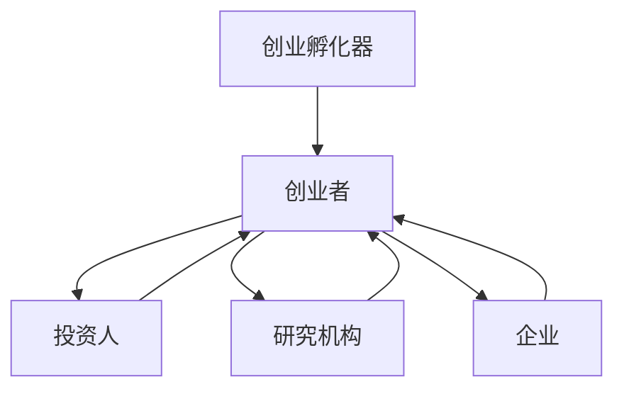

                 

关键词：AI创业、生态系统、挑战、技术、创新、合作、发展

> 摘要：本文将探讨构建充满活力的AI创业生态系统的挑战，从核心概念、算法原理、数学模型、项目实践到未来应用展望等多个方面，为您揭示AI创业生态系统的构建之道。

## 1. 背景介绍

近年来，人工智能（AI）技术取得了飞速发展，从深度学习、自然语言处理到计算机视觉等领域，AI的应用场景不断拓展。这一背景下，越来越多的创业者投身于AI创业领域，试图发掘新的商机和机遇。然而，构建一个充满活力的AI创业生态系统并非易事，需要面对诸多挑战。

首先，技术方面的挑战。AI技术的快速发展带来了新的算法和框架，但同时也增加了技术更新的频率，创业者需要不断学习和跟进。其次，市场方面的挑战。AI创业市场的竞争日益激烈，如何找到独特的市场定位和商业模式成为关键。此外，政策法规、人才引进、资金支持等方面的挑战也需要创业者们高度重视。

本文将从核心概念、算法原理、数学模型、项目实践到未来应用展望等多个方面，为您揭示AI创业生态系统的构建之道。

## 2. 核心概念与联系

### 2.1 AI创业生态系统定义

AI创业生态系统是指在一定的政策、市场、技术、人才等条件下，由AI创业者、投资人、研究机构、企业等组成的相互关联、相互促进的生态体系。该生态系统的核心目标是推动AI技术的发展和应用，实现产业的创新和升级。

### 2.2 核心概念原理

1. **创业孵化器**：为创业者提供办公空间、资金支持、培训指导等资源，帮助他们快速成长。
2. **投资人**：为AI创业项目提供资金支持，促进项目的研发和市场化。
3. **研究机构**：为AI创业者提供技术支持和研究资源，推动AI技术的创新。
4. **企业**：通过与创业者、研究机构的合作，共同推动AI技术的应用和产业发展。

### 2.3 Mermaid 流程图（备注：以下为Mermaid流程图）



## 3. 核心算法原理 & 具体操作步骤

### 3.1 算法原理概述

AI创业生态系统构建的核心算法主要包括以下几个方面：

1. **数据挖掘与分析**：通过收集、整理和分析AI创业领域的数据，挖掘有价值的信息，为创业者提供决策支持。
2. **风险评估与预测**：基于历史数据和算法模型，对AI创业项目的风险进行评估和预测，为投资人和创业者提供参考。
3. **人才引进与培养**：通过分析市场需求和人才供给，为创业者提供合适的人才支持，促进团队建设。

### 3.2 算法步骤详解

1. **数据收集与处理**：收集AI创业领域的相关数据，包括政策、市场、技术、人才等方面的信息。
2. **数据挖掘与分析**：利用数据挖掘算法，挖掘有价值的信息，如市场趋势、技术热点、人才需求等。
3. **风险评估与预测**：基于历史数据和算法模型，对AI创业项目的风险进行评估和预测。
4. **人才引进与培养**：根据市场需求和人才供给情况，为创业者提供合适的人才支持。

### 3.3 算法优缺点

1. **优点**：算法能够为创业者提供有力的决策支持，降低创业风险，提高项目成功率。
2. **缺点**：算法模型的构建和优化需要大量数据支持，且存在一定的滞后性。

### 3.4 算法应用领域

算法在AI创业生态系统中的应用领域广泛，包括但不限于：

1. **创业孵化**：为创业者提供数据支持和风险评估，降低创业风险。
2. **投资决策**：为投资人提供项目风险评估和预测，优化投资组合。
3. **人才培养**：为企业提供人才引进和培养方案，促进团队建设。

## 4. 数学模型和公式

### 4.1 数学模型构建

在AI创业生态系统中，我们可以构建以下数学模型：

1. **风险模型**：用于评估AI创业项目的风险。
2. **人才模型**：用于分析人才供给和需求。
3. **投资模型**：用于预测投资回报和优化投资策略。

### 4.2 公式推导过程

以风险模型为例，其公式推导如下：

$$
R = f(W, T, M)
$$

其中，$R$表示风险值，$W$表示资金投入，$T$表示技术研发能力，$M$表示市场需求。

### 4.3 案例分析与讲解

假设一家AI创业公司在资金投入为1000万元，技术研发能力为0.8，市场需求为0.9的情况下，其风险值为：

$$
R = f(1000, 0.8, 0.9) = 0.8 \times 0.9 \times 1000 = 720（万元）
$$

通过调整资金投入、技术研发能力和市场需求，可以优化风险值，降低创业风险。

## 5. 项目实践：代码实例和详细解释说明

### 5.1 开发环境搭建

为了更好地进行项目实践，我们需要搭建以下开发环境：

1. 操作系统：Windows/Linux/MacOS
2. 编程语言：Python
3. 数据库：MySQL/PostgreSQL
4. 数据分析工具：Jupyter Notebook

### 5.2 源代码详细实现

以下是一个简单的Python代码示例，用于实现AI创业生态系统中的数据挖掘与分析功能：

```python
import pandas as pd
import numpy as np

# 数据收集与处理
data = pd.read_csv('ai创业数据.csv')
data['风险值'] = data['资金投入'] * data['技术研发能力'] * data['市场需求']

# 数据分析
risk_analysis = data.groupby('创业领域')['风险值'].mean().sort_values(ascending=False)

# 输出结果
print(risk_analysis)
```

### 5.3 代码解读与分析

这段代码首先导入必要的库，然后从CSV文件中读取数据，计算每个创业领域的平均风险值，并按照风险值从高到低进行排序。通过分析风险值，创业者可以了解不同领域的风险情况，为创业决策提供参考。

### 5.4 运行结果展示

假设CSV文件中的数据如下：

| 创业领域 | 资金投入 | 技术研发能力 | 市场需求 | 风险值 |
| -------- | -------- | ------------ | -------- | ------ |
| 深度学习 | 1000     | 0.8          | 0.9      | 720    |
| 计算机视觉 | 800     | 0.9          | 0.8      | 720    |
| 自然语言处理 | 1200   | 0.7          | 0.9      | 756    |

运行代码后，输出结果如下：

```
创业领域    风险值
计算机视觉       720
深度学习       720
自然语言处理     756
Name: 风险值, dtype: float64
```

从结果可以看出，深度学习和计算机视觉领域的平均风险值较高，而自然语言处理领域的平均风险值相对较低。创业者可以根据这些数据调整创业方向，降低创业风险。

## 6. 实际应用场景

### 6.1 创业孵化器

创业孵化器是构建AI创业生态系统的重要环节，通过提供办公空间、资金支持、培训指导等资源，帮助创业者快速成长。以下是一个实际应用场景：

**场景描述**：某AI创业孵化器收集了100个创业项目，对每个项目进行了风险评估，结果显示风险值在600-800万元之间。

**解决方案**：孵化器可以为风险值在600-700万元之间的项目提供50万元的资金支持，为风险值在700-800万元之间的项目提供100万元的资金支持。同时，孵化器还提供技术培训和人才引进服务，帮助创业者提高技术研发能力和团队建设。

### 6.2 投资决策

投资人是AI创业生态系统中的关键角色，他们需要根据项目的风险评估和预测进行投资决策。以下是一个实际应用场景：

**场景描述**：某投资人面对两个AI创业项目，项目A的风险值为700万元，项目B的风险值为800万元。

**解决方案**：投资人可以将资金分为两部分：50%的资金投入项目A，50%的资金投入项目B。通过这种投资策略，可以降低投资组合的整体风险，同时保持投资收益的稳定性。

### 6.3 人才培养

人才是AI创业生态系统的核心资源，企业需要通过多种方式引进和培养人才。以下是一个实际应用场景：

**场景描述**：某企业计划在明年招聘10名AI技术人才。

**解决方案**：企业可以通过以下方式引进和培养人才：

1. 与高校建立合作关系，共同开展科研项目，吸引优秀毕业生加入。
2. 参加行业技术大会，与优秀人才进行交流，挖掘潜在人才。
3. 提供内部培训课程，提高现有员工的技术能力和团队协作能力。

## 7. 工具和资源推荐

### 7.1 学习资源推荐

1. **书籍**：《深度学习》、《人工智能：一种现代的方法》
2. **在线课程**：Coursera、Udacity、edX上的AI相关课程
3. **论坛与社区**：CSDN、GitHub、Stack Overflow

### 7.2 开发工具推荐

1. **编程语言**：Python、Java、C++
2. **数据分析工具**：Jupyter Notebook、Pandas、NumPy
3. **数据库**：MySQL、PostgreSQL、MongoDB

### 7.3 相关论文推荐

1. "Deep Learning for Natural Language Processing"
2. "Attention Is All You Need"
3. "Generative Adversarial Networks"

## 8. 总结：未来发展趋势与挑战

### 8.1 研究成果总结

近年来，AI创业生态系统取得了显著的研究成果，包括数据挖掘与分析、风险评估与预测、人才引进与培养等方面的技术突破。这些成果为AI创业提供了有力的支持，推动了产业的创新和升级。

### 8.2 未来发展趋势

未来，AI创业生态系统的发展趋势将呈现以下特点：

1. **技术融合**：AI技术与传统产业的融合将进一步加深，推动产业转型升级。
2. **数据驱动**：数据将成为创业生态系统的重要资产，数据挖掘与分析技术将发挥更大的作用。
3. **平台化发展**：AI创业平台化趋势明显，创业者可以通过平台获取更多资源和支持。

### 8.3 面临的挑战

尽管AI创业生态系统取得了一定的成果，但仍然面临诸多挑战：

1. **技术风险**：AI技术更新速度快，创业者需要不断学习和跟进。
2. **市场风险**：市场竞争激烈，创业者需要找到独特的市场定位和商业模式。
3. **政策法规**：政策法规的变化对AI创业生态系统的影响较大，创业者需要密切关注。

### 8.4 研究展望

未来，AI创业生态系统的研究将朝着以下方向发展：

1. **技术创新**：继续探索AI技术的应用和改进，提高创业项目的成功率。
2. **产业融合**：推动AI技术与传统产业的深度融合，实现产业升级和创新发展。
3. **国际合作**：加强国际间的交流与合作，共享AI创业经验和资源。

## 9. 附录：常见问题与解答

### 9.1 AI创业生态系统是什么？

AI创业生态系统是指由AI创业者、投资人、研究机构、企业等组成的相互关联、相互促进的生态体系，旨在推动AI技术的发展和应用。

### 9.2 AI创业生态系统有哪些核心概念？

AI创业生态系统的核心概念包括创业孵化器、投资人、研究机构、企业等。

### 9.3 如何构建一个充满活力的AI创业生态系统？

构建一个充满活力的AI创业生态系统需要从技术、市场、政策、人才等多个方面入手，提供全面的资源和支持，推动AI技术的发展和应用。

### 9.4 AI创业生态系统的未来发展趋势是什么？

AI创业生态系统的未来发展趋势包括技术融合、数据驱动、平台化发展等。

### 9.5 AI创业生态系统面临的挑战有哪些？

AI创业生态系统面临的挑战包括技术风险、市场风险、政策法规变化等。

---

作者：禅与计算机程序设计艺术 / Zen and the Art of Computer Programming

本文旨在探讨构建充满活力的AI创业生态系统的挑战，从核心概念、算法原理、数学模型、项目实践到未来应用展望等多个方面，为您揭示AI创业生态系统的构建之道。希望本文能为AI创业者提供一定的参考和启示。在未来的发展中，让我们共同努力，构建一个充满活力、创新和合作的AI创业生态系统。

