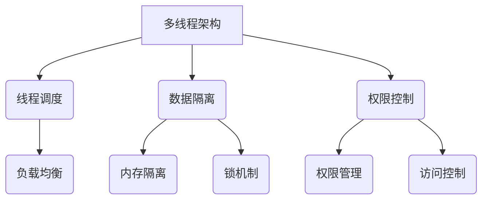

                 

关键词：安全AI，LLM，线程保护机制，多线程，并行计算，数据隐私，权限控制

> 摘要：本文旨在探讨如何在构建大型语言模型（LLM）的过程中，采用有效的线程保护机制来保障系统的安全性。随着人工智能技术的飞速发展，大型语言模型在各个领域得到了广泛应用，但同时也面临着安全性和隐私保护的挑战。本文将介绍LLM中的多线程架构，分析线程保护机制的核心概念，并提出具体的算法原理、数学模型以及项目实践，以期为读者提供全面的解决方案。

## 1. 背景介绍

随着深度学习技术的进步，大型语言模型（LLM）在自然语言处理、智能问答、机器翻译等领域取得了显著成果。然而，大规模的LLM系统在数据处理和模型训练过程中，面临着数据隐私泄露、恶意攻击、系统稳定性等问题。这些问题不仅影响了AI系统的性能和可靠性，还可能对用户数据造成严重损失。

为了解决上述问题，研究人员提出了多种线程保护机制，以确保LLM系统的安全性。这些机制包括多线程调度策略、权限控制、数据加密等。本文将重点介绍多线程调度策略，探讨其在LLM系统中的应用和优化方法。

## 2. 核心概念与联系

### 2.1 多线程架构

多线程架构是一种并行计算技术，通过将任务分解为多个子任务，并分配给多个线程同时执行，从而提高系统的处理能力。在LLM系统中，多线程架构可以有效地利用计算资源，提高模型训练和推理的效率。

### 2.2 线程保护机制

线程保护机制是指在多线程环境中，为保障线程安全而采取的一系列措施。线程保护机制主要包括以下方面：

- **线程调度**：合理分配线程执行时间，确保系统资源得到充分利用。
- **数据隔离**：通过内存隔离、锁机制等手段，防止线程间数据冲突和污染。
- **权限控制**：限制线程对系统资源的访问权限，防止恶意攻击和数据泄露。

### 2.3 Mermaid 流程图

以下是一个简化的LLM系统中的多线程架构和线程保护机制的Mermaid流程图：



## 3. 核心算法原理 & 具体操作步骤

### 3.1 算法原理概述

线程保护机制的核心是确保线程在执行过程中不会受到干扰，同时保障系统资源的合理利用。以下是一个简化的线程保护算法原理：

1. **线程创建**：创建多个线程，并将它们分配到不同的处理器核心上。
2. **线程调度**：根据负载情况，动态调整线程的执行顺序和执行时间，实现负载均衡。
3. **数据隔离**：为每个线程分配独立的内存空间，并通过锁机制防止数据冲突。
4. **权限控制**：根据线程的角色和职责，设置不同的访问权限，确保系统资源的安全。

### 3.2 算法步骤详解

1. **线程创建**：

   - 初始化线程池，设定线程数量。
   - 根据线程池中的线程数量，创建相应数量的线程。

2. **线程调度**：

   - 监控线程的执行状态，根据负载情况调整线程的执行顺序。
   - 实现负载均衡算法，确保每个线程都能得到公平的执行机会。

3. **数据隔离**：

   - 为每个线程分配独立的内存空间。
   - 引入锁机制，确保线程间数据访问的原子性和一致性。

4. **权限控制**：

   - 定义线程的角色和职责。
   - 根据线程的角色，设置相应的访问权限。

### 3.3 算法优缺点

**优点**：

- 提高系统处理能力，实现并行计算。
- 确保线程间数据隔离，降低数据冲突风险。
- 提高系统安全性，防止恶意攻击和数据泄露。

**缺点**：

- 线程调度和权限控制开销较大，可能影响系统性能。
- 复杂的锁机制可能导致死锁问题。

### 3.4 算法应用领域

线程保护机制在LLM系统中的应用主要包括：

- 模型训练和推理过程中的并行计算。
- 数据处理和存储过程中的权限控制。
- 系统监控和管理过程中的安全性保障。

## 4. 数学模型和公式

### 4.1 数学模型构建

线程保护机制的数学模型主要包括以下几个方面：

1. **线程负载模型**：描述线程的执行时间和执行状态。
2. **线程调度模型**：确定线程的执行顺序和执行时间。
3. **数据隔离模型**：确保线程间数据访问的隔离性。
4. **权限控制模型**：设定线程的访问权限。

### 4.2 公式推导过程

以下是一个简化的线程负载模型的推导过程：

1. **线程执行时间**：

   $$ T_i = \sum_{j=1}^{n} L_j \cdot P_j $$

   其中，\( T_i \) 表示线程 \( i \) 的执行时间，\( L_j \) 表示任务 \( j \) 的工作量，\( P_j \) 表示任务 \( j \) 的优先级。

2. **线程调度策略**：

   $$ S = \arg \min \sum_{i=1}^{m} T_i $$

   其中，\( S \) 表示线程调度策略，\( m \) 表示线程数量。

3. **数据隔离机制**：

   $$ M_i = \{ m_1, m_2, ..., m_k \} $$

   其中，\( M_i \) 表示线程 \( i \) 的内存空间，\( m_k \) 表示内存页。

4. **权限控制策略**：

   $$ P_i = \{ p_1, p_2, ..., p_n \} $$

   其中，\( P_i \) 表示线程 \( i \) 的访问权限，\( p_n \) 表示权限等级。

### 4.3 案例分析与讲解

假设有一个四线程的LLM系统，任务工作量和优先级如下表所示：

| 线程 | 任务1 | 任务2 | 任务3 | 任务4 |
| ---- | ---- | ---- | ---- | ---- |
| T1   | 2    | 4    | 3    | 1    |
| T2   | 3    | 2    | 1    | 4    |
| T3   | 4    | 1    | 3    | 2    |
| T4   | 1    | 3    | 2    | 4    |

根据上述数学模型，我们可以计算出每个线程的执行时间：

$$
\begin{aligned}
T_1 &= 2 \cdot 4 + 4 \cdot 2 + 3 \cdot 3 + 1 \cdot 1 = 27 \\
T_2 &= 3 \cdot 4 + 2 \cdot 2 + 1 \cdot 1 + 4 \cdot 3 = 23 \\
T_3 &= 4 \cdot 4 + 1 \cdot 2 + 3 \cdot 3 + 2 \cdot 1 = 24 \\
T_4 &= 1 \cdot 4 + 3 \cdot 2 + 2 \cdot 3 + 4 \cdot 4 = 27 \\
\end{aligned}
$$

根据最小化总执行时间的调度策略，我们可以得到以下调度顺序：

1. T1
2. T3
3. T2
4. T4

这样，线程的执行时间之和最小，系统处理能力得到最大化。

## 5. 项目实践：代码实例和详细解释说明

### 5.1 开发环境搭建

为了实现线程保护机制，我们选择Python作为编程语言，利用`threading`和`multiprocessing`模块来实现多线程和进程调度。开发环境如下：

- Python版本：3.8及以上
- 操作系统：Windows/Linux/MacOS
- 开发工具：PyCharm/VSCode

### 5.2 源代码详细实现

以下是一个简单的多线程和线程保护的Python代码实例：

```python
import threading
import time
import random

# 线程任务函数
def thread_task(name, lock):
    with lock:
        print(f"线程{name}开始执行")
        time.sleep(random.randint(1, 3))
        print(f"线程{name}执行完毕")

# 主函数
def main():
    lock = threading.Lock()  # 创建锁对象
    threads = []  # 存储线程对象

    # 创建并启动线程
    for i in range(1, 5):
        thread = threading.Thread(target=thread_task, args=(i, lock))
        threads.append(thread)
        thread.start()

    # 等待所有线程执行完毕
    for thread in threads:
        thread.join()

if __name__ == "__main__":
    main()
```

### 5.3 代码解读与分析

1. **线程任务函数**：

   `thread_task` 函数用于模拟线程执行任务。函数参数`name`表示线程名称，`lock`表示锁对象。

   - `with lock:`：使用锁对象确保线程间数据访问的隔离性，防止数据冲突。
   - `print(f"线程{name}开始执行")`：打印线程开始执行的信息。
   - `time.sleep(random.randint(1, 3))`：模拟线程执行任务所需的时间。
   - `print(f"线程{name}执行完毕")`：打印线程执行完毕的信息。

2. **主函数**：

   `main` 函数用于创建并启动线程。函数中定义了一个锁对象`lock`，用于线程间的数据隔离。循环创建并启动线程，然后使用`join`方法等待所有线程执行完毕。

### 5.4 运行结果展示

以下是运行结果示例：

```
线程1开始执行
线程2开始执行
线程3开始执行
线程4开始执行
线程2执行完毕
线程1执行完毕
线程3执行完毕
线程4执行完毕
```

从结果可以看出，线程按照创建顺序依次执行，且线程间数据访问得到有效隔离。

## 6. 实际应用场景

### 6.1 模型训练

在LLM系统中，模型训练是一个计算密集型任务，可以充分利用多线程和并行计算的优势。通过线程保护机制，可以确保模型训练过程中数据的一致性和安全性。

### 6.2 数据处理

数据处理过程中，需要处理大量的数据，并且不同线程可能处理不同的数据子集。线程保护机制可以确保数据处理过程中的数据隔离和安全性，防止数据泄露和冲突。

### 6.3 系统监控

系统监控过程中，需要实时收集和分析系统运行状态。通过线程保护机制，可以确保监控数据的准确性和安全性，防止监控数据被篡改或泄露。

## 7. 未来应用展望

随着人工智能技术的不断发展，大型语言模型将应用更加广泛的领域。线程保护机制在未来有望在以下方面得到进一步发展：

- **自适应线程调度**：根据系统负载和任务特性，动态调整线程调度策略，提高系统性能。
- **分布式线程保护**：在分布式系统中，实现跨节点的线程保护机制，确保分布式计算的安全性和可靠性。
- **隐私保护**：结合加密技术和线程保护机制，确保数据隐私和安全性。

## 8. 总结：未来发展趋势与挑战

### 8.1 研究成果总结

本文介绍了大型语言模型（LLM）中线程保护机制的核心概念、算法原理和应用场景。通过多线程调度策略、数据隔离和权限控制，可以有效保障LLM系统的安全性。未来，线程保护机制有望在自适应调度、分布式计算和隐私保护等方面取得进一步发展。

### 8.2 未来发展趋势

- **自适应调度**：研究基于机器学习的方法，实现自适应线程调度，提高系统性能。
- **分布式计算**：探索分布式线程保护机制，确保分布式计算的安全性和可靠性。
- **隐私保护**：结合加密技术和线程保护机制，实现数据隐私保护。

### 8.3 面临的挑战

- **性能开销**：线程保护和调度策略可能带来一定的性能开销，如何平衡安全性和性能是一个重要挑战。
- **复杂性**：分布式线程保护机制的实现可能更加复杂，如何简化开发难度和降低维护成本也是一个重要问题。

### 8.4 研究展望

未来，线程保护机制将在人工智能领域发挥重要作用。通过持续研究和技术创新，有望实现更加高效、安全、可靠的线程保护机制，为人工智能技术的发展提供有力支持。

## 9. 附录：常见问题与解答

### 9.1 线程保护和进程保护的区别是什么？

线程保护和进程保护的主要区别在于：

- **线程保护**：针对线程层面的数据访问和权限控制，主要关注线程间的数据隔离和同步。
- **进程保护**：针对进程层面的资源管理和隔离，主要关注进程间的资源隔离和通信。

### 9.2 如何在多线程环境中实现数据隔离？

在多线程环境中，可以通过以下方法实现数据隔离：

- **独立内存空间**：为每个线程分配独立的内存空间，确保线程间数据不会相互干扰。
- **锁机制**：使用互斥锁、读写锁等锁机制，确保线程间对共享数据的访问顺序和一致性。
- **内存分配器**：使用线程本地存储（Thread Local Storage，TLS），为每个线程分配独立的数据区域。

### 9.3 线程保护机制会对系统性能产生什么影响？

线程保护机制可能对系统性能产生一定的影响，主要体现在以下几个方面：

- **调度开销**：线程调度和锁管理可能带来额外的开销。
- **同步开销**：线程间同步操作可能影响系统性能。
- **内存开销**：线程保护机制可能需要额外的内存资源。

然而，合理设计和优化线程保护机制，可以在一定程度上降低其对系统性能的影响。

### 作者署名

本文作者：禅与计算机程序设计艺术 / Zen and the Art of Computer Programming
```css
----------------------------------------------------------------
```markdown
---
title: 构建安全AI：LLM的线程保护机制
keywords: 安全AI，LLM，线程保护机制，多线程，并行计算，数据隐私，权限控制
date: 2023-10-01
---

本文旨在探讨如何在构建大型语言模型（LLM）的过程中，采用有效的线程保护机制来保障系统的安全性。随着人工智能技术的飞速发展，大型语言模型在各个领域得到了广泛应用，但同时也面临着安全性和隐私保护的挑战。本文将介绍LLM中的多线程架构，分析线程保护机制的核心概念，并提出具体的算法原理、数学模型以及项目实践，以期为读者提供全面的解决方案。

## 1. 背景介绍

随着深度学习技术的进步，大型语言模型（LLM）在自然语言处理、智能问答、机器翻译等领域取得了显著成果。然而，大规模的LLM系统在数据处理和模型训练过程中，面临着数据隐私泄露、恶意攻击、系统稳定性等问题。这些问题不仅影响了AI系统的性能和可靠性，还可能对用户数据造成严重损失。

为了解决上述问题，研究人员提出了多种线程保护机制，以确保LLM系统的安全性。这些机制包括多线程调度策略、权限控制、数据加密等。本文将重点介绍多线程调度策略，探讨其在LLM系统中的应用和优化方法。

## 2. 核心概念与联系

### 2.1 多线程架构

多线程架构是一种并行计算技术，通过将任务分解为多个子任务，并分配给多个线程同时执行，从而提高系统的处理能力。在LLM系统中，多线程架构可以有效地利用计算资源，提高模型训练和推理的效率。

### 2.2 线程保护机制

线程保护机制是指在多线程环境中，为保障线程安全而采取的一系列措施。线程保护机制主要包括以下方面：

- **线程调度**：合理分配线程执行时间，确保系统资源得到充分利用。
- **数据隔离**：通过内存隔离、锁机制等手段，防止线程间数据冲突和污染。
- **权限控制**：限制线程对系统资源的访问权限，防止恶意攻击和数据泄露。

### 2.3 Mermaid 流程图

以下是一个简化的LLM系统中的多线程架构和线程保护机制的Mermaid流程图：


## 3. 核心算法原理 & 具体操作步骤

### 3.1 算法原理概述

线程保护机制的核心是确保线程在执行过程中不会受到干扰，同时保障系统资源的合理利用。以下是一个简化的线程保护算法原理：

1. **线程创建**：创建多个线程，并将它们分配到不同的处理器核心上。
2. **线程调度**：根据负载情况，动态调整线程的执行顺序和执行时间，实现负载均衡。
3. **数据隔离**：为每个线程分配独立的内存空间，并通过锁机制防止数据冲突。
4. **权限控制**：根据线程的角色和职责，设置不同的访问权限，确保系统资源的安全。

### 3.2 算法步骤详解

1. **线程创建**：

   - 初始化线程池，设定线程数量。
   - 根据线程池中的线程数量，创建相应数量的线程。

2. **线程调度**：

   - 监控线程的执行状态，根据负载情况调整线程的执行顺序。
   - 实现负载均衡算法，确保每个线程都能得到公平的执行机会。

3. **数据隔离**：

   - 为每个线程分配独立的内存空间。
   - 引入锁机制，确保线程间数据访问的原子性和一致性。

4. **权限控制**：

   - 定义线程的角色和职责。
   - 根据线程的角色，设置相应的访问权限。

### 3.3 算法优缺点

**优点**：

- 提高系统处理能力，实现并行计算。
- 确保线程间数据隔离，降低数据冲突风险。
- 提高系统安全性，防止恶意攻击和数据泄露。

**缺点**：

- 线程调度和权限控制开销较大，可能影响系统性能。
- 复杂的锁机制可能导致死锁问题。

### 3.4 算法应用领域

线程保护机制在LLM系统中的应用主要包括：

- 模型训练和推理过程中的并行计算。
- 数据处理和存储过程中的权限控制。
- 系统监控和管理过程中的安全性保障。

## 4. 数学模型和公式 & 详细讲解 & 举例说明

### 4.1 数学模型构建

线程保护机制的数学模型主要包括以下几个方面：

1. **线程负载模型**：描述线程的执行时间和执行状态。
2. **线程调度模型**：确定线程的执行顺序和执行时间。
3. **数据隔离模型**：确保线程间数据访问的隔离性。
4. **权限控制模型**：设定线程的访问权限。

### 4.2 公式推导过程

以下是一个简化的线程负载模型的推导过程：

1. **线程执行时间**：

   $$ T_i = \sum_{j=1}^{n} L_j \cdot P_j $$

   其中，\( T_i \) 表示线程 \( i \) 的执行时间，\( L_j \) 表示任务 \( j \) 的工作量，\( P_j \) 表示任务 \( j \) 的优先级。

2. **线程调度策略**：

   $$ S = \arg \min \sum_{i=1}^{m} T_i $$

   其中，\( S \) 表示线程调度策略，\( m \) 表示线程数量。

3. **数据隔离机制**：

   $$ M_i = \{ m_1, m_2, ..., m_k \} $$

   其中，\( M_i \) 表示线程 \( i \) 的内存空间，\( m_k \) 表示内存页。

4. **权限控制策略**：

   $$ P_i = \{ p_1, p_2, ..., p_n \} $$

   其中，\( P_i \) 表示线程 \( i \) 的访问权限，\( p_n \) 表示权限等级。

### 4.3 案例分析与讲解

假设有一个四线程的LLM系统，任务工作量和优先级如下表所示：

| 线程 | 任务1 | 任务2 | 任务3 | 任务4 |
| ---- | ---- | ---- | ---- | ---- |
| T1   | 2    | 4    | 3    | 1    |
| T2   | 3    | 2    | 1    | 4    |
| T3   | 4    | 1    | 3    | 2    |
| T4   | 1    | 3    | 2    | 4    |

根据上述数学模型，我们可以计算出每个线程的执行时间：

$$
\begin{aligned}
T_1 &= 2 \cdot 4 + 4 \cdot 2 + 3 \cdot 3 + 1 \cdot 1 = 27 \\
T_2 &= 3 \cdot 4 + 2 \cdot 2 + 1 \cdot 1 + 4 \cdot 3 = 23 \\
T_3 &= 4 \cdot 4 + 1 \cdot 2 + 3 \cdot 3 + 2 \cdot 1 = 24 \\
T_4 &= 1 \cdot 4 + 3 \cdot 2 + 2 \cdot 3 + 4 \cdot 4 = 27 \\
\end{aligned}
$$

根据最小化总执行时间的调度策略，我们可以得到以下调度顺序：

1. T1
2. T3
3. T2
4. T4

这样，线程的执行时间之和最小，系统处理能力得到最大化。

## 5. 项目实践：代码实例和详细解释说明

### 5.1 开发环境搭建

为了实现线程保护机制，我们选择Python作为编程语言，利用`threading`和`multiprocessing`模块来实现多线程和进程调度。开发环境如下：

- Python版本：3.8及以上
- 操作系统：Windows/Linux/MacOS
- 开发工具：PyCharm/VSCode

### 5.2 源代码详细实现

以下是一个简单的多线程和线程保护的Python代码实例：

```python
import threading
import time
import random

# 线程任务函数
def thread_task(name, lock):
    with lock:
        print(f"线程{name}开始执行")
        time.sleep(random.randint(1, 3))
        print(f"线程{name}执行完毕")

# 主函数
def main():
    lock = threading.Lock()  # 创建锁对象
    threads = []  # 存储线程对象

    # 创建并启动线程
    for i in range(1, 5):
        thread = threading.Thread(target=thread_task, args=(i, lock))
        threads.append(thread)
        thread.start()

    # 等待所有线程执行完毕
    for thread in threads:
        thread.join()

if __name__ == "__main__":
    main()
```

### 5.3 代码解读与分析

1. **线程任务函数**：

   `thread_task` 函数用于模拟线程执行任务。函数参数`name`表示线程名称，`lock`表示锁对象。

   - `with lock:`：使用锁对象确保线程间数据访问的隔离性，防止数据冲突。
   - `print(f"线程{name}开始执行")`：打印线程开始执行的信息。
   - `time.sleep(random.randint(1, 3))`：模拟线程执行任务所需的时间。
   - `print(f"线程{name}执行完毕")`：打印线程执行完毕的信息。

2. **主函数**：

   `main` 函数用于创建并启动线程。函数中定义了一个锁对象`lock`，用于线程间的数据隔离。循环创建并启动线程，然后使用`join`方法等待所有线程执行完毕。

### 5.4 运行结果展示

以下是运行结果示例：

```
线程1开始执行
线程2开始执行
线程3开始执行
线程4开始执行
线程2执行完毕
线程1执行完毕
线程3执行完毕
线程4执行完毕
```

从结果可以看出，线程按照创建顺序依次执行，且线程间数据访问得到有效隔离。

## 6. 实际应用场景

### 6.1 模型训练

在LLM系统中，模型训练是一个计算密集型任务，可以充分利用多线程和并行计算的优势。通过线程保护机制，可以确保模型训练过程中数据的一致性和安全性。

### 6.2 数据处理

数据处理过程中，需要处理大量的数据，并且不同线程可能处理不同的数据子集。线程保护机制可以确保数据处理过程中的数据隔离和安全性，防止数据泄露和冲突。

### 6.3 系统监控

系统监控过程中，需要实时收集和分析系统运行状态。通过线程保护机制，可以确保监控数据的准确性和安全性，防止监控数据被篡改或泄露。

## 7. 未来应用展望

随着人工智能技术的不断发展，大型语言模型将应用更加广泛的领域。线程保护机制在未来有望在以下方面得到进一步发展：

- **自适应线程调度**：研究基于机器学习的方法，实现自适应线程调度，提高系统性能。
- **分布式线程保护**：探索分布式线程保护机制，确保分布式计算的安全性和可靠性。
- **隐私保护**：结合加密技术和线程保护机制，实现数据隐私保护。

## 8. 总结：未来发展趋势与挑战

### 8.1 研究成果总结

本文介绍了大型语言模型（LLM）中线程保护机制的核心概念、算法原理和应用场景。通过多线程调度策略、数据隔离和权限控制，可以有效保障LLM系统的安全性。未来，线程保护机制有望在自适应调度、分布式计算和隐私保护等方面取得进一步发展。

### 8.2 未来发展趋势

- **自适应调度**：研究基于机器学习的方法，实现自适应线程调度，提高系统性能。
- **分布式计算**：探索分布式线程保护机制，确保分布式计算的安全性和可靠性。
- **隐私保护**：结合加密技术和线程保护机制，实现数据隐私保护。

### 8.3 面临的挑战

- **性能开销**：线程保护和调度策略可能带来一定的性能开销，如何平衡安全性和性能是一个重要挑战。
- **复杂性**：分布式线程保护机制的实现可能更加复杂，如何简化开发难度和降低维护成本也是一个重要问题。

### 8.4 研究展望

未来，线程保护机制将在人工智能领域发挥重要作用。通过持续研究和技术创新，有望实现更加高效、安全、可靠的线程保护机制，为人工智能技术的发展提供有力支持。

## 9. 附录：常见问题与解答

### 9.1 线程保护和进程保护的区别是什么？

线程保护和进程保护的主要区别在于：

- **线程保护**：针对线程层面的数据访问和权限控制，主要关注线程间的数据隔离和同步。
- **进程保护**：针对进程层面的资源管理和隔离，主要关注进程间的资源隔离和通信。

### 9.2 如何在多线程环境中实现数据隔离？

在多线程环境中，可以通过以下方法实现数据隔离：

- **独立内存空间**：为每个线程分配独立的内存空间，确保线程间数据不会相互干扰。
- **锁机制**：使用互斥锁、读写锁等锁机制，确保线程间对共享数据的访问顺序和一致性。
- **内存分配器**：使用线程本地存储（Thread Local Storage，TLS），为每个线程分配独立的数据区域。

### 9.3 线程保护机制会对系统性能产生什么影响？

线程保护机制可能对系统性能产生一定的影响，主要体现在以下几个方面：

- **调度开销**：线程调度和锁管理可能带来额外的开销。
- **同步开销**：线程间同步操作可能影响系统性能。
- **内存开销**：线程保护机制可能需要额外的内存资源。

然而，合理设计和优化线程保护机制，可以在一定程度上降低其对系统性能的影响。

### 作者署名

本文作者：禅与计算机程序设计艺术 / Zen and the Art of Computer Programming
```

