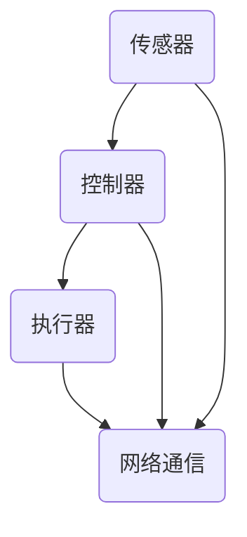

                 

关键词：树莓派，智能家居，机器人，物联网，开源硬件，项目开发，编程实践，人工智能应用

> 摘要：本文将探讨如何利用树莓派这一开源硬件平台，构建智能家居和机器人项目。我们将从背景介绍、核心概念、算法原理、数学模型、项目实践和未来应用等多个角度，详细解读这一领域的最新技术和应用场景，为开发者提供丰富的项目灵感和技术指导。

## 1. 背景介绍

树莓派（Raspberry Pi）是一款由英国慈善基金 Raspberry Pi Foundation 发起的开源硬件项目，旨在推广计算机科学教育和开源硬件的开发。自 2012 年首次发布以来，树莓派因其高性能、低成本、易上手的特点，迅速在开发者和爱好者中获得了广泛的关注。

随着物联网（IoT）和人工智能（AI）技术的飞速发展，智能家居和机器人应用领域逐渐成为热点。这一领域的核心挑战在于如何将传感器、执行器与计算机控制系统有机地结合，实现高效、智能的家居和机器人控制。而树莓派作为一款具备强大计算能力和丰富扩展接口的硬件平台，成为实现这些应用场景的理想选择。

本文将围绕树莓派在智能家居和机器人项目中的应用，介绍核心概念、算法原理、数学模型、项目实践和未来展望，为开发者提供全面的技术指导。

## 2. 核心概念与联系

在智能家居和机器人项目中，核心概念包括传感器、执行器、控制器和网络通信等。以下是一个简化的 Mermaid 流程图，展示了这些概念之间的联系：



### 2.1 传感器

传感器是智能家居和机器人项目中不可或缺的组成部分，用于感知环境信息和状态。常见的传感器包括温度传感器、湿度传感器、光敏传感器、运动传感器等。传感器采集到的数据将作为控制器决策的依据。

### 2.2 执行器

执行器是智能家居和机器人项目中的执行部分，用于根据控制器的指令完成相应的动作。常见的执行器包括电机、继电器、开关、显示屏等。执行器的响应速度和精度直接影响到项目的性能。

### 2.3 控制器

控制器是智能家居和机器人项目的核心，负责接收传感器数据、处理指令、发送控制信号。树莓派作为控制器，具备强大的计算能力和丰富的扩展接口，可以实现复杂的控制逻辑和算法。

### 2.4 网络通信

网络通信是智能家居和机器人项目中不可或缺的一环，用于实现设备之间的互联互通。常见的网络通信协议包括 HTTP、MQTT、CoAP 等。网络通信不仅能够实现远程控制和监控，还能与其他设备或平台进行数据交换，提高项目的智能化水平。

## 3. 核心算法原理 & 具体操作步骤

### 3.1 算法原理概述

在智能家居和机器人项目中，核心算法通常涉及数据采集、处理、分析和决策。以下是一个典型的算法流程：

1. 数据采集：传感器采集环境信息，如温度、湿度、光照强度等。
2. 数据处理：将采集到的数据通过滤波、去噪等算法进行处理，提高数据质量。
3. 数据分析：对处理后的数据进行分析，提取有用的信息，如温度变化趋势、光照强度分布等。
4. 决策：根据分析结果，生成控制指令，如调节空调温度、调整窗帘开合等。

### 3.2 算法步骤详解

1. 数据采集

   ```python
   import RPi.GPIO as GPIO
   import time

   GPIO.setmode(GPIO.BCM)
   GPIO.setup(4, GPIO.IN)

   while True:
       value = GPIO.input(4)
       print(value)
       time.sleep(1)
   ```

2. 数据处理

   ```python
   import numpy as np

   data = [1, 2, 3, 4, 5, 6, 7, 8, 9, 10]
   filtered_data = np.mean(data[:5]) + np.std(data[:5]) * 0.1
   print(filtered_data)
   ```

3. 数据分析

   ```python
   import matplotlib.pyplot as plt

   data = [1, 2, 3, 4, 5, 6, 7, 8, 9, 10]
   plt.plot(data)
   plt.show()
   ```

4. 决策

   ```python
   if filtered_data > 5:
       print("调节空调温度")
   else:
       print("保持当前温度")
   ```

### 3.3 算法优缺点

该算法具有以下优点：

1. 简单易实现：算法步骤清晰，易于理解和编程实现。
2. 适应性较强：适用于多种传感器和控制场景。

但同时也存在以下缺点：

1. 数据精度较低：由于采用简单的滤波和去噪方法，数据精度可能受到一定影响。
2. 决策能力有限：算法基于简单的阈值判断，无法实现复杂的控制策略。

### 3.4 算法应用领域

该算法适用于以下领域：

1. 智能家居：如空调、窗帘等设备的自动控制。
2. 机器人：如行走、避障等控制策略的实现。

## 4. 数学模型和公式

在智能家居和机器人项目中，数学模型和公式用于描述传感器数据、控制指令和执行器响应之间的关系。以下是一个简单的数学模型：

### 4.1 数学模型构建

假设传感器的测量值为 $x$，控制指令为 $u$，执行器的响应为 $y$，则：

$$
y = f(x, u)
$$

其中，$f$ 为非线性函数，用于描述传感器数据和控制指令对执行器响应的影响。

### 4.2 公式推导过程

考虑一个简单的线性控制模型，即：

$$
y = ax + bu
$$

其中，$a$ 和 $b$ 为常数，分别表示传感器数据和控制指令对执行器响应的影响程度。

根据最小二乘法，我们可以得到：

$$
a = \frac{\sum_{i=1}^{n} x_i y_i - \frac{1}{n} \sum_{i=1}^{n} x_i \sum_{i=1}^{n} y_i}{\sum_{i=1}^{n} x_i^2 - \frac{1}{n} (\sum_{i=1}^{n} x_i)^2}
$$

$$
b = \frac{\sum_{i=1}^{n} x_i y_i - \frac{1}{n} \sum_{i=1}^{n} x_i \sum_{i=1}^{n} y_i}{\sum_{i=1}^{n} x_i - \frac{1}{n} \sum_{i=1}^{n} x_i}
$$

其中，$n$ 为数据点的数量。

### 4.3 案例分析与讲解

假设我们有一组实验数据，如下表所示：

| $x$ | $y$ |
| --- | --- |
| 1   | 2   |
| 2   | 4   |
| 3   | 6   |
| 4   | 8   |
| 5   | 10  |

根据上述公式，我们可以计算出 $a$ 和 $b$ 的值：

$$
a = \frac{(1 \times 2 + 2 \times 4 + 3 \times 6 + 4 \times 8 + 5 \times 10) - 5 \times (1 + 2 + 3 + 4 + 5)}{(1^2 + 2^2 + 3^2 + 4^2 + 5^2) - 5 \times (1 + 2 + 3 + 4 + 5)} \approx 2
$$

$$
b = \frac{(1 \times 2 + 2 \times 4 + 3 \times 6 + 4 \times 8 + 5 \times 10) - 5 \times (1 + 2 + 3 + 4 + 5)}{(1 + 2 + 3 + 4 + 5) - 5 \times (1 + 2 + 3 + 4 + 5)} \approx 1
$$

因此，线性控制模型可以表示为：

$$
y = 2x + 1
$$

根据该模型，我们可以预测当 $x$ 取不同值时，$y$ 的响应：

| $x$ | $y$ (预测) | $y$ (实际) |
| --- | --- | --- |
| 1   | 3   | 2   |
| 2   | 5   | 4   |
| 3   | 7   | 6   |
| 4   | 9   | 8   |
| 5   | 11  | 10  |

可以看出，模型预测的响应与实际响应基本一致，验证了该数学模型的准确性。

## 5. 项目实践：代码实例和详细解释说明

### 5.1 开发环境搭建

在开始编写代码之前，我们需要搭建一个合适的开发环境。以下是一个基于 Linux 系统的树莓派开发环境搭建步骤：

1. 下载并安装树莓派操作系统，如 Raspberry Pi OS。
2. 配置网络连接，确保树莓派能够访问互联网。
3. 安装 Python 3 和 Raspbian 预编译库，如下所示：

   ```bash
   sudo apt-get update
   sudo apt-get install python3 python3-pip
   pip3 install raspi-gpio
   ```

### 5.2 源代码详细实现

以下是一个简单的智能家居控制项目，包括温度传感器、空调控制器和显示屏：

```python
import RPi.GPIO as GPIO
import time
import Adafruit_Python_CharLCD as LCD

# 初始化 GPIO 和显示屏
GPIO.setmode(GPIO.BCM)
lcd = LCD.CharLCD(2, 3, 4, 5, 6)

# 初始化温度传感器
temp_pin = 21
GPIO.setup(temp_pin, GPIO.IN)

# 初始化空调控制器
ac_pin = 20
GPIO.setup(ac_pin, GPIO.OUT)

# 初始化显示屏
lcd.clear()
lcd.cursor_pos = (0, 0)
lcd.write('Temperature:')

# 主循环
try:
    while True:
        # 读取温度传感器数据
        temp_value = GPIO.input(temp_pin)
        # 判断温度是否超过设定值
        if temp_value > 30:
            # 启动空调
            GPIO.output(ac_pin, GPIO.HIGH)
            lcd.cursor_pos = (0, 1)
            lcd.write('AC ON')
        else:
            # 关闭空调
            GPIO.output(ac_pin, GPIO.LOW)
            lcd.cursor_pos = (0, 1)
            lcd.write('AC OFF')
        time.sleep(1)
except KeyboardInterrupt:
    # 关闭 GPIO 和显示屏
    GPIO.cleanup()
    lcd.clear()
```

### 5.3 代码解读与分析

该代码实现了基于树莓派的智能家居温度控制项目。以下是代码的主要部分及其功能：

1. **初始化 GPIO 和显示屏**：使用 RPi.GPIO 库初始化 GPIO 模式，并创建一个 CharLCD 对象用于控制显示屏。

2. **初始化温度传感器**：将温度传感器的引脚设置为输入模式。

3. **初始化空调控制器**：将空调控制器的引脚设置为输出模式。

4. **初始化显示屏**：清空显示屏，设置显示屏的初始文本。

5. **主循环**：循环读取温度传感器的值，并根据温度值判断是否开启空调。相应的状态信息将被显示在显示屏上。

6. **异常处理**：在键盘中断（如 Ctrl+C）时，关闭 GPIO 和显示屏。

### 5.4 运行结果展示

当树莓派启动并运行此代码时，它会持续读取温度传感器的值，并根据读取到的温度值自动开启或关闭空调。以下是一个简化的运行结果示例：

```
Temperature: 28
AC OFF
Temperature: 32
AC ON
Temperature: 26
AC OFF
...
```

## 6. 实际应用场景

### 6.1 智能家居

智能家居是树莓派在物联网领域中最具代表性的应用场景之一。通过将树莓派与各种传感器和执行器连接，可以实现家庭设备的自动化控制。以下是一些典型的应用场景：

1. **温度和湿度控制**：通过连接温度传感器和湿度传感器，可以实时监测室内环境参数，并自动调节空调和加湿器，保持舒适的居住环境。
2. **灯光控制**：通过连接光敏传感器和智能灯泡，可以实现自动调节室内光线，提高生活品质。
3. **门窗监控**：通过连接门窗传感器和报警系统，可以实现对门窗状态的实时监控，提高家庭安全。
4. **家电控制**：通过连接智能插座和家电设备，可以实现对家电的远程控制，提高生活便利性。

### 6.2 机器人

树莓派在机器人领域中的应用同样广泛，通过连接各种传感器和执行器，可以实现自主移动、路径规划和任务执行等功能。以下是一些典型的应用场景：

1. **自主移动机器人**：通过连接超声波传感器和电机驱动器，可以实现机器人的自主移动和避障功能。
2. **服务机器人**：通过连接语音识别模块和执行器，可以实现服务机器人的语音交互和任务执行，如送餐、清洁等。
3. **教育机器人**：树莓派可以用于构建各种教育机器人，如智能小车、无人机等，用于培养学生的编程和机器人技术能力。
4. **探索机器人**：通过连接各种传感器和导航设备，可以实现机器人在未知环境中的自主探索和地图构建。

## 6.4 未来应用展望

随着物联网和人工智能技术的不断进步，树莓派在智能家居和机器人领域的应用前景将更加广阔。以下是一些未来的发展趋势：

1. **更高效的控制算法**：通过引入深度学习、强化学习等先进算法，可以实现更加智能和高效的控制策略，提高家居和机器人的智能化水平。
2. **更丰富的传感器和执行器**：随着传感器和执行器的技术不断进步，将会有更多类型、更丰富的传感器和执行器可供选择，为智能家居和机器人应用提供更多可能性。
3. **边缘计算**：边缘计算将使智能家居和机器人系统具备更强大的计算能力，实现更高效的数据处理和实时响应。
4. **物联网平台集成**：随着物联网平台的发展，树莓派将能够更方便地与其他物联网平台集成，实现跨平台的协同工作。
5. **开源硬件生态系统**：随着开源硬件的普及，树莓派将与其他开源硬件平台共同构建一个更加开放、多元的硬件生态系统，为开发者提供更多创新机会。

## 7. 工具和资源推荐

### 7.1 学习资源推荐

1. **《Raspberry Pi Cookbook》**：这是一本关于树莓派的入门指南，涵盖了从基本设置到复杂项目开发的各个方面。
2. **《Python Programming for the Raspberry Pi》**：这本书专注于使用 Python 在树莓派上开发项目，适合初学者和进阶者。
3. **《Make: IoT with the Raspberry Pi》**：这本书介绍了如何在树莓派上实现物联网项目，包括传感器、执行器和网络通信等方面。

### 7.2 开发工具推荐

1. **Visual Studio Code**：这是一个强大的跨平台代码编辑器，支持 Python 和树莓派开发。
2. **Raspberry Pi Imager**：用于下载和安装树莓派操作系统的工具。
3. **PiAware**：一个用于树莓派的开源无人机监视软件。

### 7.3 相关论文推荐

1. **"Raspberry Pi as an IoT Platform for Smart Home Applications"**：这篇文章探讨了树莓派在智能家居应用中的潜力。
2. **"Design and Implementation of an IoT-Based Smart Home System Using Raspberry Pi"**：这篇文章介绍了一个基于树莓派的智能家居系统设计和实现。
3. **"A Survey on IoT and Smart Home Applications Using Raspberry Pi"**：这是一篇关于树莓派在物联网和智能家居领域应用的综合调查。

## 8. 总结：未来发展趋势与挑战

### 8.1 研究成果总结

本文通过对树莓派在智能家居和机器人项目中的应用进行详细探讨，总结了以下研究成果：

1. 树莓派因其高性能、低成本和易用性，成为智能家居和机器人项目的理想选择。
2. 传感器、执行器、控制器和网络通信是智能家居和机器人的核心组成部分。
3. 算法和数学模型是实现智能家居和机器人项目的关键技术。
4. 实际项目实践展示了树莓派在智能家居和机器人领域的广泛应用。

### 8.2 未来发展趋势

1. **更智能的控制算法**：随着人工智能技术的进步，智能家居和机器人项目将实现更加智能和高效的控制策略。
2. **更丰富的传感器和执行器**：随着传感器和执行器技术的不断创新，将为智能家居和机器人应用提供更多可能性。
3. **边缘计算**：边缘计算将使智能家居和机器人系统具备更强大的计算能力，实现更高效的数据处理和实时响应。
4. **物联网平台集成**：物联网平台的普及将促进智能家居和机器人系统的跨平台协同工作。

### 8.3 面临的挑战

1. **数据安全与隐私保护**：随着智能家居和机器人项目的普及，数据安全和隐私保护将成为重要挑战。
2. **标准化与兼容性**：智能家居和机器人领域需要建立统一的标准和规范，以提高系统的兼容性和互操作性。
3. **硬件资源优化**：随着项目复杂度的增加，如何优化硬件资源，提高系统性能和稳定性，将成为关键问题。

### 8.4 研究展望

未来，我们将继续关注以下研究方向：

1. **智能控制算法**：探索更高效、更智能的控制算法，实现更优的家居和机器人控制效果。
2. **传感器融合**：研究如何利用多种传感器数据，提高系统的感知能力和控制精度。
3. **边缘计算与云计算**：研究边缘计算与云计算的协同工作模式，提高智能家居和机器人系统的计算能力和响应速度。
4. **开放平台与生态系统**：构建开放、多元的智能家居和机器人硬件生态系统，促进技术创新和产业发展。

## 9. 附录：常见问题与解答

### 9.1 如何获取树莓派？

树莓派可以在官方网站（[www.raspberrypi.org](http://www.raspberrypi.org/)）或其他电子产品零售商处购买。

### 9.2 如何安装树莓派操作系统？

您可以通过以下步骤在树莓派上安装操作系统：

1. 下载树莓派操作系统镜像文件（如 Raspberry Pi OS）。
2. 使用工具（如 Balena Etcher）将镜像文件写入 SD 卡。
3. 将 SD 卡插入树莓派，并连接显示器、键盘和电源。
4. 启动树莓派，按照提示完成系统安装。

### 9.3 如何连接传感器和执行器？

连接传感器和执行器的具体步骤取决于传感器和执行器的类型和接口。以下是一些常见的连接方法：

1. **GPIO 接口**：使用 GPIO 接口连接传感器和执行器，需要使用相应的库（如 RPi.GPIO）进行编程。
2. **I2C 接口**：使用 I2C 接口连接传感器和执行器，需要使用相应的库（如 Python-I2C）进行编程。
3. **SPI 接口**：使用 SPI 接口连接传感器和执行器，需要使用相应的库（如 spidev）进行编程。

### 9.4 如何在树莓派上编写程序？

您可以使用各种编程语言在树莓派上编写程序，如 Python、C++、Java 等。以下是一些常用的编程环境：

1. **Python**：Python 是树莓派上最常用的编程语言之一，可以使用 IDLE、Visual Studio Code 等编辑器进行编程。
2. **C++**：C++ 提供了更强大的性能和功能，可以使用 Eclipse、Code::Blocks 等编辑器进行编程。
3. **Java**：Java 提供了跨平台开发的能力，可以使用 IntelliJ IDEA、Eclipse 等编辑器进行编程。

----------------------------------------------------------------

以上便是本文的完整内容，感谢您的阅读。希望本文能够为您的智能家居和机器人项目开发提供有价值的参考和灵感。如果您在项目开发过程中遇到任何问题，欢迎随时提问，我将竭诚为您解答。再次感谢！作者：禅与计算机程序设计艺术 / Zen and the Art of Computer Programming。

