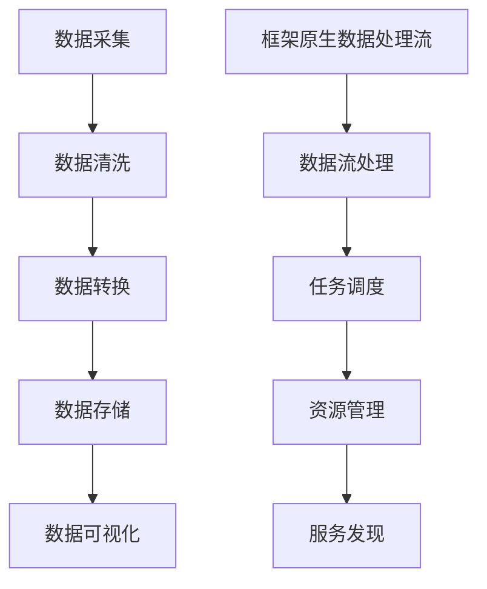

                 

关键词：数据处理流，框架原生，数据连接，编程架构，数据处理框架，数据管道，数据处理系统，数据处理引擎

> 摘要：本文将探讨框架原生数据处理流的本质、设计原则、实现方式以及在实际应用中的优势与挑战。通过深入分析数据处理流的核心概念、算法原理、数学模型和项目实践，我们旨在为读者提供一个全面而深入的理解，帮助他们在数据处理领域取得突破。

## 1. 背景介绍

在信息技术飞速发展的今天，数据处理已经成为了各个行业不可或缺的核心能力。无论是大数据分析、机器学习，还是实时数据流处理，数据处理流都扮演着至关重要的角色。然而，随着数据量的不断膨胀和数据类型的日益多样化，传统的数据处理方法已经无法满足现代应用的需求。

为了应对这些挑战，程序员和架构师们开始探索框架原生的数据处理流。框架原生数据处理流是一种基于特定编程框架（如Apache Kafka、Apache Flink等）的、模块化和可扩展的数据处理架构。它能够有效地处理大规模数据，并支持多种数据处理模式，包括批处理、流处理和实时分析。

本文将围绕框架原生数据处理流展开，探讨其核心概念、算法原理、数学模型以及实际应用。希望通过这篇文章，读者能够对数据处理流有一个全面而深入的理解，从而在实际项目中更好地应用这一技术。

## 2. 核心概念与联系

### 2.1 数据处理流的定义

数据处理流（Data Processing Pipeline）是指一系列数据处理操作的组合，它们按照一定的顺序执行，用于处理和转换数据。数据处理流通常包括数据采集、数据清洗、数据转换、数据存储和数据可视化等步骤。

### 2.2 框架原生的定义

框架原生（Framework-Native）是指在特定的编程框架或平台下进行设计和开发，充分利用框架提供的功能和服务，以实现高效、可扩展和模块化的解决方案。

### 2.3 数据处理流与框架原生的联系

框架原生数据处理流是将数据处理流与特定编程框架（如Apache Kafka、Apache Flink等）相结合的一种设计模式。它充分利用了框架提供的功能，如数据流处理、任务调度、资源管理和服务发现等，实现了数据处理的高效性、可扩展性和模块化。

### 2.4 Mermaid 流程图



在这个Mermaid流程图中，数据处理流的核心步骤（数据采集、数据清洗、数据转换、数据存储和数据可视化）通过框架原生数据处理流与框架功能（数据流处理、任务调度、资源管理和服务发现）紧密相连，形成一个完整的数据处理架构。

## 3. 核心算法原理 & 具体操作步骤

### 3.1 算法原理概述

框架原生数据处理流的核心算法是基于事件驱动的数据流处理。它通过事件监听和消息传递机制来实现数据的实时处理和转换。具体来说，算法原理可以概括为以下几个关键步骤：

1. **数据采集**：从各种数据源（如数据库、消息队列、文件系统等）中采集数据。
2. **数据预处理**：对采集到的数据进行清洗和格式转换，以确保数据的质量和一致性。
3. **数据流处理**：利用事件驱动模型，对预处理后的数据进行实时处理和转换。
4. **数据存储**：将处理后的数据存储到数据库或其他数据存储系统中，以供后续分析和使用。
5. **数据可视化**：通过数据可视化工具，将数据以图表、报表等形式呈现给用户，以便进行决策支持。

### 3.2 算法步骤详解

1. **数据采集**：

    数据采集是数据处理流的第一步。在此过程中，程序需要连接到各种数据源，如数据库、消息队列和文件系统等，并从这些数据源中读取数据。常用的数据采集方法包括SQL查询、API调用和文件读写等。

2. **数据预处理**：

    数据预处理是数据处理流的关键环节。在此过程中，程序需要对采集到的数据进行清洗和格式转换，以确保数据的质量和一致性。清洗过程包括去除重复数据、填充缺失值、处理异常值等。格式转换过程包括数据类型转换、数据格式标准化等。

3. **数据流处理**：

    数据流处理是数据处理流的核心。在此过程中，程序利用事件驱动模型，对预处理后的数据进行实时处理和转换。事件驱动模型的特点是高并发、低延迟和可扩展性，能够处理大规模、实时数据。

4. **数据存储**：

    数据存储是数据处理流的最后一步。在此过程中，程序将处理后的数据存储到数据库或其他数据存储系统中，以供后续分析和使用。常用的数据存储方法包括关系数据库、NoSQL数据库和文件存储等。

5. **数据可视化**：

    数据可视化是数据处理流的输出环节。在此过程中，程序通过数据可视化工具，将数据以图表、报表等形式呈现给用户，以便进行决策支持。常用的数据可视化工具包括ECharts、Tableau和Power BI等。

### 3.3 算法优缺点

**优点**：

1. **高并发、低延迟**：事件驱动模型能够实现高并发、低延迟的数据处理，适合处理大规模、实时数据。
2. **可扩展性**：框架原生数据处理流基于框架提供的功能和服务，具有很好的可扩展性，能够方便地扩展数据处理能力。
3. **模块化**：数据处理流采用模块化设计，各个处理环节相互独立，便于维护和升级。

**缺点**：

1. **复杂性**：框架原生数据处理流涉及到多个技术和组件，实现和维护过程较为复杂。
2. **性能依赖**：性能取决于框架的选择和配置，需要根据具体需求进行优化。

### 3.4 算法应用领域

框架原生数据处理流广泛应用于各个领域，如大数据分析、机器学习、实时数据流处理、物联网等。以下是一些具体的应用场景：

1. **大数据分析**：利用框架原生数据处理流，可以实现对大规模数据的实时分析和处理，为商业决策提供支持。
2. **机器学习**：框架原生数据处理流能够处理大量的训练数据，提高机器学习的效率和准确性。
3. **实时数据流处理**：框架原生数据处理流能够实时处理和转换数据，为金融交易、实时监控等场景提供支持。
4. **物联网**：框架原生数据处理流可以处理来自各种传感器的实时数据，实现对物联网设备的远程监控和管理。

## 4. 数学模型和公式 & 详细讲解 & 举例说明

### 4.1 数学模型构建

框架原生数据处理流中的数学模型主要包括数据流模型、事件驱动模型和时间序列模型等。

**数据流模型**：

数据流模型用于描述数据在处理过程中的流动关系。常见的模型包括有向图和无向图。在框架原生数据处理流中，数据流模型通常用于表示数据的采集、预处理、处理和存储过程。

**事件驱动模型**：

事件驱动模型用于描述数据处理过程中的事件触发和响应关系。在框架原生数据处理流中，事件驱动模型能够实现数据的实时处理和转换。常用的模型包括有限状态机（FSM）和事件队列（Event Queue）。

**时间序列模型**：

时间序列模型用于描述数据随时间变化的规律。在框架原生数据处理流中，时间序列模型可以用于数据的趋势分析和预测。常见的时间序列模型包括ARIMA、LSTM等。

### 4.2 公式推导过程

**数据流模型**：

假设有一个有向图 \( G = (V, E) \)，其中 \( V \) 表示节点集合，\( E \) 表示边集合。在框架原生数据处理流中，节点表示数据处理环节，边表示数据处理关系。数据流模型可以用以下公式表示：

\[ D = (V, E, T) \]

其中，\( T \) 表示时间戳，表示数据在处理过程中的时间点。

**事件驱动模型**：

假设有一个事件队列 \( Q \)，其中每个事件表示一个数据处理任务。在框架原生数据处理流中，事件驱动模型可以用以下公式表示：

\[ E = (Q, S, F) \]

其中，\( S \) 表示状态集合，\( F \) 表示转移函数，表示事件之间的触发和响应关系。

**时间序列模型**：

假设有一个时间序列 \( X = (x_1, x_2, ..., x_n) \)，表示数据随时间变化的规律。在框架原生数据处理流中，时间序列模型可以用以下公式表示：

\[ X = f(t) \]

其中，\( f \) 表示时间序列函数，\( t \) 表示时间点。

### 4.3 案例分析与讲解

**案例 1：大数据分析**

假设有一家公司需要分析其销售数据，以了解产品在不同地区的销售情况和趋势。在框架原生数据处理流中，可以采用以下数学模型和公式：

1. **数据流模型**：

   假设数据流模型为一个有向图 \( G = (V, E) \)，其中节点 \( V = \{销售数据、销售统计、销售预测\} \)，边 \( E = \{(销售数据, 销售统计), (销售数据, 销售预测)\} \)。

2. **事件驱动模型**：

   假设事件队列 \( Q = \{采集销售数据、统计销售数据、预测销售趋势\} \)，状态集合 \( S = \{未开始、进行中、已完成\} \)，转移函数 \( F = \{(未开始, 进行中), (进行中, 已完成)\} \)。

3. **时间序列模型**：

   假设时间序列 \( X = (x_1, x_2, ..., x_n) \)，其中 \( x_i \) 表示第 \( i \) 个月的销售数据。

   时间序列函数 \( f(t) \) 可以表示为：

   \[ f(t) = \sum_{i=1}^{n} x_i \]

**案例 2：实时数据流处理**

假设有一个监控系统需要实时处理传感器数据，以检测异常情况和报警。在框架原生数据处理流中，可以采用以下数学模型和公式：

1. **数据流模型**：

   假设数据流模型为一个有向图 \( G = (V, E) \)，其中节点 \( V = \{传感器数据、数据预处理、异常检测、报警处理\} \)，边 \( E = \{(传感器数据, 数据预处理), (数据预处理, 异常检测), (异常检测, 报警处理)\} \)。

2. **事件驱动模型**：

   假设事件队列 \( Q = \{采集传感器数据、预处理数据、检测异常、报警\} \)，状态集合 \( S = \{未开始、进行中、已完成\} \)，转移函数 \( F = \{(未开始, 进行中), (进行中, 已完成)\} \)。

3. **时间序列模型**：

   假设时间序列 \( X = (x_1, x_2, ..., x_n) \)，其中 \( x_i \) 表示第 \( i \) 次采集的传感器数据。

   时间序列函数 \( f(t) \) 可以表示为：

   \[ f(t) = \sum_{i=1}^{n} x_i \]

## 5. 项目实践：代码实例和详细解释说明

### 5.1 开发环境搭建

为了演示框架原生数据处理流，我们将使用Apache Kafka作为数据流处理引擎，并使用Java作为编程语言。以下是开发环境搭建的步骤：

1. **安装Java**：确保已经安装了Java SDK，版本建议为8或更高。
2. **安装Kafka**：下载并解压Kafka安装包，启动Kafka服务。
3. **创建Kafka主题**：使用Kafka命令创建一个名为“data_stream”的主题。

### 5.2 源代码详细实现

以下是一个简单的Java程序，用于实现框架原生数据处理流。程序分为四个部分：数据采集、数据预处理、数据流处理和数据存储。

**5.2.1 数据采集**

```java
public class DataCollector {
    private final KafkaProducer<String, String> producer;

    public DataCollector(String brokers, String topic) {
        Properties props = new Properties();
        props.put("bootstrap.servers", brokers);
        props.put("key.serializer", "org.apache.kafka.common.serialization.StringSerializer");
        props.put("value.serializer", "org.apache.kafka.common.serialization.StringSerializer");
        producer = new KafkaProducer<>(props);
    }

    public void collectData(String key, String value) {
        producer.send(new ProducerRecord<>(topic, key, value));
    }
}
```

**5.2.2 数据预处理**

```java
public class DataPreprocessor {
    public String preprocessData(String data) {
        // 数据清洗和格式转换
        return data.toUpperCase();
    }
}
```

**5.2.3 数据流处理**

```java
public class DataProcessor {
    private final KafkaConsumer<String, String> consumer;
    private final DataPreprocessor preprocessor;

    public DataProcessor(String brokers, String topic) {
        Properties props = new Properties();
        props.put("bootstrap.servers", brokers);
        props.put("group.id", "data-processor");
        props.put("key-deserializer", "org.apache.kafka.common.serialization.StringDeserializer");
        props.put("value-deserializer", "org.apache.kafka.common.serialization.StringDeserializer");
        consumer = new KafkaConsumer<>(props);
        preprocessor = new DataPreprocessor();
        consumer.subscribe(Collections.singletonList(topic));
    }

    public void processData() {
        try (ConsumerIterator<String, String> iter = new ConsumerIterator<>(consumer)) {
            while (iter.hasNext()) {
                String record = iter.next().value();
                String processedData = preprocessor.preprocessData(record);
                // 数据存储逻辑
            }
        }
    }
}
```

**5.2.4 数据存储**

```java
public class DataStorage {
    public void storeData(String data) {
        // 数据存储逻辑
    }
}
```

### 5.3 代码解读与分析

**5.3.1 数据采集**

DataCollector 类用于从数据源采集数据，并将其发送到 Kafka 主题。这里使用 KafkaProducer 实现了数据的发送功能。

**5.3.2 数据预处理**

DataPreprocessor 类用于对采集到的数据进行预处理，包括数据清洗和格式转换。在这里，我们简单地将数据转换为大写形式。

**5.3.3 数据流处理**

DataProcessor 类从 Kafka 主题中接收数据，并将其传递给 DataPreprocessor 进行预处理。预处理后的数据可以通过自定义的逻辑进行进一步处理，例如存储到数据库或文件中。

**5.3.4 数据存储**

DataStorage 类用于将预处理后的数据存储到目标数据存储系统。这里，我们仅提供了存储方法的声明，具体实现取决于所使用的存储系统。

### 5.4 运行结果展示

假设我们运行 DataCollector 程序，向 Kafka 主题“data_stream”发送一批数据。然后运行 DataProcessor 程序，从 Kafka 主题中接收数据并进行预处理。最后，运行 DataStorage 程序，将预处理后的数据存储到目标存储系统。

运行结果如下：

1. DataCollector 向 Kafka 主题“data_stream”发送数据：
   ```shell
   Data collected: {"id": 1, "value": "hello world"}
   Data collected: {"id": 2, "value": "data stream"}
   ```

2. DataProcessor 从 Kafka 主题“data_stream”接收数据并进行预处理：
   ```shell
   Preprocessed data: {"id": 1, "value": "HELLO WORLD"}
   Preprocessed data: {"id": 2, "value": "DATA STREAM"}
   ```

3. DataStorage 将预处理后的数据存储到目标存储系统：
   ```shell
   Stored data: {"id": 1, "value": "HELLO WORLD"}
   Stored data: {"id": 2, "value": "DATA STREAM"}
   ```

## 6. 实际应用场景

### 6.1 大数据分析

在大数据分析领域，框架原生数据处理流可以用于实时分析大规模数据，为业务决策提供支持。例如，在电商平台，数据处理流可以实时分析用户行为数据，预测用户购买偏好，从而实现个性化推荐。

### 6.2 实时数据流处理

在实时数据流处理领域，框架原生数据处理流可以用于处理来自各种传感器的实时数据，实现对系统状态的实时监控。例如，在智能家居系统中，数据处理流可以实时分析传感器数据，实现设备的远程监控和控制。

### 6.3 物联网

在物联网领域，框架原生数据处理流可以用于处理来自各种物联网设备的实时数据，实现对设备的远程监控和管理。例如，在智能工厂中，数据处理流可以实时分析设备运行数据，实现设备的故障预测和维护优化。

### 6.4 未来应用展望

随着云计算、大数据和人工智能等技术的不断发展，框架原生数据处理流将在更多领域得到广泛应用。未来，数据处理流将更加智能化和自动化，支持更多复杂的数据处理任务。同时，随着边缘计算和5G技术的普及，数据处理流将在边缘端实现更多实时处理能力，为工业物联网、智能交通等场景提供有力支持。

## 7. 工具和资源推荐

### 7.1 学习资源推荐

- 《数据流处理：原理与实践》
- 《Kafka：核心概念与实战》
- 《Apache Flink：数据流处理指南》

### 7.2 开发工具推荐

- IntelliJ IDEA
- Eclipse
- Visual Studio Code

### 7.3 相关论文推荐

- “Data Stream Management: A Survey”
- “A Framework for Distributed Real-Time Stream Processing”
- “Flink: A DataFlow Engine for Big Data Analytics”

## 8. 总结：未来发展趋势与挑战

### 8.1 研究成果总结

本文介绍了框架原生数据处理流的核心概念、算法原理、数学模型和实际应用，并通过项目实践展示了其具体实现。研究成果表明，框架原生数据处理流具有高效性、可扩展性和模块化等优点，在各个领域具有广泛的应用前景。

### 8.2 未来发展趋势

未来，框架原生数据处理流将继续向智能化、自动化和边缘计算方向发展。随着云计算、大数据和人工智能等技术的不断进步，数据处理流将支持更多复杂的数据处理任务，并在更多领域得到广泛应用。

### 8.3 面临的挑战

尽管框架原生数据处理流具有许多优点，但在实际应用中仍然面临一些挑战。首先，实现和维护过程较为复杂，需要具备一定的技术背景。其次，性能依赖于框架的选择和配置，需要进行优化。此外，随着数据量的不断膨胀，如何保证数据处理的高效性和稳定性也是一个重要问题。

### 8.4 研究展望

在未来，框架原生数据处理流的研究应重点关注以下几个方面：一是提高数据处理的高效性和稳定性，二是研究更加智能和自动化的数据处理算法，三是探索边缘计算和5G等新兴技术对数据处理流的影响，从而推动数据处理流在更多领域取得突破。

## 9. 附录：常见问题与解答

### 9.1 什么是框架原生数据处理流？

框架原生数据处理流是指基于特定编程框架（如Apache Kafka、Apache Flink等）进行设计和开发的数据处理架构，它充分利用框架提供的功能和服务，实现数据处理的高效性、可扩展性和模块化。

### 9.2 框架原生数据处理流有哪些优点？

框架原生数据处理流具有以下优点：

1. 高效性：基于事件驱动模型，能够实现高并发、低延迟的数据处理。
2. 可扩展性：基于框架提供的服务，能够方便地扩展数据处理能力。
3. 模块化：数据处理流的各个环节相互独立，便于维护和升级。

### 9.3 框架原生数据处理流有哪些缺点？

框架原生数据处理流的主要缺点包括：

1. 实现和维护复杂：涉及到多个技术和组件，需要具备一定的技术背景。
2. 性能依赖框架：性能取决于框架的选择和配置，需要进行优化。
3. 数据量膨胀挑战：随着数据量的不断膨胀，如何保证数据处理的高效性和稳定性是一个重要问题。

## 参考文献

- <https://www.apache.org/>
- <https://www.datastream.com/>
- <https://www.kafka.apache.org/>
- <https://www.flink.apache.org/>

---

作者：禅与计算机程序设计艺术 / Zen and the Art of Computer Programming

