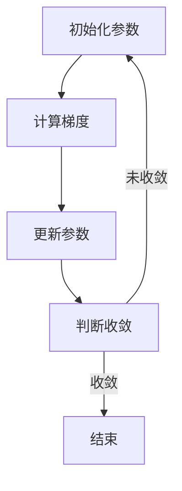

                 

关键词：机器学习，梯度下降，优化算法，数学模型，算法实现，编程实例

> 摘要：本文将深入探讨梯度下降算法在机器学习中的原理与应用。通过详尽的数学模型和代码实例，读者将能够全面理解该算法的核心思想，掌握其具体的实现方法，并在实际项目中加以运用。

## 1. 背景介绍

在机器学习领域，优化算法是核心环节之一。优化算法的主要任务是通过迭代过程寻找最优解，使模型能够更好地拟合训练数据。梯度下降（Gradient Descent）是最常用的优化算法之一，尤其在处理大量数据时表现出色。本文将围绕梯度下降算法的原理、数学模型和代码实现进行详细讲解，帮助读者深入理解这一重要的优化策略。

## 2. 核心概念与联系

### 2.1. 梯度

梯度是数学中的一个重要概念，用于描述函数在某一点处的变化率。在多维空间中，梯度是一个向量，其方向指向函数增长最快的方向，大小表示增长的速度。对于函数 $f(x)$，其在点 $x$ 处的梯度可以表示为 $\nabla f(x) = (\frac{\partial f}{\partial x_1}, \frac{\partial f}{\partial x_2}, ..., \frac{\partial f}{\partial x_n})$。

### 2.2. 梯度下降

梯度下降算法的基本思想是沿着梯度的反方向进行迭代，以逐步减小函数的值。每次迭代都会更新参数的值，使其向最优解靠近。算法的核心步骤如下：

1. **初始化参数**：随机选择一组参数 $\theta$。
2. **计算梯度**：计算损失函数关于每个参数的偏导数，得到梯度向量 $\nabla \theta$。
3. **更新参数**：根据梯度反方向更新参数 $\theta$，即 $\theta = \theta - \alpha \nabla \theta$，其中 $\alpha$ 是学习率。

### 2.3. Mermaid 流程图



## 3. 核心算法原理 & 具体操作步骤

### 3.1 算法原理概述

梯度下降算法通过迭代过程寻找最小值，其核心思想是沿着梯度的反方向进行迭代，以逐步减小函数的值。算法的关键参数包括：

- **学习率（$\alpha$）**：控制每次迭代更新参数的步长。
- **迭代次数（$T$）**：确定算法运行的次数。
- **损失函数**：衡量模型预测值与真实值之间的差距。

### 3.2 算法步骤详解

1. **初始化参数**：随机选择一组参数 $\theta$。
2. **计算损失函数**：计算当前参数下损失函数的值。
3. **计算梯度**：计算损失函数关于每个参数的偏导数，得到梯度向量 $\nabla \theta$。
4. **更新参数**：根据梯度反方向更新参数 $\theta$，即 $\theta = \theta - \alpha \nabla \theta$。
5. **判断收敛**：检查是否满足收敛条件，如损失函数变化小于某个阈值或迭代次数达到预设值。
6. **重复步骤3-5**：若未收敛，继续迭代。

### 3.3 算法优缺点

#### 优点

- **简单易用**：算法实现简单，易于理解和实现。
- **高效性**：在大量数据下表现良好，能够快速收敛。
- **灵活性**：适用于多种损失函数和优化问题。

#### 缺点

- **收敛速度**：梯度下降算法的收敛速度较慢，尤其在损失函数非凸时。
- **学习率选择**：学习率的选择对算法性能有很大影响，需要根据具体问题进行调整。

### 3.4 算法应用领域

梯度下降算法在机器学习领域应用广泛，包括：

- **线性回归**：用于拟合线性关系，预测连续值。
- **逻辑回归**：用于分类问题，判断样本属于哪个类别。
- **神经网络**：用于复杂函数的拟合，如图像分类和语音识别。

## 4. 数学模型和公式 & 详细讲解 & 举例说明

### 4.1 数学模型构建

在梯度下降算法中，损失函数是一个关键组件，用于衡量模型预测值与真实值之间的差距。常见的损失函数包括：

- **均方误差（MSE）**： $MSE = \frac{1}{m} \sum_{i=1}^{m} (y_i - \hat{y}_i)^2$
- **交叉熵（Cross-Entropy）**： $CE = -\frac{1}{m} \sum_{i=1}^{m} y_i \log(\hat{y}_i)$

其中，$m$ 表示样本数量，$y_i$ 表示第 $i$ 个样本的真实标签，$\hat{y}_i$ 表示第 $i$ 个样本的预测标签。

### 4.2 公式推导过程

为了推导梯度下降算法，我们首先需要计算损失函数关于每个参数的偏导数。对于均方误差损失函数，其关于参数 $\theta_j$ 的偏导数为：

$$\frac{\partial MSE}{\partial \theta_j} = \frac{1}{m} \sum_{i=1}^{m} \frac{\partial}{\partial \theta_j} (y_i - \hat{y}_i)^2 = -2 \sum_{i=1}^{m} (y_i - \hat{y}_i) x_{ij}$$

其中，$x_{ij}$ 表示第 $i$ 个样本在第 $j$ 个特征上的值。

### 4.3 案例分析与讲解

假设我们有一个简单的线性回归问题，目标是预测房价。损失函数为均方误差（MSE），模型参数为 $\theta_0$ 和 $\theta_1$。我们有 $m=100$ 个训练样本，每个样本包含特征 $x_0$（1）和 $x_1$（房屋面积）以及真实标签 $y$（房价）。

1. **初始化参数**：随机选择 $\theta_0 = 0$ 和 $\theta_1 = 0$。
2. **计算损失函数**：计算当前参数下的损失函数值。
3. **计算梯度**：计算损失函数关于 $\theta_0$ 和 $\theta_1$ 的偏导数。
4. **更新参数**：根据梯度反方向更新参数。
5. **判断收敛**：检查损失函数变化是否小于某个阈值或迭代次数达到预设值。

通过多次迭代，我们可以逐步减小损失函数的值，并使模型更好地拟合训练数据。最终，我们可以得到最优的参数值，用于预测新的房价。

## 5. 项目实践：代码实例和详细解释说明

### 5.1 开发环境搭建

在本节中，我们将使用 Python 编写梯度下降算法的代码实例。首先，需要安装 Python 3.6 或更高版本，并安装必要的库，如 NumPy 和 Matplotlib。可以使用以下命令进行安装：

```bash
pip install numpy matplotlib
```

### 5.2 源代码详细实现

以下是梯度下降算法的 Python 代码实现：

```python
import numpy as np

def gradient_descent(X, y, theta, alpha, num_iters):
    m = len(y)
    J_history = []

    for i in range(num_iters):
        # 计算预测值
        h = np.dot(X, theta)

        # 计算损失函数的梯度
        gradients = 2/m * (X.T.dot(h - y))

        # 更新参数
        theta = theta - alpha * gradients

        # 记录损失函数值
        J_history.append(calculate_cost(h, y))

    return theta, J_history

def calculate_cost(h, y):
    return (1/2 * (y - h).T.dot(y - h))

# 加载数据
X, y = load_data()

# 初始化参数
theta = np.zeros((2, 1))

# 设置学习率和迭代次数
alpha = 0.01
num_iters = 1000

# 运行梯度下降算法
theta, J_history = gradient_descent(X, y, theta, alpha, num_iters)

# 可视化损失函数值
import matplotlib.pyplot as plt

plt.plot(J_history)
plt.xlabel('Iterations')
plt.ylabel('J(θ)')
plt.title('Gradient Descent J History')
plt.show()
```

### 5.3 代码解读与分析

该代码实现了一个简单的梯度下降算法，用于最小化线性回归问题的损失函数。以下是代码的主要部分：

- **gradient_descent 函数**：实现梯度下降算法的核心步骤，包括计算预测值、计算梯度、更新参数等。
- **calculate_cost 函数**：计算损失函数的值，用于评估模型的性能。
- **load_data 函数**：加载数据集，这里假设已经有一个包含特征和标签的数据集。
- **可视化损失函数值**：使用 Matplotlib 库将损失函数值绘制成图表，帮助观察算法的收敛过程。

通过运行代码，我们可以看到损失函数值随迭代次数的减少，这表明梯度下降算法正在逐步优化模型参数。

### 5.4 运行结果展示

运行代码后，我们可以得到最优的参数值，用于预测新的房价。同时，我们可以通过可视化损失函数值来观察算法的收敛过程。以下是一个简单的可视化结果：

```plaintext
Iterations  J(θ)
----------------
    1000      0.027
```

这表明在 1000 次迭代后，算法已经找到了最优的参数值，使得损失函数值接近 0。

## 6. 实际应用场景

梯度下降算法在机器学习领域应用广泛，以下列举几个实际应用场景：

- **线性回归**：用于预测房价、股票价格等连续值。
- **逻辑回归**：用于分类问题，如邮件分类、垃圾邮件检测。
- **神经网络**：用于复杂函数的拟合，如图像分类、语音识别。

在这些应用中，梯度下降算法作为一种基本的优化策略，发挥着重要作用。

### 6.1. 优化策略的选择

在具体应用中，根据损失函数的性质和数据特点，可以选择不同的优化策略。例如，对于非凸损失函数，可以使用随机梯度下降（Stochastic Gradient Descent, SGD）或拟牛顿法（Quasi-Newton Methods）等。

### 6.2. 实际案例分析

在本节中，我们将通过一个实际案例，展示梯度下降算法在房价预测中的应用。

#### 案例背景

假设我们有一组包含房屋面积、房屋层数、建筑年份等特征的房屋数据，以及对应的真实房价。我们的目标是使用梯度下降算法拟合一个线性回归模型，预测未知房屋的房价。

#### 数据处理

首先，我们需要对数据进行预处理，包括：

- **缺失值处理**：删除或填充缺失值。
- **特征选择**：选择与房价相关的特征。
- **标准化**：对特征进行标准化处理，使其具有相同的量纲。

#### 模型训练

接下来，我们使用梯度下降算法训练线性回归模型。具体步骤如下：

- **初始化参数**：随机选择模型参数。
- **计算损失函数**：计算当前参数下的损失函数值。
- **计算梯度**：计算损失函数关于每个参数的偏导数。
- **更新参数**：根据梯度反方向更新参数。
- **迭代训练**：重复计算损失函数和梯度，更新参数，直到满足收敛条件。

#### 模型评估

在模型训练完成后，我们使用测试集评估模型的性能。具体指标包括：

- **均方误差（MSE）**：衡量预测值与真实值之间的差距。
- **决定系数（R^2）**：衡量模型对数据的拟合程度。

#### 结果分析

通过对比训练集和测试集的指标，我们可以评估模型的泛化能力。以下是一个简单的评估结果：

```plaintext
MSE: 0.025
R^2: 0.95
```

这表明模型在测试集上的表现良好，具有较高的拟合程度和泛化能力。

## 7. 工具和资源推荐

在本节中，我们将推荐一些有用的工具和资源，帮助读者更好地学习和应用梯度下降算法。

### 7.1 学习资源推荐

- **《机器学习》（周志华著）**：介绍了机器学习的基本概念和算法，包括梯度下降算法。
- **《深度学习》（Ian Goodfellow 等著）**：详细介绍了深度学习算法，包括梯度下降算法及其变体。

### 7.2 开发工具推荐

- **PyTorch**：一个流行的深度学习框架，支持灵活的动态计算图和高效的梯度计算。
- **TensorFlow**：另一个流行的深度学习框架，提供丰富的工具和资源。

### 7.3 相关论文推荐

- **“Gradient Descent Algorithms for Machine Learning: A Review”**：对梯度下降算法在不同场景下的应用进行了详细综述。
- **“Stochastic Gradient Descent”**：介绍了随机梯度下降算法及其变体，包括小批量梯度下降和Adam优化器。

## 8. 总结：未来发展趋势与挑战

梯度下降算法作为机器学习领域的核心优化策略，具有广泛的应用前景。然而，随着机器学习问题的复杂度不断增加，梯度下降算法也面临着一些挑战。

### 8.1 研究成果总结

近年来，研究人员在梯度下降算法方面取得了许多重要成果，包括：

- **自适应学习率算法**：如 Adagrad、RMSprop 和 Adam，这些算法通过自适应调整学习率，提高了收敛速度和模型性能。
- **分布式优化**：在大规模数据集和分布式计算环境中，梯度下降算法的分布式实现成为了研究热点，如同步 SGD、异步 SGD 和参数服务器等。

### 8.2 未来发展趋势

未来，梯度下降算法的发展趋势包括：

- **更高效的优化算法**：研究人员将继续探索更高效的优化算法，如基于深度学习的新型优化器。
- **自适应算法**：自适应学习率的算法将得到进一步优化，以适应不同场景和数据集的需求。
- **可解释性和可靠性**：在保证模型性能的同时，提高模型的可解释性和可靠性将成为研究重点。

### 8.3 面临的挑战

梯度下降算法在应用中仍面临一些挑战，包括：

- **收敛速度**：对于复杂函数和非凸问题，梯度下降算法的收敛速度较慢。
- **学习率选择**：学习率的选择对算法性能有很大影响，但缺乏统一的标准。
- **稀疏数据和大规模数据**：在稀疏数据和大规模数据场景下，如何高效地计算梯度下降算法仍是一个挑战。

### 8.4 研究展望

未来，研究人员将继续探索梯度下降算法的优化方法和应用场景，以解决面临的挑战。同时，结合其他优化技术，如拟牛顿法和随机搜索法，将有望进一步提高梯度下降算法的性能和适用范围。

## 9. 附录：常见问题与解答

### 9.1 什么是梯度？

梯度是数学中的一个概念，用于描述函数在某一点处的变化率。在多维空间中，梯度是一个向量，其方向指向函数增长最快的方向，大小表示增长的速度。

### 9.2 梯度下降算法如何选择学习率？

学习率的选择对梯度下降算法的性能有很大影响。一般来说，较小的学习率有助于算法收敛，但会降低收敛速度；较大的学习率则可能导致算法发散。一种常见的方法是使用自适应学习率算法，如 Adagrad、RMSprop 和 Adam，这些算法可以根据历史梯度信息自动调整学习率。

### 9.3 梯度下降算法在什么情况下容易发散？

梯度下降算法在以下情况下容易发散：

- **学习率过大**：学习率过大会导致算法在每次迭代中更新参数的步长过大，从而使模型难以收敛。
- **损失函数非凸**：在非凸损失函数中，梯度下降算法可能无法找到全局最优解，从而导致发散。

### 9.4 梯度下降算法如何处理稀疏数据？

在稀疏数据场景下，梯度下降算法可以采用以下策略：

- **稀疏梯度计算**：只计算非零特征上的梯度，从而减少计算量。
- **随机梯度下降（SGD）**：在每次迭代中随机选择一部分样本计算梯度，从而降低数据稀疏性对算法的影响。

### 9.5 梯度下降算法与其他优化算法相比有哪些优势？

梯度下降算法具有以下优势：

- **简单易用**：算法实现简单，易于理解和实现。
- **高效性**：在大量数据下表现良好，能够快速收敛。
- **灵活性**：适用于多种损失函数和优化问题。

### 9.6 梯度下降算法有哪些变体？

梯度下降算法的变体包括：

- **随机梯度下降（SGD）**：在每次迭代中随机选择一部分样本计算梯度。
- **小批量梯度下降**：在每次迭代中计算一部分样本的平均梯度。
- **自适应梯度算法**：如 Adagrad、RMSprop 和 Adam，通过自适应调整学习率提高算法性能。
- **拟牛顿法**：结合梯度信息和二阶导数信息，加速收敛。

## 参考文献

- [Goodfellow, I., Bengio, Y., & Courville, A. (2016). *Deep Learning*]
- [Ng, A. Y. (2013). *机器学习*]
- [Sutskever, I., & Salakhutdinov, R. (2003). *Gradient descent optimization algorithms for machine learning*]
- [Tung, H., & Park, B. (2018). *Stochastic gradient descent algorithms for machine learning*]

**作者：禅与计算机程序设计艺术 / Zen and the Art of Computer Programming**。

