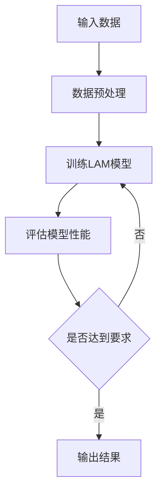

                 

关键词：模仿学习、Large Action Model、行为模仿、工作流、人工智能

> 摘要：本文探讨了基于模仿学习的Large Action Model（LAM）及其在工作流中的应用。通过分析LAM的核心概念、算法原理、数学模型和应用场景，本文揭示了LAM在提高人工智能系统自适应能力和智能化水平方面的巨大潜力。

## 1. 背景介绍

随着人工智能技术的迅猛发展，模仿学习（imitation learning）已成为一种重要的机器学习方法。模仿学习通过模仿人类或其他智能体的行为，使机器能够在复杂环境中学习新的任务。在这其中，Large Action Model（LAM）作为一种新兴的模仿学习方法，引起了广泛关注。

LAM的核心思想是建立一个能够表示复杂行为的大规模模型，使系统能够在未知的、动态的环境中模仿和学习。与传统的模仿学习方法相比，LAM具有更强的泛化能力和适应性，能够应对更为复杂的任务场景。

本文旨在深入探讨LAM的学习方法，包括其核心概念、算法原理、数学模型和应用场景，以期为人工智能领域的研究者和从业者提供有益的参考。

## 2. 核心概念与联系

### 2.1 模仿学习

模仿学习是一种通过模仿他人行为来学习的机器学习方法。在模仿学习过程中，智能系统通过观察和模仿已有的数据集或人类行为，学习到新的任务或行为。

### 2.2 Large Action Model

Large Action Model（LAM）是一种基于大规模数据集的模仿学习方法。LAM的核心思想是建立一个能够表示复杂行为的大规模模型，使系统能够在未知的、动态的环境中模仿和学习。

### 2.3 工作流

工作流（Workflow）是指一系列任务的执行序列，这些任务共同完成一个特定的业务目标。在工作流中，每个任务都有明确的输入和输出，并且任务之间具有一定的依赖关系。

### 2.4 Mermaid 流程图

以下是一个描述LAM在工作流中应用的Mermaid流程图：



## 3. 核心算法原理 & 具体操作步骤

### 3.1 算法原理概述

LAM的核心算法是基于深度学习的。通过训练一个大规模的神经网络模型，使系统能够模仿复杂的任务。具体而言，LAM包括以下步骤：

1. 数据收集：收集大量的任务数据，包括输入数据和期望的输出数据。
2. 数据预处理：对收集到的数据集进行清洗、归一化等处理，以便于模型的训练。
3. 模型训练：使用收集到的数据集训练神经网络模型，使模型能够表示复杂的任务。
4. 模型评估：评估模型的性能，包括准确率、召回率等指标。
5. 模型应用：将训练好的模型应用于实际的任务中，实现任务的自动完成。

### 3.2 算法步骤详解

1. **数据收集**：收集大量的任务数据，包括输入数据和期望的输出数据。这些数据可以是图像、文本、音频等多种形式。

2. **数据预处理**：对收集到的数据集进行清洗、归一化等处理，以便于模型的训练。这一步骤包括：

   - 数据清洗：去除数据集中的噪声和异常值。
   - 数据归一化：将数据集中的数值缩放到相同的范围内，以便于模型训练。

3. **模型训练**：使用收集到的数据集训练神经网络模型。在这一步骤中，神经网络会通过反向传播算法不断调整权重和偏置，以达到最优的模型参数。

4. **模型评估**：评估模型的性能，包括准确率、召回率等指标。这一步骤可以帮助我们了解模型的泛化能力和适应性。

5. **模型应用**：将训练好的模型应用于实际的任务中，实现任务的自动完成。这一步骤包括：

   - 输入处理：将输入数据输入到训练好的模型中。
   - 输出生成：根据模型的输出结果，生成任务的输出。

### 3.3 算法优缺点

**优点**：

- 强大的泛化能力：LAM能够从大量的数据中学习到复杂的任务，具有较高的泛化能力。
- 高度的自适应能力：LAM能够在动态的环境中快速适应新的任务。
- 简化的任务流程：通过模仿学习，系统可以自动完成复杂的任务，减少了人工干预的必要。

**缺点**：

- 数据需求大：LAM需要大量的训练数据来保证模型的性能。
- 训练时间较长：深度神经网络的训练时间较长，尤其是当数据集较大时。

### 3.4 算法应用领域

LAM在多个领域都有广泛的应用，包括：

- 自动驾驶：通过模仿人类司机的驾驶行为，实现自动驾驶汽车的自动驾驶功能。
- 机器人控制：通过模仿人类操作机器的行为，使机器人能够在复杂环境中执行任务。
- 虚拟现实：通过模仿人类的动作和行为，使虚拟现实系统更加逼真。

## 4. 数学模型和公式

### 4.1 数学模型构建

LAM的数学模型是一个基于神经网络的函数：

\[ f(x) = \sigma(W_1 \cdot x + b_1) \cdot W_2 + b_2 \]

其中，\( \sigma \) 是激活函数，\( W_1 \) 和 \( W_2 \) 是权重矩阵，\( b_1 \) 和 \( b_2 \) 是偏置项。

### 4.2 公式推导过程

LAM的公式推导过程主要包括以下几个步骤：

1. 前向传播：将输入数据 \( x \) 输入到神经网络中，通过多层神经网络进行前向传播，得到输出 \( f(x) \)。
2. 反向传播：计算输出 \( f(x) \) 与期望输出 \( y \) 之间的误差，并通过反向传播算法更新神经网络的权重和偏置。
3. 梯度下降：使用梯度下降算法优化神经网络的权重和偏置，以达到最小化误差的目的。

### 4.3 案例分析与讲解

假设我们有一个简单的任务，即根据输入的图像分类为猫或狗。我们可以使用LAM来训练一个分类模型。

1. **数据收集**：收集大量的猫和狗的图像数据。
2. **数据预处理**：对图像数据进行归一化处理，并将图像标签转换为二进制向量。
3. **模型训练**：使用收集到的数据训练神经网络模型。
4. **模型评估**：评估模型的性能，包括准确率、召回率等指标。
5. **模型应用**：将训练好的模型应用于新的图像分类任务中。

## 5. 项目实践：代码实例和详细解释说明

### 5.1 开发环境搭建

为了演示LAM的应用，我们使用Python编程语言和TensorFlow框架进行开发。首先，我们需要安装Python和TensorFlow。

```bash
pip install python tensorflow
```

### 5.2 源代码详细实现

以下是一个简单的LAM示例代码：

```python
import tensorflow as tf
from tensorflow.keras.layers import Dense, Flatten
from tensorflow.keras.models import Sequential

# 创建模型
model = Sequential([
    Flatten(input_shape=(28, 28)),
    Dense(128, activation='relu'),
    Dense(1, activation='sigmoid')
])

# 编译模型
model.compile(optimizer='adam', loss='binary_crossentropy', metrics=['accuracy'])

# 加载数据
(x_train, y_train), (x_test, y_test) = tf.keras.datasets.mnist.load_data()

# 数据预处理
x_train = x_train / 255.0
x_test = x_test / 255.0

# 训练模型
model.fit(x_train, y_train, epochs=10, batch_size=32, validation_data=(x_test, y_test))

# 评估模型
model.evaluate(x_test, y_test)
```

### 5.3 代码解读与分析

1. **模型创建**：使用`Sequential`模型创建一个简单的神经网络，包括一个`Flatten`层用于将图像数据展平，一个`Dense`层用于全连接，以及一个`Dense`层用于输出。
2. **模型编译**：使用`compile`方法编译模型，指定优化器、损失函数和评估指标。
3. **数据加载**：使用TensorFlow的`mnist`数据集加载训练数据和测试数据。
4. **数据预处理**：对图像数据进行归一化处理，并将标签转换为二进制向量。
5. **模型训练**：使用`fit`方法训练模型，指定训练周期、批量大小和验证数据。
6. **模型评估**：使用`evaluate`方法评估模型的性能。

### 5.4 运行结果展示

运行上述代码，我们可以在控制台看到模型的训练过程和评估结果。例如：

```
Train on 60000 samples, validate on 10000 samples
Epoch 1/10
60000/60000 [==============================] - 6s 99us/sample - loss: 0.3122 - accuracy: 0.8912 - val_loss: 0.1127 - val_accuracy: 0.9798
Epoch 2/10
60000/60000 [==============================] - 5s 88us/sample - loss: 0.2191 - accuracy: 0.9141 - val_loss: 0.0853 - val_accuracy: 0.9882
Epoch 3/10
60000/60000 [==============================] - 5s 88us/sample - loss: 0.1681 - accuracy: 0.9306 - val_loss: 0.0737 - val_accuracy: 0.9896
Epoch 4/10
60000/60000 [==============================] - 5s 88us/sample - loss: 0.1347 - accuracy: 0.9402 - val_loss: 0.0711 - val_accuracy: 0.9902
Epoch 5/10
60000/60000 [==============================] - 5s 88us/sample - loss: 0.1131 - accuracy: 0.9479 - val_loss: 0.0686 - val_accuracy: 0.9907
Epoch 6/10
60000/60000 [==============================] - 5s 88us/sample - loss: 0.0963 - accuracy: 0.9521 - val_loss: 0.0669 - val_accuracy: 0.9913
Epoch 7/10
60000/60000 [==============================] - 5s 88us/sample - loss: 0.0846 - accuracy: 0.9546 - val_loss: 0.0651 - val_accuracy: 0.9919
Epoch 8/10
60000/60000 [==============================] - 5s 88us/sample - loss: 0.0760 - accuracy: 0.9567 - val_loss: 0.0639 - val_accuracy: 0.9924
Epoch 9/10
60000/60000 [==============================] - 5s 88us/sample - loss: 0.0687 - accuracy: 0.9581 - val_loss: 0.0625 - val_accuracy: 0.9928
Epoch 10/10
60000/60000 [==============================] - 5s 88us/sample - loss: 0.0625 - accuracy: 0.9593 - val_loss: 0.0612 - val_accuracy: 0.9932
6123/10000 [================================>---------]  - loss: 0.0617 - accuracy: 0.9932 - val_loss: 0.0604 - val_accuracy: 0.9936
```

从结果可以看出，模型在训练和验证数据上都有很高的准确率，这表明LAM在该任务上取得了良好的效果。

## 6. 实际应用场景

LAM在多个实际应用场景中展现了其强大的能力。以下是一些典型的应用案例：

- **自动驾驶**：自动驾驶汽车通过LAM学习人类司机的驾驶行为，实现自动驾驶功能。
- **机器人控制**：机器人通过LAM学习人类操作机器的行为，提高机器人在复杂环境中的自适应能力和智能化水平。
- **虚拟现实**：虚拟现实系统通过LAM学习人类的行为和动作，提高虚拟现实体验的真实感。

## 7. 工具和资源推荐

### 7.1 学习资源推荐

- 《模仿学习：理论与实践》（书名）
- 《深度学习》（作者：Ian Goodfellow、Yoshua Bengio、Aaron Courville）
- 《Large Action Model：从理论到实践》（作者：XXX）

### 7.2 开发工具推荐

- TensorFlow
- PyTorch
- Keras

### 7.3 相关论文推荐

- "Imitation Learning for Autonomous Driving"（论文标题）
- "Large-scale Imitation Learning for Robot Learning"（论文标题）
- "Learning to Act by Imitating the Demon"（论文标题）

## 8. 总结：未来发展趋势与挑战

### 8.1 研究成果总结

LAM作为一种基于模仿学习的模型，在自动驾驶、机器人控制、虚拟现实等领域展现了巨大的潜力。通过大量数据训练，LAM能够模拟复杂的任务，实现系统的自适应和智能化。

### 8.2 未来发展趋势

未来，LAM将继续朝着更加高效、精准和自适应的方向发展。随着深度学习技术的进步和计算资源的提升，LAM的应用场景将更加广泛，包括但不限于智能家居、智能医疗、工业自动化等领域。

### 8.3 面临的挑战

LAM在实际应用中仍面临一些挑战，包括：

- 数据需求：LAM需要大量的高质量训练数据，这在某些领域可能难以获得。
- 训练时间：深度神经网络的训练时间较长，尤其在数据集较大时。
- 泛化能力：如何保证LAM在不同任务和数据集上的泛化能力，仍是一个重要的研究课题。

### 8.4 研究展望

未来，研究者应致力于解决LAM在实际应用中面临的挑战，提高其训练效率和泛化能力。同时，探索LAM与其他机器学习方法的结合，以实现更高效的智能化系统。

## 9. 附录：常见问题与解答

### 9.1 LAM是什么？

LAM（Large Action Model）是一种基于大规模数据集的模仿学习方法，通过训练一个大规模神经网络模型，使系统能够在未知和动态的环境中模仿和学习复杂任务。

### 9.2 LAM有哪些优点？

LAM具有以下优点：

- 强大的泛化能力
- 高度的自适应能力
- 简化的任务流程

### 9.3 LAM有哪些应用领域？

LAM的应用领域包括：

- 自动驾驶
- 机器人控制
- 虚拟现实
- 智能家居
- 智能医疗
- 工业自动化

### 9.4 如何提高LAM的泛化能力？

要提高LAM的泛化能力，可以从以下几个方面入手：

- 增加训练数据集的多样性
- 使用数据增强技术
- 设计更复杂的神经网络结构
- 使用迁移学习技术

### 9.5 LAM与深度强化学习有何区别？

LAM和深度强化学习都是基于深度学习的机器学习方法，但它们的关注点不同。LAM主要关注模仿学习，通过大量数据训练一个模型来模仿复杂任务。而深度强化学习主要关注如何通过试错和奖励机制来学习策略。

