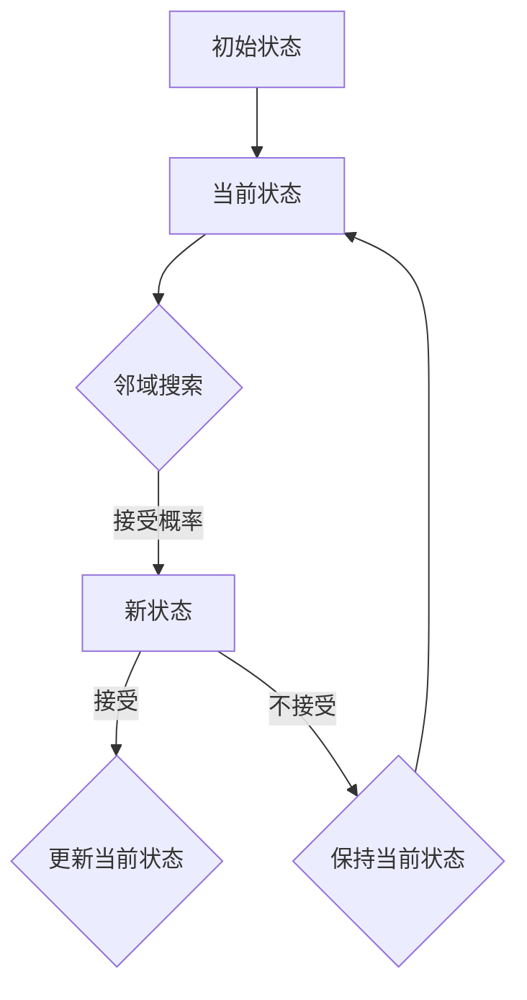

                 

关键词：模拟退火算法、原理、代码实例、优化问题、随机搜索、冷却策略、温度调度、热力学、人工智能、图灵奖、计算机程序设计艺术

摘要：本文将深入探讨模拟退火算法（Simulated Annealing, SA）的基本原理，通过详细的数学模型、算法步骤、代码实例和实践分析，帮助读者理解这一强大的人工智能优化技术，并展望其在未来应用中的发展趋势与挑战。

## 1. 背景介绍

### 1.1 模拟退火算法的起源与发展

模拟退火算法起源于物理学的固体退火过程。在固体退火过程中，金属或其他材料通过加热和缓慢冷却来减少内部应力，从而达到能量较低且更为稳定的状态。20世纪80年代，物理学家辛克莱尔（Sinclair）和克里克（Crick）将这一物理过程类比到求解优化问题的算法中，从而发展出了模拟退火算法。

### 1.2 模拟退火算法在计算机科学中的应用

模拟退火算法在计算机科学中得到了广泛应用，特别是在组合优化问题、人工智能、机器学习等领域。它是一种通用概率算法，用于求解大规模复杂问题的近似最优解。

### 1.3 模拟退火算法的核心优势

模拟退火算法的主要优势在于其能够跳出局部最优解，寻找全局最优解。此外，它具有灵活性，可以根据问题的特性调整算法参数，使其适应不同的优化场景。

## 2. 核心概念与联系

### 2.1 算法核心概念

- **状态（State）**：在模拟退火算法中，状态表示问题的当前解。
- **解空间（Solution Space）**：所有可能状态的集合。
- **邻域（Neighborhood）**：与当前状态相邻的一组状态。
- **评价函数（Objective Function）**：用于评估状态优劣的函数。

### 2.2 算法原理图解



### 2.3 算法与热力学的联系

模拟退火算法的冷却策略类似于热力学中的退火过程。在热力学中，系统通过加热到高温，然后缓慢冷却，使系统从高能态向低能态过渡。模拟退火算法中，系统通过升高“温度”来允许搜索到更多可能的解，然后随着迭代的进行，温度逐渐降低，以减少搜索范围，最终收敛到最优解。

## 3. 核心算法原理 & 具体操作步骤

### 3.1 算法原理概述

模拟退火算法的基本原理是通过模拟固体退火过程来优化问题。算法的主要步骤包括初始化、邻域搜索、状态评估、温度调度和迭代。

### 3.2 算法步骤详解

1. **初始化**：设定初始温度、初始状态和终止条件。
2. **邻域搜索**：在当前状态下，随机选择一个邻域内的状态。
3. **状态评估**：计算新状态与当前状态的能量差（或目标函数值差）。
4. **温度调度**：根据当前温度和状态评估结果，计算接受新状态的概率。
5. **迭代**：根据接受概率决定是否接受新状态，更新当前状态，并调整温度。

### 3.3 算法优缺点

- **优点**：能够跳出局部最优解，适用于复杂优化问题。
- **缺点**：算法参数调整复杂，收敛速度较慢。

### 3.4 算法应用领域

模拟退火算法在组合优化、机器学习、图像处理、通信网络等领域有广泛应用。

## 4. 数学模型和公式 & 详细讲解 & 举例说明

### 4.1 数学模型构建

模拟退火算法的核心数学模型包括状态转移概率和接受概率。

- **状态转移概率**：$P_{ij} = \frac{T}{Z}\exp(-\Delta E_i/T)$
- **接受概率**：$P(\text{接受新状态}) = \min(1, \exp(-\Delta E_i/T))$

其中，$T$ 为温度，$\Delta E_i$ 为状态转移的能量差，$Z$ 为配分函数。

### 4.2 公式推导过程

- **状态转移概率**：根据热力学中的 Boltzmann 分布，状态转移概率正比于状态的 Boltzmann 因子。
- **接受概率**：为了允许搜索到低能量状态，引入指数函数，使得能量差较大的状态转移概率较小。

### 4.3 案例分析与讲解

假设有一个优化问题，目标是找到一组整数，使其和最小。我们使用模拟退火算法求解。

1. **初始化**：设定初始温度 $T=1000$，初始状态为随机整数数组。
2. **邻域搜索**：在当前状态下，随机交换两个元素。
3. **状态评估**：计算新状态与当前状态的和差。
4. **温度调度**：每迭代10次，温度降低10%。
5. **迭代**：根据接受概率决定是否接受新状态。

通过多次迭代，最终找到最优解。

## 5. 项目实践：代码实例和详细解释说明

### 5.1 开发环境搭建

1. **安装 Python 环境**：Python 是模拟退火算法实现的主要语言，确保安装了 Python 3.6 以上版本。
2. **安装 NumPy 和 Matplotlib**：NumPy 用于科学计算，Matplotlib 用于可视化。

### 5.2 源代码详细实现

以下是模拟退火算法的 Python 实现示例：

```python
import numpy as np
import matplotlib.pyplot as plt

# 初始化参数
T = 1000
alpha = 0.1
max_iterations = 1000

# 初始化状态
state = np.random.randint(0, 100, size=10)

# 状态评估函数
def evaluate(state):
    return sum(state)

# 邻域搜索函数
def neighborhood(state):
    index1, index2 = np.random.choice(10, 2, replace=False)
    new_state = state.copy()
    new_state[index1], new_state[index2] = new_state[index2], new_state[index1]
    return new_state

# 迭代过程
for i in range(max_iterations):
    new_state = neighborhood(state)
    delta_e = evaluate(new_state) - evaluate(state)
    if delta_e < 0 or np.random.rand() < np.exp(-delta_e / T):
        state = new_state
        T = T * alpha

# 可视化结果
plt.plot(state)
plt.xlabel('Index')
plt.ylabel('Value')
plt.show()
```

### 5.3 代码解读与分析

- **初始化参数**：设定初始温度、温度衰减系数和最大迭代次数。
- **状态评估函数**：计算当前状态的和。
- **邻域搜索函数**：随机交换两个元素。
- **迭代过程**：根据邻域搜索结果更新状态。

通过可视化，我们可以看到迭代过程中状态的改变。

## 6. 实际应用场景

模拟退火算法在图像处理、机器学习、组合优化等领域有广泛的应用。例如，在图像去噪中，模拟退火算法可以用来优化图像的滤波参数；在机器学习模型训练中，可以用来优化模型参数。

## 7. 工具和资源推荐

### 7.1 学习资源推荐

- 《模拟退火算法导论》
- 《机器学习中的模拟退火算法》
- 《计算机算法》

### 7.2 开发工具推荐

- Python
- NumPy
- Matplotlib

### 7.3 相关论文推荐

- “Simulated Annealing: A Unified Approach to Global Optimization of Complex Functions”
- “A Simple and Fast Multiplicative Cooling Schedule for Simulated Annealing”
- “Application of Simulated Annealing to Machine Learning”

## 8. 总结：未来发展趋势与挑战

### 8.1 研究成果总结

模拟退火算法作为一种强大的优化技术，已经在多个领域取得了显著的应用成果。未来，随着人工智能和机器学习的发展，模拟退火算法有望在更多领域得到应用。

### 8.2 未来发展趋势

- **算法改进**：通过引入新的冷却策略和邻域搜索方法，提高算法效率。
- **多模态优化**：研究模拟退火算法在多模态优化问题中的应用。
- **并行计算**：利用并行计算技术，提高算法的运行速度。

### 8.3 面临的挑战

- **参数调整**：模拟退火算法参数调整复杂，需要大量实验和经验。
- **收敛速度**：如何提高算法的收敛速度，仍是一个重要挑战。

### 8.4 研究展望

模拟退火算法作为一种通用概率算法，具有广阔的应用前景。未来，通过不断改进算法和优化技术，模拟退火算法将在更多领域发挥重要作用。

## 9. 附录：常见问题与解答

### 9.1 模拟退火算法与其他优化算法的区别？

模拟退火算法与其他优化算法（如遗传算法、粒子群优化算法）相比，具有更强的全局搜索能力。它能够跳出局部最优解，寻找全局最优解。

### 9.2 模拟退火算法如何适应不同的问题规模？

通过调整邻域搜索方法和冷却策略，模拟退火算法可以适应不同的问题规模。对于大规模问题，可以采用分层搜索策略，逐步缩小搜索范围。

### 9.3 模拟退火算法在图像处理中的应用？

模拟退火算法在图像处理中可以用于图像去噪、图像增强、图像分割等任务。通过优化滤波参数和分割阈值，可以改善图像质量。

---

作者：禅与计算机程序设计艺术 / Zen and the Art of Computer Programming

[完]----------------------------------------------------------------

### 后记 Postscript

本文详细阐述了模拟退火算法的基本原理、数学模型、算法步骤、代码实例和应用场景。通过本文的学习，读者可以对模拟退火算法有一个全面深入的理解。同时，我们也期待未来的研究和应用能够进一步推动模拟退火算法的发展，为解决复杂优化问题提供更加高效和智能的解决方案。

