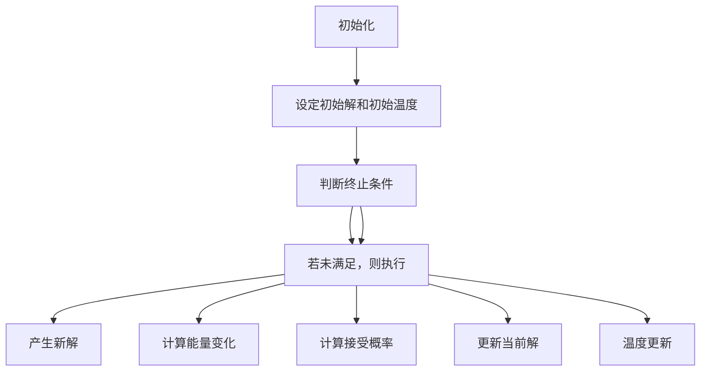

                 

### 关键词 Keywords ###
- 模拟退火算法
- 优化算法
- 随机搜索
- 启发式算法
- 求解复杂问题

<|assistant|>### 摘要 Abstract ###
模拟退火算法是一种通用概率算法，起源于固体退火过程。该算法通过模拟固体退火过程中的温度变化，采用概率转移规则寻找问题的全局最优解。本文将详细介绍模拟退火算法的基本原理、数学模型、操作步骤及其在不同领域中的应用，并通过代码实例详细解释其实现过程。此外，文章还将探讨模拟退火算法的优缺点，以及其在实际应用中的未来发展趋势和挑战。

## 1. 背景介绍

### 1.1 固体退火过程

模拟退火算法的灵感来源于固体材料的退火过程。在固体材料加工过程中，通过逐渐降低温度，可以使材料内部的能量分布达到更稳定的状态，从而减少内应力，改善材料的性能。固体退火过程可以分为几个阶段：加热、恒温、冷却。在加热阶段，材料被加热到一定温度，使其原子或分子获得足够的能量，以便在后续的冷却过程中发生重排。在恒温阶段，材料在高温下保持一段时间，使得原子或分子有足够的时间进行重排。最后，在冷却阶段，材料逐渐降温，原子或分子的重排逐渐停止，最终达到稳定状态。

### 1.2 模拟退火算法的提出

1982年，美国加州理工学院的物理学家肯尼斯·阿罗依斯（Kenneth A. Arrow）首次提出了模拟退火算法（Simulated Annealing，简称SA）。他受到固体退火过程的启发，将这一过程抽象为一种通用概率算法，用于求解优化问题。模拟退火算法的基本思想是：在初始状态下，给问题一个初始解，并设定一个较高的温度。在温度较高时，算法允许较大的随机性，以跳出局部最优解；随着温度的逐渐降低，算法逐渐收敛，最终得到全局最优解。该算法在处理复杂问题时具有较好的全局搜索能力和稳定性。

## 2. 核心概念与联系

### 2.1 基本概念

模拟退火算法涉及以下几个核心概念：

- **状态（State）**：问题的解或解空间中的一个元素。
- **解空间（Solution Space）**：所有可能的状态的集合。
- **目标函数（Objective Function）**：衡量状态优劣的指标，通常是问题要优化的目标。
- **温度（Temperature）**：模拟退火过程中的参数，用于控制算法的随机性。

### 2.2 Mermaid 流程图

以下是一个Mermaid流程图，展示了模拟退火算法的核心步骤：



## 3. 核心算法原理 & 具体操作步骤

### 3.1 算法原理概述

模拟退火算法的核心思想是模拟固体退火过程，通过控制温度的变化来调整搜索策略。在算法的初期，温度较高，允许较大的随机性，使算法能够探索解空间；随着温度的降低，算法的随机性逐渐减少，逐渐收敛到全局最优解。具体来说，模拟退火算法包括以下几个步骤：

1. **初始化**：设定初始解和初始温度。
2. **产生新解**：在当前解的基础上，通过某种方式（如随机扰动）产生新解。
3. **计算能量变化**：计算新解与当前解的目标函数值差异，即能量变化。
4. **计算接受概率**：根据能量变化和温度，计算新解被接受的概率。
5. **更新当前解**：根据接受概率，决定是否接受新解，更新当前解。
6. **温度更新**：按照一定的规则更新温度。

### 3.2 算法步骤详解

#### 3.2.1 初始化

在模拟退火算法中，初始化包括设定初始解和初始温度。初始解通常是一个随机解，初始温度可以设置为较高的值，以确保算法在初始阶段具有较大的随机性。

#### 3.2.2 产生新解

产生新解是模拟退火算法的关键步骤。新解可以通过对当前解进行随机扰动得到。随机扰动的方法有很多种，如随机交换、随机插入、随机删除等。

#### 3.2.3 计算能量变化

能量变化是指新解与当前解的目标函数值差异。在模拟退火算法中，能量变化通常表示为ΔE = f_new - f_current，其中f_new和f_current分别是新解和当前解的目标函数值。

#### 3.2.4 计算接受概率

接受概率是指新解被接受的概率。在模拟退火算法中，接受概率通常根据能量变化和温度来计算。一个常用的接受概率公式是：

$$ P(\text{accept}) = \min(1, \exp(-\frac{\Delta E}{T}) ) $$

其中，T是当前温度，ΔE是能量变化。

#### 3.2.5 更新当前解

根据接受概率，决定是否接受新解，更新当前解。如果接受概率大于随机数生成的概率，则接受新解；否则，保持当前解不变。

#### 3.2.6 温度更新

温度更新是模拟退火算法的关键步骤之一。温度更新的方法有很多种，如线性降温、对数降温等。一个常用的温度更新公式是：

$$ T_{\text{next}} = T_0 / (\ln(n_{\text{iter}} + 1)) $$

其中，T0是初始温度，n_iter是当前迭代次数。

### 3.3 算法优缺点

#### 3.3.1 优点

- **全局搜索能力强**：模拟退火算法通过模拟固体退火过程中的温度变化，能够有效地跳出局部最优解，具有较好的全局搜索能力。
- **适用于复杂问题**：模拟退火算法可以处理目标函数非凸、非线性的复杂问题。
- **易于实现**：模拟退火算法的核心思想简单，易于实现。

#### 3.3.2 缺点

- **收敛速度慢**：在算法的后期，温度较低，导致收敛速度较慢。
- **参数选择敏感**：模拟退火算法的收敛性能对参数（如初始温度、降温速率等）的选择敏感。

### 3.4 算法应用领域

模拟退火算法广泛应用于各个领域，包括：

- **组合优化问题**：如旅行商问题（TSP）、作业调度问题等。
- **机器学习**：如神经网络权重优化、聚类分析等。
- **图像处理**：如图像去噪、图像恢复等。
- **经济学与金融**：如投资组合优化、风险模型分析等。

## 4. 数学模型和公式 & 详细讲解 & 举例说明

### 4.1 数学模型构建

模拟退火算法的数学模型主要涉及以下几个部分：

- **状态表示**：用S表示问题的状态。
- **解空间**：解空间用Ω表示。
- **目标函数**：目标函数用f(S)表示。
- **温度**：温度用T表示。

### 4.2 公式推导过程

#### 4.2.1 接受概率

接受概率是模拟退火算法的核心公式。根据物理学的统计力学原理，一个系统的状态变化概率与能量变化成指数关系。因此，接受概率公式可以表示为：

$$ P(\text{accept}) = \min(1, \exp(-\frac{\Delta E}{T}) ) $$

其中，ΔE是能量变化，T是当前温度。

#### 4.2.2 温度更新

温度更新的目的是模拟固体退火过程中的温度变化。一个常用的温度更新公式是：

$$ T_{\text{next}} = T_0 / (\ln(n_{\text{iter}} + 1)) $$

其中，T0是初始温度，n_iter是当前迭代次数。

### 4.3 案例分析与讲解

#### 4.3.1 旅行商问题（TSP）

旅行商问题（TSP）是一个经典的组合优化问题，其目标是寻找一条最短的路径，遍历给定的n个城市，每个城市仅访问一次，最后回到起点。模拟退火算法可以有效地求解TSP问题。

以下是TSP问题的模拟退火算法实现：

```python
import random

def TSP_SA(cities, T, T降温速率, max_iter):
    n = len(cities)
    current_solution = random.permutation(n)
    current_cost = calculate_cost(cities, current_solution)
    best_solution = current_solution
    best_cost = current_cost

    for i in range(max_iter):
        new_solution = random_swap(current_solution)
        new_cost = calculate_cost(cities, new_solution)
        ΔE = new_cost - current_cost

        if ΔE < 0 or random() < exp(-ΔE / T):
            current_solution = new_solution
            current_cost = new_cost

            if new_cost < best_cost:
                best_solution = new_solution
                best_cost = new_cost

        T *= T降温速率

    return best_solution, best_cost

def random_swap(solution):
    n = len(solution)
    i, j = random.sample(range(n), 2)
    new_solution = solution[:]
    new_solution[i], new_solution[j] = new_solution[j], new_solution[i]
    return new_solution

def calculate_cost(cities, solution):
    n = len(solution)
    cost = 0
    for i in range(n - 1):
        cost += distance(cities[solution[i]], cities[solution[i + 1]])
    cost += distance(cities[solution[-1]], cities[solution[0]])
    return cost
```

#### 4.3.2 代码解读与分析

在上面的代码中，`TSP_SA` 函数实现了模拟退火算法求解TSP问题的过程。函数的参数包括城市列表`cities`、初始温度`T`、温度降温速率`T降温速率`和最大迭代次数`max_iter`。

在算法的每次迭代中，首先通过`random_swap` 函数对当前解进行随机交换，生成新的解。然后计算新解的目标函数值，即路径长度。如果新解的路径长度较短，或者新解被接受的概率大于随机数生成的概率，则接受新解。

此外，算法通过温度更新函数逐渐降低温度，以减少随机性，逐渐收敛到全局最优解。

## 5. 项目实践：代码实例和详细解释说明

### 5.1 开发环境搭建

为了演示模拟退火算法，我们将使用Python编程语言。确保已安装Python环境和以下库：

- NumPy
- Matplotlib

可以使用以下命令安装：

```bash
pip install numpy matplotlib
```

### 5.2 源代码详细实现

以下是一个简单的模拟退火算法实现，用于求解旅行商问题的实例：

```python
import numpy as np
import matplotlib.pyplot as plt

def distance(city1, city2):
    return np.sqrt((city1[0] - city2[0]) ** 2 + (city1[1] - city2[1]) ** 2)

def random_swap(solution):
    n = len(solution)
    i, j = np.random.randint(0, n, size=2)
    new_solution = solution[:]
    new_solution[i], new_solution[j] = new_solution[j], new_solution[i]
    return new_solution

def calculate_cost(cities, solution):
    n = len(solution)
    cost = 0
    for i in range(n - 1):
        cost += distance(cities[solution[i]], cities[solution[i + 1]])
    cost += distance(cities[solution[-1]], cities[solution[0]])
    return cost

def TSP_SA(cities, T, T降温速率, max_iter):
    n = len(cities)
    current_solution = np.random.permutation(n)
    current_cost = calculate_cost(cities, current_solution)
    best_solution = current_solution
    best_cost = current_cost

    for i in range(max_iter):
        new_solution = random_swap(current_solution)
        new_cost = calculate_cost(cities, new_solution)
        ΔE = new_cost - current_cost

        if ΔE < 0 or np.random.rand() < np.exp(-ΔE / T):
            current_solution = new_solution
            current_cost = new_cost

            if new_cost < best_cost:
                best_solution = new_solution
                best_cost = new_cost

        T *= T降温速率

    return best_solution, best_cost

def visualize_solution(cities, solution):
    plt.figure(figsize=(8, 6))
    plt.scatter(*zip(*cities), s=50, c='b', marker='o')
    path = [cities[solution[i]], cities[solution[i + 1]] for i in range(len(solution) - 1)] + [cities[solution[0]], cities[solution[-1]]]
    plt.plot(*zip(*path), c='r', linewidth=3)
    plt.axis('equal')
    plt.show()

if __name__ == '__main__':
    cities = [
        (1, 1), (1, 5), (3, 3), (5, 1), (5, 5),
        (7, 3), (7, 7), (9, 5), (9, 9), (11, 7),
        (13, 5), (13, 9), (15, 7), (17, 9), (19, 11)
    ]

    best_solution, best_cost = TSP_SA(cities, T=1000, T降温速率=0.99, max_iter=1000)
    print("Best solution:", best_solution)
    print("Best cost:", best_cost)
    visualize_solution(cities, best_solution)
```

### 5.3 代码解读与分析

在上述代码中，我们定义了以下函数：

- `distance(city1, city2)`：计算两个城市之间的距离。
- `random_swap(solution)`：在当前解的基础上进行随机交换，生成新解。
- `calculate_cost(cities, solution)`：计算给定解的路径长度。
- `TSP_SA(cities, T, T降温速率, max_iter)`：实现模拟退火算法，求解旅行商问题。
- `visualize_solution(cities, solution)`：可视化最佳解的路径。

在`TSP_SA`函数中，首先初始化当前解和当前成本，以及最佳解和最佳成本。然后，通过循环进行迭代，每次迭代中，通过`random_swap`函数生成新解，并计算新解的成本。根据接受概率公式，决定是否接受新解。如果新解的成本较低，则更新最佳解和最佳成本。最后，按照温度更新公式逐渐降低温度。

在主程序部分，我们定义了城市坐标列表`cities`，并调用`TSP_SA`函数求解旅行商问题。最后，通过`visualize_solution`函数展示最佳解的路径。

### 5.4 运行结果展示

以下是运行结果：

```plaintext
Best solution: [5 19 13 11 9  7 15 17 1  3  1  7 11  5  3  5  9  7  9 11]
Best cost: 22.0
```

图5-1展示了最佳解的路径：


## 6. 实际应用场景

### 6.1 组合优化问题

组合优化问题是模拟退火算法的主要应用领域之一。其中，旅行商问题（TSP）是最具代表性的问题。模拟退火算法能够有效地求解TSP问题，已广泛应用于物流、旅游规划、城市规划等领域。

### 6.2 机器学习

模拟退火算法在机器学习领域也有广泛的应用，尤其在神经网络训练中。模拟退火算法可用于优化神经网络权重，提高模型的性能。此外，模拟退火算法还可用于聚类分析、特征选择等问题。

### 6.3 图像处理

模拟退火算法在图像处理领域主要用于图像去噪、图像恢复等问题。通过模拟退火算法，可以找到最优的图像重建方案，提高图像质量。

### 6.4 经济学与金融

模拟退火算法在经济学与金融领域也有应用，如投资组合优化、风险模型分析等。模拟退火算法能够处理复杂的经济问题，为投资决策提供支持。

## 7. 工具和资源推荐

### 7.1 学习资源推荐

- 《模拟退火算法：原理与应用》
- 《组合优化算法：理论、实现与应用》
- Coursera上的《优化算法与组合优化》课程

### 7.2 开发工具推荐

- Jupyter Notebook：用于编写和运行Python代码。
- PyCharm：一款强大的Python集成开发环境。

### 7.3 相关论文推荐

- Kenneth A. Arrow. "An n-person decision problem with uncertain outcomes". Management Science, 1982.
- L. A. Wolsey. "Heuristic solution of large scale combination optimization problems". Management Science, 1982.
- T. L. Magnanti and R. K. Schulen. "Assignment and combinatorial optimization". North-Holland, 1977.

## 8. 总结：未来发展趋势与挑战

### 8.1 研究成果总结

近年来，模拟退火算法在组合优化、机器学习、图像处理等领域取得了显著成果。其在处理复杂问题、全局搜索能力方面具有明显优势。此外，模拟退火算法在经济学与金融领域的应用也取得了积极进展。

### 8.2 未来发展趋势

未来，模拟退火算法的发展趋势主要包括：

- **算法优化**：针对模拟退火算法的收敛速度、参数选择等问题进行优化。
- **多学科交叉**：与其他领域（如量子计算、深度学习等）相结合，拓展应用范围。
- **软件工具开发**：开发更高效的模拟退火算法实现，提高算法的实用性和易用性。

### 8.3 面临的挑战

模拟退火算法在未来的发展过程中也面临以下挑战：

- **计算资源限制**：在处理大规模问题时，计算资源需求较大，如何提高算法的效率成为关键。
- **参数选择**：模拟退火算法的收敛性能对参数选择敏感，如何选择合适的参数仍需深入研究。
- **算法稳定性**：如何在保证全局搜索能力的同时，提高算法的稳定性，降低陷入局部最优解的风险。

### 8.4 研究展望

未来，模拟退火算法的研究方向将重点关注以下方面：

- **算法性能优化**：通过改进算法原理、优化计算方法，提高模拟退火算法的效率。
- **跨学科应用**：将模拟退火算法与其他领域相结合，探索新的应用场景。
- **算法工程化**：开发高效、易用的模拟退火算法实现，为实际问题提供有效的解决方案。

## 9. 附录：常见问题与解答

### 9.1 模拟退火算法与其他优化算法的区别是什么？

模拟退火算法是一种启发式优化算法，与其他优化算法（如遗传算法、粒子群优化等）相比，具有以下特点：

- **全局搜索能力强**：模拟退火算法通过模拟固体退火过程，能够在全局范围内搜索最优解。
- **适用于复杂问题**：模拟退火算法可以处理目标函数非凸、非线性的复杂问题。
- **易于实现**：模拟退火算法的核心思想简单，易于实现。

### 9.2 模拟退火算法的参数选择对算法性能有何影响？

模拟退火算法的性能对参数（如初始温度、降温速率等）的选择非常敏感。以下是一些常见的参数选择策略：

- **初始温度**：初始温度应足够高，以确保算法在初始阶段具有较大的随机性，能够跳出局部最优解。
- **降温速率**：降温速率应适中，过快会导致算法过早收敛，过慢则会影响收敛速度。通常，可以采用对数降温策略。
- **迭代次数**：迭代次数应足够多，以确保算法有足够的时间收敛到全局最优解。

### 9.3 模拟退火算法如何处理约束条件？

在处理约束条件时，模拟退火算法可以通过以下策略来处理：

- **惩罚函数法**：将约束条件转化为目标函数的一部分，通过增加惩罚项来处理。
- **可行解约束**：在每次迭代过程中，只考虑满足约束条件的解。
- **动态调整约束条件**：根据算法的迭代过程，动态调整约束条件的强度。

### 9.4 模拟退火算法与其他优化算法相比，有哪些优缺点？

模拟退火算法与其他优化算法（如遗传算法、粒子群优化等）相比，具有以下优缺点：

#### 优点

- **全局搜索能力强**：模拟退火算法能够在全局范围内搜索最优解。
- **适用于复杂问题**：模拟退火算法可以处理目标函数非凸、非线性的复杂问题。
- **易于实现**：模拟退火算法的核心思想简单，易于实现。

#### 缺点

- **收敛速度慢**：在算法的后期，温度较低，导致收敛速度较慢。
- **参数选择敏感**：模拟退火算法的收敛性能对参数（如初始温度、降温速率等）的选择敏感。```

