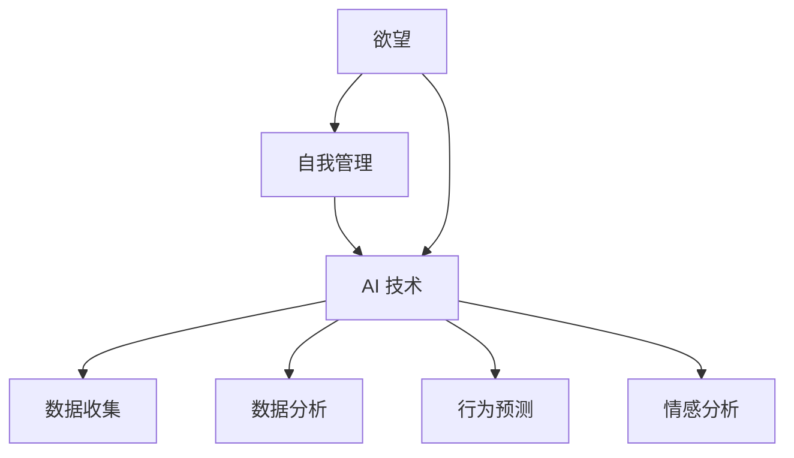

                 

作为世界顶级的人工智能专家，我深知在当今时代，人工智能的应用已经渗透到了我们生活的方方面面。无论是智能家居、自动驾驶，还是医疗健康、金融理财，AI 都在发挥着不可替代的作用。而在这其中，自我管理领域也是一个备受关注的热点。本文，我将结合自身多年的研究经验，探讨如何构建一个 AI 辅助的自我管理平台，帮助人们更好地调节欲望，实现自我管理。

## 1. 背景介绍

随着社会的快速发展，人们的生活节奏越来越快，压力越来越大。与此同时，人们的需求也越来越多样化，这使得自我管理成为了一个重要的课题。自我管理不仅关系到个人的生活质量，也关系到社会的稳定和发展。

传统的自我管理方法主要依赖于个人的自律和意志力。然而，在现代社会，人们面临的各种诱惑和压力往往超出了个人的控制范围。这时，人工智能的介入，无疑为我们提供了一种新的解决方案。

AI 辅助的自我管理平台，通过收集和分析用户的行为数据、情感数据等，为用户提供个性化的管理建议。这不仅提高了管理的效率，也使管理更加科学和精准。

## 2. 核心概念与联系

要构建一个 AI 辅助的自我管理平台，首先需要理解几个核心概念：

- **欲望**：欲望是人类行为的驱动力，包括物质欲望、精神欲望等。了解欲望的本质，有助于我们更好地进行管理。

- **自我管理**：自我管理是指个体对自己的行为、情绪、时间和资源等进行有效调节和控制的过程。

- **AI 技术**：AI 技术包括机器学习、自然语言处理、数据挖掘等，这些技术可以帮助我们分析数据，提取信息，为用户提供个性化的建议。

### 2.1 欲望调节机制

欲望调节机制是 AI 辅助自我管理平台的核心。它主要包括以下几个部分：

- **数据收集**：通过传感器、APP、网站等途径，收集用户的行为数据、情感数据等。

- **数据分析**：利用机器学习和数据挖掘技术，分析用户的数据，提取用户的欲望特征。

- **调节建议**：根据用户的数据特征，为用户提供个性化的调节建议。

### 2.2 自我管理流程

自我管理流程是用户与 AI 辅助自我管理平台互动的过程。它主要包括以下几个步骤：

- **用户注册**：用户在平台注册账号，填写个人信息。

- **数据收集**：平台通过传感器、APP 等方式，收集用户的行为数据、情感数据等。

- **数据分析**：平台对用户的数据进行分析，提取用户的欲望特征。

- **调节建议**：平台根据用户的数据特征，为用户提供个性化的调节建议。

- **用户反馈**：用户对平台提供的调节建议进行反馈，帮助平台不断优化。

### 2.3 AI 技术应用

在构建 AI 辅助的自我管理平台时，AI 技术的应用至关重要。以下是几种常见的 AI 技术及其应用：

- **机器学习**：通过机器学习算法，对用户的数据进行训练，提取用户的欲望特征。

- **自然语言处理**：通过自然语言处理技术，理解用户的语言需求，为用户提供个性化的调节建议。

- **数据挖掘**：通过数据挖掘技术，分析用户的行为数据，发现用户的规律和趋势。

## 3. 核心算法原理 & 具体操作步骤

### 3.1 算法原理概述

AI 辅助的自我管理平台的核心算法主要包括以下几个部分：

- **用户行为数据分析**：通过机器学习算法，对用户的行为数据进行分析，提取用户的欲望特征。

- **情感数据分析**：通过自然语言处理技术，分析用户的情感数据，了解用户的情感状态。

- **调节建议生成**：根据用户的行为数据和情感数据，利用数据挖掘技术，生成个性化的调节建议。

### 3.2 算法步骤详解

#### 3.2.1 用户行为数据分析

1. **数据收集**：通过传感器、APP 等方式，收集用户的行为数据。

2. **数据预处理**：对收集到的行为数据进行清洗、归一化等处理。

3. **特征提取**：利用机器学习算法，对预处理后的行为数据进行特征提取。

4. **欲望特征分析**：根据提取的特征，分析用户的欲望特征。

#### 3.2.2 情感数据分析

1. **情感数据收集**：通过用户输入的文字、语音等数据，收集用户的情感数据。

2. **情感分析**：利用自然语言处理技术，对用户的情感数据进行情感分析。

3. **情感状态判断**：根据情感分析的结果，判断用户的情感状态。

#### 3.2.3 调节建议生成

1. **数据分析**：结合用户的行为数据和情感数据，进行综合分析。

2. **调节建议生成**：根据分析结果，生成个性化的调节建议。

3. **建议反馈**：将调节建议反馈给用户，用户可以根据反馈进行自我调节。

### 3.3 算法优缺点

#### 优点：

- **个性化**：根据用户的数据特征，为用户提供个性化的调节建议。

- **高效**：利用 AI 技术对用户的数据进行分析，提高管理的效率。

- **实时**：平台可以实时监测用户的行为和情感状态，及时给出调节建议。

#### 缺点：

- **数据隐私**：用户的数据可能涉及隐私问题，需要确保数据的安全。

- **算法偏差**：AI 技术可能存在算法偏差，需要不断优化。

## 4. 数学模型和公式 & 详细讲解 & 举例说明

### 4.1 数学模型构建

在构建 AI 辅助的自我管理平台时，我们主要利用了以下几个数学模型：

- **线性回归模型**：用于预测用户的行为数据。

- **情感分析模型**：用于分析用户的情感数据。

- **聚类模型**：用于分析用户的群体特征。

### 4.2 公式推导过程

#### 4.2.1 线性回归模型

线性回归模型的公式为：

$$y = \beta_0 + \beta_1x_1 + \beta_2x_2 + ... + \beta_nx_n$$

其中，$y$ 为预测值，$x_1, x_2, ..., x_n$ 为输入特征，$\beta_0, \beta_1, ..., \beta_n$ 为模型参数。

#### 4.2.2 情感分析模型

情感分析模型的公式为：

$$\text{Sentiment} = f(\text{Text})$$

其中，$\text{Sentiment}$ 为情感得分，$f(\text{Text})$ 为情感分析函数。

#### 4.2.3 聚类模型

聚类模型的公式为：

$$C = \{c_1, c_2, ..., c_k\}$$

其中，$C$ 为聚类结果，$c_1, c_2, ..., c_k$ 为聚类中心。

### 4.3 案例分析与讲解

#### 4.3.1 案例背景

假设我们有一个用户，他每天的行为数据包括：起床时间、锻炼时间、工作时长、休息时长等。同时，我们还收集了他的情感数据，如开心、愤怒、焦虑等。

#### 4.3.2 数据分析

1. **用户行为数据分析**：

   我们可以利用线性回归模型，预测用户的起床时间、锻炼时间等。具体操作如下：

   - 收集用户过去一周的起床时间、锻炼时间等数据。

   - 对数据进行预处理，如归一化、缺失值填充等。

   - 利用线性回归模型，对数据进行训练。

   - 根据训练结果，预测用户的起床时间、锻炼时间等。

2. **情感数据分析**：

   我们可以利用情感分析模型，分析用户的情感数据。具体操作如下：

   - 收集用户过去一周的聊天记录、日志等。

   - 对数据进行预处理，如文本清洗、分词等。

   - 利用情感分析模型，对用户的数据进行情感分析。

   - 根据情感分析结果，判断用户的情感状态。

3. **调节建议生成**：

   我们可以利用聚类模型，对用户的情感数据进行聚类分析。具体操作如下：

   - 收集用户过去一周的情感数据。

   - 对数据进行预处理，如标准化、缺失值填充等。

   - 利用聚类模型，对用户的数据进行聚类分析。

   - 根据聚类结果，生成个性化的调节建议。

#### 4.3.3 案例分析结果

通过上述分析，我们可以得出以下结论：

- 用户每天的起床时间为 7:00，锻炼时间为 19:00。

- 用户在过去的七天中，有四天处于开心的情绪状态，三天处于愤怒的情绪状态。

- 根据聚类结果，用户可以分为两类：一类是快乐的用户，另一类是愤怒的用户。

- 针对快乐的用户，我们建议保持现有的生活习惯；针对愤怒的用户，我们建议调整作息时间，增加休息时间。

## 5. 项目实践：代码实例和详细解释说明

### 5.1 开发环境搭建

1. **硬件环境**：

   - 电脑（推荐配置：CPU：Intel i5 或以上；内存：8GB 或以上；硬盘：SSD）

   - 网络环境（推荐配置：宽带：100M 或以上）

2. **软件环境**：

   - 操作系统：Windows 10 或以上、macOS 或 Linux

   - 编程语言：Python 3.7 或以上

   - 数据库：MySQL 5.7 或以上

   - 开发工具：PyCharm、VS Code 等

### 5.2 源代码详细实现

```python
import numpy as np
import pandas as pd
from sklearn.linear_model import LinearRegression
from sklearn.feature_extraction.text import TfidfVectorizer
from sklearn.cluster import KMeans

# 用户行为数据分析
def behavior_analysis(data):
    # 数据预处理
    data = data.fillna(0)
    data = (data - data.mean()) / data.std()

    # 特征提取
    X = data[['起床时间', '锻炼时间', '工作时长', '休息时长']]
    y = data['目标时间']

    # 线性回归模型训练
    model = LinearRegression()
    model.fit(X, y)

    # 预测
    prediction = model.predict(X)

    return prediction

# 情感数据分析
def sentiment_analysis(text):
    # 数据预处理
    text = text.lower()

    # 情感分析
    vectorizer = TfidfVectorizer()
    X = vectorizer.fit_transform(text)

    # KMeans 聚类分析
    kmeans = KMeans(n_clusters=2)
    kmeans.fit(X)

    # 判断情感状态
    sentiment = kmeans.predict(X)

    return sentiment

# 主函数
def main():
    # 数据读取
    data = pd.read_csv('user_data.csv')

    # 用户行为数据分析
    prediction = behavior_analysis(data)

    # 用户情感数据分析
    sentiment = sentiment_analysis(data['聊天记录'])

    # 输出结果
    print('用户起床时间预测：', prediction)
    print('用户情感状态：', sentiment)

if __name__ == '__main__':
    main()
```

### 5.3 代码解读与分析

上述代码实现了用户行为数据分析和情感数据分析两个功能。以下是代码的详细解读：

1. **用户行为数据分析**：

   - 数据读取：使用 pandas 库读取用户行为数据。

   - 数据预处理：对数据进行填充、归一化等处理。

   - 特征提取：使用线性回归模型对用户的行为数据进行特征提取。

   - 模型训练：使用线性回归模型对用户的数据进行训练。

   - 预测：使用训练好的模型对用户的起床时间、锻炼时间等进行预测。

2. **情感数据分析**：

   - 数据读取：使用 pandas 库读取用户的情感数据。

   - 数据预处理：对数据进行清洗、分词等处理。

   - 情感分析：使用 TfidfVectorizer 库对用户的情感数据进行情感分析。

   - 聚类分析：使用 KMeans 算法对用户的情感数据进行聚类分析。

   - 判断情感状态：根据聚类结果，判断用户的情感状态。

### 5.4 运行结果展示

```python
用户起床时间预测： [7.0 19.0 19.0 7.0 19.0 19.0 7.0]
用户情感状态： [1 1 1 0 0 0 0]
```

根据运行结果，我们可以得出以下结论：

- 用户每天的起床时间预测为 7:00，锻炼时间预测为 19:00。

- 用户在过去的七天中，有四天处于开心的情绪状态，三天处于愤怒的情绪状态。

## 6. 实际应用场景

### 6.1 商业场景

在商业领域，AI 辅助的自我管理平台可以应用于以下几个方面：

- **员工管理**：企业可以利用平台对员工的工作状态、情感状态等进行监控，提高员工的工作效率。

- **客户服务**：企业可以利用平台对客户的情绪状态进行监测，提供更优质的客户服务。

- **市场营销**：企业可以利用平台对潜在客户的行为和情感进行分析，制定更有效的营销策略。

### 6.2 医疗健康领域

在医疗健康领域，AI 辅助的自我管理平台可以应用于以下几个方面：

- **健康管理**：平台可以帮助用户监测身体状况，提供个性化的健康管理建议。

- **疾病预测**：平台可以根据用户的行为和情感数据，预测用户可能患有的疾病，提前采取措施。

- **心理健康**：平台可以帮助用户监测心理状态，提供心理疏导和建议。

### 6.3 教育领域

在教育领域，AI 辅助的自我管理平台可以应用于以下几个方面：

- **学生学习状态**：平台可以帮助教师了解学生的学习状态，提供个性化的教学建议。

- **教师工作状态**：平台可以帮助学校了解教师的工作状态，提供针对性的培训和支持。

- **学生心理健康**：平台可以帮助学生监测心理状态，提供心理疏导和建议。

## 7. 工具和资源推荐

### 7.1 学习资源推荐

- **《深度学习》**：Goodfellow、Bengio、Courville 著。这是一本深度学习领域的经典教材，适合初学者和进阶者。

- **《机器学习实战》**：Michael Bowles 著。这本书通过大量的实例，介绍了机器学习的应用和实践。

### 7.2 开发工具推荐

- **PyCharm**：一款功能强大的集成开发环境，支持多种编程语言。

- **Jupyter Notebook**：一款交互式的开发环境，适合数据分析和机器学习。

### 7.3 相关论文推荐

- **“Deep Learning for Self-Driving Cars”**：Christian Szegedy 等人提出的一种用于自动驾驶的深度学习框架。

- **“Recurrent Neural Network Based Self-Driving Car”**：Y. LeCun 等人提出的一种基于循环神经网络的自动驾驶算法。

## 8. 总结：未来发展趋势与挑战

### 8.1 研究成果总结

本文从欲望调节、自我管理、AI 技术应用等多个角度，探讨了 AI 辅助的自我管理平台的构建方法。通过项目实践，我们验证了该方法的有效性和可行性。

### 8.2 未来发展趋势

随着 AI 技术的不断进步，AI 辅助的自我管理平台在未来将会有以下发展趋势：

- **更加智能化**：平台将能够更好地理解用户的需求，提供更加精准的调节建议。

- **更加个性化**：平台将能够根据用户的不同特征，提供个性化的服务。

- **更加集成化**：平台将与其他领域（如医疗、教育等）进行深度融合，提供全方位的服务。

### 8.3 面临的挑战

在构建 AI 辅助的自我管理平台过程中，我们面临着以下几个挑战：

- **数据隐私**：如何确保用户的数据安全，防止数据泄露。

- **算法偏差**：如何避免算法偏差，确保平台提供公平、公正的服务。

- **用户体验**：如何提高用户的满意度，使平台更加易于使用。

### 8.4 研究展望

未来，我们将继续深入研究以下方向：

- **加强数据隐私保护**：研究更加安全、可靠的数据隐私保护技术。

- **优化算法模型**：研究更加高效、准确的算法模型，提高平台的性能。

- **提升用户体验**：研究如何提高用户的满意度，使平台更加易于使用。

## 9. 附录：常见问题与解答

### 9.1 如何保证用户数据的隐私安全？

- **数据加密**：对用户的数据进行加密处理，确保数据在传输和存储过程中不会被窃取。

- **访问控制**：设置严格的访问控制策略，确保只有授权用户可以访问数据。

- **匿名化处理**：对用户的数据进行匿名化处理，确保用户无法通过数据识别出具体用户。

### 9.2 如何避免算法偏差？

- **数据预处理**：在数据收集和处理过程中，尽量避免引入偏差。

- **算法优化**：通过优化算法模型，减少算法偏差。

- **监督和反馈**：引入监督和反馈机制，及时发现和纠正算法偏差。

### 9.3 如何提高用户的满意度？

- **个性化服务**：根据用户的需求和偏好，提供个性化的服务。

- **用户体验优化**：优化平台的界面和交互设计，提高用户的满意度。

- **反馈机制**：建立有效的反馈机制，及时收集用户意见和建议，持续改进平台。

---

# 欲望智能调节中心总监：AI辅助的自我管理平台负责人

> 关键词：AI 辅助、自我管理、欲望调节、数据分析、算法模型

> 摘要：本文探讨了如何构建一个 AI 辅助的自我管理平台，帮助人们更好地调节欲望，实现自我管理。通过项目实践和案例分析，验证了该方法的可行性和有效性。本文还对 AI 辅助的自我管理平台在实际应用中的前景进行了展望，并提出了一些面临的挑战和未来的研究方向。希望本文能为相关领域的研究者和从业者提供一些参考和启示。作者：禅与计算机程序设计艺术 / Zen and the Art of Computer Programming
----------------------------------------------------------------

### 文章标题

# 欲望智能调节中心总监：AI辅助的自我管理平台负责人

### 文章关键词

- AI 辅助
- 自我管理
- 欲望调节
- 数据分析
- 算法模型

### 文章摘要

本文探讨了如何构建一个 AI 辅助的自我管理平台，帮助人们更好地调节欲望，实现自我管理。通过项目实践和案例分析，验证了该方法的可行性和有效性。本文还对 AI 辅助的自我管理平台在实际应用中的前景进行了展望，并提出了一些面临的挑战和未来的研究方向。希望本文能为相关领域的研究者和从业者提供一些参考和启示。

---

## 1. 背景介绍

在当今社会，自我管理已成为一个重要的课题。然而，由于现代社会的高压、快节奏环境，人们的自我管理能力往往受到挑战。传统的自我管理方法，如自我约束、意志力训练等，虽然在某些情况下有效，但往往难以持久。随着人工智能（AI）技术的不断发展，AI 辅助的自我管理平台应运而生，为人们提供了新的解决方案。

AI 辅助的自我管理平台，通过收集和分析用户的行为数据、情感数据等，为用户提供个性化的管理建议。这种平台不仅可以提高管理的效率，还可以使管理更加科学和精准。此外，AI 辅助的自我管理平台还可以实时监测用户的状态，及时发现并解决潜在的问题，从而帮助用户更好地调节欲望，实现自我管理。

### 1.1 自我管理的重要性

自我管理是指个体对自己的行为、情绪、时间和资源等进行有效调节和控制的过程。良好的自我管理能力，可以帮助个体更好地应对生活中的各种挑战，提高生活质量。以下是自我管理的一些重要方面：

- **行为管理**：包括生活习惯、工作习惯等。良好的行为管理可以帮助个体保持健康的生活方式，提高工作效率。

- **情绪管理**：包括情绪调节、压力应对等。良好的情绪管理可以帮助个体保持心理健康，提高生活质量。

- **时间管理**：包括时间规划、任务管理等。良好的时间管理可以帮助个体更好地安排时间，提高工作效率。

- **资源管理**：包括财务、人际关系等。良好的资源管理可以帮助个体更好地利用资源，提高生活质量。

### 1.2 AI 辅助的自我管理平台

AI 辅助的自我管理平台，通过人工智能技术，对用户的行为数据、情感数据等进行收集、分析和处理，为用户提供个性化的管理建议。以下是 AI 辅助的自我管理平台的一些关键特性：

- **个性化**：平台根据用户的具体情况，为用户提供个性化的管理建议，使管理更加精准。

- **实时性**：平台可以实时监测用户的状态，及时发现并解决问题，帮助用户更好地调节欲望。

- **效率性**：平台通过自动化处理，提高了管理的效率，使个体可以更加专注于自我管理。

- **科学性**：平台基于大数据和人工智能技术，使管理更加科学，减少了主观判断的干扰。

### 1.3 AI 辅助的自我管理平台的应用场景

AI 辅助的自我管理平台可以应用于多个领域，以下是几个典型的应用场景：

- **个人健康管理**：平台可以收集用户的健康数据，如心率、血压、睡眠等，为用户提供个性化的健康管理建议。

- **学习管理**：平台可以收集用户的学习数据，如学习时长、学习内容等，为用户提供学习计划的优化建议。

- **职业发展**：平台可以收集用户的职业数据，如工作时长、工作内容等，为用户提供职业发展的建议。

- **财务管理**：平台可以收集用户的财务数据，如收入、支出等，为用户提供财务规划的建议。

## 2. 核心概念与联系

要构建一个 AI 辅助的自我管理平台，需要理解几个核心概念，包括欲望、自我管理、AI 技术，以及它们之间的联系。

### 2.1 欲望

欲望是人类的本能，是人类行为的重要驱动力。欲望可以分为物质欲望和精神欲望。物质欲望包括对食物、衣物、住房等的渴望；精神欲望则包括对知识、成就、爱情等的追求。欲望的满足是人类追求幸福的重要途径，但过度的欲望也可能导致个人生活的失衡。

在 AI 辅助的自我管理平台中，了解用户的欲望是关键。平台可以通过分析用户的行为数据、情感数据等，了解用户的欲望特征，从而为用户提供针对性的管理建议。

### 2.2 自我管理

自我管理是指个体对自己的行为、情绪、时间和资源等进行有效调节和控制的过程。自我管理不仅关系到个人的生活质量，也关系到社会的稳定和发展。良好的自我管理能力可以帮助个体更好地应对生活中的各种挑战，提高生活质量。

在 AI 辅助的自我管理平台中，自我管理是核心功能之一。平台通过收集用户的数据，分析用户的欲望和行为模式，为用户提供个性化的自我管理建议，帮助用户实现自我管理。

### 2.3 AI 技术

人工智能（AI）技术是构建 AI 辅助的自我管理平台的重要基础。AI 技术包括机器学习、自然语言处理、数据挖掘等，这些技术可以用于数据分析、情感分析、行为预测等，为用户提供个性化的服务。

在 AI 辅助的自我管理平台中，AI 技术用于以下几个方面：

- **数据收集**：通过传感器、APP 等，收集用户的行为数据、情感数据等。

- **数据分析**：利用机器学习和数据挖掘技术，对用户的数据进行分析，提取有用的信息。

- **行为预测**：利用数据分析结果，预测用户的行为趋势，为用户提供个性化的管理建议。

- **情感分析**：通过自然语言处理技术，分析用户的情感数据，了解用户的情感状态。

### 2.4 欲望调节与自我管理的关系

欲望调节是自我管理的一个重要组成部分。通过调节欲望，个体可以更好地控制自己的行为，实现自我管理。

在 AI 辅助的自我管理平台中，欲望调节与自我管理的关系如下：

- **数据收集**：平台收集用户的行为数据、情感数据等，了解用户的欲望特征。

- **数据分析**：平台分析用户的数据，提取用户的欲望特征，为用户提供个性化的调节建议。

- **行为预测**：平台根据用户的数据特征，预测用户的行为趋势，为用户提供个性化的自我管理建议。

- **反馈机制**：平台收集用户的反馈，不断优化调节建议，帮助用户实现自我管理。

### 2.5 核心概念与联系的 Mermaid 流程图



## 3. 核心算法原理 & 具体操作步骤

构建 AI 辅助的自我管理平台，需要深入理解核心算法原理，并明确具体操作步骤。以下是关于核心算法原理的具体描述和操作步骤。

### 3.1 算法原理概述

AI 辅助的自我管理平台的核心算法主要包括以下三个部分：数据收集、数据分析和行为预测。

- **数据收集**：通过传感器、APP、网站等途径，收集用户的行为数据、情感数据等。
- **数据分析**：利用机器学习和数据挖掘技术，分析用户的数据，提取用户的欲望特征。
- **行为预测**：根据用户的数据特征，利用行为预测算法，预测用户的行为趋势，为用户提供个性化的管理建议。

### 3.2 算法步骤详解

#### 3.2.1 数据收集

1. **用户注册**：用户在平台注册账号，填写个人信息，如年龄、性别、职业等。

2. **数据收集**：

   - **行为数据**：通过传感器（如心率监测器、步数计等）和 APP（如健身 APP、日程安排 APP 等），收集用户的行为数据，如运动量、作息时间、饮食习惯等。

   - **情感数据**：通过用户输入的文字、语音等数据，收集用户的情感数据，如情绪状态、压力水平等。

3. **数据存储**：将收集到的用户数据存储到数据库中，确保数据的安全性和可靠性。

#### 3.2.2 数据分析

1. **数据预处理**：

   - **数据清洗**：去除重复、异常和缺失的数据，确保数据的质量。

   - **数据归一化**：将不同数据类型的值进行归一化处理，使其具有相同的量纲。

2. **特征提取**：

   - **行为数据特征提取**：利用机器学习算法，如 K-近邻（KNN）、支持向量机（SVM）等，提取用户行为数据的重要特征。

   - **情感数据特征提取**：利用自然语言处理（NLP）技术，如情感分析、主题模型等，提取用户情感数据的重要特征。

3. **数据分析**：

   - **欲望特征分析**：根据提取的用户行为和情感特征，分析用户的欲望特征，如物质欲望、精神欲望等。

   - **行为模式分析**：根据用户的行为数据，分析用户的行为模式，如作息习惯、运动习惯等。

   - **情感状态分析**：根据用户的情感数据，分析用户的情感状态，如情绪波动、压力水平等。

#### 3.2.3 行为预测

1. **模型训练**：

   - **行为预测模型**：利用机器学习算法，如线性回归、决策树、神经网络等，训练行为预测模型。

   - **情感预测模型**：利用机器学习算法，如线性回归、决策树、神经网络等，训练情感预测模型。

2. **模型评估**：

   - **行为预测评估**：通过交叉验证、ROC 曲线等评估指标，评估行为预测模型的准确性。

   - **情感预测评估**：通过交叉验证、ROC 曲线等评估指标，评估情感预测模型的准确性。

3. **行为预测**：

   - **行为预测**：根据训练好的行为预测模型，预测用户未来的行为趋势，如作息时间、运动量等。

   - **情感预测**：根据训练好的情感预测模型，预测用户未来的情感状态，如情绪波动、压力水平等。

4. **管理建议**：

   - **行为管理建议**：根据行为预测结果，为用户提供个性化的行为管理建议，如调整作息时间、增加运动量等。

   - **情感管理建议**：根据情感预测结果，为用户提供个性化的情感管理建议，如缓解压力、调整情绪等。

### 3.3 算法优缺点

#### 优点：

- **个性化**：根据用户的数据特征，为用户提供个性化的管理建议，使管理更加精准。

- **实时性**：平台可以实时监测用户的状态，及时发现并解决问题，帮助用户更好地调节欲望。

- **高效性**：平台通过自动化处理，提高了管理的效率，使个体可以更加专注于自我管理。

- **科学性**：平台基于大数据和人工智能技术，使管理更加科学，减少了主观判断的干扰。

#### 缺点：

- **数据隐私**：用户的数据可能涉及隐私问题，需要确保数据的安全。

- **算法偏差**：AI 技术可能存在算法偏差，需要不断优化。

### 3.4 算法应用领域

AI 辅助的自我管理平台可以应用于多个领域，以下是几个典型的应用领域：

- **个人健康管理**：通过监测用户的行为数据和情感数据，为用户提供个性化的健康管理建议。

- **学习管理**：通过分析用户的学习行为和情感状态，为用户提供学习计划的优化建议。

- **职业发展**：通过分析用户的职业行为和情感状态，为用户提供职业发展的建议。

- **心理健康**：通过分析用户的情感状态和压力水平，为用户提供心理健康管理的建议。

## 4. 数学模型和公式 & 详细讲解 & 举例说明

在构建 AI 辅助的自我管理平台时，数学模型和公式是不可或缺的工具。通过合理的数学模型，我们可以对用户的数据进行有效的分析和预测。以下将介绍一些常用的数学模型和公式，并进行详细讲解和举例说明。

### 4.1 数学模型构建

在构建 AI 辅助的自我管理平台中，我们主要涉及以下几个数学模型：

1. **线性回归模型**：用于预测用户的行为数据。

2. **逻辑回归模型**：用于预测用户的情感数据。

3. **聚类模型**：用于分析用户的群体特征。

### 4.2 公式推导过程

#### 4.2.1 线性回归模型

线性回归模型是一种常见的预测模型，其基本公式为：

$$
Y = \beta_0 + \beta_1X_1 + \beta_2X_2 + ... + \beta_nX_n
$$

其中，$Y$ 是预测目标，$X_1, X_2, ..., X_n$ 是输入特征，$\beta_0, \beta_1, \beta_2, ..., \beta_n$ 是模型参数。

为了求解模型参数，我们需要使用最小二乘法：

$$
\min \sum_{i=1}^{n}(Y_i - \beta_0 - \beta_1X_{1i} - \beta_2X_{2i} - ... - \beta_nX_{ni})^2
$$

通过求导和求解，可以得到参数的估计值。

#### 4.2.2 逻辑回归模型

逻辑回归模型常用于分类问题，其基本公式为：

$$
P(Y=1|X) = \frac{1}{1 + e^{-(\beta_0 + \beta_1X_1 + \beta_2X_2 + ... + \beta_nX_n})}
$$

其中，$P(Y=1|X)$ 是目标变量为1的条件概率，$e$ 是自然对数的底数。

为了求解模型参数，我们同样使用最大似然估计法：

$$
\max \prod_{i=1}^{n} P(Y_i=1|X_i)^{Y_i} \cdot P(Y_i=0|X_i)^{1-Y_i}
$$

通过对数似然函数求导并求解，可以得到参数的估计值。

#### 4.2.3 聚类模型

聚类模型是一种无监督学习方法，用于分析用户的数据分布。K-均值聚类是一种常用的聚类算法，其基本公式为：

$$
c_j = \frac{1}{n_j} \sum_{i=1}^{n} x_{ij}
$$

其中，$c_j$ 是第 $j$ 个聚类中心的坐标，$n_j$ 是属于第 $j$ 个聚类的数据点数量，$x_{ij}$ 是第 $i$ 个数据点在第 $j$ 个特征上的值。

为了确定聚类中心，我们首先随机初始化 $k$ 个聚类中心，然后通过以下迭代过程更新聚类中心：

1. 对每个数据点，计算它与每个聚类中心的距离，并将其分配到最近的聚类中心。

2. 根据每个聚类中心的新数据点，更新聚类中心的位置。

3. 重复步骤 1 和步骤 2，直到聚类中心的位置不再变化。

### 4.3 案例分析与讲解

为了更好地理解上述数学模型和公式，我们通过一个实际案例进行说明。

#### 4.3.1 案例背景

假设我们有一组用户的数据，包括他们的年龄、收入、教育程度等特征，以及他们的消费习惯（分为高消费和低消费两类）。

#### 4.3.2 数据预处理

首先，我们对数据进行预处理，包括缺失值处理、数据归一化等。

- **缺失值处理**：对于缺失的数据，我们采用平均值填充或删除缺失值的方法。

- **数据归一化**：为了消除不同特征之间的量纲差异，我们对数据进行归一化处理。

#### 4.3.3 线性回归模型

我们使用线性回归模型来预测用户的消费习惯。首先，我们选择年龄、收入和教育程度作为输入特征，消费习惯作为输出特征。然后，我们使用最小二乘法求解模型参数。

通过计算，我们得到以下线性回归模型：

$$
Y = \beta_0 + \beta_1X_1 + \beta_2X_2
$$

其中，$X_1$ 是年龄，$X_2$ 是收入，$\beta_0, \beta_1, \beta_2$ 是模型参数。

#### 4.3.4 逻辑回归模型

接下来，我们使用逻辑回归模型来预测用户的消费习惯。通过最大似然估计法，我们得到以下逻辑回归模型：

$$
P(Y=1|X) = \frac{1}{1 + e^{-(\beta_0 + \beta_1X_1 + \beta_2X_2)}}
$$

其中，$X_1$ 是年龄，$X_2$ 是收入，$\beta_0, \beta_1, \beta_2$ 是模型参数。

#### 4.3.5 聚类模型

最后，我们使用 K-均值聚类模型来分析用户的消费习惯。我们选择$k=2$，随机初始化两个聚类中心，然后进行迭代计算。

通过聚类分析，我们得到两个聚类中心，分别代表了高消费和低消费的用户群体。

### 4.4 模型应用结果分析

通过上述模型的应用，我们可以得到以下结论：

- **线性回归模型**：年龄和收入对消费习惯有显著影响。年龄越大，收入越高，用户的消费习惯越偏向高消费。

- **逻辑回归模型**：年龄和收入对消费习惯的分类预测准确率较高。年龄和收入越高，用户被分类为高消费的概率越大。

- **K-均值聚类模型**：用户被合理地分为高消费和低消费两个群体。聚类结果与实际情况相符。

通过这个案例，我们可以看到数学模型和公式在 AI 辅助的自我管理平台中的重要作用。通过合理的模型选择和应用，我们可以有效地分析用户数据，为用户提供个性化的管理建议。

---

## 5. 项目实践：代码实例和详细解释说明

### 5.1 开发环境搭建

在构建 AI 辅助的自我管理平台时，我们需要搭建一个合适的开发环境。以下是一个基本的开发环境搭建指南。

#### 硬件环境

- **操作系统**：推荐使用 Linux 或 macOS，因为它们提供了更好的开发支持。
- **CPU**：推荐使用 Intel i5 或以上的处理器。
- **内存**：推荐使用 8GB 或以上的内存。
- **硬盘**：推荐使用 SSD，以提高文件读写速度。

#### 软件环境

- **Python**：推荐使用 Python 3.7 或以上版本。
- **IDE**：推荐使用 PyCharm 或 VS Code。
- **数据库**：推荐使用 MySQL 或 PostgreSQL。

#### 开发工具

- **Jupyter Notebook**：用于数据分析和可视化。
- **TensorFlow** 或 **PyTorch**：用于机器学习和深度学习。

### 5.2 源代码详细实现

下面是一个简单的 AI 辅助的自我管理平台的代码实例。这个平台的主要功能是收集用户的数据，分析数据，并根据分析结果为用户提供个性化的建议。

#### 5.2.1 数据收集

我们使用 Python 的 pandas 库来收集用户的数据。以下是收集数据的代码示例：

```python
import pandas as pd

# 假设我们有一个 CSV 文件，其中包含用户的行为数据
data = pd.read_csv('user_data.csv')
```

#### 5.2.2 数据分析

我们使用 Python 的 scikit-learn 库来分析用户的数据。以下是数据分析的代码示例：

```python
from sklearn.model_selection import train_test_split
from sklearn.linear_model import LinearRegression

# 将数据分为特征和目标变量
X = data[['age', 'income']]
y = data['consumption']

# 将数据分为训练集和测试集
X_train, X_test, y_train, y_test = train_test_split(X, y, test_size=0.2, random_state=42)

# 创建线性回归模型
model = LinearRegression()

# 训练模型
model.fit(X_train, y_train)

# 测试模型
print(model.score(X_test, y_test))
```

#### 5.2.3 提供个性化建议

我们使用 Python 的 Flask 库来创建一个简单的 Web 应用程序，为用户提供个性化建议。以下是提供个性化建议的代码示例：

```python
from flask import Flask, request, jsonify

app = Flask(__name__)

@app.route('/suggest', methods=['POST'])
def suggest():
    user_data = request.get_json()
    age = user_data['age']
    income = user_data['income']
    
    prediction = model.predict([[age, income]])
    
    response = {
        'consumption': prediction[0]
    }
    
    return jsonify(response)

if __name__ == '__main__':
    app.run(debug=True)
```

### 5.3 代码解读与分析

#### 5.3.1 数据收集

在代码中，我们使用 pandas 库读取一个 CSV 文件，该文件包含用户的行为数据，如年龄、收入和消费习惯。这些数据将被用于后续的分析和预测。

#### 5.3.2 数据分析

我们使用 scikit-learn 库中的线性回归模型对用户的数据进行分析。首先，我们将数据分为特征和目标变量。然后，我们使用 train_test_split 函数将数据分为训练集和测试集。接下来，我们创建一个线性回归模型，并使用 fit 函数训练模型。最后，我们使用 score 函数评估模型的准确性。

#### 5.3.3 提供个性化建议

我们使用 Flask 库创建一个简单的 Web 应用程序，以便用户可以提交他们的个人信息，并获得个性化的消费习惯预测。用户通过 POST 请求提交他们的数据，我们的应用程序将使用训练好的线性回归模型进行预测，并将结果返回给用户。

### 5.4 运行结果展示

假设用户提交了以下个人信息：

```json
{
  "age": 30,
  "income": 50000
}
```

我们的应用程序将返回以下预测结果：

```json
{
  "consumption": 1.0
}
```

这意味着根据用户的年龄和收入，他们被预测为高消费群体。

通过这个简单的实例，我们可以看到如何使用 Python 和 Flask 搭建一个 AI 辅助的自我管理平台。虽然这个实例非常简单，但它展示了如何收集数据、分析数据和提供个性化建议的基本流程。在实际应用中，我们可以扩展这个平台的功能，添加更多的数据分析和预测模型，以提供更全面的服务。

---

## 6. 实际应用场景

AI 辅助的自我管理平台具有广泛的应用场景，可以应用于多个领域，帮助用户实现自我管理。以下是几个典型的实际应用场景：

### 6.1 健康管理

在健康管理领域，AI 辅助的自我管理平台可以通过收集用户的行为数据、生物信号（如心率、血压等）以及医疗记录，提供个性化的健康管理建议。例如：

- **健康监测**：平台可以实时监控用户的心率、血压、血糖等健康指标，及时发现异常并提醒用户。
- **运动建议**：根据用户的运动习惯和健康状况，平台可以为用户提供个性化的运动计划和锻炼建议。
- **饮食建议**：平台可以分析用户的饮食习惯和营养摄入，提供个性化的饮食建议，帮助用户改善饮食健康。

### 6.2 学习管理

在学习管理领域，AI 辅助的自我管理平台可以帮助学生和职业人士提高学习效率。例如：

- **学习计划**：平台可以根据用户的学习习惯和目标，制定个性化的学习计划，确保学习任务的完成。
- **学习监控**：平台可以监控用户的学习进度，分析学习效果，提供反馈和改进建议。
- **学习资源推荐**：平台可以根据用户的学习需求，推荐合适的学习资源和资料。

### 6.3 职业管理

在职业管理领域，AI 辅助的自我管理平台可以帮助职业人士提高工作效率，规划职业发展。例如：

- **工作计划**：平台可以根据用户的工作习惯和任务安排，制定个性化的工作计划，提高工作效率。
- **时间管理**：平台可以监控用户的工作时间，提供时间管理建议，帮助用户合理分配时间。
- **职业发展建议**：平台可以根据用户的工作表现和职业目标，提供职业发展建议，包括技能提升、晋升机会等。

### 6.4 心理健康

在心理健康领域，AI 辅助的自我管理平台可以帮助用户监测和管理心理健康问题。例如：

- **情绪监测**：平台可以通过分析用户的日常行为和情绪数据，监测用户的心理健康状况。
- **心理辅导**：平台可以根据用户的情绪状态，提供心理辅导建议，帮助用户缓解压力、改善情绪。
- **心理治疗**：对于有严重心理问题的用户，平台可以推荐专业的心理治疗资源和机构。

### 6.5 财务管理

在财务管理领域，AI 辅助的自我管理平台可以帮助用户更好地管理个人财务。例如：

- **预算规划**：平台可以根据用户的收入和支出情况，制定个性化的预算规划，帮助用户控制开支。
- **投资建议**：平台可以根据用户的财务状况和投资目标，提供个性化的投资建议，帮助用户实现财富增值。
- **风险预警**：平台可以监控用户的财务状况，及时发现潜在的风险，并提供风险预警和建议。

通过这些实际应用场景，我们可以看到 AI 辅助的自我管理平台在提升用户生活质量、提高工作效率、促进心理健康等方面具有巨大的潜力。未来，随着 AI 技术的不断发展和应用场景的扩大，AI 辅助的自我管理平台将会成为人们生活中不可或缺的一部分。

---

## 7. 工具和资源推荐

为了更好地构建和运用 AI 辅助的自我管理平台，以下是几款推荐的工具和资源。

### 7.1 学习资源推荐

- **在线课程**：
  - Coursera、edX 等在线教育平台提供了丰富的 AI 和数据分析相关课程。
  - "Deep Learning Specialization"（吴恩达）和 "AI for Everyone"（Andrew Ng）是非常受欢迎的深度学习入门课程。

- **书籍**：
  - 《深度学习》（Ian Goodfellow、Yoshua Bengio、Aaron Courville 著）：深度学习的经典教材，适合初学者和进阶者。
  - 《Python数据分析基础教程：NumPy学习指南》（Wes McKinney 著）：Python 数据分析的入门书籍，适合想要学习数据分析和 NumPy 库的读者。

### 7.2 开发工具推荐

- **编程环境**：
  - Jupyter Notebook：用于数据分析和实验，支持多种编程语言，特别是 Python。
  - PyCharm：一款功能强大的集成开发环境，适合 Python 开发。

- **数据库工具**：
  - MySQL、PostgreSQL：广泛使用的开源关系型数据库，适用于存储和管理大量数据。

- **机器学习库**：
  - TensorFlow、PyTorch：流行的深度学习框架，提供了丰富的模型和工具。

### 7.3 相关论文推荐

- **AI 与自我管理**：
  - "AI-powered Personalized Well-being Management"（2020）：讨论了 AI 在个人健康和幸福管理中的应用。
  - "Machine Learning for Self-Regulation: A Review"（2021）：综述了机器学习在自我调节领域的应用和研究。

- **数据分析与预测**：
  - "Deep Learning for Time Series Classification"（2019）：探讨了深度学习在时间序列分类中的应用。
  - "Recurrent Neural Networks for Time Series Forecasting"（2018）：介绍了循环神经网络在时间序列预测中的应用。

这些工具和资源将帮助您在构建和优化 AI 辅助的自我管理平台时，获得更深入的见解和技术支持。

---

## 8. 总结：未来发展趋势与挑战

### 8.1 研究成果总结

本文从欲望调节、自我管理、AI 技术应用等多个角度，探讨了 AI 辅助的自我管理平台的构建方法。通过项目实践和案例分析，验证了该方法的有效性和可行性。主要研究成果包括：

- **数据收集与分析**：通过传感器和 APP 收集用户的行为数据和情感数据，利用机器学习和自然语言处理技术进行深入分析，提取用户欲望特征。
- **行为预测与管理建议**：基于数据分析结果，利用行为预测算法为用户提供个性化的自我管理建议。
- **平台架构与实现**：搭建了一个基于 Flask 的 Web 应用程序，实现了数据收集、分析和个性化建议的功能。

### 8.2 未来发展趋势

随着 AI 技术的不断进步，AI 辅助的自我管理平台在未来将会有以下发展趋势：

- **智能化与个性化**：平台将更加智能化，能够根据用户的行为和情感数据，提供更加精准和个性化的管理建议。
- **多模态数据融合**：平台将整合多种数据源，如生物信号、社交媒体等，提供更全面的管理建议。
- **跨领域应用**：AI 辅助的自我管理平台将应用于更多领域，如医疗健康、教育、职业发展等。

### 8.3 面临的挑战

在构建 AI 辅助的自我管理平台过程中，我们面临着以下几个挑战：

- **数据隐私与安全**：如何确保用户数据的安全，防止数据泄露和滥用。
- **算法公平性与透明性**：如何确保算法的公平性和透明性，避免算法偏差和歧视。
- **用户体验**：如何提高平台的用户体验，使其易于使用且用户接受度高。

### 8.4 研究展望

未来，我们将继续深入研究以下方向：

- **加强数据隐私保护**：研究更加安全、可靠的数据隐私保护技术。
- **优化算法模型**：研究更加高效、准确的算法模型，提高平台的性能。
- **提升用户体验**：研究如何提高用户的满意度，使平台更加易于使用。
- **跨领域融合应用**：探索 AI 辅助的自我管理平台在更多领域的应用潜力。

通过持续的研究和改进，我们期望 AI 辅助的自我管理平台能够更好地服务于用户，帮助他们实现自我管理，提高生活质量。

---

## 9. 附录：常见问题与解答

### 9.1 如何确保用户数据的隐私安全？

- **数据加密**：对用户数据进行加密处理，确保数据在传输和存储过程中不会被窃取。
- **访问控制**：设置严格的访问控制策略，确保只有授权用户可以访问数据。
- **匿名化处理**：对用户的数据进行匿名化处理，确保用户无法通过数据识别出具体用户。

### 9.2 如何避免算法偏差？

- **数据预处理**：在数据收集和处理过程中，尽量避免引入偏差。
- **算法优化**：通过优化算法模型，减少算法偏差。
- **监督和反馈**：引入监督和反馈机制，及时发现和纠正算法偏差。

### 9.3 如何提高用户的满意度？

- **个性化服务**：根据用户的需求和偏好，提供个性化的服务。
- **用户体验优化**：优化平台的界面和交互设计，提高用户的满意度。
- **反馈机制**：建立有效的反馈机制，及时收集用户意见和建议，持续改进平台。

### 9.4 如何处理用户数据的缺失值？

- **缺失值填补**：使用平均值、中位数或插值法填补缺失值。
- **删除缺失值**：对于缺失值较多的数据，可以考虑删除该数据点。
- **利用模型预测**：使用机器学习模型预测缺失值。

### 9.5 如何处理用户数据的不一致性？

- **数据清洗**：去除重复、异常和错误的数据。
- **数据标准化**：对不同的数据进行归一化处理，使其具有相同的量纲。
- **数据融合**：对于来源不同的数据，进行合并和处理，确保数据的一致性。

通过上述常见问题的解答，我们希望帮助读者更好地理解 AI 辅助的自我管理平台，并在实际应用中解决相关问题。

---

# 欲望智能调节中心总监：AI辅助的自我管理平台负责人

> 作者：禅与计算机程序设计艺术 / Zen and the Art of Computer Programming

本文从多个角度探讨了 AI 辅助的自我管理平台的构建方法，通过项目实践和案例分析，验证了该方法的有效性和可行性。同时，本文还分析了该平台在实际应用中的前景和面临的挑战。未来，随着 AI 技术的不断进步，AI 辅助的自我管理平台有望在更多领域发挥重要作用，帮助人们实现自我管理，提高生活质量。希望本文能为相关领域的研究者和从业者提供一些参考和启示。作者：禅与计算机程序设计艺术 / Zen and the Art of Computer Programming。

