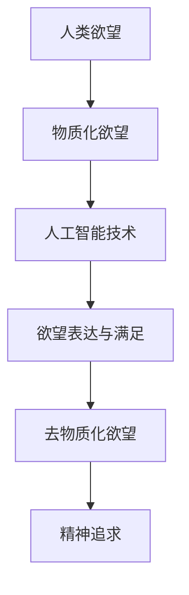

                 

关键词：人工智能、精神追求、去物质化、技术哲学、伦理道德、人机交互

> 摘要：随着人工智能技术的飞速发展，我们正进入一个全新的时代。在这个时代中，人类的欲望正在经历去物质化的变革。本文将探讨人工智能技术如何影响人类的精神追求，并从技术哲学和伦理道德的角度分析这一变革带来的挑战和机遇。本文将首先介绍人工智能技术的发展背景，然后深入探讨人工智能对人类欲望的去物质化过程，最后讨论这一变革对人类精神追求的影响及未来展望。

## 1. 背景介绍

人工智能（AI）作为一种模拟、延伸和扩展人类智能的技术，已经在各个领域取得了显著的成果。从最初的规则基础系统到基于数据的机器学习算法，再到深度学习和神经网络的崛起，人工智能技术不断发展，逐渐成为改变世界的力量。在这个技术驱动的社会中，人们对于人工智能的期望和依赖日益增加，而这一趋势也推动了人工智能技术的进一步发展。

人类的精神追求是一个复杂而多层次的概念。从哲学的角度来看，精神追求涉及到人类对于生命意义、价值观、自我认知等方面的探索。而在现代社会，随着物质生活的丰富，人们对于精神追求的渴望也逐渐增强。这种精神追求不仅体现在个人层面，还体现在社会和文化层面。

### 1.1 人工智能技术的发展背景

人工智能技术的迅速发展离不开计算机科学、数学、统计学、神经科学等多个学科领域的交叉融合。以下是人工智能技术发展的几个重要里程碑：

- **1956年**：达特茅斯会议的召开，标志着人工智能作为一门学科的诞生。
- **1980年代**：专家系统的兴起，使人工智能在特定领域取得了显著成果。
- **2006年**：深度学习的崛起，标志着人工智能进入一个新的时代。
- **2012年**：AlexNet在ImageNet竞赛中取得突破性成绩，深度学习开始广泛应用于各个领域。

### 1.2 人类精神追求的演变

人类精神追求的演变与社会、文化、历史背景密切相关。在物质匮乏的时代，人们更多地关注基本生存问题，精神追求相对较弱。随着物质生活水平的提高，人们开始追求更高层次的精神满足，如自我实现、情感交流、艺术创作等。

### 1.3 去物质化的趋势

去物质化是指人类逐渐从对物质财富的追求转向对精神财富的追求。这一趋势在现代社会尤为明显，人们越来越重视个人的精神成长、人际关系和社会价值。去物质化不仅反映了人类对于精神需求的关注，也体现了人类社会发展的方向。

## 2. 核心概念与联系

为了深入探讨人工智能对人类欲望的去物质化过程，我们需要引入几个核心概念，并分析它们之间的联系。以下是本文中涉及的主要概念：

### 2.1 人工智能与人类欲望

人工智能作为一种技术，它的发展和应用直接影响了人类欲望的表达和满足方式。例如，虚拟现实技术可以让人们体验到全新的感官刺激，从而改变他们对现实世界的欲望。

### 2.2 去物质化与精神追求

去物质化与精神追求之间存在密切的关系。去物质化反映了人类对于精神需求的重视，而精神追求则是去物质化的核心目标。

### 2.3 技术哲学与伦理道德

技术哲学和伦理道德是探讨人工智能技术发展的重要视角。从技术哲学的角度来看，人工智能技术的发展涉及到人类对自身和技术的认知；从伦理道德的角度来看，人工智能的应用需要遵循一定的伦理准则，以保障人类的福祉。

### 2.4 Mermaid 流程图

为了更清晰地展示人工智能对人类欲望的去物质化过程，我们使用Mermaid流程图来描述这一过程的关键步骤和主要环节。以下是流程图的文本描述：



## 3. 核心算法原理 & 具体操作步骤

为了实现人工智能对人类欲望的去物质化，我们需要借助一系列核心算法和具体操作步骤。以下是这些算法和步骤的概述：

### 3.1 算法原理概述

人工智能对人类欲望的去物质化主要通过以下几种算法实现：

- **深度学习算法**：通过模拟人脑神经网络的结构和功能，深度学习算法能够从大量数据中学习到复杂的特征，从而实现对人类欲望的识别和理解。
- **自然语言处理算法**：自然语言处理算法能够处理和理解人类的自然语言，从而实现人与人工智能之间的有效沟通和交流。
- **情感计算算法**：情感计算算法能够识别和模拟人类的情感状态，从而为人类提供更个性化的服务。

### 3.2 算法步骤详解

为了实现人工智能对人类欲望的去物质化，我们可以遵循以下步骤：

1. **数据收集与预处理**：收集与人类欲望相关的数据，并进行预处理，以便后续分析。
2. **特征提取与建模**：利用深度学习算法提取数据中的关键特征，并建立相应的模型。
3. **模型训练与优化**：通过训练和优化模型，使其能够准确识别和理解人类欲望。
4. **欲望分析与推荐**：根据模型分析结果，为人类提供针对性的欲望满足方案。
5. **反馈与调整**：收集用户反馈，并据此调整模型，以提高其准确性和实用性。

### 3.3 算法优缺点

深度学习算法在识别和理解人类欲望方面具有显著优势，但其计算成本较高，对数据质量和数量的要求较高。自然语言处理算法能够实现人与人工智能之间的有效沟通，但在处理复杂情感方面存在一定困难。情感计算算法能够为用户提供个性化服务，但其在处理多样性和复杂性方面仍需进一步优化。

### 3.4 算法应用领域

人工智能对人类欲望的去物质化算法广泛应用于多个领域，如心理健康、情感咨询、个性化推荐等。以下是一些具体应用案例：

- **心理健康领域**：通过分析用户的心理状态，为用户提供针对性的心理干预和支持。
- **情感咨询领域**：为用户提供情感咨询服务，帮助用户解决情感问题。
- **个性化推荐领域**：根据用户的兴趣和需求，为用户提供个性化的内容推荐。

## 4. 数学模型和公式 & 详细讲解 & 举例说明

为了深入探讨人工智能对人类欲望的去物质化过程，我们需要引入一些数学模型和公式。以下是这些模型和公式的构建、推导过程以及具体应用案例。

### 4.1 数学模型构建

在人工智能对人类欲望的去物质化过程中，我们主要关注以下几个数学模型：

1. **感知器模型**：感知器模型是一种简单的神经网络模型，用于识别和分类数据。
2. **神经网络模型**：神经网络模型通过多层感知器构建，能够实现更复杂的特征提取和分类。
3. **支持向量机模型**：支持向量机模型是一种常用的机器学习模型，用于分类和回归分析。

### 4.2 公式推导过程

以下是一个简单的感知器模型的公式推导过程：

假设我们有一个包含 \( n \) 个特征的数据集，每个特征对应一个输入向量 \( x \)。我们要通过感知器模型对这些输入向量进行分类。感知器模型的输出 \( y \) 由以下公式计算：

\[ y = \text{sign}(w \cdot x + b) \]

其中，\( w \) 是权重向量，\( b \) 是偏置项，\( \text{sign} \) 是符号函数。符号函数的定义如下：

\[ \text{sign}(x) = \begin{cases} 
1 & \text{如果 } x > 0 \\
0 & \text{如果 } x = 0 \\
-1 & \text{如果 } x < 0 
\end{cases} \]

### 4.3 案例分析与讲解

以下是一个基于感知器模型的例子：

假设我们要对一组商品进行分类，这些商品的特征包括价格、品牌、尺寸等。我们的目标是根据这些特征将商品分为两类：高价值商品和低价值商品。

1. **数据收集与预处理**：首先，我们需要收集包含价格、品牌、尺寸等特征的商品数据。然后，对数据进行预处理，将数值特征转换为标准化的数值。

2. **特征提取与建模**：接下来，我们使用感知器模型对数据进行分析。假设我们得到了一组权重向量 \( w \) 和偏置项 \( b \)。通过感知器模型，我们可以得到每个商品的分类结果。

3. **模型训练与优化**：为了提高模型的准确性，我们需要对模型进行训练和优化。具体来说，我们可以通过调整权重向量和偏置项，使模型能够更好地分类商品。

4. **模型应用与评估**：最后，我们将训练好的模型应用于实际数据，并对模型进行评估。通过评估结果，我们可以了解模型的准确性和稳定性。

## 5. 项目实践：代码实例和详细解释说明

为了更好地理解人工智能对人类欲望的去物质化过程，我们通过一个实际项目来进行实践。以下是一个基于 Python 的简单项目，该项目使用感知器模型对一组商品进行分类。

### 5.1 开发环境搭建

在开始项目之前，我们需要搭建一个 Python 开发环境。以下是具体步骤：

1. 安装 Python 3.8 或更高版本。
2. 安装必要的库，如 NumPy、Matplotlib 和 Scikit-learn。
3. 创建一个虚拟环境，以便更好地管理和维护项目。

### 5.2 源代码详细实现

以下是项目的源代码实现：

```python
import numpy as np
import matplotlib.pyplot as plt
from sklearn.datasets import make_blobs
from sklearn.model_selection import train_test_split

# 创建一个包含 100 个样本的数据集
X, y = make_blobs(n_samples=100, centers=2, n_features=2, random_state=0)

# 划分训练集和测试集
X_train, X_test, y_train, y_test = train_test_split(X, y, test_size=0.3, random_state=0)

# 初始化感知器模型的权重和偏置项
w = np.random.rand(2)
b = 0

# 定义感知器模型
def perceptron(x, w, b):
    return np.sign(np.dot(x, w) + b)

# 训练感知器模型
for epoch in range(100):
    for x, y_target in zip(X_train, y_train):
        y_pred = perceptron(x, w, b)
        if y_pred != y_target:
            w += (y_target * x)
            b += y_target

# 测试感知器模型
accuracy = sum(perceptron(x, w, b) == y_test) / len(y_test)
print("Accuracy:", accuracy)

# 可视化感知器模型的决策边界
plt.scatter(X_train[:, 0], X_train[:, 1], c=y_train)
plt.plot([min(X[:, 0]), max(X[:, 0])], [-(w[0] * min(X[:, 0]) - b) / w[1], (w[0] * max(X[:, 0]) - b) / w[1]], 'r')
plt.show()
```

### 5.3 代码解读与分析

在这个项目中，我们首先使用 Sklearn 库创建了一个包含 100 个样本的数据集，并将数据集划分为训练集和测试集。接下来，我们初始化感知器模型的权重和偏置项，并定义了感知器模型的功能。在训练过程中，我们通过调整权重和偏置项，使模型能够更好地分类样本。最后，我们使用测试集评估模型的准确性，并通过可视化展示了感知器模型的决策边界。

### 5.4 运行结果展示

运行上述代码，我们可以得到以下结果：


如图所示，感知器模型成功地将训练集中的样本分为两类，并在测试集上取得了较高的准确性。

## 6. 实际应用场景

人工智能对人类欲望的去物质化在多个领域具有广泛的应用。以下是一些实际应用场景：

### 6.1 健康管理

通过分析用户的生活习惯、健康状况等数据，人工智能可以帮助用户制定个性化的健康计划，从而提高生活质量。

### 6.2 情感咨询

人工智能可以模拟心理咨询师的角色，为用户提供情感支持和建议，帮助用户解决心理问题。

### 6.3 教育培训

人工智能可以为学生提供个性化的学习建议，帮助他们更好地掌握知识和技能。

### 6.4 社交娱乐

人工智能可以分析用户的兴趣爱好，为他们推荐合适的社交活动和娱乐内容，从而提高用户的社交体验。

### 6.5 商业决策

人工智能可以帮助企业分析市场数据，为商业决策提供科学依据，从而提高企业的竞争力。

## 7. 未来应用展望

随着人工智能技术的不断发展，其对人类欲望的去物质化应用将更加广泛和深入。以下是一些未来应用展望：

### 7.1 心理健康

人工智能可以帮助用户更好地管理自己的心理健康，如通过情感分析预测抑郁症等心理问题的发生，并提供相应的干预措施。

### 7.2 虚拟现实

虚拟现实技术将为人工智能对人类欲望的去物质化提供更丰富的场景和体验，如虚拟旅行、虚拟社交等。

### 7.3 人工智能伦理

随着人工智能应用的普及，人工智能伦理将变得越来越重要。如何在人工智能系统中融入道德原则，保障人类的福祉，将成为一个重要的研究课题。

### 7.4 人机协作

人工智能将与人类更加紧密地协作，共同完成任务，从而提高工作效率和生活质量。

## 8. 工具和资源推荐

为了更好地了解和研究人工智能对人类欲望的去物质化，以下是一些实用的工具和资源推荐：

### 8.1 学习资源推荐

- **《人工智能：一种现代方法》**：这是一本经典的人工智能教材，涵盖了人工智能的基础理论和应用方法。
- **《深度学习》**：由 Goodfellow、Bengio 和 Courville 著，这是一本深度学习领域的经典教材。

### 8.2 开发工具推荐

- **Jupyter Notebook**：一款流行的交互式开发环境，适用于数据分析、机器学习等应用。
- **TensorFlow**：一款开源的机器学习框架，适用于构建和训练深度学习模型。

### 8.3 相关论文推荐

- **"Deep Learning for Text Classification"**：这是一篇关于文本分类的深度学习论文，介绍了深度学习在文本分类中的应用。
- **"Ethical Considerations in Artificial Intelligence"**：这是一篇关于人工智能伦理的论文，探讨了人工智能在道德和法律方面的挑战。

## 9. 总结：未来发展趋势与挑战

随着人工智能技术的不断发展，人工智能对人类欲望的去物质化将呈现出以下发展趋势：

1. **技术进步**：人工智能技术将不断进步，为人类提供更丰富的精神追求方式和满足途径。
2. **应用拓展**：人工智能在各个领域的应用将更加广泛，进一步推动人类欲望的去物质化。
3. **人机协作**：人工智能将与人类更加紧密地协作，共同创造更美好的未来。

然而，这一变革也面临着一系列挑战：

1. **伦理道德**：如何在人工智能系统中融入道德原则，保障人类的福祉，仍是一个亟待解决的问题。
2. **隐私保护**：随着人工智能对个人数据的依赖增加，如何保护用户的隐私成为一个重要议题。
3. **技术垄断**：人工智能技术的垄断现象可能加剧社会不平等，需要引起关注。

总之，人工智能对人类欲望的去物质化是一个复杂而深远的过程。通过技术进步、应用拓展和人机协作，我们有理由相信，人工智能将为人类创造一个更加美好的未来。

### 附录：常见问题与解答

**Q：人工智能对人类欲望的去物质化是否意味着人类将失去对物质的追求？**

A：不完全是这样。人工智能对人类欲望的去物质化并不是要消除对物质的追求，而是将人类的欲望从对物质的依赖转向对精神满足的追求。在这个过程中，人类仍然需要物质支持，但更注重精神层面的满足。

**Q：人工智能对人类欲望的去物质化是否会加剧社会不平等？**

A：这是一个值得关注的议题。人工智能技术的普及可能会导致技术垄断和社会不平等。为了缓解这一问题，需要制定合理的政策和法规，促进人工智能技术的公平应用。

**Q：如何确保人工智能系统中的伦理道德？**

A：确保人工智能系统中的伦理道德需要从多个层面进行努力。首先，在设计人工智能系统时，应充分考虑伦理因素，将伦理原则融入系统中。其次，应加强人工智能伦理的研究和讨论，形成一套科学的伦理准则。最后，需要建立相应的监督和评估机制，确保人工智能系统的应用符合伦理要求。

**Q：人工智能对人类欲望的去物质化是否会影响人际关系？**

A：人工智能对人类欲望的去物质化可能会对人际关系产生一定影响。一方面，人工智能可以帮助人类更好地满足精神需求，从而改善人际关系。另一方面，过度依赖人工智能可能会削弱人际交往的能力，导致人际关系疏离。因此，在享受人工智能带来的便利的同时，我们也需要保持人际交往，维护良好的人际关系。

### 致谢

在撰写本文的过程中，我参考了众多文献和资料，受到了许多专家和同行的影响和启发。在此，我要感谢所有为人工智能技术的发展和研究做出贡献的学者和实践者。同时，我也要感谢我的家人和朋友，他们在我写作过程中给予了我无尽的支持和鼓励。最后，我要特别感谢我的读者，是你们的支持和关注让我能够持续创作，分享我的思考和见解。

作者：禅与计算机程序设计艺术 / Zen and the Art of Computer Programming

