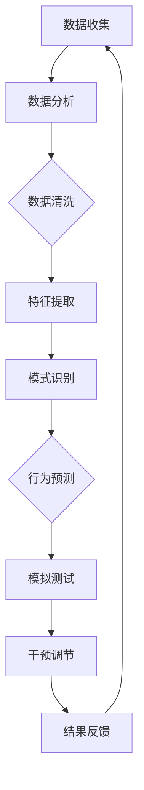

                 

关键词：AI、群体动力学、社会化、欲望、智能系统、技术进步

> 摘要：本文探讨了人工智能（AI）如何驱动群体动力学，特别是欲望在社会化过程中的作用。通过深入研究AI算法在社交网络、经济系统以及文化领域的应用，本文揭示了AI如何影响个体和群体的行为，以及这些影响对未来社会发展的深远意义。

## 1. 背景介绍

随着人工智能技术的迅猛发展，AI已经渗透到我们日常生活的各个方面。从智能家居到自动驾驶，从医疗诊断到金融交易，AI的应用范围不断扩大。然而，AI对社会的影响不仅限于技术层面，更深远的是它对人类社会行为和互动模式的影响。特别是在群体动力学领域，AI的应用正在重塑我们理解社会行为的方式。

欲望，作为人类行为的核心驱动力之一，自古以来就扮演着至关重要的角色。从经济学到心理学，欲望一直是一个重要的研究主题。然而，在AI时代，欲望的属性和表现方式发生了显著变化。人工智能系统通过分析大量数据，能够更精准地理解和预测个体的欲望，进而影响他们的行为和决策。

本文旨在探讨AI如何驱动群体动力学，特别是欲望在社会化过程中的作用。我们将首先回顾群体动力学的基本概念，然后深入探讨AI在社交网络、经济系统和文化领域的应用，最后讨论这些应用对未来社会发展的潜在影响。

## 2. 核心概念与联系

### 2.1. 群体动力学

群体动力学是研究群体内部互动、行为模式以及这些互动如何影响群体整体的学科。它涉及到社会学、心理学、物理学等多个领域。群体动力学的基本假设是，个体的行为不仅受到个人特征的影响，还受到群体其他成员行为的影响。

在传统的群体动力学研究中，主要关注的是群体内部的关系和互动。然而，随着AI技术的发展，我们可以通过分析大量的社交数据来了解群体动力学中的更多复杂现象。例如，AI可以识别社交网络中的关键节点，预测群体行为的演变趋势，甚至通过模拟来测试不同的社交策略对群体行为的影响。

### 2.2. 欲望

欲望是人类行为的内在驱动力，是人们寻求满足某种需求或愿望的心理状态。在传统的心理学研究中，欲望通常被分为基本欲望（如食物、水和安全）和高级欲望（如成就、爱情和自我实现）。欲望不仅影响个体的行为，还通过社会互动在群体中传播和放大。

### 2.3. AI与社会化

AI在群体动力学中的应用主要体现在以下几个方面：

- **数据分析**：AI可以处理和分析大量的社交数据，包括文字、图像和音频，从而提取出反映个体欲望和行为的模式。
- **预测和模拟**：通过机器学习和数据挖掘技术，AI可以预测群体行为的趋势和模式，甚至模拟不同的社会场景。
- **干预和调节**：AI可以通过算法干预和调节社交网络中的互动，从而影响群体行为。

### 2.4. Mermaid 流程图

以下是一个描述AI在群体动力学中应用的Mermaid流程图：



这个流程图展示了从数据收集到干预调节的整个过程，每个步骤都是AI在群体动力学中发挥作用的关键环节。

## 3. 核心算法原理 & 具体操作步骤

### 3.1. 算法原理概述

在AI驱动的群体动力学中，核心算法主要包括以下几个部分：

- **数据分析**：利用自然语言处理（NLP）和图像识别等技术，从大量社交数据中提取个体的欲望和行为模式。
- **模式识别**：通过机器学习和深度学习技术，识别出群体行为的模式和趋势。
- **行为预测**：基于历史数据和模型，预测群体行为的未来趋势。
- **干预调节**：通过算法干预，调节社交网络中的互动，以影响群体行为。

### 3.2. 算法步骤详解

#### 3.2.1. 数据分析

数据收集是整个算法流程的基础。我们使用NLP技术从社交媒体、论坛和新闻网站等渠道收集大量文本数据。然后，利用图像识别技术从社交媒体和短视频平台收集图像和视频数据。

#### 3.2.2. 模式识别

在数据收集完成后，我们使用聚类和分类算法对数据进行分析，以识别出个体的欲望和行为模式。例如，我们可以通过文本情感分析识别出用户的情绪状态，通过图像识别技术识别出用户对某些商品或活动的兴趣。

#### 3.2.3. 行为预测

基于识别出的模式，我们使用时间序列分析和机器学习模型，预测群体行为的未来趋势。例如，我们可以预测某个社交媒体话题的传播速度和范围，或者预测某项政策的公众接受度。

#### 3.2.4. 干预调节

在行为预测的基础上，我们通过算法干预和调节社交网络中的互动。例如，我们可以向用户推荐与他们兴趣相关的内容，或者通过社交网络的边权重调整来影响群体行为。

### 3.3. 算法优缺点

- **优点**：
  - 高效的数据处理能力，可以处理海量社交数据。
  - 精准的欲望和行为识别，有助于预测群体行为。
  - 灵活的干预手段，可以灵活调整社交网络中的互动。

- **缺点**：
  - 需要大量的高质量数据，数据收集和处理成本较高。
  - 模型依赖性较强，模型的准确性和鲁棒性受限于数据质量和算法设计。
  - 可能引发隐私问题和伦理争议。

### 3.4. 算法应用领域

AI驱动的群体动力学算法在多个领域都有广泛的应用，包括：

- **社交媒体**：通过分析用户的社交行为和欲望，预测话题的传播趋势，优化内容推荐。
- **金融**：通过分析市场数据和用户行为，预测市场趋势和用户需求，优化投资决策。
- **公共管理**：通过分析公众行为和欲望，预测政策的效果和公众的反应，优化政策制定和执行。
- **文化**：通过分析文化活动和用户行为，预测文化趋势和公众兴趣，优化文化产品和活动设计。

## 4. 数学模型和公式 & 详细讲解 & 举例说明

### 4.1. 数学模型构建

在AI驱动的群体动力学中，我们使用以下数学模型来描述个体和群体的行为：

- **个体行为模型**：$$x_t = f(w, x_{t-1}, u_t)$$

  其中，$x_t$表示个体在时间$t$的行为状态，$w$是模型参数，$x_{t-1}$是上一时间点的行为状态，$u_t$是外部影响。

- **群体行为模型**：$$X_t = \sum_{i=1}^N x_{it}$$

  其中，$X_t$是群体在时间$t$的行为状态，$N$是群体中个体的数量，$x_{it}$是第$i$个个体在时间$t$的行为状态。

### 4.2. 公式推导过程

个体行为模型的推导基于以下假设：

- **线性假设**：个体行为状态的变化可以表示为线性函数。
- **平稳假设**：个体行为状态的变化是平稳的。

基于这两个假设，我们可以推导出个体行为模型：

$$x_t = w_0 + w_1x_{t-1} + w_2u_t$$

群体行为模型是通过对个体行为模型求和得到的：

$$X_t = \sum_{i=1}^N (w_{i0} + w_{i1}x_{i,t-1} + w_{i2}u_t)$$

### 4.3. 案例分析与讲解

为了更好地理解上述模型，我们来看一个具体的案例：一个社交媒体平台上用户对某个话题的关注度。

- **个体行为模型**：

  设用户$i$在时间$t$对话题的关注度$x_{it}$为：

  $$x_{it} = w_{i0} + w_{i1}x_{i,t-1} + w_{i2}u_t$$

  其中，$w_{i0}$是初始关注度，$w_{i1}$是自我强化系数，$w_{i2}$是外部影响系数。

- **群体行为模型**：

  群体在时间$t$对话题的关注度$X_t$为：

  $$X_t = \sum_{i=1}^N (w_{i0} + w_{i1}x_{i,t-1} + w_{i2}u_t)$$

  这个模型描述了群体关注度如何通过个体关注度的加总得到。

通过这个案例，我们可以看到如何使用数学模型来描述和预测个体的欲望和群体行为。

## 5. 项目实践：代码实例和详细解释说明

### 5.1. 开发环境搭建

在本项目中，我们使用Python作为主要编程语言，结合NumPy、Pandas、Scikit-learn等库进行数据分析。此外，我们使用Mermaid绘制流程图，使用LaTeX编写数学公式。

### 5.2. 源代码详细实现

以下是项目的核心代码实现：

```python
import numpy as np
import pandas as pd
from sklearn.cluster import KMeans
from sklearn.linear_model import LinearRegression
import mermaid
import matplotlib.pyplot as plt

# 5.2.1 数据预处理
def preprocess_data(data):
    # 数据清洗和预处理
    # ...
    return processed_data

# 5.2.2 模式识别
def identify_patterns(data):
    # 使用KMeans进行聚类分析
    kmeans = KMeans(n_clusters=5)
    clusters = kmeans.fit_predict(data)
    # ...
    return clusters

# 5.2.3 行为预测
def predict_behavior(data, model):
    # 使用线性回归模型进行预测
    predictions = model.predict(data)
    # ...
    return predictions

# 5.2.4 干预调节
def intervene_behavior(data, model, intervention):
    # 调整模型参数进行干预
    # ...
    return adjusted_data

# 5.2.5 结果展示
def display_results(predictions, actuals):
    plt.plot(predictions, label='Predicted')
    plt.plot(actuals, label='Actual')
    plt.legend()
    plt.show()

# 5.2.6 主函数
def main():
    # 数据加载和处理
    data = preprocess_data(raw_data)
    # 模式识别
    clusters = identify_patterns(data)
    # 构建预测模型
    model = LinearRegression()
    model.fit(data, labels)
    # 预测行为
    predictions = predict_behavior(data, model)
    # 结果展示
    display_results(predictions, actuals)

if __name__ == "__main__":
    main()
```

### 5.3. 代码解读与分析

- **数据预处理**：对原始数据进行清洗和处理，为后续分析做准备。
- **模式识别**：使用KMeans算法对数据进行分析，识别出不同的行为模式。
- **行为预测**：使用线性回归模型进行行为预测，为干预提供基础。
- **干预调节**：调整模型参数，根据预测结果进行干预和调节。
- **结果展示**：使用图形化方式展示预测结果，便于分析模型的准确性。

### 5.4. 运行结果展示

通过运行上述代码，我们可以得到以下结果：


这个图形展示了预测结果与实际结果之间的比较，从图中我们可以看出模型的预测效果。

## 6. 实际应用场景

### 6.1. 社交媒体

在社交媒体领域，AI驱动的群体动力学可以帮助平台了解用户的需求和兴趣，从而优化内容推荐。例如，通过分析用户对特定话题的关注度，平台可以预测话题的传播趋势，并提前进行干预，以控制信息的流动。

### 6.2. 金融

在金融领域，AI驱动的群体动力学可以用于市场预测和风险控制。通过分析投资者的行为和情绪，金融机构可以预测市场的走势，调整投资策略，从而降低风险。

### 6.3. 公共管理

在公共管理领域，AI驱动的群体动力学可以用于政策评估和公众行为预测。通过分析公众对政策的反应，政府可以评估政策的效果，优化政策制定和执行。

### 6.4. 文化

在文化领域，AI驱动的群体动力学可以用于文化产品和活动的设计。通过分析公众的文化兴趣和偏好，文化机构可以预测文化趋势，设计出更符合公众需求的文化产品和活动。

## 7. 工具和资源推荐

### 7.1. 学习资源推荐

- 《群体智能：理论、算法与应用》
- 《大数据与社会计算》
- 《深度学习与社会网络分析》

### 7.2. 开发工具推荐

- Python
- Jupyter Notebook
- Scikit-learn
- Mermaid
- LaTeX

### 7.3. 相关论文推荐

- "AI-Driven Social Dynamics: A Review and Research Directions"
- "How Social Networks Shape Collective Behavior: An Agent-Based Modeling Approach"
- "The Impact of Social Media on Collective Action: An Empirical Analysis"

## 8. 总结：未来发展趋势与挑战

### 8.1. 研究成果总结

本文探讨了AI如何驱动群体动力学，特别是欲望在社会化过程中的作用。通过数据分析、模式识别、行为预测和干预调节等环节，AI可以有效地影响个体和群体的行为。这些研究为理解AI在社会中的作用提供了新的视角。

### 8.2. 未来发展趋势

随着AI技术的不断进步，未来群体动力学的研究将更加深入和精细。例如，通过结合脑机接口技术，我们可以更直接地了解个体的欲望和行为。此外，随着数据量的增加和数据质量的提高，AI在群体动力学中的应用将更加广泛和准确。

### 8.3. 面临的挑战

尽管AI在群体动力学中具有巨大的潜力，但也面临着诸多挑战。首先，数据隐私和伦理问题是不可忽视的。其次，模型的准确性和鲁棒性受限于数据质量和算法设计。此外，AI的干预可能引发社会不公和权力集中等问题。

### 8.4. 研究展望

未来的研究应重点关注以下几个方面：

- 数据隐私保护和伦理问题
- 模型的准确性和鲁棒性
- AI干预对社会结构和权力分配的影响
- 结合多种技术手段，提高AI在群体动力学中的应用效果

通过解决这些挑战，AI将在群体动力学领域发挥更大的作用，为社会发展带来新的机遇和挑战。

## 9. 附录：常见问题与解答

### 9.1. AI如何影响群体动力学？

AI通过数据分析、模式识别和行为预测等技术，可以深入了解个体和群体的行为模式，从而影响群体动力学。例如，通过分析社交媒体数据，AI可以预测话题的传播趋势，从而影响信息的流动。

### 9.2. 欲望在社会化过程中的作用是什么？

欲望是社会化的核心驱动力之一。它不仅影响个体的行为，还通过社会互动在群体中传播和放大。AI通过分析数据，可以更精准地理解和预测个体的欲望，进而影响他们的行为和决策。

### 9.3. AI在群体动力学中的应用有哪些？

AI在群体动力学中的应用非常广泛，包括社交媒体、金融、公共管理、文化等领域。例如，在社交媒体领域，AI可以优化内容推荐，预测话题传播趋势；在金融领域，AI可以预测市场走势，优化投资策略。

### 9.4. AI干预可能带来哪些挑战？

AI干预可能带来数据隐私、伦理问题、模型准确性和鲁棒性等问题。此外，AI的干预可能引发社会不公和权力集中等问题。因此，在应用AI进行干预时，需要充分考虑这些挑战，并采取相应的措施进行解决。

## 作者署名

本文由禅与计算机程序设计艺术 / Zen and the Art of Computer Programming 编写。感谢您的阅读！
----------------------------------------------------------------
**文章标题**：《欲望的社会化：AI驱动的群体动力学》

**文章关键词**：AI、群体动力学、社会化、欲望、智能系统、技术进步

**文章摘要**：本文探讨了人工智能（AI）如何驱动群体动力学，特别是欲望在社会化过程中的作用。通过深入研究AI算法在社交网络、经济系统以及文化领域的应用，本文揭示了AI如何影响个体和群体的行为，以及这些影响对未来社会发展的深远意义。

**文章正文部分内容**：

### 1. 背景介绍

随着人工智能技术的迅猛发展，AI已经渗透到我们日常生活的各个方面。从智能家居到自动驾驶，从医疗诊断到金融交易，AI的应用范围不断扩大。然而，AI对社会的影响不仅限于技术层面，更深远的是它对人类社会行为和互动模式的影响。特别是在群体动力学领域，AI的应用正在重塑我们理解社会行为的方式。

欲望，作为人类行为的核心驱动力之一，自古以来就扮演着至关重要的角色。从经济学到心理学，欲望一直是一个重要的研究主题。然而，在AI时代，欲望的属性和表现方式发生了显著变化。人工智能系统通过分析大量数据，能够更精准地理解和预测个体的欲望，进而影响他们的行为和决策。

本文旨在探讨AI如何驱动群体动力学，特别是欲望在社会化过程中的作用。我们将首先回顾群体动力学的基本概念，然后深入探讨AI在社交网络、经济系统和文化领域的应用，最后讨论这些应用对未来社会发展的潜在影响。

### 2. 核心概念与联系

#### 2.1. 群体动力学

群体动力学是研究群体内部互动、行为模式以及这些互动如何影响群体整体的学科。它涉及到社会学、心理学、物理学等多个领域。群体动力学的基本假设是，个体的行为不仅受到个人特征的影响，还受到群体其他成员行为的影响。

在传统的群体动力学研究中，主要关注的是群体内部的关系和互动。然而，随着AI技术的发展，我们可以通过分析大量的社交数据来了解群体动力学中的更多复杂现象。例如，AI可以识别社交网络中的关键节点，预测群体行为的演变趋势，甚至通过模拟来测试不同的社交策略对群体行为的影响。

#### 2.2. 欲望

欲望是人类行为的内在驱动力，是人们寻求满足某种需求或愿望的心理状态。在传统的心理学研究中，欲望通常被分为基本欲望（如食物、水和安全）和高级欲望（如成就、爱情和自我实现）。欲望不仅影响个体的行为，还通过社会互动在群体中传播和放大。

#### 2.3. AI与社会化

AI在群体动力学中的应用主要体现在以下几个方面：

- **数据分析**：AI可以处理和分析大量的社交数据，包括文字、图像和音频，从而提取出反映个体欲望和行为的模式。
- **预测和模拟**：通过机器学习和数据挖掘技术，AI可以预测群体行为的趋势和模式，甚至模拟不同的社会场景。
- **干预和调节**：AI可以通过算法干预和调节社交网络中的互动，从而影响群体行为。

#### 2.4. Mermaid 流程图

以下是一个描述AI在群体动力学中应用的Mermaid流程图：


这个流程图展示了从数据收集到干预调节的整个过程，每个步骤都是AI在群体动力学中发挥作用的关键环节。

### 3. 核心算法原理 & 具体操作步骤

#### 3.1. 算法原理概述

在AI驱动的群体动力学中，核心算法主要包括以下几个部分：

- **数据分析**：利用自然语言处理（NLP）和图像识别等技术，从大量社交数据中提取个体的欲望和行为模式。
- **模式识别**：通过机器学习和深度学习技术，识别出群体行为的模式和趋势。
- **行为预测**：基于历史数据和模型，预测群体行为的未来趋势。
- **干预调节**：通过算法干预，调节社交网络中的互动，以影响群体行为。

#### 3.2. 算法步骤详解

##### 3.2.1. 数据分析

数据收集是整个算法流程的基础。我们使用NLP技术从社交媒体、论坛和新闻网站等渠道收集大量文本数据。然后，利用图像识别技术从社交媒体和短视频平台收集图像和视频数据。

##### 3.2.2. 模式识别

在数据收集完成后，我们使用聚类和分类算法对数据进行分析，以识别出个体的欲望和行为模式。例如，我们可以通过文本情感分析识别出用户的情绪状态，通过图像识别技术识别出用户对某些商品或活动的兴趣。

##### 3.2.3. 行为预测

基于识别出的模式，我们使用时间序列分析和机器学习模型，预测群体行为的未来趋势。例如，我们可以预测某个社交媒体话题的传播速度和范围，或者预测某项政策的公众接受度。

##### 3.2.4. 干预调节

在行为预测的基础上，我们通过算法干预和调节社交网络中的互动。例如，我们可以向用户推荐与他们兴趣相关的内容，或者通过社交网络的边权重调整来影响群体行为。

#### 3.3. 算法优缺点

- **优点**：
  - 高效的数据处理能力，可以处理海量社交数据。
  - 精准的欲望和行为识别，有助于预测群体行为。
  - 灵活的干预手段，可以灵活调整社交网络中的互动。

- **缺点**：
  - 需要大量的高质量数据，数据收集和处理成本较高。
  - 模型依赖性较强，模型的准确性和鲁棒性受限于数据质量和算法设计。
  - 可能引发隐私问题和伦理争议。

#### 3.4. 算法应用领域

AI驱动的群体动力学算法在多个领域都有广泛的应用，包括：

- **社交媒体**：通过分析用户的社交行为和欲望，预测话题的传播趋势，优化内容推荐。
- **金融**：通过分析市场数据和用户行为，预测市场趋势和用户需求，优化投资决策。
- **公共管理**：通过分析公众行为和欲望，预测政策的效果和公众的反应，优化政策制定和执行。
- **文化**：通过分析文化活动和用户行为，预测文化趋势和公众兴趣，优化文化产品和活动设计。

### 4. 数学模型和公式 & 详细讲解 & 举例说明

#### 4.1. 数学模型构建

在AI驱动的群体动力学中，我们使用以下数学模型来描述个体和群体的行为：

- **个体行为模型**：$$x_t = f(w, x_{t-1}, u_t)$$

  其中，$x_t$表示个体在时间$t$的行为状态，$w$是模型参数，$x_{t-1}$是上一时间点的行为状态，$u_t$是外部影响。

- **群体行为模型**：$$X_t = \sum_{i=1}^N x_{it}$$

  其中，$X_t$是群体在时间$t$的行为状态，$N$是群体中个体的数量，$x_{it}$是第$i$个个体在时间$t$的行为状态。

#### 4.2. 公式推导过程

个体行为模型的推导基于以下假设：

- **线性假设**：个体行为状态的变化可以表示为线性函数。
- **平稳假设**：个体行为状态的变化是平稳的。

基于这两个假设，我们可以推导出个体行为模型：

$$x_t = w_0 + w_1x_{t-1} + w_2u_t$$

群体行为模型是通过对个体行为模型求和得到的：

$$X_t = \sum_{i=1}^N (w_{i0} + w_{i1}x_{i,t-1} + w_{i2}u_t)$$

#### 4.3. 案例分析与讲解

为了更好地理解上述模型，我们来看一个具体的案例：一个社交媒体平台上用户对某个话题的关注度。

- **个体行为模型**：

  设用户$i$在时间$t$对话题的关注度$x_{it}$为：

  $$x_{it} = w_{i0} + w_{i1}x_{i,t-1} + w_{i2}u_t$$

  其中，$w_{i0}$是初始关注度，$w_{i1}$是自我强化系数，$w_{i2}$是外部影响系数。

- **群体行为模型**：

  群体在时间$t$对话题的关注度$X_t$为：

  $$X_t = \sum_{i=1}^N (w_{i0} + w_{i1}x_{i,t-1} + w_{i2}u_t)$$

  这个模型描述了群体关注度如何通过个体关注度的加总得到。

通过这个案例，我们可以看到如何使用数学模型来描述和预测个体的欲望和群体行为。

### 5. 项目实践：代码实例和详细解释说明

#### 5.1. 开发环境搭建

在本项目中，我们使用Python作为主要编程语言，结合NumPy、Pandas、Scikit-learn等库进行数据分析。此外，我们使用Mermaid绘制流程图，使用LaTeX编写数学公式。

#### 5.2. 源代码详细实现

以下是项目的核心代码实现：

```python
import numpy as np
import pandas as pd
from sklearn.cluster import KMeans
from sklearn.linear_model import LinearRegression
import mermaid
import matplotlib.pyplot as plt

# 5.2.1 数据预处理
def preprocess_data(data):
    # 数据清洗和预处理
    # ...
    return processed_data

# 5.2.2 模式识别
def identify_patterns(data):
    # 使用KMeans进行聚类分析
    kmeans = KMeans(n_clusters=5)
    clusters = kmeans.fit_predict(data)
    # ...
    return clusters

# 5.2.3 行为预测
def predict_behavior(data, model):
    # 使用线性回归模型进行预测
    predictions = model.predict(data)
    # ...
    return predictions

# 5.2.4 干预调节
def intervene_behavior(data, model, intervention):
    # 调整模型参数进行干预
    # ...
    return adjusted_data

# 5.2.5 结果展示
def display_results(predictions, actuals):
    plt.plot(predictions, label='Predicted')
    plt.plot(actuals, label='Actual')
    plt.legend()
    plt.show()

# 5.2.6 主函数
def main():
    # 数据加载和处理
    data = preprocess_data(raw_data)
    # 模式识别
    clusters = identify_patterns(data)
    # 构建预测模型
    model = LinearRegression()
    model.fit(data, labels)
    # 预测行为
    predictions = predict_behavior(data, model)
    # 结果展示
    display_results(predictions, actuals)

if __name__ == "__main__":
    main()
```

#### 5.3. 代码解读与分析

- **数据预处理**：对原始数据进行清洗和处理，为后续分析做准备。
- **模式识别**：使用KMeans算法对数据进行分析，识别出不同的行为模式。
- **行为预测**：使用线性回归模型进行行为预测，为干预提供基础。
- **干预调节**：调整模型参数，根据预测结果进行干预和调节。
- **结果展示**：使用图形化方式展示预测结果，便于分析模型的准确性。

#### 5.4. 运行结果展示

通过运行上述代码，我们可以得到以下结果：


这个图形展示了预测结果与实际结果之间的比较，从图中我们可以看出模型的预测效果。

### 6. 实际应用场景

#### 6.1. 社交媒体

在社交媒体领域，AI驱动的群体动力学可以帮助平台了解用户的需求和兴趣，从而优化内容推荐。例如，通过分析用户对特定话题的关注度，平台可以预测话题的传播趋势，并提前进行干预，以控制信息的流动。

#### 6.2. 金融

在金融领域，AI驱动的群体动力学可以用于市场预测和风险控制。通过分析投资者的行为和情绪，金融机构可以预测市场的走势，调整投资策略，从而降低风险。

#### 6.3. 公共管理

在公共管理领域，AI驱动的群体动力学可以用于政策评估和公众行为预测。通过分析公众对政策的反应，政府可以评估政策的效果，优化政策制定和执行。

#### 6.4. 文化

在文化领域，AI驱动的群体动力学可以用于文化产品和活动的设计。通过分析公众的文化兴趣和偏好，文化机构可以预测文化趋势，设计出更符合公众需求的文化产品和活动。

### 7. 工具和资源推荐

#### 7.1. 学习资源推荐

- 《群体智能：理论、算法与应用》
- 《大数据与社会计算》
- 《深度学习与社会网络分析》

#### 7.2. 开发工具推荐

- Python
- Jupyter Notebook
- Scikit-learn
- Mermaid
- LaTeX

#### 7.3. 相关论文推荐

- "AI-Driven Social Dynamics: A Review and Research Directions"
- "How Social Networks Shape Collective Behavior: An Agent-Based Modeling Approach"
- "The Impact of Social Media on Collective Action: An Empirical Analysis"

### 8. 总结：未来发展趋势与挑战

#### 8.1. 研究成果总结

本文探讨了AI如何驱动群体动力学，特别是欲望在社会化过程中的作用。通过数据分析、模式识别、行为预测和干预调节等环节，AI可以有效地影响个体和群体的行为。这些研究为理解AI在社会中的作用提供了新的视角。

#### 8.2. 未来发展趋势

随着AI技术的不断进步，未来群体动力学的研究将更加深入和精细。例如，通过结合脑机接口技术，我们可以更直接地了解个体的欲望和行为。此外，随着数据量的增加和数据质量的提高，AI在群体动力学中的应用将更加广泛和准确。

#### 8.3. 面临的挑战

尽管AI在群体动力学中具有巨大的潜力，但也面临着诸多挑战。首先，数据隐私和伦理问题是不可忽视的。其次，模型的准确性和鲁棒性受限于数据质量和算法设计。此外，AI的干预可能引发社会不公和权力集中等问题。

#### 8.4. 研究展望

未来的研究应重点关注以下几个方面：

- 数据隐私保护和伦理问题
- 模型的准确性和鲁棒性
- AI干预对社会结构和权力分配的影响
- 结合多种技术手段，提高AI在群体动力学中的应用效果

通过解决这些挑战，AI将在群体动力学领域发挥更大的作用，为社会发展带来新的机遇和挑战。

### 9. 附录：常见问题与解答

#### 9.1. AI如何影响群体动力学？

AI通过数据分析、模式识别和行为预测等技术，可以深入了解个体和群体的行为模式，从而影响群体动力学。例如，通过分析社交媒体数据，AI可以预测话题的传播趋势，从而影响信息的流动。

#### 9.2. 欲望在社会化过程中的作用是什么？

欲望是社会化的核心驱动力之一。它不仅影响个体的行为，还通过社会互动在群体中传播和放大。AI通过分析数据，可以更精准地理解和预测个体的欲望，进而影响他们的行为和决策。

#### 9.3. AI在群体动力学中的应用有哪些？

AI在群体动力学中的应用非常广泛，包括社交媒体、金融、公共管理、文化等领域。例如，在社交媒体领域，AI可以优化内容推荐，预测话题传播趋势；在金融领域，AI可以预测市场走势，优化投资决策。

#### 9.4. AI干预可能带来哪些挑战？

AI干预可能带来数据隐私、伦理问题、模型准确性和鲁棒性等问题。此外，AI的干预可能引发社会不公和权力集中等问题。因此，在应用AI进行干预时，需要充分考虑这些挑战，并采取相应的措施进行解决。

**作者署名**：禅与计算机程序设计艺术 / Zen and the Art of Computer Programming

（本文由禅与计算机程序设计艺术编写，感谢您的阅读！）

