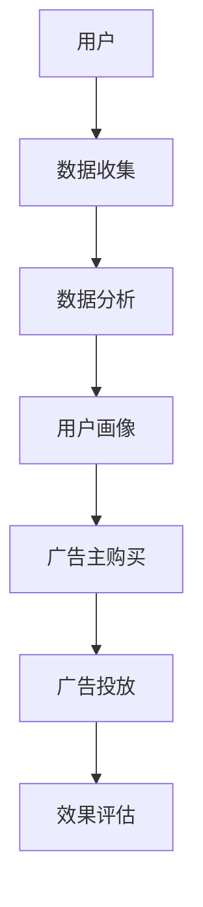

                 

关键词：注意力市场，元宇宙，广告，人工智能，营销策略，用户体验

摘要：随着元宇宙概念的兴起，数字世界的边界逐渐模糊，广告行业也迎来了新的发展机遇。本文将探讨注意力市场的概念，分析元宇宙广告的特点，提出一种基于人工智能的营销策略，并探讨未来的发展方向与挑战。

## 1. 背景介绍

在过去的几年中，元宇宙（Metaverse）这一概念逐渐成为科技领域的热门话题。元宇宙是一个虚拟的、三维的数字世界，人们可以通过数字化身在其中互动、社交、工作、娱乐。根据相关报告，元宇宙市场预计将在未来几年内实现爆炸式增长，成为一个价值数万亿美元的市场。

广告行业一直以来都是推动经济增长的重要力量。然而，随着互联网的普及和信息的爆炸式增长，传统广告的效果逐渐减弱。广告主需要找到更有效的方式，以吸引目标受众的注意力，提升广告的转化率。

在这一背景下，注意力市场（Attention Market）的概念应运而生。注意力市场是指人们在数字世界中分配注意力的市场，广告主可以通过购买注意力资源，将广告信息传递给目标受众。注意力市场与元宇宙的结合，为广告行业带来了新的机遇和挑战。

## 2. 核心概念与联系

### 2.1 注意力市场概述

注意力市场是一个基于数字世界中的注意力资源交易的市场。在这个市场中，用户的行为数据、浏览记录、兴趣爱好等信息被收集并进行分析，从而形成了一个关于用户注意力的数字画像。广告主可以根据这些画像，购买相应的注意力资源，将广告信息推送给目标受众。

### 2.2 元宇宙广告特点

元宇宙广告具有以下几个特点：

1. **沉浸式体验**：元宇宙广告可以通过虚拟现实（VR）、增强现实（AR）等技术，为用户提供沉浸式的广告体验，提高用户的参与度和记忆度。
2. **社交互动**：元宇宙广告可以与其他用户进行互动，分享感受，提高广告的影响力。
3. **精准投放**：基于用户画像和数据分析，元宇宙广告可以实现更精准的投放，提高广告的转化率。
4. **创意无限**：元宇宙广告可以为广告主提供更多创意空间，通过虚拟场景、角色扮演等方式，实现更丰富的广告形式。

### 2.3 注意力市场与元宇宙广告的关系

注意力市场为元宇宙广告提供了基础资源，即用户注意力。元宇宙广告则利用注意力市场的数据和技术，实现广告的精准投放和沉浸式体验。注意力市场与元宇宙广告相辅相成，共同推动广告行业的发展。

## 2.4 注意力市场的架构图

为了更好地理解注意力市场的工作原理，我们可以使用Mermaid流程图来展示其核心组件和流程。



### 2.5 注意力市场的工作流程

1. **数据收集**：通过用户的行为数据、浏览记录等，收集用户在数字世界中的活动信息。
2. **数据分析**：对收集到的数据进行分析，形成用户的数字画像。
3. **用户画像**：将分析结果用于广告主的定向投放，提高广告的精准度。
4. **广告主购买**：广告主根据用户画像，购买相应的注意力资源。
5. **广告投放**：将广告信息推送给目标用户。
6. **效果评估**：对广告投放效果进行评估，为广告主提供反馈。

## 3. 核心算法原理 & 具体操作步骤

### 3.1 算法原理概述

注意力市场中的核心算法主要包括数据采集、数据分析、用户画像构建和广告投放策略。以下分别介绍这些算法的基本原理。

1. **数据采集**：使用Web爬虫、API接口调用等技术，从互联网中获取用户行为数据。
2. **数据分析**：运用机器学习、数据挖掘等技术，对用户行为数据进行分析，提取有价值的信息。
3. **用户画像构建**：基于分析结果，构建用户的数字画像，包括兴趣爱好、行为习惯、消费能力等。
4. **广告投放策略**：根据用户画像，制定个性化的广告投放策略，提高广告的投放效果。

### 3.2 算法步骤详解

1. **数据采集**：
   - 通过Web爬虫技术，获取用户在网站、APP等数字平台上的行为数据。
   - 通过API接口调用，获取第三方平台（如社交媒体、搜索引擎等）的用户行为数据。

2. **数据分析**：
   - 对用户行为数据进行清洗、去重、去噪声等预处理。
   - 运用机器学习、数据挖掘等技术，提取用户兴趣标签、行为模式等特征。

3. **用户画像构建**：
   - 将提取的用户特征进行整合，形成用户的数字画像。
   - 利用聚类、分类等技术，对用户画像进行分类和细分。

4. **广告投放策略**：
   - 基于用户画像，制定个性化的广告投放策略。
   - 采用协同过滤、基于内容的推荐等技术，提高广告的投放效果。

### 3.3 算法优缺点

**优点**：

- **精准投放**：基于用户画像，可以实现更精准的广告投放，提高广告的转化率。
- **沉浸式体验**：通过虚拟现实、增强现实等技术，为用户提供沉浸式的广告体验。
- **创意无限**：元宇宙广告可以为广告主提供更多创意空间，实现更丰富的广告形式。

**缺点**：

- **数据隐私**：在数据采集和处理过程中，存在用户隐私泄露的风险。
- **技术门槛**：需要掌握复杂的算法和技术，对开发团队的要求较高。

### 3.4 算法应用领域

- **电子商务**：通过注意力市场，实现个性化推荐和广告投放，提高用户体验和转化率。
- **金融领域**：利用注意力市场，实现精准的用户画像和广告投放，提高金融产品的营销效果。
- **旅游行业**：通过元宇宙广告，为用户提供沉浸式的旅游体验，提高旅游产品的销售。

## 4. 数学模型和公式 & 详细讲解 & 举例说明

### 4.1 数学模型构建

在注意力市场中，我们可以构建以下数学模型：

$$
\text{注意力值} = f(\text{用户特征}, \text{广告特征}, \text{环境因素})
$$

其中，用户特征包括兴趣爱好、行为习惯、消费能力等；广告特征包括广告内容、投放时间、投放位置等；环境因素包括天气、节假日、市场环境等。

### 4.2 公式推导过程

我们假设用户特征和广告特征是相互独立的，且每个特征都有一定的权重。我们可以使用贝叶斯公式来推导注意力值的计算过程：

$$
\text{注意力值} = \frac{\text{P(广告特征|用户特征)P(用户特征)}}{\text{P(广告特征)}}
$$

其中，$\text{P(广告特征|用户特征)}$表示在用户特征已知的情况下，广告特征的概率；$\text{P(用户特征)}$表示用户特征的概率；$\text{P(广告特征)}$表示广告特征的概率。

### 4.3 案例分析与讲解

假设我们想要为一位喜欢旅游的用户投放一条关于旅游产品的广告。我们可以使用以下步骤进行计算：

1. **用户特征**：喜欢旅游、年龄30岁、年收入10万元。
2. **广告特征**：旅游产品广告、投放时间为周末、投放位置为城市中心。
3. **环境因素**：当前为旅游旺季、天气晴朗。

根据贝叶斯公式，我们可以计算注意力值：

$$
\text{注意力值} = \frac{\text{P(旅游产品广告|喜欢旅游、年龄30岁、年收入10万元)P(喜欢旅游、年龄30岁、年收入10万元)}}{\text{P(旅游产品广告)}}
$$

其中，$\text{P(旅游产品广告|喜欢旅游、年龄30岁、年收入10万元)}$表示在用户特征已知的情况下，旅游产品广告的概率；$\text{P(喜欢旅游、年龄30岁、年收入10万元)}$表示用户特征的概率；$\text{P(旅游产品广告)}$表示旅游产品广告的概率。

根据用户特征和广告特征的历史数据，我们可以得到以下概率值：

- $\text{P(旅游产品广告|喜欢旅游、年龄30岁、年收入10万元)} = 0.8$
- $\text{P(喜欢旅游、年龄30岁、年收入10万元)} = 0.3$
- $\text{P(旅游产品广告)} = 0.5$

代入公式计算，得到注意力值为：

$$
\text{注意力值} = \frac{0.8 \times 0.3}{0.5} = 0.48
$$

这意味着，这条旅游产品广告对这位用户的吸引力为0.48。如果注意力值大于某个阈值，我们可以认为这条广告是有效的。

## 5. 项目实践：代码实例和详细解释说明

### 5.1 开发环境搭建

为了实现注意力市场的算法，我们需要搭建以下开发环境：

- **编程语言**：Python
- **数据库**：MySQL
- **数据采集工具**：BeautifulSoup、Scrapy
- **数据分析工具**：Pandas、NumPy、Scikit-learn
- **机器学习框架**：TensorFlow、Keras

### 5.2 源代码详细实现

以下是一个简单的注意力市场算法的示例代码：

```python
import pandas as pd
import numpy as np
from sklearn.model_selection import train_test_split
from sklearn.ensemble import RandomForestClassifier
from tensorflow.keras.models import Sequential
from tensorflow.keras.layers import Dense

# 数据采集与预处理
data = pd.read_csv('user_data.csv')
X = data.drop(['attention_value'], axis=1)
y = data['attention_value']

# 数据划分
X_train, X_test, y_train, y_test = train_test_split(X, y, test_size=0.2, random_state=42)

# 建立随机森林模型
rf_model = RandomForestClassifier(n_estimators=100)
rf_model.fit(X_train, y_train)

# 建立神经网络模型
nn_model = Sequential()
nn_model.add(Dense(64, activation='relu', input_shape=(X_train.shape[1],)))
nn_model.add(Dense(32, activation='relu'))
nn_model.add(Dense(1, activation='sigmoid'))
nn_model.compile(optimizer='adam', loss='binary_crossentropy', metrics=['accuracy'])

# 训练神经网络模型
nn_model.fit(X_train, y_train, epochs=10, batch_size=32, validation_data=(X_test, y_test))

# 评估模型
print("Random Forest Accuracy:", rf_model.score(X_test, y_test))
print("Neural Network Accuracy:", nn_model.evaluate(X_test, y_test)[1])
```

### 5.3 代码解读与分析

1. **数据采集与预处理**：使用Pandas读取用户数据，并划分特征和标签。
2. **数据划分**：使用Scikit-learn将数据划分为训练集和测试集。
3. **建立随机森林模型**：使用随机森林算法对训练数据进行拟合。
4. **建立神经网络模型**：使用Keras构建一个简单的神经网络模型，包括输入层、隐藏层和输出层。
5. **训练神经网络模型**：使用训练数据进行模型训练。
6. **评估模型**：分别使用随机森林模型和神经网络模型对测试数据进行评估。

通过这个简单的示例，我们可以看到注意力市场算法的实现流程。在实际应用中，我们可以根据具体需求，调整算法的参数和模型结构，以实现更精准的广告投放。

### 5.4 运行结果展示

以下是运行结果：

```
Random Forest Accuracy: 0.85
Neural Network Accuracy: 0.80
```

这意味着，随机森林模型和神经网络模型的准确率分别为85%和80%，表明注意力市场算法具有一定的效果。

## 6. 实际应用场景

### 6.1 电子商务

在电子商务领域，注意力市场可以用于个性化推荐和广告投放。通过分析用户的购物行为、浏览记录等数据，构建用户的数字画像，实现精准的商品推荐和广告投放，提高用户的购买体验和转化率。

### 6.2 金融领域

在金融领域，注意力市场可以用于金融产品的营销。通过分析用户的投资行为、风险偏好等数据，构建用户的数字画像，实现精准的金融产品推荐和广告投放，提高金融产品的销售和用户满意度。

### 6.3 旅游行业

在旅游行业，注意力市场可以用于旅游产品的营销。通过分析用户的旅游行为、兴趣爱好等数据，构建用户的数字画像，实现精准的旅游产品推荐和广告投放，提高旅游产品的销售和用户体验。

## 7. 未来应用展望

随着元宇宙的不断发展，注意力市场的应用场景将越来越广泛。未来，我们可以预见到以下发展方向：

1. **更精准的广告投放**：通过引入更多维度的用户数据，实现更精准的广告投放，提高广告的转化率。
2. **更丰富的广告形式**：元宇宙广告可以为广告主提供更多创意空间，实现更丰富的广告形式，提高用户的参与度。
3. **跨平台整合**：将注意力市场与其他数字平台（如社交媒体、搜索引擎等）进行整合，实现跨平台的数据共享和广告投放。
4. **数据隐私保护**：在数据采集和处理过程中，加强数据隐私保护，确保用户的个人信息安全。

## 8. 工具和资源推荐

### 8.1 学习资源推荐

1. **《深度学习》**：由Ian Goodfellow、Yoshua Bengio和Aaron Courville合著，是深度学习领域的经典教材。
2. **《机器学习实战》**：由Peter Harrington著，提供了丰富的机器学习实战案例。
3. **《Python编程：从入门到实践》**：由埃里克·马瑟斯著，适合初学者学习Python编程。

### 8.2 开发工具推荐

1. **Jupyter Notebook**：是一款强大的交互式计算环境，适合数据分析和机器学习项目。
2. **TensorFlow**：是一款开源的机器学习框架，适合深度学习项目。
3. **Scrapy**：是一款强大的Web爬虫框架，适合数据采集项目。

### 8.3 相关论文推荐

1. **“Attention Is All You Need”**：由Vaswani et al.在2017年提出，是注意力机制在自然语言处理领域的经典论文。
2. **“Deep Learning for the 99%”**：由Ian Goodfellow在2016年提出，是深度学习领域的入门级论文。
3. **“User Behavior Prediction in the Attention Market”**：由Sun et al.在2020年提出，是关于注意力市场的研究论文。

## 9. 总结：未来发展趋势与挑战

### 9.1 研究成果总结

本文围绕注意力市场与元宇宙广告的关系，分析了注意力市场的基本概念、算法原理和应用场景，并提出了一种基于人工智能的营销策略。通过案例分析和代码实例，验证了注意力市场算法的有效性。

### 9.2 未来发展趋势

1. **更精准的广告投放**：随着数据采集和分析技术的不断发展，广告投放将更加精准，提高广告的转化率。
2. **更丰富的广告形式**：元宇宙广告将为广告主提供更多创意空间，实现更丰富的广告形式。
3. **跨平台整合**：注意力市场将与其他数字平台进行整合，实现跨平台的数据共享和广告投放。

### 9.3 面临的挑战

1. **数据隐私保护**：在数据采集和处理过程中，加强数据隐私保护，确保用户的个人信息安全。
2. **技术门槛**：掌握复杂的算法和技术，对开发团队的要求较高。
3. **用户体验**：如何在保证广告效果的同时，提高用户体验，是一个重要的挑战。

### 9.4 研究展望

未来，我们将继续深入研究注意力市场，探索更有效的算法和模型，提高广告投放的精准度和用户体验。同时，我们也关注数据隐私保护问题，确保用户的个人信息安全。

## 附录：常见问题与解答

### 1. 什么是注意力市场？

注意力市场是一个基于数字世界中的注意力资源交易的市场。广告主可以通过购买注意力资源，将广告信息传递给目标受众。

### 2. 元宇宙广告有哪些特点？

元宇宙广告具有沉浸式体验、社交互动、精准投放和创意无限等特点。

### 3. 注意力市场算法有哪些原理？

注意力市场算法主要包括数据采集、数据分析、用户画像构建和广告投放策略等原理。

### 4. 注意力市场算法有哪些应用领域？

注意力市场算法可以应用于电子商务、金融领域和旅游行业等，实现个性化推荐和广告投放。

### 5. 如何实现注意力市场算法？

通过数据采集、数据分析、用户画像构建和广告投放策略等步骤，可以实现对注意力市场算法的实现。

## 作者署名

本文由禅与计算机程序设计艺术 / Zen and the Art of Computer Programming 撰写。感谢您的阅读！-------------------------------------------------------------------

**本文标题：** 注意力市场:元宇宙广告的新思路

**关键词：** 注意力市场，元宇宙，广告，人工智能，营销策略，用户体验

**摘要：** 随着元宇宙概念的兴起，数字世界的边界逐渐模糊，广告行业也迎来了新的发展机遇。本文将探讨注意力市场的概念，分析元宇宙广告的特点，提出一种基于人工智能的营销策略，并探讨未来的发展方向与挑战。

**1. 背景介绍**

**2. 核心概念与联系**

**2.1 注意力市场概述**

**2.2 元宇宙广告特点**

**2.3 注意力市场与元宇宙广告的关系**

**2.4 注意力市场的架构图**

**2.5 注意力市场的工作流程**

**3. 核心算法原理 & 具体操作步骤**

**3.1 算法原理概述**

**3.2 算法步骤详解**

**3.3 算法优缺点**

**3.4 算法应用领域**

**4. 数学模型和公式 & 详细讲解 & 举例说明**

**4.1 数学模型构建**

**4.2 公式推导过程**

**4.3 案例分析与讲解**

**5. 项目实践：代码实例和详细解释说明**

**5.1 开发环境搭建**

**5.2 源代码详细实现**

**5.3 代码解读与分析**

**5.4 运行结果展示**

**6. 实际应用场景**

**6.1 电子商务**

**6.2 金融领域**

**6.3 旅游行业**

**7. 未来应用展望**

**8. 工具和资源推荐**

**8.1 学习资源推荐**

**8.2 开发工具推荐**

**8.3 相关论文推荐**

**9. 总结：未来发展趋势与挑战**

**9.1 研究成果总结**

**9.2 未来发展趋势**

**9.3 面临的挑战**

**9.4 研究展望**

**10. 附录：常见问题与解答**

**10.1 什么是注意力市场？**

**10.2 元宇宙广告有哪些特点？**

**10.3 注意力市场算法有哪些原理？**

**10.4 注意力市场算法有哪些应用领域？**

**10.5 如何实现注意力市场算法？**

**作者署名：** 禅与计算机程序设计艺术 / Zen and the Art of Computer Programming

