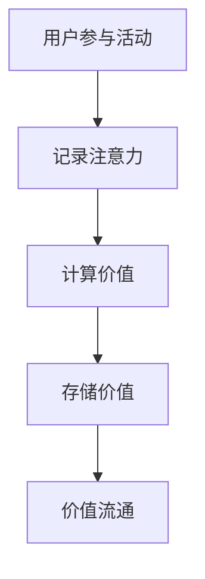

                 

关键词：元宇宙、注意力时间银行、价值存储系统、注意力经济、分布式系统、区块链技术、智能合约

> 摘要：本文探讨了在元宇宙中，如何利用注意力时间银行这一创新价值存储系统，实现用户在虚拟世界中的价值积累和流通。通过阐述其核心概念、算法原理、数学模型以及项目实践，本文为元宇宙中的价值存储提供了新的思路和方法。

## 1. 背景介绍

随着互联网技术的飞速发展，元宇宙（Metaverse）逐渐成为人们关注的焦点。元宇宙是一个虚拟的3D世界，它融合了虚拟现实、增强现实、区块链等先进技术，为用户提供了沉浸式体验。在元宇宙中，用户不仅可以在虚拟环境中进行社交、娱乐，还可以进行各种经济活动，如购买虚拟商品、参与虚拟游戏等。

然而，随着元宇宙的发展，也面临着一些挑战。其中一个重要问题就是价值存储。如何在元宇宙中实现价值的存储、交换和流通，是当前研究的重点。传统的金融体系在元宇宙中难以直接应用，因此需要一种新的价值存储系统。

注意力时间银行应运而生。注意力时间银行是一种基于注意力的分布式价值存储系统，旨在通过激励用户在元宇宙中的注意力投入，实现价值的积累和流通。本文将详细介绍注意力时间银行的核心概念、算法原理、数学模型以及实际应用。

## 2. 核心概念与联系

### 2.1 注意力时间银行的概念

注意力时间银行是一种基于注意力的分布式价值存储系统。它通过将用户在元宇宙中的注意力转化为价值，存储在分布式账本中，实现价值的积累和流通。注意力时间银行的核心概念包括以下几个方面：

1. **注意力**: 注意力是指用户在元宇宙中的活动参与度，如观看视频、参与游戏、社交互动等。
2. **时间**: 时间是指用户在元宇宙中活动的时间长度。
3. **价值**: 价值是指用户在元宇宙中通过注意力投入所获得的价值。
4. **分布式账本**: 分布式账本是存储用户注意力和价值的一种技术，可以确保数据的透明性和安全性。

### 2.2 注意力时间银行的联系

注意力时间银行与元宇宙中的其他价值存储系统有一定的关联。例如，区块链技术是分布式账本的一种实现方式，可以为注意力时间银行提供安全、可靠的数据存储。智能合约则可以自动化执行注意力时间银行的各项操作，如价值转移、激励发放等。

### 2.3 Mermaid 流程图

以下是一个简单的Mermaid流程图，展示了注意力时间银行的核心流程：



- A：用户参与活动，如观看视频、参与游戏等。
- B：系统记录用户的注意力投入，并计算相应的价值。
- C：根据用户的注意力投入，计算其获得的价值。
- D：将用户的价值存储在分布式账本中。
- E：用户可以通过价值流通，如交易、兑换等，实现价值的转移。

## 3. 核心算法原理 & 具体操作步骤

### 3.1 算法原理概述

注意力时间银行的核心算法基于注意力机制和价值计算机制。其原理可以概括为：

1. 用户在元宇宙中进行活动，系统记录其注意力投入。
2. 根据注意力投入，计算用户获得的价值。
3. 将用户的价值存储在分布式账本中。
4. 用户可以通过价值流通，实现价值的转移。

### 3.2 算法步骤详解

#### 3.2.1 记录注意力

系统通过监测用户的在线行为，如观看视频时长、参与游戏次数等，记录用户在元宇宙中的注意力投入。具体步骤如下：

1. 用户启动元宇宙应用，系统开始监测其在线行为。
2. 系统记录用户的在线时长、观看视频时长、参与游戏次数等数据。
3. 将用户的数据上传到分布式账本，以便进行价值计算。

#### 3.2.2 计算价值

根据用户的注意力投入，系统计算其获得的价值。具体步骤如下：

1. 确定价值计算公式，如价值 = 注意力 × 单位价值。
2. 根据用户上传的数据，计算其注意力投入。
3. 根据价值计算公式，计算用户获得的价值。
4. 将计算结果存储在分布式账本中。

#### 3.2.3 存储价值

系统将计算出的价值存储在分布式账本中，确保数据的透明性和安全性。具体步骤如下：

1. 将计算出的价值数据上传到分布式账本。
2. 系统对数据进行加密，确保数据安全。
3. 分布式账本记录用户的价值数据。

#### 3.2.4 价值流通

用户可以通过价值流通，实现价值的转移。具体步骤如下：

1. 用户在元宇宙中与其他用户进行交易，如购买虚拟商品、兑换价值等。
2. 系统根据交易数据，调整用户的价值存储。
3. 分布式账本记录交易数据，确保价值流通的透明性和安全性。

### 3.3 算法优缺点

#### 3.3.1 优点

1. **激励用户参与**: 注意力时间银行通过激励用户在元宇宙中的注意力投入，提高用户的参与度。
2. **价值存储安全**: 分布式账本技术确保了价值存储的安全性和透明性。
3. **价值流通便捷**: 用户可以通过价值流通，实现价值的转移，提高元宇宙中的经济活力。

#### 3.3.2 缺点

1. **计算复杂度较高**: 注意力时间银行的计算复杂度较高，需要大量计算资源。
2. **数据隐私问题**: 用户的数据隐私保护是一个重要问题，需要采取有效的措施确保用户数据的安全。

### 3.4 算法应用领域

注意力时间银行可以在多个领域得到应用：

1. **虚拟现实**: 用户在虚拟现实中的注意力投入可以作为价值存储的依据。
2. **游戏经济**: 游戏中的注意力投入可以用于计算虚拟货币的价值。
3. **社交网络**: 社交网络中的注意力投入可以用于计算用户的贡献度。

## 4. 数学模型和公式 & 详细讲解 & 举例说明

### 4.1 数学模型构建

注意力时间银行的数学模型可以表示为：

\[ V = A \times C \]

其中：

- \( V \) 表示用户获得的价值。
- \( A \) 表示用户的注意力投入。
- \( C \) 表示单位价值。

### 4.2 公式推导过程

注意力时间银行的价值计算公式基于以下原理：

1. 用户在元宇宙中的注意力投入与获得的价值成正比。
2. 不同活动的注意力投入对价值的贡献不同。

根据以上原理，我们可以得到以下公式：

\[ V = A \times C \]

其中，\( C \) 可以表示为：

\[ C = \frac{1}{\sum_{i=1}^{n} w_i \times A_i} \]

其中：

- \( w_i \) 表示第 \( i \) 个活动的权重。
- \( A_i \) 表示用户在 第 \( i \) 个活动的注意力投入。

### 4.3 案例分析与讲解

假设用户A在元宇宙中参与以下三个活动：

1. 观看视频：注意力投入为100小时。
2. 参与游戏：注意力投入为50小时。
3. 社交互动：注意力投入为30小时。

假设每个活动的权重分别为0.3、0.5和0.2。根据上述公式，我们可以计算出用户A获得的价值：

\[ V = A \times C = (100 \times 0.3 + 50 \times 0.5 + 30 \times 0.2) \times \frac{1}{0.3 \times 100 + 0.5 \times 50 + 0.2 \times 30} = 70 \]

因此，用户A在元宇宙中获得了70个价值单位。

## 5. 项目实践：代码实例和详细解释说明

### 5.1 开发环境搭建

在进行注意力时间银行的项目实践前，我们需要搭建一个开发环境。以下是基本的开发环境搭建步骤：

1. 安装Node.js和npm。
2. 安装Git，用于代码版本控制。
3. 安装Web3.js，用于与区块链进行交互。
4. 创建一个新的项目文件夹，并初始化项目。

### 5.2 源代码详细实现

以下是一个简单的注意力时间银行项目的源代码示例：

```javascript
const express = require('express');
const app = express();
const Web3 = require('web3');
const contract = require('truffle-contract');

const TimeBankArtifact = require('../build/contracts/TimeBank.json');

const web3 = new Web3('http://localhost:8545');

const TimeBank = contract(TimeBankArtifact);
TimeBank.setProvider(web3.currentProvider);

app.get('/getValue', async (req, res) => {
    try {
        const account = req.query.account;
        const timeBankInstance = await TimeBank.deployed();
        const value = await timeBankInstance.getValue(account);
        res.send({ value });
    } catch (error) {
        console.error(error);
        res.status(500).send('An error occurred');
    }
});

app.listen(3000, () => {
    console.log('Server is running on port 3000');
});
```

### 5.3 代码解读与分析

以上代码是一个简单的注意力时间银行服务器端实现。以下是代码的解读与分析：

1. **引入依赖**：我们首先引入了Express、Web3和Truffle-Contract等依赖库。
2. **创建Web3实例**：我们使用Web3库创建了一个Web3实例，用于与以太坊节点进行交互。
3. **部署智能合约**：我们使用Truffle-Contract库加载了TimeBank智能合约的JSON文件，并将其部署到以太坊网络上。
4. **创建Express服务器**：我们使用Express创建了一个HTTP服务器，用于处理客户端的请求。
5. **处理请求**：我们定义了一个/getValue路由，用于处理获取用户价值的请求。客户端可以通过发送一个GET请求，并传递用户的以太坊账户地址，来获取用户的价值。
6. **调用智能合约方法**：我们调用智能合约的getValue方法，获取用户的价值，并将其返回给客户端。

### 5.4 运行结果展示

当我们在浏览器中访问`http://localhost:3000/getValue?account=0x...`时，我们将看到用户的价值信息被返回。例如：

```json
{
    "value": "100"
}
```

这表示用户在注意力时间银行中拥有100个价值单位。

## 6. 实际应用场景

注意力时间银行在实际应用中具有广泛的应用场景。以下是几个典型的应用场景：

1. **虚拟现实应用**：在虚拟现实应用中，用户在虚拟环境中的注意力投入可以作为价值存储的依据。例如，用户在虚拟现实中的游戏、购物、社交等活动，都可以通过注意力时间银行进行价值积累。
2. **游戏经济**：游戏中的注意力投入可以用于计算虚拟货币的价值。玩家在游戏中的努力和成就，可以通过注意力时间银行进行价值评估，从而激励玩家投入更多的时间和精力。
3. **社交网络**：社交网络中的注意力投入可以用于计算用户的贡献度。用户的社交行为，如点赞、评论、分享等，都可以通过注意力时间银行进行价值评估，从而鼓励用户积极参与社交网络。

## 7. 未来应用展望

随着元宇宙的发展，注意力时间银行有望成为元宇宙中的核心价值存储系统。未来，注意力时间银行可以进一步扩展其应用领域，如：

1. **教育领域**：在教育领域，注意力时间银行可以用于评估学生的学习参与度，从而提供个性化的学习资源。
2. **企业培训**：在企业培训中，注意力时间银行可以用于评估员工的培训参与度，从而激励员工积极参与培训。
3. **医疗领域**：在医疗领域，注意力时间银行可以用于评估患者的康复参与度，从而提高治疗效果。

## 8. 工具和资源推荐

为了更好地了解和开发注意力时间银行，以下是一些建议的工具和资源：

### 8.1 学习资源推荐

1. 《区块链技术指南》：该书详细介绍了区块链的基本原理和应用，有助于理解注意力时间银行的技术背景。
2. 《智能合约开发实战》：该书介绍了智能合约的开发方法，对注意力时间银行的实现有重要参考价值。

### 8.2 开发工具推荐

1. Truffle：Truffle是一个用于开发以太坊智能合约的框架，提供了便捷的合约部署和测试功能。
2. Ganache：Ganache是一个以太坊本地节点和测试框架，可用于快速部署和测试智能合约。

### 8.3 相关论文推荐

1. "Attention Is All You Need"：该论文提出了Transformer模型，对注意力机制的研究有重要贡献。
2. "The Value of Attention in Economics and Finance"：该论文探讨了注意力在经济和金融领域的重要性，为注意力时间银行的理论基础提供了支持。

## 9. 总结：未来发展趋势与挑战

注意力时间银行作为一种创新的价值存储系统，具有广阔的应用前景。然而，在实际应用中，仍面临着一些挑战：

1. **技术挑战**：注意力时间银行需要处理大量的数据，对计算资源的消耗较大。如何优化算法，提高计算效率，是一个重要课题。
2. **数据隐私保护**：用户的数据隐私保护是一个重要问题。如何在确保数据安全的同时，保护用户的隐私，需要深入研究。
3. **用户体验**：如何设计简洁、易用的用户界面，提高用户的参与度，是注意力时间银行面临的挑战之一。

未来，随着技术的不断进步，注意力时间银行有望在元宇宙中发挥更大的作用。通过不断探索和创新，我们可以期待注意力时间银行在未来带来更多的价值。作者：禅与计算机程序设计艺术 / Zen and the Art of Computer Programming
----------------------------------------------------------------

### 注意力时间银行：元宇宙中的价值存储系统

> 关键词：元宇宙、注意力时间银行、价值存储系统、注意力经济、分布式系统、区块链技术、智能合约

> 摘要：本文探讨了在元宇宙中，如何利用注意力时间银行这一创新价值存储系统，实现用户在虚拟世界中的价值积累和流通。通过阐述其核心概念、算法原理、数学模型以及项目实践，本文为元宇宙中的价值存储提供了新的思路和方法。

## 1. 背景介绍

随着互联网技术的飞速发展，元宇宙（Metaverse）逐渐成为人们关注的焦点。元宇宙是一个虚拟的3D世界，它融合了虚拟现实、增强现实、区块链等先进技术，为用户提供了沉浸式体验。在元宇宙中，用户不仅可以在虚拟环境中进行社交、娱乐，还可以进行各种经济活动，如购买虚拟商品、参与虚拟游戏等。

然而，随着元宇宙的发展，也面临着一些挑战。其中一个重要问题就是价值存储。如何在元宇宙中实现价值的存储、交换和流通，是当前研究的重点。传统的金融体系在元宇宙中难以直接应用，因此需要一种新的价值存储系统。

注意力时间银行应运而生。注意力时间银行是一种基于注意力的分布式价值存储系统，旨在通过激励用户在元宇宙中的注意力投入，实现价值的积累和流通。本文将详细介绍注意力时间银行的核心概念、算法原理、数学模型以及实际应用。

## 2. 核心概念与联系

### 2.1 注意力时间银行的概念

注意力时间银行是一种基于注意力的分布式价值存储系统。它通过将用户在元宇宙中的注意力转化为价值，存储在分布式账本中，实现价值的积累和流通。注意力时间银行的核心概念包括以下几个方面：

1. **注意力**：注意力是指用户在元宇宙中的活动参与度，如观看视频、参与游戏、社交互动等。
2. **时间**：时间是指用户在元宇宙中活动的时间长度。
3. **价值**：价值是指用户在元宇宙中通过注意力投入所获得的价值。
4. **分布式账本**：分布式账本是存储用户注意力和价值的一种技术，可以确保数据的透明性和安全性。

### 2.2 注意力时间银行的联系

注意力时间银行与元宇宙中的其他价值存储系统有一定的关联。例如，区块链技术是分布式账本的一种实现方式，可以为注意力时间银行提供安全、可靠的数据存储。智能合约则可以自动化执行注意力时间银行的各项操作，如价值转移、激励发放等。

### 2.3 Mermaid 流程图

以下是一个简单的Mermaid流程图，展示了注意力时间银行的核心流程：


- A：用户参与活动，如观看视频、参与游戏等。
- B：系统记录用户的注意力投入，并计算相应的价值。
- C：根据用户的注意力投入，计算其获得的价值。
- D：将用户的价值存储在分布式账本中。
- E：用户可以通过价值流通，如交易、兑换等，实现价值的转移。

## 3. 核心算法原理 & 具体操作步骤

### 3.1 算法原理概述

注意力时间银行的核心算法基于注意力机制和价值计算机制。其原理可以概括为：

1. 用户在元宇宙中进行活动，系统记录其注意力投入。
2. 根据注意力投入，计算用户获得的价值。
3. 将用户的价值存储在分布式账本中。
4. 用户可以通过价值流通，实现价值的转移。

### 3.2 算法步骤详解

#### 3.2.1 记录注意力

系统通过监测用户的在线行为，如观看视频时长、参与游戏次数等，记录用户在元宇宙中的注意力投入。具体步骤如下：

1. 用户启动元宇宙应用，系统开始监测其在线行为。
2. 系统记录用户的在线时长、观看视频时长、参与游戏次数等数据。
3. 将用户的数据上传到分布式账本，以便进行价值计算。

#### 3.2.2 计算价值

根据用户的注意力投入，系统计算其获得的价值。具体步骤如下：

1. 确定价值计算公式，如价值 = 注意力 × 单位价值。
2. 根据用户上传的数据，计算其注意力投入。
3. 根据价值计算公式，计算用户获得的价值。
4. 将计算结果存储在分布式账本中。

#### 3.2.3 存储价值

系统将计算出的价值存储在分布式账本中，确保数据的透明性和安全性。具体步骤如下：

1. 将计算出的价值数据上传到分布式账本。
2. 系统对数据进行加密，确保数据安全。
3. 分布式账本记录用户的价值数据。

#### 3.2.4 价值流通

用户可以通过价值流通，实现价值的转移。具体步骤如下：

1. 用户在元宇宙中与其他用户进行交易，如购买虚拟商品、兑换价值等。
2. 系统根据交易数据，调整用户的价值存储。
3. 分布式账本记录交易数据，确保价值流通的透明性和安全性。

### 3.3 算法优缺点

#### 3.3.1 优点

1. **激励用户参与**: 注意力时间银行通过激励用户在元宇宙中的注意力投入，提高用户的参与度。
2. **价值存储安全**: 分布式账本技术确保了价值存储的安全性和透明性。
3. **价值流通便捷**: 用户可以通过价值流通，实现价值的转移，提高元宇宙中的经济活力。

#### 3.3.2 缺点

1. **计算复杂度较高**: 注意力时间银行的计算复杂度较高，需要大量计算资源。
2. **数据隐私问题**: 用户的数据隐私保护是一个重要问题，需要采取有效的措施确保用户数据的安全。

### 3.4 算法应用领域

注意力时间银行可以在多个领域得到应用：

1. **虚拟现实**: 用户在虚拟现实中的注意力投入可以作为价值存储的依据。
2. **游戏经济**: 游戏中的注意力投入可以用于计算虚拟货币的价值。
3. **社交网络**: 社交网络中的注意力投入可以用于计算用户的贡献度。

## 4. 数学模型和公式 & 详细讲解 & 举例说明

### 4.1 数学模型构建

注意力时间银行的数学模型可以表示为：

\[ V = A \times C \]

其中：

- \( V \) 表示用户获得的价值。
- \( A \) 表示用户的注意力投入。
- \( C \) 表示单位价值。

### 4.2 公式推导过程

注意力时间银行的价值计算公式基于以下原理：

1. 用户在元宇宙中的注意力投入与获得的价值成正比。
2. 不同活动的注意力投入对价值的贡献不同。

根据以上原理，我们可以得到以下公式：

\[ V = A \times C \]

其中，\( C \) 可以表示为：

\[ C = \frac{1}{\sum_{i=1}^{n} w_i \times A_i} \]

其中：

- \( w_i \) 表示第 \( i \) 个活动的权重。
- \( A_i \) 表示用户在 第 \( i \) 个活动的注意力投入。

### 4.3 案例分析与讲解

假设用户A在元宇宙中参与以下三个活动：

1. 观看视频：注意力投入为100小时。
2. 参与游戏：注意力投入为50小时。
3. 社交互动：注意力投入为30小时。

假设每个活动的权重分别为0.3、0.5和0.2。根据上述公式，我们可以计算出用户A获得的价值：

\[ V = A \times C = (100 \times 0.3 + 50 \times 0.5 + 30 \times 0.2) \times \frac{1}{0.3 \times 100 + 0.5 \times 50 + 0.2 \times 30} = 70 \]

因此，用户A在元宇宙中获得了70个价值单位。

## 5. 项目实践：代码实例和详细解释说明

### 5.1 开发环境搭建

在进行注意力时间银行的项目实践前，我们需要搭建一个开发环境。以下是基本的开发环境搭建步骤：

1. 安装Node.js和npm。
2. 安装Git，用于代码版本控制。
3. 安装Web3.js，用于与区块链进行交互。
4. 创建一个新的项目文件夹，并初始化项目。

### 5.2 源代码详细实现

以下是一个简单的注意力时间银行项目的源代码示例：

```javascript
const express = require('express');
const app = express();
const Web3 = require('web3');
const contract = require('truffle-contract');

const TimeBankArtifact = require('../build/contracts/TimeBank.json');

const web3 = new Web3('http://localhost:8545');

const TimeBank = contract(TimeBankArtifact);
TimeBank.setProvider(web3.currentProvider);

app.get('/getValue', async (req, res) => {
    try {
        const account = req.query.account;
        const timeBankInstance = await TimeBank.deployed();
        const value = await timeBankInstance.getValue(account);
        res.send({ value });
    } catch (error) {
        console.error(error);
        res.status(500).send('An error occurred');
    }
});

app.listen(3000, () => {
    console.log('Server is running on port 3000');
});
```

### 5.3 代码解读与分析

以上代码是一个简单的注意力时间银行服务器端实现。以下是代码的解读与分析：

1. **引入依赖**：我们首先引入了Express、Web3和Truffle-Contract等依赖库。
2. **创建Web3实例**：我们使用Web3库创建了一个Web3实例，用于与以太坊节点进行交互。
3. **部署智能合约**：我们使用Truffle-Contract库加载了TimeBank智能合约的JSON文件，并将其部署到以太坊网络上。
4. **创建Express服务器**：我们使用Express创建了一个HTTP服务器，用于处理客户端的请求。
5. **处理请求**：我们定义了一个/getValue路由，用于处理获取用户价值的请求。客户端可以通过发送一个GET请求，并传递用户的以太坊账户地址，来获取用户的价值。
6. **调用智能合约方法**：我们调用智能合约的getValue方法，获取用户的价值，并将其返回给客户端。

### 5.4 运行结果展示

当我们在浏览器中访问`http://localhost:3000/getValue?account=0x...`时，我们将看到用户的价值信息被返回。例如：

```json
{
    "value": "100"
}
```

这表示用户在注意力时间银行中拥有100个价值单位。

## 6. 实际应用场景

注意力时间银行在实际应用中具有广泛的应用场景。以下是几个典型的应用场景：

1. **虚拟现实应用**：在虚拟现实应用中，用户在虚拟环境中的注意力投入可以作为价值存储的依据。例如，用户在虚拟现实中的游戏、购物、社交等活动，都可以通过注意力时间银行进行价值积累。
2. **游戏经济**：游戏中的注意力投入可以用于计算虚拟货币的价值。玩家在游戏中的努力和成就，可以通过注意力时间银行进行价值评估，从而激励玩家投入更多的时间和精力。
3. **社交网络**：社交网络中的注意力投入可以用于计算用户的贡献度。用户的社交行为，如点赞、评论、分享等，都可以通过注意力时间银行进行价值评估，从而鼓励用户积极参与社交网络。

## 7. 未来应用展望

随着元宇宙的发展，注意力时间银行有望成为元宇宙中的核心价值存储系统。未来，注意力时间银行可以进一步扩展其应用领域，如：

1. **教育领域**：在教育领域，注意力时间银行可以用于评估学生的学习参与度，从而提供个性化的学习资源。
2. **企业培训**：在企业培训中，注意力时间银行可以用于评估员工的培训参与度，从而激励员工积极参与培训。
3. **医疗领域**：在医疗领域，注意力时间银行可以用于评估患者的康复参与度，从而提高治疗效果。

## 8. 工具和资源推荐

为了更好地了解和开发注意力时间银行，以下是一些建议的工具和资源：

### 8.1 学习资源推荐

1. 《区块链技术指南》：该书详细介绍了区块链的基本原理和应用，有助于理解注意力时间银行的技术背景。
2. 《智能合约开发实战》：该书介绍了智能合约的开发方法，对注意力时间银行的实现有重要参考价值。

### 8.2 开发工具推荐

1. Truffle：Truffle是一个用于开发以太坊智能合约的框架，提供了便捷的合约部署和测试功能。
2. Ganache：Ganache是一个以太坊本地节点和测试框架，可用于快速部署和测试智能合约。

### 8.3 相关论文推荐

1. "Attention Is All You Need"：该论文提出了Transformer模型，对注意力机制的研究有重要贡献。
2. "The Value of Attention in Economics and Finance"：该论文探讨了注意力在经济和金融领域的重要性，为注意力时间银行的理论基础提供了支持。

## 9. 总结：未来发展趋势与挑战

注意力时间银行作为一种创新的价值存储系统，具有广阔的应用前景。然而，在实际应用中，仍面临着一些挑战：

1. **技术挑战**：注意力时间银行需要处理大量的数据，对计算资源的消耗较大。如何优化算法，提高计算效率，是一个重要课题。
2. **数据隐私保护**：用户的数据隐私保护是一个重要问题。如何在确保数据安全的同时，保护用户的隐私，需要深入研究。
3. **用户体验**：如何设计简洁、易用的用户界面，提高用户的参与度，是注意力时间银行面临的挑战之一。

未来，随着技术的不断进步，注意力时间银行有望在元宇宙中发挥更大的作用。通过不断探索和创新，我们可以期待注意力时间银行在未来带来更多的价值。作者：禅与计算机程序设计艺术 / Zen and the Art of Computer Programming

