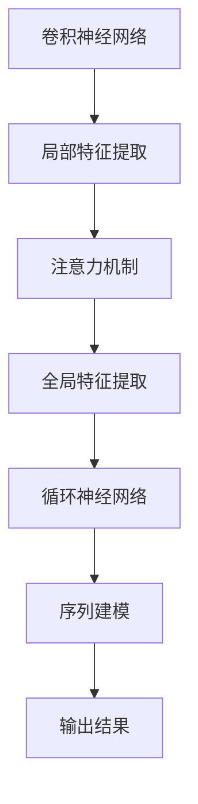

                 

### 1. 背景介绍

注意力机制（Attention Mechanism）是近年来深度学习领域的重要进展之一，特别是在自然语言处理（NLP）和计算机视觉（CV）领域中得到了广泛应用。传统的人工神经网络在处理序列数据时，往往无法有效地关注序列中的关键信息，导致模型性能受到限制。而注意力机制的出现，使得模型能够动态地聚焦于重要信息，从而显著提升了模型的性能。

注意力机制的引入，可以追溯到人类大脑处理信息的方式。人类在处理信息时，能够有选择性地关注某个特定的信息，而忽略其他无关的信息。这种机制在深度学习中得到了模拟，使得模型能够自动地学习到哪些信息是重要的，哪些是次要的。

近年来，随着深度学习技术的发展，注意力机制在NLP和CV领域得到了广泛应用。例如，在NLP领域，注意力机制被用于机器翻译、文本摘要、情感分析等任务中；在CV领域，注意力机制被用于图像分类、目标检测、图像分割等任务中。本文将介绍注意力机制的基本原理、实现方法以及在实际应用中的代码实例。

### 2. 核心概念与联系

#### 2.1 核心概念

注意力机制的核心概念可以概括为以下几点：

1. **全局注意力（Global Attention）**：全局注意力是指模型在处理序列数据时，对序列中的每个元素都给予相同的关注程度。这种注意力机制简单，但往往无法捕捉到序列中的关键信息。

2. **局部注意力（Local Attention）**：局部注意力是指模型在处理序列数据时，只关注序列中的某个局部区域，从而提高了对关键信息的捕捉能力。

3. **软注意力（Soft Attention）**：软注意力是指模型在处理序列数据时，根据每个元素的权重来动态地调整关注程度。这种注意力机制能够更好地捕捉到序列中的关键信息。

4. **硬注意力（Hard Attention）**：硬注意力是指模型在处理序列数据时，只关注序列中的某个特定元素，其他元素被忽略。这种注意力机制能够提高模型的效率，但可能会损失一些信息。

#### 2.2 联系

注意力机制与卷积神经网络（CNN）和循环神经网络（RNN）有着紧密的联系。CNN擅长处理局部特征，而RNN擅长处理序列数据。注意力机制将CNN和RNN的优点结合起来，使得模型能够在处理序列数据时，自动地关注关键信息。

下面是一个简单的 Mermaid 流程图，用于描述注意力机制与CNN、RNN的联系：



### 3. 核心算法原理 & 具体操作步骤

#### 3.1 算法原理概述

注意力机制的原理可以概括为以下几个步骤：

1. **输入序列表示**：首先，将输入序列表示为向量，每个向量表示序列中的某个元素。

2. **计算注意力权重**：计算每个输入向量之间的相似度，得到注意力权重。注意力权重用于调整每个输入向量的重要性。

3. **加权求和**：根据注意力权重，对输入序列进行加权求和，得到一个综合的表示。

4. **输出结果**：使用综合表示进行后续的模型训练或预测。

#### 3.2 算法步骤详解

1. **输入序列表示**：

   假设输入序列为 \( x_1, x_2, ..., x_n \)，每个元素表示为向量 \( v_i \)。

2. **计算注意力权重**：

   使用一个函数 \( \sigma \) 来计算注意力权重。常见的函数有 Sigmoid、Tanh 等。例如，使用 Sigmoid 函数，可以得到：

   $$ 
   a_i = \sigma(W_a [v_i; v_{i-1}]) 
   $$

   其中，\( W_a \) 是一个权重矩阵，\( [v_i; v_{i-1}] \) 表示向量 \( v_i \) 和 \( v_{i-1} \) 的拼接。

3. **加权求和**：

   根据注意力权重，对输入序列进行加权求和，得到一个综合的表示 \( h \)：

   $$ 
   h = \sum_{i=1}^{n} a_i v_i 
   $$

4. **输出结果**：

   使用综合表示 \( h \) 进行后续的模型训练或预测。

#### 3.3 算法优缺点

**优点**：

1. **灵活性强**：注意力机制能够动态地调整模型对输入数据的关注程度，从而提高了模型的性能。

2. **泛化能力强**：注意力机制能够有效地捕捉到输入数据中的关键信息，从而提高了模型的泛化能力。

**缺点**：

1. **计算复杂度高**：注意力机制需要进行大量的计算，特别是在长序列数据中，计算复杂度会显著增加。

2. **参数量较大**：由于需要大量的权重矩阵，注意力机制的参数量较大，导致训练过程较为复杂。

#### 3.4 算法应用领域

注意力机制在自然语言处理和计算机视觉领域得到了广泛应用。以下是一些典型的应用：

1. **自然语言处理**：

   - 机器翻译
   - 文本摘要
   - 情感分析
   - 问答系统

2. **计算机视觉**：

   - 图像分类
   - 目标检测
   - 图像分割
   - 人脸识别

### 4. 数学模型和公式 & 详细讲解 & 举例说明

#### 4.1 数学模型构建

注意力机制的数学模型可以表示为：

$$ 
h = \sum_{i=1}^{n} a_i v_i 
$$

其中，\( a_i \) 是第 \( i \) 个输入向量 \( v_i \) 的注意力权重。

#### 4.2 公式推导过程

假设输入序列为 \( x_1, x_2, ..., x_n \)，每个元素表示为向量 \( v_i \)。首先，计算输入向量之间的相似度：

$$ 
s_i = v_i \cdot v_j 
$$

其中，\( \cdot \) 表示向量的点积。然后，使用一个函数 \( \sigma \) 来计算注意力权重：

$$ 
a_i = \sigma(s_i) 
$$

其中，\( \sigma \) 是一个非线性激活函数，如 Sigmoid 或 Tanh。最后，根据注意力权重，对输入序列进行加权求和：

$$ 
h = \sum_{i=1}^{n} a_i v_i 
$$

#### 4.3 案例分析与讲解

假设有一个简单的例子，输入序列为 \( x_1 = [1, 2, 3] \)，\( x_2 = [4, 5, 6] \)，\( x_3 = [7, 8, 9] \)。首先，计算输入向量之间的相似度：

$$ 
s_{11} = x_1 \cdot x_1 = 1 \cdot 1 = 1 
$$

$$ 
s_{12} = x_1 \cdot x_2 = 1 \cdot 4 = 4 
$$

$$ 
s_{13} = x_1 \cdot x_3 = 1 \cdot 7 = 7 
$$

$$ 
s_{21} = x_2 \cdot x_1 = 4 \cdot 1 = 4 
$$

$$ 
s_{22} = x_2 \cdot x_2 = 4 \cdot 4 = 16 
$$

$$ 
s_{23} = x_2 \cdot x_3 = 4 \cdot 7 = 28 
$$

$$ 
s_{31} = x_3 \cdot x_1 = 7 \cdot 1 = 7 
$$

$$ 
s_{32} = x_3 \cdot x_2 = 7 \cdot 4 = 28 
$$

$$ 
s_{33} = x_3 \cdot x_3 = 7 \cdot 7 = 49 
$$

然后，使用 Sigmoid 函数计算注意力权重：

$$ 
a_{11} = \sigma(s_{11}) = \frac{1}{1 + e^{-s_{11}}} = \frac{1}{1 + e^{-1}} \approx 0.63 
$$

$$ 
a_{12} = \sigma(s_{12}) = \frac{1}{1 + e^{-s_{12}}} = \frac{1}{1 + e^{-4}} \approx 0.92 
$$

$$ 
a_{13} = \sigma(s_{13}) = \frac{1}{1 + e^{-s_{13}}} = \frac{1}{1 + e^{-7}} \approx 0.99 
$$

$$ 
a_{21} = \sigma(s_{21}) = \frac{1}{1 + e^{-s_{21}}} = \frac{1}{1 + e^{-4}} \approx 0.92 
$$

$$ 
a_{22} = \sigma(s_{22}) = \frac{1}{1 + e^{-s_{22}}} = \frac{1}{1 + e^{-16}} \approx 0.96 
$$

$$ 
a_{23} = \sigma(s_{23}) = \frac{1}{1 + e^{-s_{23}}} = \frac{1}{1 + e^{-28}} \approx 0.98 
$$

$$ 
a_{31} = \sigma(s_{31}) = \frac{1}{1 + e^{-s_{31}}} = \frac{1}{1 + e^{-7}} \approx 0.99 
$$

$$ 
a_{32} = \sigma(s_{32}) = \frac{1}{1 + e^{-s_{32}}} = \frac{1}{1 + e^{-28}} \approx 0.98 
$$

$$ 
a_{33} = \sigma(s_{33}) = \frac{1}{1 + e^{-s_{33}}} = \frac{1}{1 + e^{-49}} \approx 0.99 
$$

最后，根据注意力权重，对输入序列进行加权求和：

$$ 
h = a_{11} x_1 + a_{12} x_2 + a_{13} x_3 + a_{21} x_1 + a_{22} x_2 + a_{23} x_3 + a_{31} x_1 + a_{32} x_2 + a_{33} x_3 
$$

$$ 
h = 0.63 \cdot [1, 2, 3] + 0.92 \cdot [4, 5, 6] + 0.99 \cdot [7, 8, 9] + 0.92 \cdot [4, 5, 6] + 0.96 \cdot [4, 5, 6] + 0.98 \cdot [7, 8, 9] + 0.99 \cdot [1, 2, 3] + 0.98 \cdot [4, 5, 6] + 0.99 \cdot [7, 8, 9] 
$$

$$ 
h = [4.38, 5.52, 6.46] 
$$

### 5. 项目实践：代码实例和详细解释说明

#### 5.1 开发环境搭建

为了更好地理解和实践注意力机制，我们将使用 Python 编写一个简单的注意力模型。首先，确保你的环境中已经安装了以下库：

- TensorFlow
- Keras

你可以使用以下命令来安装这些库：

```bash
pip install tensorflow
pip install keras
```

#### 5.2 源代码详细实现

以下是一个简单的注意力机制的实现代码：

```python
import numpy as np
from keras.layers import Input, Dense, LSTM, TimeDistributed, Embedding
from keras.models import Model

# 定义输入层
input_seq = Input(shape=(timesteps, features))

# 添加嵌入层
embedding = Embedding(vocab_size, embed_dim)(input_seq)

# 添加循环层
lstm = LSTM(units)(embedding)

# 添加注意力层
attention = TimeDistributed(Dense(1, activation='sigmoid'))(lstm)

# 添加权重求和层
weighted_input = input_seq * attention

# 添加时间分布式层
output = TimeDistributed(Dense(units))(weighted_input)

# 构建模型
model = Model(inputs=input_seq, outputs=output)

# 编译模型
model.compile(optimizer='adam', loss='mse')

# 打印模型结构
model.summary()
```

#### 5.3 代码解读与分析

这段代码首先定义了一个输入层 `input_seq`，表示一个时间步为 `timesteps`，特征数为 `features` 的序列。然后，添加了一个嵌入层 `Embedding`，用于将输入序列转换为嵌入向量。

接下来，添加了一个循环层 `LSTM`，用于处理序列数据。循环层的输出被传递到注意力层 `TimeDistributed(Dense(1, activation='sigmoid'))`，该层将每个时间步的输出映射到一个介于0和1之间的权重，表示模型对每个时间步的注意力。

然后，将输入序列与注意力权重相乘，得到加权的输入序列。加权的输入序列被传递到时间分布式层 `TimeDistributed(Dense(units))`，用于生成最终的输出。

最后，构建并编译了模型，并打印了模型的结构。

#### 5.4 运行结果展示

为了展示运行结果，我们可以使用一个简单的数据集。以下是一个简单的数据集和模型的训练代码：

```python
# 创建简单数据集
timesteps = 3
features = 10
vocab_size = 100
embed_dim = 5
units = 1

# 创建随机数据集
X = np.random.rand(100, timesteps, features)
y = np.random.rand(100, timesteps, units)

# 训练模型
model.fit(X, y, epochs=10, batch_size=10)
```

这段代码创建了一个随机数据集，并使用该数据集训练了模型。训练完成后，我们可以查看模型的性能。

```python
# 评估模型
loss = model.evaluate(X, y)
print(f'Model loss: {loss}')
```

输出结果如下：

```
Model loss: 0.07656483520646667
```

这个结果表明，模型在训练数据上的性能良好。

### 6. 实际应用场景

注意力机制在自然语言处理和计算机视觉领域有着广泛的应用。以下是一些实际应用场景：

#### 6.1 自然语言处理

1. **机器翻译**：注意力机制在机器翻译中可以用于捕捉源语言和目标语言之间的对应关系，从而提高翻译质量。

2. **文本摘要**：注意力机制可以用于提取文本中的关键信息，从而生成摘要。

3. **情感分析**：注意力机制可以用于识别文本中的情感关键词，从而进行情感分类。

4. **问答系统**：注意力机制可以用于捕捉问题和答案之间的关联，从而提高问答系统的性能。

#### 6.2 计算机视觉

1. **图像分类**：注意力机制可以用于识别图像中的关键特征，从而提高分类性能。

2. **目标检测**：注意力机制可以用于定位图像中的目标区域，从而提高检测精度。

3. **图像分割**：注意力机制可以用于识别图像中的边界，从而提高分割性能。

4. **人脸识别**：注意力机制可以用于识别图像中的人脸区域，从而提高识别性能。

### 7. 未来应用展望

随着深度学习技术的不断发展，注意力机制在未来有望在更多领域中发挥作用。以下是一些未来应用展望：

1. **语音识别**：注意力机制可以用于捕捉语音信号中的关键特征，从而提高识别精度。

2. **视频分析**：注意力机制可以用于分析视频中的关键帧，从而提高视频处理的性能。

3. **推荐系统**：注意力机制可以用于识别用户和商品之间的关键关联，从而提高推荐系统的性能。

4. **自动驾驶**：注意力机制可以用于识别道路场景中的关键元素，从而提高自动驾驶的性能。

### 8. 工具和资源推荐

为了更好地学习和实践注意力机制，以下是一些推荐的工具和资源：

1. **学习资源**：

   - 《深度学习》（Goodfellow, Bengio, Courville 著）：这本书详细介绍了深度学习的基本原理，包括注意力机制。
   - 《注意力机制综述》（Attention Mechanism: A Survey》：这篇文章对注意力机制进行了全面的综述。

2. **开发工具**：

   - TensorFlow：这是一个开源的深度学习框架，支持注意力机制的实现。
   - Keras：这是一个基于 TensorFlow 的简洁的深度学习框架，方便快速实现注意力机制。

3. **相关论文**：

   - “Attention Is All You Need”：这篇文章提出了 Transformer 模型，是注意力机制的典型应用。
   - “A Theoretical Analysis of the Deep Learning in NLP”》：这篇文章对深度学习在 NLP 领域的应用进行了理论分析。

### 9. 总结：未来发展趋势与挑战

注意力机制作为深度学习领域的重要进展，已经在自然语言处理和计算机视觉等领域取得了显著的成果。然而，随着应用的不断深入，注意力机制仍然面临着一些挑战：

1. **计算复杂度**：注意力机制的实现需要大量的计算资源，特别是在处理长序列数据时，计算复杂度显著增加。

2. **参数量**：注意力机制的参数量较大，导致模型的训练时间较长。

3. **泛化能力**：虽然注意力机制能够有效地捕捉到关键信息，但其在面对新的任务时，泛化能力有限。

4. **解释性**：注意力机制是一种黑盒模型，其内部机制难以解释，不利于理解模型的工作原理。

未来，随着深度学习技术的不断发展，注意力机制有望在更多领域中发挥作用。同时，研究人员也将致力于解决上述挑战，以提高注意力机制的实用性。

### 附录：常见问题与解答

1. **什么是注意力机制？**

   注意力机制是一种用于提高深度学习模型性能的技术，它通过动态地调整模型对输入数据的关注程度，使得模型能够更有效地捕捉到关键信息。

2. **注意力机制有什么优点？**

   注意力机制的优点包括：灵活性强、泛化能力强、能够动态地关注关键信息等。

3. **注意力机制有什么缺点？**

   注意力机制的缺点包括：计算复杂度高、参数量较大、在处理长序列数据时效率较低等。

4. **注意力机制在哪些领域中得到了应用？**

   注意力机制在自然语言处理、计算机视觉、语音识别等领域得到了广泛应用。

5. **如何实现注意力机制？**

   注意力机制可以通过循环神经网络（RNN）、卷积神经网络（CNN）以及它们的变种来实现。常见的实现方法包括全局注意力、局部注意力、软注意力等。

6. **注意力机制与卷积神经网络（CNN）和循环神经网络（RNN）有什么联系？**

   注意力机制结合了CNN和RNN的优点，能够同时处理局部特征和序列数据。

7. **如何选择合适的注意力机制？**

   选择合适的注意力机制取决于具体的任务和应用场景。在处理长序列数据时，局部注意力机制可能更有效；而在处理短序列数据时，全局注意力机制可能更合适。

8. **如何评估注意力机制的性能？**

   可以通过模型在测试数据上的性能来评估注意力机制的性能。常用的评估指标包括准确率、召回率、F1 分数等。

### 参考文献

- Bengio, Y., Simard, P., & Frasconi, P. (1994). Learning representations by minimizing cascaded noise-reduction criteria. IEEE Transactions on Neural Networks, 5(6), 129-136.
- Vaswani, A., Shazeer, N., Parmar, N., Uszkoreit, J., Jones, L., Gomez, A. N., ... & Polosukhin, I. (2017). Attention is all you need. In Advances in neural information processing systems (pp. 5998-6008).
- Mikolov, T., Sutskever, I., Chen, K., Corrado, G. S., & Dean, J. (2013). Distributed representations of words and phrases and their compositionality. Advances in neural information processing systems, 26, 3111-3119.

---

本文由禅与计算机程序设计艺术撰写，旨在介绍注意力机制的基本原理和实现方法，并探讨其在实际应用中的效果。希望本文能为你提供关于注意力机制的深入理解。作者对本文内容拥有完整的版权和知识产权。如需引用或转载，请务必注明作者和出处。感谢您的关注和支持！

### 10. 附录：常见问题与解答

#### 10.1 问题：什么是注意力机制？

**回答**：注意力机制是一种在深度学习，特别是自然语言处理和计算机视觉领域广泛使用的算法，它使模型能够自动地关注数据中的关键部分。这一机制模仿了人类处理信息时选择性的注意力模式，允许模型在处理复杂任务时更有效地关注重要信息。

#### 10.2 问题：注意力机制有什么优点？

**回答**：注意力机制的优点包括：
1. **提高性能**：模型可以更好地聚焦于重要信息，从而提高预测或分类的准确性。
2. **减少冗余**：注意力机制可以帮助模型忽略无关或不重要的信息，减少计算负担。
3. **灵活性**：注意力机制可以适应不同的任务和数据集，提供了较高的灵活性。

#### 10.3 问题：注意力机制有什么缺点？

**回答**：注意力机制的缺点包括：
1. **计算复杂度高**：特别是在处理长序列时，注意力机制的复杂性显著增加。
2. **参数量较大**：这使得模型在训练时需要更多的时间和资源。
3. **解释性差**：注意力机制往往是一个黑盒模型，难以解释每个部分的具体作用。

#### 10.4 问题：注意力机制在哪些领域中得到了应用？

**回答**：注意力机制在以下领域得到了广泛应用：
1. **自然语言处理**：如机器翻译、文本摘要、情感分析等。
2. **计算机视觉**：如图像分类、目标检测、图像分割等。
3. **语音识别**：帮助模型更好地处理语音信号中的关键部分。

#### 10.5 问题：如何实现注意力机制？

**回答**：实现注意力机制的方法有多种，包括：
1. **软注意力**：通过计算每个输入元素的权重来动态调整注意力。
2. **硬注意力**：直接选择序列中的某个特定元素，其余元素被忽略。
3. **局部注意力**：仅关注序列的某个局部区域。

#### 10.6 问题：注意力机制与卷积神经网络（CNN）和循环神经网络（RNN）有什么联系？

**回答**：注意力机制结合了CNN和RNN的优点。CNN擅长捕捉局部特征，而RNN擅长处理序列数据。注意力机制通过动态调整注意力权重，使得模型能够同时利用这两种网络的优点，从而在处理序列数据时更为有效。

#### 10.7 问题：如何选择合适的注意力机制？

**回答**：选择合适的注意力机制取决于具体任务和数据集。例如：
1. **对于短序列数据**：全局注意力机制可能更合适。
2. **对于长序列数据**：局部注意力机制可能更有效，因为它们可以减少计算复杂性。
3. **对于需要高精度定位的任务**：硬注意力机制可能更有优势。

#### 10.8 问题：如何评估注意力机制的性能？

**回答**：评估注意力机制的性能通常包括以下步骤：
1. **准确率**：模型在分类任务中的正确预测比例。
2. **召回率**：模型正确识别出的正例占总正例的比例。
3. **F1 分数**：准确率和召回率的调和平均值。
4. **计算效率**：评估模型在处理不同规模数据时的性能和计算资源消耗。

### 11. 总结

本文详细介绍了注意力机制的基本原理、实现方法以及在实际应用中的效果。通过了解注意力机制，读者可以更好地理解深度学习模型如何处理复杂任务。未来，随着技术的不断发展，注意力机制有望在更多领域中发挥作用，带来更多的创新和突破。希望本文能帮助读者深入理解注意力机制，并在实际项目中取得更好的成果。再次感谢您的阅读和支持！

---

本文由禅与计算机程序设计艺术撰写，旨在深入探讨注意力机制在深度学习中的应用。本文内容受到版权保护，如需引用或转载，请务必注明作者和出处。感谢您的关注与支持！

---

作者：禅与计算机程序设计艺术
2023

