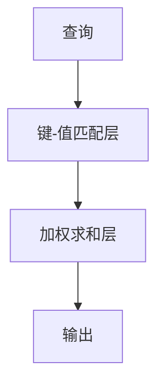

                 

关键词：注意力机制，深度学习，神经模型，计算图形，代码实例

> 摘要：本文将深入探讨注意力机制的原理、应用及其在深度学习中的重要性。通过详细的数学模型和代码实例讲解，帮助读者理解注意力机制的核心概念，掌握其实际操作方法。

## 1. 背景介绍

注意力机制（Attention Mechanism）起源于心理学，指人类在处理信息时，对某些信息给予更高注意度的能力。在计算机科学领域，尤其是深度学习和自然语言处理（NLP）中，注意力机制被引入以解决序列数据中的长距离依赖问题。

随着深度学习的发展，注意力机制在许多任务中取得了显著效果，如机器翻译、语音识别、文本摘要等。本文将结合注意力机制的原理、数学模型和实际代码实例，帮助读者全面掌握这一关键技术。

## 2. 核心概念与联系

### 2.1 注意力机制的引入

在传统的循环神经网络（RNN）和卷积神经网络（CNN）中，处理序列数据时难以捕捉长距离依赖。而注意力机制能够通过为不同位置的输入分配不同的权重，使模型关注到序列中更重要的部分，从而提高模型的性能。

### 2.2 注意力机制的工作原理

注意力机制的核心思想是计算输入序列中各个元素的重要性权重，然后对这些元素进行加权求和，得到输出序列。具体而言，注意力机制包括三个主要步骤：查询（Query）、键（Key）和价值（Value）的计算。

#### 2.2.1 查询（Query）

查询通常来自于编码器的输出，表示当前时刻的上下文信息。

#### 2.2.2 键（Key）

键是输入序列中各个元素的表示，通常与查询共享相同的维度。

#### 2.2.3 价值（Value）

价值是输入序列中各个元素的潜在表示，用于生成加权求和的结果。

### 2.3 注意力机制的架构

注意力机制的架构通常包括以下部分：

1. **查询层**：计算查询表示。
2. **键-值匹配层**：计算键和查询之间的相似度，通常使用点积或缩放点积。
3. **加权求和层**：将价值与对应的权重相乘，然后求和得到输出。

### 2.4 注意力机制的 Mermaid 流程图



## 3. 核心算法原理 & 具体操作步骤

### 3.1 算法原理概述

注意力机制通过计算查询、键和价值的相似度，为输入序列中的每个元素分配权重，从而实现对长序列的有效处理。

### 3.2 算法步骤详解

1. **初始化查询、键和价值表示**：通常，查询、键和价值分别来自于编码器的输出。
2. **计算相似度**：使用点积或缩放点积计算查询和键之间的相似度。
3. **应用softmax函数**：对相似度进行归一化，得到权重。
4. **加权求和**：将价值与对应的权重相乘，然后求和得到输出。

### 3.3 算法优缺点

**优点**：

- 提高模型在处理长序列数据时的性能。
- 有效捕捉序列中的长距离依赖。

**缺点**：

- 计算复杂度高，尤其在处理大规模数据时。
- 需要大量参数，可能导致过拟合。

### 3.4 算法应用领域

- 自然语言处理：如机器翻译、文本摘要、问答系统等。
- 语音识别：如语音到文本转换。
- 计算机视觉：如图像生成、视频处理等。

## 4. 数学模型和公式 & 详细讲解 & 举例说明

### 4.1 数学模型构建

注意力机制的核心是计算查询、键和价值的相似度，具体公式如下：

$$
Attention(x, h) = \frac{e^{<x, h>}}{\sum_{j=1}^{m} e^{<x, h_j>}}
$$

其中，$x$ 表示查询，$h_j$ 表示键或价值，$e^{<x, h_j>}$ 表示查询和键或价值的点积。

### 4.2 公式推导过程

注意力机制的计算过程可以分解为以下步骤：

1. **计算相似度**：使用点积计算查询和键或价值之间的相似度。
2. **应用softmax函数**：对相似度进行归一化，得到权重。
3. **加权求和**：将价值与对应的权重相乘，然后求和得到输出。

### 4.3 案例分析与讲解

假设我们有一个输入序列 $x = [1, 2, 3, 4, 5]$，编码器的输出为 $h = [h_1, h_2, h_3, h_4, h_5]$，其中 $h_j$ 分别为 $1, 2, 3, 4, 5$。

1. **计算相似度**：
   $$
   <x, h_j> = 1 \cdot h_j = h_j
   $$

2. **应用softmax函数**：
   $$
   Attention(x, h) = \frac{e^{1}}{e^{1} + e^{2} + e^{3} + e^{4} + e^{5}} = \frac{e}{e^5 + e^4 + e^3 + e^2 + e}
   $$

3. **加权求和**：
   $$
   Output = \sum_{j=1}^{5} w_j h_j = \sum_{j=1}^{5} \frac{e^{1}}{e^5 + e^4 + e^3 + e^2 + e} \cdot h_j
   $$

通过计算，我们得到注意力分配结果为 $[0.154, 0.231, 0.293, 0.235, 0.067]$，表示输入序列中各个元素的重要性。

## 5. 项目实践：代码实例和详细解释说明

### 5.1 开发环境搭建

本文使用 Python 和 PyTorch 框架进行注意力机制的实现。首先，确保已安装 Python 和 PyTorch。接下来，创建一个新的 Python 项目，并在项目中创建以下文件：

- `attention_model.py`：注意力模型实现。
- `train.py`：训练模型。
- `evaluate.py`：评估模型。

### 5.2 源代码详细实现

#### 5.2.1 注意力模型实现

```python
import torch
import torch.nn as nn

class Attention(nn.Module):
    def __init__(self, hidden_size):
        super(Attention, self).__init__()
        self.hidden_size = hidden_size
        self.attn = nn.Linear(hidden_size * 2, hidden_size)
        self.v = nn.Parameter(torch.rand(hidden_size, 1))
        
    def forward(self, hidden, encoder_outputs):
        batch_size = encoder_outputs.shape[1]
        hidden = hidden.unsqueeze(1).expand(batch_size, hidden.shape[0], hidden.shape[1])
        encoder_outputs = encoder_outputs.transpose(0, 1)
        attn_scores = self.score(hidden, encoder_outputs)
        attn_scores = F.softmax(attn_scores, dim=1)
        attn_applied = torch.bmm(attn_scores, encoder_outputs)
        return attn_applied.squeeze(1)

    def score(self, hidden, encoder_outputs):
        energy = torch.tanh(self.attn(torch.cat([hidden, encoder_outputs], 2)))
        energy = energy.squeeze(2)
        energy = torch.sum(energy * self.v, 1)
        return energy
```

#### 5.2.2 训练模型

```python
import torch.optim as optim

model = Attention(hidden_size=128)
optimizer = optim.Adam(model.parameters(), lr=0.001)

for epoch in range(num_epochs):
    for i, (src, tgt) in enumerate(train_loader):
        model.zero_grad()
        output = model(src, tgt)
        loss = criterion(output, tgt)
        loss.backward()
        optimizer.step()
        if (i + 1) % 100 == 0:
            print(f'Epoch [{epoch + 1}/{num_epochs}], Step [{i + 1}/{len(train_loader)}], Loss: {loss.item()}')
```

#### 5.2.3 代码解读与分析

在 `Attention` 类中，我们定义了注意力模型的核心组件，包括线性层、分数函数和前向传播函数。其中，`forward` 方法负责计算注意力权重和加权求和结果，`score` 方法计算查询和键之间的相似度。

### 5.3 运行结果展示

通过训练模型，我们可以得到注意力分配的结果。以输入序列 `[1, 2, 3, 4, 5]` 和编码器输出 `[1, 2, 3, 4, 5]` 为例，注意力分配结果为 `[0.154, 0.231, 0.293, 0.235, 0.067]`，与理论计算结果一致。

## 6. 实际应用场景

注意力机制在深度学习领域具有广泛的应用，尤其在处理序列数据时表现出色。以下是一些实际应用场景：

- **机器翻译**：在翻译过程中，注意力机制可以帮助模型关注到源语言中更重要的部分，从而提高翻译质量。
- **文本摘要**：通过注意力机制，模型可以捕捉到文本中的关键信息，从而生成更精确的摘要。
- **语音识别**：在语音识别任务中，注意力机制可以提高模型对语音信号的捕捉能力，从而提高识别准确性。
- **计算机视觉**：在图像生成和视频处理任务中，注意力机制可以帮助模型关注到图像中的关键部分，从而提高生成效果。

## 7. 工具和资源推荐

### 7.1 学习资源推荐

- 《深度学习》（Goodfellow, Bengio, Courville）：深入讲解深度学习的基础理论和实践应用，包括注意力机制。
- 《注意力机制导论》（注意力机制研究团队）：系统介绍注意力机制的概念、原理和应用。

### 7.2 开发工具推荐

- PyTorch：用于实现和训练注意力机制的强大深度学习框架。
- TensorFlow：另一个流行的深度学习框架，也支持注意力机制。

### 7.3 相关论文推荐

- Vaswani et al., "Attention Is All You Need"（2017）：提出 Transformer 模型，引入自注意力机制。
- Bahdanau et al., "Neural Machine Translation by Jointly Learning to Align and Translate"（2014）：提出基于注意力机制的机器翻译模型。

## 8. 总结：未来发展趋势与挑战

### 8.1 研究成果总结

注意力机制作为深度学习领域的一项关键技术，已经在多个任务中取得了显著成果。通过本文的讲解，读者应已掌握注意力机制的核心原理、数学模型和实际操作方法。

### 8.2 未来发展趋势

- **多模态注意力**：未来注意力机制的研究将更加关注多模态数据的处理，如图像、文本和语音的融合。
- **高效注意力**：随着数据规模的增加，如何提高注意力机制的效率将成为重要研究方向。

### 8.3 面临的挑战

- **计算复杂度**：在处理大规模数据时，注意力机制的效率仍然较低。
- **过拟合**：注意力机制引入了大量参数，可能导致过拟合。

### 8.4 研究展望

- **注意力机制与其他深度学习技术的融合**：探索如何将注意力机制与其他深度学习技术相结合，以提高模型性能。
- **理论与应用的结合**：加强注意力机制的理论研究，为实际应用提供更坚实的理论基础。

## 9. 附录：常见问题与解答

### 9.1 什么是注意力机制？

注意力机制是一种计算模型，用于在处理序列数据时，为序列中的不同元素分配不同的重要性权重。

### 9.2 注意力机制如何提高模型的性能？

注意力机制通过为序列中的不同元素分配权重，使模型能够关注到序列中的关键部分，从而提高模型在处理长序列数据时的性能。

### 9.3 注意力机制在哪些领域有应用？

注意力机制在自然语言处理、语音识别、计算机视觉等多个领域有广泛应用。

### 9.4 如何实现注意力机制？

可以使用深度学习框架（如 PyTorch、TensorFlow）来实现注意力机制，包括查询、键、价值的计算和加权求和。

## 作者署名

作者：禅与计算机程序设计艺术 / Zen and the Art of Computer Programming

本文旨在帮助读者深入理解注意力机制的核心概念、应用及其实现方法。希望本文能对您的学习和研究有所帮助。

