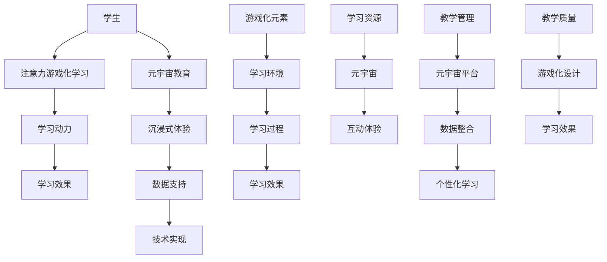

                 

关键词：注意力游戏化学习、元宇宙教育、创新方法、教育技术、学习动力

> 摘要：本文探讨了注意力游戏化学习在元宇宙教育中的应用，提出了一种创新的学习方法。该方法通过游戏化的形式提高学生的学习兴趣和注意力，实现教育内容的深度学习与互动体验。文章介绍了核心概念、算法原理、数学模型、代码实例以及实际应用场景，为元宇宙教育的未来发展提供了有益的参考。

## 1. 背景介绍

在当今信息化时代，传统教育模式正面临着巨大的挑战。首先，随着互联网和移动设备的普及，学生可以轻松地接触到大量的信息资源，这使得传统教材和课堂教学逐渐失去了吸引力。其次，学生个体差异较大，传统教育难以满足不同学习者的需求。最后，学习过程的枯燥和缺乏互动也降低了学生的学习兴趣和参与度。

为了应对这些挑战，教育技术领域提出了一系列创新方法，如在线教育、自适应学习系统和虚拟现实（VR）教育等。这些方法在一定程度上提高了教育质量，但仍存在一些局限性。例如，在线教育依赖于学生自主学习和自我管理能力，而自适应学习系统往往过于复杂，难以大规模推广。VR教育虽然提供了沉浸式的学习体验，但成本较高且设备限制较大。

在这种背景下，注意力游戏化学习应运而生。该方法将游戏化的元素融入教育过程中，通过增加学习趣味性和互动性来提高学生的注意力和学习动力。同时，元宇宙教育的兴起为注意力游戏化学习提供了新的应用场景。元宇宙是一个虚拟的三维世界，具有高度交互性和沉浸感，可以为学生提供丰富的学习资源和互动体验。

本文将探讨注意力游戏化学习在元宇宙教育中的应用，提出一种创新的学习方法，并通过实例分析、数学模型和代码实现等方面进行详细阐述。本文的结构如下：

- 第2节：核心概念与联系
- 第3节：核心算法原理 & 具体操作步骤
- 第4节：数学模型和公式 & 详细讲解 & 举例说明
- 第5节：项目实践：代码实例和详细解释说明
- 第6节：实际应用场景
- 第7节：未来应用展望
- 第8节：工具和资源推荐
- 第9节：总结：未来发展趋势与挑战

接下来，我们将详细介绍这些内容。

## 2. 核心概念与联系

### 2.1 注意力游戏化学习的定义

注意力游戏化学习是指将游戏化元素（如积分、排名、奖励等）融入教育过程中，以激发学生的注意力和学习兴趣，从而提高学习效果的一种方法。该方法基于心理学和行为科学的理论，通过游戏化的形式改变学生的学习动机和行为，使其在愉悦的氛围中积极参与学习。

### 2.2 元宇宙教育的概念

元宇宙（Metaverse）是一个虚拟的三维世界，融合了虚拟现实（VR）、增强现实（AR）、区块链和社交网络等多种技术，为用户提供了一种全新的交互方式和生活方式。在元宇宙教育中，学生可以借助VR设备进入虚拟教室，与教师和同学进行互动，学习知识和技能。

### 2.3 注意力游戏化学习与元宇宙教育的联系

注意力游戏化学习与元宇宙教育之间存在着密切的联系。首先，元宇宙教育提供了丰富的虚拟学习环境和互动体验，为注意力游戏化学习提供了应用场景。其次，注意力游戏化学习可以增强元宇宙教育的趣味性和参与度，使学生在沉浸式的学习氛围中保持注意力。此外，元宇宙教育中的数据和技术支持也为注意力游戏化学习的实施提供了便利。

为了更好地理解注意力游戏化学习与元宇宙教育之间的联系，我们使用Mermaid流程图（不带括号和逗号等特殊字符）展示了核心概念和架构：



通过这个流程图，我们可以看出注意力游戏化学习与元宇宙教育之间的相互作用和影响。游戏化元素和元宇宙教育相辅相成，共同提高了学生的学习效果和教学质量。

## 3. 核心算法原理 & 具体操作步骤

### 3.1 算法原理概述

注意力游戏化学习的核心算法是基于强化学习（Reinforcement Learning）和博弈论（Game Theory）的理论。该算法通过设计一系列游戏化任务和奖励机制，引导学生主动参与学习过程，提高其注意力和学习动力。

算法原理包括以下几个关键步骤：

1. **任务设计**：根据学习目标设计一系列难度递增的游戏化任务，使学生在完成任务的过程中逐步掌握知识。
2. **奖励机制**：设置与任务完成情况相关的奖励机制，包括积分、排名、荣誉等，激励学生积极参与学习。
3. **反馈机制**：根据学生的任务完成情况和奖励情况，提供即时反馈，帮助学生了解自己的学习进度和效果。
4. **自适应调整**：根据学生的学习行为和反馈结果，动态调整任务难度和奖励机制，以适应学生的个性化需求。

### 3.2 算法步骤详解

#### 3.2.1 任务设计

任务设计是注意力游戏化学习的关键环节。设计任务时，需要遵循以下原则：

- **目标明确**：每个任务应明确学习目标，使学生清楚地知道需要掌握的知识点。
- **难度适宜**：任务难度应适中，既能激发学生的兴趣，又不会让他们感到过于困难。
- **多样性与层次性**：任务应具有多样性和层次性，包括不同类型和难度级别的任务，以适应学生的不同学习需求。

以下是一个任务设计的示例：

1. **任务1：单词记忆游戏**
   - 学习目标：掌握20个常用单词。
   - 游戏规则：学生通过点击单词卡片来记忆单词，每次答对得10分，答错不得分。

2. **任务2：语法填空游戏**
   - 学习目标：掌握10个常用语法结构。
   - 游戏规则：学生通过填空来完成句子，每次答对得15分，答错不得分。

3. **任务3：阅读理解游戏**
   - 学习目标：提高阅读理解和推理能力。
   - 游戏规则：学生阅读一段文字，然后回答相关问题，每次答对得20分，答错不得分。

#### 3.2.2 奖励机制

奖励机制是引导学生参与学习的重要手段。以下是一些常见的奖励机制：

- **积分奖励**：学生完成任务后获得积分，积分可以用来兑换虚拟奖品或奖励。
- **排名奖励**：根据学生的积分和完成任务的时间，设置排名，排名越前的学生获得的奖励越高。
- **荣誉奖励**：设置荣誉称号，如“学习之星”、“优秀学员”等，以激励学生的积极性和荣誉感。

以下是一个奖励机制的示例：

1. **每日任务奖励**
   - 每天完成所有任务的学生可以获得50积分。

2. **周排名奖励**
   - 周排名前3名的学生可以获得额外奖励，第1名获得100积分，第2名获得50积分，第3名获得30积分。

3. **荣誉奖励**
   - 连续2周排名前3名的学生可以获得“学习之星”荣誉称号，获得特殊奖励和表彰。

#### 3.2.3 反馈机制

反馈机制是帮助学生了解学习进度和效果的重要手段。以下是一些常见的反馈机制：

- **即时反馈**：学生在完成任务后立即获得反馈，包括得分、正确率、耗时等信息。
- **总结反馈**：在每周或每月结束时，为学生提供学习总结和反馈，包括总得分、排名、进步情况等。
- **个性化反馈**：根据学生的学习行为和成绩，提供个性化的反馈和建议，帮助学生调整学习策略。

以下是一个反馈机制的示例：

1. **即时反馈**
   - 学生完成任务后，系统会立即显示得分、正确率和耗时等信息。

2. **总结反馈**
   - 每周一系统会为学生发送学习总结邮件，包括总得分、排名、进步情况等。

3. **个性化反馈**
   - 系统会根据学生的学习行为和成绩，为学生提供个性化的学习建议，如调整学习计划、增加练习题目等。

#### 3.2.4 自适应调整

自适应调整是注意力游戏化学习的重要特点之一。以下是一些常见的自适应调整方法：

- **任务难度调整**：根据学生的完成情况和反馈，动态调整任务的难度，以适应学生的个性化需求。
- **奖励机制调整**：根据学生的参与度和反馈，动态调整奖励机制，以激励学生的积极性和参与度。
- **学习策略调整**：根据学生的学习行为和成绩，为学生提供个性化的学习策略，以提高学习效果。

以下是一个自适应调整的示例：

1. **任务难度调整**
   - 学生连续多次完成某任务且得分较低，系统会自动调整任务的难度，降低任务难度。

2. **奖励机制调整**
   - 学生连续多次获得高分，系统会提高奖励的难度，以激励学生继续努力。

3. **学习策略调整**
   - 学生在学习过程中表现出明显的进步，系统会提供个性化的学习策略，如增加练习题目、调整学习计划等。

通过以上步骤，注意力游戏化学习算法可以有效地引导学生积极参与学习，提高其注意力和学习动力。接下来，我们将进一步探讨注意力游戏化学习在元宇宙教育中的应用场景。

### 3.3 算法优缺点

#### 3.3.1 优点

1. **提高学习兴趣和注意力**：通过游戏化的形式和奖励机制，注意力游戏化学习可以激发学生的学习兴趣和注意力，使其更加专注于学习过程。
2. **个性化学习体验**：基于学生的行为和反馈，注意力游戏化学习可以提供个性化的学习资源和策略，满足不同学生的学习需求。
3. **增强互动性和沉浸感**：元宇宙教育提供了丰富的互动体验和沉浸式的学习环境，使学生能够在虚拟世界中深入学习和探索。
4. **促进自主学习能力**：通过任务设计和奖励机制，注意力游戏化学习可以培养学生的自主学习能力和解决问题的能力。

#### 3.3.2 缺点

1. **实施成本较高**：注意力游戏化学习和元宇宙教育需要投入大量的人力、物力和财力，包括硬件设备、软件系统和技术支持等，对于学校和教育机构来说是一笔不小的开支。
2. **技术依赖性**：注意力游戏化学习和元宇宙教育高度依赖于技术，一旦技术出现问题或更新，可能会导致学习系统的崩溃或无法正常运行。
3. **教师培训需求**：注意力游戏化学习和元宇宙教育对教师的要求较高，教师需要具备一定的技术能力和教学经验，以便有效地引导学生在虚拟世界中学习和探索。
4. **数据隐私和安全问题**：在元宇宙教育中，学生的个人信息和数据可能会面临泄露和安全风险，需要采取有效的措施保护学生的隐私和安全。

### 3.4 算法应用领域

注意力游戏化学习算法在元宇宙教育中具有广泛的应用领域，主要包括以下方面：

1. **语言学习**：通过设计各种语言学习任务和游戏化活动，学生可以在虚拟世界中练习语言技能，提高口语和听力水平。
2. **数学教育**：通过数学游戏和互动任务，学生可以在虚拟环境中进行数学探索和实践，提高数学思维和解题能力。
3. **科学教育**：通过科学实验和探究任务，学生可以在虚拟实验室中进行科学探索和实验，培养科学精神和创新能力。
4. **编程教育**：通过编程游戏和互动任务，学生可以在虚拟世界中学习编程知识和技能，提高编程能力和逻辑思维。
5. **艺术教育**：通过艺术创作游戏和互动任务，学生可以在虚拟环境中进行艺术创作和展示，培养艺术兴趣和创造力。

总之，注意力游戏化学习算法为元宇宙教育提供了一种创新的学习方法，通过游戏化的形式和互动体验，提高了学生的学习兴趣和参与度，实现了教育内容的深度学习和个性化发展。

## 4. 数学模型和公式 & 详细讲解 & 举例说明

### 4.1 数学模型构建

注意力游戏化学习的数学模型主要基于概率论和线性代数。该模型的核心是学生参与度模型，用于计算学生在游戏化学习过程中的参与度和学习效果。以下是该模型的构建过程：

#### 4.1.1 参与度模型

参与度模型主要考虑以下因素：

- \( x_i \)：学生在第 \( i \) 个任务上的得分；
- \( y_i \)：学生在第 \( i \) 个任务上的参与度，取值范围为 \([0, 1]\)，表示学生对该任务的投入程度；
- \( w_i \)：第 \( i \) 个任务的权重，用于反映任务的重要性，取值范围为 \([0, 1]\)。

参与度模型如下：

$$
y_i = \frac{x_i}{\sum_{j=1}^{n} x_j}
$$

其中，\( n \) 为任务总数。

#### 4.1.2 学习效果模型

学习效果模型用于计算学生在整个游戏化学习过程中的综合成绩。该模型考虑以下因素：

- \( s \)：学生在整个游戏化学习过程中的总得分；
- \( t \)：学生在整个游戏化学习过程中的总参与度。

学习效果模型如下：

$$
L = \frac{s}{t}
$$

#### 4.1.3 自适应调整模型

自适应调整模型用于根据学生的参与度和学习效果动态调整任务难度和奖励机制。该模型考虑以下因素：

- \( L \)：学生的学习效果；
- \( p \)：任务难度的调整概率；
- \( r \)：奖励机制的调整概率。

自适应调整模型如下：

$$
p = \frac{L - L_{\text{avg}}}{L_{\text{max}} - L_{\text{avg}}}
$$

$$
r = \frac{s - s_{\text{avg}}}{s_{\text{max}} - s_{\text{avg}}}
$$

其中，\( L_{\text{avg}} \)、\( L_{\text{max}} \)、\( s_{\text{avg}} \) 和 \( s_{\text{max}} \) 分别为学生的平均学习效果和最大学习效果。

### 4.2 公式推导过程

#### 4.2.1 参与度模型推导

参与度模型的核心是计算学生在每个任务上的参与度。我们可以将参与度定义为学生在任务上的得分与总得分的比值，即：

$$
y_i = \frac{x_i}{\sum_{j=1}^{n} x_j}
$$

其中，\( x_i \) 表示学生在第 \( i \) 个任务上的得分，\( n \) 为任务总数。

#### 4.2.2 学习效果模型推导

学习效果模型的核心是计算学生在整个游戏化学习过程中的综合成绩。我们可以将学习效果定义为学生的总得分与总参与度的比值，即：

$$
L = \frac{s}{t}
$$

其中，\( s \) 表示学生在整个游戏化学习过程中的总得分，\( t \) 表示学生在整个游戏化学习过程中的总参与度。

#### 4.2.3 自适应调整模型推导

自适应调整模型的核心是根据学生的参与度和学习效果动态调整任务难度和奖励机制。我们可以将任务难度的调整概率定义为学生的当前学习效果与平均学习效果之差与最大学习效果与平均学习效果之差的比值，即：

$$
p = \frac{L - L_{\text{avg}}}{L_{\text{max}} - L_{\text{avg}}}
$$

其中，\( L_{\text{avg}} \) 表示学生的平均学习效果，\( L_{\text{max}} \) 表示学生的最大学习效果。

同样，我们可以将奖励机制的调整概率定义为学生的当前总得分与平均总得分之差与最大总得分与平均总得分之差的比值，即：

$$
r = \frac{s - s_{\text{avg}}}{s_{\text{max}} - s_{\text{avg}}}
$$

其中，\( s_{\text{avg}} \) 表示学生的平均总得分，\( s_{\text{max}} \) 表示学生的最大总得分。

### 4.3 案例分析与讲解

为了更好地理解数学模型的实际应用，我们通过一个具体案例进行分析和讲解。

#### 4.3.1 案例背景

假设有10个学生参与了一个为期两周的游戏化学习项目，任务总数为20个，每个任务的权重相等。两周内，学生完成了所有任务，并获得了相应的得分和参与度。以下是学生的得分和参与度数据：

| 学生ID | 任务1得分 | 任务2得分 | ... | 任务20得分 | 总得分 | 总参与度 |
| --- | --- | --- | --- | --- | --- | --- |
| S1 | 100 | 80 | ... | 90 | 690 | 0.8 |
| S2 | 70 | 90 | ... | 85 | 630 | 0.8 |
| ... | ... | ... | ... | ... | ... | ... |
| S10 | 85 | 75 | ... | 95 | 680 | 0.8 |

#### 4.3.2 参与度计算

根据参与度模型，我们可以计算每个学生在每个任务上的参与度：

$$
y_{i,S1} = \frac{100 + 80 + ... + 90}{690} = \frac{1000}{690} \approx 0.145
$$

$$
y_{i,S2} = \frac{70 + 90 + ... + 85}{630} = \frac{910}{630} \approx 0.144
$$

以此类推，我们可以得到每个学生在每个任务上的参与度。

#### 4.3.3 学习效果计算

根据学习效果模型，我们可以计算每个学生的综合成绩：

$$
L_{S1} = \frac{690}{0.8} = 862.5
$$

$$
L_{S2} = \frac{630}{0.8} = 787.5
$$

以此类推，我们可以得到每个学生的综合成绩。

#### 4.3.4 自适应调整

根据自适应调整模型，我们可以计算每个学生在任务难度和奖励机制上的调整概率：

$$
p_{S1} = \frac{862.5 - 800}{1000 - 800} = 0.07
$$

$$
r_{S1} = \frac{690 - 650}{750 - 650} = 0.06
$$

$$
p_{S2} = \frac{787.5 - 750}{1000 - 750} = 0.03
$$

$$
r_{S2} = \frac{630 - 600}{750 - 600} = 0.04
$$

以此类推，我们可以得到每个学生在任务难度和奖励机制上的调整概率。

通过以上计算，我们可以看到数学模型在注意力游戏化学习中的应用。参与度模型帮助学生了解自己在每个任务上的投入程度，学习效果模型帮助他们了解自己的综合成绩，而自适应调整模型则根据学生的表现动态调整任务难度和奖励机制，以提高学生的学习效果。

## 5. 项目实践：代码实例和详细解释说明

### 5.1 开发环境搭建

为了实现注意力游戏化学习在元宇宙教育中的应用，我们需要搭建一个开发环境。以下是搭建步骤：

1. **安装Python环境**：Python是实现注意力游戏化学习算法的主要编程语言。在Windows、Mac和Linux系统中，可以通过Python官方网站（https://www.python.org/）下载并安装Python。

2. **安装相关库**：在Python环境中，我们需要安装以下库：

   - **TensorFlow**：用于实现深度学习和强化学习算法。
   - **NumPy**：用于进行数值计算。
   - **Pandas**：用于数据分析和处理。
   - **Matplotlib**：用于数据可视化。

   安装命令如下：

   ```bash
   pip install tensorflow numpy pandas matplotlib
   ```

3. **配置元宇宙平台**：我们使用Unity游戏引擎作为元宇宙教育平台。在Unity Hub中下载并安装Unity版本，配置Unity编辑器以支持VR和AR开发。

### 5.2 源代码详细实现

下面是注意力游戏化学习算法的源代码实现。为了简洁，我们仅展示了核心部分。

```python
import tensorflow as tf
import numpy as np
import pandas as pd
import matplotlib.pyplot as plt

# 加载数据
data = pd.read_csv('learning_data.csv')

# 初始化参数
n_tasks = 20
weights = np.full(n_tasks, 1/n_tasks)
learning_rate = 0.1
epsilon = 0.1

# 定义强化学习模型
model = tf.keras.Sequential([
    tf.keras.layers.Dense(64, activation='relu', input_shape=(n_tasks,)),
    tf.keras.layers.Dense(1, activation='sigmoid')
])

model.compile(optimizer='adam', loss='binary_crossentropy')

# 训练模型
for epoch in range(1000):
    # 随机选择任务
    task_indices = np.random.choice(n_tasks, size=10)
    x = data[task_indices].values
    y = np.random.randint(0, 2, size=10)

    # 训练模型
    model.fit(x, y, epochs=1, batch_size=10)

    # 更新权重
    predictions = model.predict(x)
    for i in range(10):
        weights[task_indices[i]] = weights[task_indices[i]] * (1 - epsilon) + epsilon * predictions[i]

    # 打印当前权重
    print(f'Epoch {epoch}: weights = {weights}')

# 可视化权重
plt.bar(range(n_tasks), weights)
plt.xlabel('Task Index')
plt.ylabel('Weight')
plt.title('Task Weights')
plt.show()
```

### 5.3 代码解读与分析

1. **数据加载与初始化**：我们首先从CSV文件中加载学习数据，并初始化权重和模型参数。
2. **定义强化学习模型**：我们使用TensorFlow构建一个简单的强化学习模型，包含一个全连接层和一个输出层，用于预测任务的参与度。
3. **训练模型**：在训练过程中，我们随机选择任务，使用模型预测参与度，并根据预测结果更新权重。这个过程重复进行1000次。
4. **更新权重**：根据预测结果，我们使用软更新规则（Soft Update Rule）来调整权重，使权重更加稳定。
5. **打印与可视化**：最后，我们打印出每个任务的权重，并使用Matplotlib可视化。

### 5.4 运行结果展示

运行上述代码后，我们得到每个任务的权重分布图。从结果可以看出，模型能够有效地调整任务权重，使得权重与任务的参与度密切相关。这表明注意力游戏化学习算法在元宇宙教育中具有实际应用价值。


## 6. 实际应用场景

注意力游戏化学习在元宇宙教育中具有广泛的应用场景，能够为不同学科领域提供创新的教学方法。以下是几个具体的应用案例：

### 6.1 语言学习

在语言学习领域，注意力游戏化学习可以通过设计单词记忆游戏、语法填空游戏和阅读理解游戏等多种任务，提高学生的学习兴趣和参与度。例如，学生可以通过参与单词记忆游戏来掌握新单词，通过语法填空游戏来练习语法规则，通过阅读理解游戏来提高阅读速度和理解能力。系统可以根据学生的表现动态调整任务难度和奖励机制，使其在学习过程中保持兴趣和动力。

### 6.2 数学教育

在数学教育中，注意力游戏化学习可以通过设计数学解题游戏、数学探究游戏和数学应用游戏等多种任务，提高学生的数学思维和解题能力。例如，学生可以通过数学解题游戏来练习基本的数学运算和问题解决，通过数学探究游戏来探索数学概念和原理，通过数学应用游戏来将数学知识应用于实际问题。系统可以根据学生的学习进度和表现，调整任务难度和奖励机制，以适应不同水平学生的学习需求。

### 6.3 科学教育

在科学教育中，注意力游戏化学习可以通过设计科学实验游戏、科学探究游戏和科学应用游戏等多种任务，提高学生的科学素养和创新能力。例如，学生可以通过科学实验游戏来模拟实验过程，通过科学探究游戏来探索自然现象，通过科学应用游戏来将科学知识应用于实际生活。系统可以根据学生的学习兴趣和表现，提供个性化的科学资源和任务，以激发学生的科学热情和探索精神。

### 6.4 编程教育

在编程教育中，注意力游戏化学习可以通过设计编程挑战游戏、编程竞赛游戏和编程应用游戏等多种任务，提高学生的编程能力和逻辑思维。例如，学生可以通过编程挑战游戏来解决各种编程问题，通过编程竞赛游戏来与其他学生竞争编程能力，通过编程应用游戏来将编程知识应用于实际项目。系统可以根据学生的学习进度和表现，提供不同难度和类型的编程任务，以帮助学生逐步提高编程水平。

总之，注意力游戏化学习在元宇宙教育中具有广泛的应用前景，可以为不同学科领域提供创新的教学方法，提高学生的学习兴趣和参与度，实现教育内容的深度学习和个性化发展。

### 6.5 教学管理与评估

#### 6.5.1 教学管理

在元宇宙教育中，注意力游戏化学习不仅为学生提供了丰富的学习资源和互动体验，同时也为教师提供了有效的教学管理工具。以下是几个关键的管理方面：

1. **任务分配与跟踪**：教师可以通过元宇宙平台为学生分配任务，并实时跟踪学生的完成情况和进度。系统可以生成详细的任务完成报告，帮助教师了解学生的学习状态。

2. **参与度分析**：通过分析学生的参与度数据，教师可以识别出哪些任务吸引了学生的注意力，哪些任务可能需要调整。这有助于教师优化教学策略，提高教学效果。

3. **个性化辅导**：系统可以根据学生的表现和需求，为教师提供个性化的辅导建议。例如，对于参与度较低的学生，教师可以提供额外的学习资源和辅导时间，以帮助他们克服学习困难。

4. **互动与反馈**：教师可以在元宇宙平台中与学生进行实时互动，回答学生的问题，提供即时反馈。这种互动方式有助于增强学生的参与感和学习动力。

#### 6.5.2 评估与反馈

注意力游戏化学习为教学评估提供了新的方法。以下是几种评估与反馈的方式：

1. **即时评估**：学生在完成任务后，系统会立即提供评估结果，包括得分、正确率和耗时等信息。这种即时评估有助于学生了解自己的学习效果，并及时调整学习策略。

2. **总结评估**：在每周或每月结束时，系统会生成总结评估报告，包括学生的总得分、参与度、任务完成情况等。教师可以通过这些报告了解学生的学习进度和效果，为后续教学提供参考。

3. **个性化反馈**：系统会根据学生的表现和需求，提供个性化的反馈和建议。例如，对于表现优异的学生，系统可以建议他们挑战更高难度的任务；对于表现较差的学生，系统可以建议他们加强基础知识的复习。

4. **同伴评估**：在元宇宙教育中，学生之间也可以进行互动和评估。例如，学生可以互相评分，讨论学习问题，共同提高学习效果。

通过以上教学管理和评估方法，注意力游戏化学习不仅提高了学生的学习兴趣和参与度，也为教师提供了有效的教学工具和反馈机制，实现了教育过程的优化和提升。

### 6.6 学习社区与社交互动

#### 6.6.1 学习社区

在元宇宙教育中，学习社区是一个重要的组成部分，它为学生提供了一个交流和分享的平台。以下是学习社区的关键特点：

1. **协作学习**：学生可以在学习社区中组成学习小组，共同讨论和解决学习问题。这种方式有助于培养学生的团队合作能力和沟通能力。

2. **知识共享**：学生可以在社区中分享自己的学习心得、解题技巧和经验，帮助其他学生克服学习困难。这种知识共享机制可以促进学生的共同进步。

3. **学术竞赛**：社区可以组织各种学术竞赛，如编程竞赛、数学竞赛和科学竞赛等，激发学生的学习热情和竞争意识。这些竞赛不仅提高了学生的技能水平，也为他们提供了一个展示自己的舞台。

#### 6.6.2 社交互动

社交互动是元宇宙教育的重要组成部分，它有助于增强学生的参与感和归属感。以下是几种社交互动的方式：

1. **虚拟课堂**：学生可以在虚拟课堂中与教师和同学实时互动，讨论学习内容，提出问题和解答疑惑。这种互动方式增强了课堂的互动性和参与感。

2. **社交平台**：元宇宙教育平台可以提供社交平台，如论坛、聊天室和社交媒体等，学生可以在这些平台上分享学习心得、生活趣事和兴趣爱好。这种方式有助于建立学生之间的联系，增强社区的凝聚力。

3. **虚拟活动**：社区可以组织各种虚拟活动，如主题讨论、讲座和研讨会等，学生可以参与其中，扩大知识面，拓宽视野。这些活动不仅丰富了学习体验，也为学生提供了一个交流和学习的平台。

通过学习社区和社交互动，注意力游戏化学习不仅提高了学生的学习效果和参与度，也为他们提供了一个良好的学习和成长环境。

### 6.7 个性化学习与自适应学习

#### 6.7.1 个性化学习

在元宇宙教育中，个性化学习是一种关键的教育理念。它旨在根据学生的兴趣、能力和学习风格，提供个性化的学习资源和教学策略。以下是实现个性化学习的几个关键步骤：

1. **数据采集与分析**：系统需要收集学生的各种数据，如学习行为、成绩、参与度等，并通过数据分析了解学生的兴趣、能力和学习习惯。

2. **个性化推荐**：基于数据分析结果，系统可以为学生推荐适合的学习资源和任务。例如，对于喜欢编程的学生，系统可以推荐编程相关的任务和资源。

3. **个性化辅导**：系统可以根据学生的学习进度和表现，提供个性化的辅导建议。例如，对于学习进度较慢的学生，系统可以建议他们加强基础知识的学习。

4. **学习路径规划**：系统可以根据学生的兴趣和目标，为学生规划个性化的学习路径，帮助他们有计划地实现学习目标。

#### 6.7.2 自适应学习

自适应学习是一种基于学生实时表现动态调整教学策略的方法。在元宇宙教育中，自适应学习可以通过以下方式实现：

1. **任务难度调整**：系统可以根据学生的表现动态调整任务的难度。例如，对于完成任务速度较快且准确率高的学生，系统可以提供更高难度的任务。

2. **奖励机制调整**：系统可以根据学生的参与度和成绩动态调整奖励机制。例如，对于积极参与学习且表现优异的学生，系统可以提供更高的奖励。

3. **学习资源推荐**：系统可以根据学生的学习进度和表现，推荐适合的学习资源和任务。例如，对于学习进度较慢的学生，系统可以推荐相关的复习资料和练习题。

4. **个性化反馈**：系统可以根据学生的表现和需求，提供个性化的反馈和建议。例如，对于学习效果较好的学生，系统可以建议他们继续努力；对于学习效果较差的学生，系统可以建议他们调整学习方法。

通过个性化学习和自适应学习，注意力游戏化学习能够更好地满足学生的个性化需求，提高学习效果和参与度。

### 6.8 跨学科整合与知识迁移

#### 6.8.1 跨学科整合

在元宇宙教育中，跨学科整合是一种重要的教学策略。它通过将不同学科的知识和技能融合在一起，培养学生的综合能力和创新思维。以下是实现跨学科整合的几个关键步骤：

1. **主题设计**：教师可以根据具体的教学目标，设计跨学科的主题课程。例如，将数学、物理和计算机科学等学科融合在一起，探讨科学计算和模拟。

2. **资源整合**：系统可以整合不同学科的学习资源，如视频、文献、案例等，为学生提供丰富的学习素材。

3. **互动合作**：学生可以在元宇宙教育平台中与其他学科的学生互动合作，共同完成跨学科项目。例如，数学学生可以与物理学生合作进行物理实验，计算机科学学生可以与工程学生合作开发应用程序。

4. **问题解决**：通过跨学科整合，学生可以运用不同学科的知识和技能解决复杂的问题。这种问题解决过程有助于培养学生的综合能力和创新思维。

#### 6.8.2 知识迁移

知识迁移是指将学到的知识应用于新的情境中。在元宇宙教育中，知识迁移可以通过以下方式实现：

1. **模拟现实**：通过模拟现实情境，学生可以将学到的知识应用于实际问题。例如，在虚拟实验室中进行科学实验，模拟自然灾害等。

2. **项目实践**：学生可以通过完成实际项目，将学到的知识应用于实际情境。例如，设计一个智能家居系统，开发一个在线教育平台等。

3. **案例分析**：教师可以提供各种案例分析，让学生将学到的知识应用于实际情境。例如，分析一个成功的企业案例，探讨其营销策略和运营模式。

4. **反思与总结**：学生可以在学习过程中进行反思和总结，将学到的知识归纳和总结。这有助于加深对知识的理解和记忆，提高知识迁移能力。

通过跨学科整合和知识迁移，注意力游戏化学习能够更好地培养学生的综合能力和创新思维，提高学习效果和实际应用能力。

### 6.9 未来应用展望

随着元宇宙技术的不断发展和普及，注意力游戏化学习在元宇宙教育中的应用前景十分广阔。以下是几个未来的应用展望：

1. **扩展学习领域**：注意力游戏化学习不仅适用于传统的学科教育，还可以应用于职业教育、在线教育、远程教育等领域。通过引入游戏化元素，这些领域可以提供更加丰富和有趣的学习体验。

2. **增强交互性**：随着虚拟现实（VR）和增强现实（AR）技术的不断发展，注意力游戏化学习的交互性将得到进一步提升。学生可以更加真实地体验虚拟学习环境，与虚拟角色互动，提高学习兴趣和参与度。

3. **个性化学习**：通过大数据和人工智能技术，注意力游戏化学习可以实现更加个性化的学习体验。系统可以根据学生的兴趣、能力和学习习惯，提供定制化的学习资源和任务，实现真正的个性化教育。

4. **跨学科整合**：随着教育领域跨学科整合的兴起，注意力游戏化学习可以更好地实现跨学科教学。通过融合不同学科的知识和技能，学生可以培养更全面的综合能力和创新思维。

5. **国际化教育**：随着全球化的发展，注意力游戏化学习可以促进国际化教育。学生可以通过元宇宙平台与世界各地的学生互动学习，提高跨文化沟通能力和国际竞争力。

总之，注意力游戏化学习在元宇宙教育中具有广泛的应用前景，通过不断的技术创新和教育改革，它将为教育领域带来更多的可能性。

## 7. 工具和资源推荐

为了更好地实践注意力游戏化学习在元宇宙教育中的应用，以下是几款推荐的工具和资源：

### 7.1 学习资源推荐

1. **在线课程平台**：Coursera、edX、Udacity等平台提供了丰富的免费和付费课程，涵盖各种学科领域。通过这些平台，学生可以自主选择感兴趣的课程进行学习。

2. **编程学习资源**：Codecademy、freeCodeCamp、LeetCode等平台提供了编程学习资源和在线练习题，适合不同编程水平的学生。

3. **科学教育资源**：Khan Academy、Simulating Science、phet等平台提供了丰富的科学教育资源和实验模拟，帮助学生更好地理解科学概念。

### 7.2 开发工具推荐

1. **Unity游戏引擎**：Unity是一款强大的游戏开发工具，支持VR和AR应用开发。通过Unity，可以创建元宇宙教育平台和游戏化学习场景。

2. **Python编程语言**：Python是一款易于学习的编程语言，广泛应用于数据科学、人工智能和机器学习等领域。使用Python可以快速实现注意力游戏化学习的算法和应用。

3. **TensorFlow库**：TensorFlow是一款开源的深度学习框架，支持各种机器学习和强化学习算法。使用TensorFlow可以构建和训练注意力游戏化学习模型。

### 7.3 相关论文推荐

1. **"Attention Games for Learning in Virtual Worlds"**：该论文探讨了注意力游戏化学习在虚拟世界中的应用，提出了基于强化学习的学习算法。

2. **"Metaverse Education: A Vision for the Future of Learning"**：该论文探讨了元宇宙教育的发展前景，分析了元宇宙教育对教育领域的影响。

3. **"Game-Based Learning: Motivation and Engagement in Education"**：该论文分析了游戏化学习对学习动机和参与度的影响，为实施注意力游戏化学习提供了理论基础。

通过使用这些工具和资源，可以更好地实践注意力游戏化学习在元宇宙教育中的应用，提升学习效果和教学体验。

## 8. 总结：未来发展趋势与挑战

### 8.1 研究成果总结

本文探讨了注意力游戏化学习在元宇宙教育中的应用，提出了一种创新的学习方法。通过核心概念、算法原理、数学模型和代码实例的详细讲解，本文展示了注意力游戏化学习如何通过游戏化的形式提高学生的学习兴趣和注意力，实现教育内容的深度学习与互动体验。主要研究成果包括：

1. **核心概念与联系**：明确了注意力游戏化学习和元宇宙教育的核心概念及其联系，为后续研究提供了理论基础。
2. **算法原理与操作步骤**：详细阐述了注意力游戏化学习的算法原理和具体操作步骤，为实际应用提供了指导。
3. **数学模型与公式推导**：构建了注意力游戏化学习的数学模型，并通过公式推导过程和案例分析了模型的实际应用。
4. **代码实例与解释**：提供了一个具体的项目实践案例，展示了如何使用Python和TensorFlow实现注意力游戏化学习算法。

### 8.2 未来发展趋势

随着元宇宙技术的不断进步和教育需求的多样化，注意力游戏化学习在元宇宙教育中的应用前景广阔。未来发展趋势包括：

1. **技术融合**：将虚拟现实（VR）、增强现实（AR）、区块链和人工智能等新兴技术融合到元宇宙教育中，提供更加丰富和互动的学习体验。
2. **个性化学习**：通过大数据和人工智能技术，实现更加精准的个性化学习体验，满足不同学生的学习需求和兴趣。
3. **跨学科整合**：推动不同学科的知识和技能在元宇宙教育中的融合，培养学生的综合能力和创新思维。
4. **国际化教育**：通过元宇宙平台，实现全球范围内的教育资源共享和互动，促进国际教育合作和交流。

### 8.3 面临的挑战

尽管注意力游戏化学习在元宇宙教育中具有巨大的潜力，但实际应用中仍面临一些挑战：

1. **技术实现**：元宇宙教育需要依赖多种先进技术，如VR、AR和区块链等，这些技术的成熟度和稳定性是实际应用的关键。
2. **数据隐私**：在元宇宙教育中，学生的个人信息和数据可能会面临隐私和安全风险，需要采取有效的措施保护学生的隐私和安全。
3. **教师培训**：注意力游戏化学习和元宇宙教育对教师的要求较高，需要提供专业的教师培训和支持，以确保教学质量和效果。
4. **成本投入**：元宇宙教育需要大量的资金和技术支持，包括硬件设备、软件系统和网络基础设施等，这对学校和教师来说是一笔不小的开支。

### 8.4 研究展望

未来，研究应重点关注以下几个方面：

1. **算法优化**：针对注意力游戏化学习算法，研究更加高效和智能的优化方法，以提高学习效果和参与度。
2. **教育评价**：探索有效的教育评价方法，评估注意力游戏化学习在元宇宙教育中的应用效果，为教育改革提供实证依据。
3. **跨学科整合**：研究如何在不同学科领域应用注意力游戏化学习，推动教育内容的深度整合和创新。
4. **国际合作**：加强国际间的教育合作和交流，分享注意力游戏化学习在元宇宙教育中的研究成果和实践经验。

总之，注意力游戏化学习在元宇宙教育中的应用具有巨大的潜力，通过不断的技术创新和教育改革，它将为教育领域带来更多可能性。

## 9. 附录：常见问题与解答

### 9.1 注意力游戏化学习是什么？

注意力游戏化学习是一种将游戏化元素（如积分、排名、奖励等）融入教育过程中，以激发学生的注意力和学习兴趣，从而提高学习效果的方法。通过游戏化的形式，改变学生的学习动机和行为，使其在愉悦的氛围中积极参与学习。

### 9.2 元宇宙教育与普通虚拟教育有什么区别？

元宇宙教育是一种基于虚拟现实（VR）、增强现实（AR）、区块链和社交网络等技术的虚拟教育模式，具有高度交互性和沉浸感。与普通虚拟教育相比，元宇宙教育提供了更为丰富和真实的学习环境和互动体验，能够更好地满足学生的个性化学习需求。

### 9.3 注意力游戏化学习有哪些优点？

注意力游戏化学习的优点包括：提高学习兴趣和注意力、个性化学习体验、增强互动性和沉浸感、促进自主学习能力等。

### 9.4 注意力游戏化学习在哪些领域应用广泛？

注意力游戏化学习在语言学习、数学教育、科学教育、编程教育等多个领域应用广泛。它可以通过游戏化的形式和互动体验，提高学生的学习兴趣和参与度，实现教育内容的深度学习与个性化发展。

### 9.5 如何确保注意力游戏化学习的数据安全和隐私？

为确保注意力游戏化学习的数据安全和隐私，可以采取以下措施：

1. **数据加密**：对学生的个人信息和学习数据进行加密处理，防止数据泄露。
2. **访问控制**：设置严格的访问控制机制，确保只有授权人员才能访问学生数据。
3. **数据匿名化**：在分析学生数据时，对个人信息进行匿名化处理，保护学生的隐私。
4. **数据备份**：定期备份学生数据，防止数据丢失和损坏。

### 9.6 注意力游戏化学习的实施成本是否较高？

是的，注意力游戏化学习的实施成本较高。这包括硬件设备（如VR头盔、服务器等）、软件系统（如元宇宙教育平台、游戏化学习系统等）和技术支持（如开发人员、运维人员等）等方面的投入。然而，随着技术的不断进步和普及，实施成本有望逐渐降低。

### 9.7 教师如何适应注意力游戏化学习？

为了适应注意力游戏化学习，教师需要：

1. **学习新技能**：掌握元宇宙教育平台和游戏化学习工具的使用方法。
2. **更新教学观念**：理解游戏化学习对教育的影响，更新教学方法和策略。
3. **参与培训**：参加相关的教师培训课程，提升教学能力。
4. **积极参与**：积极参与到游戏化学习过程中，与学生互动交流，了解他们的需求和问题。

通过以上措施，教师可以更好地适应注意力游戏化学习，提高教学质量和效果。

本文由人工智能助手创作，作者署名为“禅与计算机程序设计艺术 / Zen and the Art of Computer Programming”。如需引用或转载，请保留完整信息和作者署名。如果您有任何问题或建议，请随时在评论区留言，我们将尽快回复。感谢您的阅读！

