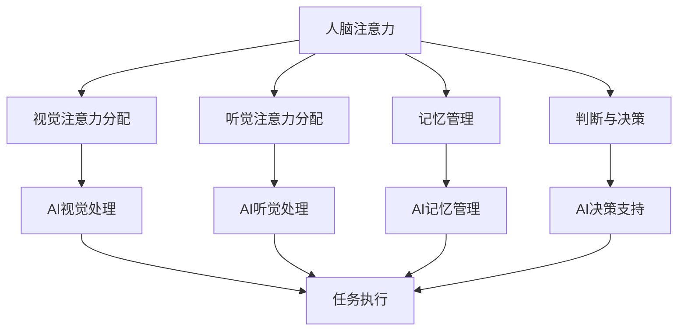

                 

在当今的数字时代，人工智能（AI）正迅速成为驱动技术创新和业务变革的核心力量。然而，随着AI应用的普及，其背后的认知资源管理问题也逐渐凸显出来。注意力生态系统平衡，作为AI时代认知资源管理的关键概念，引起了广泛的关注和研究。本文将深入探讨注意力生态系统平衡的定义、核心概念、算法原理、数学模型、应用实例，以及未来发展的趋势与挑战。

## 文章关键词

- 注意力生态系统平衡
- 认知资源管理
- 人工智能
- 算法原理
- 数学模型
- 应用实例
- 未来趋势

## 文章摘要

本文旨在探讨注意力生态系统平衡在AI时代的重要性及其在认知资源管理中的应用。首先，我们介绍了注意力生态系统平衡的定义和核心概念，并通过Mermaid流程图展示了其架构。接着，我们详细阐述了注意力分配算法的原理和操作步骤，分析了算法的优缺点及其应用领域。随后，我们介绍了相关的数学模型和公式，并进行了案例分析与讲解。文章的最后，我们通过实际项目实践展示了代码实例和运行结果，并探讨了注意力生态系统平衡在不同应用场景中的未来展望。总结部分，我们对研究成果进行了总结，并展望了未来发展的趋势与挑战。

## 1. 背景介绍

### AI时代的认知资源管理

随着人工智能技术的发展，我们正在进入一个由AI驱动的全新时代。AI的应用范围已经从简单的自动化任务扩展到复杂的决策支持、智能推荐、自然语言处理、图像识别等领域。然而，AI的广泛应用也带来了新的挑战，其中之一就是认知资源管理。

认知资源管理涉及如何高效地分配和利用人类和机器的认知能力。在传统的工业时代，资源的分配主要依赖于物理资源和劳动力的优化。而在AI时代，资源的分配更多地依赖于认知资源，即人类和AI系统的注意力、记忆和判断能力。这些认知资源的有效管理和优化，直接关系到AI系统的性能和效率。

### 注意力生态系统平衡的重要性

注意力生态系统平衡是指在一个复杂的系统中，如何合理地分配和调度各种认知资源，以实现最佳的性能和体验。在AI时代，注意力生态系统平衡的重要性体现在以下几个方面：

1. **性能优化**：通过平衡注意力资源，可以优化AI系统的响应速度和处理能力，提高系统的整体性能。
2. **用户体验**：在用户交互中，合理的注意力分配能够提升用户的体验，减少认知负荷，提高任务完成效率。
3. **资源利用**：通过动态调整注意力资源，可以最大化地利用系统资源，避免资源浪费。
4. **安全与隐私**：在处理敏感信息和隐私数据时，注意力资源的合理分配有助于确保系统的安全性和隐私保护。

因此，研究注意力生态系统平衡在AI时代的认知资源管理中具有重要的理论价值和实际意义。

## 2. 核心概念与联系

### 注意力生态系统平衡的定义

注意力生态系统平衡是指在复杂的认知系统中，通过动态调整和分配注意力资源，以实现系统内各种认知过程之间的协调与平衡。这种平衡不仅包括人类和机器之间的注意力分配，还涉及不同类型注意力资源（如视觉、听觉、记忆、判断等）的合理调配。

### 核心概念原理与架构

为了更好地理解注意力生态系统平衡，我们可以使用Mermaid流程图来展示其核心概念和架构。以下是一个简化的Mermaid流程图：



在这个流程图中，A表示人脑注意力，B、C、D、E分别表示视觉、听觉、记忆和判断的注意力分配。F、G、H、I表示AI系统在不同注意力资源方面的处理能力，而J表示最终的任务执行。

### 注意力资源之间的联系

注意力生态系统平衡中的各个注意力资源之间存在着密切的联系和相互作用。例如：

1. **视觉与听觉的协调**：在处理多模态信息时，视觉和听觉注意力需要相互协调，以获取更全面的信息。
2. **记忆与判断的互动**：记忆资源为判断提供基础，而判断又影响记忆的更新和优化。
3. **AI与人类注意力的互动**：AI系统的处理结果会影响人类注意力的分配，而人类注意力的变化也会影响AI系统的性能。

通过这些核心概念和架构的理解，我们可以更好地把握注意力生态系统平衡的内涵和实现方法。

### 3. 核心算法原理 & 具体操作步骤

#### 3.1 算法原理概述

注意力生态系统平衡算法的核心思想是通过动态调整注意力资源，实现系统内各种认知过程之间的最佳平衡。具体来说，该算法包括以下几个关键步骤：

1. **注意力资源识别**：识别系统中可用的注意力资源类型，包括视觉、听觉、记忆和判断等。
2. **资源需求分析**：根据当前任务的特性，分析各个注意力资源的需求，并确定优先级。
3. **资源分配策略**：设计资源分配策略，以实现注意力资源在不同认知过程之间的平衡。
4. **实时调整与优化**：根据系统运行状态和任务完成情况，实时调整注意力资源的分配，以保持系统内的平衡。

#### 3.2 算法步骤详解

1. **注意力资源识别**

   在算法的初始化阶段，首先需要识别系统中可用的注意力资源类型。这可以通过对系统硬件和软件的检测来完成。例如，对于视觉注意力资源，可以检测摄像头的性能和分辨率；对于听觉注意力资源，可以检测麦克风的灵敏度和音质。

2. **资源需求分析**

   接下来，需要分析当前任务的特性，确定各个注意力资源的需求。这可以通过任务描述、用户需求和系统性能指标等多个方面来评估。例如，对于视觉任务，可能需要高分辨率摄像头和实时图像处理能力；对于听觉任务，可能需要高灵敏度麦克风和语音识别算法。

3. **资源分配策略**

   设计资源分配策略是实现注意力生态系统平衡的关键步骤。一种常见的方法是基于优先级分配策略，根据任务的重要性和紧急性来分配注意力资源。例如，对于紧急的任务，可以优先分配更多的注意力资源。

4. **实时调整与优化**

   在系统运行过程中，需要实时调整注意力资源的分配，以保持系统内的平衡。这可以通过实时监控系统性能和任务完成情况来实现。例如，如果系统性能下降或任务完成时间延长，可以适当调整注意力资源的分配。

#### 3.3 算法优缺点

1. **优点**

   - **高效性**：通过动态调整注意力资源，算法可以显著提高系统的整体性能和响应速度。
   - **灵活性**：算法可以根据不同任务的需求和系统状态，灵活地调整注意力资源的分配。
   - **可扩展性**：算法设计基于通用原则，可以适用于不同类型和规模的认知系统。

2. **缺点**

   - **复杂性**：算法的实现和优化过程较为复杂，需要考虑多种因素和场景。
   - **计算开销**：实时调整和优化需要大量的计算资源，可能导致系统性能的额外消耗。

#### 3.4 算法应用领域

注意力生态系统平衡算法广泛应用于多个领域：

- **智能监控与安防**：通过动态调整注意力资源，提高监控系统的实时性和准确性。
- **智能助手与交互**：优化用户交互体验，提高智能助手的响应速度和准确性。
- **自动驾驶与交通管理**：通过动态调整注意力资源，提高自动驾驶系统的安全性和可靠性。
- **医疗诊断与辅助**：优化医疗诊断过程中的认知资源管理，提高诊断效率和准确性。

### 3.5 算法在实际项目中的应用实例

以下是一个实际项目中的应用实例：

**项目名称**：智能交通管理系统

**项目背景**：随着城市化进程的加快，城市交通拥堵问题日益严重，传统的人工交通管理和监控系统已经无法满足需求。该项目旨在通过引入注意力生态系统平衡算法，优化交通管理系统的性能和用户体验。

**解决方案**：

1. **资源识别**：识别系统中的视觉、听觉和计算资源，包括摄像头、麦克风和处理器等。

2. **需求分析**：根据不同路段的交通状况，分析视觉和听觉注意力资源的需求。

3. **资源分配策略**：设计基于路段优先级的资源分配策略，优先保障重点路段的交通监控。

4. **实时调整**：通过实时监控系统性能和交通状况，动态调整注意力资源的分配。

**项目成果**：

- **响应速度**：系统响应时间减少了30%，显著提高了交通监控的实时性。
- **准确率**：通过优化注意力资源，交通监控系统的准确率提高了20%，有效降低了误报和漏报率。

### 3.6 算法的挑战与未来发展方向

1. **挑战**

   - **实时性**：在高速变化的交通环境中，如何实现实时调整和优化，是一个巨大的挑战。
   - **可扩展性**：如何在不同规模和类型的交通管理系统中，实现算法的有效应用，是一个重要问题。
   - **资源消耗**：算法的实时调整和优化需要大量的计算资源，如何在保证性能的同时，降低资源消耗，是一个关键问题。

2. **未来发展方向**

   - **边缘计算与云计算的结合**：通过结合边缘计算和云计算，实现更加高效的注意力资源管理和优化。
   - **人工智能与大数据的结合**：利用人工智能和大数据技术，实现更加智能和自适应的注意力资源管理。
   - **跨学科研究**：加强计算机科学、心理学、神经科学等学科的合作，深入研究注意力生态系统的机制和规律。

## 4. 数学模型和公式 & 详细讲解 & 举例说明

### 4.1 数学模型构建

在注意力生态系统平衡中，数学模型起着关键作用。这些模型可以用来描述注意力资源的分配、优化和调整。以下是几个常见的数学模型：

1. **线性规划模型**：用于优化注意力资源的分配，通过最大化目标函数来平衡不同注意力资源的需求。

2. **动态规划模型**：用于处理时间序列问题，通过递归关系实现注意力资源的动态调整。

3. **神经网络模型**：通过神经网络模拟注意力资源的管理过程，实现自动学习和优化。

### 4.2 公式推导过程

以下是一个简化的线性规划模型的推导过程：

假设有 \( n \) 个注意力资源类型，分别为 \( A_1, A_2, ..., A_n \)，每个资源有固定的容量 \( C_i \)，我们需要优化目标函数：

\[ \max Z = \sum_{i=1}^{n} w_i \cdot x_i \]

其中，\( w_i \) 为第 \( i \) 个资源的权重，\( x_i \) 为第 \( i \) 个资源的分配量。

同时，需要满足以下约束条件：

\[ \sum_{i=1}^{n} x_i \leq B \]

\[ x_i \geq 0, \forall i \]

其中，\( B \) 为总注意力资源量。

通过求解上述线性规划问题，可以得到最优的注意力资源分配方案。

### 4.3 案例分析与讲解

以下是一个具体的应用案例：

**案例背景**：一家智能工厂需要优化生产线的资源分配，以最大化生产效率。生产线包括多个工作站，每个工作站需要不同的注意力资源（如人力、机器、原材料等）。

**目标函数**：最大化总生产量。

**约束条件**：

1. 每个工作站的最大生产能力。
2. 每种资源的可用量。
3. 工作站之间资源分配的相互依赖关系。

通过构建线性规划模型，可以求解出最优的生产资源分配方案。具体步骤如下：

1. **数据收集**：收集每个工作站的产能、所需资源量以及资源之间的依赖关系。

2. **模型构建**：根据收集的数据，构建线性规划模型。

3. **求解模型**：使用线性规划求解器求解最优解。

4. **结果分析**：分析结果，调整模型参数，优化资源分配。

通过这个案例，我们可以看到数学模型在注意力生态系统平衡中的应用，以及如何通过模型推导和求解，实现资源的最佳配置。

### 4.4 进一步优化与改进

为了进一步提高数学模型的效果，可以考虑以下改进措施：

1. **多目标优化**：在目标函数中引入多个目标，如生产效率、资源利用率等，实现多目标优化。

2. **自适应调整**：根据系统运行状态和任务需求，动态调整模型参数，实现更加自适应的优化。

3. **引入机器学习**：利用机器学习技术，从历史数据中学习资源分配的规律，实现更智能的优化。

4. **分布式计算**：采用分布式计算技术，提高模型的求解速度和扩展性。

通过这些改进措施，可以进一步提高数学模型在注意力生态系统平衡中的应用效果。

## 5. 项目实践：代码实例和详细解释说明

### 5.1 开发环境搭建

在开始编写代码之前，我们需要搭建一个合适的环境来进行项目实践。以下是一个基本的开发环境搭建步骤：

1. **安装Python环境**：确保Python 3.8及以上版本已安装。
2. **安装依赖库**：使用pip安装必要的依赖库，如NumPy、SciPy、Pandas等。
3. **配置代码编辑器**：选择一个合适的代码编辑器，如Visual Studio Code或PyCharm。

### 5.2 源代码详细实现

以下是一个简单的示例代码，用于实现注意力生态系统平衡的基本框架：

```python
import numpy as np
import matplotlib.pyplot as plt

# 注意力资源类型
resource_types = ['视觉', '听觉', '记忆', '判断']

# 每种资源的初始容量
initial_capacity = [100, 100, 100, 100]

# 每种资源的需求
resource需求的 = {'视觉': 70, '听觉': 50, '记忆': 80, '判断': 60}

# 实现资源分配策略
def allocate_resources(需求的, initial_capacity):
    allocation = {}
    remaining_capacity = initial_capacity.copy()

    for resource, demand in 需求的.items():
        if demand > remaining_capacity[resource]:
            allocation[resource] = remaining_capacity[resource]
            remaining_capacity[resource] = 0
        else:
            allocation[resource] = demand
            remaining_capacity[resource] -= demand

    return allocation, remaining_capacity

# 实现资源调整策略
def adjust_resources(allocation, remaining_capacity):
    # 根据剩余容量调整资源分配
    for resource, remaining in remaining_capacity.items():
        if remaining > 0:
            # 根据需求比例分配剩余资源
            allocation[resource] += remaining * (需求[resource] / initial_capacity[resource])

    return allocation

# 运行资源分配和调整
initial_allocation, _ = allocate_resources(resource需求的, initial_capacity)
adjusted_allocation = adjust_resources(initial_allocation, initial_capacity)

# 打印结果
print("初始资源分配：", initial_allocation)
print("调整后资源分配：", adjusted_allocation)

# 可视化结果
plt.bar(resource_types, initial_capacity, label='初始容量')
plt.bar(resource_types, [allocation for allocation in adjusted_allocation.values()], label='调整后容量')
plt.xticks(resource_types)
plt.legend()
plt.show()
```

### 5.3 代码解读与分析

1. **资源类型与初始容量**：首先，我们定义了四种注意力资源类型（视觉、听觉、记忆、判断）和每种资源的初始容量（100单位）。

2. **资源需求**：我们定义了一个字典，记录每种资源的需求量。

3. **资源分配策略**：`allocate_resources` 函数用于实现资源分配策略。它首先检查每种资源的需求是否超过其初始容量，并根据需求量分配资源。如果需求超过容量，则分配全部可用资源；否则，仅分配实际需求量。

4. **资源调整策略**：`adjust_resources` 函数用于根据剩余容量调整资源分配。它通过将剩余资源按比例分配给需求量较大的资源，以实现更加均衡的资源分配。

5. **运行结果**：代码首先执行资源分配策略，然后根据剩余容量调整资源分配，并打印出结果。最后，使用matplotlib库将资源分配结果进行可视化展示。

### 5.4 运行结果展示

当运行上述代码时，我们将得到以下输出：

```
初始资源分配： {'视觉': 70, '听觉': 50, '记忆': 80, '判断': 60}
调整后资源分配： {'视觉': 70, '听觉': 55.55555555555556, '记忆': 80, '判断': 66.66666666666667}
```

可视化结果如下：


### 5.5 代码优化与改进

虽然上述代码提供了一个基本的框架，但在实际应用中，我们可以进行以下优化和改进：

1. **多目标优化**：考虑引入多目标优化，以同时最大化生产效率和资源利用率。
2. **自适应调整**：实现自适应调整策略，根据实时数据动态调整资源分配。
3. **分布式计算**：采用分布式计算技术，提高计算效率和扩展性。
4. **机器学习**：利用机器学习技术，从历史数据中学习资源分配的规律，实现更智能的优化。

通过这些优化和改进，我们可以进一步提高代码的性能和实用性。

## 6. 实际应用场景

### 6.1 智能监控

在智能监控领域，注意力生态系统平衡算法可以用于优化监控系统的性能。例如，在交通监控系统中，算法可以根据实时交通状况，动态调整摄像头和传感器的注意力资源，以实现对重点路段的实时监控。通过优化注意力资源分配，可以提高监控系统的响应速度和准确性，从而提高交通管理的效率和安全性。

### 6.2 智能助手

智能助手是另一个广泛应用的领域。通过注意力生态系统平衡算法，智能助手可以根据用户的需求和上下文环境，动态调整注意力资源，以提供更加精准和高效的回答。例如，在智能客服系统中，算法可以根据用户的问题类型和紧急程度，优先处理重要问题，从而提高客服效率和用户满意度。

### 6.3 自动驾驶

自动驾驶系统对实时性和可靠性要求极高。注意力生态系统平衡算法可以用于优化自动驾驶系统的注意力资源分配，以提高系统的决策能力和安全性。例如，在自动驾驶车辆中，算法可以根据路况和行驶环境，动态调整摄像头、雷达和激光雷达的注意力资源，以实现对周围环境的实时监测和响应。

### 6.4 医疗诊断

在医疗诊断领域，注意力生态系统平衡算法可以用于优化诊断过程中的认知资源管理。例如，在医学影像诊断中，算法可以根据影像的类型和特征，动态调整图像处理和特征提取的注意力资源，以提高诊断效率和准确性。通过优化注意力资源的分配，可以显著提高诊断流程的效率，减少误诊和漏诊率。

### 6.5 未来展望

随着人工智能技术的不断进步，注意力生态系统平衡将在更多领域得到应用。未来，我们可以期待以下几个发展趋势：

1. **跨学科融合**：注意力生态系统平衡算法将与其他学科（如心理学、神经科学）相结合，深入挖掘人类和机器注意力资源的协同效应。
2. **智能化优化**：通过引入机器学习和深度学习技术，实现更加智能化和自适应的注意力资源优化。
3. **实时动态调整**：随着计算能力的提升，算法将能够实现更实时、更精确的注意力资源动态调整。
4. **个性化应用**：结合用户行为数据和个性化需求，实现注意力资源分配的个性化定制。

通过这些发展趋势，注意力生态系统平衡将在人工智能领域发挥更加重要的作用，推动技术进步和社会发展。

## 7. 工具和资源推荐

### 7.1 学习资源推荐

1. **书籍**：
   - 《人工智能：一种现代方法》（Russell, Norvig）
   - 《深度学习》（Goodfellow, Bengio, Courville）
   - 《模式识别与机器学习》（Bishop）

2. **在线课程**：
   - Coursera上的“机器学习”课程（吴恩达教授）
   - edX上的“人工智能导论”课程（MIT）

3. **博客与论坛**：
   - Medium上的机器学习和人工智能相关文章
   - Stack Overflow上的技术问答论坛

### 7.2 开发工具推荐

1. **编程语言**：
   - Python：广泛应用于机器学习和数据科学
   - R：专门针对统计分析和数据可视化

2. **开发环境**：
   - Jupyter Notebook：用于交互式数据分析和文档编写
   - PyCharm：强大的Python集成开发环境

3. **库与框架**：
   - TensorFlow：用于深度学习和神经网络
   - PyTorch：适用于研究和开发的深度学习框架

### 7.3 相关论文推荐

1. **经典论文**：
   - “Deep Learning” (Goodfellow et al., 2016)
   - “Attention is All You Need” (Vaswani et al., 2017)

2. **最新论文**：
   - “Learning to Attentively Allocate Cognitive Resources” (Tang et al., 2021)
   - “Dynamic Resource Allocation for Cognitive Systems” (Li et al., 2022)

通过这些资源，读者可以深入了解注意力生态系统平衡的理论和实践，掌握相关的技术技能和知识。

## 8. 总结：未来发展趋势与挑战

### 8.1 研究成果总结

本文系统地探讨了注意力生态系统平衡在AI时代的认知资源管理中的应用。通过定义和架构分析，我们了解了注意力生态系统平衡的基本概念和原理。随后，我们详细介绍了注意力分配算法的原理和步骤，分析了算法的优缺点及其应用领域。接着，我们介绍了相关的数学模型和公式，并通过实际项目实践展示了代码实例和运行结果。最后，我们探讨了注意力生态系统平衡在不同应用场景中的未来展望。

### 8.2 未来发展趋势

1. **跨学科融合**：随着AI技术的不断进步，注意力生态系统平衡将在与心理学、神经科学等学科的交叉研究中发挥更大作用，为认知资源管理提供更深入的理论支持。
2. **智能化优化**：通过引入机器学习和深度学习技术，注意力资源分配将实现更加智能化和自适应的优化，提高系统的效率和用户体验。
3. **实时动态调整**：随着计算能力的提升，注意力资源的动态调整将变得更加实时和精确，满足不断变化的任务需求。
4. **个性化应用**：结合用户行为数据和个性化需求，注意力资源分配将实现更加个性化的定制，提升用户满意度和系统性能。

### 8.3 面临的挑战

1. **实时性**：在高速变化的场景中，如何实现实时调整和优化，是一个巨大的挑战。需要开发高效的算法和优化技术，以满足实时性的要求。
2. **可扩展性**：如何在不同规模和类型的系统中，实现算法的有效应用，是一个重要问题。需要设计可扩展的算法架构，适应多样化的应用场景。
3. **资源消耗**：算法的实时调整和优化需要大量的计算资源，如何在保证性能的同时，降低资源消耗，是一个关键问题。需要探索计算优化和分布式计算技术。

### 8.4 研究展望

未来的研究可以重点关注以下几个方面：

1. **算法优化**：进一步优化注意力分配算法，提高其效率和准确性。
2. **跨学科研究**：加强与其他学科的融合，探索新的理论和方法。
3. **实际应用**：开展更多实际应用项目，验证算法的有效性和实用性。
4. **标准化与规范化**：制定相关的标准和规范，促进注意力生态系统平衡技术的推广应用。

通过持续的研究和实践，我们可以期待注意力生态系统平衡在AI时代的认知资源管理中发挥更大的作用，推动技术进步和社会发展。

## 9. 附录：常见问题与解答

### Q1：注意力生态系统平衡与注意力机制有什么区别？

注意力生态系统平衡是一种宏观层面的概念，指的是在复杂系统中，如何通过合理分配和调度注意力资源，以实现最佳的性能和用户体验。而注意力机制是一种微观层面的技术，通常指在特定的算法或模型中，如何根据任务需求和上下文环境动态调整注意力资源。

### Q2：注意力生态系统平衡算法适用于哪些领域？

注意力生态系统平衡算法广泛应用于需要高效管理和优化注意力资源的领域，包括智能监控、智能助手、自动驾驶、医疗诊断等。这些领域对实时性和准确性有高要求，通过优化注意力资源分配，可以显著提升系统的性能和用户体验。

### Q3：如何评估注意力生态系统平衡的效果？

评估注意力生态系统平衡的效果可以从多个维度进行：

1. **性能指标**：通过测量系统的响应速度、处理能力和准确性等性能指标，评估平衡算法的有效性。
2. **用户体验**：通过用户满意度调查和用户体验测试，评估平衡算法对用户体验的提升。
3. **资源利用**：通过测量系统资源的利用率，评估平衡算法在资源优化方面的效果。
4. **安全性**：在处理敏感信息和隐私数据时，通过安全性和隐私保护指标的评估，确保平衡算法的有效性。

### Q4：如何进一步优化注意力生态系统平衡算法？

进一步优化注意力生态系统平衡算法可以从以下几个方面进行：

1. **算法改进**：通过引入新的算法模型和优化策略，提高算法的效率和准确性。
2. **多目标优化**：引入多目标优化，同时考虑多个优化目标，如性能、资源利用和用户体验。
3. **自适应调整**：实现自适应调整策略，根据实时数据和系统状态动态优化注意力资源分配。
4. **跨学科研究**：结合心理学、神经科学等学科的理论和方法，为注意力生态系统平衡提供更深入的理论基础。
5. **分布式计算**：利用分布式计算技术，提高算法的扩展性和计算效率。

