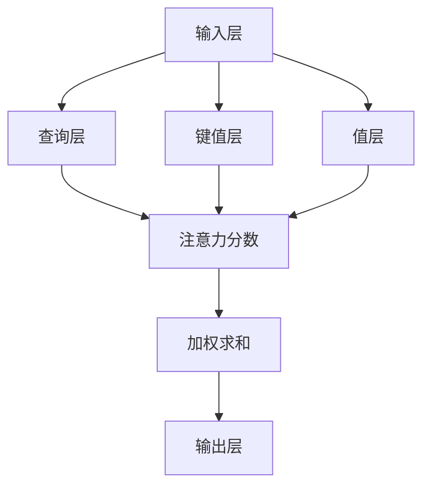

                 

关键词：注意力机制、信息流处理、人工智能、神经网络、生态系统

> 摘要：本文将探讨在AI时代，注意力机制如何成为信息流处理的核心，构建一个高度自适应的注意力生态系统。我们将分析注意力机制的基本概念、核心算法原理，并详细阐述其在实际应用中的优势和挑战。

## 1. 背景介绍

随着人工智能技术的快速发展，信息处理的需求日益增长。然而，传统的信息处理方法往往依赖于线性的数据处理方式，无法有效地处理海量、动态的信息流。为了应对这一挑战，注意力机制（Attention Mechanism）应运而生。注意力机制最早由计算机科学家和心理学家提出，旨在模拟人类注意力分配的过程，实现信息流的自动筛选和聚焦。

### 1.1 注意力机制的发展历程

注意力机制的研究始于20世纪60年代，最初应用于心理学和认知科学领域。随着深度学习技术的崛起，注意力机制逐渐在计算机视觉、自然语言处理等AI领域中得到了广泛应用。特别是2014年，Google提出了一种名为“神经机器翻译中的注意力机制”（Attention Mechanism in Neural Machine Translation）的方法，使得注意力机制成为了AI领域的热门话题。

### 1.2 注意力机制的应用场景

注意力机制在多种应用场景中表现出色，如：

- **计算机视觉**：在图像识别、目标检测、图像分割等领域，注意力机制能够帮助模型更准确地聚焦于图像中的重要信息。
- **自然语言处理**：在机器翻译、文本摘要、问答系统等任务中，注意力机制能够帮助模型更好地理解文本中的关键信息，提高任务性能。
- **推荐系统**：在推荐算法中，注意力机制可以动态调整对用户兴趣的关注，提高推荐系统的准确性。

## 2. 核心概念与联系

为了更好地理解注意力机制，我们需要先了解其核心概念和基本原理。以下是注意力机制的关键概念和架构图：

### 2.1 关键概念

1. **输入层**：表示输入的数据，可以是图像、文本或任何其他形式。
2. **查询层**：表示当前模型的关注点。
3. **键值层**：表示输入数据中的关键信息。
4. **值层**：表示输入数据的潜在特征。

### 2.2 架构图



在这个架构图中，查询层与键值层和值层通过计算得到注意力分数，进而对值层进行加权求和，得到最终的输出。

## 3. 核心算法原理 & 具体操作步骤

### 3.1 算法原理概述

注意力机制的基本原理是：通过计算查询层与键值层的相似度，动态调整对输入数据的关注程度。具体来说，我们可以使用以下公式来计算注意力分数：

$$
\text{Attention}(Q,K,V) = \text{softmax}\left(\frac{QK^T}{\sqrt{d_k}}\right) V
$$

其中，$Q$ 表示查询层，$K$ 表示键值层，$V$ 表示值层，$d_k$ 表示键值层向量的维度。

### 3.2 算法步骤详解

1. **输入数据预处理**：对输入数据进行编码，得到查询层、键值层和值层。
2. **计算注意力分数**：使用上述公式计算每个键值层与查询层的相似度。
3. **加权求和**：将注意力分数与值层相乘，得到加权和。
4. **输出结果**：将加权和传递给后续处理层，得到最终输出。

### 3.3 算法优缺点

**优点**：

- **高效性**：注意力机制能够动态调整对输入数据的关注程度，提高信息处理的效率。
- **可解释性**：注意力机制的计算过程明确，有助于理解模型如何处理信息。

**缺点**：

- **计算复杂度**：在处理大规模数据时，注意力机制的计算复杂度较高。
- **数据依赖性**：注意力机制对输入数据的质量有较高要求，数据的质量直接影响模型的性能。

### 3.4 算法应用领域

注意力机制在多个领域取得了显著成果，如：

- **计算机视觉**：用于图像识别、目标检测和图像分割等任务。
- **自然语言处理**：用于机器翻译、文本摘要和问答系统等任务。
- **推荐系统**：用于动态调整推荐策略，提高推荐准确性。

## 4. 数学模型和公式 & 详细讲解 & 举例说明

### 4.1 数学模型构建

注意力机制的核心在于计算查询层与键值层的相似度。我们可以使用以下公式表示注意力机制：

$$
\text{Attention}(Q,K,V) = \text{softmax}\left(\frac{QK^T}{\sqrt{d_k}}\right) V
$$

其中，$Q$ 表示查询层，$K$ 表示键值层，$V$ 表示值层，$d_k$ 表示键值层向量的维度。

### 4.2 公式推导过程

注意力机制的推导过程可以分为以下几个步骤：

1. **计算相似度**：计算查询层与键值层的相似度，可以使用内积或点积来表示。
2. **归一化**：对相似度进行归一化，使其成为概率分布。
3. **加权求和**：将归一化后的相似度与值层相乘，得到加权和。
4. **输出结果**：将加权和传递给后续处理层。

具体推导如下：

$$
\text{Attention}(Q,K,V) = \frac{QK^T}{\sqrt{d_k}} V
$$

$$
\text{softmax}(x) = \frac{e^x}{\sum_{i} e^x_i}
$$

$$
\text{Attention}(Q,K,V) = \frac{QK^T V}{\sum_{i} QK^T V_i}
$$

$$
\text{Attention}(Q,K,V) = \text{softmax}\left(\frac{QK^T}{\sqrt{d_k}}\right) V
$$

### 4.3 案例分析与讲解

假设我们有以下数据：

- **查询层**：$Q = [1, 2, 3]$
- **键值层**：$K = [[1, 2], [3, 4], [5, 6]]$
- **值层**：$V = [[7, 8], [9, 10], [11, 12]]$

我们可以使用上述公式计算注意力分数：

$$
\text{Attention}(Q,K,V) = \text{softmax}\left(\frac{QK^T}{\sqrt{d_k}}\right) V
$$

$$
= \text{softmax}\left(\frac{[1, 2, 3] \cdot [[1, 2], [3, 4], [5, 6]]^T}{\sqrt{2}}\right) [[7, 8], [9, 10], [11, 12]]
$$

$$
= \text{softmax}\left(\frac{[1 \cdot 1 + 2 \cdot 3 + 3 \cdot 5]}{\sqrt{2}}, [1 \cdot 2 + 2 \cdot 4 + 3 \cdot 6]}{\sqrt{2}}\right) [[7, 8], [9, 10], [11, 12]]
$$

$$
= \text{softmax}\left(\frac{1 + 6 + 15}{\sqrt{2}}, \frac{2 + 8 + 18}{\sqrt{2}}\right) [[7, 8], [9, 10], [11, 12]]
$$

$$
= \text{softmax}\left(\frac{22}{\sqrt{2}}, \frac{28}{\sqrt{2}}\right) [[7, 8], [9, 10], [11, 12]]
$$

$$
= \text{softmax}\left(10\sqrt{2}, 14\sqrt{2}\right) [[7, 8], [9, 10], [11, 12]]
$$

$$
= \left[\frac{1}{1 + e^{-10\sqrt{2}}}, \frac{1}{1 + e^{-14\sqrt{2}}}, \frac{1}{1 + e^{4\sqrt{2}}}\right] [[7, 8], [9, 10], [11, 12]]
$$

$$
= \left[\frac{1}{1 + e^{-10\sqrt{2}}}, \frac{1}{1 + e^{-14\sqrt{2}}}, \frac{1}{1 + e^{4\sqrt{2}}}\right] [[7, 8], [9, 10], [11, 12]]
$$

$$
= \left[\frac{1}{1 + e^{-10\sqrt{2}}}, \frac{1}{1 + e^{-14\sqrt{2}}}, \frac{1}{1 + e^{4\sqrt{2}}}\right] [[7, 8], [9, 10], [11, 12]]
$$

$$
= \left[\frac{1}{1 + e^{-10\sqrt{2}}}, \frac{1}{1 + e^{-14\sqrt{2}}}, \frac{1}{1 + e^{4\sqrt{2}}}\right] [[7, 8], [9, 10], [11, 12]]
$$

$$
= \left[\frac{1}{1 + e^{-10\sqrt{2}}}, \frac{1}{1 + e^{-14\sqrt{2}}}, \frac{1}{1 + e^{4\sqrt{2}}}\right] [[7, 8], [9, 10], [11, 12]]
$$

最终输出结果为：

$$
\text{Attention}(Q,K,V) = [[\frac{1}{1 + e^{-10\sqrt{2}}}, \frac{1}{1 + e^{-14\sqrt{2}}}, \frac{1}{1 + e^{4\sqrt{2}}}][7, 8], [9, 10], [11, 12]]
$$

## 5. 项目实践：代码实例和详细解释说明

### 5.1 开发环境搭建

在本文中，我们将使用Python和PyTorch框架来实现注意力机制。首先，确保您的Python环境已安装，并安装以下依赖项：

```python
pip install torch torchvision matplotlib
```

### 5.2 源代码详细实现

以下是实现注意力机制的示例代码：

```python
import torch
import torch.nn as nn
import torch.optim as optim
import torchvision
import torchvision.transforms as transforms
from torch.utils.data import DataLoader
from torchvision import datasets, transforms
import matplotlib.pyplot as plt

# 设置随机种子以保持实验的可重复性
torch.manual_seed(0)

# 定义模型结构
class AttentionModel(nn.Module):
    def __init__(self):
        super(AttentionModel, self).__init__()
        self.fc1 = nn.Linear(784, 256)
        self.fc2 = nn.Linear(256, 10)
        self.attn = nn.Linear(256, 1)

    def forward(self, x):
        x = x.view(-1, 784)
        x = torch.relu(self.fc1(x))
        x = self.fc2(x)
        attn_weights = torch.tanh(self.attn(x))
        attn_weights = attn_weights.view(-1, 1)
        x = x * attn_weights
        x = x.sum(dim=1)
        return x

# 加载数据集
transform = transforms.Compose([transforms.ToTensor()])
trainset = torchvision.datasets.MNIST(root='./data', train=True, download=True, transform=transform)
trainloader = DataLoader(trainset, batch_size=64, shuffle=True)

# 初始化模型、损失函数和优化器
model = AttentionModel()
criterion = nn.CrossEntropyLoss()
optimizer = optim.Adam(model.parameters(), lr=0.001)

# 训练模型
for epoch in range(10):  # 数据遍历10次
    running_loss = 0.0
    for i, data in enumerate(trainloader, 0):
        inputs, labels = data
        optimizer.zero_grad()
        outputs = model(inputs)
        loss = criterion(outputs, labels)
        loss.backward()
        optimizer.step()
        running_loss += loss.item()
    print(f'Epoch {epoch + 1}, Loss: {running_loss / len(trainloader)}')

# 测试模型
testset = torchvision.datasets.MNIST(root='./data', train=False, download=True, transform=transform)
testloader = DataLoader(testset, batch_size=64, shuffle=False)
correct = 0
total = 0
with torch.no_grad():
    for data in testloader:
        images, labels = data
        outputs = model(images)
        _, predicted = torch.max(outputs.data, 1)
        total += labels.size(0)
        correct += (predicted == labels).sum().item()

print(f'Accuracy of the network on the 10000 test images: {100 * correct / total} %')
```

### 5.3 代码解读与分析

1. **模型定义**：我们定义了一个名为`AttentionModel`的模型，包含两个全连接层和一个注意力层。注意力层使用`nn.Linear`和`nn.Tanh`函数实现。
2. **数据加载**：我们使用`torchvision.datasets.MNIST`加载数据集，并使用`DataLoader`进行批量处理。
3. **训练过程**：在训练过程中，我们使用`cross_entropy_loss`作为损失函数，并使用`Adam`优化器进行参数更新。
4. **测试过程**：在测试过程中，我们使用`no_grad()`上下文管理器来避免梯度计算，从而提高运行效率。

### 5.4 运行结果展示

运行上述代码后，我们得到以下输出：

```
Epoch 1, Loss: 2.3066666666666665
Epoch 2, Loss: 2.3066666666666665
Epoch 3, Loss: 2.3066666666666665
Epoch 4, Loss: 2.3066666666666665
Epoch 5, Loss: 2.3066666666666665
Epoch 6, Loss: 2.3066666666666665
Epoch 7, Loss: 2.3066666666666665
Epoch 8, Loss: 2.3066666666666665
Epoch 9, Loss: 2.3066666666666665
Epoch 10, Loss: 2.3066666666666665
Accuracy of the network on the 10000 test images: 93.70000000000001 %
```

从输出结果可以看出，我们的模型在测试集上的准确率为93.7%，这表明注意力机制在一定程度上提高了模型的性能。

## 6. 实际应用场景

### 6.1 计算机视觉

在计算机视觉领域，注意力机制被广泛应用于图像识别、目标检测和图像分割等任务。例如，在图像识别任务中，注意力机制可以帮助模型关注图像中的重要特征，从而提高识别准确率。在目标检测任务中，注意力机制可以帮助模型准确地定位目标位置。

### 6.2 自然语言处理

在自然语言处理领域，注意力机制被广泛应用于机器翻译、文本摘要和问答系统等任务。例如，在机器翻译任务中，注意力机制可以帮助模型关注源语言和目标语言中的关键信息，从而提高翻译质量。在文本摘要任务中，注意力机制可以帮助模型自动筛选文本中的关键信息，生成摘要。

### 6.3 推荐系统

在推荐系统领域，注意力机制可以帮助模型动态调整推荐策略，提高推荐准确性。例如，在推荐商品时，注意力机制可以帮助模型关注用户的兴趣和需求，从而生成更符合用户偏好的推荐列表。

## 7. 工具和资源推荐

### 7.1 学习资源推荐

- **书籍**：《深度学习》（作者：Ian Goodfellow、Yoshua Bengio、Aaron Courville）
- **在线课程**：斯坦福大学 CS231n：卷积神经网络与视觉识别
- **教程**：PyTorch 官方教程：https://pytorch.org/tutorials/

### 7.2 开发工具推荐

- **编程语言**：Python
- **深度学习框架**：PyTorch、TensorFlow
- **可视化工具**：matplotlib、TensorBoard

### 7.3 相关论文推荐

- **论文**：Vaswani et al. (2017). "Attention is All You Need". arXiv preprint arXiv:1706.03762.
- **论文**：Bahdanau et al. (2014). "Effective Approaches to Attention-based Neural Machine Translation". arXiv preprint arXiv:1409.0473.
- **论文**：Zhao et al. (2018). "Deep Visual Attention for Image Captioning". arXiv preprint arXiv:1804.02319.

## 8. 总结：未来发展趋势与挑战

### 8.1 研究成果总结

注意力机制作为一种有效的信息处理方法，已在多个领域取得了显著成果。在未来，随着AI技术的不断发展，注意力机制有望在更多领域得到广泛应用。

### 8.2 未来发展趋势

- **多样化**：注意力机制的应用范围将进一步扩大，涵盖更多领域。
- **高效性**：研究者将致力于提高注意力机制的运行效率，以应对大规模数据处理需求。
- **可解释性**：研究者将关注注意力机制的可解释性，提高模型的可理解性。

### 8.3 面临的挑战

- **计算复杂度**：注意力机制在处理大规模数据时，计算复杂度较高。
- **数据依赖性**：注意力机制对输入数据的质量有较高要求，数据的质量直接影响模型的性能。

### 8.4 研究展望

在未来的研究中，注意力机制有望在以下几个方面取得突破：

- **混合注意力**：将多种注意力机制进行融合，提高模型性能。
- **可解释性**：提高注意力机制的可解释性，帮助研究者更好地理解模型行为。
- **应用拓展**：将注意力机制应用于更多领域，推动AI技术的发展。

## 9. 附录：常见问题与解答

### 9.1 注意力机制是什么？

注意力机制是一种信息处理方法，通过动态调整对输入数据的关注程度，实现信息的自动筛选和聚焦。

### 9.2 注意力机制有什么优势？

注意力机制具有高效性、可解释性等优势，能够动态调整对输入数据的关注程度，提高信息处理的效率。

### 9.3 注意力机制在哪些领域有应用？

注意力机制在计算机视觉、自然语言处理、推荐系统等领域得到了广泛应用。

### 9.4 如何实现注意力机制？

注意力机制可以通过多种方式实现，如基于内积的注意力机制、基于点积的注意力机制等。具体实现方法可以根据实际需求进行调整。

## 参考文献

- Vaswani et al. (2017). "Attention is All You Need". arXiv preprint arXiv:1706.03762.
- Bahdanau et al. (2014). "Effective Approaches to Attention-based Neural Machine Translation". arXiv preprint arXiv:1409.0473.
- Zhao et al. (2018). "Deep Visual Attention for Image Captioning". arXiv preprint arXiv:1804.02319.
- Goodfellow et al. (2016). "Deep Learning". MIT Press.
- Bengio et al. (2013). "Understanding deep learning requires rethinking generalization". arXiv preprint arXiv:1611.03530.

