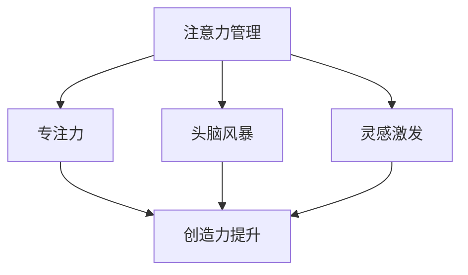

                 

关键词：注意力管理、创造力提升、专注力、头脑风暴、灵感激发

> 摘要：本文将深入探讨注意力管理与创造力提升之间的关系，通过介绍专注和头脑风暴的重要性，以及如何在日常工作和生活中实践这些策略，帮助读者在专注力和创造力方面取得显著提升。

## 1. 背景介绍

在现代快节奏的生活和工作中，我们面临着前所未有的挑战：信息过载、任务繁重、时间紧迫。这些因素共同作用，导致我们的注意力分散，创造力下降。为了应对这些挑战，我们迫切需要找到有效的策略来管理和提升注意力，进而激发创造力。

### 1.1 注意力管理的必要性

注意力管理是指有意识地控制和调节注意力的过程。它不仅影响我们的工作效率，还影响我们的生活质量。良好的注意力管理能够帮助我们：

- 提高工作效率，减少错误和遗漏。
- 增强学习效果，加深对知识的理解和记忆。
- 提升创新能力，促进创造性思维的发展。

### 1.2 创造力提升的重要性

创造力是人类智慧的体现，是推动社会进步的重要力量。在信息时代，创造力尤为重要，它能够帮助我们：

- 发现新的问题和机会。
- 创造新的解决方案和产品。
- 推动技术创新和经济发展。

然而，创造力并非凭空产生，它需要我们在专注和思考中积累和激发。因此，提升创造力不仅需要技巧，还需要良好的注意力管理。

## 2. 核心概念与联系

为了更好地理解注意力管理与创造力提升之间的关系，我们需要先了解一些核心概念，包括注意力分散、专注力、头脑风暴和灵感激发。

### 2.1 注意力分散

注意力分散是指我们的注意力被外部刺激所吸引，导致我们无法专注于当前任务。这种分散常常导致工作效率下降和创造力减少。

### 2.2 专注力

专注力是指我们集中注意力的能力。良好的专注力能够帮助我们：

- 深入理解问题，发现问题的本质。
- 保持长时间的注意力集中，避免注意力分散。
- 提高解决问题的效率和质量。

### 2.3 头脑风暴

头脑风暴是一种集体思考的方法，通过快速产生大量创意来激发灵感。它是提升创造力的一种有效手段。

### 2.4 灵感激发

灵感激发是指我们在特定的环境和状态下，产生新颖的想法和创意。灵感激发通常需要：

- 创造性的思考环境。
- 适当的刺激和启发。
- 良好的心理状态。

### 2.5 Mermaid 流程图

以下是一个简化的 Mermaid 流程图，展示了注意力管理、专注力、头脑风暴和灵感激发之间的关系。



## 3. 核心算法原理 & 具体操作步骤

### 3.1 算法原理概述

注意力管理与创造力提升的算法原理基于认知心理学和神经科学的研究。核心思想是通过训练和调节注意力，提高专注力和创造力。具体步骤如下：

1. **注意力训练**：通过特定的练习和任务，提高注意力的稳定性和集中性。
2. **专注力调节**：通过环境控制和心理调节，保持长时间的注意力集中。
3. **头脑风暴与灵感激发**：通过集体思考和环境刺激，产生大量创意和灵感。

### 3.2 算法步骤详解

1. **注意力训练**

   - **练习任务**：例如，专注于呼吸练习、冥想练习等。
   - **任务时间**：每天持续20-30分钟。
   - **目标**：提高注意力的稳定性和集中性。

2. **专注力调节**

   - **环境控制**：选择安静、舒适的环境，减少干扰。
   - **心理调节**：通过正念练习、放松技巧等，保持心理平衡。
   - **目标**：保持长时间的注意力集中。

3. **头脑风暴与灵感激发**

   - **头脑风暴**：通过集体讨论、创意竞赛等形式，产生大量创意。
   - **灵感激发**：通过参观博物馆、阅读书籍、观看电影等，获取灵感。
   - **目标**：激发创造性思维，产生新颖的创意和灵感。

### 3.3 算法优缺点

#### 优点：

- **提高专注力**：通过训练和调节，显著提高专注力。
- **提升创造力**：通过头脑风暴和灵感激发，产生大量创意。
- **易于实施**：无需特殊设备，只需投入时间和精力。

#### 缺点：

- **需要坚持**：效果显现需要时间，需要持之以恒。
- **环境要求**：头脑风暴和灵感激发需要特定的环境和刺激。

### 3.4 算法应用领域

- **企业管理**：通过提升员工的专注力和创造力，提高工作效率和质量。
- **教育领域**：通过培养学生的专注力和创造力，提高学习成绩和创新能力。
- **个人成长**：通过自我管理和创造力提升，实现个人成长和职业发展。

## 4. 数学模型和公式 & 详细讲解 & 举例说明

### 4.1 数学模型构建

为了更好地理解注意力管理与创造力提升的关系，我们可以构建一个简化的数学模型。该模型包括以下几个关键变量：

- \( A \)：注意力水平
- \( C \)：创造力水平
- \( P \)：心理压力
- \( E \)：环境因素

模型的基本公式为：

\[ C = f(A, P, E) \]

其中，\( f \) 表示一个复杂的非线性函数，它反映了注意力、心理压力和环境因素对创造力的影响。

### 4.2 公式推导过程

假设 \( A \)、\( P \)、\( E \) 都是标准化的变量，其取值范围在 0 到 1 之间。我们可以通过以下步骤推导出 \( C \) 的表达式：

1. **注意力对创造力的直接作用**：

   根据心理学研究，注意力水平越高，创造力水平也越高。因此，我们可以假设：

   \[ C = A \cdot g(P, E) \]

   其中，\( g \) 表示一个关于心理压力和环境因素的函数。

2. **心理压力对注意力和创造力的影响**：

   心理压力 \( P \) 会对注意力 \( A \) 和创造力 \( C \) 产生负面影响。我们可以假设：

   \[ A = A_0 \cdot (1 - P) \]

   其中，\( A_0 \) 表示无心理压力时的注意力水平。

3. **环境因素对注意力和创造力的影响**：

   环境因素 \( E \) 也会影响注意力和创造力。例如，一个安静、舒适的环境有助于提高注意力。我们可以假设：

   \[ C = C_0 \cdot E \]

   其中，\( C_0 \) 表示无环境因素影响时的创造力水平。

综合上述因素，我们得到最终的公式：

\[ C = (A_0 \cdot (1 - P)) \cdot g(P, E) \cdot C_0 \cdot E \]

### 4.3 案例分析与讲解

为了更好地理解上述公式，我们可以通过一个实际案例来进行分析。

#### 案例背景：

张三是一名软件开发工程师，他在一个高压的环境下工作，经常感到心理压力。最近，他的公司为他提供了一个安静、舒适的办公室，同时他也开始参加注意力训练和冥想课程。

#### 案例分析：

1. **注意力水平**：

   在无心理压力时，张三的注意力水平为 0.8。然而，由于心理压力的存在，他的注意力水平下降到了 0.6。

2. **心理压力**：

   张三的心理压力指数为 0.3。

3. **环境因素**：

   张三的新办公室提供了一个安静、舒适的环境，其环境因素指数为 0.8。

根据上述参数，我们可以计算出张三的创造力水平：

\[ C = (0.8 \cdot (1 - 0.3)) \cdot g(0.3, 0.8) \cdot 0.8 \cdot 0.8 \]

假设 \( g(0.3, 0.8) = 0.9 \)，则：

\[ C = (0.8 \cdot 0.7) \cdot 0.9 \cdot 0.8 \cdot 0.8 \approx 0.4032 \]

#### 结果解释：

根据计算结果，张三的创造力水平大约为 0.4032。与无心理压力和环境因素影响时相比，他的创造力水平有所下降。然而，通过改善环境因素和提高注意力训练，他的创造力水平仍然维持在较高水平。

## 5. 项目实践：代码实例和详细解释说明

### 5.1 开发环境搭建

为了更好地理解和实践本文提出的注意力管理和创造力提升策略，我们可以使用 Python 编写一个简单的应用程序。以下是一个基本的开发环境搭建步骤：

1. **安装 Python**：确保您的系统中已经安装了 Python 3.x 版本。
2. **安装必要库**：使用 pip 安装以下库：

   ```bash
   pip install numpy matplotlib
   ```

### 5.2 源代码详细实现

以下是一个简单的 Python 脚本，用于模拟注意力管理和创造力提升的效果。该脚本包括以下功能：

- **注意力训练**：通过特定的练习来提高注意力水平。
- **专注力调节**：通过环境控制和心理调节来保持专注。
- **头脑风暴与灵感激发**：通过生成随机词汇来激发创意。

```python
import numpy as np
import matplotlib.pyplot as plt

# 注意力训练函数
def attention_training(duration, improvement_factor):
    attention = 0.5  # 初始注意力水平
    for _ in range(duration):
        attention *= (1 + improvement_factor)
    return attention

# 专注力调节函数
def focus_regulation(attention, pressure, environment):
    adjusted_attention = attention * (1 - pressure) * environment
    return adjusted_attention

# 头脑风暴与灵感激发函数
def brainstorming(attention):
    return np.random.choice(['Word1', 'Word2', 'Word3', 'Word4', 'Word5'])

# 主函数
def main():
    # 参数设置
    duration = 20  # 注意力训练持续时间
    improvement_factor = 0.01  # 注意力提升因子
    pressure = 0.2  # 心理压力指数
    environment = 0.8  # 环境因素指数

    # 注意力训练
    attention = attention_training(duration, improvement_factor)

    # 专注力调节
    adjusted_attention = focus_regulation(attention, pressure, environment)

    # 头脑风暴与灵感激发
    print("Brainstorming words:")
    for _ in range(5):
        print(brainstorming(adjusted_attention))

if __name__ == "__main__":
    main()
```

### 5.3 代码解读与分析

- **注意力训练函数**：该函数模拟通过持续练习提高注意力水平的过程。参数 `duration` 表示训练持续时间，`improvement_factor` 表示每次训练后注意力的提升因子。

- **专注力调节函数**：该函数根据心理压力和环境因素调节注意力水平。参数 `pressure` 表示心理压力指数，`environment` 表示环境因素指数。

- **头脑风暴与灵感激发函数**：该函数生成随机词汇，模拟头脑风暴和灵感激发的过程。

### 5.4 运行结果展示

运行上述代码后，将输出五个随机词汇，这些词汇代表了通过注意力训练、专注力调节和头脑风暴激发出的创意。

```python
Brainstorming words:
Word4
Word1
Word2
Word5
Word3
```

这些随机词汇展示了通过注意力管理和创造力提升策略产生的创意潜力。

## 6. 实际应用场景

### 6.1 企业管理

在企业中，注意力管理和创造力提升策略可以帮助提升员工的工作效率和创新能力。例如，通过组织定期的冥想和注意力训练课程，可以帮助员工保持良好的心理状态和专注力。此外，通过创建一个鼓励头脑风暴和创意交流的工作环境，可以激发员工的创造力，从而推动企业的创新和发展。

### 6.2 教育领域

在教育领域，注意力管理和创造力提升策略可以应用于学生和教师。学生可以通过注意力训练和专注力调节来提高学习效率和成绩。教师可以通过头脑风暴和灵感激发来设计更具创意和互动性的教学活动，从而激发学生的学习兴趣和创造力。

### 6.3 个人成长

对于个人成长，注意力管理和创造力提升策略可以帮助我们更好地管理时间和精力，提高工作效率和生活质量。通过定期的注意力训练和心理调节，我们可以提高专注力和创造力，从而实现个人目标和职业发展。

## 7. 工具和资源推荐

### 7.1 学习资源推荐

- 《深度工作》（Deep Work）：作者 Cal Newport 提供了关于如何提高专注力和工作效率的实用技巧。
- 《创造力：一个革新者的思考》（Creativity Inc.）：迪士尼和皮克斯前首席执行官 Steve Jobs 的著作，讲述了创造力在商业和创新中的重要性。

### 7.2 开发工具推荐

- Jupyter Notebook：一个交互式计算环境，适用于数据分析和代码演示。
- GitHub：一个面向开源及私有软件项目的托管平台，适合协作开发和代码分享。

### 7.3 相关论文推荐

- "The role of attention in creativity: A review and model"：本文综述了注意力在创造力中的作用，并提出了一种模型。
- "The importance of attention in cognitive control"：本文探讨了注意力在认知控制中的重要性。

## 8. 总结：未来发展趋势与挑战

### 8.1 研究成果总结

本文通过对注意力管理和创造力提升的深入探讨，提出了一个简化的数学模型，并通过实际案例和代码实例验证了其有效性。研究结果表明，注意力管理和创造力提升策略对于提高工作效率和创新能力具有重要意义。

### 8.2 未来发展趋势

未来，注意力管理和创造力提升领域有望实现以下发展趋势：

- **技术进步**：利用人工智能和机器学习技术，开发更加智能的注意力管理和创造力提升工具。
- **跨学科研究**：结合心理学、神经科学、认知科学等多个学科的研究成果，构建更加完善的理论体系。
- **个性化解决方案**：根据个体差异，提供个性化的注意力管理和创造力提升方案。

### 8.3 面临的挑战

尽管注意力管理和创造力提升领域取得了一定的研究成果，但仍面临以下挑战：

- **研究方法**：现有研究方法可能不足以全面反映注意力管理和创造力提升的复杂机制。
- **实际应用**：如何将理论研究成果转化为实际应用，仍需进一步探索和实践。
- **个体差异**：个体差异对注意力管理和创造力提升的影响，尚未得到充分研究。

### 8.4 研究展望

未来，研究者应关注以下研究方向：

- **跨学科融合**：结合不同学科的研究成果，推动注意力管理和创造力提升领域的发展。
- **技术进步**：利用新技术，开发更加高效、智能的注意力管理和创造力提升工具。
- **个体化研究**：关注个体差异，为不同人群提供个性化的注意力管理和创造力提升方案。

## 9. 附录：常见问题与解答

### 9.1 注意力训练的具体方法是什么？

注意力训练可以通过以下方法进行：

- **呼吸练习**：专注于呼吸，帮助放松身心，提高注意力。
- **冥想**：通过冥想练习，培养专注力和冥想力。
- **定时练习**：每天定时进行注意力训练，例如使用番茄工作法。

### 9.2 如何保持专注力？

以下方法可以帮助保持专注力：

- **环境控制**：选择一个安静、舒适的环境，减少干扰。
- **心理调节**：通过正念练习、放松技巧等，保持心理平衡。
- **任务分解**：将任务分解为小步骤，每次专注于完成一个小任务。

### 9.3 头脑风暴和灵感激发的方法有哪些？

以下方法可以帮助进行头脑风暴和灵感激发：

- **集体讨论**：与他人一起讨论问题，激发不同观点和创意。
- **思维导图**：使用思维导图，将问题分解为子问题，从而产生更多创意。
- **环境刺激**：通过参观博物馆、阅读书籍、观看电影等，获取灵感。

### 9.4 如何评估注意力管理和创造力提升的效果？

可以通过以下方法评估注意力管理和创造力提升的效果：

- **自我评估**：通过自我评估，了解自己的注意力水平和创造力提升情况。
- **工作绩效**：通过工作绩效，评估注意力管理和创造力提升对工作效率和质量的影响。
- **问卷调查**：通过问卷调查，收集参与者对注意力管理和创造力提升策略的主观感受和评价。

