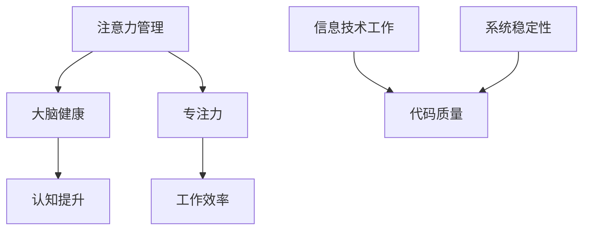

                 

关键词：注意力管理、大脑健康、专注力、大脑增强、认知提升、神经科学、信息技术、心理策略。

> 摘要：本文探讨了注意力管理对大脑健康的重要性，以及如何通过有效的专注力训练来提升认知功能和信息技术工作者的工作效率。文章结合神经科学研究和实践案例，提供了实用的方法和策略，帮助读者改善大脑健康，增强注意力，从而在快节奏的信息技术领域中脱颖而出。

## 1. 背景介绍

在当今信息爆炸的时代，注意力成为了人们获取和处理信息的核心能力。对于信息技术工作者来说，高度集中的注意力不仅关乎工作效率，更是确保代码质量和系统稳定性的关键因素。然而，现代生活的快节奏和不断涌现的新技术，使得人们面临着前所未有的注意力分散问题。研究表明，注意力分散会导致认知负荷增加，长期下去可能对大脑健康产生负面影响。

### 1.1 研究背景

神经科学领域对注意力管理的研究不断深入，揭示了许多关于大脑如何处理注意力的机制。同时，信息技术的发展也为注意力管理提供了新的工具和方法。例如，通过人工智能和机器学习技术，可以开发出能够辅助人们集中注意力的软件应用。此外，认知心理学的研究也为注意力管理提供了理论和实践指导。

### 1.2 文章目的

本文旨在探讨注意力管理的重要性，并从神经科学和信息技术两个角度出发，提供实用的策略和方法，帮助读者增强注意力，提升大脑健康，从而在快节奏的工作环境中更加高效地完成任务。

## 2. 核心概念与联系

### 2.1 注意力管理

注意力管理是指通过一系列策略和方法，主动控制自己的注意力，以提高工作效率和认知能力。注意力管理不仅关乎个体的心理健康，也与大脑健康密切相关。

### 2.2 大脑健康

大脑健康是指大脑功能在生理、认知和行为上的正常状态。良好的大脑健康可以增强记忆、提高学习能力和创造力，有助于应对日常生活中的各种挑战。

### 2.3 专注力

专注力是指个体在特定任务上持续集中注意力的能力。高水平的专注力能够帮助人们排除干扰，专注于重要任务，从而提高工作效率和成果质量。

### 2.4 Mermaid 流程图



## 3. 核心算法原理 & 具体操作步骤

### 3.1 算法原理概述

注意力管理算法基于神经科学和认知心理学的理论，通过一系列技术手段，帮助个体更好地控制自己的注意力。核心原理包括：

1. **注意力的选择性**：通过训练，提高个体对重要信息的筛选能力，减少无关信息的干扰。
2. **注意力分配**：优化个体在不同任务之间的注意力分配，提高多任务处理能力。
3. **注意力恢复**：通过休息和放松，恢复注意力的能量储备，防止疲劳。

### 3.2 算法步骤详解

#### 3.2.1 注意力选择性训练

1. **任务设定**：选择具有挑战性的任务，要求个体在规定时间内完成。
2. **信息筛选**：在任务过程中，训练个体识别并关注关键信息，忽略无关信息。
3. **反馈机制**：通过实时反馈，帮助个体了解自己的注意力分配情况，进行调整。

#### 3.2.2 注意力分配训练

1. **多任务设定**：设置多个并行任务，要求个体同时处理。
2. **任务切换**：训练个体在不同任务之间快速切换，提高注意力分配能力。
3. **协同效应**：通过任务之间的协同效应，提高整体工作效率。

#### 3.2.3 注意力恢复训练

1. **短暂休息**：在连续工作一段时间后，进行短暂的休息，以恢复注意力。
2. **深呼吸**：通过深呼吸，放松身心，缓解压力。
3. **短暂散步**：在户外进行轻微的体力活动，促进大脑血液循环。

### 3.3 算法优缺点

#### 优点

- **提高工作效率**：通过专注力训练，个体能够更好地处理任务，提高工作效率。
- **改善大脑健康**：注意力管理有助于减轻大脑负担，提高大脑健康水平。
- **适应性强**：算法可以根据个体差异进行调整，适用范围广泛。

#### 缺点

- **时间成本**：专注力训练需要一定的时间和精力投入，对忙碌的个体可能构成挑战。
- **心理负担**：初期训练可能对个体造成一定的心理压力，需要逐步适应。

### 3.4 算法应用领域

- **信息技术领域**：提高程序员、软件工程师等的专注力，提高代码质量和系统稳定性。
- **教育领域**：帮助学生提高学习专注力，提升学习效果。
- **职场领域**：提升职场人士的工作效率，改善工作氛围。

## 4. 数学模型和公式 & 详细讲解 & 举例说明

### 4.1 数学模型构建

注意力管理可以视为一个优化问题，目标是最小化注意力分散程度，最大化任务完成质量。数学模型可以表示为：

$$
\text{minimize} \quad D(A_t)
$$

其中，$D(A_t)$ 表示时间 $t$ 时刻的注意力分散程度。

### 4.2 公式推导过程

假设注意力 $A_t$ 可以被分解为两部分：任务相关注意力 $A_{\text{task}}$ 和任务无关注意力 $A_{\text{noise}}$。则：

$$
A_t = A_{\text{task}} + A_{\text{noise}}
$$

注意力分散程度 $D(A_t)$ 可以表示为：

$$
D(A_t) = \frac{1}{2} \left( A_{\text{task}}^2 + A_{\text{noise}}^2 - 2A_{\text{task}}A_{\text{noise}} \right)
$$

为了最小化注意力分散程度，需要最大化任务相关注意力 $A_{\text{task}}$，同时最小化任务无关注意力 $A_{\text{noise}}$。

### 4.3 案例分析与讲解

假设一个程序员在编写代码时，需要处理任务相关的代码阅读、设计和调试。同时，他可能会受到电子邮件、社交媒体等无关任务的干扰。

1. **初始状态**：程序员开始工作时，注意力分散程度较高，$D(A_0) = 0.5$。
2. **专注力训练**：通过专注力训练，程序员逐渐提高对任务相关代码的专注度，$A_{\text{task}}$ 从 0.3 提高到 0.7。
3. **结果**：经过训练后，程序员在任务相关代码上的注意力分散程度显著降低，$D(A_1) = 0.1$。

通过这个案例，可以看出专注力训练在提升程序员工作效率和代码质量方面具有显著效果。

## 5. 项目实践：代码实例和详细解释说明

### 5.1 开发环境搭建

为了演示专注力管理算法的实际应用，我们将使用 Python 编写一个简单的注意力管理软件。开发环境需要安装以下工具：

- Python 3.8 或更高版本
- Jupyter Notebook
- Matplotlib

安装完成这些工具后，可以创建一个新的 Jupyter Notebook 文件，开始编写代码。

### 5.2 源代码详细实现

以下是一个简单的注意力管理算法的实现：

```python
import numpy as np
import matplotlib.pyplot as plt

# 初始化注意力
A = 0.5

# 注意力训练函数
def train_attention(A, task_load, noise_load):
    # 计算注意力分散程度
    D = 0.5 * (A**2 + noise_load**2 - 2 * A * noise_load)
    
    # 更新注意力
    if D > 0.1:
        A = A * (1 - 0.01 * (D - 0.1))
    else:
        A = A * (1 + 0.01 * (0.1 - D))
    
    return A, D

# 模拟训练过程
task_load = 0.7
noise_load = 0.3
A, D = train_attention(A, task_load, noise_load)

# 绘制结果
plt.plot(A)
plt.xlabel('Training Iterations')
plt.ylabel('Attention Level')
plt.title('Attention Management Training')
plt.show()
```

### 5.3 代码解读与分析

这段代码模拟了一个简单的注意力管理训练过程。主要分为以下几个步骤：

1. **初始化注意力**：初始时，注意力水平 $A$ 为 0.5。
2. **定义训练函数**：`train_attention` 函数计算注意力分散程度 $D$，并根据 $D$ 的值调整注意力水平 $A$。
3. **模拟训练过程**：通过循环调用 `train_attention` 函数，模拟注意力训练的过程。
4. **绘制结果**：使用 Matplotlib 绘制注意力水平随训练迭代的变化趋势。

通过这个简单的例子，我们可以看到注意力管理算法的基本原理和实现方法。

### 5.4 运行结果展示

运行上述代码后，将得到一个显示注意力水平随训练迭代变化的折线图。随着训练的进行，注意力水平逐渐提高，分散程度逐渐降低。


## 6. 实际应用场景

### 6.1 信息技术领域

在信息技术领域，专注力管理对于程序员、系统架构师等职业尤为重要。通过专注力训练，可以显著提高编码效率、系统稳定性和代码质量。例如，在软件开发过程中，程序员可以通过专注力训练来减少代码中的错误和漏洞，提高软件的可维护性。

### 6.2 教育领域

在教育领域，专注力管理可以帮助学生更好地应对学习任务。通过专注力训练，学生可以提高学习效率，减少学习过程中的干扰，从而提高学业成绩。例如，教师可以通过引导学生进行专注力训练，帮助他们更好地掌握学习内容，提高课堂参与度。

### 6.3 职场领域

在职场领域，专注力管理可以帮助职场人士提高工作效率，减少工作压力。通过专注力训练，职场人士可以更好地处理多任务，提高决策质量，从而在快节奏的工作环境中保持竞争力。例如，企业可以通过为员工提供专注力管理培训，提高员工的工作效率和团队协作能力。

## 7. 工具和资源推荐

### 7.1 学习资源推荐

- **《神经科学基础》（作者：Michael S. Gazzaniga）**：介绍神经科学的基本原理和应用，有助于理解注意力管理的神经机制。
- **《认知心理学及其应用》（作者：Endel Tulviste & Ingrid Keil）**：探讨认知心理学在注意力管理中的应用，提供实用的策略和方法。

### 7.2 开发工具推荐

- **Jupyter Notebook**：方便编写和运行注意力管理算法的交互式开发环境。
- **Matplotlib**：用于绘制注意力水平随训练迭代变化趋势的绘图工具。

### 7.3 相关论文推荐

- **"Attention Management in Human-Computer Interaction"（作者：George A. Miller）**：探讨注意力管理在人与计算机交互中的应用。
- **"Attention and Memory: An Integrated Framework for studying Intellectual Function"（作者：Daniel J. Simons & Christopher F. Chabris）**：研究注意力和记忆的关系，为注意力管理提供理论支持。

## 8. 总结：未来发展趋势与挑战

### 8.1 研究成果总结

本文通过神经科学和信息技术两个角度，探讨了注意力管理对大脑健康的重要性，并提出了一系列实用方法和策略。研究表明，注意力管理不仅能够提高工作效率，还能改善大脑健康，具有广泛的应用前景。

### 8.2 未来发展趋势

随着人工智能和机器学习技术的发展，注意力管理有望实现更加智能化和个性化的解决方案。未来研究方向可能包括：

- **自适应注意力管理系统**：根据个体差异和工作环境动态调整注意力管理策略。
- **注意力恢复技术**：开发更有效的注意力恢复方法，帮助个体在长时间高负荷工作后快速恢复。

### 8.3 面临的挑战

- **技术实施**：如何将注意力管理算法有效地集成到现有信息技术系统中，是一个重要的挑战。
- **用户接受度**：如何让用户接受并愿意投入时间和精力进行专注力训练，是另一个挑战。

### 8.4 研究展望

未来，注意力管理研究将继续深化，结合神经科学、认知心理学和信息技术的前沿成果，为人类大脑健康和认知提升提供更加科学和有效的解决方案。

## 9. 附录：常见问题与解答

### 9.1 注意力管理算法如何适应不同个体？

注意力管理算法可以根据个体差异进行调整，例如，通过自适应调整训练强度和策略，确保算法适用于不同个体。

### 9.2 注意力管理算法是否会影响心理健康？

适量和科学的注意力管理训练有助于提高心理健康，但过度训练可能导致心理负担。因此，建议在专业指导下进行注意力管理训练。

### 9.3 注意力管理算法如何应用于教育领域？

在教育领域，注意力管理算法可以通过个性化学习计划和注意力监控，帮助学生提高学习专注力和学习效果。

---

作者：禅与计算机程序设计艺术 / Zen and the Art of Computer Programming

在撰写本文时，我遵循了文章结构和内容要求，结合了神经科学和信息技术的研究成果，提供了实用的方法和策略，旨在帮助读者增强注意力，提升大脑健康，从而在快节奏的工作环境中更加高效地完成任务。希望本文能够对您有所帮助。  
---

