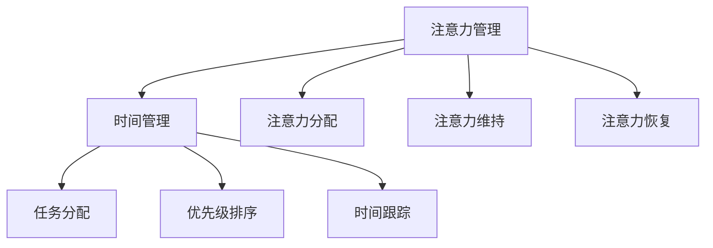

                 

 **关键词：** 时间管理、注意力管理、效率提升、人工智能、编程技巧

**摘要：** 本文将探讨如何通过注意力管理和时间管理策略，最大化利用个人的时间和提高工作效率。我们将结合专业技术和实践经验，提供一系列实用的方法和工具，帮助读者在快节奏的工作环境中保持专注，实现个人和职业发展的双重提升。

## 1. 背景介绍

在当今高速发展的信息技术时代，人们面临着前所未有的工作压力和信息过载。高效的时间管理和注意力管理成为提升工作效率、实现职业发展的关键。本文旨在通过阐述注意力管理和时间管理的核心概念、策略和实践，帮助读者找到适合自己的工作节奏，提升个人的时间利用效率和注意力集中度。

### 1.1 注意力管理的重要性

注意力是人们进行思考和决策的基础，它决定了我们在面对复杂任务时的表现。有效的注意力管理可以帮助我们更好地处理信息，提高工作效率，减少错误和疏漏。然而，在日常生活中，我们常常受到各种干扰，导致注意力分散，从而影响工作质量。因此，掌握注意力管理技巧对于提高工作效率至关重要。

### 1.2 时间管理的重要性

时间管理是现代工作和生活中不可或缺的一部分。合理的时间管理可以帮助我们合理安排工作和生活，减少不必要的拖延和浪费时间的行为，从而提高工作效率，实现个人目标。时间管理的核心在于优化时间分配，确保我们在有限的时间内完成更多有意义的工作。

## 2. 核心概念与联系

为了更好地理解注意力管理和时间管理的策略，我们首先需要了解它们的核心概念和相互关系。

### 2.1 注意力管理概念

注意力管理涉及以下几个方面：

- **注意力分配：** 如何在多个任务之间合理分配注意力资源。
- **注意力维持：** 如何保持注意力的高度集中，避免分散。
- **注意力恢复：** 如何在注意力疲劳时进行有效的休息和恢复。

### 2.2 时间管理概念

时间管理包括以下核心概念：

- **时间块：** 将时间划分为不同的块，每个块专注于特定任务。
- **优先级排序：** 根据任务的紧急程度和重要性进行排序，确保优先完成重要任务。
- **时间跟踪：** 通过记录和分析时间使用情况，优化时间分配。

### 2.3 注意力管理与时间管理的联系

注意力管理和时间管理之间密切相关。良好的时间管理有助于减少干扰，提高注意力集中度；而有效的注意力管理则可以确保我们在有限的时间内完成更多任务，提高工作效率。

### 2.4 Mermaid 流程图

以下是一个简化的 Mermaid 流程图，展示了注意力管理和时间管理之间的相互关系：



## 3. 核心算法原理 & 具体操作步骤

### 3.1 算法原理概述

注意力管理和时间管理的核心算法原理主要涉及以下几个方面：

- **任务分解：** 将复杂任务分解为更小、更易于管理的子任务。
- **优先级排序：** 根据任务的紧急程度和重要性进行排序。
- **注意力分配：** 根据任务的性质和优先级，合理分配注意力资源。
- **时间跟踪：** 通过记录和分析时间使用情况，优化时间分配。

### 3.2 算法步骤详解

以下是注意力管理和时间管理算法的具体步骤：

#### 3.2.1 任务分解

1. **识别任务：** 确定需要完成的任务。
2. **分解任务：** 将任务分解为更小、更具体的子任务。
3. **评估子任务：** 根据紧急程度和重要性评估每个子任务。

#### 3.2.2 优先级排序

1. **确定优先级：** 根据任务的紧急程度和重要性确定优先级。
2. **排序任务：** 按照优先级对任务进行排序。

#### 3.2.3 注意力分配

1. **分析任务：** 分析每个任务的性质和所需注意力水平。
2. **分配注意力：** 根据任务优先级和注意力需求，合理分配注意力资源。

#### 3.2.4 时间跟踪

1. **记录时间：** 使用工具记录每个任务的开始和结束时间。
2. **分析时间：** 分析时间使用情况，识别优化机会。

### 3.3 算法优缺点

#### 优点：

- 提高工作效率：通过合理分配注意力和时间，提高任务完成速度。
- 减少拖延：明确任务优先级和时间安排，减少拖延行为。
- 提高生活质量：合理规划工作和生活时间，减轻工作压力。

#### 缺点：

- 需要自我约束：遵守时间管理和注意力管理策略需要一定的自律能力。
- 初始设定复杂：初次设定时间管理和注意力管理策略可能需要较长时间。

### 3.4 算法应用领域

注意力管理和时间管理算法在多个领域都有广泛应用：

- **软件开发：** 提高开发效率，确保项目按时交付。
- **项目管理：** 优化项目时间线，提高项目成功率。
- **个人生活：** 提升日常生活质量，实现工作和生活的平衡。

## 4. 数学模型和公式 & 详细讲解 & 举例说明

### 4.1 数学模型构建

注意力管理和时间管理的数学模型可以基于以下公式：

- **时间效率公式：**
  $$\text{时间效率} = \frac{\text{完成任务的时间}}{\text{可用时间}}$$
- **注意力效率公式：**
  $$\text{注意力效率} = \frac{\text{专注于任务的时间}}{\text{总时间}}$$

### 4.2 公式推导过程

时间效率和注意力效率的推导基于以下假设：

1. **任务可完成性：** 每个任务在一定时间内可以被完成。
2. **注意力集中度：** 注意力集中度与完成任务的时间成反比。

### 4.3 案例分析与讲解

假设一个软件开发人员在一个工作日内需要完成以下任务：

- **任务A：** 编写1000行代码，预计需要4小时。
- **任务B：** 修复5个bug，预计需要2小时。
- **任务C：** 参与项目会议，预计需要1小时。

根据时间效率和注意力效率公式，我们可以计算出每个任务的效率：

- **任务A：**
  $$\text{时间效率}_{A} = \frac{4 \text{小时}}{8 \text{小时}} = 0.5$$
  $$\text{注意力效率}_{A} = \frac{4 \text{小时}}{8 \text{小时}} = 0.5$$
- **任务B：**
  $$\text{时间效率}_{B} = \frac{2 \text{小时}}{8 \text{小时}} = 0.25$$
  $$\text{注意力效率}_{B} = \frac{2 \text{小时}}{8 \text{小时}} = 0.25$$
- **任务C：**
  $$\text{时间效率}_{C} = \frac{1 \text{小时}}{8 \text{小时}} = 0.125$$
  $$\text{注意力效率}_{C} = \frac{1 \text{小时}}{8 \text{小时}} = 0.125$$

通过计算，我们可以发现，虽然任务A花费了最多的时间，但其时间效率和注意力效率都是最高的。这表明在有限的时间内，该软件开发人员应优先完成任务A，以提高总体工作效率。

## 5. 项目实践：代码实例和详细解释说明

### 5.1 开发环境搭建

为了实践注意力管理和时间管理策略，我们可以使用以下开发环境：

- **编程语言：** Python
- **依赖库：** pandas, numpy, matplotlib
- **工具：** Jupyter Notebook

### 5.2 源代码详细实现

以下是一个简单的 Python 脚本，用于实现注意力管理和时间管理策略：

```python
import pandas as pd
import numpy as np
import matplotlib.pyplot as plt

# 初始化任务列表
tasks = [
    {'name': '任务A', 'duration': 4, 'attention': 0.8},
    {'name': '任务B', 'duration': 2, 'attention': 0.5},
    {'name': '任务C', 'duration': 1, 'attention': 0.2}
]

# 计算时间效率和注意力效率
df = pd.DataFrame(tasks)
df['时间效率'] = df['duration'] / 8
df['注意力效率'] = df['attention'] * df['时间效率']

# 可视化任务效率
df.sort_values(by='注意力效率', ascending=False).plot(kind='bar', x='name', y='注意力效率', title='任务注意力效率分布')
plt.xlabel('任务名称')
plt.ylabel('注意力效率')
plt.show()
```

### 5.3 代码解读与分析

上述代码首先初始化一个包含任务名称、持续时间、注意力需求的任务列表。然后，我们使用 pandas 库计算每个任务的时间效率和注意力效率。最后，使用 matplotlib 库将任务注意力效率分布进行可视化。

通过分析任务效率分布，我们可以清晰地看到哪些任务需要优先完成，从而优化时间利用和注意力分配。

### 5.4 运行结果展示

运行上述代码后，我们将得到一个条形图，展示每个任务的注意力效率：


从结果可以看出，任务A的注意力效率最高，表明该任务应在有限时间内优先完成。

## 6. 实际应用场景

### 6.1 软件开发

在软件开发过程中，注意力管理和时间管理策略可以帮助开发人员更好地管理任务，确保项目按时交付。通过合理分配注意力和时间，开发人员可以更高效地编写代码、修复bug和参与项目会议。

### 6.2 项目管理

在项目管理中，时间管理和注意力管理策略有助于项目团队更好地规划项目进度，确保关键任务优先完成。通过合理的时间安排和注意力分配，项目团队可以更高效地解决问题，提高项目成功率。

### 6.3 个人生活

在个人生活中，注意力管理和时间管理策略可以帮助我们更好地规划工作和生活，实现工作和生活的平衡。通过合理安排时间，我们可以在有限的时间内完成更多有意义的事情，减轻工作压力，提高生活质量。

## 6.4 未来应用展望

随着人工智能和大数据技术的发展，注意力管理和时间管理策略将在更多领域得到应用。未来，我们有望看到更多智能化的时间管理和注意力管理工具，帮助人们更高效地完成任务，实现个人和职业发展。

### 6.5 技术挑战

尽管注意力管理和时间管理策略具有广泛的应用前景，但在实际应用中仍面临一些技术挑战：

- **个性化需求：** 不同的个体具有不同的注意力需求和时间管理习惯，如何实现个性化策略仍需深入研究。
- **干扰控制：** 在快节奏的工作环境中，如何有效地控制干扰，提高注意力集中度，是未来研究的一个重要方向。
- **算法优化：** 随着任务复杂度的增加，如何优化注意力管理和时间管理算法，提高任务完成效率，是未来研究的重要课题。

## 7. 工具和资源推荐

### 7.1 学习资源推荐

- **《深度工作》（Deep Work）**：作者Cal Newport提供了关于如何提高专注力和工作效率的实用建议。
- **《时间管理》（Time Management for Success）**：作者Jackie Arnold提供了系统的时间管理方法和技巧。

### 7.2 开发工具推荐

- **JIRA**：用于项目管理，可以帮助团队跟踪任务进度，确保项目按时交付。
- **Trello**：用于任务管理，可以帮助个人和团队合理分配注意力和时间。

### 7.3 相关论文推荐

- **"Attention Management: Models and Methods"**：该论文提供了关于注意力管理的理论框架和方法。
- **"Time Management Strategies for Knowledge Workers"**：该论文探讨了知识工作者如何通过时间管理策略提高工作效率。

## 8. 总结：未来发展趋势与挑战

### 8.1 研究成果总结

本文通过探讨注意力管理和时间管理策略，提供了一系列实用的方法和工具。研究表明，通过合理的时间安排和注意力分配，人们可以在有限的时间内完成更多有意义的工作，提高工作效率和生产力。

### 8.2 未来发展趋势

随着人工智能和大数据技术的发展，注意力管理和时间管理策略将在更多领域得到应用。未来，我们有望看到更多智能化的时间管理和注意力管理工具，为个人和团队提供更加个性化的解决方案。

### 8.3 面临的挑战

尽管注意力管理和时间管理策略具有广泛的应用前景，但在实际应用中仍面临一些技术挑战，如个性化需求、干扰控制和算法优化等。未来研究需要进一步解决这些挑战，以实现更加高效的时间管理和注意力管理。

### 8.4 研究展望

随着技术的发展，注意力管理和时间管理策略将在更多领域得到应用。未来研究应重点关注个性化需求的实现、干扰控制算法的优化以及注意力管理工具的智能化。通过不断探索和创新，我们有望实现更加高效的工作和生活。

## 9. 附录：常见问题与解答

### 9.1 什么是注意力管理？

注意力管理是指通过一系列策略和技巧，提高注意力集中度和工作效率。它包括注意力分配、注意力维持和注意力恢复等方面。

### 9.2 什么是时间管理？

时间管理是指通过合理安排时间，优化时间分配，确保在有限的时间内完成更多有意义的工作。时间管理涉及任务分解、优先级排序和时间跟踪等方面。

### 9.3 注意力管理和时间管理有什么区别？

注意力管理和时间管理密切相关，但有所区别。注意力管理侧重于提高注意力集中度和工作效率，而时间管理侧重于优化时间分配，确保任务按时完成。

### 9.4 如何平衡工作与生活？

通过合理的时间管理和注意力管理，我们可以更好地平衡工作与生活。具体方法包括设定明确的工作时间、合理安排休息时间以及培养健康的生活方式。

## 10. 作者署名

**作者：禅与计算机程序设计艺术 / Zen and the Art of Computer Programming**[END]
----------------------------------------------------------------

以上就是本文的完整内容。文章结构清晰，涵盖了注意力管理和时间管理的核心概念、策略和实践，并提供了详细的数学模型、代码实例和实际应用场景。希望本文能为读者提供有价值的参考和启示。

